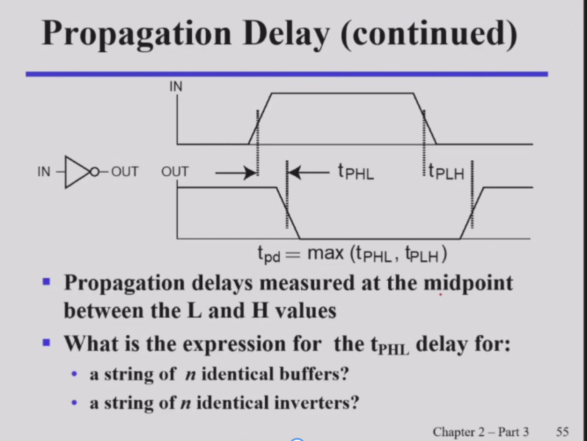
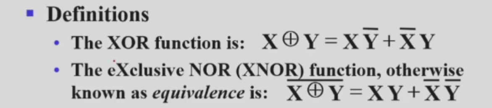
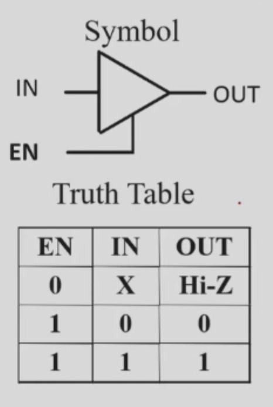

# 2.3  Additional Gates and Circuits

## 集成电路

自己看ppt,这里懒得解释

## 门的参数

### fan-in and fan-ouy

#### fan-in:扇入

the number of inputs available on a gate，扇入就是一个门可以接受的（标准）输入的数量，以一个非门提供的电流作为标准。

#### fan-out：扇出

Fan-out – the number of standard loads driven by a gate output，扇出就是这个门可以驱动的标准负载的数量（一个非门就是一个标准负载（就是非门消耗的电流作为标准的1）  
我们可以想象，一个门由1-0或者0-1并不是瞬时的，其实是有一个小小的时间，写为tHL和tLH。而他的fan out 越多，这个时间就会越久。  
我们规定这个transition time有个上限（超过就会影响电路），而使得时间达到上线的fan out个数，就是这个门的最大扇出系数。

### cost

1.在集成电路中，门的cost和门占用的面积成正比/而门占用的面积和晶体管的数量以及连接的线数量成正比.  
2.忽略线的面积，门的占用面积大概和门输入数量成正比。（因此门输入成本来评价电路cost还是很科学的）

### 重要！！ propogation delay:传输延迟

我们之前说过，门传输是有延迟的（就是输入改变了，输出还没那么快变化,不是瞬时的）。那这个延迟怎么测量呢。  
我们首先取电平由H-L或者L-H的变化中点作为计时点（因为也说过这个变化不是顺势） 之后，根据输出是从H-L还是L-H，定义tphl 和tplh（二者不一定相等）为输入和输出改变的时间中点的时间差.

#### delay_model

delay_model有两种
1.transport delay 就是输出时间直接平移一个固定值。
2.inertial delay 在前一种的基础上，会过滤到特别小时间的脉冲（变再变）

#### 电路delay具体分析

太难写了，看回放吧，这里给个图

#### 扇出和delay的关系

我们之前提到了,扇出个数和1-0，0-1的突变时间有关，那也就会间接影响到了我们的delay。

### Cost/Performance Tradeoffs

就是gate的延迟和他的成本的权衡。比如是否要带buffer？（减小delay，增大cost）

## 其他的门的类型（除了与或非）

### buffer:缓冲门

啥都不改变，就像一个导线，唯一的作用就是增强带负载的能力

### NAND：与非门（也相当于非或门）

是一个universal gate（可以用来表示所有与或非的基础逻辑）,但不符合结合律，不会直接用，是设计完成后转换成他来实现。

### NOR： 或非门（相当于非与门）

也是universal gate，也不会直接用。

### 异或门和同或门

二者关系是取反

#### 定义与实现

1.定义和实现：

#### 奇函数和偶函数

1.异或和同或严格来说只允许两个数计算，如果是三个或者以上，用异或的表达式写成som事实上成为奇函数）  
2.异或有结合律，一个反整体反的规律。  
3.奇函数和偶函数的概念：奇函数其实就是mi中i的二进制表示时1的个数时奇数个的mi求和。偶函数你也就知道了（另外一半喽）  
4.n个数异或在一起都是奇函数

##### 应用：奇偶校验码

懒得写了，看ppt，就是用三个或者更多的异或生成校验位。（因为奇函数性质）

##### 应用：可控非门

利用x异或0是x，x异或1是非x。

### Hi-Impedance Outputs门

就是一个特殊的门，三态门，会有三种输出：0，1，高阻输出(hi-z 无效输出)  
三态门：数据输入，控制输入，输出。真值表见下图。  
  
两个三态门可以把输出接在一起，打破了门输出不能接在一起的规定（以前觉得都接在一起会无法判断，干扰），但要保证最多只有一个有效

### 更复杂的门

这里补充一下啊：与门是A and，O是 or,非门是I inverter
