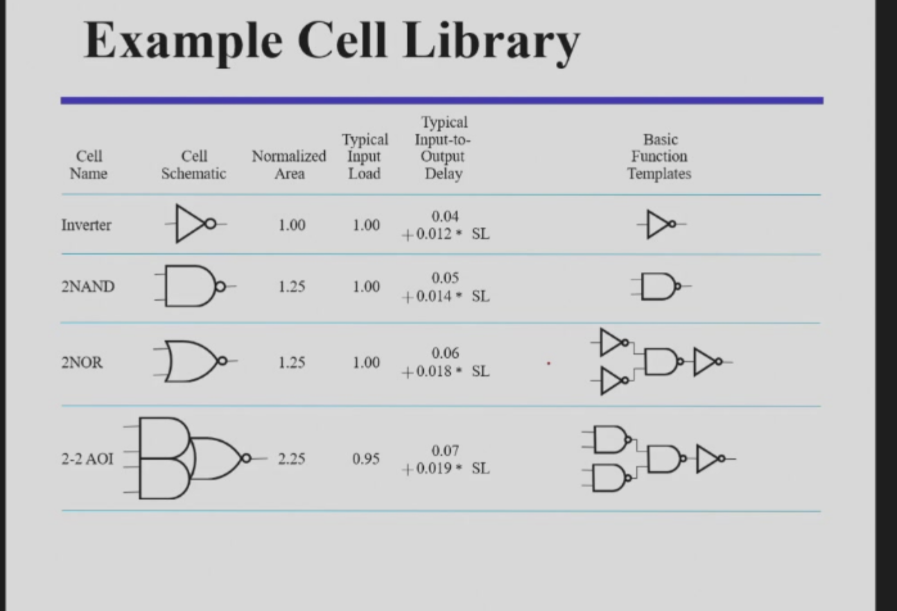

# 实现技术和逻辑设计 (Implementation Technology and Logic Design)

今天开始，我们就要来自己设计啦！

---

## 分层设计 (Hierarchical Design)

分层设计是将复杂问题分解为小模块并逐步实现的过程。具体步骤如下：

1. **分层设计**：将输入到输出的过程分成更小的块，不断重复，直到得到基础模块。
2. **模块化复用**：将小的问题设计为可复用的函数或模块，类似于 C 语言中的库。

---

## 如何设计一个基础模块？

### 设计流程

1. **Specification**：明确电路规格，包括需求、输入和输出。
2. **Formulation**：根据需求写出真值表和布尔方程。
3. **Optimization**：通过两级或多级优化生成逻辑图或网表。
   - 在多函数（多布尔方程）的情况下，考虑是否可以设计被多个函数公用的模块。
   - 权衡门输入的成本与速度（传输延迟、性能）。
4. **Technology Mapping**：将逻辑图或网表映射到具体的实现方式（如芯片），例如仅使用非门和与非门。
5. **Verification**：验证电路是否符合规格且无逻辑错误。
6. **例子**：将 BCD 转换为 +3 码。

---

### 芯片设计风格 (Chip Design Styles)

根据性能、功耗和销量需求，芯片设计有以下几种风格：

- **Full Custom Design**：从头开始设计，适合高性能、高功耗、销量高的芯片。
- **Standard Cell**：使用标准单元设计，适合中等性能、中等功耗、销量中等的芯片。
- **Gate Array**：基于阵列设计，适合低功耗、低性能、销量低的芯片。

---

### 单元库 (Cell Library)

单元库是设计芯片的基础组件集合，包含各种标准单元（如与非门、或非门、或门等）。  
典型单元特性包括：

- **面积 (Area)**
- **输入负载 (Input Loads)**
- **延迟 (Delay)**

---

### 映射到与非门 (Mapping to NAND Gates)

将所有逻辑门转换为与非门的具体步骤如下：

1. 将所有门转换为与非门和非门。
2. 将非门推过扇出点。
3. 消除成对的非门（此步骤也可以在布尔表达式阶段完成）。
4.为啥要用与非门，因为实际设计的时候，与非门其实很好实现，延迟也比较小，占用空间也小，功能还多。  
**例子**：请参考 PPT。

---

### 映射到或非门 (Mapping to NOR Gates)

映射到或非门的过程与映射到与非门类似，这里不再赘述。

---

### 验证 (Verification)

验证电路正确性的方法包括：

1. **真值表**（人工验证）：通过手动检查真值表验证电路功能。
2. **布尔表达式**（人工验证）：通过简化和分析布尔表达式验证逻辑。
3. **HDL 代码仿真**（机器验证）：通过硬件描述语言（HDL）代码进行仿真，尽可能涵盖所有情况以排查错误。
