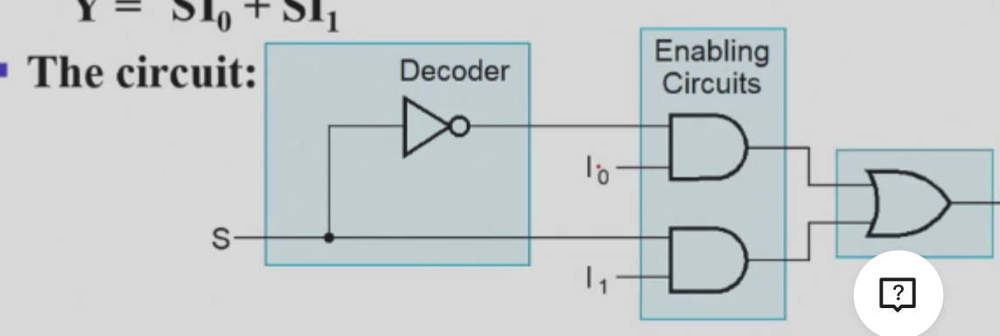
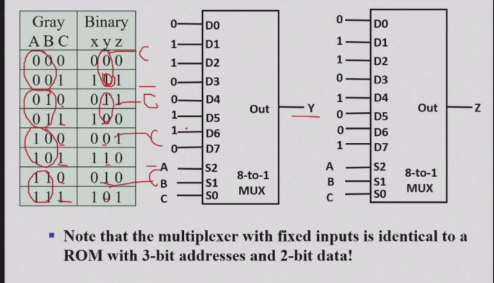
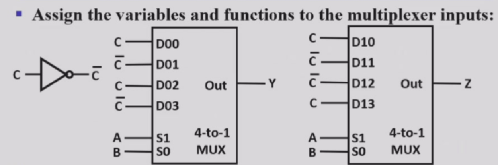

# combinational logic：介绍一些基本模块

## redimentary logic function

这个没什么好说的，就是基本的与或非。

## multi-bit Rudimentary function

- 多位输入：总线：总线就是把好几根线的输出接起来，形成多位输出
- 总线可以被拆成多个单独的，或者几个单独的组成分总线

## enabling function

1.enable：使能，使能就是一个开关，当使能信号为1时，输出才有效，否则输出无效。  
2. 这个实现一般是一个固定信号值输入来实现，比如给与门输入一个1，就有效。给输入一个0，就无效（因为无论另一个是什么，输出都是0）
3. 这种用来阻止输出时候的结果（比如上面的一直输出0），可以是0，1，或者Hi-z

## decoding 重要

1.定义 简单来说，译码器就是把一个类型的码，变成另一个类型的  
2.译码器能把n位输入最多变成2^n种输出。比如2-4译码器，就是把2位输入变成4位输出，还有3-8译码器。  

### 2-4译码器

我们用2-4译码器来进行举例。  
2-4译码器就是把2位输入变成4位输出，比如输入是00，01，10，11输出是1000，0100，0010，0001。
我们可以惊奇的发现，其实每个输入的函数都是一个minterm（这里的输出指的是D0，D1,D2,D3，其实这就是译码器的原理导致的，想一想就明白）

### 3-8译码器

1.这里为什么要讲这个呢。是因为我想讨论一个成本的问题。
1.1 如果粗暴的实现一个3-8译码器，那就是8个与门，每个与门3个输入，24个输入。这个好像不算大，但是如果变成4-16乃至更高呢，那就是一个灾难了。  
1.2 所以，我们有一个更巧妙的方法。我们考虑到，译码器的输出本质都是minterm，所以我们可以把大的译码器拆成小的译码器，之后再接一个小的与门啊。 比如：3-8译码器就可以拆成一个1-2和一个2-4，之后再接8个两输入与门。这样就减少了很多。  
1.3：比较：7-128的译码器，如果直接minterm来，那就是7*128的成本。但是我们如果拆成3-8和4-16，那就是7*8+4*16+2*128=56+64+256=356，这样就节省了很多。

### 升级，加入使门

1.比如加入一个使门连着输出，当1的时候，译码器就工作，位为0时，就无效。

### 应用

1.当需要最终输出写成一堆最小项的和的时候，就可以用译码器。只要把最小项对应数值的输出口接到或门就行了。**这样我们就可以用或门实现了任何一个函数**。  
2. FEC检错
3. segment coder ，就是那种显示屏上的线段组成的数字，就是用译码器实现的，7段显示器。
4. 上面讲到的2-4，3-8都是

## 编码器

其实就是译码器反操作  
例子：十进制变成BCD码：可以不用画真值表哦，直接想第三位什么时候是一，第二位什么时候是一，第一位什么时候是一就行。有缺点：**就是输入的D1-D10只能有一根线为1，否则就会乱**.  
所以，升级！：优先编码器--设置优先级，比如D1-D10都为1，那么输出是D1，而不是D10。

## 选择器

### 二选一选择器

1.选择器就是把多个输入变成一个输出，比如，我们选择一个输入，输出就是那个输入。
他一般会有2的n次方个输入和一个选择的输入，从这2的n次方个选择一个输出。

2.而二选一译码器是最简单的
s=0时，输出0，s=1时，输出1.

### 2的n次方选一呢

1.我们就可以联系到n->2的n次方译码器啦，因为译码器输出只会有一个为1。  
2.选择器结构：译码器+2的n次方个与门组+或门

3.multiplexer width expansion：宽度扩展，就是多位的选择，比如选一个四位数出来，那就是对每一位分别进行一个选择操作

### 其他选择器设置

#### 使用三态门

用三态门替代与或结构，门输入成本更低哦

#### 分级处理

就是四选二，二选一,输入成本更低哦（相当于选每一位）

### 应用场景

1.也可以像或门加译码器一样实现任何一起逻辑函数：举例：greycode-binarycode,就是把真值表的输出数据输入上，而把真值表的输入接在选择输入上。（LUT）

2.香浓扩展定理

#### greycode-binarycode

别看这只是一个例子，其实蕴含优化的奇妙方法

1.常规做法  
1.1 先写出对应的真值表  
1.2 把greycode调整成000-111的顺序  
1.3 然后把gerycode作为三位输入，binary的每一位作为分别输出。之后经过一个八选一的选择器就好了  

2.优化做法
我们想一想，能不能用四选一的选择器呢？？？  
其实可以，我们把AB固定，考察C和x,y,z关系，不难发现，只有两种关系，C和C反。  
由此，我们是不是可以把ab作为选择的输入，而C和非作为被选择的东西，这样就是4选1的了！。

3.这里补充一下：格雷码构造方法：移位异或

## 加法器

加法器就是把两个数相加，然后输出。

### 基础：本位加法器（半加器）

半加器最简单的公式是S=x异或y，C=x与y。
但其实也有很多种实现方法

### 全加器

全加器就是要比半加器多考虑一个进位，当然，这里有一些化简小技巧。就是C可以使用之前的异或和进位。
x+y carry generate//x 异或 y 进位传递函数，这个和之前的化简关联很大。

### 四位加法器

就是每一个全加器（半加器）输出的进位成为下一个的输入。像一个链条连在一起。  
但这个电路有个问题，最长路径太太太长了。（进位->下一级->进位....）  

那怎么改进呢？？  
**carry lookahead**
我们知道，每一位的异或和与操作是直接得到的，只有进位是需要之前的东西（ppt的G P C ）,那我们直接用每一位的异或和与来弄，这样传播就短了（就是可以拿前面所有位的异或和与的结果）这就是个二级门关系！
成本增加，延迟降低。

### 十六位加法器

如果还是上面那种，要用的门就太多了，太复杂了。因此我们考虑四位加法器。  
十六位加法器就是把四位加法器连在一起，这样，我们只需要考虑进位，而不用考虑每一位的进位了。  
就是四个四位加法器分别负责0-3，4-7，8-11，12-15这4个四位数。把每一个加法器当一位看待，其实就是四个小四位加法器，组成了一个大的！
