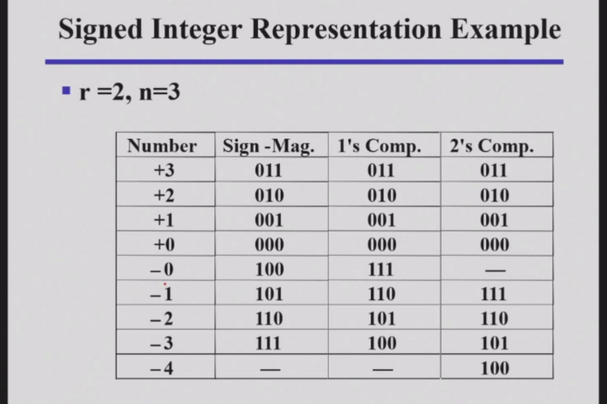
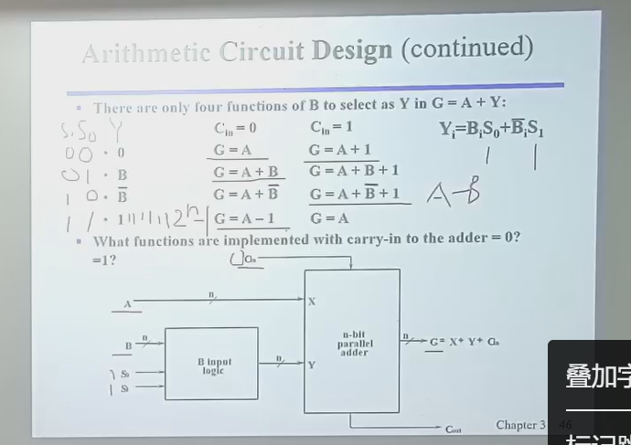

# 计算模块

其实这一块开始时是之前的加法器，但我不小心写错了，就从减法器开始写吧。

## 减法器

有很多人说，减法不就是加法变成负数吗？很抱歉，计算机里不知道啥叫负数，也不会负数加法。

### 无符号的减法

1. **初步想法**  
   当 `m > n` 时，直接减去就好了；但当 `m < n` 时，就需要借位。借位相当于加一个 `2^n`，最后还要用 `2^n` 减去计算的结果，得到绝对值，再加负号。但这太麻烦了吧。

2. **补码的引入**  
   补码应运而生！用补码可以简化计算过程：  
   - 把 `m` 和 `n` 都变成补码。
   - 然后相减。
   - 再把结果变成补码，最后取反。

#### 补码

1. **定义**  
   补码有两种：
   - **1's complement（反码）**：`2^n - 1 - N`
   - **2's complement（补码）**：`2^n - N`

2. **本质**  
   减去一个数就相当于加上它的补码（在模意义下）。

3. **求补码的方法**  
   - 补码就是反码加一。  
   - 或者，从右开始到左的第一个 `1` 之前都保留，后面的都求反。

4. **如何使用补码？**  
   - **补码的减法**：  
     首先给 `m - n` 加上 `2^n`（即给减数求补码后加到被减数上）。  
     - 如果 `m > n`，结果不受影响。  
     - 如果 `m < n`，会得到 `n - m` 的补码，再求一次补码即可，记得加负号。

5. **进一步优化**  
   能不能把符号位一起考虑进去呢？

---

#### 有符号的整数的减法

1.有符号就是第一位1 0表示正负

2.他能表示的范围和无符号的整数一样大

3.补码：如果是正数，那么补码就是原码，如果是负数，那么补码就是用1’scomplement再加1（2complement）

4.来个小李子

我们可以发现，反码还有个+-0的问题，但补码就解决了这个麻烦

5.第一种方法：不用补码，直接算

- 同时，我们发现当三个符号正（0）为奇数时（三个符号：两个数+- 和运算的加减），可以化成正+正或者负数+负数-都可以进行符号位不变，后面相加（考虑溢出）
- 而正为偶数时，都会变成正-负或者相反（同号数相减）

6.还是好麻烦

#### 第二种方法，用补码代表数(说白了，存储数用的就是补码)

则加法，减法都可以直接带着符号位算，
运算规则总共就两条：[a+b]的补码=[a]的补码+[b]的补码,[-a]的补码=[a]的补码整体（整体！）取反+1，还有一个规则，减去一个数，相当于加上他的补码。这也是补码能进行运算的一个根本原因，(同时，补码解决了反码的一个+-0的问题)  
1.加法，直接把符号位算上，把补码直接加起来，把最高位扔掉  
2.减法，变成加上被减数的补码（符号位要变一下）。计算结果把最高位扔掉  
3.记得这两个算出来的都还是补码（因为此时都用补码存储了）
4.电路实现可以用异或门和加法器实现（ppt）

#### 溢出问题

做一个异或判断，我们知道只有同号数相加和异号数相减才会出现溢出，而怎么判断呢，只要看数值位最高位进位和符号位的进位是否相同，如果相同，则溢出，否则，则没有溢出（异或）

### 计算电路优化(ALU设计)

