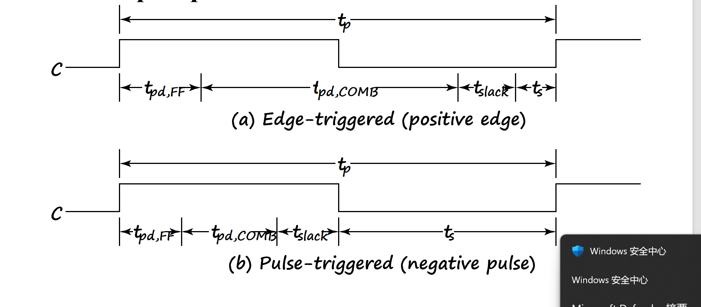

# 时序逻辑电路 Sequential Logic Circuits

定义：时序逻辑电路就是输出不仅依赖于当前输入，还依赖于过去的输入。

---

## 时序逻辑电路第一部分：Storage Elements and Sequential Circuit Analysis

### 简述时序电路

1. **组成**：时序电路由存储元件和组合逻辑电路组成。  
   1. **存储元件**：存储元件就是用来存储信息的。存储元件分为：存储器、寄存器、存储器单元。  
   2. **组合逻辑电路**：在时序逻辑电路中，组合逻辑电路有 `input`、`output`、`state`、`next_state` 等功能。组合逻辑电路的输出不仅依赖于当前输入，还依赖于过去的输入。可以看这个图：  
        
   3. 可以看到，有两种 `output` 形式：  
      - **Mealy**：输出依赖于当前输入和状态。  
      - **Moore**：输出只依赖于状态。

2. **时序电路的分类**：  
   1. **同步时序电路**：  
      同步时序电路是指所有的存储元件都在同一时刻被触发（比如时钟上升）。同步时序电路的优点是设计简单，易于实现。  
   2. **异步时序电路**：  
      异步时序电路是指存储元件不是在同一时刻被触发。异步时序电路的优点是速度快，但设计复杂。  

3. **Discrete Event Simulation**  
   Discrete event simulation is a method of simulating a system by modeling its components as discrete events that occur at specific times. (ppt)

---

### 存储元件

看这样一个图：  

原来我们在研究延迟的时候研究过这个 2 选 1 选择器，但现在我们一个输入变成 `y` 的反馈，而不是 `A`。我们发现，如果我们把 `A` 变成 `y`，当 `S=0`，那么这个选择器就变成了一个存储元件。因为：  

- 如果 `y=0`，那么，`y` 会一直保持 0；  
- 如果 `y=1`，同理，`y` 会一直保持 1；  
- 此时其实是一个不确定状态，直到 `S=1`，这个时候 `y` 会变成 `B` 的值。

---

#### 锁存器

##### S非R非 锁存器

我们自己模拟一下：  

- 当 `SR` 都是 1，不稳定，但我们知道如果有个值，那就会固定。  
- 接着`SR=10` 时，`Q=1`；  
- 接着`SR=01` 时，`Q=0`；  
- 接着当 `SR` 再次为 11 时，`Q` 不变。  

但这个时候如果同时再变 0，那么 `Q` 会变成 1，`Q 非` 也为 1（不满足关系）。此时 `SR` 再变成 00，它就不稳定了！（不好说谁是 0 谁是 1）。因此，我们要避免 `SR=00` 的情况。

由此引申出了：  

- **NOR SR 锁存器**  
- **CLOCKED SR 锁存器**  
- **D 锁存器**

前两个可以见 ppt。

---

##### D 锁存器

看这个图吧
我们发现，D锁存器就是加上一个非门。直接避免了00的情况，而且 Q的值和D的值在C为1的时候是相同的。

但其实D锁存器有个巨大的问题，就是当clock为1的时候，D的值会直接传递到Q上，这样就会导致一个问题：如果D的值在clock为1的时候发生了变化，那么Q的值也会发生变化。之后如果再用Q来决定D，那就会在一个周期内发生好多次变化，这是我们不想看到的，我们想一次周期只会改变一次存储的数据(接受一次新数据)

##### 触发器

于是触发器就诞生了（filp-flop）。触发器的作用就是在时钟的上升沿或者下降沿的时候，才会把D的值传递到Q上。

我们可以看到，触发器是两个SR锁存器的组合。第一个SR锁存器在时钟的上升沿的时候把SR的值传递到Q1上，第二个D锁存器在时钟的下降沿的时候把Q1的值传递到Q2上。这样就可以避免在一个周期内发生多次变化的问题了。  
具体来说，触发器的工作原理是这样的：

- 当时钟的上升沿到来时，第一个SR锁存器把SR的值传递到Q1上；第二个锁存器此时是保存状态，不接受新的值
- 当时钟下降沿到来时，第一个锁存器不接受新的值，第二个锁存器可以更新，从而Q1的值传递到Q2上。
- 这样就可以避免在一个周期内发生多次变化的问题了。
- 触发器的输出Q2就是我们想要的存储值。
- 相应的，SR主从触发器也有set reset 保持三个功能，具体可以看老师上课讲的图

---

##### SR主从触发器的问题

当我们维持SR为0（此时是保持状态），当在C为高的时候，R出现了一个小的脉冲跳变(跳一下就回来)，此时主锁存器输出结果为Q是0，Q非是1.再等到C为低时，从锁存器就会接受到这个变换，导致最后输出的从锁存器结果不是保持状态，而是不一定的东西（根本原因是，C为高，SR的一点点小变化虽然不会传到从锁存器，但会被主锁存器接受--**一次性采样问题**

这就要求主从触发器SR的值改变请在C为低，C为高不要变。

##### D触发器

解决上述问题，我们创造了D触发器，D触发器就是D锁存器加上SR触发器（结果和主从触发器一样，但其实时**边沿触发器**）。

说白了，他直接就是避免了00这种保持情况，因此变成上升沿触发器。

真实的D触发器比这个图要复杂，原理也复杂。

**direct input**：这是在D触发器上直接接两个S R信号，当S信号有效时，最终输出直接变set，R信号有效时，最终输出直接变reset，当S和R信号都无效时，输出看D触发器的。

## 时序逻辑电路的分析

首先，在我们以下分析的时序电路，所有的元件都是同步的，也就是说，所有的元件都在同一时刻被触发，用同一个时钟。

因此state(t)表示t时刻时的状态，比如输入，输出，当前状态

state(t+1)的当前状态就是上一个的输入和上一个的状态算出来的。输出时根据当前状态和当前输入算的。

**比如D触发器下一个周期的状态就是上一个周期的输入**Q(t+1)=D(t)

### 例子

运用上面提到的原则，进行分析（注意分析时不用管clock，他只是保证所有器件同步的）

分析结果：

可以看到，这里Da(t)=A(t+1)(前者是触发器输入，后面是下一个周期的状态(其实就是触发器的输出))

### 状态表

写出方程后，就可以写一个状态表了，状态表的输入分为当前状态和输入，状态表的输出包括当前输出，和下一个的状态。(有点像真值表)

我们发现，替换一下最后两行，那么A(T)B(T)就变成了格雷码形式，再加上x(t)=0 和 1（也是格雷码），那很轻松的就可以画出关于某个结果的卡诺图。

### 状态图(状态图)

状态图就是用状态表画出来的，用圆弧表示状态转移，用圆圈表示状态，圆弧上标注输入，输出可能写在弧上（输出和输入有关），也可能标在圆圈里（输出只状态有关）。

#### MEALY AND MOORE

    MEALY： 输出和输入还有状态有关。输出标记在圆弧
    Moore： 输出和只状态有关。输出标记在圆圈里
    就是我上面说的两种输出标注方式

#### 等效状态

如果两个状态对于所有的输入的结果导致的状态/输出都是一样的，那这就是等效状态

等效状态可以进行合并，变成一个状态

### 触发器重要参数

1.ts（setup time）：在时钟上升沿（接受数据的边沿）到来之前，数据需要提前准备好的提前时间
2.tpd（propagation delay）：从输入到输出的延迟时间（数据从输入到输出的延迟时间）就是输出的延迟啦。
3.th（hold time）：时钟上升沿到来后，数据保持的时间（输入信号多保留一会儿的时间）可以看作0
4.ts在主从触发器的时间是整个高电平的时间（因为高电平的数据不能改变），远长于D触发器的ts、

这些参数其实决定了时序电路的周期长度

一个D触发器的周期长度，是大于等于触发器的输出传输延迟tpd+组合逻辑电路延迟+接收数据准备的时间ts的  
而对于主从触发器来说，周期长度是大于等于触发器的输出传输延迟tpd+组合逻辑电路延迟+接收数据准备的时间ts（这里就是半个周期的时间）

### 补充

补充说一下，上升沿D触发器指的是在上升沿的时候输出的触发器。  而negetive pulse主从触发器指的是为0开始准备数据，为1就输出的触发器。
