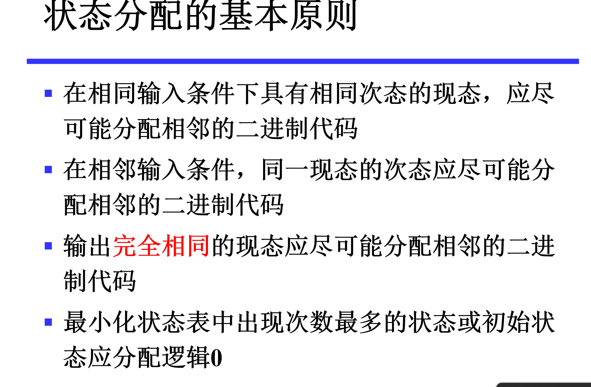
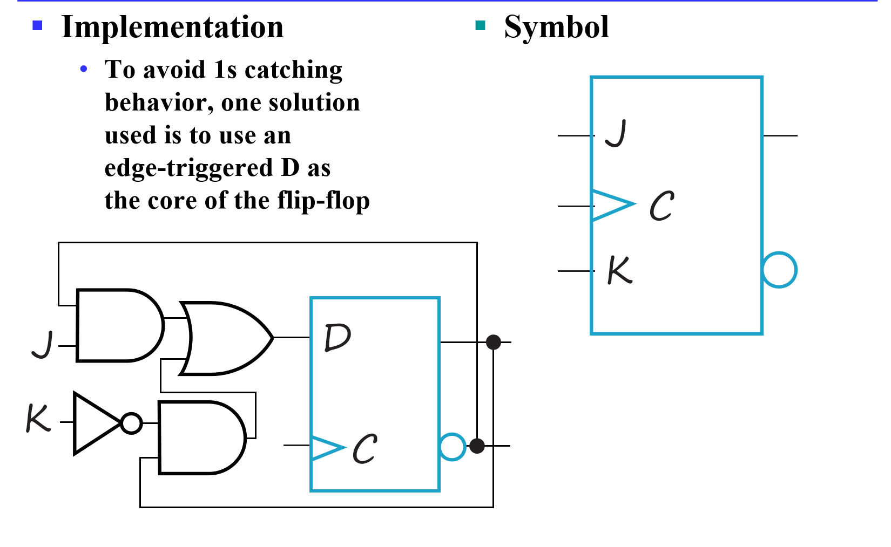
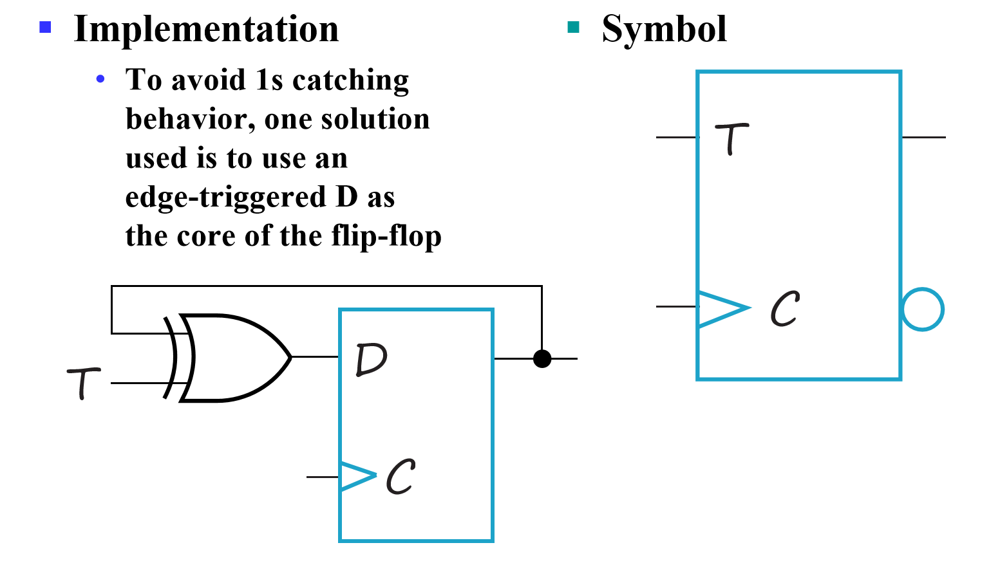

# 现在来看看怎么设计一个时序电路吧

---

## 步骤

1. **Specification**  
   明确电路的功能需求和设计目标。

2. **Formulation**  
   获取状态图或状态表。

3. **State Assignment**  
   为状态分配二进制编码。

4. **Flip-Flop Input Equation Determination**  
   - 选择触发器类型。  
   - 根据状态表中的下一状态条目推导触发器输入方程。

5. **Output Equation Determination**  
   根据状态表中的输出条目推导输出方程。

6. **Optimization**  
   优化推导出的方程。

7. **Technology Mapping**  
   - 根据优化后的方程找到对应的电路。  
   - 映射到触发器和门电路技术。

8. **Verification**  
   验证最终设计的正确性。

### formulation:finding state table

状态是什么：状态是对过去电路的输入的一种抽象。比如状态A是输入了1，B是输入了1后面跟着0的事实。

首先明确m个状态就需要log2(m)个二进制位来表示。

#### 例子：序列识别器

- 识别序列1101
- 识别序列1101的状态设计：
  - S0: 初始状态，未识别到任何序列。
  - S1: 识别到1。
  - S2: 识别到11。
  - S3: 识别到110。
  - S4: 识别到1101。输出1
- 之后来思考状态转移方程
  - S0: 输入0保持在S0，输入1转移到S1。
  - S1: 输入0转移到S0，输入1转移到S2。
  - S2: 输入0转移到S3，输入1转移到S2。
  - S3: 输入1转移到S4，输入1转移到S1。
  - S4: 输入0转移到S0，输入1转移到S2。
- 注意到这样输出只和状态有关，当然也可以写成输出和输入状态有关的形式。（智云）

#### 状态简化

- 通过状态图或状态表来简化状态数目。

等效状态：设状态S1和S2是完全确定状态表中的两个状态,如果对于所有可能的输入序列，分别从状态S1和状态S2出发，所得到的输出响应序列完全相同，则状态S1和S2是等效的，记作(S1, S2), 或者说，状态S1和S2是等效对。等效状态可以合并。这里“所有可能的输入序列”是指长度和结构是任意的，它包含无穷多位，且有无穷多种组合。

等效状态判断几种情况：在所有输入情况下，
首先输出相同，之后或次态相同，或次态交错，或次态循环（图看ppt）

具体方法有**直接观察法**和**隐含表法**。直接看ppt是中文的

### State Assignment

有了状态表，那我们该怎么分配这些状态的编码呢？这方案肯定不是唯一的呀。

其实不同方案很大程度影响的是组合逻辑电路的复杂度。

注意：一个编码代表一个状态，但是是由几个触发器组成的，不要把一个触发器当成一个状态。而且编码与状态编号无关

状态分配基本原则：
相邻：两个二进制数只有一位不同

原则：优先满足第一条（其实这些原则的道理都是卡诺图能不能化简，画出来会好理解）

### example 3：模三累加器

自己看ppt吧,我要过五一了，懒得记了，期末复习的我体谅一下

### 其他触发器类型

#### JK触发器

JK触发器和SR触发器有点像，就是允许11这一种情况出现 11的意思的求反

他的实现可以用主从/D触发器（主从也会有单次取样问题）

看一下实现吧

就是在D之前加了一个选择器哦，很巧妙

#### T触发器

T触发器是JK触发器的一种特殊情况，T触发器只允许01和10两种情况出现，T触发器实现起来也比JK触发器简单很多、

利用异或门作为一个可控非门实现的

### Basic Flip-Flop Descriptors

描述一个触发器，有他的特征表：就是一开始看的表（知道输入（**注意这里的输入时给触发器的输入，不是之前外部的输入**，得到次态）

之后结合输入以及当前状态得到特征方程（输入+现态-》次态）

还有一个excitation table：就是反过来，我知道现态，次态，得到一个输入表，对D触发器，SR触发器的分析见ppt

这个表有什么用，在D触发器好像没啥用，我们都是直接根据外界输入以及当前状态以及次态就得到了触发器输入方程，但这是因为D触发器Q(t+1)=D(t)

但如果我们用SR触发器，就复杂了一点，因为我们根据现态和外部输入得到的东西不在直接是次态了，而是某种SR，这个时候还需要利用上面的表进行对应，多了一步操作。
