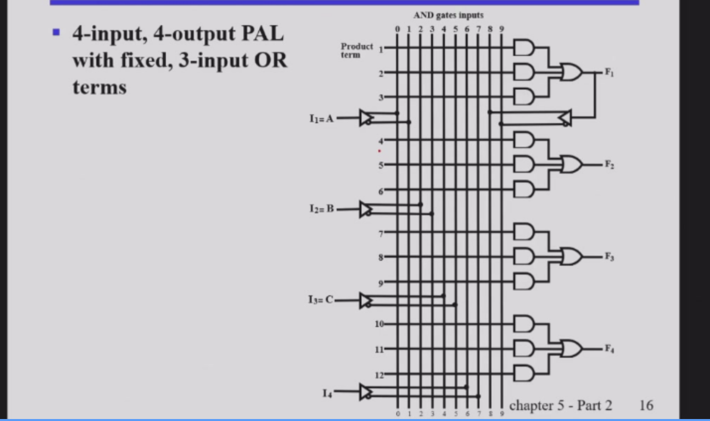
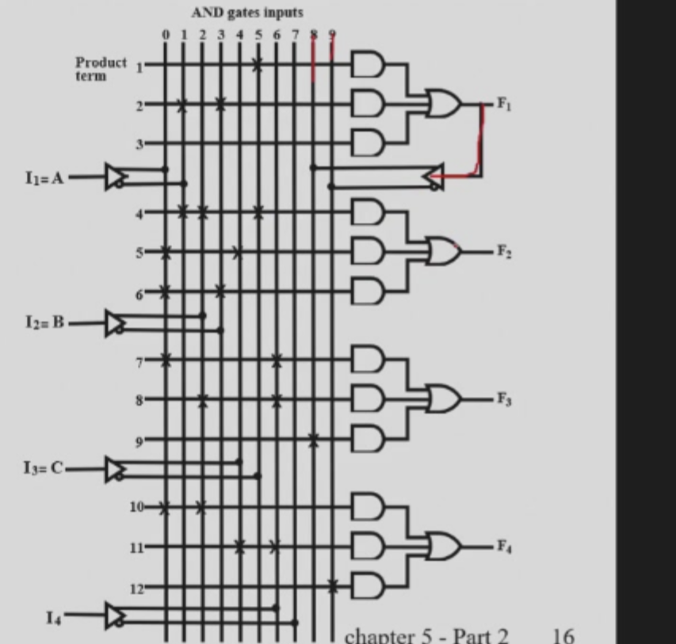
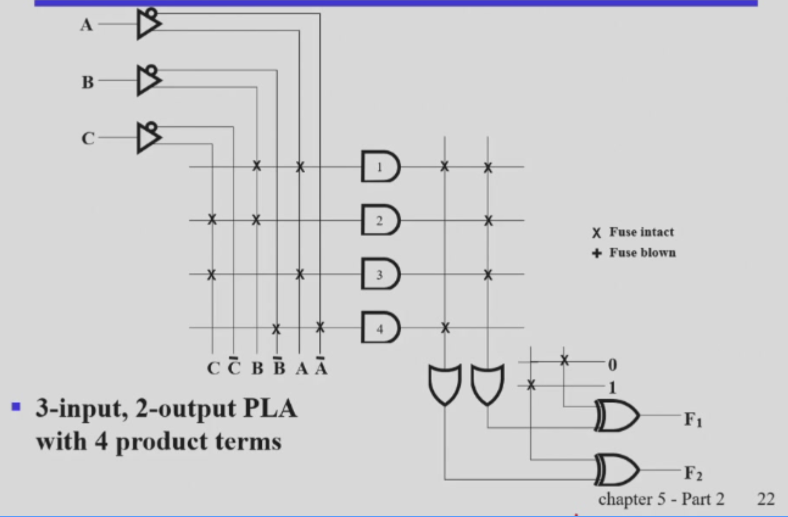

# 可编程逻辑

## 简介

可编程逻辑是一种逻辑结构，允许用户定义逻辑，并使用逻辑来控制硬件行为。

优势：

1. 逻辑结构可扩展，可添加逻辑，可删除逻辑。
2. 逻辑结构可重用，用户可以在不同的设计中使用相同的逻辑结构。
3. 好多好多，无论是上课还是芯片制造都会用

## 实现方式

1.控制连接
2.构建查找表
3.控制晶体管开关操作

### 控制连接

mask connection / fuse connection / anti-fuse connection

- mask connection：在制造时就已经连接好的
- fuse connection：在制造时连接好，但可以通过激光烧断

这些都只能一次性编程（保险丝烧断了不就没了）

single-bit storage element：可以多次编程

### 查找表

查找表就是直接准备好所有逻辑函数的输出值，到时候直接查找(用多路选择器选择)

### Programmable Configuration

ROM/PAL/PLA

FPGA/CPLD

### ROM read only memory

只读存储器：可以理解成一个存储器，也可以理解成固定与门（与起来的东西固定），可编程或门（可以决定或起来的东西） N输入 M输出的一个器件

再说明白一点，就是一个译码器连接着一个与门阵列

- 译码器的输入是地址线，输出是地址线的组合

### PAL programmable Array Logic

PAL 是一种可编程逻辑器件，具有可编程的与门阵列（与起来的个数不固定）和固定的或门（或的个数固定）阵列。

这就设计出一个接受三个与项的或的逻辑函数

三个与项不够用咋办，直接把三个与项的或的逻辑函数接回去

连接表：见ppt

### PLA programmable Logic Array

PLA 的与门阵列和或门阵列都可以编程

就是一组可以改变量的与门连接着可以改变量的或门，最后还有一个异或门求反或者保持

往往会出现与项不够用的情况，比如一个输出需要3个与项的或，另一个需要两个，那就一共要5个。但我们最多只能提供四个，那不就完蛋了。

所以，我们可以考虑共用，如果本身不能共用（没有重复的），那就取反看看喽（这就是异或门求反的作用）
