# Registers / Microoperations / Implementations

---

## Registers

寄存器是一系列的二元存储元件，用于存储数据

---

### 先来看一个例子

我们不难想到可以用几个触发器实现寄存器  
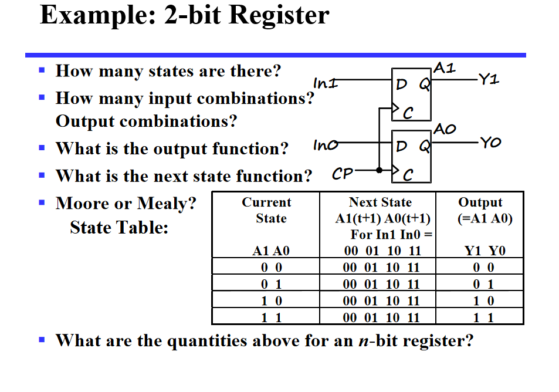  
但是，如果位数一旦多了，这个表变得太复杂了吧

---

### 有什么设计方法呢

---

### 寄存器的 Load Enable

我们如果直接用 D 触发器做寄存器，那每一个时钟上升沿都会加载新数据。但我们实际使用的寄存器，可能是很多个周期都不变的哦。因此直接用 D 触发器，功能还不够。

我们有几种方式来解决（`load` 是控制寄存器是否接受新数据的，`load=0` 是保持不变，`load=1` 是加载新数据）：

1. **load 是 0 的时候，直接把时钟咔嚓了**
2. **改变 D 触发器输入端**

---

#### 先看解决办法一

就是弄出一个 `load` 控制的时钟（Gated Clock）  
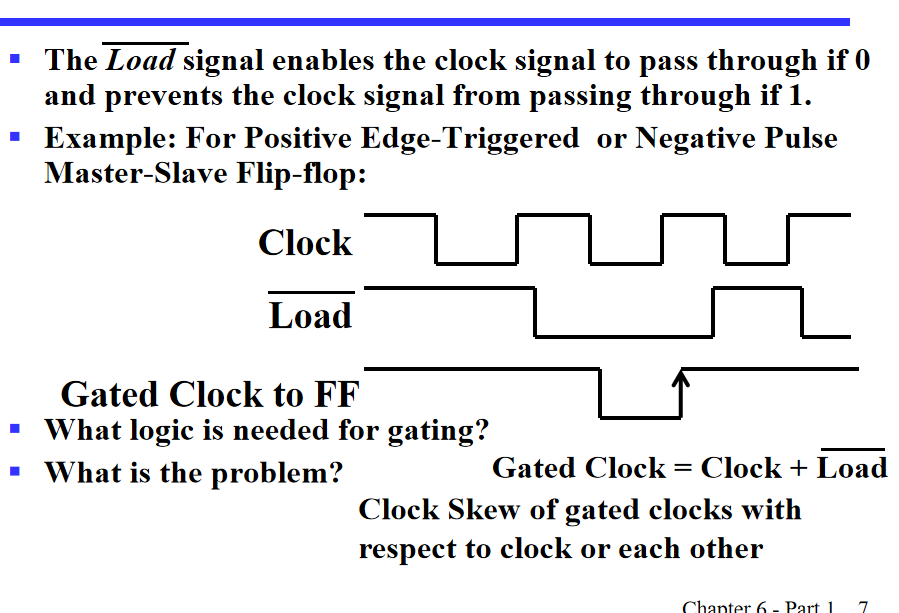

但这样会有一个什么问题呢，我们之前说过，时序电路原件都使用一个时钟，那我们如果给触发器的时钟加上了一个或门，那这个时钟肯定会有一个传输延迟，那就有可能导致不同步的问题。

**但它也有优势的：**

1. 电路简单  
2. 功耗低  

---

#### 再看解决办法二

其实就是在 D 输入端接一个多路复用器，选择外界输入和触发器输出  
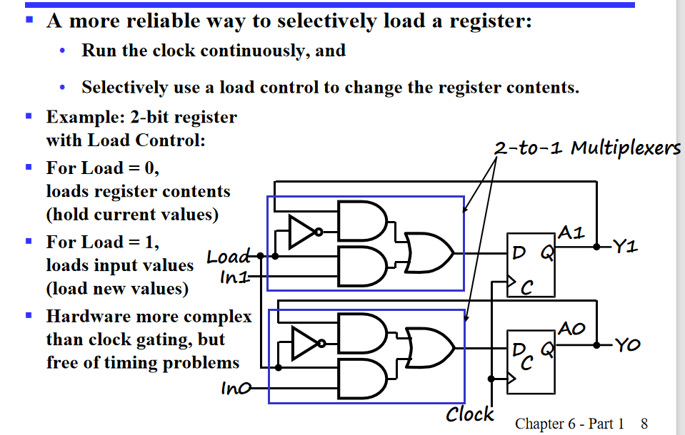  
这个一看就好一些啊

---

### 寄存器传输操作

寄存器传输操作：就是把数据存在寄存器的操作

它有三个基本操作：

1. 选择存哪些寄存器  
2. Operations  
3. Control of Operations(什么时候执行操作)

而这些操作有计数、转移、加、或、与等

---

### 寄存器一些标记

直接看 PPT 吧  
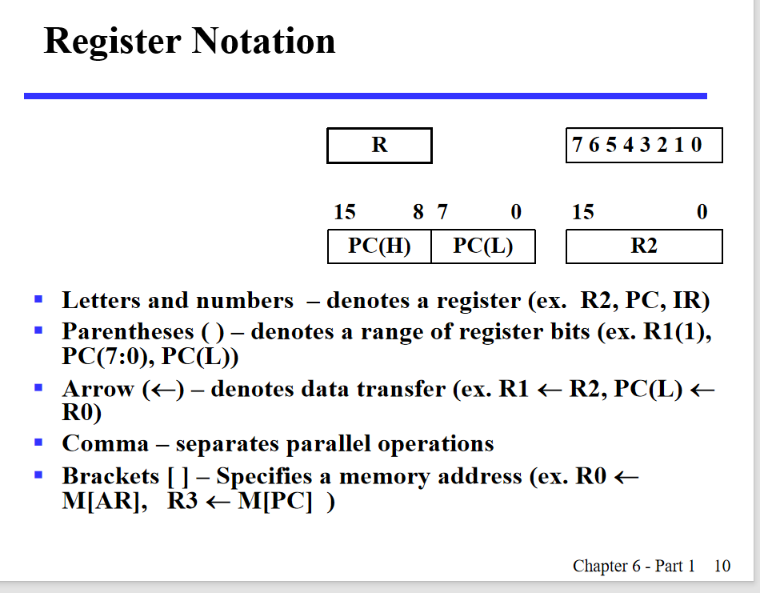

---

### 条件接收

其实从第二种方法的原理图我们可以知道，数据早就准备好在输入处了，只是 `load` 是否选择接受而已。

---

### control expressions

control expressions 是一个表达式，用于控制寄存器的操作，冒号左边是控制条件，右边是操作。

---

## Microoperations

### Logical Groupings

- **Transfer**  
  Move data from one register to another  

- **Arithmetic**  
  Perform arithmetic on data in registers  

- **Logic**  
  Manipulate data or use bitwise logical operations  

- **Shift**  
  Shift data in registers

---

verilog 中的 "=" 和 "<=" 赋值一个是 assign 赋值，一个是寄存器赋值。

---

## register based structure

以下讲寄存器之间的传输方式

---

### Multiplexer-Based Transfers

就是给每个寄存器一个专属的多路复用器（选择器），来选择哪一组源数据（寄存器进行输入）。

注意 PPT 这个部分：

\[
k_1 + k_2 \cdot \overline{k_1} = k_1 + k_2
\]

因此，`load` 控制端只需要用一个或门即可。

关键点有两个：load 端设计，以及选择器选择端设计。

这是一个通法，利用一个编码 -> 译码 -> 选择不同输入，一定可以实现，但这样的门输入成本可能比较高。

---

#### 专门设计

其实说白了，每次的外界输入，和状态的选择不也就是输入吗？我们可以对每一个寄存器（就是每一位）进行单独设计，弄出一个时序状态图，根据时序状态图，之后得到真值表以及卡诺图，表达式化简，我们可以设计出一个更加专门针对某一个要求的设计，这样虽然麻烦，但降低了门输入成本。例子 PPT 有。

---

### 多路复用器和总线的传输方式

通过多路复用器选择用哪一个寄存器的输出作为输入：  
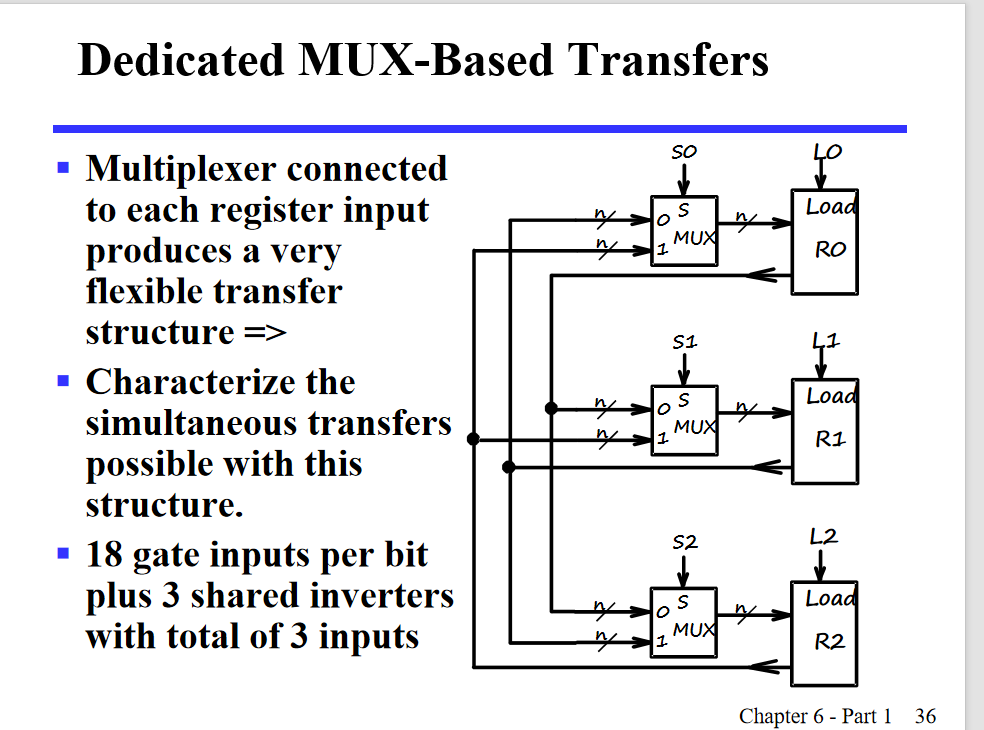

我们发现，理论上其实可以对两个寄存器的值直接进行交换（选择器选择对应的寄存器，在上升沿时候传到输出即可）。

但是为啥计算机里，没有直接交换两个数的值的代码呢？？  
输入成本太高啦，尤其是寄存器一旦多起来，每一个复用器都要是 n 选一个。

因此，我们选择了使用总线。

---

#### 使用总线

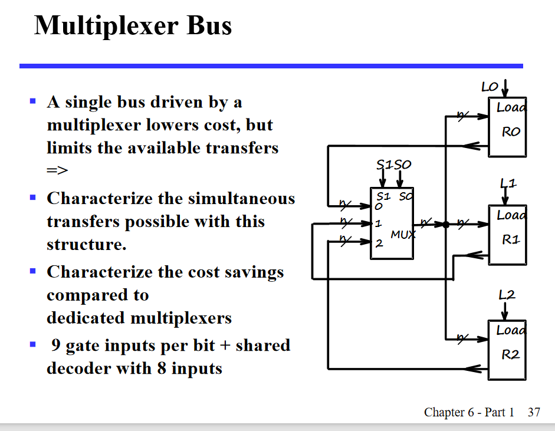

只用一个多路复用器，成本降下来了很多，但是就没办法直接交换了。

也可以用几个三态门和使能端实现这个事情：  
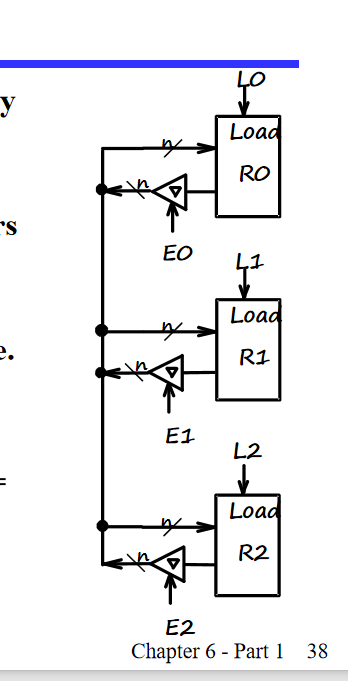

---

### 移位寄存器

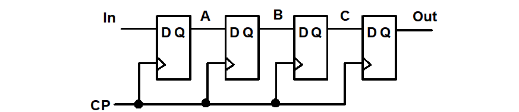

移位寄存器的原理很简单，就是每一个寄存器的输出连接着下一个的输入，我们也有并行/串行输入以及并行串行输出。

我们可以通过二选一来设计串并行可以调节的移位寄存器。

甚至还可以通过三选一设计出保持的功能。

甚至只要改变 4 选 1 的选择，就可以实现更多功能。

---

### 计数器

#### ripple counter

ripple counter 就是一个触发器的输出连接下一个触发器的时钟输入，这样就可以实现计数器了，相当于用寄存器的输出模拟了频率为 1/2 的时钟。

用这个原理，也可以实现时钟分频。

但这个设计有个问题，就是每一个触发器的时钟都不一样，可能会导致不同步的问题。同时，我们在 PPT 上也可以看到，它的变化（从 111-000）不是直接的，而是 111-110-100-000，这样可能会有问题。

---

#### synchronous counter

因此，同步寄存器出现啦（其实是实验 10），我们可以用同步时序电路的设计方式解决这个问题。

还有升级版，简化版哦。

**升级！**：我们发现，其实每一位取反条件就是之前所有位都为 1，那么，我们可以通过一个与门链条来优化之前的电路：  
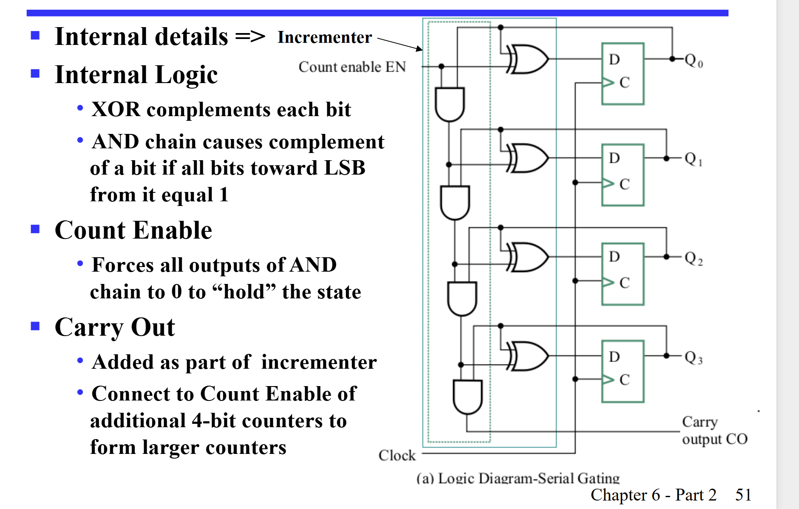（这里用了一个异或门实现保持或取反）

但是，这个还是不太好，与门链条太长了，延迟高。我们可以改成在每个寄存器之前用一个与门将之前的东西与起来：  
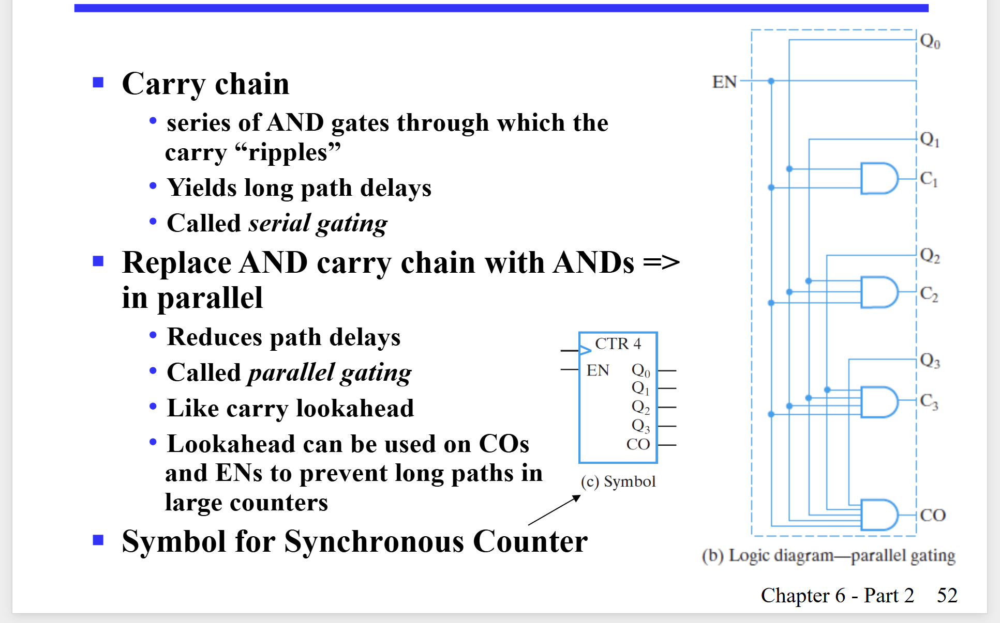

---

#### 计数器加模块

可以给计数器加入一个并行输入（初始设置的模块），可以看 PPT。

---

### modn计数器

就是计数器有个上限，比如，mod7 就是计数到 7 又从头开始。

有人会说了，这不是很简单嘛，直接在计数器输出后加一个与非门，连接到 clear 端就好了呀。

**但这样存在一个可怕的问题**：  
维持在 7 的时间可能不足以把所有寄存器清零。维持在7的时间是很短的，可能会导致寄存器没有时间清零就又开始计数了。

---

#### 改进

我们可以让那个与门结果（注意这里的结果是6的时候就为1）连接到 load，load 就是并行输入的使能端（为 1 时有效）。  之后并行输入准备好 0000，这里的与门也可以简化哦。

这里让在输出6时结果就是1，之后就可以重新写入0000，就避免了之前的问题。

同时利用上面的想法，我们可以写出从 9-14 循环的计数器：  
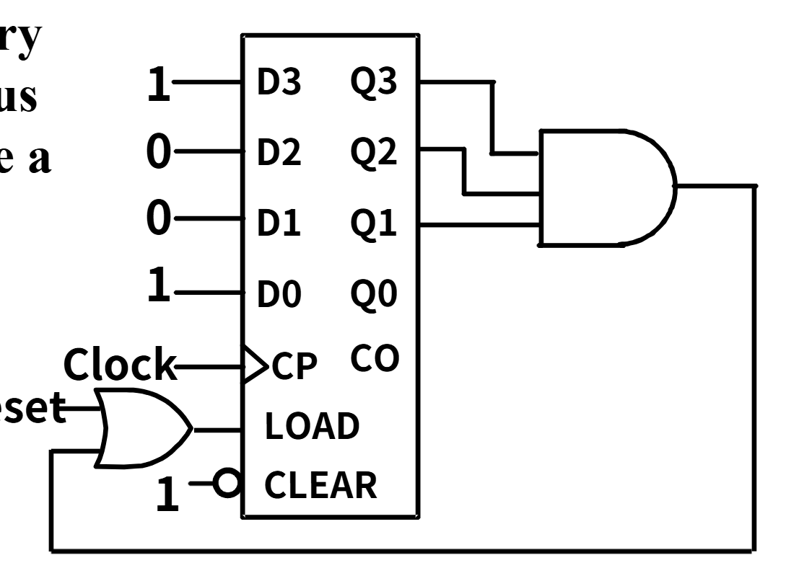

### 串行输入和微操作

串行输入在计算机传输数据是很常见的，她用了更窄的带宽

串行加法计算，我们可以让两个数进行串行传输，一次计算一个位，只用一个全加器就好啦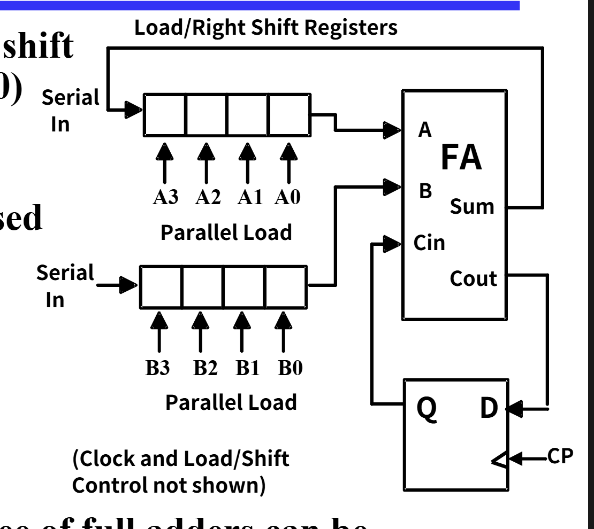

这种设计在很多位加法（比如32）位时候比之前讲的32位
加法的复杂度小了很多很多，
