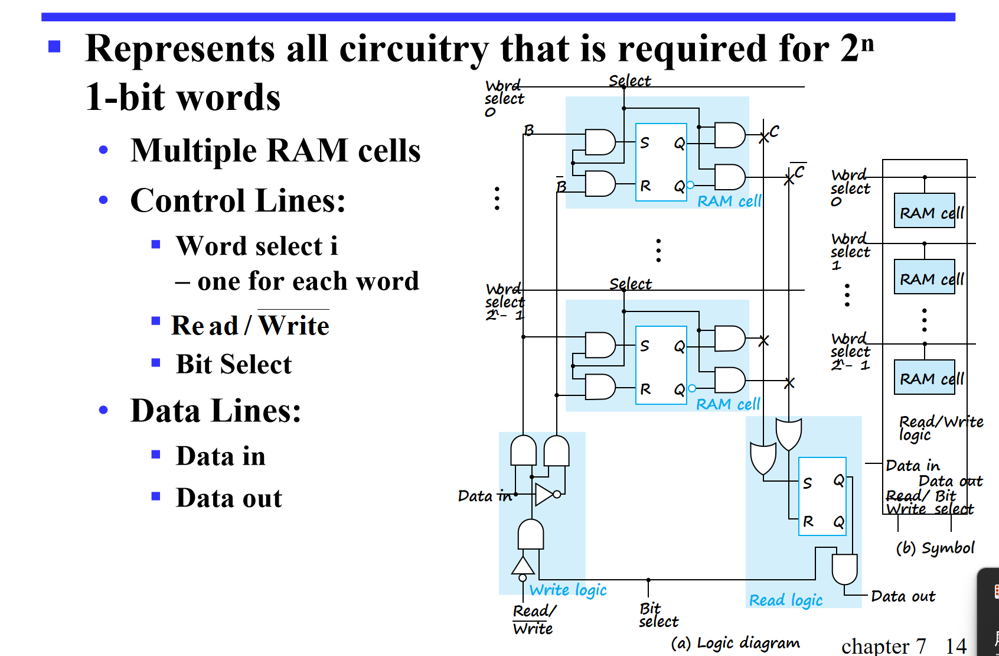

# memory 内存

---

片选信号(CS):在多个芯片共享同一总线时，用于区分哪个芯片正在处理数据的信号 chip select

---

## 介绍

内存 ─ 由存储单元和必要电路组成的集合，用于传输信息。  
内存组织 ─ 内存的基本架构结构，涉及如何访问数据。  
随机存取存储器 (RAM) ─ 一种内存组织方式，使得数据可以在不依赖于特定所选单元的情况下，从任何单元（或单元集合）传输到或传输出。**就是访问这里面的东西的速度都差不多，和地址无关**  
内存地址 ─ 一组用于识别特定内存元素（或元素集合）的比特向量。  
data_elements  数据元素 ─ 一串二进制数可以被读/写在存储单元中  

word = n位二进制数 一个数据

---

### 内存组织

内存以索引数组的形式组织起来，每个索引是在内存中的地址。

---

### 内存示意图

一个存储系统长这样，他能存储2的k次方个n位的words

因此地址是k位，输入输出是n位

---

### 基本内存操作

要执行一个操作需要有三要素：数据，地址和操作（读/写/刷新等）

---

### 内存操作的时间

其实大多数内存都是异步的，是由控制输入和地址来控制

read timing：  

write timing：  

我们发现他的写入信号是在memoryenable之后，这是防止他写到了其他地方，等到地址译码稳定后再写。

同时data_input也在memoryenable之后，而且在写之后有一段的保持时间

---

## RAM

RAM是随机存取存储器：它主要有两种模式：Static RAM和Dynamic RAM。前者用锁存器实现，后者用电容充放电实现，前者快但贵，后者慢但便宜。

方便理解：DRAM就是你手机和笔记本的运存，SRAM是CPU的缓存

DRAM是电容弄得嘛，所以会有漏电，所以要有定期的刷新。

---

### SRAM的具体实现结构

这个有点复杂，但很巧妙想听的更仔细可以看回放

同时这里默认一个字的位宽为1，有2的n次方个字

对于地址选择，我们则使用译码器

而对于实现为一个芯片，我们则会使用一个三态门输出

---

### 改进

这个16*1的玩意好像有点大了

我们能不能还是像优化译码器一样，分成行和列来处理。当然，我们把高位作为行的译码，低位作为列的译码

看这，运用了bitslice和select。

---

### 不想只有一位输出，想要两位

看这，16乘1就被改造为8乘2

---

### 多个RAM进行扩展

#### 字扩展（扩展地址空间，更多字）

就是还是利用译码器连接CS端，来选择让哪个译码器来存储

#### 位扩展（扩展字长度，更多位）

这个直接把地址线接在一起，之后输入输出排好队就ok啦

---

### DRAM

基本原理：在电容器上存储信息。  
通过电容器的充电和放电来改变存储的值  
使用晶体管作为“开关”来：存储电荷，充电或放电

---

#### 具体操作

如何写入/读出数据？（如何充电/放电）（读取他有没有电）

大水池小水池（读出放大器），注意读完后写（破坏性--非破坏性）

---

#### Dram位片

看ppt

---

#### block diagram

ppt

---

#### 行地址与列地址

DRAM的传输地址是先传行地址，再传列地址。  
先行地址送进去，选中（访问）了这一行所有的位（此时有一个RAS表示这是行地址）。再有列地址（此时有一个CAS表示这是行地址），告诉他到底读的是哪个。之后就开始读，给出输出。

写的也差不多啦

注意DRAM的访问会把行地址给的行都给访问了

### 同步dram

读取地址，输入输出都和时钟有关

### DDR

就是double data rate 。那怎么实现的呢

就是在上升沿和下降沿都会传输。
