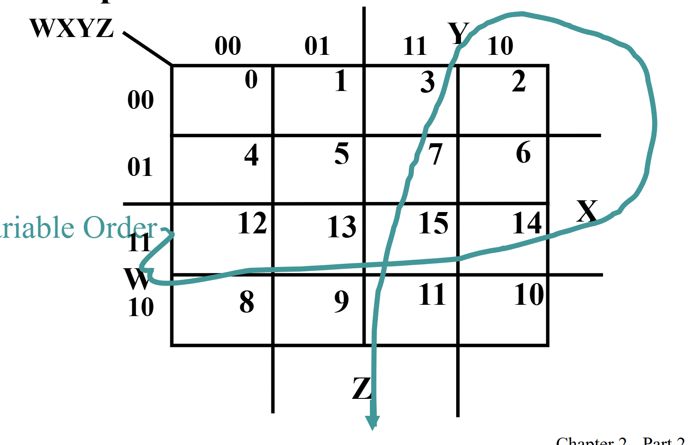
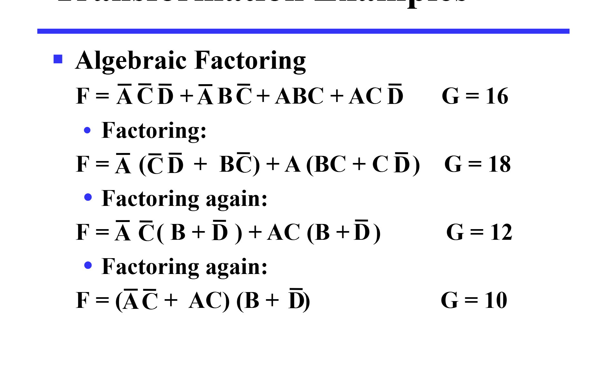

# 标准式与门优化（第二章1，2）

## 什么是标准式

### 为什么要标准式？

1. 首先，我们这里的内容是针对逻辑运算的，在数逻中有与、或、非，在离散中就是合取、析取、非。意思都是一样的。我们知道，每个逻辑表达式（如：p + q * w）都会对应一个真值表。  
    
2. 但是公式是无限的，而真值表排列组合是有限的呀，所以会有无数个表达式对应同一个真值表，这些表达式就是等价的。  
    
3. 而且，通过把这些不同形式的表达式变成同一种，要用好多好多公式。  
    
4. **因此**，我们伟大的标准式就诞生了！！！

---

### 那什么是标准式呢？

1. 我们定义标准式有两种形式——一堆命题的和之后再乘，或者反过来，比如（p+q）*（q+非r）或者（p*q）+（q+非r），这两种根据德摩根公式，有对应关系。
2. 接着我们定义最小式和最大式。
3. 最小式（SOM）：就是每个命题（或者它的反）都要存在，并且相乘起来，这样子呢，就可以保证只有一种取值情况使得组合命题的值为1，其他都是0哦。
4. 最大式（POM）：就是每个命题（或者它的反）都要存在，并且相加起来，这样子呢，就可以保证只有一种取值情况使得组合命题的值为0，其他都是1哦。  
5. 现在，我们有了最小式和最大式，下一步！

---

## 标准式有什么用

我们发现，sop和pos只有两级，因此延迟小，速度就会快。

### 任意一个命题转成标准式？

### 我们这里只用最小式的标准式来写

- 比如一个命题（p *q）+（q* 非r）怎么转换呢。
- 只要我们把缺少的项，比如第一项缺少了 r，那我们直接给它一个（r+非r），之后用分配律，就ok!
- 有时还要用分配律哦
  
####

至于最大值的标准式，可以用补+分配律的方式，也可以由最小项得到（剩下的Mi相乘。

### 真值表转换成标准式

比如我们这里有一个真值表 其中 1 1 0 是 1 // 0 0 1 是 1 其他都是0

我们只需要把1 1 0 对应的 最小式（即1 1 0 使得该最小式为1 p *q* 非r。之后也写出0 0 1 对应的最小式。之后把这两个式子相加，就ok啦（原理也很清晰了）  

<h1 class="custom-h1"> 由此，我们也可以定义一个mi 和 Mi 。

- mi代表某一个最小式，i代表最小式对应的真值对应的十进制数，比如1 1 0 就是 5
- Mi代表最大式，i代表最大式对应的为0的取值的十进制数，其实就是index，即最小项的一个代称.</h1>
 我们同时可以注意到，对于同一个i，m和M是取反的（从定义很好理解）  
接着，任意一个最小式对应了一个mi 因此 任何逻辑表达式和真值表都可以表达成mi的相加。
- 有个更快判断式m几的方法，就是把p当成1 把取反当成0 再把二进制换成十进制就行

#### 函数取反更容易？

我们会发现，当一个函数可以表示成几个mi相加，那么反函数就是对应的其他没有在里面的mi的相加，也是Mi与mi i一样的项的相乘

## 更简单一点不行吗？？

### 什么是更简单

1.简单来说，变量更少就是更简单，具体评价有因子成本或者门输入成本。层级更小！电路简单。

1.1 因子成本---因子出现的数量（相同的重复算）
1.2 门输入成本（G）：因子成本基础上，加上与或表达式中，与起来的个数（就是整个相乘起来算一个，数一共几个），或与表达式，算或的个数，如果混合，那就都算。**单个的元素**不要计算！
1.3 （GN） 在门输入成本基础上加上非门个数（这个相同变量不重复计算）

2.那如何来让这个表达式更简单呢，注意啊，这里只是针对二级的电路（SOP OR POS）化简，让他们的**门输入成本**降低，但事实上，sop或者pos不一定是门输入成本最低的哦，二级只是最快，但成本不一定最低。
（SOP OR POS 二者转换也是取反）  

---

就是卡诺图！！

### 卡诺图是什么捏

1.简单来说，就是一个表格，表格里面是mi,如果加和中有这个i那么 对应的格子就是一，反之则是0
 
2.具体而言,卡诺图横纵的位置均要保证相邻位置只改变一位 比如 0 0->0 1 ->1 1->1 0.之后再在对应的位置标上i。  
3.那如何简化，就是画圈，把包含1的画在同一个圈，注意这个圈只能是2 4 8 16这种大小。**同时注意卡诺图最上和最下，最左和最右是联通的**.  
4.画好了圈，只要读出这个圈属于什么命题，再加起来就行了！  
5.**卡诺图的简化规则**：先画必要的，再画大的。什么是必要的呢，我们知道，同一张图每一个格子都有很多种圈法，但只有一种圈法的格子就是必要的，具体见下面。

- 质蕴涵项：就是这个圈不会被更大的圈包含
- 必要质蕴涵项：就是这个圈里有个/多个元素只被一个质蕴涵项包括
- 则卡诺图的简化规则就是：我们先画出卡诺图-找出质蕴涵项-选择必要质蕴涵项-化简（选择其他的质蕴涵项，注意你选择的圈一定不要他的所有元素都被之前选择的包括了）  
  ps:卡诺图的原理应该是分配律

6.哦对了，还有一个是dont care 的方块，就是根本不会存在这种情况，这个格子是1还是0都可以.比如BCD码，根本没有11-16.

---
这里是一个示意图

---

### 另一种跟简单的方式

不用卡诺图，而是把SOP或者POS（二级）变成多级的，反而能让他更优化，门输入成本降低（但由于变成了多级，延迟升高，性能下降了）。

### 补充一下哈 如何求逻辑函数的反函数

#### 只要用德摩根律

1) 原函数的与和或交换，记得保持运算的优先（加括号）
2) 每个元素变成他的反
