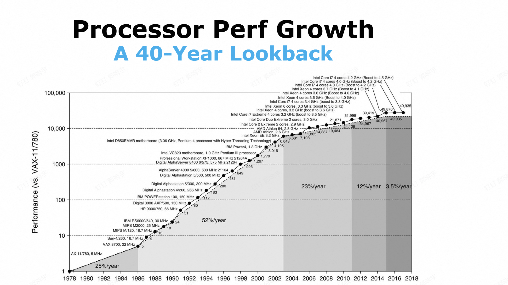
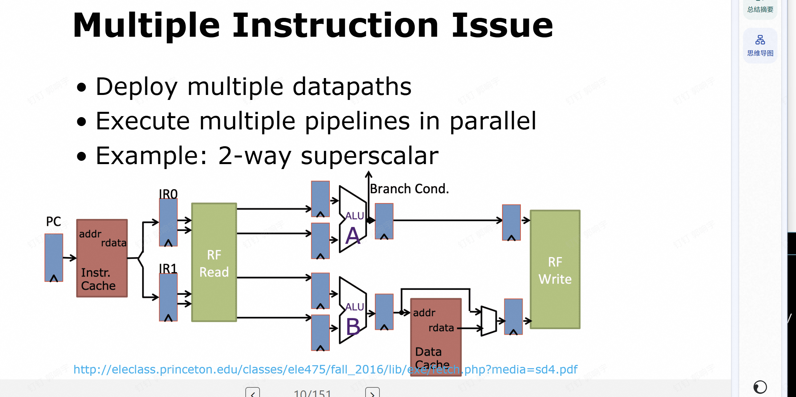
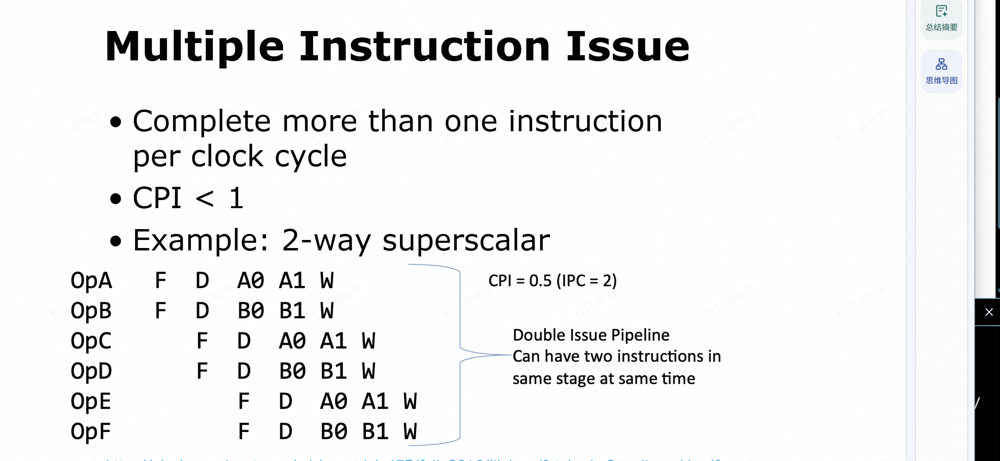

# 介绍 Fundamentals of Computer Design - Basics



我们看下这个增长图 幅度越来越小 说明单cpu已经到瓶颈了


## pipeline

我们在计算机组成说到过流水线 

### RISC 架构 (RISC Architecture)

- **R**educed **I**nstruction **S**et **C**omputer (精简指令集计算机)
- **特点**：指令更简单。
- **两项关键性能技术**：
    - **指令级并行 (Instruction-Level Parallelism, ILP)**：包括流水线 (pipelining) 和多指令发射 (multiple instruction issue / superscalar)。
    - **缓存 (Caching)**。

### 多指令发射 (Multiple Instruction Issue)

- **概念**：在一个时钟周期内完成多于一条指令的执行。
- **指标**：$CPI < 1$ (即 $IPC > 1$)。
- **实现方式**：部署多条数据通路，并行执行多个流水线。
- **示例：2-way Superscalar (两路超标量)**
    - 允许两条指令同时处于相同的阶段。
    - **CPI = 0.5** ($IPC = 2$)。



*图：2路超标量流水线结构，包含 ALU A 和 ALU B，支持同时发射两条指令。*

## 制约与突破

这三张幻灯片串起了**处理器性能增长从“单核狂飙”到“多核并行”的关键转折点**，核心是解释为什么行业会从追求单核频率转向多核架构：

---

### 1. Dennard Scaling（登纳德缩放）

- **核心逻辑**：当晶体管尺寸缩小时，虽然芯片上的晶体管数量变多，但单位面积的功耗密度能保持恒定。这让处理器可以在不显著增加功耗的前提下，大幅提升主频和单核性能。
- **终结时间**：约2004年。因为电流和电压无法再持续降低，否则会破坏芯片的可靠性，导致“功耗墙”出现，单核频率的提升见顶。

### 2. Moore’s Law（摩尔定律）

- **核心逻辑**：芯片上的晶体管数量会持续指数级增长（最初预测每年翻倍，后修正为每两年翻倍），这为更复杂的处理器设计提供了硬件基础。
- **终结时间**：约2015年。随着晶体管尺寸逼近物理极限，晶体管密度的增长速度显著放缓，传统意义上的摩尔定律红利逐渐消退。

### 3. Multi-Core Processor（多核处理器）

- **核心逻辑**：登纳德缩放失效后，行业无法再通过提升单核频率来获取性能，于是转向“多核”策略——在一块芯片上集成多个高效的处理核心，而非继续堆砌一个低效的大核心。
- **并行范式转变**：从依赖**指令级并行（ILP）**（如超标量、乱序执行）提升单核效率，转向利用**数据级并行（DLP）**和**线程级并行（TLP）**，通过多任务、多线程来榨取整体性能。

---

### 三者的关联

- **黄金期（1980s–2003）**：摩尔定律提供更多晶体管，登纳德缩放让这些晶体管可以被高效利用（提升频率），单核性能飞速增长。
- **转折点（2004）**：登纳德缩放失效，频率提升遇阻，行业被迫转向多核架构。
- **后摩尔时代（2015至今）**：摩尔定律放缓，多核红利也逐渐耗尽，行业开始探索异构计算、专用加速器（如GPU、AI芯片）等新方向。

---

### 阿姆达尔定律 (Amdahl's Law)

- **多核并行的挑战**：多核并行要求对应用程序进行**重构 (Restructuring)**，这对程序员来说是一个重大的新负担。
- **加速效果与定律公式**：
  阿姆达尔定律定义了在系统中改进某一特定部分所能带来的整体加速比：
  $$Speedup_{overall} = \frac{Execution\ time_{old}}{Execution\ time_{new}} = \frac{1}{(1 - Fraction_{enhanced}) + \frac{Fraction_{enhanced}}{Speedup_{enhanced}}}$$
  其中：
  - $Fraction_{enhanced}$：系统中可被改进部分所占的时间比例。
  - $Speedup_{enhanced}$：该改进部分自身的加速比。
- **核心结论与限制 (Limit)**：
  当受改进部分（如并行化）的加速比 $Speedup_{enhanced}$ 趋近于无穷大（例如投入无限多核）时，整体加速比的极限为：
  $$Limit = \frac{1}{1 - Fraction_{enhanced}}$$
- **启示**：由于程序中总存在无法并行的串行部分，因此**不能盲目堆砌过多的核心 (Not too many cores)**，因为提升核心数带来的收益会迅速遇到瓶颈。

---

### 应用程序并行性 (Application Parallelism)

为了利用多核架构，应用程序需要展现出不同层次的并行性：

#### 1. 数据级并行 (DLP: Data-Level Parallelism)
- **概念**：同时对多个数据项进行操作。
- **实现**：将相同的数据分配到不同的处理器上运行。
- **示例**：数组求和。
    - 假设数组有 $n$ 个元素，每个加法耗时 $T_a$。
    - **1 个处理器**：耗时 $n \times T_a$。
    - **4 个处理器**：将数组分成 4 份，每个处理器处理 $n/4$ 个元素，理想耗时缩减为 $(n/4) \times T_a$。

#### 2. 任务级并行 (TLP: Task-Level Parallelism)
- **概念**：创建相互独立且很大程度上可以并行运行的任务。
- **实现**：在相同的数据上同时运行多个不同的任务。
- **示例**：处理位串（Bitstring）。
    - 输入一个位串到两个处理器。
    - **处理器 A**：统计 0 或 1 的个数。
    - **处理器 B**：计算其补码（Complement）。
    - 两个完全不同的任务并行执行。

---

### 硬件并行性 (Hardware Parallelism)

硬件通过不同的手段来发掘/利用上述并行性：

#### 1. 指令级并行 (ILP: Instruction-Level Parallelism)
硬件在较低或中等程度上发掘数据级并行：
- **流水线 (Pipelining)** (低程度利用)：
    - 将一个任务分解为多个步骤。
    - 同时运行不同任务的不同步骤。
- **投机执行 (Speculative Execution)** (中程度利用)：
    - 提前执行某些工作。
    - 在真正需要该工作结果时防止延迟。

#### 2. 向量架构、GPU 和多媒体指令集
利用大规模的数据级并行：
- **核心逻辑**：并行地对一组数据应用**单条指令**。
- **对比**：
    - **CPU**：针对**串行任务**进行了优化（包含复杂的控制逻辑、大缓存）。
    - **GPU**：针对**并行任务**进行了优化（包含大量的 ALU 算术逻辑单元，用于大规模并行数据处理）。

#### 3. 线程级并行 (TLP: Thread-Level Parallelism)
- **概念**：利用数据级并行 (DLP) 或 线程级并行 (TLP)。
- **实现**：采用**紧耦合 (Tightly Coupled)** 的硬件模型，允许并行线程之间进行交互。
- **典型架构**：**多核处理器 (Multi-core Processor)**。
    - 每个核心拥有独立的 L1 I$ / D$ 和 L2$。
    - 所有核心共享统一的末级缓存 (LLC 或 L3$)。

#### 4. 请求级并行 (RLP: Request-Level Parallelism)
- **概念**：在大量**解耦 (Decoupled)** 的任务之间利用并行性。
- **实现**：由程序员或操作系统指定。
- **示例**：**Google 查询 (Google Query)**。
    - Web 服务器将查询分发给多个服务器（拼写检查、广告服务器、索引服务器、文档服务器等），各任务之间高度独立且并行。

## ppt有各种类型计算机的东西

## flynn并行分类

### 一、先彻底搞懂：什么是「数据流」
**数据流（Data Stream）** 就是计算机在计算时，被读取、处理、写入的**数据序列/数据集合**，可以理解为「要处理的一批数据」。

- 它描述的是**数据在计算过程中流动的方式**：比如是一组数据串行流过处理器，还是多组数据并行被处理。
- 举几个直观例子：
  - 你循环计算 `a[i] = b[i] + c[i]`，每次循环处理的 `(b[i], c[i])` 就是**一组数据流**；
  - 处理一张图片时，所有像素的 RGB 值集合，就是一个**完整的数据流**；
  - SIMD 指令同时计算 8 组 `a[i] + b[i]`，这 8 组数据就是**8 个并行的数据流**。

---

### 二、Flynn 分类法的 4 种架构
Flynn 用「指令流」和「数据流」的组合，把计算机并行架构分成 4 类：

#### 1. SISD：单指令流，单数据流
- **定义**：同一时间只执行 **1 条指令**，只处理 **1 组数据**。
- **通俗类比**：1 个厨师，一次只做 1 道菜，只用 1 份食材。
- **计算机例子**：早期单核 CPU（如 8086、单核 ARM），程序串行执行，指令一条接一条跑，数据一组接一组算。
- **并行方式**：靠**指令级并行（ILP）** 挖潜（比如流水线、超标量），但本质还是串行执行指令和数据。

#### 2. SIMD：单指令流，多数据流
- **定义**：同一时间执行 **同 1 条指令**，但同时处理 **多组不同数据**。
- **通俗类比**：1 个主厨喊「切土豆」，10 个帮厨同时切各自筐里的土豆（指令相同，食材/数据不同）。
- **计算机例子**：x86 的 SSE/AVX 指令集、ARM NEON、GPU 核心，适合向量/矩阵/像素这类「重复同一种计算」的场景。
- **并行方式**：**数据级并行（DLP）**，用 1 条指令批量处理多份数据，计算效率极高。

#### 3. MISD：多指令流，单数据流
- **定义**：同一时间执行 **多条不同指令**，但只处理 **1 组数据**。
- **通俗类比**：多个厨师对同一份食材，同时做不同操作（比如一个切、一个煮、一个炒）。
- **计算机例子**：偏理论模型，实际很少见，典型如**脉动阵列（systolic array）**、某些专用信号处理器，或 CPU 流水线的不同阶段（勉强算）。
- **特点**：数据被多条指令依次/并行处理，结构复杂、通用性差，所以不是主流架构。

#### 4. MIMD：多指令流，多数据流
- **定义**：同一时间执行 **多条不同指令**，同时处理 **多组不同数据**。
- **通俗类比**：多个厨师各自做不同的菜，用不同的食材（完全独立并行）。
- **计算机例子**：现代多核 CPU（i7/Ryzen）、多处理器服务器、分布式系统、GPU 的流式多处理器（SM），每个核心/处理器可以跑不同程序/线程。
- **并行方式**：**线程级/任务级并行（TLP）**，适合多任务、多用户、复杂并行计算。

---

### 三、4 种架构直观对比表
| 架构 | 指令流 | 数据流 | 并行类型 | 通俗类比 | 典型应用 |
|------|--------|--------|----------|----------|----------|
| SISD | 单条 | 单组 | 指令级并行（ILP） | 1 个厨师做 1 道菜 | 早期单核 CPU |
| SIMD | 单条 | 多组 | 数据级并行（DLP） | 1 个主厨指挥，多帮厨切不同筐土豆 | SSE/AVX、NEON、GPU |
| MISD | 多条 | 单组 | 特殊操作级并行 | 多厨师对同一份食材做不同操作 | 脉动阵列、专用信号处理器 |
| MIMD | 多条 | 多组 | 线程级/任务级并行（TLP） | 多厨师各自做不同菜 | 多核 CPU、分布式系统 |

---

### 四、关键理解总结
- **指令流**：看「同一时间在执行的指令有几条」——1 条就是单指令流，多条就是多指令流。
- **数据流**：看「同一时间在处理的数据有几组」——1 组就是单数据流，多组就是多数据流。
- 现代计算机通常是**混合架构**：比如多核 CPU（MIMD）里，每个核心又支持 SIMD 指令，同时还靠流水线（SISD 思路）挖潜指令级并行。


## 指令集七个维度s

这张图片列出了定义**指令集架构（ISA, Instruction Set Architecture）**的**七个核心维度（7 Dimensions）**。

ISA是计算机硬件与软件的接口，这七个维度是工程师设计/定义一款指令集时，必须逐一确定的关键规范。以下是逐点的通俗解释：

### 1. Class of ISA（ISA 的类别）
定义了**操作数（数据）存放的位置规则**。
现代主流都是**通用寄存器架构（GPR）**，主要分两类：
*   **寄存器-内存架构 (Register-Memory)**：如 x86。指令可以直接操作内存中的数据（例如 `ADD EAX, [EBX]`），灵活性高但指令复杂。
*   **加载-存储架构 (Load-Store)**：如 MIPS、ARM。只有 `Load/Store` 指令能访问内存，其他运算必须在寄存器间进行。这种架构规整，利于流水线执行。

### 2. Memory addressing（内存编址方式）
定义**内存如何被编号和访问**。
*   几乎所有现代架构都采用**字节寻址（Byte-addressable）**，即每个字节有唯一地址。
*   关键规则是**对齐（Alignment）**：MIPS/ARM 要求数据必须对齐存放（如访问4字节整数，地址必须是4的倍数），访问更快；x86 允许非对齐访问，兼容性好但速度可能变慢。

### 3. Addressing modes（寻址方式）
定义**CPU 如何找到操作数的地址**。
即“怎么找数据”的规则，常见的有：
*   **立即数**：直接用指令里的常数。
*   **寄存器**：用通用寄存器里的值。
*   **位移/直接/间接**：通过基址、偏移量等方式计算内存地址。
x86 支持的寻址方式极丰富，MIPS/ARM 则精简为核心几种以降低硬件复杂度。

### 4. Types and sizes of operands（操作数的类型与大小）
定义**指令能处理的数据种类和长度**。
*   **类型**：整数（Integer）、浮点数（Floating Point）、向量（Vector）等。
*   **大小**：支持 8-bit（字符）、16-bit（半字）、32-bit（字）、64-bit（双字）等宽度。
例如 MIPS 支持 32/64 位整数和单/双精度浮点，x86 还额外支持 80 位扩展精度浮点。

### 5. Operations（指令操作类型）
定义**CPU 能执行哪些具体指令**。
指令的核心分类：
*   **数据传输**：Load/Store, Move。
*   **算术逻辑**：Add, Sub, AND, OR。
*   **浮点运算**：FAdd, FMul。
*   **系统/特殊操作**：系统调用、缓存操作等。
MIPS 指令集精简高效，x86 则包含海量复杂指令。

### 6. Control flow instructions（控制流指令）
定义**程序跳转与流程控制**。
即“程序下一步执行哪里”的指令：
*   **无条件跳转**：直接跳转到指定地址。
*   **条件分支**：根据判断结果（如比较大小）决定是否跳转。
*   **过程调用/返回**：如 `Call`（保存返回地址并跳转）、`Return`（恢复现场）。MIPS 用 `jal` 指令实现调用，返回地址存寄存器；x86 则常用栈来保存返回地址。

### 7. Encoding an ISA（ISA 的编码方式）
定义**指令如何被编译成二进制代码**。
这是指令的“二进制格式”设计：
*   **固定长度（Fixed-length）**：如 MIPS 所有指令都是 32 位。解码极快，硬件简单。
*   **可变长度（Variable-length）**：如 x86 指令长度 1~15 字节不等。能更紧凑地利用空间，但解码复杂。

### 总结
这七个维度构成了**ISA 设计的完整框架**。设计一款新的 ISA，本质就是对这七个维度做权衡：比如为了高性能选固定长度编码，为了兼容性选丰富的寻址方式，最终在成本、功耗、性能之间找到最优解。

## 地址对齐

这张图讲的是**内存对齐（Memory Alignment）**的核心规则和性能影响，标题直接点明结论：**未对齐的数据对象需要两次内存访问才能读取完成**，而对齐的对象只需要一次。

---

### 1. 先看懂表格的两个关键维度
- **行：Width of object（数据宽度）**
  表示要读取的数据大小：1字节（byte）、2字节（半字 half word）、4字节（字 word）、8字节（双字 double word）。
- **列：Value of three low-order bits of byte address**
  表示数据**起始地址的最后3位二进制值**（等价于地址对8取模，范围是0~7），用来判断地址是否落在“自然对齐边界”上。

---

### 2. 逐类解读对齐规则
| 数据宽度       | 对齐要求（地址需满足）       | 表格里的对齐状态                     | 未对齐的后果                     |
|----------------|----------------------------|--------------------------------------|----------------------------------|
| 1 byte（字节）  | 无要求，任何地址都对齐       | 0~7 全部是 `Aligned`                 | 永远只需要1次内存访问            |
| 2 bytes（半字） | 地址是 2 的倍数（末位0/2/4/6） | 0/2/4/6 是 `Aligned`，1/3/5/7 是 `Misaligned` | 未对齐时需要2次内存访问          |
| 4 bytes（字）   | 地址是 4 的倍数（末位0/4）     | 0/4 是 `Aligned`，其余是 `Misaligned` | 未对齐时需要2次内存访问          |
| 8 bytes（双字） | 地址是 8 的倍数（末位0）       | 只有 0 是 `Aligned`，其余全是 `Misaligned` | 未对齐时需要2次内存访问          |

---

### 3. 为什么未对齐要两次访问？
内存硬件通常是按**固定大小的块（比如4字节/8字节）**来读取的：
- 对齐的数据：刚好完整落在一个块里，CPU**一次读取**就能拿到全部数据。
- 未对齐的数据：会**跨两个块**，比如一个4字节数据存在地址1，它占据地址1~4，跨了0~3和4~7两个块，CPU必须先读第一个块、再读第二个块，然后把两段数据拼接起来，所以是**两次内存访问**，速度更慢，还可能带来数据原子性问题。

---

### 4. 工程上的意义
- 像 MIPS/ARM 这类精简指令集架构，早期**直接不支持未对齐访问**，会直接触发硬件异常。
- x86 虽然兼容未对齐访问，但会有明显性能损失，还可能在多线程场景下导致数据错乱（因为跨块的写操作无法保证原子性）。
- 所以编译器会默认帮我们做内存对齐，在结构体里填充空白字节（padding），让每个成员都落在自然对齐边界上，用一点空间换时间。
  
## 一个对齐的例子（包括如何编排）

这张图核心展示了 **C/C++ 结构体的内存对齐（Memory Alignment）规则**，也就是编译器如何给结构体成员分配内存地址、插入空白字节（Padding），以及**成员定义顺序如何直接决定结构体总大小**。

结合前提：`double` 占 **8 字节**（对齐要求8），`int` 占 **4 字节**（对齐要求4），`char` 占 **1 字节**（对齐要求1）。

---

### 一、核心规则：为什么要对齐？
CPU 访问内存时，优先读取**对齐地址**的数据（一次内存访问就能拿完）；若数据**未对齐**，需要多次内存访问、拼接数据，会严重损耗性能（甚至触发硬件异常）。
编译器会自动在成员之间/末尾插入**空白字节（Padding）**，保证每个成员都满足自身的对齐要求。

---

### 二、逐结构解析内存布局
#### 1. 结构体 p1 的布局（成员顺序：char → int[2] → double）
```c
struct s1 {
    char c;      // 1字节
    int i[2];    // 2个int，共8字节
    double v;    // 8字节
} *p1;
```
| 成员 | 地址范围 | 对齐逻辑 | 填充/占用细节 |
|------|----------|----------|---------------|
| `c` | `p1+0 ~ p1+0` | 1字节对齐，无要求 | 直接占用第0字节 |
| 填充 | `p1+1 ~ p1+3` | 下一个`int`需4字节对齐 | 插入3个空白字节，让`i[0]`从`p1+4`（4的倍数）开始 |
| `i[0]` | `p1+4 ~ p1+7` | 4字节对齐 | 占用4字节 |
| `i[1]` | `p1+8 ~ p1+11` | 4字节对齐 | 占用4字节 |
| 填充 | `p1+12 ~ p1+15` | 下一个`double`需8字节对齐 | 插入4个空白字节，让`v`从`p1+16`（8的倍数）开始 |
| `v` | `p1+16 ~ p1+23` | 8字节对齐 | 占用8字节 |
| 填充 | `p1+24` | 结构体整体需8字节对齐 | 插入1个空白字节，让总大小为8的倍数 |
| **总大小** | - | - | **24 字节** |

#### 2. 结构体 p2 的布局（成员顺序：double → int[2] → char）
```c
struct s1 {
    double v;    // 8字节
    int i[2];    // 2个int，共8字节
    int c;       // 4字节
} *p2;
```
| 成员 | 地址范围 | 对齐逻辑 | 填充/占用细节 |
|------|----------|----------|---------------|
| `v` | `p2+0 ~ p2+7` | 8字节对齐，无要求 | 直接占用0~7字节 |
| `i[0]` | `p2+8 ~ p2+11` | 4字节对齐 | 占用4字节（8是4的倍数，无需填充） |
| `i[1]` | `p2+12 ~ p2+15` | 4字节对齐 | 占用4字节 |
| `c` | `p2+16 ~ p2+19` | 4字节对齐 | 占用4字节（16是4的倍数，无需填充） |
| 填充 | `p2+20 ~ p2+23` | 结构体整体需8字节对齐 | 插入4个空白字节，让总大小为8的倍数 |
| **总大小** | - | - | **24 字节**？（图中标注到`p2+24`，实际总大小24字节） |

---

### 三、关键结论
1. **顺序决定大小**：两个结构体成员完全相同，仅顺序不同，**总大小却有差异**（p1 严格按规则填充到24字节，p2 填充更少也达到24字节）。
2. **对齐是强制的**：编译器不会省略对齐填充，哪怕浪费空间也要保证访问效率。
3. **优化技巧**：合理调整成员顺序（把大对齐的成员放前面），能最大程度减少填充字节、降低结构体总大小。

比如把 p1 的 `double v` 放到最前面，总大小会从24字节大幅缩减，这是实际开发中优化内存的常用手段。

要不要我给你一段代码，直接打印出这两个结构体的大小和每个成员的偏移量，让你在本地验证这个对齐规则？

## 寻址（怎么找操作数）

这张幻灯片讲的是**指令集架构（ISA）的寻址模式（Addressing Modes）**，核心是：**寻址模式定义了CPU如何找到指令所需的操作数**。

### 1. 寻址模式的本质
操作数（指令要处理的数据）可能存在三个地方：
- 寄存器里（最快）
- 指令本身自带的常量里（立即数）
- 内存里（需要计算出内存地址）

寻址模式就是告诉CPU：「去**哪里**、**怎么找**这个操作数」。

---

### 2. RISC-V 的三种核心寻址模式
RISC-V 是典型的精简指令集（RISC），只保留了最精简高效的寻址方式：

#### ① Register（寄存器寻址）
操作数都存放在**寄存器**中，指令直接指定寄存器编号。
- 例子：`add x1, x2, x3`
  含义：将寄存器 `x2` 和 `x3` 中的值相加，结果存入 `x1`。
- 特点：速度最快，因为寄存器就在CPU内部，不需要访问内存。

#### ② Immediate（立即数寻址）
操作数是**指令里直接包含的常量（constant）**，不需要去寄存器或内存找。
- 例子：`addi x1, x1, 0x10`
  含义：将寄存器 `x1` 中的值加上常量 `0x10`（十进制16），结果存回 `x1`。
- 特点：指令本身就带了数据，适合处理小常数、循环计数等场景。

#### ③ Displacement（位移寻址）
专门用来**访问内存**，内存地址由「基址寄存器 + 偏移常量」计算得到。
- 例子：`lw x1, 100(x2)`
  含义：计算内存地址 = `x2寄存器的值 + 100`，然后把这个地址处的数据加载到 `x1` 寄存器。
- 特点：是RISC-V访问内存的唯一方式，简洁且易于硬件实现，常用于数组、结构体访问。

---

### 3. RISC-V 寻址模式的设计思想
RISC-V 刻意只保留这三种寻址模式，目的是：
- 简化硬件实现：不需要复杂的地址计算逻辑，CPU电路更简单、功耗更低。
- 优化流水线：规整的寻址方式让指令解码、执行更高效，提升整体性能。
- 降低编译器复杂度：编译器更容易生成高效的机器码。

简单说：**少即是多**，用最少的寻址模式覆盖绝大多数场景，换取更高的性能和更低的硬件复杂度。

---

## 操作符（指令种类）

这张幻灯片清晰地划分了**指令集架构（ISA）中，CPU 能够执行的所有指令的四大核心分类**。这些分类是定义一款处理器“能做什么”的基础框架，覆盖了计算机所有基础操作。

以下是逐类的通俗解释（结合 RISC-V 例子，更易理解）：

### 1. Data Transfer（数据传输指令）
**核心作用**：在 **寄存器** 和 **内存** 之间搬运数据（是最基础的“搬运工”）。
CPU 运算只能在寄存器里进行，所以必须先把内存的数据“搬”到寄存器，算完再“搬”回内存。
*   **典型指令**：
    *   `lw` (Load Word)：从内存加载一个 32 位整数到寄存器。
    *   `sw` (Store Word)：把寄存器的数据存回内存。
*   **例子**：`lw x10, 0(x11)` （把 x11 指向的内存数据，加载到 x10 寄存器）。

### 2. Arithmetic/Logical（算术/逻辑指令）
**核心作用**：对数据进行**计算**和**逻辑判断**（是 CPU 的“核心工匠”）。
这是处理器最基本的功能，负责整数运算和逻辑判断。
*   **典型指令**：
    *   算术：`add`（加法）、`sub`（减法）。
    *   逻辑：`and`（与）、`or`（或）、`slt`（比较大小）。
*   **例子**：`add x10, x11, x12` （x11 + x12 的结果放入 x10）。

### 3. Control（控制流指令）
**核心作用**：控制 **程序执行的顺序**（是 CPU 的“指挥官”）。
正常程序是从上往下执行的，这类指令用来改变流程，实现循环、条件判断和函数调用。
*   **典型指令**：
    *   分支：`beq`（相等则跳转）、`bne`（不等则跳转）。
    *   跳转/调用：`jal`（直接跳转并保存返回地址，实现函数调用）。
*   **例子**：`beq x10, x11, label` （如果 x10 等于 x11，就跳转到 label 处执行）。

### 4. Floating Point（浮点运算指令）
**核心作用**：处理 **小数** 和 **科学/图形计算**（是 CPU 的“精密计算师”）。
专门用于浮点数（float/double）的加减乘除、开方等运算，通常有独立的浮点寄存器（如 RISC-V 的 f0~f31）。
*   **典型指令**：
    *   `fadd.s`（单精度浮点数加法）、`fmul.s`（单精度浮点数乘法）。
*   **例子**：`fadd.s f0, f1, f2` （f1 + f2 的结果放入 f0）。

### 总结
这 4 类指令构成了 ISA 的**指令集骨架**：
*   先靠 **数据传输** 把数据拿到位；
*   再用 **算术/逻辑** 和 **浮点** 做计算；
*   最后用 **控制** 指挥流程走向哪里。

设计一款 ISA，本质上就是确定这四类指令具体包含哪些具体操作（比如要不要带乘除指令、支持多少位浮点）。

## 最后总结

这张图是在拆解 **计算机架构（Computer Architecture）** 的三个核心层次，帮你理解从“软件能看到什么”到“硬件怎么造出来”的完整链条：

---

### 1. ISA（指令集架构）
- 是**软件和硬件的分界线**，也是程序员能直接看到的指令集合。
- 比如 x86、ARM、RISC-V 都是不同的 ISA，它规定了 CPU 能执行哪些指令、有多少寄存器、怎么处理数据类型，是程序员和硬件之间的“契约”。
- 只要 ISA 不变，哪怕底层硬件换了，写好的软件也能直接跑。

### 2. Organization（计算机组织/微架构）
- 是计算机设计的**高层实现层面**，决定了性能和功耗，但对外不暴露细节。
- 包含：内存系统设计（缓存、主存）、内存互联总线、CPU 内部流水线/多核结构等。
- 比如同样是 ARM ISA，苹果 M 系列和高通骁龙的微架构完全不同，性能差异就来自这里。

### 3. Hardware（硬件实现）
- 是最底层的**物理实现细节**，包括逻辑电路设计、芯片封装技术等。
- 比如用什么工艺造芯片（7nm/3nm）、门电路怎么搭、引脚怎么封装，这些是硬件工程师要解决的物理问题。

---

### 最后一句总结
计算机架构师的核心工作，就是在满足功能需求的前提下，设计 Organization 和 Hardware，同时平衡**价格、功耗、性能、可用性**等目标。

简单说：
- **ISA** 是“规则”（软件和硬件都要遵守）
- **Organization** 是“怎么高效实现规则”
- **Hardware** 是“用物理电路把这个实现造出来”
