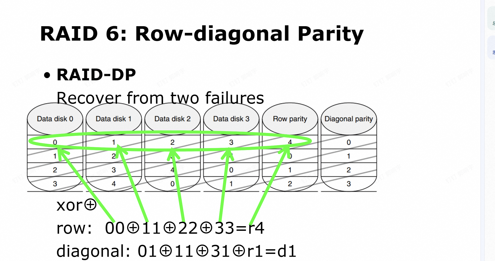
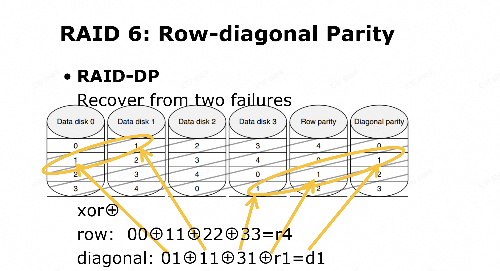

# 趋势与性能

## 技术趋势
- **5 种实现技术**：
  - 集成电路逻辑技术 (Integrated circuit logic technology)
  - 半导体 DRAM (Semiconductor DRAM)
  - 半导体闪存 (Semiconductor Flash)
  - 磁性磁盘技术 (Magnetic disk technology)
  - 网络技术 (Network technology)

## 功率与能量 (Power vs Energy)
- **如何测量功率？**
  - $Power = \text{单位时间内的能量}$
  - $1 \text{ 瓦特 (watt)} = 1 \text{ 焦耳/秒 (joule per second)}$
  - $\text{执行工作负载的能量} = \text{平均功率} \times \text{执行时间}$

## 🔋 微处理器的两大能耗：静态能耗 vs 动态能耗
这两个概念是理解CPU功耗的核心，我们可以从**来源、公式、影响因素、优化方向**四个维度来拆解：

---

### 1. 动态能耗（Dynamic Energy / Dynamic Power）
**核心定义**：晶体管在**0和1之间翻转状态**时，对负载电容充放电产生的能量消耗，是CPU「干活」时的主要功耗来源。

- **产生原因**：
  CMOS逻辑门在状态切换（0→1或1→0）时，需要给内部电容充电/放电，这个过程会消耗电能。
- **核心公式**：
  - 单次翻转能量：\( E_{\text{dynamic}} = \frac{1}{2} C V^2 \)
  - 动态功率（每秒消耗）：\( P_{\text{dynamic}} = \frac{1}{2} C V^2 f \alpha \)
    - \( C \)：负载电容（电路/线的寄生电容）
    - \( V \)：工作电压
    - \( f \)：时钟频率
    - \( \alpha \)：翻转因子（平均每个周期内晶体管翻转的比例）
- **关键影响**：
  电压是**平方级影响**，降低电压能大幅削减动态能耗；频率越高、翻转越频繁，功耗也越高。
- **典型场景**：
  CPU跑满负载、执行复杂计算时，动态功耗占绝对主导。

---

### 2. 静态能耗（Static Energy / Leakage Power）
**核心定义**：即使晶体管**保持稳定状态（不翻转）**，也会因微小漏电流产生的能量消耗，只要通电就存在，和「是否干活」无关。

- **产生原因**：
  现代CMOS晶体管尺寸极小，即使关断也会有微弱电流泄漏（亚阈值漏电流、栅极漏电流等），这部分电流在电压下转化为功耗。
- **核心公式**：
  静态功率：\( P_{\text{static}} = V \cdot I_{\text{leakage}} \)
    - \( I_{\text{leakage}} \)：总漏电流
- **关键影响**：
  温度越高，漏电流越大；工艺越先进（晶体管越小），漏电流越难控制，静态功耗占比会显著上升。
- **典型场景**：
  手机/笔记本待机、CPU idle 时，动态功耗几乎为0，此时静态能耗就是主要耗电来源。

---

### 📊 核心对比表
| 维度                | 动态能耗 (Dynamic)                | 静态能耗 (Static/Leakage)          |
|---------------------|----------------------------------|-----------------------------------|
| **触发条件**        | 晶体管状态翻转（0↔1）             | 仅需通电，与是否翻转无关           |
| **主要来源**        | 电容充放电                        | 晶体管漏电流                       |
| **与电压关系**      | 正比于 \( V^2 \)（影响极大）      | 正比于 \( V \)                    |
| **与频率关系**      | 正比于频率 \( f \)                | 与频率无关                         |
| **工艺演进趋势**    | 随工艺缩小，电容 \( C \) 减小      | 随工艺缩小，漏电流 \( I \) 显著增大 |
| **优化手段**        | 降电压、降频率、门控时钟、减翻转   | 电源门控、高阈值晶体管、控温、低电压 |

---

### 💡 直观理解
- **动态能耗**：像「开车时的油耗」——踩油门（翻转）才会耗油，开得越快（频率高）、载得越重（电容大），油耗越高。
- **静态能耗**：像「发动机怠速油耗」——车没动（不翻转），但发动机还转着（通电），依然会烧油，而且天越热（温度高）、发动机越老（工艺落后），怠速油耗越高。

## 能效优化

这两张PPT完整介绍了**提升计算机芯片能效（Energy-Efficiency）的4种核心方法**，我帮你逐一拆解：

---

### 方法1：do nothing well（高效闲置）
- **核心思路**：让不干活的模块彻底“停转”，避免无效能耗
- **具体操作**：关闭**不活跃模块（inactive modules）**的时钟信号（也叫**门控时钟 Clock Gating**）
- **原理**：动态能耗来自晶体管0/1状态翻转，关掉时钟后，模块内晶体管不再翻转，动态能耗直接降为0
- **适用场景**：CPU中暂时不用的核心、缓存、接口模块等，在 idle 时切断时钟

---

### 方法2：DVFS（动态电压频率调节）
- **全称**：Dynamic Voltage-Frequency Scaling
- **核心思路**：根据负载动态“降频降压”，用更低性能换更高能效
- **具体操作**：轻负载时同步降低**时钟频率（frequency）**和**工作电压（voltage）**
- **公式依据**：
  \[
  \text{Power}_{\text{dynamic}} \propto \frac{1}{2} \times C \times V^2 \times f_{\text{switched}}
  \]
  电压是**平方级影响**，频率是线性影响，降频降压能大幅削减动态功耗
- **适用场景**：浏览网页、听音乐等轻负载任务，用户感知不到延迟，但能耗大幅降低

---

### 方法3：design for typical case（为典型场景设计）
- **核心思路**：贴合设备最常见的使用状态优化，而非追求极端峰值性能
- **典型场景**：手机（PMDs）、笔记本**90%时间处于 idle（空闲/待机）**，只有偶尔跑满性能
- **具体操作**：给内存、存储等组件设计**低功耗模式**（如内存自刷新、SSD休眠），在 idle 时关闭不必要电路，压低静态功耗
- **效果**：因为设备大部分时间 idle， idle 功耗的下降会直接带来整体续航和能效的大幅提升

---

### 方法4：overclocking – Turbo mode（超频/睿频模式）
- **核心思路**：用“短时间爆发性能”快速完成任务，然后回到低功耗 idle 状态
- **具体操作**：芯片短时间跑在**高于标称的时钟频率**（超频），直到温度升高到安全阈值，再自动降回正常频率
- **为什么能效更高**：
  虽然超频时瞬时功耗更高，但任务执行时间大幅缩短，芯片能更早回到 idle 低功耗状态
  总能耗 = 执行功耗×执行时间 + idle功耗×空闲时间，最终总能耗反而更低
- **适用场景**：打开APP、处理用户输入等**突发短任务**，不适合长时间满负载（会因过热降频）

---

### 一句话总结
- 方法1/2：**让“干活”的部分更省电**
- 方法3：**让“躺平”的部分更省电**
- 方法4：**快点干完活，然后赶紧躺平省电**

## cost

## 制造成本


### 第二张图：集成电路的基础生产流程
标题：**Integrated Circuit（集成电路）**
- **Wafer（晶圆）**：是制造芯片的圆形硅片，先在晶圆上完成芯片的制造与测试。
- **Die（晶粒/裸片）**：测试完成后，晶圆会被切割成一个个小方块，这些就是**晶粒**，之后会被送去进行封装，最终变成我们使用的芯片。

简单说：**晶圆 → 测试 → 切割成晶粒 → 封装 → 成品芯片**。

---

### 第一张图：影响芯片成本的核心因素
标题：**Various Impacts（各种影响因素）**
1.  **Time（时间）**
    对应**学习曲线效应**：随着生产时间积累，工人和工艺越来越熟练，**制造成本会随时间持续下降**。
2.  **Volume（产量/规模）**
    对应**规模经济+学习曲线**：产量每翻一倍，单位制造成本大约会降低**10%**，产量越大，分摊到每个芯片的固定成本就越少。
3.  **Commoditization（商品化/同质化）**
    当芯片变成标准化“商品”后，供应商之间竞争加剧，大家会拼命提升**生产规模效率**来压低成本，进一步拉低价格和利润空间。

---

### 整体逻辑
这是在讲：**芯片的生产是从晶圆到晶粒的过程，而它的成本会被时间（经验）、产量（规模）、商品化（竞争）这三个因素显著影响，最终让芯片成本随时间和产量不断下降**。

## 晶圆和晶粒

这张PPT讲的是**如何计算一片晶圆（Wafer）能切割出多少个可用的芯片晶粒（Die）**，也就是 **Dies per Wafer（每晶圆晶粒数）**。

---

### 公式拆解
\[
\text{Dies per wafer} = \frac{\pi \times (\text{Wafer diameter}/2)^2}{\text{Die area}} - \frac{\pi \times \text{Wafer diameter}}{\sqrt{2 \times \text{Die area}}}
\]

1.  **第一部分（理论最大值）**
    \[
    \frac{\pi \times (\text{Wafer diameter}/2)^2}{\text{Die area}}
    \]
    - \(\pi \times (\text{Wafer diameter}/2)^2\)：**晶圆的总面积**（圆的面积公式，半径 = 直径/2）
    - 除以单个晶粒的面积（Die area）：得到**如果晶圆是无限大、可以完全铺满时的理论晶粒总数**（没考虑边缘浪费）

2.  **第二部分（修正项，减去边缘浪费）**
    \[
    \frac{\pi \times \text{Wafer diameter}}{\sqrt{2 \times \text{Die area}}}
    \]
    - 这部分是用来**减去晶圆边缘那些不完整、无法使用的晶粒数量**
    - \(\sqrt{2 \times \text{Die area}}\) 可以理解为单个晶粒的对角线长度（假设晶粒是正方形）
    - 整体用来估算边缘区域会浪费多少个晶粒，从理论总数里扣掉，得到**更贴近实际的可用晶粒数**

---

### 直观理解
图里的圆形是**晶圆（Wafer）**，切出来的小方块是**晶粒（Die）**——也就是还没封装的芯片裸片。
这个计算对芯片成本至关重要：
- 每片晶圆的制造成本是固定的
- **Dies per wafer 越多**，分摊到每个晶粒上的成本就越低，芯片也就越便宜

## 晶粒制造成本

---

### 公式拆解
\[
\text{Cost of die} = \frac{\text{Cost of wafer}}{\text{Dies per wafer} \times \text{Die yield}}
\]

- **Cost of die**：单个合格晶粒（裸芯片）的成本
- **Cost of wafer**：整片晶圆的制造成本（包含材料、工艺、设备、人工等固定开销）
- **Dies per wafer**：每片晶圆能切割出的晶粒总数（由晶圆尺寸和晶粒面积决定，就是我们之前学的那个公式）
- **Die yield**：晶粒良率，指**通过测试的合格晶粒占总制造晶粒数的比例**（比如良率80%，就代表100个晶粒里有80个是好的）
- **分母（Dies per wafer × Die yield）**：每片晶圆最终能得到的**合格晶粒总数**

---

### 核心逻辑
1.  **成本分摊**：整片晶圆的成本是固定的，要计算单个合格芯片的成本，就用「晶圆总成本 ÷ 合格晶粒数量」。
2.  **关键影响因素**：
    -   **晶圆成本**：越高则单个芯片越贵。
    -   **每晶圆晶粒数**：越多则分摊到每个晶粒的成本越低（比如大尺寸晶圆、小面积晶粒更划算）。
    -   **晶粒良率**：越高则合格晶粒越多，单个成本越低；良率低会让大量成本浪费在报废的坏晶粒上，大幅推高单个合格芯片的价格。

---

### 直观理解
图里的圆形是晶圆，切出来的小方块是晶粒。不是所有小方块都能变成可用芯片，只有通过测试的才会被计入分母，所以**良率直接决定了“有多少个晶粒能真正分摊晶圆成本”**。

## 杂七杂八

我帮你把这四张PPT的核心内容总结成四个模块：

---

### 1. 如何提升芯片晶粒良率（Die Yield）？
核心方法是**冗余设计（Redundancy）**：
- 像DRAM/SRAM这类存储器芯片，会预先预留一些冗余的存储单元。
- 当制造过程中出现局部缺陷时，可以用这些冗余单元替换掉有问题的部分，避免整个晶粒直接报废，从而大幅提升良率。

---

### 2. 集成电路的全成本计算
公式：
\[
\text{Cost of Integrated Circuit} = \frac{\text{Cost of die} + \text{Cost of testing die} + \text{Cost of packaging and final test}}{\text{Final test yield}}
\]
- 分子：把**裸片成本、裸片测试成本、封装成本、最终测试成本**全部加总，代表从生产到成品的全流程开销。
- 分母：**最终测试良率**，也就是最终合格成品的比例，用来把总成本分摊到每一个合格芯片上。

---

### 3. 芯片的成本与定价逻辑
- **定价公式**：`Price = Cost + Margin`（价格 = 成本 + 毛利）
- **Margin（毛利）**：不只是利润，还覆盖了**研发（R&D）、营销、销售、设备维护、厂房租金、融资成本、税费**等所有非直接制造成本，这些都要通过定价回收。

---

### 4. 计算设备成本模式的演变
- **传统模式**：只关注**资本性支出（CAPEX）**，也就是制造/采购计算机的一次性硬件成本。
- **现代模式**：针对大规模数据中心（WSCs），因为有成千上万台服务器，**运营性支出（OPEX）**（如电费、冷却、运维、人力等）变得极其高昂，所以现在必须同时重视CAPEX和OPEX。

---

整体来看，这组PPT是在讲**从芯片制造良率 → 芯片全成本 → 芯片定价 → 再到数据中心级别的成本模式**的完整逻辑链，核心是理解半导体和计算系统里「成本如何产生、如何分摊、如何定价」的底层逻辑。

## 可靠性、

这里真的有点无聊 看ppt把

## DISK:raid

### raid6




我用**最直白的方式**拆解 RAID-DP 的规则，你就能看懂了👇

---

#### 核心前提：异或（XOR）的魔法 ✨
所有校验都基于 **异或运算（⊕）**，它的关键性质是：
> 如果 `a ⊕ b ⊕ c = d`，那么知道任意3个，就能算出第4个（比如 `a = b ⊕ c ⊕ d`）。
这是“丢了数据能算回来”的核心原理。

---

#### 规则1：行校验（Row Parity）——水平组队
**规则**：
- 把**同一行（水平方向）**的所有**数据盘**拿出来，做异或运算。
- 把结果存到「行校验盘」的**同一行位置**。

**例子（看PPT里的行公式）**：
```
Data0_row4 ⊕ Data1_row4 ⊕ Data2_row4 ⊕ Data3_row4 = RowParity_row4
00   ⊕   11   ⊕   22   ⊕   33   =   r4
```
- 这一行里如果有1个数据丢了（比如`Data1_row4`没了），用剩下的3个数据 + `r4` 就能反算出 `11`。

---

#### 规则2：对角校验（Diagonal Parity）——斜向组队
**规则**：
- 把**斜向（对角方向）**的一组数据 + 对应的**行校验位**拿出来，做异或运算。
- 把结果存到「对角校验盘」的对应位置。

**怎么找对角组？看黄色箭头**：
- 比如图里的箭头：`Data0_row2` → `Data1_row3` → `Data3_row1` → `RowParity_row1`
- 这4个就是一个对角组，异或结果存到 `DiagonalParity_row2`。

**公式（PPT里的对角公式）**：
```
Data0_row2 ⊕ Data1_row3 ⊕ Data3_row1 ⊕ RowParity_row1 = DiagonalParity_row2
01    ⊕   11    ⊕   31    ⊕    r1     =    d1
```
- 这个组里如果有1个数据丢了，用剩下的3个 + `d1` 就能反算回来。

---

#### 为什么要搞两套校验？——为了扛「两块盘同时坏」
- **行校验**：只能解决「1个盘故障」（因为只有一套方程，只能解1个未知数）。
- **对角校验**：和行校验**完全独立**，相当于第二套方程。
- 当**两块盘同时坏**时：
  - 每个丢失的数据块，都能通过「行校验方程 + 对角校验方程」联立求解（两个未知数 ↔ 两个方程）。
  - 比如 Data0 和 Data1 都挂了，我们能通过行和对角的两套公式，把所有丢失的数据算回来。

---

### 一句话总结规则
1.  **行校验**：同一行数据 → 异或 → 存行校验盘。
2.  **对角校验**：斜向一组数据 + 对应行校验 → 异或 → 存对角校验盘。
3.  **双保险**：两套独立校验，让系统能扛住**任意两块盘同时失效**，还能完整恢复数据。

### 注意

我的图里面的11 00 01代表的不是数据 而是一个位置的表示 比较有规律（至于规律是啥 自己找） 这种可以同时解决两列都出问题的情况

## 两个原则

这张PPT讲的是**计算机系统设计的两大核心定量原则**：**并行性（Parallelism）**和**局部性（Locality）**，它们是提升性能、优化存储/计算效率的底层逻辑。

---

### 1. Parallelism（并行性）
核心思想：**同时执行多个操作，用“并发”来加速整体计算/处理**。
- 本质是把大任务拆成多个小任务，让多个硬件单元（CPU核心、磁盘、内存通道等）同时干活，从而提升吞吐量或降低延迟。
- 例子：
  - CPU里的**多核心并行**：多个核心同时执行不同指令。
  - 存储里的**I/O并行**：RAID阵列多盘同时读写、内存多通道并行访问。
  - 指令级并行：CPU流水线、超标量技术，让多条指令重叠执行。

---

### 2. Locality（局部性原理）
这是**缓存（Cache）设计的核心依据**，描述了程序访问数据/指令的规律，分两类：

#### ① Temporal locality（时间局部性）
> *recently accessed items are likely to be accessed in the near future*
- 含义：**刚被访问过的数据/指令，在不久的将来很可能再次被访问**。
- 例子：循环里的计数器变量、函数里的局部变量，会被反复读取/修改，所以可以把它们存在高速缓存里，下次直接从缓存取，不用再去慢的主内存找。

#### ② Spatial locality（空间局部性）
> *items whose addresses are near one another tend to be referenced close together in time*
- 含义：**地址相邻的数据/指令，在时间上很可能被连续访问**。
- 例子：遍历数组时，访问了`a[0]`，接下来大概率会访问`a[1]`、`a[2]`，所以缓存会把相邻的一整块数据（比如64字节的缓存行）一起加载进来，后续访问就不用再去内存读了。

---

### 整体意义
- **并行性**：用“同时做”来直接提升计算/IO的速度。
- **局部性**：利用程序访问规律，用高速缓存来缩小CPU和内存之间的速度差距，让系统跑得更快。

这两个原则贯穿了从CPU、内存到存储、网络的几乎所有计算机系统设计环节。

