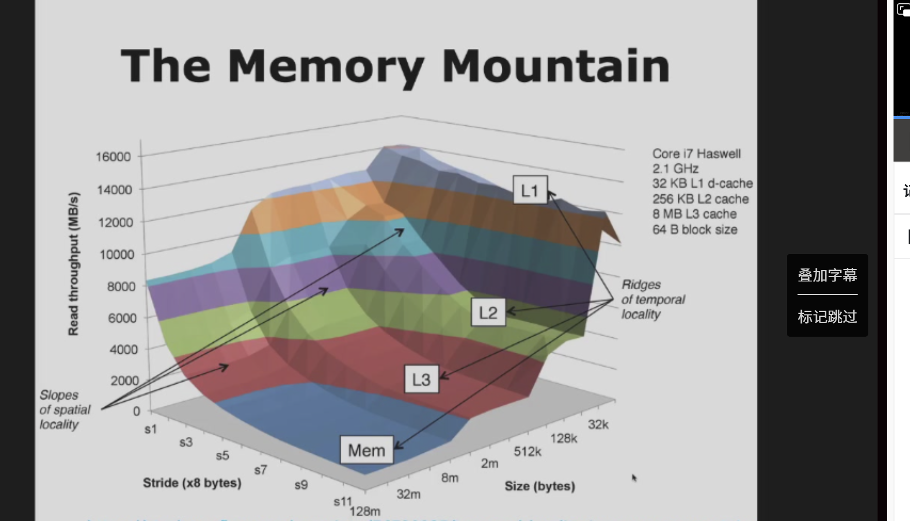
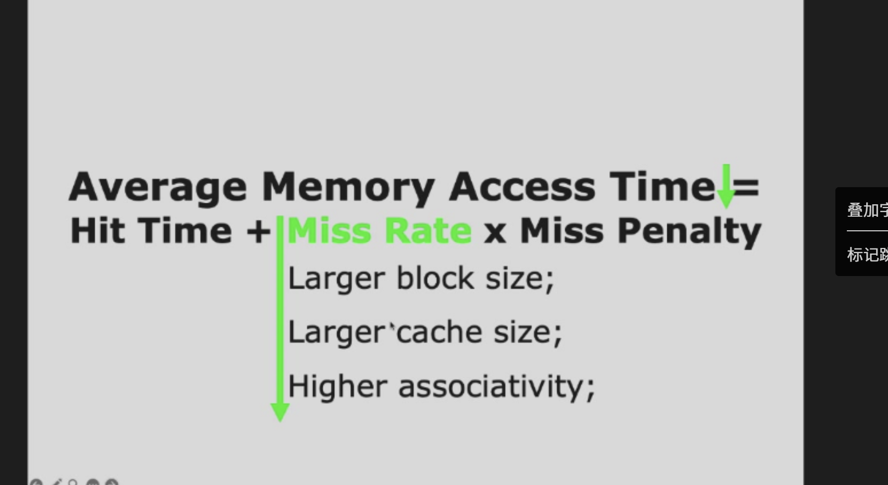
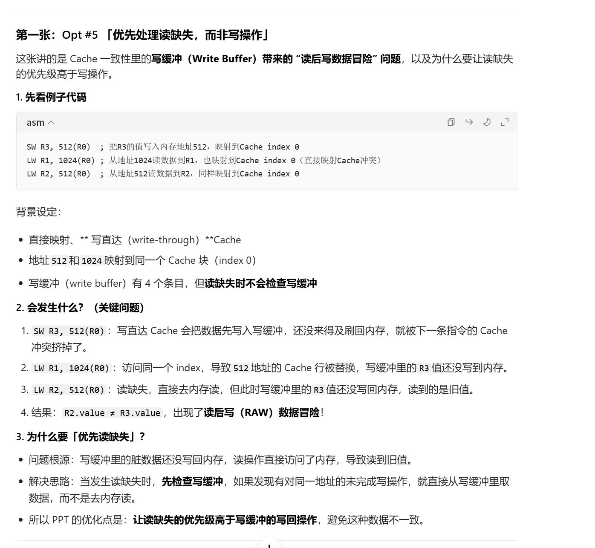
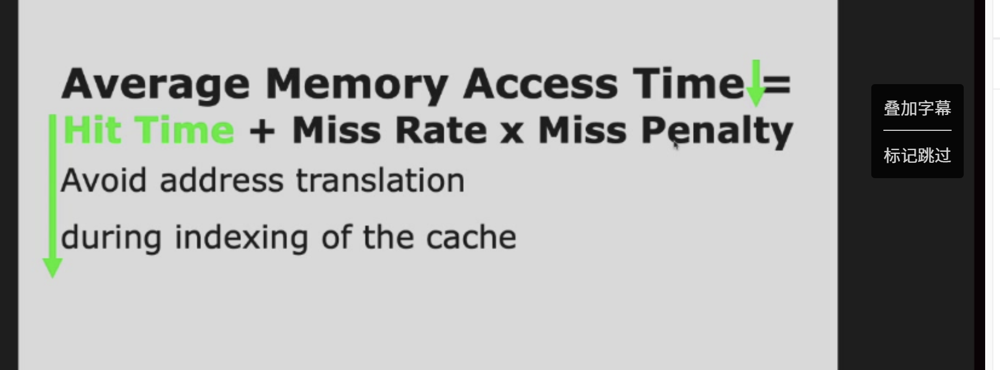
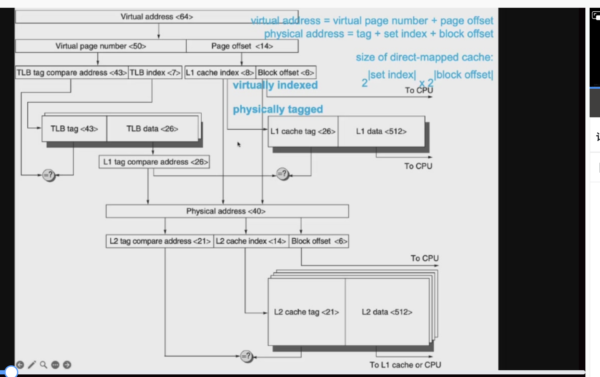

# memory

## 内存山

这张图叫 **内存山（Memory Mountain）**，是计算机系统领域用来可视化**存储层次（Cache + 主存）性能**的经典图表，直观展示了**局部性原理**对内存访问吞吐量的影响。

---

### 1. 坐标轴与核心含义
- **纵轴（Read throughput）**：读取吞吐量（单位 MB/s），数值越高代表数据读取速度越快。
- **横轴1（Size）**：**工作集大小**（Working Set Size），从几十字节到几十MB，代表当前程序正在访问的数据总量。
- **横轴2（Stride）**：**访问步长**（Stride），单位是 `×8 字节`，比如 `s1` 代表每次访问地址+8字节，`s11` 代表每次+88字节。步长越大，空间局部性越差。

---

### 2. 存储层次的“山峰”与“山谷”
图里标注了四层存储，对应不同的性能区域：
- **L1（L1 数据缓存）**：32KB，速度最快，是图里最高的“山峰”，吞吐量可达 ~12000+ MB/s。
- **L2（L2 缓存）**：256KB，速度次之，吞吐量 ~8000 MB/s。
- **L3（L3 缓存）**：8MB，速度再次之，吞吐量 ~4000 MB/s。
- **Mem（主存）**：速度最慢，是图里的“山谷”，吞吐量只有 ~2000 MB/s 甚至更低。

---

### 3. 局部性原理的直观体现
- **时间局部性（Ridges of temporal locality）**：
  沿着 `Size` 轴，当工作集刚好能放进 L1/L2/L3 时，就会形成一条“山脊”（吞吐量高峰）——因为数据被缓存在高速层里，反复访问时速度极快。
  一旦工作集超过缓存容量，就会“掉”到下一层存储，吞吐量骤降。

- **空间局部性（Slopes of spatial locality）**：
  沿着 `Stride` 轴，步长越小（比如 `s1`，访问相邻数据），空间局部性越好，吞吐量越高；步长越大（比如 `s11`，跳着访问），空间局部性越差，吞吐量就会沿着“斜坡”往下掉——因为缓存预取失效，每次都要去下层存储读取数据。

---

### 4. 整体意义
这张图用“山”的形态，生动说明了：
- 程序的**局部性越好**（工作集小、步长小），内存访问速度就越快（站在“山顶”）。
- 一旦局部性变差，性能就会急剧下跌（滑向“山谷”，落到主存）。
- 它是理解**缓存设计、程序性能优化**的核心可视化工具。

## **主存（Main Memory）的核心性能指标**

---

### 一、先搞懂两个核心大指标：延迟(Latency) vs 带宽(Bandwidth)
这是内存性能的两个根本维度，对应数据传输的「首字」和「后续字」：

#### 1. 延迟 (Latency)
> **定义**：`the time to retrieve the first word of the block`
> 也就是**从发出读请求，到拿到数据块第一个字的时间**。
- **核心特点**：
  - 对**缓存系统**至关重要：缓存不命中时，CPU必须等主存把第一个字送过来才能继续执行，延迟直接决定了CPU的等待时间。
  - **极难优化**：受限于DRAM的物理结构、信号传播速度、总线时序等硬件底层限制，很难通过架构设计大幅降低。
- **细分指标（第二页补充）**：
  - **访问时间 (Access Time)**：从发请求到数据完整到达的总时间（就是上面说的延迟本身）。
  - **周期时间 (Cycle Time)**：两次独立内存访问之间的最小间隔时间（比如你刚发了一个读请求，多久之后才能发下一个），决定了内存的连续访问效率。

#### 2. 带宽 (Bandwidth)
> **定义**：`the time to retrieve the rest of this block`
> 也就是**拿到第一个字后，传输数据块剩余部分的速度**，本质是单位时间内能传输的数据总量。
- **核心特点**：
  - 对**多核处理器、I/O设备、大缓存块**场景至关重要：多核同时访存、硬盘/网卡高速读写、缓存一次性加载大块数据时，带宽直接决定系统吞吐量。
  - **相对容易优化**：可以通过架构设计大幅提升，比如：
    - 多体交叉内存（multi-bank memory，图中提到的例子）：把内存分成多个独立存储体，并行访问。
    - 更宽的总线位宽、更高的总线频率、DDR（双倍数据率）技术等。

---

### 二、关键概念的深度拆解（帮你彻底分清）
#### 1. 延迟 vs 带宽：用「快递」类比秒懂
| 指标 | 快递类比 | 核心影响 |
|------|----------|----------|
| **延迟** | 快递从下单到第一个包裹送到你手上的时间 | 决定你「多久能拿到第一个东西」，对应CPU的等待时间 |
| **带宽** | 快递员后续连续送包裹的速度（比如每小时送多少件） | 决定你「多久能拿完所有东西」，对应系统的总吞吐量 |

#### 2. 访问时间 vs 周期时间：DRAM的核心特性
- **访问时间**：单次读操作的「响应时间」，比如DDR4内存的访问时间约10-15ns。
- **周期时间**：两次操作的「间隔时间」，通常比访问时间短（比如DDR4-3200的周期时间约0.625ns），因为DRAM可以在当前访问还没完全结束时，就发起下一次预充电/行激活，实现流水线化。
- 举个例子：你去银行取钱，**访问时间**是你从排队到拿到钱的时间，**周期时间**是前一个人办完到下一个人开始办的最小间隔。

#### 3. 为什么延迟难降、带宽好升？
- **延迟的物理限制**：DRAM的行地址选通、列地址选通、电容充电/放电都需要固定时间，信号在PCB上的传播也有光速限制，这些都是物理硬约束，很难通过架构优化突破。
- **带宽的架构优化空间**：带宽 = 总线位宽 × 频率 × 倍率（比如DDR的双倍率），可以通过加宽总线、提频、多通道、多存储体并行等方式线性提升，优化空间极大。

---

### 三、和前面存储器层次结构的关联
- **缓存为什么依赖延迟？**：缓存的核心作用就是「用小容量高速存储，避免CPU等待主存延迟」，主存延迟越低，缓存不命中时的性能损失越小。
- **多核为什么依赖带宽？**：多个CPU核心同时访问主存时，带宽不够会导致访存排队，出现「内存墙」问题，所以现代服务器/消费级CPU都用多通道内存（比如DDR5双通道、四通道）来提升带宽。
- **大缓存块为什么依赖带宽？**：缓存块越大，一次性从主存加载的数据越多，带宽越高，加载完成的时间越短，缓存效率越高。

---

### 四、一句话总结
这两页PPT就是在讲：**评估主存性能，核心看两个维度——「延迟（多久能拿到第一个数据）」和「带宽（多久能传完所有数据）」；延迟是缓存的命根子，极难优化；带宽是多核/I/O的核心，容易通过架构设计提升**。

## 📊 SRAM vs DRAM 核心特性对比
这两张PPT是在讲解计算机存储体系中两种核心的**随机存取存储器（RAM）**：**SRAM（静态随机存取存储器）** 和 **DRAM（动态随机存取存储器）** 的核心区别，下面给你逐点拆解+深度对比。

---

### 一、SRAM（静态随机存取存储器）
#### 核心定义
**Static Random Access Memory**，静态随机存取存储器，是一种**不需要刷新**就能保持数据的RAM。

#### 关键特性
1.  **6管存储单元**：每1比特数据需要6个晶体管组成的双稳态触发器存储，结构复杂、面积大。
    - 双稳态结构的核心优势：**读取操作不会破坏数据**，不会出现“读即擦除”的问题，因此不需要读后重写。
2.  **无需刷新**：数据由触发器的稳定状态保持，不需要周期性刷新电路。
    - 直接结果：**访问时间（access time）几乎等于周期时间（cycle time）**，可以连续高速读写，延迟极低。

---

### 二、DRAM（动态随机存取存储器）
#### 核心定义
**Dynamic Random Access Memory**，动态随机存取存储器，是一种**需要周期性刷新**才能保持数据的RAM。

#### 关键特性
1.  **1管存储单元**：每1比特数据仅需1个晶体管+1个电容存储，结构极简、面积小、成本低。
    - 电容的物理特性：**读取操作会放电，直接破坏原有数据**，因此每次读取后必须执行“读后重写”来恢复数据。
2.  **必须周期性刷新**：电容会自然漏电，数据会随时间丢失，因此需要每隔~64ms刷新一次，补充电荷。
    - 直接结果：**周期时间（cycle time）远大于访问时间（access time）**，因为周期时间需要包含刷新开销，无法连续高速读写，延迟更高。

---

### 三、核心差异对照表（一目了然）
| 特性 | SRAM（静态RAM） | DRAM（动态RAM） |
| :--- | :--- | :--- |
| **存储单元结构** | 6个晶体管（6T） | 1个晶体管+1个电容（1T1C） |
| **数据保持方式** | 双稳态触发器，无需刷新 | 电容存储，必须周期性刷新 |
| **读取特性** | 非破坏性读取，无需重写 | 破坏性读取，读后必须重写 |
| **速度** | 极快，访问时间≈周期时间 | 较慢，周期时间>访问时间（受刷新限制） |
| **集成度/成本** | 集成度低、成本高 | 集成度高、成本低 |
| **功耗** | 待机功耗高（触发器持续耗电） | 待机功耗低（仅刷新时耗电） |
| **典型应用** | CPU高速缓存（L1/L2/L3 Cache） | 计算机主存（内存条） |

---

### 四、补充：为什么会有这种设计差异？
- **SRAM**：用“多晶体管、高成本、高功耗”换“零刷新、零延迟、高速稳定”，因此用在CPU内部的高速缓存，匹配CPU的超高运算速度。
- **DRAM**：用“单晶体管、低成本、高集成度”换“需要刷新、延迟更高”，因此用在计算机主存，用大容量满足程序运行的内存需求，平衡性能与成本。

---

### 五、关键术语解释
- **访问时间（Access Time）**：从发出读写请求到数据完成传输的时间，衡量单次读写的延迟。
- **周期时间（Cycle Time）**：连续两次读写操作之间的最小间隔时间，衡量最大吞吐率。
  - SRAM：因为无需刷新、无读后重写，两次读写可以无缝衔接，所以`访问时间≈周期时间`。
  - DRAM：因为需要刷新、读后重写，两次读写之间必须留足恢复/刷新时间，所以`周期时间 > 访问时间`。

# 🧠 DRAM 组织结构（DRAM Organization）深度解析
这几张PPT是在讲解**DRAM（动态随机存取存储器）的内部物理结构、寻址逻辑和核心操作流程**，是理解内存延迟、带宽和性能优化的核心基础。下面逐图拆解+原理深度说明。

---

## 一、核心结构总览
### 1. 层级化组织：Bank → Row → Column
DRAM 采用**三维层级结构**来组织存储单元：
- **Bank（存储体/库）**：最上层的独立存储分区，一个DRAM芯片通常包含多个Bank（如DDR4常见8个Bank），不同Bank可以并行操作，是内存并发的核心来源。
- **Row（行）**：每个Bank内部是一个巨大的二维存储阵列，横向为行，纵向为列。**一行数据会被完整地读入行缓冲（Row Buffer）**，是DRAM的核心操作单位。
- **Column（列）**：行内的具体存储单元，对应最终要读写的具体数据。

---

## 二、核心操作与信号详解
### 1. 三大核心操作（Act / Pre / CAS）
#### （1）Act（Activate，行激活命令）
- 作用：**打开指定Bank中的某一行**，将整行数据从存储阵列完整读取到行缓冲（Row Buffer）中。
- 代价：这是DRAM中**延迟最高的操作**（tRCD，行地址到列地址延迟），因为需要给电容充电、放大信号，耗时纳秒级。
- 逻辑：只有行被激活后，才能对该行内的列进行读写。

#### （2）Pre（Precharge，预充电命令）
- 作用：**关闭当前Bank中已激活的行**，将行缓冲的数据写回存储阵列，并为下一次行激活做准备。
- 补充说明：PPT中提到`Pre command opens or closes a bank`，本质是：
  - 预充电会**关闭当前激活的行**，让Bank回到空闲状态；
  - 只有预充电完成后，才能激活同一Bank的另一行。
- 代价：tRP（预充电延迟），是行切换的核心开销。

#### （3）CAS（Column Access Strobe，列地址选通脉冲）
- 作用：**在已激活的行中，选中指定列，执行读写（Rd/Wr）操作**。
- 对应延迟：tCL（CAS Latency，列地址选通延迟），是内存时序CL参数的来源。
- 特性：同一行内的连续列读写延迟极低（仅tCL），这就是**内存局部性（Locality）**的核心原理：连续访问同一行数据速度远快于跨行访问。

---

## 三、完整读写流程（DRAM访问的本质）
一次标准的DRAM读操作，必须遵循严格的时序流程：
1.  **Precharge（预充电）**：确保目标Bank处于空闲状态（无激活行）。
2.  **Activate（行激活）**：发送行地址，激活目标行，将整行数据读入行缓冲（耗时tRCD）。
3.  **CAS（列选通）**：发送列地址，选中目标列，从行缓冲中读取数据（耗时tCL）。
4.  **Precharge（预充电）**：关闭当前行，准备下一次访问。

> 关键结论：
> - **同一行内连续访问**：只需1次行激活，后续仅需CAS，延迟极低（≈tCL），带宽拉满。
> - **跨行/跨Bank访问**：必须重复「预充电→行激活→CAS」流程，延迟大幅增加（≈tRP + tRCD + tCL），是内存性能瓶颈的核心来源。

---

## 四、结构与性能的底层逻辑
### 1. 为什么要分Bank？
- 解决**行缓冲冲突**：如果只有1个Bank，同一时间只能激活1行，无法并行。多Bank可以同时激活不同行，实现并发访问，提升内存带宽。
- 现代DDR内存（DDR4/DDR5）通过多Bank、Bank Group设计，最大化并行度。

### 2. 行缓冲（Row Buffer）的意义
- DRAM的存储阵列是电容，直接读取会破坏数据，且速度极慢。行缓冲是SRAM构成的高速缓冲，将整行数据一次性读出，后续列访问直接从SRAM读取，速度提升一个数量级。
- 这也是为什么**内存访问的局部性（连续访问）**对性能至关重要：充分利用行缓冲，避免频繁行切换。

### 3. 预充电的必要性
- 行缓冲是共享资源，同一Bank只能有1个激活行。预充电的作用是将行缓冲数据写回电容、重置电路，为下一次行激活做准备，是保证数据一致性的必要操作。

---

## 五、关键术语对照表
| 术语 | 全称 | 核心作用 | 对应延迟 |
| :--- | :--- | :--- | :--- |
| Bank | 存储体/库 | 独立存储分区，支持并行访问 | - |
| Row | 行 | 存储阵列的横向单位，整行读入行缓冲 | tRCD（行激活延迟） |
| Column | 列 | 行内的具体存储单元，对应最终数据 | tCL（CAS延迟） |
| Act | Activate | 行激活，将行数据读入行缓冲 | tRCD |
| Pre | Precharge | 预充电，关闭当前行，准备下一次激活 | tRP |
| CAS | Column Access Strobe | 列选通，在激活行中读写数据 | tCL |
| tRC | Row Cycle Time | 行周期时间 = tRAS（行激活时间） + tRP | 跨行访问的最小间隔 |

---

## 六、补充：和SRAM的结构差异
- SRAM是**直接寻址**，无Bank/Row/Column层级，访问延迟均匀，因此用作CPU高速缓存。
- DRAM是**层级化寻址**，有巨大的行激活开销，因此延迟远高于SRAM，但集成度、容量、成本远优于SRAM，用作系统主存。

---

要不要我再给你补充一份**DRAM访问时序的时间线示意图+内存时序参数（CL/tRCD/tRP）的通俗解释**，帮你彻底搞懂内存性能的核心指标？

这两张PPT展示了DRAM性能的核心瓶颈：**行缓冲命中（Row Buffer Hit）**与**行缓冲冲突（Row Buffer Conflict）**。它们决定了内存访问延迟的“天花板”和“地板”，也是理解内存带宽、优化程序性能的关键物理机制。

---

### 一、核心概念：什么是行缓冲（Row Buffer）？
回顾之前的基础知识，DRAM的存储阵列（Array）中，**一行（Row）**包含成百上千个列（Column）。
因为DRAM是电容存储，信号极弱，所以**不能直接读阵列**。必须先把一整行数据“搬”到一个高速、易读的临时缓冲区——这就是**行缓冲（Row Buffer）**。
后续所有的列访问，都直接在这个缓冲区里进行，不再触碰底层阵列。

---

### 二、第一张图：Row Buffer Hit（行缓冲命中）
**场景**：
你要访问的数据地址依次是 `(Row 0, Column 0)` → `(Row 0, Column 1)`。
**流程**：
1.  **第一次访问 (Row 0, Col 0)**：发送行地址，执行 `Activate (Act)` 命令，将 **Row 0** 加载到行缓冲中。
2.  **第二次访问 (Row 0, Col 1)**：
    *   控制器检查行地址，发现目标行 **还是 Row 0**。
    *   **判定结果**：**命中（Hit）**。
    *   **执行动作**：**不需要再次激活行**。直接发送列地址，通过列多路复用器（Column mux）从已存在的行缓冲中读取数据。
**结论**：
这是DRAM最快的访问模式。**零额外开销**，仅需列选通延迟（tCL），速度极快。

---

### 三、第二张图：Row Buffer Conflict（行缓冲冲突）
**场景**：
你要访问的数据地址序列是：`(Row 0, Col 0)` → `(Row 0, Col 85)` → `(Row 1, Col 0)`。
**流程**：
1.  **前两次访问**：处于同一行（Row 0），正常命中，速度很快。
2.  **第三次访问 (Row 1, Col 0)**：
    *   控制器检查行地址，发现目标行是 **Row 1**。
    *   但此时行缓冲里还装着 **Row 0** 的数据。
    *   **判定结果**：**冲突（Conflict）** / 未命中。
    *   **执行动作**：必须执行**预充电（Precharge）**来清空旧数据，然后执行**行激活（Act）**将 Row 1 载入。
**结论**：
这是DRAM性能下降的罪魁祸首。**开销巨大**，必须付出 `tRP`（预充电延迟）+ `tRCD`（行激活延迟）的代价，访问延迟瞬间飙升。

---

### 四、深度解析：为什么这很重要？
这张PPT本质上揭示了**内存局部性（Locality）**的物理根源：
1.  **最好的情况（Hit）**：如果你访问的数据都在同一行内，DRAM就像SRAM一样快。
2.  **最坏的情况（Conflict）**：如果你频繁切换行，DRAM就必须不断在“清空旧行”和“加载新行”之间折腾，导致巨大的延迟。

### 五、工程优化启示（关键结论）
理解这个机制，对编程和硬件调优有巨大指导意义：
*   **空间局部性是黄金**：代码中尽量顺序访问数组。因为顺序访问通常在同一行内，全是Hit，效率最高。
*   **避免随机跳跃**：如果数据地址随机跳变，导致频繁跨行，就会不断触发Conflict，内存带宽被严重浪费。
*   **Bank Group与多通道**：现代DDR5引入了Bank Group，就是为了减少这种冲突带来的阻塞，提升并行度。

---
**一句话总结**：
行缓冲是DRAM高速访问的唯一通道。**连着访问同行了就是“Hit”，一路顺风；换行了就是“Conflict”，必须停下来重启，速度腰斩。**

需要我为你演示一下如何通过优化代码逻辑（如数组遍历顺序）来减少行缓冲冲突吗？

这两张PPT展示了**DRAM性能提升的两大核心策略**：
1. **利用时序/时钟信号（Timing/Clock）** —— 实现**同步传输**，告别异步等待。
2. **利用空间局部性（Spatial Locality）** —— 实现**批量传输（Block Transfer）**，摊平单次激活成本。

这就是现代SDRAM（同步DRAM）乃至DDR系列内存快的根本原因。

---

### 一、第一张图：提升效率的两种手段
#### 1. Timing signals（时序信号）
*   **核心含义**：抛弃了复杂的异步握手，直接通过**严格的时序控制**，允许在**行缓冲（Row Buffer）**中重复访问，而不需要每次都重新做行激活（Row Access）。
*   **解决的问题**：
    *   之前的DRAM，每次访问都要等待控制器确认，效率很低。
    *   现在通过精确的时序信号（如`tCL`, `tRCD`），CPU可以直接在已打开的行缓冲中连续取数，**零额外开销**。
    *   **关键点**：`w/o another row access time` = **不需要每次都去重新打开一行**。

#### 2. Leverage spatial locality（利用空间局部性）
*   **核心含义**：利用程序“相邻数据往往一起用”的特性，**一次预取1024~4096位（128B~512B）**，而不是一次只读一个字。
*   **对应机制**：
    *   这就是**Cache Line**的物理来源。
    *   DRAM阵列每次激活一行（Row），会一次性把这一行的几KB数据全部塞进行缓冲。
    *   当CPU要取一个32位整数时，内存控制器直接把**包含这个整数的一整块数据（128B/512B）**打包发给Cache。
*   **效果**：将单次“慢”的行激活成本，分摊到成百次连续的列访问上，宏观速度翻倍。

---

### 二、第二张图：进化到 SDRAM（同步DRAM）
这一页是对上一页技术的**标准化与命名**，解释了为什么叫SDRAM。

#### 1. Clock signal（时钟信号）
*   **革命性改进**：在DRAM接口上加入了**系统时钟（Clock）**。
*   **核心作用**：
    *   之前的DRAM是**异步（Asynchronous）**的，控制器发完命令要等内存做完发回来的信号才能继续，等待时间长。
    *   加入时钟后，变成了**同步（Synchronous）**：所有命令、地址、数据都**对齐时钟沿**发送。
    *   **好处**：重复传输时，**不需要再花时间去和内存控制器做同步**（no overhead to synchronize），数据传输流水线化，速度直接拉满。

#### 2. SDRAM：synchronous DRAM（同步DRAM）
*   **核心优化策略**：
    *   **Avoid opening new rows**（避免打开新行）：尽量保持行缓冲打开，利用空间局部性连续读，减少`Precharge`和`Activate`的次数。
    *   **Using block transfer**（使用块传输）：也就是**Burst Mode（突发传输）**。只要给出第一个地址，后续地址自动递增，一次性传输一整块数据（如4字、8字）。
*   **本质**：从“按地址逐个找”变成了“按块批量送”，完美匹配CPU Cache的读取模式。

---

### 三、核心进化逻辑总结（从慢到快）
| 阶段 | 问题 | 解决方案 | 最终效果 |
| :--- | :--- | :--- | :--- |
| **早期 DRAM** | 慢、异步、单独寻址 | 异步握手，单字寻址 | 访问延迟极高，无法匹配CPU |
| **SDRAM (现在)** | **需要同步，需要批量** | 1. **时钟同步** (流水线操作)   2. **块传输** (一次送一片) | **速度暴增**，完美匹配Cache与CPU |

### 四、串联起来看
你现在看的这几张图，讲的是**DRAM如何进化出“高速感”**：
1. **基础物理层**：因为是电容，必须靠**Row Buffer**中转（之前讲的Act/Pre）。
2. **策略优化层**：利用**空间局部性**，一次搬一整块（Block Transfer）。
3. **接口加速层**：加上**时钟信号**，用同步时钟代替异步等待，实现流水线式的块传输（Burst）。

这就是为什么现在的内存（DDR4/DDR5）虽然容量很大，但访问速度依然能跟上CPU Cache的节奏，核心就在于**“尽量不换页（Row Buffer Hit）”**和**“批量打包送（Block Transfer）”**。

要不要我给你讲一下**Burst Length（突发长度）**具体是怎么控制这1024-4096位数据传输的？

# 🛡️ 内存可靠性：奇偶校验(Parity)、ECC、Chipkill 三大纠错方案详解
这两张PPT是**内存错误检测与修复技术**的核心对比，从原理到实际服务器场景的可靠性，完整讲清了三种方案的优劣，是理解服务器内存可靠性的关键。

---

## 一、第一张图：两种基础纠错方案的原理
### 1. Parity only（仅奇偶校验）
- **核心原理**：每8个数据位，额外加1个**奇偶校验位（Parity Bit）**，总开销仅1bit。
  - 比如：8bit数据 `10100101`，统计1的个数（4个，偶数），奇偶位设为`0`（偶校验）。
  - 读取时重新计算1的个数，和校验位对比：如果不一致，说明**出现了1个bit错误**。
- **核心局限**：
  - ✅ **只能检测单bit错误**，无法定位错误位置，**完全不能修复错误**。
  - ❌ 无法检测**偶数个bit错误**（两个bit同时翻转，奇偶性不变，完全漏检）。
  - ❌ 发现错误后，只能报错，无法纠正，系统只能崩溃/重启。

### 2. ECC only（仅ECC纠错，Error-Correcting Code）
- **核心原理**：每64个数据位，额外加8个**ECC校验位**，总开销8bit（12.5%）。
  - 基于汉明码（Hamming Code）原理，不仅能检测错误，还能定位错误位置。
- **核心能力**：
  - ✅ **检测2个bit错误，纠正1个bit错误**（SEC-DED：单错纠正，双错检测）。
  - ✅ 单bit软错误可以自动修复，系统完全无感知，正常运行。
  - ❌ 多bit错误（2个及以上）只能检测，无法纠正，会触发系统报错。

---

## 二、第二张图：大规模服务器场景下的可靠性实测
PPT用一个**10000核CPU、每核4GiB内存（总内存40TiB）的超大规模服务器**，统计3年内的**不可恢复/未检测错误**数量，直观对比三种方案的可靠性：

| 方案 | 3年不可恢复错误总数 | 错误频率 | 核心说明 |
| :--- | :--- | :--- | :--- |
| **Parity only（仅奇偶校验）** | ~90,000次 | **每17分钟1次** | 奇偶校验完全无法应对大规模服务器的软错误，漏检率极高，几乎无法正常运行 |
| **ECC only（仅ECC）** | ~3,500次 | **每7.5小时1次** | ECC大幅降低错误率，但在超大规模集群中，多bit错误仍会频繁发生，可靠性不足 |
| **Chipkill（芯片级纠错）** | ~6次 | **每2个月1次** | 可靠性爆炸式提升，是超大规模服务器/数据中心的标配 |

---

## 三、关键补充：Chipkill 是什么？
Chipkill是**ECC的升级方案**，也叫**内存芯片级纠错**：
- 原理：把ECC校验位分散到不同的内存颗粒上，当**一整颗内存颗粒完全损坏（硬错误）**时，也能通过其他颗粒的冗余数据，完整恢复数据。
- 能力：不仅能纠正单bit软错误，还能**容忍整颗内存颗粒失效**，彻底解决硬错误导致的系统崩溃。
- 应用：IBM、Intel等服务器平台的标配，用于超大规模数据中心、AI服务器等关键场景。

---

## 四、三种方案核心差异对照表
| 特性 | Parity（奇偶校验） | ECC（汉明码） | Chipkill（芯片级纠错） |
| :--- | :--- | :--- | :--- |
| **开销** | 1bit/8bit数据（12.5%） | 8bit/64bit数据（12.5%） | 更高（多颗粒冗余） |
| **检测能力** | 仅单bit错误 | 双bit检测，单bit纠正 | 整颗芯片失效可纠正 |
| **纠正能力** | ❌ 完全不能纠正 | ✅ 单bit纠正 | ✅ 单bit+整颗芯片纠正 |
| **漏检风险** | 极高（偶数bit错误漏检） | 低（仅多bit错误漏检） | 极低 |
| **适用场景** | 早期PC、消费级设备 | 普通服务器、工作站 | 超大规模数据中心、AI服务器 |
| **大规模服务器可靠性** | 极差（每17分钟1次错误） | 一般（每7.5小时1次错误） | 极佳（每2个月1次错误） |

---

## 五、为什么大规模服务器必须用Chipkill？
- 超大规模服务器（万核级）内存容量极大，软错误、硬错误的概率被指数级放大：
  - 单台服务器的软错误概率是`P`，10000台服务器的概率就是`10000*P`。
  - 奇偶校验完全无法应对，ECC也只能缓解，只有Chipkill能把错误率降到可接受的水平。
- 消费级PC不用ECC/Chipkill的原因：
  - 内存容量小、软错误概率极低，普通用户对可靠性要求低，成本敏感。
  - 服务器对数据一致性、系统可用性要求极高，必须用ECC/Chipkill保障业务不中断。

---

## 六、通俗类比
- **奇偶校验**：像给文件加一个简单的“字数统计”，能发现少了一个字，但不知道少了哪个，也补不回来。
- **ECC**：像给每个字加拼音标注，不仅能发现错字，还能根据拼音把错字改回来，但一次只能改一个错字。
- **Chipkill**：像给整本书做了多份备份，哪怕其中一页纸彻底烂了，也能从备份里完整恢复。

---

要不要我再给你补一份**ECC汉明码的具体计算例子**，用实际的bit数据演示它是怎么检测和纠正单bit错误的？

# performance

# 🚀 6种基础Cache优化策略（前3种详解）
这张PPT是**计算机体系结构中经典的「6种基础Cache优化」**的前3种，是CPU Cache性能调优的核心理论，每一种优化都对应着**收益-代价的权衡**，是理解CPU缓存设计的核心框架。

---

## 一、先明确核心概念
- **Cache Miss Rate（缺失率）**：CPU访问Cache时，数据不在Cache中的概率，越低越好。
- **Hit Time（命中时间）**：数据在Cache中时，CPU读取数据的延迟，越短越好。
- **Miss Penalty（缺失 penalty）**：Cache缺失时，从主存加载数据的额外延迟，越小越好。
- **三类Cache缺失（3C）**：
  1.  **强制缺失（Compulsory Miss）**：第一次访问数据，必然缺失，由**空间局部性**决定。
  2.  **容量缺失（Capacity Miss）**：Cache容量不够，数据被换出导致的缺失。
  3.  **冲突缺失（Conflict Miss）**：多个数据映射到同一个Cache组，导致冲突换出的缺失。

---

## 二、逐点拆解前3种优化
### 1. Larger Block Size（更大的块大小）
- **核心收益**：
  - ✅ **降低缺失率**：利用**空间局部性**，一次加载更大的块，覆盖更多相邻数据，减少强制缺失。
  - ✅ **降低静态功耗**：块越大，Cache中需要的**标签（Tag）数量越少**，标签存储的静态功耗降低。
- **核心代价**：
  - ❌ **增加缺失 penalty**：块越大，一次加载的时间越长，缺失时的延迟越高。
  - ❌ **增加容量/冲突缺失**：块太大，Cache能装的块数变少，更容易发生容量不足和映射冲突。
- **设计权衡**：块大小不是越大越好，现代CPU通常选择**64B**作为最优平衡点（平衡缺失率和缺失penalty）。

---

### 2. Bigger Caches（更大的Cache容量）
- **核心收益**：
  - ✅ **降低缺失率**：直接减少**容量缺失**，Cache越大，能缓存的数据越多，数据被换出的概率越低。
- **核心代价**：
  - ❌ **增加命中时间**：Cache越大，SRAM阵列的访问延迟越高，命中时的读取速度变慢。
  - ❌ **增加成本和功耗**：更大的Cache需要更多SRAM，芯片面积、成本、静态/动态功耗都会大幅上升。
- **设计权衡**：现代CPU采用**多级Cache（L1/L2/L3）**，L1小而快，L3大而慢，平衡速度和容量。

---

### 3. Higher Associativity（更高的相联度）
- **核心收益**：
  - ✅ **降低缺失率**：直接减少**冲突缺失**，相联度越高（如从直接映射→2路→4路→8路），多个数据映射到同一组的冲突概率越低。
- **核心代价**：
  - ❌ **增加命中时间**：相联度越高，需要同时比较的Tag越多，访问延迟越高。
  - ❌ **增加功耗**：多路比较电路更复杂，动态功耗上升。
- **设计权衡**：现代CPU L1 Cache通常用**4-8路相联**，L2/L3用更高相联度，平衡冲突缺失和命中时间。

---

## 三、三种优化的核心逻辑对照表
| 优化手段 | 针对的缺失类型 | 核心收益 | 核心代价 | 设计平衡点 |
| :--- | :--- | :--- | :--- | :--- |
| **更大块大小** | 强制缺失（空间局部性） | 降低缺失率、降低Tag功耗 | 更高缺失penalty、更多容量/冲突缺失 | 64B（主流CPU标准） |
| **更大Cache** | 容量缺失 | 降低缺失率 | 更高命中时间、更高成本/功耗 | 多级Cache分级设计 |
| **更高相联度** | 冲突缺失 | 降低缺失率 | 更高命中时间、更高功耗 | 4-8路相联（L1），更高（L2/L3） |

---

## 四、补充：完整的6种优化（后3种）
这张PPT只展示了前3种，完整的6种经典Cache优化是：
1.  **Larger Block Size**（更大块大小）
2.  **Bigger Caches**（更大Cache容量）
3.  **Higher Associativity**（更高相联度）
4.  **Victim Caches**（牺牲Cache，减少冲突缺失）
5.  **Pipelined / Non-blocking Caches**（流水线/非阻塞Cache，隐藏缺失penalty）
6.  **Prefetching**（预取，利用空间局部性提前加载数据）

---

## 五、通俗类比
- **更大块大小**：像快递打包，一次寄一个大包裹，减少快递次数（降低缺失率），但每个包裹更重，送的时间更长（更高penalty）。
- **更大Cache**：像家里的储物柜，柜子越大，能放的东西越多（更少容量缺失），但找东西的时间更长（更高命中时间）。
- **更高相联度**：像储物柜的格子，每个格子能放多个东西，减少东西放不下的冲突（更少冲突缺失），但找东西需要翻更多格子（更高命中时间）。

# 🧠 这组PPT在讲：**CPU缓存（Cache）的核心优化技术**，核心围绕「平均内存访问时间」公式展开
---
## 一、先看懂最核心的公式（第一张图）
这是整个缓存设计的**基石公式**：
$$\text{Average Memory Access Time (AMAT)} = \text{Hit Time} + \text{Miss Rate} \times \text{Miss Penalty}$$
### 每个术语的含义
| 术语 | 中文 | 解释 |
|------|------|------|
| Hit Time | 命中时间 | CPU在缓存中找到数据所需的时间（缓存越快，这个值越小） |
| Miss Rate | 缺失率 | CPU访问缓存时，没找到数据的概率（缓存越大、设计越合理，这个值越小） |
| Miss Penalty | 缺失 penalty（缺失代价） | 缓存没命中时，CPU需要去主存（内存）取数据的额外时间（主存越慢，这个值越大） |

公式的本质：**CPU的平均访存时间 = 缓存命中的时间 + 缓存不命中带来的额外开销**。
所有缓存优化技术，本质都是**降低这三个参数中的一个或多个**，从而让AMAT更小，CPU运行更快。

---
## 二、优化技术1：多级缓存（Multilevel Cache，第2、3张图）
### 为什么要做多级缓存？
CPU和主存的速度差距越来越大（「存储墙」问题）：
- 只做**小而快**的缓存：能跟上CPU速度，但容量太小，缺失率高，AMAT降不下来；
- 只做**大而慢**的缓存：容量大、缺失率低，但命中时间太长，同样拖慢CPU。

### 两级缓存的经典设计（L1 + L2）
- **L1 Cache（一级缓存）**：**小、极快**，直接集成在CPU核心里，和CPU时钟周期同步，保证Hit Time足够小；
- **L2 Cache（二级缓存）**：**大、次快**，放在L1和主存之间，容量远大于L1，能捕获绝大多数原本要去主存的访问，**大幅降低Miss Penalty**（原本要去主存，现在只需要去L2，时间短很多）；
- 现代CPU还会加L3 Cache，原理完全一致，层级越多，越能平衡「速度」和「容量」。

### 多级缓存的AMAT公式（拓展）
两级缓存的平均访存时间会变成：
$$\text{AMAT} = \text{Hit Time}_{L1} + \text{Miss Rate}_{L1} \times (\text{Hit Time}_{L2} + \text{Miss Rate}_{L2} \times \text{Miss Penalty}_{L2})$$
核心逻辑：L1不命中，就去L2找；L2再不命中，才去主存，把「一次大的缺失代价」拆成了「小代价+更小的代价」。

---
## 三、优化技术2：读缺失优先（Prioritize Read Misses Over Writes，第4张图）

### 背景：读写操作的不对称性
程序运行中，**读操作（Reads）远多于写操作（Writes）**（第一张图也标注了`Reads > Writes`），而且读操作是阻塞式的：CPU必须等数据取回来才能继续执行；而写操作可以用「写缓冲区（Write Buffer）」异步处理，不阻塞CPU。

### 传统方案的问题
如果CPU发生读缺失时，写缓冲区里还有未完成的写操作，传统做法是**让读缺失一直等，直到写缓冲区清空**，这会白白增加读缺失的代价（Miss Penalty），拖慢整体性能。

### 优化方案：读缺失优先
- 不直接 stall（阻塞）读缺失，而是**检查写缓冲区**：
  1. 如果读缺失的地址和写缓冲区里的地址**没有冲突**，且内存系统空闲，就**直接让读缺失继续执行**，不用等写操作完成；
  2. 如果地址冲突（比如读的地址正好在写缓冲区里），才等写操作完成。
- 效果：大幅减少读缺失的等待时间，降低Miss Penalty，从而降低AMAT。

---
## 四、整体逻辑串联
这组PPT的完整逻辑链：
1. 先给出**平均访存时间公式**，明确缓存优化的核心目标：降低Hit Time、Miss Rate、Miss Penalty；
2. 介绍**多级缓存**：用L1解决Hit Time，用L2解决Miss Penalty，平衡速度和容量；
3. 介绍**读缺失优先**：利用读写操作的不对称性，进一步降低读缺失的Miss Penalty，适配「读多写少」的程序特性。

---
## 💡 补充：为什么这些优化很重要？
- 现代CPU的L1缓存访问时间通常是1~4个时钟周期，L2是10~20个，主存则是100+个周期，**缓存不命中的代价极高**；
- 多级缓存+读优先是所有现代CPU（x86、ARM、RISC-V）的标准设计，是解决「CPU-内存速度差距」的核心技术。

# hittime层面优化

这张PPT讲的是计算机体系结构里，**Cache（高速缓存）寻址的一个核心优化思路：在索引Cache时，尽量避免地址翻译的开销**，核心是对比「虚拟Cache」和「物理Cache」两种方案。我帮你把它拆解得明明白白👇

---
## 一、背景：地址翻译和Cache的痛点
CPU程序用的是**虚拟地址**，而物理内存和物理Cache用的是**物理地址**，中间需要通过MMU（内存管理单元）做地址翻译（查页表/TLB）。
- 如果用**物理Cache**：CPU发虚拟地址 → 先做地址翻译（转成物理地址）→ 再用物理地址去查Cache。
  问题是：地址翻译会拖慢Cache访问，本来Cache是为了快，结果翻译这一步增加了关键路径的延迟。
- 所以才有了优化目标：`Opt #6: Avoid Address Translation During Indexing Cache`（优化#6：在Cache索引阶段避免地址翻译）

---
## 二、两种Cache寻址方式的核心区别
| 方案 | 寻址方式 | 核心流程 | 关键优势 | 关键问题 |
| :--- | :--- | :--- | :--- | :--- |
| **虚拟Cache（Virtual Cache）** | 用**虚拟地址**直接索引Cache | CPU发虚拟地址 → 直接用虚拟地址查Cache | ✅ 省掉了「先翻译地址再查Cache」的步骤，Cache访问延迟更低 | ❌ 虚拟地址的「别名问题」：同一个物理地址可能对应多个不同的虚拟地址，导致Cache里存多份副本，一致性出问题； ❌ 进程切换时，虚拟地址空间会变，需要清空Cache，开销大 |
| **物理Cache（Physical Cache）** | 用**物理地址**索引Cache | CPU发虚拟地址 → 地址翻译为物理地址 → 用物理地址查Cache | ✅ 天然避免别名问题，多进程间Cache一致性更好，进程切换也不用频繁清Cache | ❌ 必须先完成地址翻译才能查Cache，关键路径变长，延迟更高 |

---
## 三、PPT里的关键句子拆解
1.  `Cache addressing`：Cache的寻址方式，决定了用虚拟还是物理地址来定位Cache行。
2.  `virtual address – virtual cache`：虚拟地址对应虚拟Cache，直接用虚拟地址索引。
3.  `physical address – physical cache`：物理地址对应物理Cache，用物理地址索引。
4.  `Processor/program – virtual address`：程序/CPU的视角里，用的都是虚拟地址。
5.  `Processor -> address translation -> Cache (if physical cache)`：物理Cache的访问流程，必须先做地址翻译才能访问Cache。
6.  `virtual cache or physical cache?`：这就是这部分要探讨的核心权衡——为了避免翻译延迟用虚拟Cache，还是为了一致性用物理Cache？

---
## 四、现实中的折中方案：VIPT Cache
实际CPU里很少纯用虚拟Cache，而是用**VIPT（Virtual-Indexed, Physical-Tagged）Cache**：
- 索引（Index）用虚拟地址：不用等地址翻译完成，就能同时查TLB（地址翻译）和读Cache索引，隐藏翻译延迟。
- 标记（Tag）用物理地址：拿到物理地址后，再和Cache里的物理Tag对比，解决别名问题。

# VIPT

这张图是**VIPT（Virtual-Indexed, Physical-Tagged，虚拟索引-物理标记）L1 Cache + 物理寻址L2 Cache**的完整访问流程，完美解决了你上一张PPT里提到的「地址翻译和Cache访问的延迟冲突」，我们把它拆解得明明白白👇

---
## 一、先理清地址拆分规则
图里的地址拆分是整个流程的基础，先搞懂这个，后面的流程就一目了然了：
1.  **虚拟地址（64位）**：
    `虚拟地址 = 虚拟页号（VPN，50位） + 页内偏移（Page Offset，14位）`
    - 页内偏移（14位）里，低6位是**块偏移（Block Offset）**，高8位是**L1 Cache索引（L1 Index）**。
2.  **物理地址（40位）**：
    `物理地址 = 物理标记（Tag） + Cache组索引（Set Index） + 块偏移（Block Offset）`
    对L1来说，这里的物理标记就是L1的Tag（26位）；对L2来说，物理地址会拆成`L2 Tag(21位) + L2 Index(14位) + Block Offset(6位)`。

---
## 二、核心设计：VIPT L1 Cache 是怎么“并行加速”的？
这张图的灵魂就是L1 Cache的**VIPT设计**，它实现了「地址翻译（TLB查询）和Cache索引同时进行」，完美隐藏了翻译延迟。

### 1. 并行执行的两条路径
CPU发出虚拟地址后，同时启动两条独立的流水线：
- **路径A：TLB地址翻译（处理虚拟页号VPN）**
  虚拟页号（50位）拆成`TLB索引（7位）`和`TLB标记（43位）`，同时查TLB：
  1.  用TLB索引找到TLB表项。
  2.  用TLB标记和表项里的标记对比，判断TLB是否命中。
  3.  命中的话，从TLB里拿到**物理页号（PPN）**，和页内偏移拼接成完整的物理地址。
  4.  从物理地址里提取出L1 Cache的物理Tag（26位）。

- **路径B：L1 Cache索引（处理页内偏移）**
  页内偏移（14位）里，高8位直接作为**L1 Cache索引**，低6位是块偏移：
  1.  用虚拟地址里的L1索引直接去读L1 Cache的数据和物理Tag（注意：这里的Tag是物理地址的一部分，不是虚拟地址的）。
  2.  同时，CPU也可以先拿到Cache里的数据，等物理Tag出来后再对比验证。

### 2. 最终的“验证步骤”
等两条路径都走完，拿到了TLB输出的物理Tag和Cache里读出的物理Tag，做一次对比：
- 一致：L1 Cache命中，直接把数据发给CPU，全程没有等待地址翻译的时间！
- 不一致：L1 Cache未命中，需要去访问L2 Cache。

---
## 三、L2 Cache：纯物理寻址，简单可靠
L1未命中后，就会走L2 Cache的流程，它是标准的**物理索引+物理标记**Cache：
1.  用完整的物理地址（40位）拆分：`L2 Tag(21位) + L2 Index(14位) + Block Offset(6位)`。
2.  用L2索引找到对应的Cache组，读出里面的Tag和数据。
3.  用L2 Tag和物理地址里的Tag对比，判断是否命中：
    - 命中：把数据返回给L1 Cache，再转发给CPU。
    - 未命中：就需要去访问主存了。

---
## 四、为什么这么设计？（解决的痛点）
1.  **解决物理Cache的延迟问题**：物理Cache需要等地址翻译完成才能查Cache，而VIPT L1让Cache索引和地址翻译并行，延迟和纯虚拟Cache一样低。
2.  **解决纯虚拟Cache的别名问题**：L1的Tag用的是物理地址，不同虚拟地址指向同一个物理地址时，只会在Cache里存一份数据，不会出现副本不一致的问题。
3.  **兼顾L2的设计简单性**：L2 Cache用物理寻址，不用处理虚拟地址的别名、进程切换时的Cache刷新问题，实现更简单，一致性也更容易维护。

---
## 五、关键细节：为什么L1索引可以用虚拟地址？
这里有个隐藏的关键约束：**L1 Cache的索引位数，必须小于等于页内偏移的位数**。
- 页内偏移是14位，L1索引用了其中的高8位，剩下的6位是块偏移。
- 这意味着：同一个物理页内的虚拟地址，页内偏移是不变的，所以L1索引的值，对同一个物理地址来说，不管虚拟地址怎么映射，都是固定的！
- 这样就保证了：虚拟地址索引出来的Cache组，和用物理地址索引出来的组，永远是同一个，不会出现“组不匹配”的错误。
