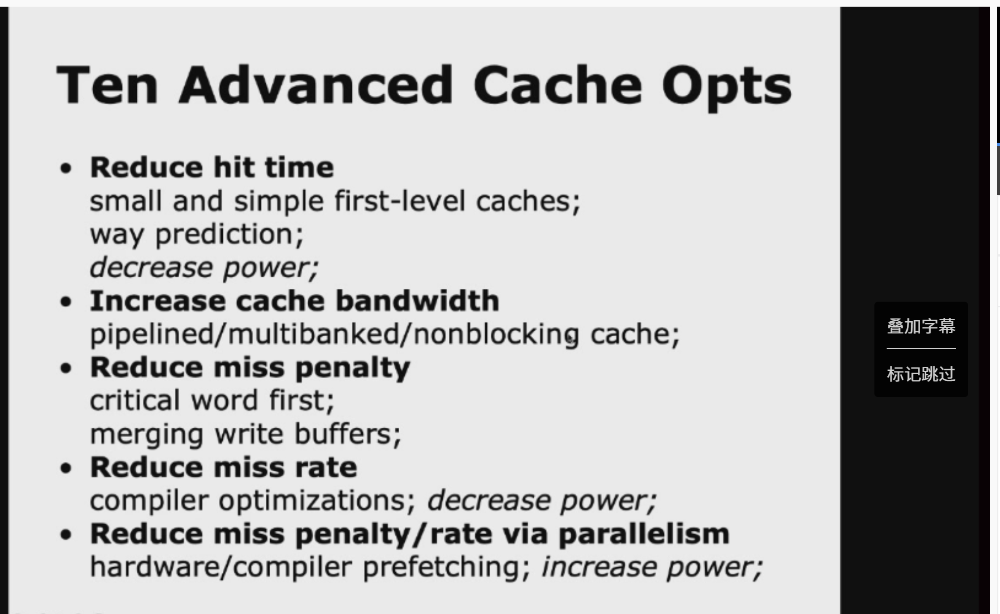
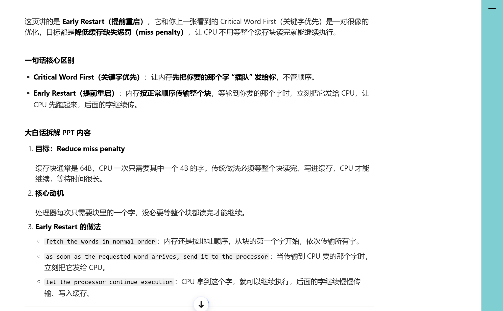

# memory hierarchy design advances

这里将介绍十种高级设计技巧
、


# 概述

这两张幻灯片讲的是**计算机体系结构里，Cache（高速缓存）的高级优化策略**，核心目标是降低「平均内存访问时间」。我帮你拆解得明明白白👇

---

## 先定目标和核心指标
这张是总纲，先讲清楚优化Cache的根本目的和要调的几个关键参数。

### 1. 核心目标
**Goal: average memory access time ↓**
也就是：让CPU读写内存的平均耗时变得更短。

### 2. 要优化的5个关键指标
Cache的性能优化，本质就是围绕这5个指标做权衡：
| 指标 | 含义 | 优化方向 |
| :--- | :--- | :--- |
| **Hit Time（命中时间）** | 访问Cache并确认数据存在所需的时间 | 尽量缩短，让命中时的延迟更低 |
| **Miss Rate（缺失率）** | 访问Cache时找不到数据的概率 | 尽量降低，减少去主存取数据的次数 |
| **Miss Penalty（缺失惩罚）** | Cache缺失后，去主存取数据并填回Cache的额外耗时 | 尽量缩短，让缺失的代价更小 |
| **Cache Bandwidth（缓存带宽）** | Cache每秒能处理的访问次数/数据量 | 尽量提升，支持更多并发访问 |
| **Power Consumption（功耗）** | Cache工作时的电能消耗 | 控制功耗，避免性能换功耗的代价太大 |

---

## 具体的5大类优化策略
这张是具体的优化方法，对应上面的5个指标。

### 1. Reduce hit time（缩短命中时间）
目标：让Cache命中时的延迟更低。
- `small and simple first-level caches`：L1缓存做小、做简单。比如用直接映射或低路组相联，这样电路更简单，访问更快。
- `way prediction`：路预测。提前预测数据在哪个组相联路里，不用全路比较，减少命中时间。
- `decrease power`：同时降低功耗（小缓存开关更少，功耗更低）。

### 2. Increase cache bandwidth（提升缓存带宽）
目标：让Cache能处理更多并发访问，不成为瓶颈。
- `pipelined cache`：流水线化Cache访问，把地址译码、Tag比较、数据读出拆成多拍流水，支持每个周期一次访问。
- `multibanked cache`：多体（多bank）Cache，把Cache分成多个独立存储体，支持并行访问不同bank的数据。
- `nonblocking cache`：非阻塞Cache，Cache缺失时也能处理其他访问，不会阻塞流水线。

### 3. Reduce miss penalty（降低缺失惩罚）
目标：Cache缺失时，去主存取数据的过程更高效。
- `critical word first`：先取关键字。主存回写时，先把CPU需要的那个字发回，而不是等整个Cache行都取完再发。
- `merging write buffers`：合并写缓冲区。把连续的写请求合并成一次批量写，减少对主存的访问次数。

### 4. Reduce miss rate（降低缺失率）
目标：减少Cache找不到数据的概率。
- `compiler optimizations`：编译器优化。比如循环交换、数组分块，让数据访问更符合Cache的空间局部性，减少冲突缺失。
- `decrease power`：这里是附带收益，缺失率低了，去主存的访问次数少了，整体功耗也会下降。

### 5. Reduce miss penalty/rate via parallelism（用并行同时优化缺失惩罚/率）
目标：提前把数据准备好，减少缺失的发生或代价。
- `hardware prefetching`：硬件预取。Cache控制器自动预取接下来可能用到的数据，提前放到Cache里。
- `compiler prefetching`：编译器预取。编译器在指令流里插入预取指令，提前把数据加载到Cache。
- `increase power`：代价是功耗上升（预取会多读写数据，增加功耗），属于性能换功耗的策略。

---

## 一句话总结
这组幻灯片讲的是Cache优化的完整框架：
先定目标「降低平均内存访问时间」，再拆解成命中时间、缺失率、缺失惩罚、带宽、功耗5个指标，然后用不同的硬件/软件优化策略，对这些指标进行针对性优化，同时权衡性能和功耗的关系。

## 策略1


这张PPT讲的是**计算机体系结构中优化一级缓存（L1 Cache）的核心策略：追求“小而简”，以此换取极致的访问速度（Hit Time）和低功耗**。

结合上下两张图，我为你拆解其中的核心逻辑：

### 1. 核心策略：为什么要“Small and Simple”？
L1缓存离CPU最近，必须在**纳秒级**内返回数据。设计得越大、越复杂（相联度越高），信号传输和电路比较的时间就越长，导致CPU主频上不去。

### 2. 上图文字解读：两个具体手段
*   **Small size（小尺寸）**
    *   **支持快时钟周期**：体积小，信号线短，电容负载小，信号传输速度快，允许CPU使用更高的主频。
    *   **降低功耗**：更小的面积意味着更少的晶体管和连线，动态功耗（开关电容的能量）显著降低。
*   **Lower associativity（低相联度）**
    *   **减少命中时间和功耗**：相联度越低（比如直接映射1-way，相比8-way），硬件逻辑越简单。
    *   **关键机制**：**直接映射（Direct-mapped）** 缓存可以将**标签检查（Tag Check）** 与**数据传输（Transmission）** 重叠进行。不需要并行比对多个缓存行，查找到底的同时数据就已经准备好了，这是缩短命中时间的关键。

### 3. 下图图表解读：数据佐证
横轴是**缓存容量**（16KB到256KB），纵轴是**相对访问时间**。
*   **同容量下，相联度越高越慢**：例如在16KB容量时，**1-way（直接映射）** 最快，**8-way** 最慢。这印证了文字部分提到的“低相联度减少命中时间”。
*   **容量越大越慢**：即使是相同相联度（比如同样是4-way），256KB的缓存访问时间也远长于16KB。因为容量越大，寻址和内部多路选择器的延时也随之增加。

### 总结
这一页的核心思想是：**在L1缓存上，牺牲部分容量和灵活性（不搞太大、不搞多路），换取极致的“速度”和“省电”**。工业界通常L1只设计成32KB-64KB，且多采用直接映射或2路组相联，正是基于这个优化逻辑。

## 技巧2

直接说核心：**这页在讲一个叫“路预测（Way Prediction）”的技巧，用来让大容量、高相联度的缓存，跑得像最小、最简单的缓存一样快。**

### 一句话概括
*   **传统高相联缓存（4/8-way）**：快是快在命中率高，但麻烦在于，它得同时把这一组的所有路都打开、比对标签，才能确定选哪一个，所以**延时大、功耗高**。
*   **路预测（这页的方案）**：我不一次性查所有路了。我先猜一下，数据大概率在哪一路里，然后**只查这一路**。
    *   **猜对了**：直接拿到数据，延迟和直接映射缓存一样，**最快**。
    *   **猜错了**：没关系，在下一个周期再去查其他路。

### 怎么实现？
*   **预测位**：每个块（每个路）里记录历史信息。
*   **提前选路**：在缓存阵列读数据的同时，硬件就根据预测，**提前把多路选择器（Mux）定好**，不用等比对完。
*   **只查一次**：只需要做一次标签比对，和读数据并行进行。
*   **兜底机制**：如果预测错了，就在下一个周期里补查剩下的路。

### 最终效果
*   **大部分情况（猜对）**：1个时钟周期搞定，速度极快。
*   **少数情况（猜错）**：2个时钟周期搞定，延迟略高，但整体平均下来依然比传统高相联缓存快很多。
*   **容量优势**：不用为了求快而把缓存做得很小，依然能保留大容量缓存的高命中率。

**结论**：这就是个“投机”技巧，赌你下次还走老路，以此骗过硬件逻辑，省去并行比对的麻烦，做到**快且省**。

## 技巧3

直接说核心：这页讲的是**多体缓存（Multibanked Caches）**，目的是解决单缓存“同一时间只能处理一个请求”的瓶颈，**大幅提高缓存的带宽**。

---

### 大白话拆解：
1.  **解决什么问题？**
    普通单块缓存就像单车道，同一时间只能过一辆车。超标量CPU（比如要同时取指令+读数据、多线程同时访问）经常要同时发多个请求，会堵在缓存这里，导致流水线停顿。

2.  **怎么做？**
    把一个大缓存拆成好几个**独立的小缓存（叫Bank）**，每个Bank都有自己的控制电路和端口，能独立处理读写请求。相当于把单车道改成了多车道，不同请求可以同时访问不同的Bank，互不干扰。

3.  **图里的“顺序交错（Sequential interleaving）”是啥？**
    为了让连续的内存访问（比如顺序取指令、遍历数组）能分到不同的Bank里，避免冲突，地址是按“轮流分配”的规则放的：
    - Bank 0 放地址0、4、8、12...
    - Bank 1 放地址1、5、9、13...
    - Bank 2 放地址2、6、10、14...
    - Bank 3 放地址3、7、11、15...
    这样连续的访问会自动落到不同的Bank里，不会挤在同一个“车道”上，最大化利用并行性。

4.  **效果是什么？**
    比如拆成4个Bank，理论上缓存的带宽能提高到原来的4倍。CPU可以在一个周期里同时处理多个请求，不会被缓存的单端口限制住，流水线效率大幅提升。

## 技巧4

这页讲的是 **“关键字优先（Critical Word First）”**，一种用来**降低缓存缺失惩罚（miss penalty）**的优化技术。

---

### 大白话拆解
1.  **解决的痛点**
    缓存块（cache block）通常是 32B/64B 这种大小，但CPU每次指令只需要**其中一个字（word，比如4B）**。传统做法是，必须等整个缓存块都从内存读完、写进缓存，CPU才能拿到它要的那个字，这段等待时间就是“缺失惩罚”。

2.  **“关键字优先”怎么做？**
    - 缓存 miss 时，CPU会先告诉内存：“我要的是这个块里的**第X个字**，你先把这个字发给我！”
    - 内存会先把CPU急需的那个“关键字”优先传回来，直接送给CPU执行单元。
    - 同时，内存继续把缓存块里剩下的字慢慢传给缓存，CPU拿到关键字后，就可以继续往下执行，不用等整个块读完。

3.  **PPT里的核心点**
    - `Reduce miss penalty`：核心目标，减少 miss 带来的等待时间。
    - `processor normally needs just one word of the block at a time`：动机，CPU一次只需要一个字，没必要等完整的块。
    - `request the missed word first from the memory and send it to the processor as soon as it arrives`：关键做法，优先请求并传输CPU缺失的那个字。
    - `processor continues execution while filling the rest of the words in the block`：效果，CPU拿到关键字就可以继续执行，缓存块的剩余部分在后台慢慢补。

---

### 一句话总结
它就是：**当缓存 miss 时，先把CPU急需的那一个字“插队”发回去，让CPU先跑起来，剩下的缓存块内容慢慢补，从而减少CPU的等待时间**。

## 技巧5

这页讲的是 **非阻塞缓存（Nonblocking Caches）**，核心就是解决“缓存 miss 时，整个流水线被卡住”的问题，让缓存即便在处理 miss 时，也能继续响应新的访问请求。

---

### 核心一句话总结
普通缓存一旦 miss，整个缓存就被“占住”了，后面所有请求都得等它把数据从内存取回来。而非阻塞缓存（靠MSHR实现）可以做到：**缓存 miss 时，不阻塞其他请求，命中的访问照样处理，甚至可以同时处理多个 miss**。

---

### 关键概念拆解
1.  **目标：Increase cache bandwidth**
    它的本质是提升缓存的有效带宽，让流水线能充分利用乱序执行（Ooo）的能力，不会因为一次内存访问慢而彻底停摆。

2.  **核心机制：MSHR（Miss Status Handling Registers）**
    它是实现非阻塞缓存的关键硬件。当缓存发生 miss 时，MSHR 会记录下这次 miss 的地址、状态，然后发起对下一级存储（内存）的请求，同时把缓存的访问端口“释放”出来，继续处理后面的请求。

3.  **三种能力（PPT里的三个阶段）**
    | 术语 | 意思 |
    | :--- | :--- |
    | **Hit under miss** | 缓存正在处理一次 miss 时，来了一个命中的请求，可以立刻响应，不被 miss 阻塞 |
    | **Miss under miss** | 缓存正在处理一次 miss 时，又来了一次新的 miss，可以同时发起对内存的第二次请求 |
    | **Hit under multiple misses** | 缓存同时在处理多个 miss 时，依然能响应命中的请求 |

---

### 举个场景例子
假设CPU按顺序执行三条指令：
1.  `LOAD A` → 缓存 miss，需要去内存取数据，耗时几百个周期
2.  `LOAD B` → 缓存 hit，数据就在缓存里
3.  `LOAD C` → 缓存 miss，也要去内存取

- **普通阻塞缓存**：
  处理指令1的 miss 时，缓存被占住了，指令2、3都得排队等指令1完成，流水线直接停摆。
- **非阻塞缓存**：
  指令1的 miss 交给MSHR处理，缓存立刻响应指令2的 hit；
  指令3的 miss 也交给MSHR，同时向内存发起第二次请求；
  只要指令2的操作数准备好，流水线就能继续往下走，不会被内存访问的延迟拖死。

---

### 一句话总结这页PPT
它讲的是：**用MSHR实现非阻塞缓存，让缓存在处理miss时也不“卡死”，配合CPU的乱序执行，大幅提升缓存的有效带宽和流水线效率**。



## 技巧6 7

我帮你把这两张图的核心内容和背后的原理，掰开揉碎讲清楚👇

---

### 图1：Opt #6 合并写缓冲区 (Merging Write Buffer)
#### 核心目标：**降低Cache写操作的缺失惩罚（Miss Penalty）**
#### 背景
当CPU向内存写数据时，如果Cache写缺失，数据会先暂存到**写缓冲区（Write Buffer）**，再批量写入内存。
如果每次写操作都单独发起内存请求，会产生大量的总线和内存开销。

#### 合并写缓冲区的原理
图里展示了一个典型场景：
- 原来有4次独立的写操作，地址分别是 `Mem[100]`、`Mem[108]`、`Mem[116]`、`Mem[124]`，它们是**连续对齐的地址**（刚好落在同一个Cache行内）。
- 合并写缓冲区会把这4次写请求**合并成一个缓冲区条目**，也就是把同一条Cache行里的多个写操作打包，一次性写入内存。

#### 效果
- 原本需要4次内存写操作，现在只需要1次。
- 大幅减少了内存总线的占用和写操作的延迟，降低了写缺失的惩罚时间。
- 本质上是利用了**写合并（Write Combining）**技术，减少内存访问次数。

---

### 图2：Opt #7 编译器优化 - 循环交换 (Loop Interchange)
#### 核心目标：**在不修改硬件的前提下，降低Cache缺失率（Miss Rate）**
#### 背景
二维数组在内存中是按**行优先**存储的（C语言默认）：
- `x[i][j]` 和 `x[i][j+1]` 在内存中是相邻的；
- 而 `x[i][j]` 和 `x[i+1][j]` 在内存中是相隔很远的。

#### 优化前的代码（有问题的写法）
```c
// Before
for (j = 0; j < 100; j++)
    for (i = 0; i < 5000; i++)
        x[i][j] = 2 * x[i][j];
```
- 访问顺序：`x[0][0] → x[1][0] → x[2][0] → ... → x[4999][0] → x[0][1] → ...`
- 问题：每次访问的是不同行、同一列的元素，内存地址不连续，Cache无法利用空间局部性，每次都可能发生Cache缺失，效率极低。

#### 优化后的代码（循环交换）
```c
// After
for (i = 0; i < 5000; i++)
    for (j = 0; j < 100; j++)
        x[i][j] = 2 * x[i][j];
```
- 访问顺序：`x[0][0] → x[0][1] → x[0][2] → ... → x[0][99] → x[1][0] → ...`
- 优势：访问顺序和内存存储顺序一致，连续访问的元素会被加载到同一个Cache行中，Cache可以充分利用空间局部性，大幅降低缺失率。

---

### 两个优化的核心区别
| 优化项 | 优化对象 | 核心思路 | 目标 |
|--------|----------|----------|------|
| 合并写缓冲区 | 硬件层面 | 合并连续地址的写请求，减少内存访问次数 | 降低写操作的**缺失惩罚时间** |
| 循环交换 | 编译器/软件层面 | 调整数据访问顺序，匹配内存存储顺序 | 降低Cache的**缺失率** |

## 优化8

这张图讲的是 **Opt #8: Hardware Prefetching（硬件预取）**，我帮你拆解得明明白白👇

---

### 1. 核心概念
**硬件预取（Hardware Prefetching）** 是一种CPU自带的硬件优化技术，目标是：
- 提前把CPU“未来会用到的数据/指令”，从内存加载到Cache或专用的预取缓冲区里；
- 等CPU真正要访问的时候，数据已经在Cache里了，从而降低Cache缺失率、减少缺失惩罚时间。

---

### 2. 两句话拆解要点
#### （1）目标：`Reduce miss penalty/rate`
- **Miss penalty（缺失惩罚）**：CPU访问Cache失败，必须等内存响应的时间。预取可以让数据提前到位，CPU不用等，直接命中，惩罚时间被“隐藏”掉了。
- **Miss rate（缺失率）**：预取直接把未来要访问的数据提前加载，CPU真正访问时基本都能命中，缺失率自然下降。

#### （2）核心机制：`Prefetch items before the processor requests them`
- 硬件会根据CPU当前的访问模式（比如顺序访问、步长访问），预测接下来会访问哪些地址；
- 提前把这些地址的数据加载到Cache或专用的预取缓冲区里，而不是等CPU真正发起请求才去取。

---

### 3. 举个最直观的例子
比如你要遍历一个数组 `A[0] → A[1] → A[2] → ...`：
- 没有预取：CPU访问 `A[0]` 时Cache缺失，要等内存加载 `A[0]` 所在的Cache行，耗时几百个周期；
- 有硬件预取：CPU访问 `A[0]` 时，硬件检测到这是顺序访问，立刻开始预取下一个Cache行（比如 `A[16]` 开始的数据）；等CPU遍历到 `A[16]` 时，数据已经在Cache里了，直接命中，完全不用等。

---

### 4. 它和你之前看的软件优化有什么区别？
| 优化方式 | 层级 | 特点 |
| :--- | :--- | :--- |
| 硬件预取 | CPU硬件层面 | 完全自动，不用改代码；对顺序/步长访问效果极好；但对不规则访问预测不准 |
| 循环交换/分块 | 编译器/软件层面 | 需要调整代码；适配不规则访问；需要开发者理解Cache行为 |

---

### 5. 补充：常见的硬件预取类型
- **顺序预取（Sequential Prefetch）**：检测到顺序访问时，预取后续连续的Cache行（最常见）；
- **步长预取（Stride Prefetch）**：检测到固定步长的访问（比如每隔4个元素访问一次），按步长预取；
- **指令预取**：提前加载未来要执行的指令，解决指令Cache缺失。

## 优化9

我帮你把这两张「编译器预取（Compiler Prefetching）」的幻灯片，拆解得明明白白👇

---

### 一、先搞懂：什么是编译器预取？
和之前的**硬件预取（Hardware Prefetching）**不同，这是**软件层面**的优化：
- 编译器会自动（或程序员手动）在代码里插入 `prefetch` 指令，提前告诉CPU：“我马上要用到这个地址的数据了，先帮我加载到Cache里”；
- 目标同样是 `Reduce miss penalty/rate`，但主动权在编译器/程序员手里，不是硬件自动预测的。

#### 它的两种形式
1.  **Register prefetch（寄存器预取）**
    直接把数据加载到CPU的寄存器里，这样后续访问就完全不用等内存，延迟最低。
2.  **Cache prefetch（Cache预取）**
    只把数据加载到Cache里，不占用寄存器，适合提前加载但暂时不用的数据。

---

### 二、第二张图的例子：为什么是251次缺失？
这是一个典型的「循环访问」场景，我们一步步算：

#### 1. 题目条件
- 代码：
```c
for (i = 0; i < 3; i++)
    for (j = 0; j < 100; j++)
        a[i][j] = b[j][0] * b[j+1][0];
```
- 硬件参数：
  - Cache块大小：16字节
  - 每个元素（`a`和`b`）大小：8字节
  - 写回策略（write-back）

#### 2. 计算 `a` 数组的缺失次数
- 一个16字节的Cache块，能装 `16/8 = 2` 个 `a` 元素；
- 所以 `a[i][0]` 缺失时，会同时把 `a[i][0]` 和 `a[i][1]` 加载进Cache；
- 每一行100个元素，需要 `100/2 = 50` 次缺失；
- 一共3行，所以 `a` 数组的缺失次数：`3 × 50 = 150` 次。

#### 3. 计算 `b` 数组的缺失次数
- 代码里 `b[j][0]` 和 `b[j+1][0]` 是按列访问的，地址每次跳 `100 × 8 = 800` 字节，每次都在不同的Cache块里；
- 从 `j=0` 到 `j=100`，一共访问了 `b[0][0]` 到 `b[100][0]` 共101个元素；
- 每个元素都在不同的Cache块，所以 `b` 数组的缺失次数：`101` 次。

#### 4. 总缺失次数
`150 + 101 = 251` 次，和题目里的数字一致。

---

### 三、编译器预取怎么解决这个问题？
这个例子的痛点是：`b` 数组的列访问导致了大量Cache缺失。
编译器预取的优化思路是：
- 在循环里提前插入预取指令，比如在 `j` 循环里，提前预取 `b[j+K][0]` （K是提前量，比如4）；
- 等真正用到 `b[j+K][0]` 时，数据已经在Cache里了，缺失次数直接降到0；
- 同时，也可以预取 `a[i][j+K]`，进一步降低 `a` 数组的缺失率。

---

### 四、编译器预取 vs 硬件预取
| 特性 | 编译器预取 | 硬件预取 |
| :--- | :--- | :--- |
| 控制者 | 编译器/程序员 | CPU硬件 |
| 触发方式 | 插入`prefetch`指令 | 自动检测访问模式 |
| 适用场景 | 不规则访问、硬件预测不准的场景 | 顺序/步长访问 |
| 开销 | 指令本身会占用流水线周期 | 纯硬件开销，无指令开销 |

---

一句话总结：
这两张图讲的是，编译器可以通过在代码里插入预取指令，提前把数据加载到Cache或寄存器里，解决硬件预取搞不定的不规则访问场景，降低Cache缺失率。

## 技巧10

我帮你把这组「HBM作为L4 Cache」的优化讲透，从背景、问题到两个核心方案，一次性说清楚👇

---

### 一、核心背景：什么是HBM？
HBM（High Bandwidth Memory，高带宽内存）是一种通过**2.5D/3D堆叠工艺**和处理器封装在一起的高带宽DRAM，和传统DDR内存相比，带宽能高一个数量级。
这组幻灯片讲的，是把HBM当成CPU的**L4 Cache**使用的设计与优化。

#### 两种封装方式（第一张图）
- **3D Vertical Stacking**：把DRAM芯片直接垂直堆叠在处理器die上，集成度更高；
- **2.5D Interposer Stacking**：处理器和DRAM都贴在一个中介层（Interposer）上，通过中介层实现高速互联，是目前主流的方案。

---

### 二、核心问题：把HBM当L4 Cache，会遇到什么麻烦？
#### 1. 标签（Tag）的存储开销（第二张图）
Cache需要存储每个块的Tag来判断命中/缺失，开销非常大：
- 假设L4 Cache容量是1GiB，Cache块大小64B：
  - 总块数 = 1GiB / 64B = 16,777,216 个块
  - 每个Tag（含有效位、地址位等）大约6字节，总Tag大小 ≈ 96MiB
- 如果块大小改成4KiB：
  - 总块数 = 1GiB / 4KiB = 262,144 个块
  - 总Tag大小降到≈1MiB
  所以增大块大小能大幅降低Tag开销，但会增加缺失惩罚。

#### 2. 两次访问DRAM的开销
传统Cache的访问流程是：
1.  先读Tag，判断是否命中；
2.  命中再读数据。
而HBM是DRAM，不是SRAM，两次访问（一次Tag、一次数据）的延迟和带宽开销会被放大，这是设计的主要痛点。

---

### 三、优化方案1：把Tag和数据放在同一行（第三张图）
DRAM的访问有个特点：**打开一行（Row）的延迟很高，但打开后访问行内数据的延迟很低**。
这个优化的思路是：
- 把同一个Cache块的Tag和数据，放在HBM的**同一行（Row）里**；
- 访问时先打开这一行，再读Tag，判断命中后直接读同一行里的数据；
- 虽然打开行的延迟还是存在，但只需要开一次行，不用两次访问DRAM，延迟从“两次访问”降到“一次开行+两次行内访问”，整体耗时大幅下降。

---

### 四、优化方案2：Alloy Cache（合金Cache，第四张图）
这是更激进的优化，直接改变了Cache的访问模式：
- 把Tag和数据**融合（mold together）**，当成一个整体存储；
- 采用直接映射（Direct Mapped）的结构，地址直接映射到HBM里的位置；
- 一次HBM突发传输（burst transfer）同时把Tag和数据读出来，只需要一次HBM访问；
- 这样就彻底解决了两次访问的问题，访问延迟直接降到一次HBM访问的时间。

---

### 五、补充优化：加速缺失检测（第五张图）
如果HBM Cache发生缺失，需要两次DRAM访问：
1.  读HBM里的Tag，确认缺失；
2.  去主存（DDR）读数据。
为了降低缺失时间，有两个优化思路：
- 用**Map结构**快速判断数据是否在Cache里，减少Tag访问的延迟；
- 用**访问历史预测器**，提前预测可能的缺失，提前预取数据，隐藏主存访问的延迟。

---

### 一句话总结
这组幻灯片讲的是：
把高带宽的HBM当成L4 Cache用，虽然能大幅降低主存访问的延迟和带宽瓶颈，但会遇到Tag开销大、两次DRAM访问延迟高的问题，因此设计了「同Row存放Tag/数据」和「Alloy Cache」两种核心优化，来解决这些痛点。
