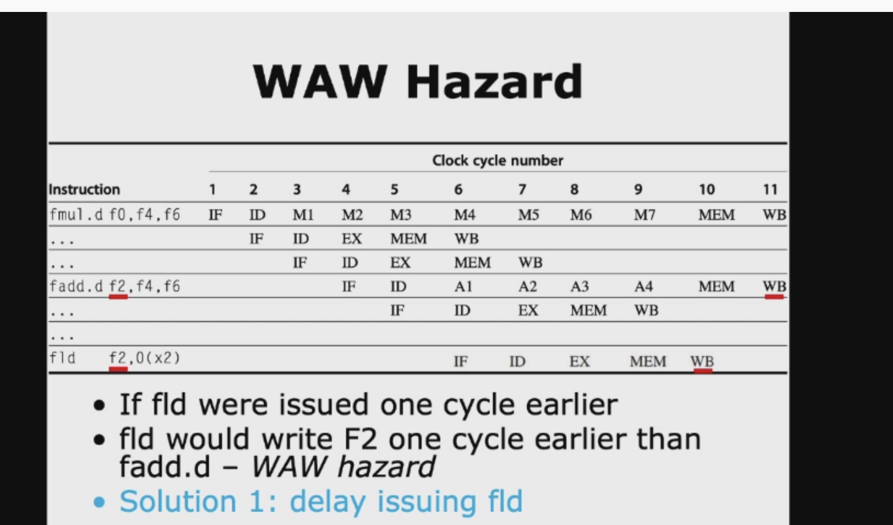
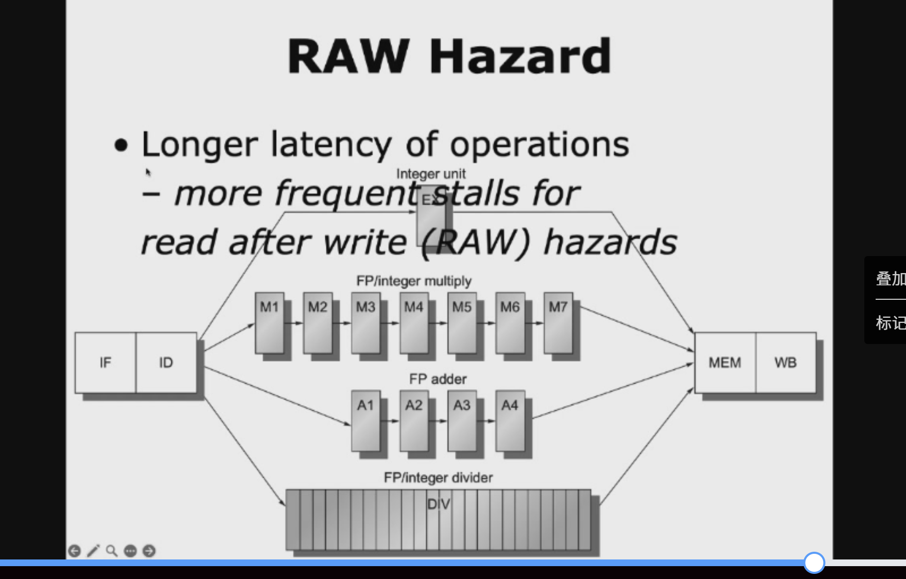

# floating-point operation

## fp operation

这两张PPT讲的是**CPU里浮点运算（FP）的流水线设计逻辑**，我帮你把来龙去脉拆解得明明白白：

---

### 一、第一张图：为什么浮点运算不能像整数运算那样“单周期搞定”？
#### 核心前提：浮点运算天生就慢
PPT第一句就点明了：
> Floating-point (FP) operations take more time than integer operations do

原因很简单：
- 整数加减乘除，电路逻辑非常简单，一拍（1个时钟周期，1cc）就能跑完。
- 浮点数运算要处理**符号位、指数偏移、尾数对齐、规格化、舍入**……一堆复杂步骤，电路延迟大得多，一拍里根本跑不完。

---

#### 硬要让浮点运算“1个周期完成”的两个死胡同
PPT里给了两种“强行单周期”的方案，直接点出了致命缺陷：

1.  **把CPU时钟放慢（a slow clock?）**
    时钟周期要跟着最慢的浮点运算来定，整数运算本来一拍就能做完，现在却要跟着等慢时钟，直接被拖慢，得不偿失。
    （对应红色标注：`slow down integer ops`）

2.  **疯狂堆电路，把浮点单元做得超宽（many logic in FP units?）**
    用超多并行逻辑把浮点运算压到一拍内完成，但这会导致：
    - 电路规模爆炸，芯片面积超大；
    - 布线难度、散热、成本飙升，根本不适合量产。
    （对应红色标注：`manufacturing hardness & expensiveness`）

---

### 二、第二张图：浮点运算的解决方案——多周期流水线
既然“单周期”行不通，业界通用的做法就是给浮点运算做**多周期流水线**，也就是PPT里说的`Multicycle FP Operation`。

#### 核心思路
> FP pipeline allow for a longer latency for op; i.e., take >1 cc for EXE;

直接说人话：
- 浮点运算的执行阶段（EXE）不硬塞到1个周期里，而是拆成多个小阶段，让它跑多个周期。
- 这样时钟周期可以按整数运算的速度来定，既不拖慢整数运算，也不用堆超大电路。

---

#### 相比整数流水线的两个关键改动
PPT里明确说了浮点流水线的两大设计要点：

1.  **重复执行阶段（repeat EX）**
    把浮点运算的复杂步骤，拆成多轮执行阶段（比如：尾数对齐→加法→规格化→舍入，每一步占一个周期），相当于把整数流水线里的EX阶段拆成好几级，让浮点运算分步完成。

2.  **使用多个专用浮点功能单元（use multiple FP functional units）**
    不同浮点运算的复杂度天差地别：
    - 浮点加法：3-4个周期；
    - 浮点乘法：4-5个周期；
    - 浮点除法：十几甚至几十个周期。
    所以CPU里会单独做`FP adder`、`FP multiplier`、`FP divider`等多个独立单元，各自按自己的流水线节拍工作，互不干扰，也不会互相拖慢。

---

💡 一句话总结：
浮点运算天生慢，强行单周期会拖慢整数、成本爆炸，所以CPU给浮点运算单独做了多周期流水线，既保住了整数运算的速度，也用合理的成本实现了浮点性能。

## 核心设计

这两张图完整讲透了**CPU浮点流水线的设计结构和它的核心痛点**，我帮你拆解得清清楚楚👇

---

### 一、第一张图：浮点流水线的硬件结构设计
这张图是把我们之前聊的「多周期浮点流水线」画成了具体的硬件结构，核心就是两个设计要点：

#### 1. 重复执行阶段（repeat EX）—— 解决“浮点运算周期长”的问题
- 整数指令的流水线是经典的 `IF → ID → EX → MEM → WB` 五级结构，`EX` 阶段一拍就结束。
- 但浮点运算（比如加法、乘法）的复杂度远高于整数，一拍内做不完，所以：
  图里给每个浮点功能单元都加了**多轮EX阶段**（那些圆圈箭头就是多拍循环执行的意思），比如：
  - 浮点乘法单元：EX阶段拆成了多拍完成；
  - 浮点加法单元：EX阶段拆成了多拍完成；
  - 浮点除法单元：EX阶段拆成了更多拍完成。
- 这样就不用把CPU时钟放慢，也不用堆超大规模电路，而是用“多拍分步执行”的方式完成复杂浮点运算。

#### 2. 多个独立浮点功能单元（use multiple FP units）—— 解决“不同浮点运算复杂度不同”的问题
图里的粉色框里，是CPU里的多个独立执行单元，各自处理不同类型的指令：
| 单元 | 处理的指令 | 典型延迟 |
| :--- | :--- | :--- |
| Integer unit | 整数加减、访存（load/store）、分支指令 | 1拍EX |
| FP/integer multiply | 浮点乘法、整数乘法 | 多拍EX（如3-4拍） |
| FP adder | 浮点加/减、浮点格式转换 | 多拍EX（如3拍） |
| FP/integer divider | 浮点除法、整数除法 | 多拍EX（如10-20拍） |

- 不同单元可以并行工作，比如整数指令在Integer unit里跑，浮点加法在FP adder里跑，互不干扰，最大化利用硬件资源。
- 这样设计，也避免了“慢的除法指令拖慢所有其他指令”的问题。

---

### 二、第二张图：这种“多周期EX”设计的致命痛点
这张图点出了**顺序流水线（in-order）下浮点单元的瓶颈问题**：

#### 1. 问题根源：浮点单元的EX阶段没有被流水线化（EX is not pipelined）
- 这里的“没有流水线化”，是指**浮点单元内部的多拍执行，不能被后续指令重叠利用**。
- 举个例子：假设浮点乘法单元的EX阶段要占3拍：
  - 第1拍：指令A进入FP乘法单元；
  - 第2拍：指令A还在FP乘法单元里执行，单元被占用；
  - 第3拍：指令A还在FP乘法单元里执行，单元还是被占用；
  - 直到第4拍，指令A离开FP乘法单元，下一条乘法指令才能进入。

#### 2. 直接后果：整个流水线被阻塞（stalled）
- 在顺序流水线里，指令是按顺序执行的。如果一条浮点指令（比如乘法）占用了FP乘法单元，后面所有依赖这个单元的指令，都要等它执行完才能进入EX阶段。
- 而在顺序流水线中，一旦某条指令卡在ID→EX阶段，后面的IF、ID阶段也会被跟着“堵住”，整个流水线停摆，直到这条指令离开EX阶段。

#### 3. 破局点：乱序执行（out-of-order execution）
PPT末尾的那句 `curious about out-of-order execution?!` 就是点出了这个问题的解决方案：
- 顺序流水线里，指令必须按顺序执行，被慢的浮点指令一卡，后面全堵死；
- 乱序执行里，CPU可以跳过被阻塞的浮点指令，先执行后面不依赖它的整数指令，让流水线继续跑，不会被单个慢指令拖垮。

---

### 三、把两张图串起来理解
1.  **第一张图是“怎么设计浮点硬件”**：用多个独立单元+多拍EX阶段，解决浮点运算慢的问题；
2.  **第二张图是“这个设计在顺序流水线里的缺陷”**：单元不流水线化，会导致后续指令阻塞，整个流水线停摆；
3.  最终引出了现代CPU的解决方案：**乱序执行+流水线化的浮点单元**，既解决了浮点运算慢的问题，又避免了顺序流水线的阻塞问题。

---

💡 一句话总结：
这两张图讲的是，CPU为了实现浮点运算，给流水线加了多个多拍执行的浮点单元，但在顺序流水线里，这些单元的非流水线化执行会导致整个流水线被阻塞，所以现代CPU才引入了乱序执行来解决这个问题。

## 两个核心指标

这两张PPT讲的是CPU流水线里两个核心性能指标：**延迟（Latency）** 和 **启动间隔/重复间隔（Initiation/Repeat Interval）**，我帮你把它们掰开揉碎讲清楚👇

---

## 一、第一张图：两个概念的定义
### 1. Latency（延迟）
PPT里的定义：
> the number of intervening cycles between an instruction that produces a result and an instruction that uses the result

人话解释：
- 延迟 = 一条指令从开始执行，到它的结果能被下一条依赖指令使用，中间要等多少个时钟周期。
- 举个例子：
  整数加法指令，在EX阶段就能算出结果，下一条指令下一拍就能用，所以延迟是0；
  浮点加法指令，EX阶段要拆成4拍执行，结果要等3拍后才能用，所以延迟是3。

---

### 2. Initiation/Repeat Interval（启动/重复间隔）
PPT里的定义：
> the number of cycles that must elapse between issuing two operations of a given type

人话解释：
- 启动间隔 = 同一个功能单元，两次执行同一种指令，中间最少要间隔多少个时钟周期。
- 它直接决定了**这个单元的吞吐量（单位时间能处理多少条指令）**：
  - 启动间隔=1，说明这个单元是**完全流水线化**的，每一拍都能喂一条新指令进去；
  - 启动间隔=25，说明这个单元是非流水线化的，上一条指令没跑完，下一条根本进不来，25拍才能处理完一条。

---

## 二、第二张图：用具体例子看懂这两个指标
表格里给了CPU里不同功能单元的延迟和启动间隔，我帮你逐个拆解：

| 功能单元 | Latency | Initiation Interval | 人话解释 |
| :--- | :---: | :---: | :--- |
| Integer ALU | 0 | 1 | 整数加减，一拍EX出结果，下一条指令立刻能用，单元也能立刻接收新指令 |
| Data memory (load/store) | 1 | 1 | 访存指令，MEM阶段结束才出结果，下一条指令要等1拍才能用；但单元是流水线化的，每一拍都能处理新访存 |
| FP add | 3 | 1 | 浮点加法要4拍EX阶段，结果要等3拍后才能用；但单元是流水线化的，每一拍都能喂新的浮点加法 |
| FP multiply | 6 | 1 | 浮点乘法要7拍EX阶段，结果要等6拍后才能用；单元也是流水线化的，吞吐量很高 |
| FP divide | 24 | 25 | 浮点除法要25拍EX阶段，结果要等24拍后才能用；单元是非流水线化的，必须等上一条除法跑完，下一条才能进，25拍才能处理完一条 |

---

### 关键补充：延迟和流水线深度的关系
PPT最后一句：
> Essentially, pipeline latency is 1 cycle less than the depth of the execution pipeline

- 流水线深度 = 执行阶段从开始到出结果，一共占了多少个拍数；
- 延迟 = 流水线深度 - 1；
- 比如浮点加法，流水线深度是4拍（EX0→EX1→EX2→EX3，出结果），所以延迟=4-1=3，和表格里的数字完全对应。

---

## 三、一句话总结两个指标的区别
- **Latency（延迟）**：关心的是“一条指令从执行到出结果，要等多久”，影响的是**数据相关的阻塞风险**；
- **Initiation Interval（启动间隔）**：关心的是“这个单元每多久能处理一条新指令”，影响的是**流水线的吞吐量**。

举个形象的例子：
- 延迟就像“快递从下单到你收到货要几天”；
- 启动间隔就像“快递站每小时能收多少个包裹”。

---

💡 额外补充一个易错点：
延迟和启动间隔没有必然关系。比如浮点乘法延迟是6，但启动间隔是1，说明它虽然出结果慢，但单元每一拍都能接新指令，吞吐量很高；而浮点除法延迟24、启动间隔25，说明它又慢又不能流水线化，是典型的性能瓶颈。

## 例子

这两张PPT用**访存指令（Load）**的例子，把「延迟（Latency）」和「启动间隔（Initiation Interval）」的区别和实际影响讲透了，我帮你一步步拆解👇

---

### 一、回顾核心定义（结合表格）
先把表格里的两个指标，对应到访存单元上：
| 功能单元 | Latency | Initiation Interval |
| :--- | :---: | :---: |
| Data memory (Load/Store) | 1 | 1 |

- **Latency = 1**：一条Load指令，从它开始执行，到结果能被下一条依赖指令使用，需要间隔 **1个时钟周期**。
- **Initiation Interval = 1**：访存单元是完全流水线化的，**每一拍都能接收一条新的Load指令**，吞吐量是1条/周期。

---

### 二、第二张图：用两条依赖的Load指令，看两个指标的实际表现
#### 例子场景
```asm
Load R2, 0(R1)   ; 把内存地址0(R1)的数据加载到R2
Load R3, 0(R2)   ; 把内存地址0(R2)的数据加载到R3，依赖R2的值
```
这是两条**同类型、数据相关**的Load指令，它们的流水线时序图也画出来了：

1.  **为什么Latency是1？**
    - 第一条Load指令，结果在`MEM`阶段结束时才会写入寄存器R2；
    - 第二条Load指令，在`ID`阶段就需要读取R2的值来计算地址；
    - 所以两条指令之间必须插入**1个气泡（stall）**，第二条Load要晚1拍才能进入EX阶段。
    - 这就是`Latency=1`的含义：结果要1个周期后才能被依赖指令使用。

2.  **为什么Initiation Interval还是1？**
    - 访存单元本身是流水线化的，即使有数据相关，也不影响单元的吞吐量；
    - 第一条Load在MEM阶段时，第二条Load可以同时进入MEM阶段的前序步骤（地址计算），只是会因为数据相关被stall一拍；
    -  hazard检测机制会在ID阶段就发现数据相关，提前插入stall，而访存单元依然可以每一拍接收新指令，所以启动间隔还是1。

---

### 三、关键补充：两个指标的核心区别（用这个例子总结）
| 指标 | 关注的是 | 对这个例子的影响 |
| :--- | :--- | :--- |
| Latency | **单条指令的结果多久能被用** | 导致两条依赖Load之间，必须插入1拍stall，指令间存在气泡 |
| Initiation Interval | **功能单元每多久能处理一条新指令** | 访存单元依然可以每一拍接收新Load指令，不会被stall拖慢吞吐量 |

---

💡 一句话总结：
这两张PPT是在告诉你，访存指令（Load）虽然因为数据相关会产生1拍的stall（Latency=1），但因为访存单元是流水线化的，它的吞吐量依然很高（Initiation Interval=1），这也是现代CPU访存单元的设计目标：**尽量降低延迟的同时，保证高吞吐量**。


这四张PPT完整串起了**CPU浮点流水线的设计、时序、以及由此带来的结构冒险问题**，我帮你按顺序拆解，把每个部分讲透👇

---

## 设计与冒险

### 一、第一张图：通用浮点流水线的硬件结构设计
这张图是整个浮点流水线的“全景图”，核心信息有三个：

1.  **执行单元的流水线化差异**
    - `FP adder`（浮点加法器）和 `FP/integer multiply`（浮点/整数乘法器）的EX阶段是**完全流水线化**的：
      - 加法器拆成了A1~A4共4级流水线；
      - 乘法器拆成了M1~M7共7级流水线；
      - 这意味着它们的`Initiation Interval=1`，每一拍都能接收一条新指令，吞吐量很高。
    - `FP/integer divider`（浮点/整数除法器）的EX阶段**没有流水线化**：
      - 整个除法过程是一个长周期的单级执行，需要24个时钟周期才能完成；
      - 这意味着它的`Initiation Interval=25`，必须等上一条除法指令跑完，下一条才能进入，是典型的性能瓶颈。

2.  **额外的流水线寄存器**
    为了实现多拍流水线，每个浮点单元的阶段之间都插入了额外的流水线寄存器（比如乘法器的M1~M7、加法器的A1~A4），用来暂存每一拍的中间结果，保证流水线能连续流动。

3.  **和主流水线的对接**
    所有浮点单元的输出，最终都会汇总到统一的`MEM`和`WB`阶段，完成访存和写回操作。

---

### 二、第二张图：用指令时序，直观理解延迟（Latency）
这张图用不同指令的流水线时序，把“延迟”的概念讲透了：

1.  **关键标注规则**
    - 斜体（italics）阶段：指令**需要数据**的阶段；
    - 粗体（bold）阶段：指令**产生结果**的阶段。

2.  以指令为例看延迟：
    - **MUL.D（浮点乘法）**：需要数据的阶段是`M1`，产生结果的阶段是`M7`，两者之间间隔了6个周期，对应表格里的`Latency=6`；
    - **ADD.D（浮点加法）**：需要数据的阶段是`A1`，产生结果的阶段是`A4`，两者之间间隔了3个周期，对应表格里的`Latency=3`；
    - **L.D（浮点加载）**：需要数据的阶段是`EX`，产生结果的阶段是`MEM`，两者之间间隔了1个周期，对应表格里的`Latency=1`；

3.  一句话理解延迟：
    延迟 = 指令“需要数据的阶段”和“产生结果的阶段”之间，间隔的时钟周期数，它直接决定了依赖指令之间需要插入多少个stall气泡。

---

### 三、第三张图：非流水线除法器带来的结构冒险（Structural Hazard）
这张图点出了浮点除法器的致命问题：

- 因为除法器没有流水线化，一旦一条除法指令进入DIV单元，单元会被完全占用24个周期；
- 这期间，任何新的除法指令都无法进入，即使指令流里没有数据相关，也会因为**共享资源被占用**而阻塞，这就是典型的**结构冒险（Structural Hazard）**；
- 对比之下，流水线化的加法器和乘法器，因为单元内部可以被重叠利用，不会产生这种类型的结构冒险。

---

### 四、第四张图：多拍指令带来的写回阶段结构冒险
这张图补充了另一个隐藏的结构冒险问题：

- 不同浮点指令的执行周期差异很大，比如：
  - 整数ALU指令：1拍EX阶段，很快进入WB阶段；
  - 浮点乘法指令：7拍EX阶段，WB阶段会晚很多拍才到；
  - 浮点除法指令：24拍EX阶段，WB阶段会晚非常多拍才到；
- 这就可能导致**多条指令在同一个周期，同时到达WB阶段，都要写同一个寄存器文件**，造成寄存器文件的端口冲突，这也是一种结构冒险。

---

### 串起来总结一下这四张PPT的核心逻辑：
1.  为了实现复杂浮点运算，CPU给不同运算设计了不同的执行单元，其中加法、乘法单元是流水线化的，除法单元是非流水线化的；
2.  流水线化的单元虽然执行周期长（延迟高），但吞吐量很高（启动间隔=1）；
3.  非流水线化的除法单元，不仅延迟极高，还会带来明显的结构冒险；
4.  多拍指令的写回阶段也可能出现寄存器文件的端口冲突，需要额外的硬件机制解决。

---

💡 一句话总结：
这四张PPT讲的是，CPU为了实现浮点运算，给流水线增加了多个多拍执行单元，但这些单元的不同设计（流水线化/非流水线化、执行周期差异），带来了数据相关和结构冒险的问题。

## 解决方案

这两张PPT讲的是**如何解决浮点流水线中，寄存器文件写端口冲突这种结构冒险**，介绍了两种主流的互锁检测（Interlock Detection）方案，我帮你把它们拆解得清清楚楚👇

---

### 一、背景回顾
前面我们聊过，多周期浮点流水线里，不同指令的执行长度差异很大，可能导致**多条指令在同一个周期同时到达WB阶段，竞争寄存器文件的写端口**。这是典型的结构冒险，必须用硬件机制来解决，这就是PPT里说的`Interlock Detection`（互锁检测）。

---

### 二、方案1：提前预测，在ID阶段就防患于未然
这是一种**“预防式”**的解决思路，核心是“提前算好冲突，不让指令进入流水线”。

#### 工作原理
1.  **用移位寄存器追踪写端口使用**
    硬件里有一个移位寄存器，专门记录“已经发射出去的指令，会在未来哪个周期使用寄存器文件的写端口”。
    比如：
    - 一条浮点乘法指令，会在发射时就标记“我会在6拍后使用写端口”；
    - 移位寄存器会把这个标记往后移，每过一拍移一位，直到标记到达对应的周期。

2.  **在ID阶段提前检测冲突**
    当一条新指令进入ID阶段准备发射时，硬件会检查：它的写回周期，是否和移位寄存器里标记的“未来写端口占用”冲突。
    - 如果冲突，就直接在ID阶段stall这条指令，不让它进入流水线；
    - 直到冲突解除，再允许它发射。

#### 优缺点
- ✅ 优点：冲突在指令进入流水线前就被解决了，不会在流水线的后半段（MEM/WB）产生stall，控制逻辑简单；
- ❌ 缺点：需要额外的移位寄存器和复杂的预测逻辑，而且会“浪费”一些潜在的并行性。

---

### 三、方案2：冲突发生时再处理，在MEM/WB阶段stall
这是一种**“事后补救式”**的解决思路，核心是“让指令先跑，快撞车了再停”。

#### 工作原理
1.  **冲突发生时，stall其中一条指令**
    当两条指令同时到达MEM/WB阶段，都要写寄存器文件时，硬件会stall其中一条指令，让它晚一拍再写回。

2.  **stall谁？给长延迟指令优先级**
    这里的关键规则是：**优先stall短延迟的指令，让长延迟的指令先写回**。
    - 原因很简单：长延迟指令（比如浮点除法）跑了几十拍才到WB，一旦被stall，会造成巨大的性能损失；
    - 而短延迟指令（比如整数ALU）跑了几拍就到了，stall一拍的影响很小。

3.  **控制逻辑更复杂**
    这种方案的stall发生在流水线的后半段（MEM/WB阶段），和传统的ID阶段stall逻辑不一样，控制单元需要处理两个不同位置的stall信号，设计更复杂。

#### 优缺点
- ✅ 优点：不需要提前预测，也不用额外的移位寄存器，硬件成本更低；
- ❌ 缺点：控制逻辑复杂，而且stall发生在流水线后半段，可能会影响后续指令的执行，造成额外的气泡。

---

### 四、两种方案的核心对比
| 维度 | 方案1：ID阶段提前检测 | 方案2：MEM/WB阶段stall |
| :--- | :--- | :--- |
| 冲突处理时机 | 指令发射前（ID阶段） | 指令快写回时（MEM/WB阶段） |
| 核心机制 | 移位寄存器预测未来写端口占用 | 冲突发生时stall短延迟指令 |
| 控制复杂度 | 简单，只在ID阶段处理 | 复杂，需要处理MEM/WB阶段的stall |
| 对性能的影响 | 可能损失部分并行性 | 对长延迟指令更友好，性能损失小 |
| 硬件成本 | 需要额外的移位寄存器 | 成本较低 |

---

💡 一句话总结：
这两张PPT讲了两种解决寄存器文件写端口冲突的方法，一种是提前预防，一种是事后补救，它们的核心区别在于“什么时候检测冲突、什么时候stall指令”。

