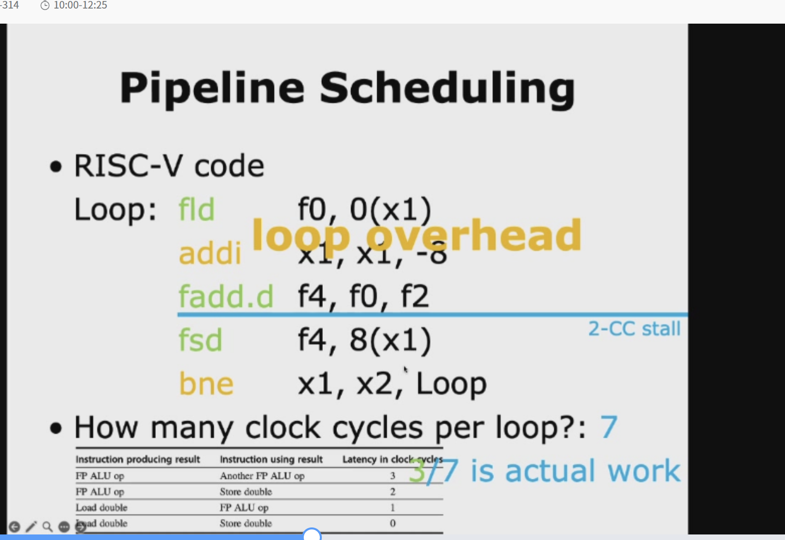
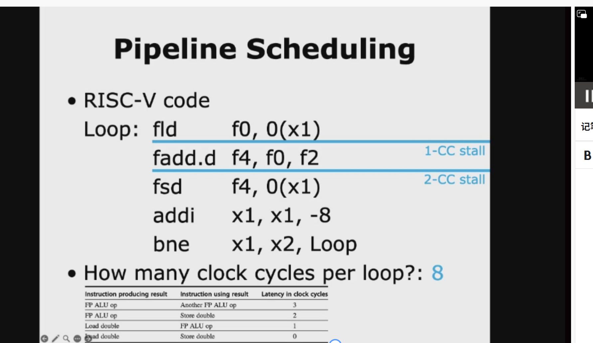
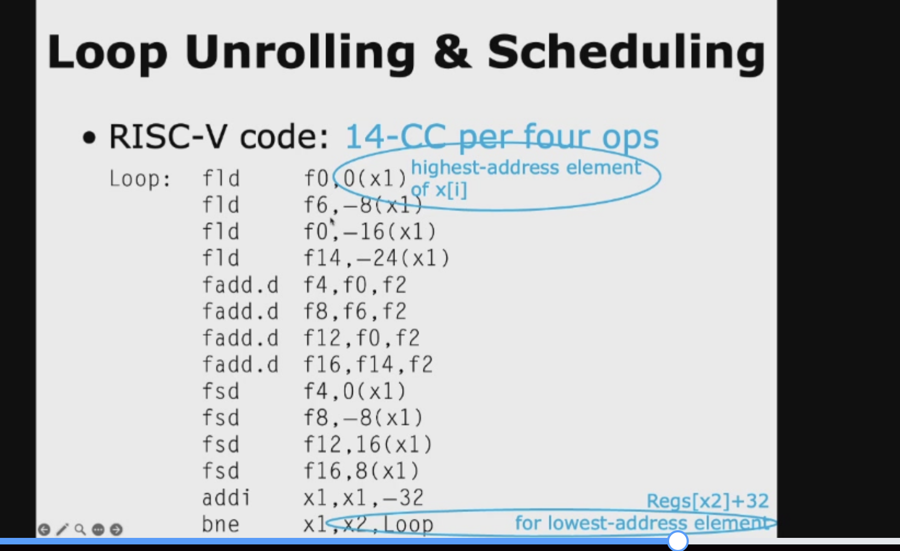
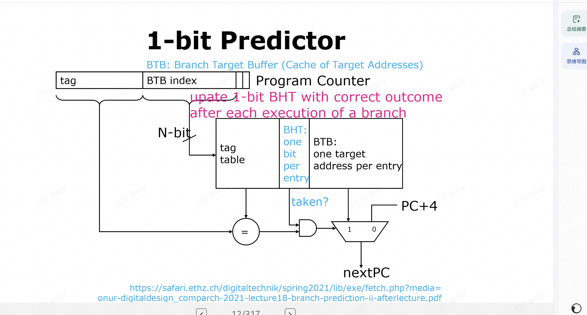
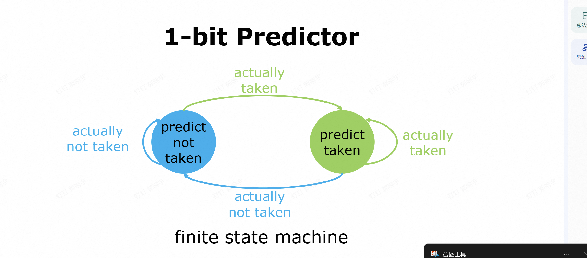

# 指令并行

## 第一页：ILP Exploitation（指令级并行的开发）
这页讲的是**CPU如何利用指令级并行（Instruction-Level Parallelism, ILP）**，也就是让多条指令同时执行来提速，分两大流派：

1.  **Compiler-based static parallelism（基于编译器的静态并行）**
    *   核心：在**程序运行前**，由编译器分析代码、找出能并行执行的指令，并重新排列它们的顺序。
    *   局限：这种方法只在特定场景下效果好——比如**领域专用环境**（像嵌入式DSP）或者**结构规整的科学计算程序**（比如矩阵运算），这类程序里存在大量数据级并行（比如向量/数组运算），编译器很容易分析出依赖关系。
    *   为什么有局限？因为通用程序（比如分支多、依赖复杂的代码）里，编译器很难提前预测所有可能的执行路径，没法高效挖掘并行性。

2.  **Hardware-based dynamic parallelism（基于硬件的动态并行）**
    *   核心：在**程序运行时**，由CPU硬件（比如乱序执行单元、重排序缓存）动态分析指令依赖，把能并行的指令找出来乱序执行。
    *   特点：不需要编译器提前做太多优化，对通用程序也能有效利用ILP，现代高性能CPU（比如x86、ARM的主流架构）基本都用这套方案。

---

## 第二页：Static Scheduling（静态调度的具体技术）
这页是对“编译器静态并行”的补充，讲了两种编译器常用的优化手段：

1.  **Pipeline Scheduling（流水线调度）**
    *   目标：避免流水线“气泡”（stall，也就是流水线空转、等数据的情况）。
    *   做法：编译器在编译阶段就重新排列指令顺序，把没有依赖关系的指令插到数据相关的指令之间，让流水线能一直跑满。
    *   例子：比如指令A要算结果给指令B用，编译器会在A和B之间插入几条和它们都无关的指令C、D，这样A执行的时候，C、D也能并行执行，不会空等。

2.  **Loop Unrolling（循环展开）**
    *   目标：减少循环的控制开销，同时增加可并行的指令数量。
    *   做法：把循环体复制多份，减少循环次数，让每次循环里执行更多有效指令，摊薄分支、循环计数器更新这类“开销指令”的占比。
    *   例子：原来的循环是`for(i=0; i<4; i++) { a[i] = b[i] + c[i]; }`，展开2次后变成：
        ```c
        for(i=0; i<4; i+=2) {
            a[i] = b[i] + c[i];
            a[i+1] = b[i+1] + c[i+1];
        }
        ```
        这样循环次数减半，每次循环里有两条独立的加法指令，编译器更容易把它们调度到流水线里并行执行。

---

### 一句话总结
这两页PPT讲的是：
CPU提速的核心是利用**指令级并行（ILP）**，实现方式分两种：
- 静态：编译器提前排好指令顺序、展开循环，适合规整的科学计算；
- 动态：硬件在运行时乱序执行，适合通用程序，是现代CPU的主流方案。


# 循环展开

## 第一张：原始循环的流水线调度案例
你已经看过这张了，我帮你快速复盘一下：
### 原始C代码
```c
for (i = 999; i >= 0; i = i - 1)
    x[i] = x[i] + s;
```
功能：从后往前，给数组 `x` 的每个元素加上常数 `s`。

### 对应的RISC-V汇编（未优化）
```asm
Loop:
  fld     f0, 0(x1)      // 加载 x[i] 到 f0
  fadd.d  f4, f0, f2     // f0 + s（存在f2），结果到f4
  fsd     f4, 0(x1)      // 存回 x[i]
  addi    x1, x1, -8     // 指针减8（双精度占8字节）
  bne     x1, x2, Loop   // 判断是否继续循环
```
**核心问题**：
1.  每次循环都要执行 `addi` 和 `bne` 这两条“控制开销指令”，但它们本身不做有效计算。
2.  浮点指令之间存在强依赖，`fld` → `fadd.d` → `fsd` 形成一条长依赖链，容易造成流水线停顿。

---

## 第二张：循环展开（Loop Unrolling）的优化实现
这张就是对上面的循环做了**4次展开**的版本，我们逐行拆解：

### 展开后的汇编代码
```asm
Loop:
  // 第1次迭代：处理x[i]
  fld     f0, 0(x1)
  fadd.d  f4, f0, f2
  fsd     f4, 0(x1)      // //drop addi & bne 注释：不用每次都执行addi和bne了

  // 第2次迭代：处理x[i-1]
  fld     f6, -8(x1)
  fadd.d  f8, f6, f2
  fsd     f8, -8(x1)     // //drop addi & bne

  // 第3次迭代：处理x[i-2]
  fld     f0, -16(x1)
  fadd.d  f12, f0, f2
  fsd     f12, -16(x1)   // //drop addi & bne

  // 第4次迭代：处理x[i-3]
  fld     f14, -24(x1)
  fadd.d  f16, f14, f2
  fsd     f16, -24(x1)

  addi    x1, x1, -32    // 一次减32（=4×8），直接处理4个元素
  bne     x1, x2, Loop   // 只在4次迭代后判断一次
```

### 它解决了两个核心问题：
1.  **减少循环控制开销**
    - 原来每1次循环，都要执行1次 `addi` + 1次 `bne`，共2条控制指令。
    - 现在展开4次后，每4次循环才执行1次 `addi` + 1次 `bne`，相当于**控制开销减少了75%**。
    - 程序中有效计算指令（`fld`/`fadd.d`/`fsd`）的占比大幅提升，CPU的“干活效率”变高了。

2.  **创造了更多可并行的指令（为流水线调度铺路）**
    - 原来的循环里，只有一条 `fld`→`fadd.d`→`fsd` 的依赖链，很难调度。
    - 现在展开后，有了4条完全独立的浮点运算链（用不同的浮点寄存器 `f0/f6/f14` 保存中间结果）。
    - 编译器/CPU可以把这些独立指令交叉调度，比如在等待第一个 `fadd.d` 完成时，提前执行第二个 `fld`，彻底填满流水线，消除气泡。

---

## 关键细节：为什么地址是 `-8(x1)`、`-16(x1)`？
- 原始循环里，我们是**先计算，再减地址**，所以每次都用 `0(x1)` 访问当前元素。
- 展开后，我们**一次性处理4个元素**，地址从 `x1` 开始，分别是 `x1`、`x1-8`、`x1-16`、`x1-24`，最后再一次性把 `x1` 减去32。
- 这样就避免了每次迭代都修改 `x1`，减少了依赖，也减少了控制指令。

---

## 一句话总结这两页PPT的关系
第一张是**原始循环的问题：控制开销大、指令依赖集中、流水线利用率低**；
第二张是**用循环展开解决这些问题：减少控制开销、增加独立指令、为流水线调度创造更多并行机会**。

。




# 分支调度

这4张PPT讲的是**编译器里为了挖掘指令级并行（ILP）的高级静态调度技术**，我帮你按顺序串起来讲清楚👇

---

## 第1张：Frequent Critical Path（高频关键路径）
这是后面所有优化的核心思想：**优先优化程序里执行次数最多的路径**。
- 例子里的分支，99%的情况都会走“`A(i)=0` 为真”的路径，只有1%走另一条。
- 编译器的策略是：**把高频路径当成“没有分支”来处理**，像普通直线代码一样重排、调度指令，最大化它的并行度；低频路径暂时不管。
- 这是所有“基于跟踪（Trace）”优化的起点：抓大放小，优先优化绝大多数情况。

---

## 第2张：Trace Scheduling（跟踪调度）
这是实现上面思想的经典算法，核心就是“把高频路径拼成一条连续的Trace（跟踪）”：
1.  **Unrolled trace（展开的跟踪）**：
    把高频路径的指令串起来，比如例子里把循环里每次都走的“`A(i)=0`→`B(i)=`→`C(i)=`”拼成一条连续的指令序列，相当于把分支“抹平”了，方便编译器做全局调度。
2.  **Trace Exit（跟踪出口）**：
    当程序不走高频路径（比如遇到1%的分支）时，会从Trace里跳出去，这里叫Trace Exit。
3.  **Trace Entrance（跟踪入口）**：
    低频路径执行完后，再跳回Trace里继续执行，这里叫Trace Entrance。

简单说：Trace Scheduling就是把高频路径拼成一条直线，编译器就可以像优化无分支代码一样，随便重排指令、挖掘并行性了。

---

## 第3张：Fixup Code（补偿/修复代码）
Trace Scheduling有个问题：你重排了高频路径的指令顺序，但低频路径的执行顺序被打乱了，可能会出错。
- 解决方法就是写**Fixup Code（补偿代码）**：
  1.  重排指令的时候，在Trace Exit和Trace Entrance的位置，复制一份需要的指令（比如例子里的`B'`、`C'''`）。
  2.  这样就算程序跳出了高频路径，也能通过补偿代码保证低频路径的执行结果是正确的。
- 代价是：代码体积会变大（因为复制了很多指令），但换来了高频路径的极致性能。

---

## 第4张：Superblock（超级块）
这是Trace Scheduling的简化版，也是现在编译器更常用的技术，核心是**Tail Duplication（尾部复制）**：
- 例子里的分支：`opA`执行后，99%的情况走`opC`，1%走`opB`再到`opC'`。
- 做法：把高频路径`opA→opC`拼成一个“超级块”，把低频路径里和高频路径结尾相同的指令（比如`opC`）复制一份，变成`opC'`，附在低频路径后面。
- 好处：
  1.  高频路径变成了一条无分支的直线，编译器可以自由调度。
  2.  低频路径通过复制的指令保证了正确性，还可以做额外优化（比如例子里把`opC: mul r3,r2,3`改成`mov r3,r1`，因为`opA`已经算过`r1=r2*3`了，直接复用结果，这就是`Subexpression elimination`，公共子表达式消除）。

---

## 一句话总结这4张PPT
它们讲的是：
1.  先找出程序里**99%时间都在跑的高频关键路径**；
2.  用Trace Scheduling/Superblock把它拼成一条无分支的直线代码；
3.  重排指令顺序，最大化并行度；
4.  用Fixup Code/Tail Duplication保证剩下1%的低频路径也能正确执行。

这就是编译器静态调度的“极限玩法”，专门解决分支导致的指令级并行挖掘难题。


# control hazard


我帮你把这三张PPT串起来，从「问题是什么→怎么解决→代价是什么」一步讲透，保证你完全理解。

---

## 先铺垫：流水线的基本规则
这是一个典型的**5级流水线**，每个指令会被拆成5个阶段，重叠执行：
| 阶段 | 全称       | 作用               |
|------|------------|--------------------|
| IF   | Instruction Fetch | 取指：从内存拿指令 |
| ID   | Instruction Decode | 译码+读寄存器 |
| EX   | Execute    | 执行/计算地址       |
| MEM  | Memory Access | 访存 |
| WB   | Write Back | 写回寄存器 |

流水线的核心优势是**重叠执行**：比如周期2，指令1在做ID，指令2同时在做IF，每个周期都在干活。

---

## 第一张PPT：Control Hazard & Branch Hazard（问题的根源）
### 核心矛盾：分支指令会“打乱”取指节奏
流水线默认按顺序取指令，每次取 `PC+4` 的下一条指令。但遇到**分支/跳转指令**（比如 `beq`）时，有两种可能：
1.  **Taken（分支成立）**：PC跳转到目标地址，不按顺序执行。
2.  **Untaken（分支不成立）**：PC继续走 `PC+4`，按顺序执行。

### 致命延迟：PC要到什么时候才确定？
PPT明确说了：`PC is not changed till the end of ID`（PC要到**ID阶段结束**才会更新）。

举个例子，分支指令 `B` 的执行过程：
| 周期 | 分支指令B的阶段 | 下一条指令i+1的阶段 | 问题 |
|------|----------------|---------------------|------|
| 1    | IF（取指）     | -                   | 正常 |
| 2    | ID（译码+判断条件） | IF（按PC+4取指） | B还没判断完，i+1已经按默认地址取了 |
| 3    | EX             | ID                  | 如果分支成立，i+1取的是错的！ |

这就是**Branch Hazard（分支冒险）**：因为分支指令要到ID阶段结束才知道下一条指令的地址，而流水线已经提前取了下一条指令，可能取错，导致整个流水线出错。

---

## 第二张PPT：Redo IF（停顿取指，最简单的解决办法）
### 思路：先等分支判断完，再取正确的指令
为了避免取错指令，我们直接**让流水线停顿（Stall）**，等分支指令在周期2结束、PC确定了，再重新取指（Redo IF）。

看PPT里的时间线（列是周期）：
| 指令                | 周期1 | 周期2 | 周期3 |
|---------------------|-------|-------|-------|
| Branch instruction  | IF    | ID    | EX    |
| Branch successor    | -     | -     | IF    |

也就是：
- 周期1：B正常取指（IF）
- 周期2：B在ID阶段判断条件，流水线停顿，不取下一条指令
- 周期3：B的ID阶段结束，PC确定了，再开始取下一条指令（IF）

这相当于**流水线停了1个周期**，保证取到的指令一定是对的。

但这个方法有个明显缺点：
如果分支不成立（untaken），其实下一条指令本来就该是 `PC+4`，和判断结果一样，那这个停顿就白做了，浪费了1个周期。

---

## 第三张PPT：Freeze or Flush the Pipeline（冻结/冲刷流水线）
### 思路：在分支目标确定前，“暂停”或“删除”错误指令
这是更通用的解决办法，有两种操作：
1.  **Freeze（冻结）**：在分支指令知道目标地址前，把流水线“冻住”，不执行分支后的任何指令，直到PC确定。
2.  **Flush（冲刷）**：如果已经取了错误的指令，直接把它们从流水线里删掉（冲掉），等PC确定后再取正确的指令。

看PPT里的时间线：
| 指令                | 周期1 | 周期2 | 周期3 |
|---------------------|-------|-------|-------|
| Branch instruction  | IF    | ID    | EX    |
| Branch successor    | -     | -     | IF    |

这里的successor指令，IF阶段推迟到了B的EX阶段，说明**分支判断要到EX阶段才完成**，所以需要停顿2个周期，把周期2本来要取的错误指令冲掉，周期3再重新取。

这个方法的核心是**保证不会执行错误指令**，代价是流水线停顿，浪费周期（停顿的长度取决于分支判断的阶段）。

---

## 三张PPT的逻辑链总结
1.  **问题**：分支指令导致PC不确定，下一条指令可能取错（分支冒险）。
2.  **最简单解决**：停顿1个周期，等分支判断完再取指（Redo IF）。
3.  **通用解决**：冻结/冲刷流水线，在分支目标确定前不执行分支后的指令，代价是流水线停顿。

# 续集

我帮你把这两张PPT拆成「人话版」，先讲**延迟分支（Delayed Branch）**，再讲**硬件分支预测（BTB+方向预测器）**，最后串起来它们的作用和区别👇

---

## 第一张：Delayed Branch（延迟分支）
这是一种**靠编译器静态调度解决分支冒险**的老方法，核心思路是：**不用让流水线停顿，而是把“分支带来的气泡，用一条安全的指令填上”**。

### 核心规则（先记死）
分支指令的效果，**要等它后面的下一条指令执行完才生效**。
不管分支最后「跳还是不跳」，这条紧跟在分支指令后面的指令，都会被执行。
这条指令所在的位置，就叫 **Branch delay slot（分支延迟槽）**。

### 举个最直观的例子
比如原来的代码，分支指令后面有个气泡：
```asm
beq x1, x2, target  // 分支指令，要到ID阶段才知道跳不跳
addi x3, x3, 1      // 顺序下一条指令，可能被冲刷，产生气泡
```
延迟分支的解决方法：**编译器找一条和分支无关的指令，挪到延迟槽里，把气泡填上**：
```asm
beq x1, x2, target  // 分支指令
addi x3, x3, 1      // ← 延迟槽指令！不管跳不跳，这条都会执行
// 如果分支不成立，继续执行下一条；如果成立，跳转到target
```
- 这条`addi`和分支的判断、跳转完全无关，所以不管分支结果如何，执行它都不会出错。
- 流水线也不用停顿，直接连续执行，没有气泡，完美利用了原来浪费的周期。

### PPT里的关键信息解读
- `pipelining sequence`：`branch instruction → sequential successor → branch target if taken`
  就是说，流水线的执行顺序是：分支指令 → 延迟槽指令 → （如果分支成立）跳转到目标地址。
- 蓝色框的解释：延迟槽指令是和分支目标无关的指令，**无论分支是否成立，都会被执行**，所以编译器必须选一条安全的指令填进去。

### 延迟分支的优缺点
✅ 优点：硬件不需要做任何停顿，靠编译器就能消除气泡，实现简单。
❌ 缺点：
  1. 延迟槽数量有限（通常只有1个，少数CPU有2个），不是所有分支都能找到无关指令填进去。
  2. 现代CPU的流水线越来越长，分支延迟不止1个周期，延迟槽不够用了。
  3. 编译器的调度负担变重，而且会让代码的可读性变差。
所以现在的通用CPU已经不用延迟分支了，转向硬件动态预测。

---

## 第二张：Fetch Stage with BTB & DP（带BTB和方向预测器的取指阶段）
这是**现代CPU主流的硬件动态分支预测方案**，核心思路是：**在取指阶段就预测分支的方向和目标地址，直接算出下一条指令的地址，完全不用等分支指令执行完，从根源上消除气泡**。

### 先搞懂每个模块的作用
| 模块 | 全称 | 作用 |
|------|------|------|
| PC | Program Counter | 当前分支指令的地址，作为输入 |
| Direction Predictor (DP) | 方向预测器 | 预测这个分支会不会跳转（taken / not taken），比如用2位饱和计数器，根据历史行为预测 |
| BTB | Branch Target Buffer（分支目标缓冲） | 一个高速缓存，存之前执行过的分支指令的「目标地址」，用PC查缓存，命中就直接拿到目标地址 |
| 多路选择器 | MUX | 根据预测结果，选择下一个取指地址：如果预测分支成立且BTB命中，就用目标地址；否则用`PC + 指令长度`（顺序地址） |

### 整个流程（一步到位）
1. 当前分支指令的PC，同时送到**方向预测器**和**BTB**。
2. 方向预测器预测：这次分支会不会跳转？
3. BTB查询：这个分支之前执行过吗？如果命中，就拿到它的目标地址。
4. 两者结合判断：如果预测“跳转”且BTB命中，就把目标地址作为下一个取指地址；否则用顺序地址。
5. 输出`Next Fetch Address`，直接给下一个周期的PC用，流水线不用停顿，也不用等分支指令执行完。

### 核心优势
- **零停顿（大部分情况）**：在取指阶段就完成了分支预测，流水线可以连续取指，没有气泡。
- **动态自适应**：方向预测器会根据分支的实际结果更新预测规则，预测准确率很高（现代CPU能到95%以上）。
- **不用编译器操心**：完全由硬件实现，对上层软件透明，程序员和编译器都不用做额外优化。

---

## 两张PPT的关系总结
| 方案 | 延迟分支（第一张） | BTB+方向预测器（第二张） |
|------|-------------------|--------------------------|
| 解决思路 | 编译器静态调度，用无关指令填气泡 | 硬件动态预测，提前算出下一个地址 |
| 实现主体 | 编译器 | 硬件 |
| 停顿代价 | 无停顿（填槽成功时） | 预测错误才会有停顿（准确率很高，几乎可以忽略） |
| 适用场景 | 早期短流水线CPU（如MIPS RISC） | 现代长流水线CPU（x86、ARM等） |

# 动态预测

我帮你把这三张PPT串起来，从**静态预测→动态预测→最简单的1-bit动态预测器**，一次性讲透，顺便对比清楚它们的核心区别👇

---

## 一、总纲：分支预测的核心目标
不管静态还是动态，都是为了解决**分支冒险**：
CPU在取指阶段，不知道分支指令会不会跳、跳到哪，只能先猜一个地址取指。
- 猜对了：流水线零停顿，性能拉满；
- 猜错了：流水线要冲刷、停顿，性能损失。

所以，预测准确率越高，流水线效率越高。

---

## 第一张：Static Branch Prediction（静态分支预测）
### 核心定义：**预测规则在编译时就定死，运行时永远不变**
不管分支实际怎么走，CPU都按固定策略猜，不会根据运行结果调整。

### 常见的静态预测策略
1.  **固定预测Taken（跳转）**：
    比如循环里的分支（`for/while`的回跳），99%的情况都会跳回循环头，所以直接猜“会跳”。
2.  **固定预测Not Taken（不跳转）**：
    比如普通`if`分支，很多时候会走顺序执行的路径，直接猜“不跳”。
3.  **编译器辅助预测**：
    编译器分析代码，给分支加hint（比如C里的`__builtin_expect`、`likely/unlikely`），CPU按编译器的hint来猜。

### 图里的结构怎么理解？
你看到的BTB+方向预测器的图，是分支预测的通用框架，**静态预测的“方向预测器”是“固定输出”**：
- 比如永远输出“taken”，或者永远输出“not taken”，不会根据分支实际结果更新状态。
- BTB在这里还是存分支目标地址，但方向预测是固定的。

### 优缺点
✅ 优点：实现超级简单，不需要额外硬件存历史状态，早期CPU常用。
❌ 缺点：
- 对复杂/不规律的分支（比如交替执行的`if-else`），准确率很低；
- 没法适应分支的变化，比如循环次数变了、分支行为变了，预测策略还是老的。

---

## 第二、三张：Dynamic Branch Prediction（动态分支预测）
这是现代CPU的主流方案，核心是：**运行时根据分支的历史行为，动态调整预测规则，越猜越准**。

### 核心组件：BHT（Branch History Table，分支历史表）
- 一个高速小表，用**分支指令地址的低位**当索引，每个条目存这个分支的历史状态（比如1-bit、2-bit计数器）。
- 每次遇到分支，先查BHT的状态来预测；分支实际执行完，再根据结果更新BHT的状态，下次预测就用新状态。

---

### 重点：第三张PPT的「1-bit Predictor（单比特预测器）」
这是最简单的动态预测器，也叫“last-time predictor”（按上次结果猜）。

#### 原理（一句话）：
每个分支在BHT里存1位状态，用它来预测：
- `1`：表示这个分支上次跳了，这次预测“会跳（taken）”；
- `0`：表示这个分支上次没跳，这次预测“不跳（not taken）”。

#### 完整流程
1.  **取指阶段**：用当前分支的PC查BHT，拿到1位状态，按状态预测下一个取指地址；
2.  **执行阶段**：分支指令算出实际结果（跳/不跳）；
3.  **更新阶段**：根据实际结果，把BHT里的状态改成对应的`1`或`0`，供下次预测用。

#### 举两个直观的例子
##### 例子1：循环分支（规律分支）
比如`for(i=0; i<100; i++)`的回跳分支：
- 前99次都会跳回循环头，BHT里的状态一直是`1`，每次都猜“会跳”，**准确率100%**，流水线零停顿。
- 只有最后一次退出循环时会猜错，更新状态为`0`，但影响很小。

##### 例子2：交替分支（不规律分支）
比如每次都交替走的`if-else`分支：
- 第一次走`if`（跳）→ BHT设`1`；
- 第二次猜跳，但实际走`else`（不跳）→ BHT设`0`；
- 第三次猜不跳，但实际走`if`（跳）→ BHT设`1`；
- 永远错一半，**准确率只有50%**，每次猜错都要冲刷流水线。

#### 优缺点
✅ 优点：比静态预测准确率高很多，尤其是规律分支，实现也很简单。
❌ 缺点：对交替分支、刚进入/退出循环的分支，准确率很低，这也是为什么后来会有更复杂的2-bit、两级预测器。

---

## 三、静态 vs 动态：一句话对比
| 维度 | 静态分支预测 | 动态分支预测（1-bit） |
|------|--------------|------------------------|
| 预测依据 | 编译时定死的固定策略 | 分支的历史行为（上次结果） |
| 运行时调整 | 不调整 | 每次分支执行完都会更新状态 |
| 规律分支准确率 | 高（比如循环） | 很高 |
| 不规律分支准确率 | 低 | 中等（比静态好） |
| 硬件开销 | 几乎为0 | 很小（只需要BHT） |

---

## 四、三张PPT的逻辑链
1.  先讲**静态预测**：用固定策略猜分支，简单但不灵活；
2.  再讲**动态预测**：用分支历史动态调整，准确率更高；
3.  最后讲动态预测里最简单的**1-bit预测器**：只记上一次的结果，实现了“看历史猜未来”。

# 1bit预测


这两张图合起来，就是**1-bit分支预测器的完整硬件实现和状态更新逻辑**：
- 第一张讲「硬件怎么在取指阶段做预测」
- 第二张讲「每次分支执行完，预测状态怎么更新」

我帮你拆解得明明白白，还会呼应你之前问的「交替分支全错」的问题👇

---

## 一、第一张图：1-bit预测器的硬件结构
这是预测器的物理实现，核心是一个**带标签的分支历史+目标地址缓存**，和Cache的结构很像。

### 1. 各个模块的作用
| 模块 | 作用 |
|------|------|
| **Program Counter (PC)** | 当前分支指令的地址，被拆成两部分：<br>- `index`（N位）：用来查缓存表<br>- `tag`：用来校验是否命中缓存 |
| **组合缓存表（tag table）** | 每个条目存3个关键信息：<br>1. `tag`：和PC的tag对比，判断这个分支有没有被记录过<br>2. `BHT（1-bit）`：分支历史表，存这个分支上次的执行结果，用来预测这次会不会跳转<br>3. `BTB`：分支目标缓冲，存分支如果跳转的话，目标地址是什么 |
| **比较器** | 对比PC的tag和缓存条目的tag，判断是否命中 |
| **多路选择器（MUX）** | 选下一条指令的地址：<br>- 命中且预测跳转：用BTB里的目标地址<br>- 未命中或预测不跳转：用默认的`PC+4` |

### 2. 取指阶段的预测流程（一步到位）
1.  当前分支指令的PC被送到预测器；
2.  用PC的`index`查缓存表，拿到对应的条目；
3.  用`tag`校验是否命中，确认这个分支在缓存里有记录；
4.  看BHT里的1位值，得到预测结果（`1`=预测跳转，`0`=预测不跳转）；
5.  输出下一个取指地址：如果命中且预测跳转，用BTB的目标地址；否则用`PC+4`。

### 3. 粉色文字的关键补充
`update 1-bit BHT with correct outcome after each execution of a branch`
意思是：**每次分支执行完，知道了实际结果，就要更新BHT里的1位值**，为下一次预测做准备。
如果是新的分支，还会把它的地址、目标地址写入BTB，下次就有记录了。

---

## 二、第二张图：1-bit预测器的状态机（FSM）
这张图是BHT里那个1位值的**状态转移规则**，也是1-bit预测器的核心逻辑。

### 1. 两个状态，对应BHT的1位值
- 蓝色状态：`predict not taken`（预测不跳转，对应BHT位为`0`）
- 绿色状态：`predict taken`（预测跳转，对应BHT位为`1`）

### 2. 状态转移规则（完全对应你之前的疑问）
箭头表示「实际分支结果」触发的状态变化：
- 当前状态是`predict not taken`（0）：
  - 实际分支是`taken`（跳转）→ 转移到`predict taken`（1）（猜错了，下次反向）
  - 实际分支是`not taken`（不跳转）→ 留在原状态（猜对了，保持）
- 当前状态是`predict taken`（1）：
  - 实际分支是`taken`（跳转）→ 留在原状态（猜对了，保持）
  - 实际分支是`not taken`（不跳转）→ 转移到`predict not taken`（0）（猜错了，下次反向）

### 3. 这就是你说的「交替分支全错」的根源
如果分支是严格交替执行的：`taken → not taken → taken → not taken...`
状态机的变化会变成：
1.  初始状态：`predict not taken`（0）
2.  第一次实际`taken` → 转移到1，预测错误
3.  第二次实际`not taken` → 转移到0，预测错误
4.  第三次实际`taken` → 转移到1，预测错误
5.  第四次实际`not taken` → 转移到0，预测错误

永远在两个状态之间来回跳，每次都猜错，正好对应状态机的转移箭头。

---

## 三、两张图合起来：完整的1-bit预测流程
1.  **取指阶段**：用第一张的硬件结构，根据BHT的当前状态，预测下一个取指地址；
2.  **执行阶段**：分支指令算出实际结果；
3.  **更新阶段**：用第二张的状态机规则，更新BHT的状态，同时更新BTB里的目标地址。

---

## 补充：为什么1-bit预测器还能用？
虽然它在交替分支下会全错，但在真实程序里，**90%以上的分支是循环分支**（比如`for/while`），它们的行为高度稳定：
- 比如循环执行100次，99次都是跳转，只有最后一次退出；
- 状态机只会在第一次和最后一次猜错，中间98次全对，正确率高达98%。

所以1-bit预测器是一个取舍：牺牲少量不稳定分支的准确率，换来了极低的硬件开销和主流稳定分支的高准确率。

