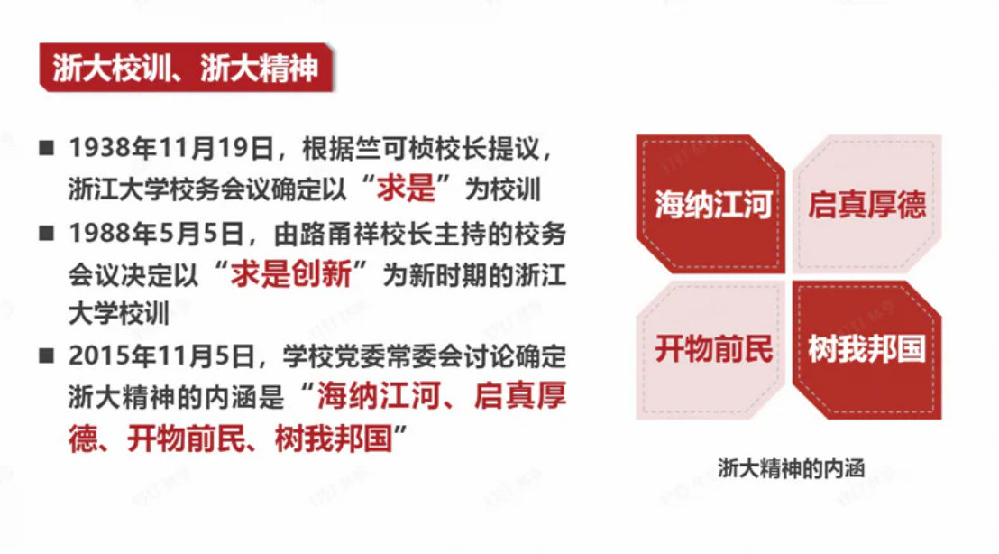

# 历年卷综合

## 一、选择题重点

1. **总体国家安全观**
   - 五大要素：以人民安全为宗旨，以政治安全为根本，以经济安全为基础，以军事、科技、文化、社会安全为保障，以促进国际安全为依托
   - 五对关系：既重视发展问题，又重视安全问题；既重视外部安全，又重视内部安全；既重视国土安全，又重视国民安全；既重视传统安全，又重视非传统安全；既重视自身安全，又重视共同安全

2. 青年要做三个者(实践者)
3. 国家利益
4. 数字经济
5. 反腐："三不"战略
   - 不敢
   - 不能
   - 不想

6. 乡村振兴
7. 统筹**发展**和**安全**
8. 浙江大学第十五次党代会：培养担当民族复兴大任的时代新人
9. 我国发展最大不平衡：城乡
10. 中国共产党的中心任务：以**中国式现代化**全面推进中华民族伟大复兴
11. 自我革命
12. 习总书记：八八战略
13. 海洋强国：关心、认识、经略
14. 三大倡议
    - 全球发展倡议
    - 全球安全倡议
    - 全球文明倡议

15. 大国关系核心特征：相互尊重、合作共赢的合作伙伴关系
16. 12339

---

## 二、简答题重点

### 1. 校训精神

### 2. 总体国家安全观
>
> 参见选择题第1条

### 3. 国际格局的时代特征

- 时代主题明朗化
- 世界格局多极化
- 经济贸易全球化
- 安全环境复杂化
- 非政府组织兴起

### 4. 海洋强国建设要点

1. 提高海洋意识
2. 坚持陆海统筹
3. 发展海洋科技
4. 保护海洋生态
5. 建设强大海军
6. 发展海洋经济

### 5. 人类命运共同体三观

- 共同命运观
- 可持续发展观
- 全球治理观

### 6. 反腐败新特点

不因身份、数量而例外

不因行业、领域而止步

不因敏感时期、特殊节点而放松

不因小官小利而轻纵

不因空间、地域而区别

#### 治理新特点：

不松劲、不歇脚

真追责、敢追责、严追责，持之以恒正风肃气

把权力关进制度的笼子

坚持不敢腐不能腐不想腐一体推进

落实无禁区全覆盖零容忍深入开展

整治群众身边的腐败问题

聚焦政治问题和经济问题交织的腐败案件防止党内形成利益集团

### 7. 新时代中国经济发展的八个非凡成就

1. 宏观经济稳中向好
2. 科技创新重大突破
3. 现代化产业体系
4. 全面小康
5. 城乡区域协调发展
6. 高水平对外开放

### 8. 国之大者内涵

在中国特色社会主义新时代，最根本的"国之大者"是统揽伟大斗争、伟大工程、伟大事业、伟大梦想，统筹推进"五位一体"总体布局，协调推进"四个全面"战略布局，实现全面建成小康社会目标，开启全面建设社会主义现代化强国新征程，为实现中华民族伟大复兴中国梦而不懈奋斗。

### 9. 中国式现代化五大特征

1. 人口规模巨大的现代化
2. 全体人民共同富裕的现代化
3. 物质文明和精神文明相协调的现代化
4. 人与自然和谐共生的现代化
5. 走和平发展道路的现代化

### 10. "三新一高"

- 新发展阶段
- 新发展理念
- 新发展格局
- 高质量发展

### 11. 一带一路

- 丝绸之路经济带和21世纪海上丝绸之路
- 五通：政策沟通、设施联通、贸易畅通、资金融通和民心相通

---

## 三、论述题方向

1. 乡村振兴：产业，文化，生态，组织，人才振兴
2. 外交（一带一路/人共）
3. 大学生维护国家利益与国家安全：国家安全和利益的自觉维护者

（1）每个学科都是国家安全领域的组成部分，学好本领，每个学生都应该具有知识报国、科技报国的家国情怀和远大理想。

（2）从大局意识上了解把握中央维护国家安全的战略目标、基本原则、重点内容、策略方法等。树立总体国家安全观，维护国家利益和国家安全。

（3）履行公民职责：《国家安全法》第七十七条公民和组织应当履行的维护国家安全的义务

4. 海洋强国
5. 国家利益是处理国际关系的核心
6. 从"新发展阶段、贯彻新发展理念、构建新发展格局"，谈新发展的内涵

### 人类命运共同体

#### 背景：

全球性相互依赖促使人类命运紧密相连  
全球治理体系需要变革和发展  
中国有意愿也有能力为世界作出更大贡献

#### 特征

开放包容

公平正义

和谐共处

多元互鉴

团结协作

#### ==目标要求==

政治：持久和平

安全：普遍安全

经济：共同繁荣

文明：开放包容

生态：清洁美丽

#### 如何构建人类命运共同体

政治：对话协商，建立平等相待、互商互谅的伙伴关系格局

安全：共建共享，建立公道正义、共建共享的安全格局

> 共同、综合、合作、可持续的安全观

经济：合作共赢，建立开放创新、包容互惠的发展格局

文明：交流互鉴，建立和而不同、兼收并蓄的文明交流格局

生态：绿色低碳，建立尊崇自然、绿色发展的生态格局

> 绿色、低碳、循环、可持续发展之路

#### 推动构建人类命运共同体的中国实践

习近平外交思想是构建人类命运共同体的行动指南

推动全球和平

> 全球安全倡议

推动全球发展

> 全球发展倡议

践行可持续发展

> 支持落实联合国2030年可持续发展议程

提供国际公共产品（一带一路10年）

> 当今世界规模最大的国际合作平台和最受欢迎的国际公共产品
>
> 丝绸之路经济带和21世纪海上丝绸之路

促进文明交流互鉴

> 全球文明倡议
>
> 杭州亚运会
>
> 浙江大学学科会聚计划：亚洲文明研究院

推动全球公共卫生治理

> 浙江大学实践：”一带一路“国际医学院

---

## 四、材料分析题

这个基本就是想到啥好的说啥

### 什么是国家利益

> 满足或能够满足国家以生存发展为基础的各方面需要并且对国家在整体上有利的事物，一个国家在经济、政治、军事或文化上的目标和抱负。也指一个国家内有利于其绝大多数居民的共同生活与进一步发展的诸因素的综合。

> #### 层次
>
> 独立与生存、稳定与发展、国际参与
>
> 主权利益：最根本
>
> 发展利益：国际竞争力
>
> 参与利益：制度性舆论性话语权
>
> #### 领域
>
> 政治、经济、文化、社会、安全、外交、军事

