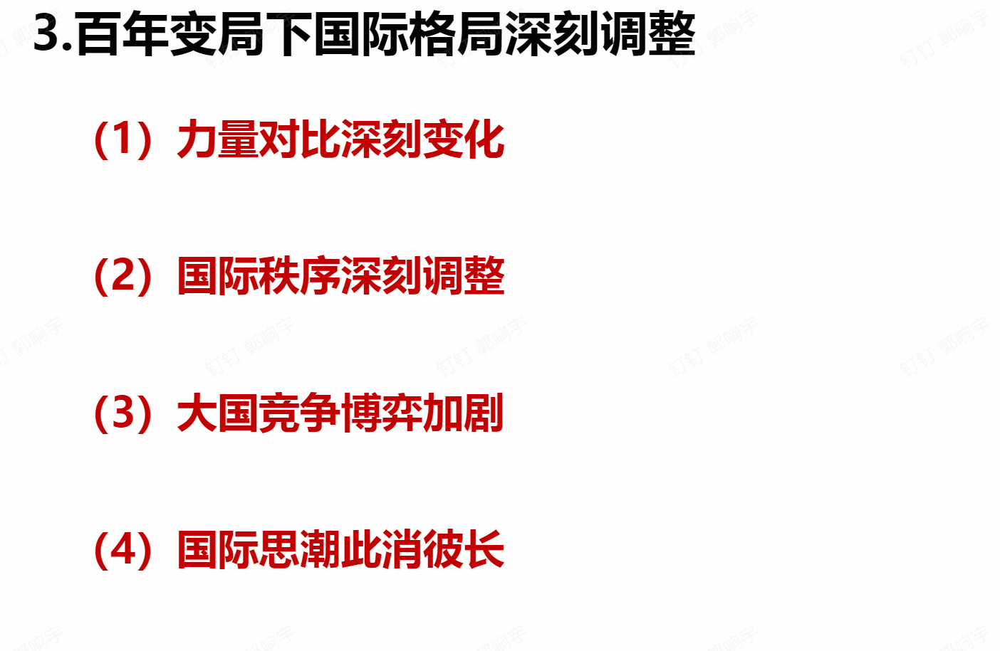
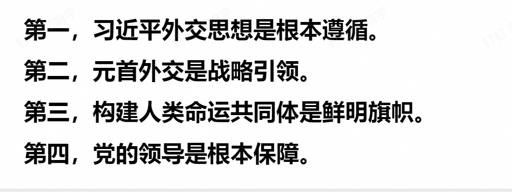
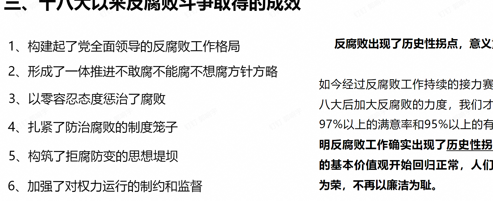
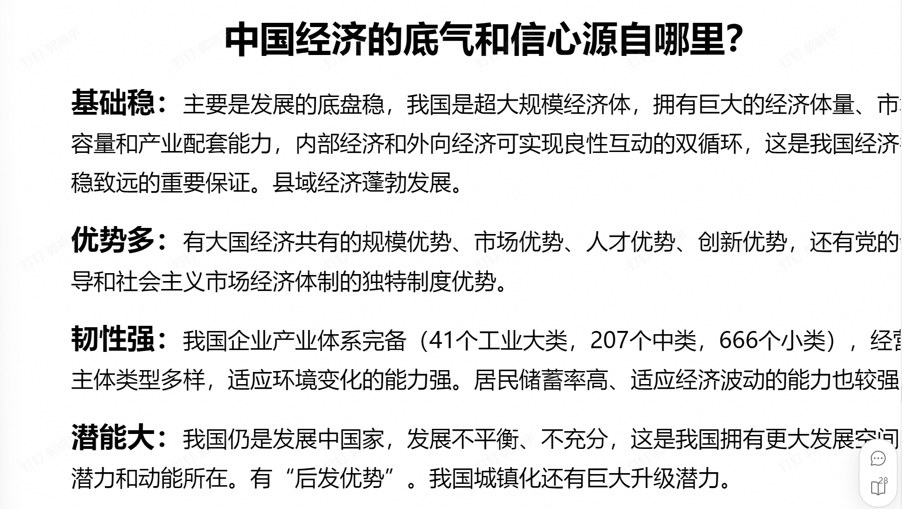
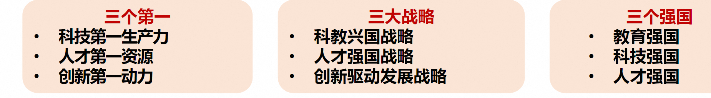
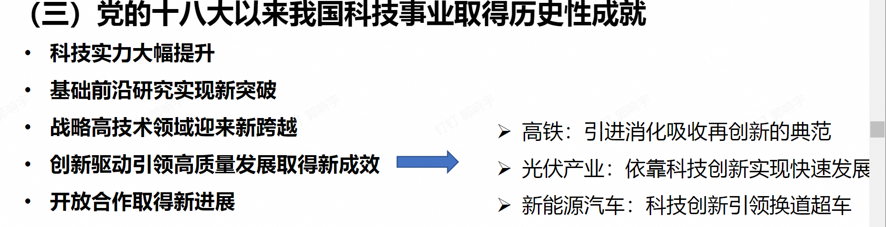

# 形势与政策Ⅰ考前背诵

## 第一讲 浙大传统与我们的责任

> ### 鲜明内涵
>
> 图治、育才、实学

### ==浙大校训==

求是创新

### ==浙大精神==

海纳江河、启真厚德、开物前民、树我邦国

> ### 校歌
>
> 首章：世界观
>
> 中章：认识论和方法论
>
> 末章：价值观和使命

### 浙大传统

PRIDE

爱国奉献、百折不挠、改革创新、服务人民、追求卓越

> ### 浙大使命愿景
>
> #### 办学使命
>
> 以天下为己任、以真理为依归，致力于思想引领和知识创新，培育担当民族复兴大任的时代新人，为中国式现代化和人类文明进步作出卓越贡献
>
> #### 发展愿景
>
> 建设世界一流的综合型、研究型、创新型大学，成为卓越人才培养和汇聚的战略基地、文化传承和交流的重要平台、国家战略科技力量和全球创新高地

## 第三讲 当前国际格局中的国际关系与国家利益

### 国际格局体系的演变

维也纳体系——凡尔赛-华盛顿体系——雅尔塔体系（两极格局）——一超（美国）多强（中国、日本、欧盟、俄罗斯）与多极化

### 当前国际格局的主要特征

三个总体：总体缓和（脆弱性、动态性、变革性同时存在）、总体和平、总体稳定

三个局部：局部紧张、局部战争、局部冲突

三个继续：世界和平、发展潮流继续发展、世界多极化、全球化趋势继续推进、对大多数国家而言，机遇大于挑战的态势继续存在

时代主题明朗化

> 战争与革命——和平与发展，和平发展vs新型冲突

世界格局多极化

> 基本共识是：国际关系具有建设性的多极化进程，有助于建立一个平衡、稳定、民主、不对抗的新秩序，这一趋势客观上符合所有国家的根本利益。

经济贸易全球化

> 全球化vs脱钩断链逆全球化

安全环境复杂化

> 全球性范围：霸权主义、强权政治
>
> 地区性范围：恐怖主义、极端主义、分裂主义

非政府组织的兴起

### 当今时代面临的四大课题

地缘政治局势持续紧张

世界经济复苏乏力

全球治理体系受到冲击

粮食和能源等危机叠加

### 什么是国家利益

> 满足或能够满足国家以生存发展为基础的各方面需要并且对国家在整体上有利的事物，一个国家在经济、政治、军事或文化上的目标和抱负。也指一个国家内有利于其绝大多数居民的共同生活与进一步发展的诸因素的综合。

> #### 层次
>
> 独立与生存、稳定与发展、国际参与
>
> 主权利益：最根本
>
> 发展利益：国际竞争力
>
> 参与利益：制度性舆论性话语权
>
> #### 领域
>
> 政治、经济、文化、社会、安全、外交、军事

### 什么是国际关系

国与国（最主要）、国与国际组织、国际组织与国际组织

> 是政治学的一个分支，研究国际社会之间的外交事务和关系。

> 权力分配：均势、两极、多极

> 国际关系样态
>
> 空间范围：全球性国际关系、地区性国际关系、重要的双边关系
>
> 双边关系，特别是大国之间的双边关系是国际关系中最重要的组成部分。
>
> 中美关系是当今世界最重要的双边关系
>
> 合作、竞争、冲突（对抗）

### 联合国的宗旨

维护国家和平与安全

发展各国之间友好关系

促进国际合作，解决争端问题

作为协调各国行动的中心

> ### 东盟十国
>
> 泰国、马来西亚、印度尼西亚、文莱、新加坡、菲律宾、老挝、缅甸、越南、柬埔寨

> 《区域全面经济伙伴关系协定》（RECP）:中国、日本、韩国、新西兰、澳大利亚、东盟十国，人口最多、经贸规模最大、最具发展潜力的自由贸易区

> ### 美国的两大优势、一大弱点
>
> 1.地缘位置以及在传统军事领域的绝对领先地位；
>
> 2.有吸引全世界人才的良好物质基础、发展环境及激励机制；
>
> 3.缺乏内生的具有明显社会主义/进步主义倾向的改革动力和能力。

### 对非工作四字箴言

真、实、亲、诚

> 中非友好合作精神
>
> 真诚友好、平等相待，互利共赢、共同发展，主持公道、捍卫正义，顺应时势、开放包容

### ==利益分析法==

国家利益是国家对外活动的出发点和归宿。任何国家总是根据自身的利益而行动的。坚决维护国家主权、安全、发展利益是新时代中国外交的出发点和落脚点。

国家利益是主权国家制定和实施对外政策的基本依据，是其对外活动的主要目的。

国家对外政策的实施过程，从现象上看是其对外活动的过程，从本质上看是国家利益实现、维护和扩大与否及其程度如何的过程。

国家间共同的利益是国家合作的基础，利益的对立是国家间分歧、磨擦乃至冲突的根源。

由于各国都以本国利益为最高原则来处理国家之间的关系，因而形成了国家之间复杂的利益关系。

### 中国外交怎样维护国家利益

抓住机遇，果断出击

> 维护国家稳定
>
> 参与全球治理
>
> > 中国参与全球治理面临难得契机
> >
> > 中国积极参与并引领全球治理
> >
> > 中国特色的全球治理观特点鲜明

元首外交，战略引领

核心利益，坚决捍卫

内外有别，有所作为

#### 现阶段我国外交策略

对外与美国巧妙周旋、坚决斗争，争取发展自己的时间；

对内保持清醒头脑，紧紧抓住难得的机遇期，加快发展自己，不断壮大自身实力

### 中国特色外交方略

当前和今后一个时期，在以习近平同志为核心的党中央坚强领导下，中国特色大国外交将以**习近平外交思想**为指导，坚持**维护世界和平、促进共同发展的外交政策宗旨**，致力于推动构建人类命运共同体，全力推进实现民族复兴和促进人类进步的历史征程。

坚持独立自主，推动国际公平正义

坚持拓展全球伙伴关系，深化全方位外交布局

坚持对外开放，推动共同发展

坚持共商共建共享，完善全球治理体系

坚持胸怀天下，构建人类命运共同体

#### 中国外交方针原则

自信自立、开放包容、公道正义、合作共赢

### 大学生应怎样有效维护国家利益

正确全面理解我国的外交方针政策

充分认识国力壮大是维护国家利益的根本保证

大学生应以实际行动维护国家利益

## 第四讲 谱写乡村全面振兴新篇章

### 全面乡村振兴的总要求

要全面学习贯彻党的二十大精神，坚持农业农村优先发展，发扬延安精神和红旗渠精神，巩固拓展脱贫攻坚成果，全面推进乡村振兴，为实现农业农村现代化而不懈奋斗。

### 全面推进乡村振兴的必要性

中国要强，农业必须强

从中华民族伟大复兴战略全局来看，民族要复兴，乡村必振兴

中国共产党成立一百周年全面建成小康社会

新中国成立一百周年建成社会主义现代化国家

2035年基本实现现代化，2050年建成现代化强国

乡村振兴是全面建设现代化国家的历史任务

农业农村现代化是国家现代化的重要组成

### ==全面推进乡村振兴的“三农”工作的重要任务总要求==

产业振兴

> 科技赋能、数字赋能、特色品牌赋能、三产融合赋能、农业现代化转型

人才振兴

> 促进农村专业人才队伍建设
>
> 鼓励社会人才投身乡村建设
>
> 创新农村人才引育使用机制

文化振兴

> 繁荣振兴乡村文化，培育现代农村新风尚
>
> 加强农村思想道德建设，弘扬中华优秀传统文化
>
> 既要体现五千年历史传承的农耕文明，又要彰显与现代工业化、城市化、信息化社会发展相适应的现代文明。

生态振兴

> 生态环境转型：云南洱海
>
> 城郊融合：五生农业
>
> 集聚提升：安吉鲁家村
>
> 村容整治

组织振兴

> 四智融合：自治、法治、德智、智治
>
> 基层治理模式
>
> 主体推动
>
> 合作经营，共富工坊
>
> 公共服务改进

> 八八战略

## 第五讲 海洋强国战略

### 建设海洋强国的重要性

建设海洋强国，是中国特色社会主义事业的重要组成部分

海洋是重要的战略资源

作为战略性资源，海洋既是世界贸易的重要通道，又是解决当今全球人口剧增、资源匮乏、环境恶化等一系列严重挑战人类生存与可持续发展问题的诸多矛盾的重要途径。

1992年联合国环境和发展大会通过的《21世纪议程》指出，海洋不仅是生命支持系统的重要组成部分，而且是可持续发展的宝贵财富。

中国是”陆海兼备“的大国

我国既是陆地大国，也是海洋大国，拥有广泛的海洋战略利益。

### ==海洋强国战略的主要内容==

提高海洋意识

> 陆海统筹的海洋国土意识
>
> 依海富国的海洋经济意识
>
> 与海为善的海洋环保意识
>
> 守海有责的海洋权益意识
>
> 和谐包容的海洋合作意识

坚持陆海统筹

> 一带一路：积极发展与沿线国家的经济合作伙伴关系，共同打造政治互信、经济融合、文化包容的利益共同体、命运共同体和责任共同体。
>
> 中欧班列

发展海洋科技

保护海洋生态

建设强大海军

发展海洋经济

## 第六讲 人类命运共同体

### 人类命运共同体提出的背景

全球性相互依赖促使人类命运紧密相连

> 相互依存是历史大势
>
> 全球性挑战需要全球应对
>
> 新时代呼唤新理念

全球治理体系需要变革和发展

> 现有全球治理体系无法反映国际政治经济发展的现实
>
> 现有全球治理体系无法有效应对当前人类面临的共同挑战

> 一种是重拾冷战思维，挑动分裂对立，制造集团对抗
>
> 一种是从人类共同福祉出发，致力团结合作，倡导开放共赢，践行平等尊重。两种取向、两种选择的博弈和较量，将深刻影响人类和地球的未来。

中国有意愿也有能力为世界作出更大贡献

人类命运共同体的首次提出2012年11月，党的十八大明确提出要倡导“人类命运共同体”意识。

2013年3月23日，国家主席习近平在莫斯科国际关系学院发表演讲，首次在国际社会提出人类命运共同体理念。

### 人类命运共同体理念和内涵

我们全面推进中国特色大国外交，推动构建人类命运共同体，坚定维护国际公平正义，倡导践行
真正的多边主义，旗帜鲜明反对一切霸权主义和强权政治，毫不动摇反对任何单边主义、保护主义、
霸凌行径。我们完善外交总体布局，积极建设覆盖全球的伙伴关系网络，推动构建新型国际关系

坚定奉行独立自主的和平外交政策
坚持在和平共处五项原则基础上
同各国发展友好合作
坚持对外开放的基本国策
坚定奉行互利共赢的开放战略
积极参与全球治理体系改革和建设
践行共商共建共享的全球治理观

#### 特征

开放包容

公平正义

和谐共处

多元互鉴

团结协作

#### ==目标要求==

政治：持久和平

安全：普遍安全

经济：共同繁荣

文明：开放包容

生态：清洁美丽

#### 如何构建人类命运共同体

政治：对话协商，建立平等相待、互商互谅的伙伴关系格局

安全：共建共享，建立公道正义、共建共享的安全格局

> 共同、综合、合作、可持续的安全观

经济：合作共赢，建立开放创新、包容互惠的发展格局

文明：交流互鉴，建立和而不同、兼收并蓄的文明交流格局

生态：绿色低碳，建立尊崇自然、绿色发展的生态格局

> 绿色、低碳、循环、可持续发展之路

#### 内含的治理观

共同命运观

可持续发展观

全球治理观

**习近平外交思想是构建人类命运共同体的行动指南**

#### 思想渊源

中国传统文化渊源

马克思主义共同体哲学阐释

中国共产党的世界情怀

### 推动构建人类命运共同体的中国实践

习近平外交思想是构建人类命运共同体的行动指南

推动全球和平

> 全球安全倡议

推动全球发展

> 全球发展倡议

践行可持续发展

> 支持落实联合国2030年可持续发展议程

提供国际公共产品（一带一路10年）

> 当今世界规模最大的国际合作平台和最受欢迎的国际公共产品
>
> 丝绸之路经济带和21世纪海上丝绸之路

促进文明交流互鉴

共商共建共享原则

> 全球文明倡议
>
> 杭州亚运会
>
> 浙江大学学科会聚计划：亚洲文明研究院

推动全球公共卫生治理

> 浙江大学实践：”一带一路“国际医学院

#### ==五通==

政策沟通、设施联通、贸易畅通、资金融通、民心相通

#### 三同

利益共同体、命运共同体、责任共同体

#### ==一带一路建设成效==

政策沟通取得积极进展

设备联通不断完善

贸易畅通取得卓著成果

资金融通和产能合作取得显著进展

民心相通稳步推进

#### 未来建设“一带一路”可从四个方面发力

一是进一步提升基础设施互联互通对产业合作的促进作用，持续深化和共建国家的产业链供应链合作，共同维护跨国产业链供应链安全。

二是加速推动实施一批“小而美”项目，进一步提升共建“一带一路”对改善当地民生、推动绿色发展等方面的促进作用。

三是在一些已经取得很多成功经验的领域，如跨境投融资、绿色产业园区建设等方面总结形成符合大多数国家利益的新型规则体系，并积极推动其成为国际通行规则。

四是鼓励各级地方政府创新思路参与共建“一带一路”合作，打造一批优质合作品牌

## 第七讲 全面从严治党与反腐败

> ### 腐败的定义
>
> 腐败界定为任何公职人员在任何时候，以实际的或者潜在的行使或者不行使公职人员的职能为交换条件，为自己、他人或者任何机构索要、同意接受或者接受不论何种性质的不正当利益。”

### 腐败的构成要素

主体：公职人员

动机或目的：追逐私人利益

手段：凭借机构或职务上的便利

方式：非规范地运用或滥用公共权力

后果：公共利益或公民利益受到损害

> ### 中国共产党历来重视腐败治理和纪律约束
>
> 纪律建设是我们党创建、发展、壮大的根本保障，也是我们党区别于其他一切政党和派别组织的独特优势和“政治基因”。

### 把握全面从严治党形势任务

推进党的建设的制度化、常态化、系统化安排

把思想统一到党中央对形势的判断上来

> 抓思想从严
>
> 抓治吏从严
>
> 抓管党从严
>
> 抓作风从严
>
> 抓执纪从严
>
> 抓反腐从严

推动党和国家治理体系和治理能力现代化的关键所在

> 全面从严治党为其他三个“全面”引领正确方向
>
> 全面从严治党为其他三个“全面”提供坚强政治保证

破除自我监督难题的有益探索

> 一体推进”三项改革“
>
> ”三不腐“一体推进

把严的主基调长期坚持下去

### 反腐败斗争总体形势

2024.01：反腐败斗争取得压倒性胜利并全面巩固

> 十八大后自上而下全面从严治党，一个节点一个节点抓，一年接着一年干，以一个个具体问题的突破，带动了作风整体转变。

#### ==十八大以来反腐的五大特点==

不因身份、数量而例外

不因行业、领域而止步

不因敏感时期、特殊节点而放松

不因小官小利而轻纵

不因空间、地域而区别

#### ==十八大以来腐败治理的新特点==

不松劲、不歇脚

真追责、敢追责、严追责，持之以恒正风肃气

把权力关进制度的笼子

坚持不敢腐不能腐不想腐一体推进

落实无禁区全覆盖零容忍深入开展

整治群众身边的腐败问题

聚焦政治问题和经济问题交织的腐败案件防止党内形成利益集团

#### 反腐败成效

### 中国当前反腐败的对策

一条主线：二十大精神

一个持之以恒：八项规定、享乐奢靡

一个重中之重

三个防：防反弹回潮、防隐形变异、防疲劳厌战，形式主义、官僚主义

四个问题：层层加码、麻痹松懈、任性用权、不担当不作为

### 中国当前反腐败的启示

正确认识

> 把握三观点看待腐败
>
> 历史的观点
>
> 理性的观点
>
> 实事求是的观点

把好关口

> 常服两剂药
>
> 警钟长鸣、防微杜渐

牢记代价

> 算准七笔账
>
> 政治账、经济账、名誉账、亲情账、家庭账、健康账、自由帐

踏实做人

> 铭记四建议
>
> 时刻注意四类人：名声不好而特别能往你身上贴的人，地位不高可活动能力特别强的人，能力不强但特别想当官的人，收入不多却特别能花钱的人
>
> 时刻提醒自己：大贪源于小利 ，大腐源于小蚀
>
> 在任何时候、任何地点、任何地位均积极争取做到：莫存一分非份之想，莫占一文不义之财；莫拿一件非己之物，莫受一次不情之请
>
> 力争做一个：走在河边永不湿鞋的人、夜半敲门心却不惊的人、一身正气两袖清风的人

## 第八讲 当前我国经济形势与推动经济高质量发展

> ### 我国国民经济运行体系的基本框架（核算体系）
>
> #### 分配角度：
>
> 居民收入、企业利润、财政收入
>
> #### 使用角度：
>
> 总消费、总投资、净出口
>
> #### 生产角度：
>
> 第一产业
>
> 第二产业
>
> 第三产业

> ### 经济形势
>
> 长期：劳动力、资本、资源、结构、制度创新、技术创新
>
> 短期：消费、投资、出口
>
> 克强指数：发电量、铁路的货运量和中长期的银行贷款

### 经济发展的含义

经济发展就是在经济增长的基础上，一个国家或地区经济结构和社会结构持续高级化的创新过程或变化过程。

经济量的增长

经济结构的改进和优化

经济质量的改善和提高

### 新发展理念

创新、协调、绿色、开放、共享

### 我国高质量发展的非凡成就

八个方面的非凡成就

宏观经济运行保持稳中向好

科技创新取得重大突破

现代化产业体系建设取得重要进展

现代化基础设施体系加快构建

如期实现全面小康

城乡区域发展协调性增强

高水平对外开放扎实推进

生态环境保护发生历史性、转折性、全局性变化

### 中国经济的底气与信心

### 为什么能取得这样的成就

在于习近平新时代中国特色社会主义思想的科学指引

在于中国共产党的坚强领导

在于中国特色社会主义制度显著优势

在于全面从严治党提供的坚强政治保证

### 当前我国发展面临的形势：挑战和机遇

#### 国内

国内有效需求不足

市场主体预期偏弱

财政金融风险有所加大

#### 国际环境

世界经济增长分化加剧

颠覆性技术带来的深刻影响

歧视性区域主义加速兴起与扩散

“去风险”政策加剧全球经济脱钩的风险

美国等国家大选年的不确定因素

### 2024年经济工作要坚持

稳中求进、以进促稳、先立后破

### 2024年着眼于九项重点工作

1.以科技创新引领现代化产业体系建设

2.着力扩大国内需求

3.深化重点领域改革

4.扩大高水平对外开放

5.持续防范化解重点领域风险

6.坚持不懈抓好“三农工作”；

7.推动城乡融合、区域协调发展；

8.深入推进生态文明建设和绿色低碳发展；

9.切实保障和改善民生。

### 2024年政府工作任务

1.大力推进现代产业体系建设，加快发展新质生产力；

2.深入实施科教兴国战略，强化高质量发展的基础支撑；

3.着力扩大国内需求，推动经济实现良性循环；

4.坚定不移深化改革，增强发展内生动力；

5.扩大高水平对外开放，促进互利共赢；

6.更好统筹发展和安全，有效防范化解重点领域风险；

7.坚持不懈抓好“三农”工作，扎实推进乡村全面振兴；

8.推动城乡融合和区域协调发展，大力优化经济布局；

9.加强生态文明建设，推进绿色低碳发展；

10.切实保障和改善民生，加强和创新社会治理。

### 扎实推进中国高质量发展

1.加快发展新质生产力

2.深入实施科教兴国战略

3.着力扩大国内需求，推动经济良性循环

4.推动高质量共建“一带一路”走深走实

5.有效防范化解重点领域风险

### ==什么是新质生产力==

创新起主导作用，摆脱传统的经济增长模式，生产力发展路径，具有高科技、高质量、高效能的先进生产力质态

由技术革命性突破、生产要素创新性配置、产业深度转型升级而催生

以劳动者、劳动对象、劳动资料及其优化组合为基本内涵

以全要素生产力大幅提升为核心标志

特点是创新

关键在质优

本质是先进生产力

### ==发展新质生产力的核心要素==

科技创新能够催生新产业、新模式、新动能，是发展新质生产力的核心要素

## 第九讲 坚持总体国家安全观共同维护国家安全

> ### 国家安全的概念
>
> 国家安全是指国家政权、主权、统一和领土完整、人民福祉、经济社会可持续发展和国家其他重大利益相对处于没有危险和不受内外威胁的状态，以及保障持续安全状态的能力。

### 国家安全的重要性

#### 三个问题

前提性问题：国家安全是改革发展的前提

原则性问题：居安思危是治党治国的一个重大原则

现实性问题：国家安全面临风险挑战

党的二十大首次将“推进国家安全体系和能力现代化，坚决维护国家安全和社会稳定”以专章形式写入大会报告，强调“国家安全是民族复兴的根基，社会稳定是国家强盛的前提。必须坚定不移贯彻总体国家安全观，把维护国家安全贯穿党和国家工作各方面全过程，确保国家安全和社会稳定”。

> 2014年4月，习近平在中央国家安全委员会第一次全体会议上首次正式提出“总体国家安全观”

### ==总体国家安全观的基本内涵==

#### 内涵和意义

第二条 国家安全是指国家政权、主权、统一和领土完整、人民福祉、经济社会可持续发展和国家其他重大利益相对处于没有危险和不受内外威胁的状态，以及保障持续安全状态的能力。

#### 路径

第三条 国家安全工作应当坚持总体国家安全观，以人民安全为宗旨，以政治安全为根本，以经济安全为基础，以军事、文化、社会安全为保障，以促进国际安全为依托，维护各领域国家安全，构建国家安全体系，走中国特色国家安全道路。

#### 方法

第八条 维护国家安全，应当与经济社会发展相协调。国家安全工作应当统筹内部安全和外部安全、国土安全和国民安全、传统安全和非传统安全、自身安全和共同安全。

### 总体国家安全观的核心要义和内涵要求

#### 总体国家安全观五大要素

以人民安全为宗旨，以政治安全为根本，以经济安全为基础，以军事、文化、社会安全为保障，以促进国际安全为依托

#### 五个统筹

统筹内部安全和外部安全、国土安全和国民安全、传统安全和非传统安全、自身安全和共同安全

#### 总体国家安全观核心要义集中体现为“十个坚持”

坚持党对国家安全工作的绝对领导

坚持中国特色国家安全道路

坚持以人民安全为宗旨

坚持统筹发展和安全

坚持把政治安全放在首要位置

坚持统筹推进各领域安全

坚持把防范化解国家安全风险摆在突出位置

坚持推进国际共同安全

坚持推进国家安全体系和能力现代化

坚持加强国家安全干部队伍建设

> ### 总体国家安全观的涵盖领域
>
> 总体国家安全观关键在“总体”，突出的是“大安全”理念
>
> 强调“大安全理念“，涵盖诸多领域
>
> 强调”系统思维和方法“，注重解决不平衡不充分问题
>
> 强调国家安全要贯穿党和国家工作各方面全过程，安全
>
> 与发展同样重要
>
> 强调打总体战，形成强大合力

### 大学生应如何维护国家安全

国家安全和利益的自觉维护者

（1）每个学科都是国家安全领域的组成部分，学好本领，每个学生都应该具有知识报国、科技报国的家国情怀和远大理想。

（2）从大局意识上了解把握中央维护国家安全的战略目标、基本原则、重点内容、策略方法等。树立总体国家安全观，维护国家利益和国家安全。

（3）履行公民职责：《国家安全法》第七十七条公民和组织应当履行的维护国家安全的义务

#### 总体国家安全观的基本观点

践行正确义利观，推动构建以合作共赢为核心的新型国际关系

打造人类命运共同体，构建遍布全球的伙伴关系网络

倡导共同、综合、合作、可持续的安全观等理念

> 大学生保密知识应知应会
>
> 强意识、重程序、管终端、控圈子、严纪律、知敬畏

### “全民国家安全教育日”的重要意义

有利于贯彻落实“总体国家安全观”

有利于提高政府和社会公众维护国家安全的法律意识

有利于增强国家安全法普法宣传效果

动员政府和全社会共同参与到维护国家安全的各项工作

> 2024年4月15日是第九个全民国家安全教育日

## 第十章 读懂”国之大者“的深刻内涵

### ==何谓国之大者==

要从历史发展的角度看待“国之大者”

从历史发展的视角来说，“国之大者”在不同历史时期有不同的核心内涵。百年来，始终心怀“国之大者”，是中国共产党带领人民取得百年奋斗伟大历史成就的重要原因。

在我国新民主主义革命时期，最根本的“国之大者”是通过推翻帝国主义、封建主义、官僚资本主义三座大山，实现民族独立和人民解放，建立人民当家作主的中华人民共和国

在社会主义革命和建设时期，最根本的“国之大者”是消灭在中国延续几千年的封建剥削压迫制度，确立社会主义基本制度，推进建设一个社会主义新世界。

在改革开放和社会主义现代化建设时期，最根本的“国之大者”是启动并推进改革开放，开创和发展中国特色社会主义，实现人民生活从温饱不足到总体小康再奔向全面小康的历史性跨越。

在中国特色社会主义新时代，最根本的“国之大者”是统揽伟大斗争、伟大工程、伟大事业、伟大梦想，统筹推进“五位一体”总体布局，协调推进“四个全面”战略布局，实现全面建成小康社会目标，开启全面建设社会主义现代化强国新征程，为实现中华民族伟大复兴中国梦而不懈奋斗。实现中华民族伟大复兴是中国共产党百年奋斗的主题，也是中华民族和中国人民百年奋斗历程中最核心、最突出的“国之大者”

### ==新时代的国之大者——当今的时代格局==

“国之大者”是指关乎党和国家前途、民族命运的大使命、大方向、大格局、大利益、大战略，是党和政府关注的最核心、最关键、最迫切的问题。

价值层面：以人民为中心

理论层面：理论之树常青

实践层面：行胜于言、实干兴邦

国际：当今世界百年未有之大变局

国内：实现中华民族伟大复兴的战略全局

面向世界科技前沿、面向经济主战场、面向国家重大需求，面向人民生命健康

### 服务国之大者的生动实践

“我国高等教育要立足中华民族伟大复兴战略全局和世界百年未有之大变局，心怀“国之大者”，把握大势，敢于担当，善于作为，为服务国家富强、民族复兴、人民幸福贡献力量。 ”——习近平

勇立潮头的时代“弄潮儿”、服务“国之大者”的重要生力军

牢记嘱托 走在前列

廿载奋发 奔竞一流

奋进双一流 建功新时

### 做服务国之大者的先锋力量

心怀“国之大者“要树立远大理想

心怀“国之大者“要练就过硬本领

> 向书本学习、向实践学习、向榜样学习

心怀“国之大者“要勇于担当使命

> 以时不我待的强烈时代责任感，以党的旗帜为旗帜、以党的方向为方向、以党的意志为意志，将个人的发展汇入时代洪流之中。

## 科技创新

### 三个第一 战略 强国

### 历史性成就

