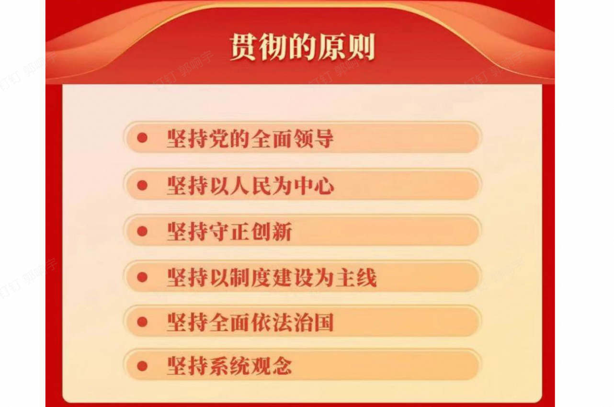

# 新闻

1.中国首次当选联合国教科文组织1970年《公约》缔约国大会主席国  
2.近平在第四次“一带一路”建设工作座谈会上强调
坚定战略自信 勇于担当作为 全面推动共建“一带一路”高质量发展  
3.坚持自立自强 突出应用导向 推动人工智能健康有序发展  
4.中国试射洲际导弹东风-31AG 射程12000公里打破世界记录  

5.神舟十九号航天员乘组圆满完成第一次出舱活动，宋令东成为
我国首名太空出舱“90后”航天员

