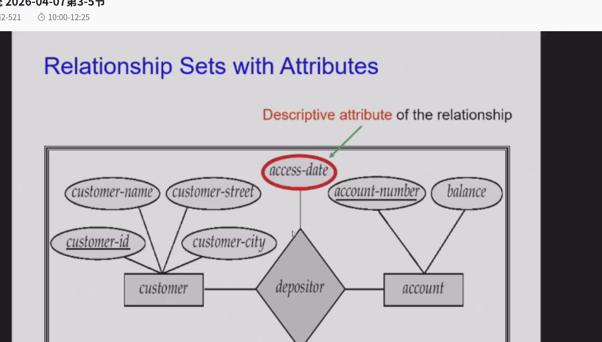
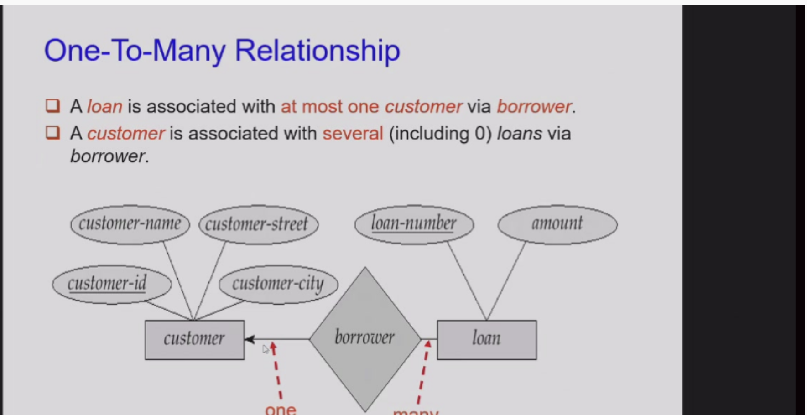
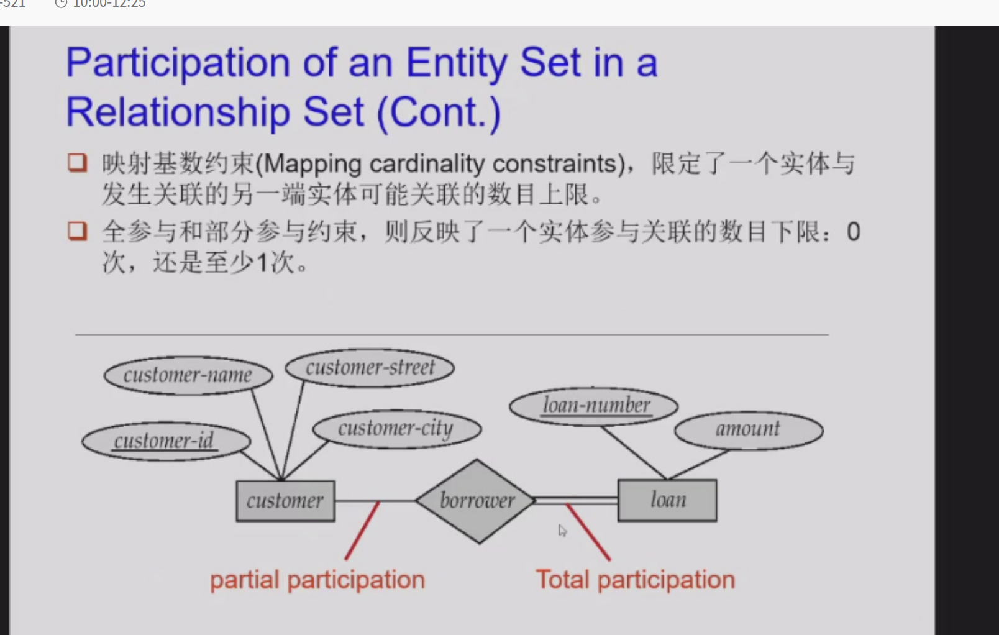
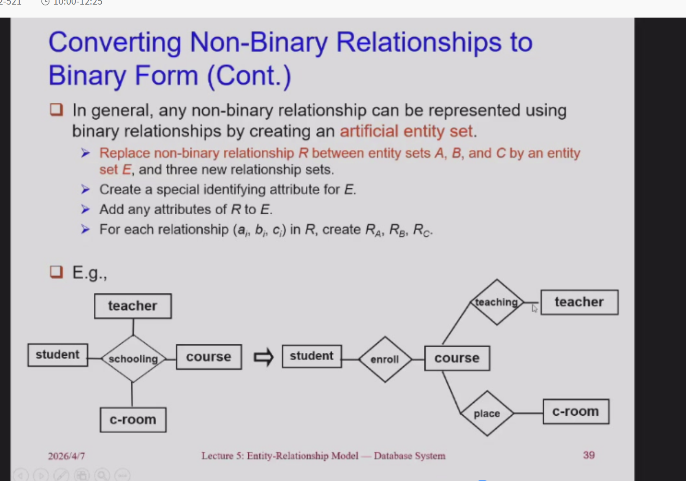
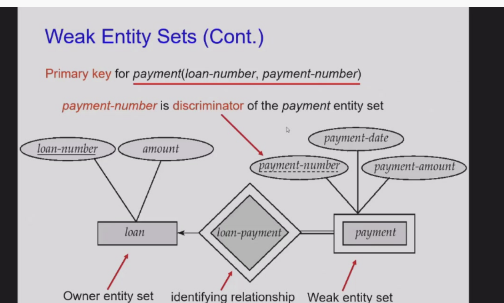
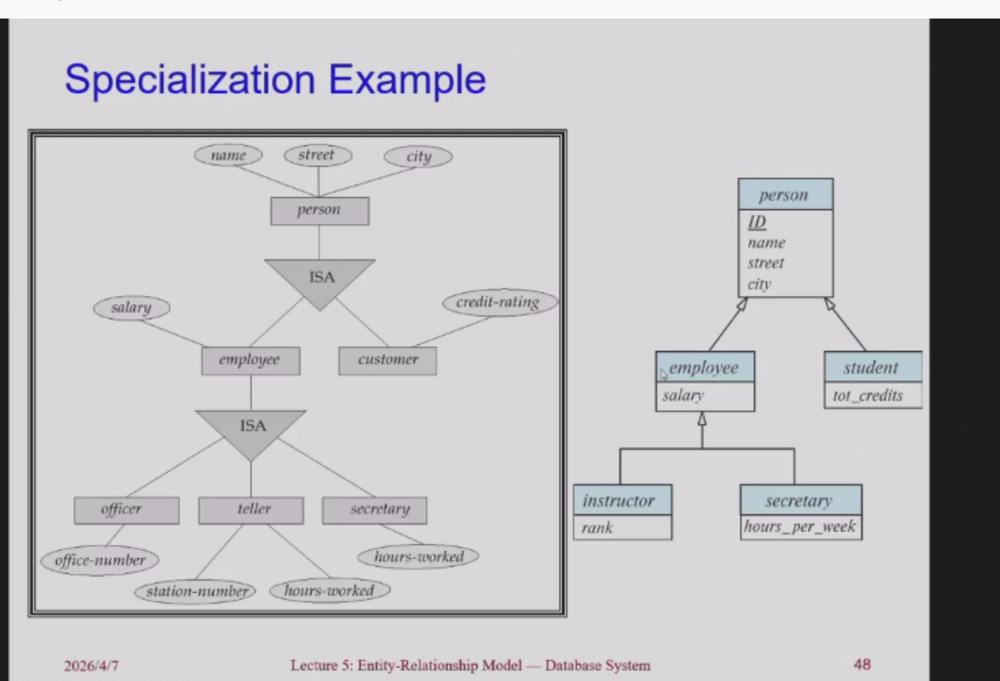
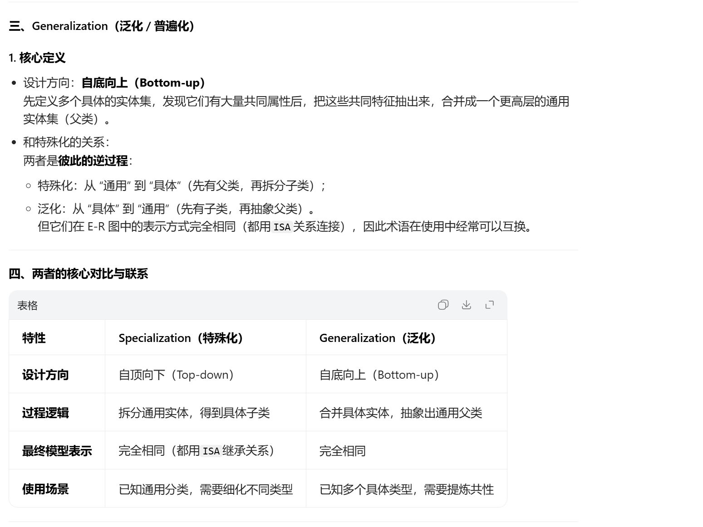

# E-R 模型

## 基础概念

### Entity Sets（实体集）

这张图是在定义**“世界怎么被建模成数据”**，核心概念如下：

1. **核心建模逻辑**：现实世界被抽象为 **实体（Entity）** 的集合，以及实体之间的 **关系（Relationship）**。
2. **实体（Entity）**：
    * 定义：现实中存在且可区分的对象。
    * 分类：可以是具体的（如具体的某棵树、某家公司），也可以是抽象的（如某次活动、某个账户）。
3. **属性（Attributes）**：
    * 实体的描述性质。比如“学生”这个实体，拥有学号、姓名、年龄等属性。
4. **实体集（Entity Set）**：
    * 定义：**同一类型**的所有实体的集合。
    * 关键点：这些实体必须**共享相同的属性**。
    * 例子：所有学生构成一个“学生实体集”，所有贷款构成一个“贷款实体集”。

### Attributes（属性）

这张图是在细化**实体的属性到底有哪些分类和规则**，核心分为三层：

1. **属性与域（Domain）**
    * 每个属性都有取值范围，这个范围叫**域（Domain）**。比如“性别”这个属性的域是 {男, 女}。
2. **属性类型分类（重点）**
    * **简单 vs 复合**：
        * **简单属性**：不可再分，如性别（sex）。
        * **复合属性**：可拆分，如姓名（name）可拆分为姓氏+名字。
    * **单值 vs 多值**：
        * **单值**：一个实体的一个属性只有一个值，如年龄。
        * **多值**：一个实体的某个属性可有多个值，如一个人的电话号码（phone-numbers）。
    * **基属性 vs 派生属性**：
        * **基属性（存储属性）**：直接存储在数据库里，如出生日期。
        * **派生属性**：**不存储，由其他属性计算得出**。如“年龄”，可以通过“当前时间 - 出生日期”算出来，所以叫派生属性。

### 总结

这两张PPT构建了数据库设计的最基本蓝图：**先定义实体集（把同类事物归为一类），再定义属性（描述类的特征，并明确特征的类型与取值规则）**。

## 关系概念

### 1. 核心定义：什么是关系（Relationship）？

*   **通俗理解**：它是**两个或多个不同类实体之间的关联**。
*   **直观例子**：
    *   实体集 `Customer`（客户）和 `loan`（贷款）之间，存在一个叫 `borrower`（借贷）的关系。
    *   具体的联系实例：`Jones`（客户）与 `L-17`（贷款号）建立了“借贷”关系；`Smith` 与 `L-11` 建立了关系。

### 2. 联系集（Relationship Set）是什么？

*   **定义**：**相同类型的所有联系（关系实例）的集合**。
*   **数学本质**：从数学角度看，它是实体集之间的**笛卡尔积的子集**。
    *   公式表达：$\{(e_1, e_2, ..., e_n) \mid e_1 \in E_1, e_2 \in E_2, ..., e_n \in E_n\}$
    *   翻译：每一个联系实例都是一个有序元组，元素分别来自不同的实体集。
*   **举例**：
    *   `borrower` 联系集包含了所有“客户-贷款”的关联元组，如 `(Jones, L-17)`、`(Smith, L-11)` 等。
    *   下方的学生课程例子：`(3032111020, 1, 95)` 是一个联系实例，整个大括号集合就是 `student_course` 联系集。

### 3. 关键逻辑（两张图的递进关系）

*   **第一张图**：定性描述。讲了联系是干嘛的（关联实体），什么是联系集（同类联系的集合）。
*   **第二张图**：定量/数学定义。明确了联系集在数据库中的逻辑存储结构，即它表现为**实体主键的组合**。
    *   比如 `borrower` 联系集在表中就体现为 `(customer-name, loan-number)` 的组合。
    *   这也解释了为什么外键（Foreign Key）在数据库中如此重要——它是用来构建这种“联系”的物理实现。

### 总结

这两张PPT在告诉我们：**数据库不仅要有数据（实体），更要有关系。联系集就是把零散的实体（客户、贷款、学生、课程）串起来的逻辑网络，它是数据库中实现“关联查询”的理论基础。**

这四张PPT讲的是 **ER模型中联系集的两个核心性质**，是数据库设计里用来描述和约束实体关系的关键规则，我们拆成两部分讲明白：

---

## 一、联系集的度（Degree of a Relationship Set）

这部分定义了“一个联系集里，到底有多少个实体集参与”。

### 1. 核心定义

联系集的度 = **参与这个联系集的实体集的数量**。

### 2. 分类与例子

| 类型 | 度 | 说明 | 例子 |
| :--- | :--- | :--- | :--- |
| **二元联系（Binary）** | 2 | 两个实体集参与，是最常见的类型 | 客户 ↔ 账户（`depositor`联系）、学生 ↔ 课程（选课联系） |
| **三元联系（Ternary）** | 3 | 三个实体集参与，场景更复杂 | PPT里的银行例子：`employee`（员工）、`job`（工作）、`branch`（分支）<br>比如“员工Johnson在支行A担任出纳，在支行B担任客户经理”，需要三个实体才能描述完整关系 |
| **更高元（n元）** | ≥4 | 极少使用，因为逻辑太复杂，大部分场景都可以拆成多个二元联系 | 几乎不会在实际设计中用到 |

PPT里也强调了：**三元及以上的联系非常少见，绝大多数业务场景都用二元联系就能解决**。

---

## 二、映射基数（Mapping Cardinalities）

这部分定义了“在联系集中，一个实体最多能和另一个实体集里的多少个实体建立关系”，也就是我们常说的“1:1、1:n、n:m”。

### 1. 核心定义

映射基数描述的是**实体之间的数量对应规则**，主要用在二元联系上。PPT里的中文翻译很直白：
> 一个联系集中，一个实体可以与另一类实体相联系的实体数目（规定“最多一个”还是“多个”）。

注意：基数不要求每个实体都必须有对应关系（比如有些学生没选课、有些课程没人选都是允许的），它只规定“最多能有几个”。

### 2. 四种基础类型（结合图示+例子秒懂）

#### （1）1:1 一对一

- 规则：A里的每个实体，最多对应B里的1个实体；B里的每个实体，也最多对应A里的1个实体。
- 图示（第三张PPT图a）：`a1→b1`、`a3→b3`、`a4→b4`，都是一一对应，`a2`和`b2`可以没有对应关系。
- 例子：国家 ↔ 现任总统。一个国家只能有1个现任总统，一个总统只能属于1个国家。

#### （2）1:n 一对多

- 规则：A里的1个实体，可以对应B里的多个实体；但B里的每个实体，只能对应A里的1个实体。
- 图示（第三张PPT图b）：`a1→b1、b2`，`a3→b4、b5`，`a2`没有对应。
- 例子：班级 ↔ 学生。一个班级可以有多个学生，但一个学生只能属于1个班级。

#### （3）n:1 多对一

- 规则：和1:n反过来，A里的多个实体，可以对应B里的1个实体；但B里的每个实体，只能对应A里的1个实体。
- 图示（第四张PPT图a）：`a1、a2→b1`，`a3→b2`，`a4、a5→b3`。
- 例子：学生 ↔ 班主任。多个学生属于同一个班主任，但一个班主任只能带1个班级。

#### （4）n:m 多对多

- 规则：A里的1个实体，可以对应B里的多个实体；B里的1个实体，也可以对应A里的多个实体。
- 图示（第四张PPT图b）：`a1→b1、b2`，`a2→b1`，`a3→b3、b4`，`a4→b3`。
- 例子：学生 ↔ 课程。一个学生可以选多门课，一门课也可以有多个学生选。

---

## 三、这两个概念的实际作用

它们是数据库设计的“约束规则”，直接决定了你的表结构怎么建：

1.  **联系集的度**：帮你判断联系的复杂度，优先用二元联系，三元联系要谨慎使用（比如员工-工作-分支的例子，很多时候可以拆成两个二元联系：员工-分支、分支-工作）。
2.  **映射基数**：决定了外键和中间表的设计方式：
    - 1:1：可以合并成一张表，或者在其中一张表里加外键（比如总统表里加国家ID）。
    - 1:n：外键加在“多”的那边（比如学生表里加班级ID）。
    - n:m：必须建中间表（也就是联系集的表，比如学生选课表，存学生ID和课程ID）。

举个你之前的图书馆例子：`Borrow`联系是二元联系（度为2），映射基数是`n:m`（一个学生可以借多本书，一本书可以被多个学生在不同时间借），所以我们建了中间表`Borrow`，存`reader_id`和`book_id`，这就是根据基数来设计的。

## 实体集的键（Keys for Entity Sets）

这部分定义了用来**唯一标识实体**的三类“键”，是所有数据库表的基础规则。

### 1. 超键（Super Key）

- **定义**：一个或多个属性的集合，它的值能**唯一确定实体集中的每一个实体**。
- 通俗理解：只要能把“不同实体区分开”的属性组合，都是超键。
- 例子：`customer(cus-num, cus-name, cus-street, cus-city)`
  - `{cus-num}` 是超键（每个客户编号唯一）
  - `{cus-num, cus-name}` 也是超键（因为cus-num已经唯一，加上name还是唯一）
  - `{cus-num, cus-street, cus-city}` 也是超键

### 2. 候选键（Candidate Key）

- **定义**：**最小的超键**——也就是超键中，去掉任何一个属性，就不再是超键了（失去唯一性）。
- 通俗理解：“最精简”的超键，没有多余的属性。
- 例子：上面的customer表中，只有`cus-num`是候选键，因为它是唯一的、不能再拆分的超键。
- 补充：一个实体集可以有多个候选键，比如学生表中，`学号`和`身份证号`都能唯一确定学生，它们都是候选键。

### 3. 主键（Primary Key）

- **定义**：从候选键中，**人为选定的、作为实体的唯一主标识**的键。
- 通俗理解：给实体集选一个“身份证号”，用来在整个数据库中唯一标识它。
- 例子：学生表中，我们通常选`学号`作为主键，而不是身份证号（因为学号在学校系统里更稳定、常用）。

三者的关系：
> 超键 ⊇ 候选键 ⊇ 主键
> 所有候选键都是超键，但只有最小的超键才是候选键；主键是从候选键里选出来的一个。

---

## 联系集的键（Keys for Relationship Sets）

这部分讲的是**联系集如何被唯一标识**，规则和实体集不同，核心是“实体主键的组合”。

### 1. 基础规则：联系集的超键

- **定义**：参与这个联系集的**所有实体集的主键的组合**，构成了联系集的超键。
- 例子：
  - `borrower`联系集（customer ↔ loan）：参与的实体主键是`customer-id`和`loan-number`，所以`(customer-id, loan-number)`是它的超键。
  - `enrolled`选课联系集（student ↔ course）：`(sid, cid)`是超键。
- 原理：联系集的每个元组，本质上就是实体之间的关联，所以用参与实体的主键组合，就能唯一标识这个关联。

### 2. 映射基数对候选键的影响（重点！）

PPT里提到，**决定联系集的候选键时，必须考虑映射基数（1:1/1:n/m:n）**，不同的基数，候选键不一样：

| 映射基数 | 例子 | 候选键 | 原因 |
| :--- | :--- | :--- | :--- |
| **多对多（m:n）** | 学生选课（student ↔ course） | `(sid, cid)` | 一个学生可以选多门课，一门课可以被多个学生选，必须两个主键组合才能唯一标识选课记录 |
| **一对多（1:n）** | 班级-学生（class ↔ student） | `sid`（学生的主键） | 一个学生只能属于一个班级，所以学生的主键就能唯一确定“属于哪个班级”这个联系，不需要加上class-id |
| **一对一（1:1）** | 国家-总统（country ↔ president） | `country-id` 或 `president-id` | 一个国家只有一个总统，一个总统只属于一个国家，双方的主键都能唯一确定联系，都是候选键，选一个作为主键即可 |

### 3. 主键的选择原则

- 如果有多个候选键（比如1:1的情况），要根据联系集的语义来选主键：
  - 优先选**非空、值稳定不变**的属性（比如不要选会频繁变化的属性，避免主键更新）。
  - 比如总统会换届，所以通常不会用`president-id`作为主键，而是用`country-id`。

---

## 三、结合你之前的图书馆例子，串起来理解

比如你之前的图书馆系统：

- **实体集`Reader`**：主键是`reader-id`（候选键、超键）。
- **实体集`Book`**：主键是`book-id`（候选键、超键）。
- **联系集`Borrow`**：
  - 映射基数是`m:n`（一个读者可以借多本书，一本书可以被多个读者借）。
  - 如果没有`borrow-date`属性，超键是`(reader-id, book-id)`，也是候选键，作为主键。
  - 如果加上`borrow-date`（同一个读者同一本书可以借多次），超键变成`(reader-id, book-id, borrow-date)`，这时候才是候选键，因为必须加上日期才能唯一标识每次借阅记录。

---

## E-R图

这几张PPT是 **E-R图（实体-关系图）的“标准画法与语义规则”**，是数据库设计中**可视化表达**的核心。它们把你之前学的所有概念（实体、属性、关系、键、基数）都浓缩成了一套统一的图形语言。

我帮你把每张图的核心信息逐张拆解：

---

### E-R Diagram（基础符号规则）

这张图是**E-R图的“字典”**，规定了每个图形代表什么。

*   **矩形 (Rectangle)** 👉 **实体集 (Entity Set)**
    *   例：`customer` (客户)、`loan` (贷款)。
*   **菱形 (Diamond)** 👉 **联系集 (Relationship Set)**
    *   例：`borrower` (借贷关系)。
*   **椭圆 (Ellipse)** 👉 **属性 (Attribute)**
    *   例：`customer-id`、`amount`。
    *   **下划线**：表示**主键 (Primary Key)**。
*   **连接线 (Lines)** 👉 连接属性到实体，实体到联系。

---

### E-R Diagram With Attributes（属性类型的详细画法）

这张图把**属性的分类**用图标的形式展示得淋漓尽致：

*   **复合属性 (Composite Attribute)** —— **树状结构**
    *   例：`name` (拆分为 `first-name`, `middle-initial`, `last-name`)；`address` (拆分为 `street`, `city` 等)。
    *   表示方法：一个大椭圆包含子椭圆。
*   **多值属性 (Multivalued Attribute)** —— **双椭圆 (Double ellipse)**
    *   例：`phone-number`。
    *   表示方法：双线框椭圆。
*   **派生属性 (Derived Attribute)** —— **虚线椭圆 (Dashed ellipse)**
    *   例：`age` (由 `date-of-birth` 计算得出)。
    *   表示方法：虚线椭圆。
*   **单值/基本属性** —— **单椭圆 (Solid ellipse)**
    *   例：`customer-id`、`date-of-birth`。

---

### Relationship Sets with Attributes（带属性的联系集）

这张图补充了之前的疑问：**联系集也可以有自己的属性**。

*   **核心规则**：
    *   菱形（联系）除了连接实体，也可以直接连属性椭圆。
    *   例：`depositor` (存款) 联系拥有属性 `access-date` (访问日期)。
*   **语义**：
    *   `access-date` 既不属于客户，也不属于账户，它是**“客户-账户”这次关联行为**的属性。

---



### Recursive Relationship（自环联系 / 递归关系）

这张图讲的是**E-R图的高级语义**，解决了“实体和自身发生关系”的问题。

*   **自环联系 (Recursive Relationship Set)**：
    *   同一个实体集可以参与同一个联系集。
    *   例：`employee` (员工) 和 `works-for` (隶属/管理关系)。
*   **角色 (Role)**：
    *   为了区分同一个实体在联系中的不同身份，用 **role labels** (角色标签)。
    *   例：
        *   `manager` (管理者)：员工A 是 员工B 的上司。
        *   `worker` (下属)：员工B 受 员工A 管理。
    *   **作用**：避免混淆，明确语义。

---

### Express the Cardinality Constraints（基数约束的画法）

这里说的都是二元的联系。

这是**最核心、最实用**的规则！用来在图上表示“1:1、1:n、n:m”。

*   **符号规则**：
    *   **有向线 (Directed line, $\rightarrow$)** 👉 表示 **"One" (最多一个)**。
    *   **无向线 (Undirected line, —)** 👉 表示 **"Many" (多个)**。
*   **读法口诀**：
    *   **指向谁，谁就是“1”；不指向，就是“多”。**
*   **实战应用（结合之前的基数）**：
    *   **1:1 (一对一)**：A -> B，且 B -> A。
    *   **1:n (一对多)**：A -> B，B — A。
        *   解释：A 指向 B (1)，表示A的一个实体对应B的1个；B 不指向 A (多)，表示B的一个实体对应A的多个。
    *   **n:m (多对多)**：A — B，且 B — A。
        *   解释：双方都是多，意味着A的一个实体对应B的多个，反之亦然。

---



### 总结（这几张PPT的逻辑闭环）

这几张图把E-R图从“基础定义”讲到了“高级语义”：

1. **基础**：先画实体、画关系、画属性（图1）。
2. **细化**：分清属性是复合的、多值的还是派生的（图2）。
3. **扩展**：关系自己也可以有属性（图3）。
4. **进阶**：同一个实体可以自己和自己玩（自环），需要用Role区分（图4）。
5. **约束**：最后用箭头/无箭头规则，严格规定实体之间的映射数量（图5）。

这张PPT讲的是 **实体集在联系集中的“参与性约束”**，也就是规定了“实体能不能独立存在，是否必须和其他实体建立关联”，是数据库设计里的核心业务约束之一。

我们把两个概念彻底拆透，结合例子和业务逻辑帮你理解：

---

## 核心概念：两种参与性

### 1. 全参与（Total Participation，强制参与）

- **定义**：实体集中的**每一个实体**，都必须至少参与联系集中的一个关系，不存在“不关联的实体”。
- **符号**：E-R图中用**双线**表示（实体集到联系集的连线是双线）。
- **业务逻辑**：实体**依赖联系存在**，没有其他实体就无法独立存在。
- **PPT例子**：`loan`（贷款）在`borrower`（借贷）联系中是全参与。
  - 解释：业务上不存在“没有客户的贷款”，每一笔贷款都必须由某个客户申请，因此所有`loan`实体都必须出现在`borrower`联系中，必须和`customer`关联。

### 2. 部分参与（Partial Participation，可选参与）

- **定义**：实体集中的**部分实体**可以不参与联系集中的任何关系，存在“不关联的实体”。
- **符号**：E-R图中用**单线**表示（实体集到联系集的连线是单线）。
- **业务逻辑**：实体可以独立存在，不需要依赖联系。
- **PPT例子**：`customer`（客户）在`borrower`联系中是部分参与。
  - 解释：客户可以只是开户，从未申请过任何贷款，因此不是所有`customer`实体都必须出现在`borrower`联系中，客户可以没有贷款记录。

---



### 参与性 vs 映射基数

很多人会混淆这两个概念，其实它们是完全不同的约束：
| 概念 | 核心问题 | 业务含义 |
| :--- | :--- | :--- |
| **映射基数（Cardinality）** | 最多能关联几个？ | 规定“一个实体最多能和多少个其他实体建立联系”（比如1个客户最多能有5笔贷款）。 |
| **参与性（Participation）** | 最少必须关联几个？ | 规定“一个实体最少必须和多少个其他实体建立联系”：<br>全参与=最少1个<br>部分参与=最少0个 |

举个例子：

- 班级和学生的联系中：
  - 映射基数：1个班级最多有50个学生（1:n）。
  - 参与性：每个学生最少必须属于1个班级（全参与），班级可以暂时没有学生（部分参与）。

---

### 业务落地：数据库里的实现

参与性约束最终会转化为数据库的字段约束：

- **全参与**：对应的外键列必须设置为`NOT NULL`（非空）。
  - 比如`loan`表的`customer_id`必须非空，因为每笔贷款必须有客户。
- **部分参与**：实体集不需要依赖联系存在，因此对应的外键列可以为空，或者不需要设置外键。
  - 比如`customer`表不需要有`loan_id`字段，客户可以没有贷款记录。

---



### 一句话总结

- **全参与**：实体“不能独活”，必须和其他实体绑定，E-R图用双线。
- **部分参与**：实体“可以独活”，不一定需要关联，E-R图用单线。

这里要多去ppt看图

## 拆分非二元关系

这两张PPT讲的是 **数据库设计中最关键的工程技巧**：**如何把复杂的非二元关系（三元、四元等）拆成简单的二元关系**。

### 为什么要拆？（二元 vs 非二元）

#### 1. 什么是二元/非二元？

- **二元关系 (Binary)**：只涉及 **2个** 实体集。
  - 例：`father(父亲, 孩子)`。
- **非二元关系 (Non-Binary)**：涉及 **≥3个** 实体集。
  - 例：`parents(父亲, 母亲, 孩子)`（三元关系）。

#### 2. 为什么要拆？（核心！）

PPT 给出了经典例子：**亲子关系 (parents)**。

- **如果不拆（三元关系）**：
  - 定义：`parents(he, she, child)`。
  - 限制：**必须同时知道** 父亲、母亲、孩子。
  - 业务缺陷：如果只知道孩子和母亲，不知道父亲，这条记录就**无法插入**，因为父亲是“空”的。
- **拆成二元关系后**：
  - 定义：`father(父亲, 孩子)` 和 `mother(母亲, 孩子)`。
  - 优势：
    1. **灵活**：可以只描述“父子”关系，也可以只描述“母子”关系。
    2. **支持缺失**：孩子可能只有父亲没有母亲（或者反过来），数据库允许存在。

#### 3. 结论

- **大部分“看似非二元”的关系，本质上是可以还原成二元关系的。**
- 例外：**天然的非二元关系**（如 `works-on(employee, branch, job)` 员工在分支做某工作），这种关系描述的是一种“三位一体”的状态，很难单纯拆成两个二元关系，通常保留原结构或拆成实体。

---

### 怎么拆？（通用转化法则）

这是这组PPT最硬核的**通用算法**，不管是3个实体还是100个实体，规则通用。

#### 核心思想：

**把“关系”变成“实体”（实体化 / Entityification）。**

*   原来的非二元关系 $R$，变成一个新的 **人工实体 (Artificial Entity Set, E)**。
*   原来的实体 $A, B, C$ 变成新实体 $E$ 的附属关系。

#### 具体步骤（算法）：

假设有一个三元关系 $R$ 连接实体 $A, B, C$。
要把它拆成二元关系，做 **4步**：

1. **造新实体 (E)**：
    *   把关系 $R$ 本身变成一张表（实体 $E$）。
2. **加标识 (ID)**：
    *   给新实体 $E$ 加一个主键属性（比如 $E\_id$）。
3. **移属性**：
    *   把原来属于关系 $R$ 的所有属性，都移到新实体 $E$ 上。
4. **建关系**：
    *   分别建立 $R_A$ ($A$ 联系 $E$)、$R_B$ ($B$ 联系 $E$)、$R_C$ ($C$ 联系 $E$)。

#### 看图理解（第三张PPT）：

左边是原始图：$A$、$B$、$C$ 直接连菱形 $R$。
右边是转换后：

*   中间多了一个红色方块 **E**（新实体）。
*   $A$ -> $E$ (关系 $R_A$)。
*   $B$ -> $E$ (关系 $R_B$)。
*   $C$ -> $E$ (关系 $R_C$)。

**最终效果（落地到数据库）：**
| 原始结构 (非二元) | 转换后结构 (二元/实体化) |
| :--- | :--- |
| **表 R** (包含 A_id, B_id, C_id, R属性) | **表 E** (新实体，含 E_id, A_id, B_id, C_id, R属性)<br>**表 A** (原实体)<br>**表 B** (原实体)<br>**表 C** (原实体) |

---

### 三、用具体例子让你秒懂

假设银行有个三元关系 `supplies(employee, branch, part)` —— 员工在分支提供零件。
**按规则转化：**

1. **关系变实体**：把 `supplies` 变成一个新实体 `Supply_Record`（供货记录）。
2. **加ID**：`record_id`。
3. **移属性**：如果有“供货数量”、“供货日期”，这些属性移到 `Supply_Record`。
4. **建二元关系**：
    *   `employee` 1 -- n `Supply_Record`（一个员工可以提供多次记录）。
    *   `branch` 1 -- n `Supply_Record`（一个分支有多个供货记录）。
    *   `part` 1 -- n `Supply_Record`（一个零件出现在多个记录里）。

**转化后的 SQL 表结构：**

```sql
-- 原实体 (不变)
TABLE employee (id, name);
TABLE branch (id, name);
TABLE part (id, name);

-- 新实体 (原来的关系变成了表)
TABLE Supply_Record (
    record_id PK,
    employee_id FK, -- 对应原来的employee
    branch_id FK,  -- 对应原来的branch
    part_id FK,    -- 对应原来的part
    supply_date,   -- 原来关系的属性
    quantity       -- 原来关系的属性
);
```

### 四、一句话总结

这两张PPT在教你：

1. **看语义**：如果关系里的实体能独立分开描述（如父子、母子），就**拆成二元关系**，这样数据库更灵活。
2. **万能方法**：如果必须保留，就**把关系拆出来做成一张独立的中间表（实体化）**，让所有实体都和这张表建立二元关系（1:n）。

## 弱实体集

---

### 一、第一张图：什么是弱实体集？

#### 1. 核心定义

> **没有主键 (Primary Key) 的实体集，称为弱实体集。**

#### 2. 你的例子：`payment` (还款记录)

*   **业务场景**：一笔贷款（`loan`）可以有多次还款记录。
*   **编号问题**：`pay-num`（还款编号）是按“每笔贷款”单独从 1 开始编的（比如贷款 L-101 的第 1 次还款，贷款 L-102 的第 1 次还款）。
*   **致命缺陷**：
    *   `pay-num` 不能全局唯一。
    *   单独看 `payment` 表，`(L-101, 1)` 和 `(L-102, 1)` 这两条记录，主键是不唯一的。
*   **结论**：
    *   `payment` 自己没有全局主键，**无法独立存在**，它必须依赖“具体的某笔贷款”才能唯一标识自己。
    *   所以，`payment` 是 **弱实体集**。
    *   `pay-num` 叫 **分辨符 (Discriminator)** 或 **部分码 (Partial Key)** —— 它只能在“同一个贷款”内部区分不同还款记录，不能全局区分。

---

### 二、第二张图：三大硬性特征（必须记住）

弱实体集必须满足三个条件，否则就不是弱实体：

#### 1. 依赖存在 (Dependent Existence)

*   **定义**：弱实体的存在**依赖**于属主实体（Identifying Entity）。
*   **例子**：没有 `loan`，就没有 `payment`。还款记录必须挂在某笔贷款下。
*   **符号**：E-R 图中，弱实体用 **双矩形** 表示（第一张图里的 red box）。

#### 2. 一对多联系 (Total, One-to-Many)

*   **定义**：弱实体必须通过一个 **全参与 (Total)** 的 **一对多 (1:N)** 关系连接到属主实体。
*   **解释**：
    *   一个 `loan` (强实体) 可以有多个 `payment` (弱实体)。
    *   每一个 `payment` 必须属于且仅属于一个 `loan`。
*   **关系**：这个连接两者的关系叫 **标识性联系 (Identifying Relationship)**。

#### 3. 标识性联系 (Identifying Relationship)

*   **定义**：连接强实体与弱实体的那条关系线。
*   **符号**：E-R 图中用 **双菱形** 表示（第一张图里的? 应该是双菱形）。

---

### 三、第三张图：主键怎么定？（核心难点）

弱实体虽然没有自己的独立主键，但它**在数据库里必须有主键**，怎么生成？

#### 1. 规则：主键 = 属主主键 + 分辨符

> **Weak Entity PK = PK of Strong Entity + Discriminator**

#### 2. 结合你的例子

*   **属主实体 (`loan`) 的主键**：`loan-number` (L-101)。
*   **弱实体 (`payment`) 的分辨符**：`pay-num` (1, 2, 3...)。
*   **`payment` 的最终主键**：**`(loan-number, pay-num)`**。
    *   例如：`(L-101, 1)`、`(L-101, 2)`、`(L-102, 1)`。
    *   这样组合起来，全局唯一！

#### 3. 分辨符 (Discriminator) 的作用

它就是弱实体里那个**“不够独立”的属性**（比如 pay-num），它只能区分“同一个父亲”下的孩子，不能区分“全世界”的孩子。

---

### 四、第四张图：落地与注意事项（为什么不存 Loan-number？）

这是最容易犯错的地方，PPT 讲的是**存储冗余**问题。

#### 1. 不要显式存储属主主键

*   **理论上**：`payment` 表不需要存 `loan-number`，因为通过“标识性联系”，我们知道 `payment` 一定属于哪个 `loan`。
*   **物理实现**：
    *   在 ER 图里不画出来。
    *   在数据库表设计中，**逻辑上**通过外键关联，**物理上**不需要冗余存储属主主键（或者说通过联系隐含）。

#### 2. 为什么不直接存 `loan-number` 让它变强实体？

PPT 给了一个非常棒的理由：**数据冗余与逻辑重复**。

*   **如果强行存**：
    *   给 `payment` 加 `loan-number` 字段。
    *   这样 `payment` 就有了自己的主键（比如 `pay-id` 或 `loan-number+pay-num`），它就变成**强实体**了。
*   **后果**：
    *   数据重复。
    *   我们有两条“关系”：
        1.  **显式关系**：通过 `payment.loan-number` 指向 `loan`。
        2.  **隐式关系**：通过“标识性联系”建立的父子依赖。
    *   **这会导致数据不一致的风险**（更新异常）。

#### 3. 总结

**弱实体的精髓在于：**
我不存你的主键，我只用一条线（标识性联系）把你“挂”在我身上，我的主键由你的主键加上我的分辨符共同组成，这样数据结构最干净，没有冗余。

---

### 五、一句话总结

这几张PPT在教你：
**当一个实体“自己没有全局主键”，且“必须依附于另一个实体才能存在”时，它就是弱实体。**

*   **表现**：双矩形（弱实体） + 双菱形（标识关系）。
*   **主键**：父表主键 + 自身编号。
*   **目的**：保持数据干净，避免冗余。



## 具象化/泛化

这几张PPT讲的是 **扩展ER模型（Extended E-R features）里的「特化（Specialization，也叫具体化/继承）」**，是ER模型用来描述**实体之间“是一个（IS-A）”层级关系**的特性，和面向对象编程里的“继承”概念几乎是一一对应的。

---

### 一、核心定义：什么是特化（Specialization）？

特化是一种**自顶向下的设计方法**，用来处理实体的分层结构：

1.  **过程**：从一个通用的「高层实体集」，分出有区别的「低层实体集（子类）」。
2.  **关键特性：属性继承（Attribute Inheritance）**
    所有低层实体集，会自动继承父类的**全部属性**，以及父类参与的所有关系，同时可以拥有自己独有的属性或参与不同的关系。

3.  **本质**：描述「IS-A（是一个）」的关系，比如“员工是一个人”“客户是一个人”。

---

### 二、用例子拆解：Person的分层结构

PPT里的`Person`例子，完美演示了特化的用法：

#### 1. 第一层：通用父类 `Person`（人）

- 作为最高层的通用实体，拥有所有“人”共有的属性：`name`（姓名）、`street`（街道）、`city`（城市）。
- 它不区分你是员工还是客户，只描述“人”的通用特征。

#### 2. 第一次特化：分出子类 `Employee` 和 `Customer`

- `Employee`（员工）：
  - 继承了`Person`的所有属性（name/street/city）。
  - 新增了自己独有的属性：`salary`（工资）。
- `Customer`（客户）：
  - 继承了`Person`的所有属性。
  - 新增了自己独有的属性：`credit-rating`（信用评级）。
- 关系：`Employee IS-A Person`，`Customer IS-A Person`（员工/客户都是人）。

#### 3. 第二次特化：对`Employee`再细分

- `Employee`作为父类，又分出了`Officer`（主管）、`Teller`（柜员）、`Secretary`（秘书）三个子类：
  - `Officer`：继承了`Employee`（以及`Person`）的所有属性，新增`office-number`（办公室号）。
  - `Teller`：新增`station-number`（工位号）。
  - `Secretary`：新增`hours-worked`（工作时长）。
- 右边的UML类图，也对应了这个层级结构：`Person` → `Employee` → `Instructor/Secretary`，每个子类都继承父类，同时加自己的属性。

---

### 三、为什么要用特化？解决了什么问题？

如果不用特化，直接把所有属性都放到`Person`里，会出现两个问题：

1.  **数据冗余与空值泛滥**：
    客户没有`salary`，员工没有`credit-rating`，如果都放`Person`里，会有大量字段为空，既不规范也浪费空间。

2.  **逻辑不清晰**：无法区分“员工”和“客户”的不同特征，业务逻辑混在一起。

特化完美解决了这些问题：

- 通用属性放父类，避免重复定义。
- 特殊属性放子类，每个实体只需要自己的属性，没有冗余空值。
- 层级清晰，业务含义一目了然。

---

### 四、关键补充：特化 vs 泛化（Generalization）

你可能会在教材里看到“泛化”这个词，它和特化是同一个概念的正反两面：

- **特化（Specialization）**：自顶向下，从通用到特殊（比如先有`Person`，再分`Employee`/`Customer`）。
- **泛化（Generalization）**：自底向上，从特殊到通用（比如先有`Employee`/`Customer`，再抽象出共同的父类`Person`）。
两者最终的模型结构是一样的，只是设计思路不同。

---





## 具象化/泛化约束

这两页PPT是数据库**扩展实体-关系模型（EER）**中，针对**特化/泛化（Specialization/Generalization）关系**的三大核心设计约束，用来明确父类实体和子类实体之间的成员规则，避免数据模型出现逻辑歧义或漏洞。

我帮你分模块拆解清楚，结合PPT里的例子和图示：

---

## 一、先搞懂背景：这些约束管什么？

在EER模型里，我们用`ISA`（is-a）关系表示“子类继承父类”（比如`储蓄账户ISA账户`、`员工ISA人`），但只画`ISA`关系还不够严谨——我们需要明确：

- 父类实体怎么划分到子类里？
- 一个实体能不能同时属于多个子类？
- 父类的所有实体都必须属于某个子类吗？

这些问题，就是这几类约束要解决的。

---

## 二、第一类：成员定义约束（实体如何被分配到子类）

规定了“父类实体如何被划分到子类中”，分为两种方式：

1.  **条件定义（Condition-defined）**
    - 规则：子类的成员资格由一个**明确的条件自动决定**，只要满足条件，就自动属于这个子类。
    - PPT例子：
      - “所有65岁以上的客户，自动属于老年公民子类”；
      - “账户类型为‘储蓄账户’的，自动属于`Saving-account`子类”。
    - 特点：规则客观、可自动执行，数据满足条件就会被自动归类。
2.  **用户自定义（User-defined）**
    - 规则：子类的成员资格不由固定条件决定，而是由用户手动指定。
    - PPT例子：“员工被分配到不同的团队（teams）”，不是由员工的某个属性（比如职位、部门）自动决定，而是人工分配的。
    - 特点：规则更灵活，但需要人工维护，无法自动判断。

---

## 三、第二类：不交/重叠约束（一个实体能不能属于多个子类）

这是最核心的约束之一，规定了父类实体和子类的成员关系是否互斥：

1.  **不交（Disjoint，互斥）**
    - 规则：一个父类实体，**最多只能属于一个子类**，不能同时属于多个子类。
    - PPT例子：`account`（账户）分为`Saving-account`（储蓄账户）和`checking-account`（支票账户），一个账户要么是储蓄账户，要么是支票账户，不能同时是两者。
    - 图示标记：E-R图里会在`ISA`三角形旁边标上`disjoint`（或`Disj`）来表示。
2.  **重叠（Overlapping，可交叉）**
    - 规则：一个父类实体，**可以同时属于多个子类**。
    - PPT例子：`person`（人）分为`customer`（客户）和`employee`（员工），一个人可以既是公司的员工，又是公司的客户（比如员工自己开了账户），所以可以同时属于两个子类。

---

## 四、第三类：完全性约束（父类实体是不是必须属于某个子类）

规定了父类的实体，是否必须被划分到至少一个子类中：

1.  **完全泛化（Total Completeness）**
    - 规则：父类的每一个实体，**都必须属于某个子类**，没有“游离在所有子类之外”的父类实体。
    - PPT例子：`account`（账户）分为储蓄账户和支票账户，所有账户都必须是其中一种，不存在既不是储蓄也不是支票的账户。
    - 图示标记：E-R图里会在`ISA`三角形的上方画**双横线**来表示（PPT里的图例标了双横线）。
2.  **部分泛化（Partial Completeness）**
    - 规则：父类的实体，**可以不属于任何子类**，允许存在“通用的父类实体”。
    - PPT例子：`person`（人）分为客户和员工，但一个人可以既不是客户，也不是员工（比如只是路过的访客），所以不需要属于任何子类。
    - 图示标记：`ISA`三角形上方是**单横线**（默认，不用特殊标记）。

---

## 五、组合约束：PPT里的两个典型例子

PPT里的两个图示，其实是两种最常见的约束组合：
| 例子 | 约束组合 | 业务逻辑 |
|------|----------|----------|
| `account` | 不交 + 完全 | 一个账户不能同时是储蓄/支票账户，且所有账户都必须属于其中一种 |
| `person` | 重叠 + 部分 | 一个人可以同时是客户+员工，也可以既不是客户也不是员工 |

---

## 六、为什么要这些约束？

这些约束不是形式主义，而是为了：

1.  **保证数据一致性**：比如不交约束避免了“一个账户同时是两种类型”的逻辑矛盾；
2.  **明确业务规则**：比如完全性约束规定了“所有账户都必须有类型”，符合银行的业务逻辑；
3.  **减少歧义**：让后续设计数据库表、写SQL的时候，不用再纠结“一个实体能不能属于多个子类”这种问题。

这几页PPT在讲 **扩展E-R模型（EER）中的「聚合（Aggregation）」**，它是一种解决“关系与关系之间无法直接建立联系”的抽象机制，我们结合例子一步步拆解清楚：

---

## 七、聚合（Aggregation）

### 一、先搞懂背景：传统E-R模型的局限

在基础E-R模型里，只有**实体（Entity，比如员工、部门）**才能和**关系（Relationship，菱形表示）**连接，而**关系本身不能作为另一个关系的参与者**。但现实业务中，我们经常需要给“关系”再建立新的关系，比如例子里的场景：

- 员工在部门做工作（`works-on`关系），现在要给这个“员工+部门+工作”的组合，再关联一个负责的经理（`manages`关系）
- 直接给`manages`关系重复连接实体，会导致数据冗余、逻辑混乱，所以需要聚合来解决这个问题。

---

### 二、例子中的业务场景 & 原来的设计问题

#### 1. 基础业务（无聚合的设计）

- 实体：`employee`（员工）、`job`（工作）、`branch`（部门/分支）
- 三元关系 `works-on`：表示「某个员工在某个部门负责某个工作」（比如“张三在技术部负责开发任务”）

#### 2. 新增需求：给任务关联经理

我们需要记录：**“这个由员工在部门负责的工作，由哪个经理管理”**，也就是给`works-on`这个关系实例，再关联一个`manager`。

#### 3. 原来的错误设计（第一张PPT的图）

直接加了一个新的三元关系`manages`，连接`employee`、`branch`、`manager`，这就出现了严重问题：

- **信息重叠 & 冗余**：`works-on`和`manages`都用到了`employee`和`branch`，重复存储了相同的员工-部门关联
- **逻辑不清晰**：`manages`没有和`job`关联，无法区分“同一个员工在同一个部门的不同工作”对应的不同经理（比如张三在技术部同时负责开发和测试，两个任务的经理可能不同，但原来的设计无法体现）
- **无法删除基础关系**：不是所有`works-on`的任务都有经理（比如临时任务没人管），所以必须保留`works-on`，导致两个关系都要维护，冗余严重

---

### 三、聚合的核心思想：把关系当作“抽象实体”

聚合（Aggregation）的本质，就是**将一个关系（或多个实体的组合）视为一个「抽象实体」**，让这个“抽象实体”可以像普通实体一样，参与到其他关系中。

#### 聚合的解决方案（第三张PPT的图）

1. **打包基础关系**：用一个方框，把`works-on`关系和它连接的`employee`、`job`、`branch`整体“打包”，形成一个**复合实体集**（PPT里标了“复合实体集”）
2. **建立新关系**：让这个“打包后的抽象实体”，和`manager`建立新的二元关系`manages`

#### 这样设计的优势：

- **逻辑清晰**：`manages`直接关联到「员工+部门+工作」这个组合，明确对应每个具体任务的经理，不会混淆
- **消除冗余**：不需要重复连接`employee`和`branch`，只需要和聚合后的整体关联，复用了`works-on`的逻辑
- **灵活兼容**：`works-on`依然存在，处理没有经理的任务；`manages`只处理有经理的任务，两者各司其职，没有冗余

---

### 四、聚合的关键特点 & 表示方法

- **核心本质**：关系也是一种“实体”，可以参与其他关系，打破了基础E-R模型中“只有实体能参与关系”的限制
- **E-R图表示**：用方框把要聚合的关系和它的实体包起来，作为一个整体，再和新的关系连接（就像第三张PPT里的方框）
- **和其他抽象的区别**：聚合和特化/泛化不同，特化是“实体之间的继承”，而聚合是“把关系抽象成实体”，解决关系与关系的连接问题

---

### 五、生活化的例子帮你理解

假设我们要建模“学生选课”和“监考老师”：

1. 基础关系：`student`（学生）+ `course`（课程）的`selects`关系（表示学生选了某门课）
2. 新增需求：记录“这个学生选的这门课，由哪个老师监考”
3. 用聚合解决：把`selects`关系（学生+课程）打包成一个抽象实体，再和`teacher`建立`invigilates`关系，这样就不用重复连接学生和课程了，逻辑清晰且无冗余

## 总结

ppt有之前的表示总结 自己看

## 如何建ER图

这组PPT是 **E-R 模型设计的三大核心决策（Design Decisions）**，也就是在画 E-R 图时，面对同一个现实对象，**到底该翻译成“属性”“实体”还是“关系”**。

这是 E-R 设计中最容易踩坑的地方，我按顺序把三个决策都讲透：

---

## 决策 (1)：属性 vs 实体集（Attribute vs Entity Set）

### 核心问题：

一个东西，到底是作为“实体的一个字段（属性）”，还是作为一个独立的“实体表”？

### ❌ 错误设计（方案1）

把 `phone` 直接当成 `employee` 的一个属性。

```sql
employee(emp-id, emp-name, ..., phone);
```

*   **优点**：简单。
*   **致命缺点**：
    *   一个员工有多个电话怎么办？（无法存储）
    *   电话还有其他属性（比如 `location` 办公电话、`type` 家庭电话）呢？（无法存储）

### ✅ 正确设计（方案2）

把 `phone` 做成**独立实体集**，`employee` 和 `phone` 之间建立关系。

```sql
employee(emp-id, emp-name, ...);
phone(phone-num, location, type, color);
emp-phone(emp-id, phone-num); -- 关系表
```

### ✅ 判断标准（PPT结论）

*   **当属性**：如果这个对象**只有一个值**，且不需要描述它的其他信息（比如性别、年龄）。
*   **当实体**：如果这个对象**有多个值**，或者**自身还有额外属性需要描述**（比如电话、地址、部门）。

### ⚠️ 铁律

一个对象**不能同时**既是属性又是实体。
（比如不能既在 `employee` 表里存 `phone`，又单独建 `phone` 表，会导致数据冗余和不一致）。

---

## 决策 (2)：实体集 vs 关系集（Entity vs Relationship）

### 核心问题：

一个“事件/动作”，是直接当成“关系”，还是当成“实体”？

### 例子分析：`loan`（贷款）

#### 方案 A：把 `loan` 当成关系（Action）

`customer` 和 `branch` 之间直接用 `loan` 关系连接。

*   **语义**：这只是一个动作（客户在分行办了贷款）。
*   **适用**：如果 `loan` 没有独立的生命周期，不需要关联其他东西。

#### 方案 B：把 `loan` 当成实体集（Object）

拆成两步：

1.  `customer` -- `borrow` --> `loan` （客户借贷款）
2.  `loan` -- `loan-bra` --> `branch` （贷款属于分行）
*   **语义**：贷款本身是一个**独立的对象**（有编号、金额、状态），它可以被关联（比如关联担保人、还款记录）。
*   **适用**：当这个“动作”本身有属性，或者会被其他实体关联时，必须变成实体。

### 结论

*   **关系**：描述实体之间的**动作**。
*   **实体**：描述具有**独立语义**的对象（如贷款、订单、课程）。

---

## 决策 (3)：实体的属性 vs 关系的属性（Attribute vs Relationship）

### 核心问题：

两个实体之间的关联信息，该存在谁的表里？

### ❌ 错误设计（方案1）

把导师信息直接塞到学生表里。

```sql
student(sid, name, ..., supervisor-id, supervisor-name, supervisor-position);
```

*   **问题**：
    *   **冗余**：同一个导师带多个学生，他的 `name` 和 `position` 会重复存很多次。
    *   **语义不对**：导师的职位是“导师”这个对象的属性，不是“学生”的属性。

### ✅ 正确设计（方案2）

把 `supervisor` 做成实体，关系 `stu-sup` 只存关联时间。

```sql
student(sid, name, sex, age, ...);
supervisor(sup-id, name, position, ...);
class(classno, ...);
stu-class(sid, classno);       -- 学生班级关系
stu-sup(sid, sup-id, from, to); -- 学生导师关系(带属性)
```

### 核心逻辑

*   **谁的东西归谁**：
    *   导师的姓名、职位 → 属于 `supervisor` 实体（作为实体属性）。
    *   学生和导师的**起止时间** → 属于 `stu-sup` 关系（作为关系属性）。
*   **消除冗余**：把关联信息从实体属性中抽出来，做成关系表，避免数据重复。

---

## 一句话总结这三个决策

E-R 设计的本质，就是为了**消除数据冗余**、**保证语义独立**：

1.  **属性 vs 实体**：**多值、有属性、要关联** → 当实体；**单值、简单** → 当属性。
2.  **实体 vs 关系**：**本身是个动作** → 当关系；**本身是个独立对象** → 当实体。
3.  **实体属性 vs 关系属性**：**属于对方的固有特征** → 当实体属性；**属于两者关联的状态** → 当关系属性。


## E-R变成表

这几页PPT讲的是 **E-R模型到关系数据库表的转换（Reduction）**，也就是把我们画好的E-R图，翻译成实际可建表的SQL schema。我帮你按类型拆解，结合例子讲清楚每一步怎么转：

---

## 基本规则（强实体集（Strong Entity Set）

### 一、核心前提：E-R转表的基本原则

这是整个转换过程的总纲领：

1.  **E-R图是蓝图，表是实现**：把E-R模型转成表，是设计关系数据库的基础步骤。
2.  **一一对应**：每个实体集、每个关系集，都会被转换成一张独立的表，表名和实体/关系名保持一致。

---

### 二、强实体集（Strong Entity）的转换

这是最基础、最简单的转换：

- **规则**：直接把强实体集，转换成一张同名表，实体的每个属性，都变成表的列；实体的主键，就是表的主键。
- **例子**：

  ```sql
  -- customer实体 → customer表
  CREATE TABLE customer (
      customer_id INT PRIMARY KEY,  -- 下划线标注的是主键
      cust_name VARCHAR(50),
      cust_street VARCHAR(100),
      cust_city VARCHAR(50)
  );

  -- employee实体 → employee表
  CREATE TABLE employee (
      employee_id INT PRIMARY KEY,
      employee_name VARCHAR(50),
      phone VARCHAR(20),
      start_date DATE
  );
  ```

- 注意：**只有强实体可以这么直接转**，弱实体、带特殊属性的实体，都需要额外处理。

---

### 三、带复合属性（Composite Attribute）的实体转换

复合属性（比如`name`包含`first-name`和`last-name`）不能直接作为列存在，需要“扁平化”处理：

- **规则**：把复合属性拆成它的子属性，作为独立的列存在。
- **例子**：
  E-R图里的`customer`实体，有一个复合属性`name(first-name, last-name)`。
  转换后：

  ```sql
  CREATE TABLE customer (
      customer_id INT PRIMARY KEY,
      first_name VARCHAR(50),  -- 复合属性的子属性
      last_name VARCHAR(50),   -- 直接拆成两列
      cust_street VARCHAR(100),
      cust_city VARCHAR(50)
  );
  ```

- 也可以写成`name.first_name`的形式，但实际建表时，直接拆成独立列更通用。

---

### 四、带多值属性（Multivalued Attribute）的实体转换

多值属性（比如一个员工有多个家属姓名）不能直接存在表里，会导致数据冗余，需要单独建表处理：

- **规则**：
  1.  主实体保留除多值属性外的其他列；
  2.  为多值属性单独建一张关联表，列是`(主实体主键, 多值属性值)`；
  3.  主实体和关联表通过主键关联。
- **例子**：
  E-R图里的`employee`实体，带多值属性`dependent-names`（家属姓名）。
  错误写法（会导致字段重复/无法存储多个值）：

  ```sql
  CREATE TABLE employee (
      emp_id INT PRIMARY KEY,
      ename VARCHAR(50),
      dependent_names VARCHAR(100)  -- 无法存储多个家属姓名
  );
  ```

  正确转换写法：

  ```sql
  -- 1. 主实体表，去掉多值属性
  CREATE TABLE employee (
      emp_id INT PRIMARY KEY,
      ename VARCHAR(50),
      sex CHAR(1),
      age INT
  );

  -- 2. 多值属性关联表，每一行对应一个家属
  CREATE TABLE employee_dependent_names (
      emp_id INT,
      dependent_name VARCHAR(50),
      PRIMARY KEY (emp_id, dependent_name),
      FOREIGN KEY (emp_id) REFERENCES employee(emp_id)
  );
  ```

  比如员工`John`有两个家属`Johnson`和`Johndoter`，关联表里会有两行：
  | emp_id | dependent_name |
  |--------|----------------|
  | John   | Johnson        |
  | John   | Johndoter      |

---

### 五、总结：不同实体的转换规则速查表

| 实体类型 | 转换方式 | 核心操作 |
| :--- | :--- | :--- |
| 普通强实体 | 直接转表 | 属性→列，主键→表主键 |
| 带复合属性的实体 | 扁平化 | 复合属性拆成子属性列 |
| 带多值属性的实体 | 拆分主表+关联表 | 多值属性单独建表，用外键关联 |

这几页PPT是**E-R模型转表的进阶部分**，覆盖了弱实体、不同基数的关系集，以及如何通过合并减少表的冗余。我按模块拆解，把规则、例子和坑点讲清楚：

---

## 弱实体集（Weak Entity）的转表规则

### 核心规则

弱实体本身没有独立主键，转表时**必须包含其标识强实体的主键**，再加上自身的区分属性，组成联合主键。

### 例子：`payment`（还款记录）弱实体

- 依赖的强实体：`loan`（贷款），主键是`loan-number`
- 弱实体自身的区分属性：`payment-number`（还款编号）
- 转表结果：

```sql
CREATE TABLE payment (
    loan_number VARCHAR(10),       -- 标识强实体的主键
    payment_number INT,            -- 弱实体的区分属性
    payment_date DATE,
    payment_amount DECIMAL(10,2),
    PRIMARY KEY (loan_number, payment_number), -- 联合主键
    FOREIGN KEY (loan_number) REFERENCES loan(loan_number)
);
```

- 对应数据：同一笔贷款`L-17`有3笔还款，靠`payment-number`区分，联合主键保证了每笔还款的唯一性。

---

## 关系集（Relationship）的转表规则（按基数分）

### 1. 多对多（M:N）关系

- **规则**：单独建一张关系表，包含两个参与实体的主键（作为外键），关系自身的属性也放这张表里；两个实体的主键组成关系表的联合主键。
- 例子：`borrower`（客户-贷款关系）

```sql
CREATE TABLE borrower (
    customer_id VARCHAR(20),   -- 客户实体的主键
    loan_number VARCHAR(10),   -- 贷款实体的主键
    PRIMARY KEY (customer_id, loan_number),
    FOREIGN KEY (customer_id) REFERENCES customer(customer_id),
    FOREIGN KEY (loan_number) REFERENCES loan(loan_number)
);
```

### 2. 多对一（N:1）关系

- **规则**：关系表的主键，就是“多”端实体的主键；“1”端的主键作为外键。
- 例子：`loan-branch`（贷款-分行关系）

```sql
CREATE TABLE loan_branch (
    loan_number VARCHAR(10),   -- 多端（贷款）的主键，作为本表主键
    branch_name VARCHAR(50),   -- 一端（分行）的主键，作为外键
    PRIMARY KEY (loan_number),
    FOREIGN KEY (branch_name) REFERENCES branch(branch_name)
);
```

### 3. 一对一（1:1）关系

- **规则**：和多对一类似，可任选一端作为“多”端处理；也可以合并到任意一方的实体表中。

---

## 表的冗余优化：合并关系表与实体表

### 核心思想

对于**多对一/一对多关系，且多端实体是完全参与（Total Participation）**的情况，可以把关系表直接合并到“多”端的实体表中，减少表的数量。

### 例子：`account-branch`（账户-分行关系）

- 原始设计：两张表

  ```sql
  account(account_number, balance);
  account_branch(account_number, branch_name);
  ```

- 合并优化后：一张表，把`branch_name`直接加到`account`表中

  ```sql
  account(account_number, balance, branch_name);
  ```

- 适用前提：账户必须属于一个分行（完全参与），没有账户可以不关联分行，所以合并后不会出现`NULL`值。

---

## 合并的坑：部分参与时的问题

如果多端实体是**部分参与（Partial Participation）**，合并会导致大量`NULL`值，不推荐合并。

### 例子：`cust-banker`（客户-理财经理关系）

- 场景：不是所有客户都有专属理财经理
- 原始设计：两张表，无`NULL`

  ```sql
  customer(customer_id, name, address);
  cust_banker(customer_id, employee_id, type);
  ```

- 错误合并：把`banker_id`加到`customer`表中

  ```sql
  customer(customer_id, name, address, banker_id, type);
  ```

  结果：没有理财经理的客户，`banker_id`和`type`会是`NULL`，浪费空间且不符合范式。

---

## 最终优化示例（PPT里的合并对比）

| 原始设计（两张表） | 合并优化后（一张表） | 适用条件 |
| :--- | :--- | :--- |
| `account(account_number, balance)` + `account_branch(account_number, branch_name)` | `account(account_number, balance, branch_name)` | 账户必须属于一个分行（完全参与） |
| `loan(loan_number, amount)` + `loan_branch(loan_number, branch_name)` | `loan(loan_number, amount, branch_name)` | 贷款必须属于一个分行（完全参与） |
| `customer(customer_id, ...)` + `cust_banker(customer_id, employee_id)` | 不推荐合并（会产生NULL） | 不是所有客户都有理财经理（部分参与） |
| `employee(employee_id, ...)` + `works_for(employee_id, manager)` | `employee(employee_id, ..., manager)` | 所有员工都有上级（完全参与） |

---

## 总结：转表优化的决策逻辑

1.  **弱实体必须单独建表**，用“强实体主键+自身区分属性”做联合主键。
2.  **多对多关系必须单独建表**，不能合并。
3.  **多对一/一对多关系**：
    - 多端完全参与：推荐合并到多端实体表，减少表数量。
    - 多端部分参与：不合并，保留单独的关系表，避免`NULL`值。

---

这两页PPT分别讲了 **两个非常重要的转表规则**：

1.  **弱实体的标识关系（Identifying Relationship）**：为什么对应的关系表通常是**冗余（Redundant）**的，不需要单独存在。
2.  **特殊化/泛化（Specialization/Generalization）的转表方法**：面对继承关系，有两种主流的建表方案，以及它们各自的优缺点。

---

## 补充

### 一、第一部分：弱实体与标识关系（Redundancy of Tables）

#### 1. 核心场景

例子：`loan`（贷款，强实体）--- `loan-payment`（标识关系） ---> `payment`（还款，弱实体）。

*   **语义**：每一笔还款（`payment`）都必须依赖一笔贷款（`loan`）存在，且`payment-number`只能在一个贷款内部唯一（比如L-17有第5笔还款）。

#### 2. 为什么说“冗余”？（PPT的重点）

PPT 指出 `loan-payment` 这张关系表是**多余**的。

*   **原始设计**：
    *   `loan` 表：`loan-number`, `amount`
    *   `payment` 表：`loan-number`, `payment-number`, `payment-date`, `payment-amount`
    *   `loan-payment` 表：`loan-number`, `payment-number` （这张表是在E-R图里画的标识关系，对应转表时的关联信息）
*   **冗余原因**：
    `payment` 表的主键已经包含了 `loan-number`（见上方PPT数据示例，`loan-number` 是 `payment` 表的一部分）。
    `loan-payment` 表仅仅是把 `loan-number` 和 `payment-number` 连起来，这两列信息**已经存在**于 `payment` 表中了。
    **不需要** 再单独建一张表来保存这两个外键的关联。

#### 3. 结论

对于弱实体及其标识关系：

*   **不需要** 单独建立 `identifying relationship` 对应的表。
*   直接把 **强实体的主键**，作为 **弱实体表** 的主键（或外键/部分主键）即可。
*   代码落地（合并后）：

    ```sql
    -- 直接只建一张 payment 表，包含了 loan 信息，消除了冗余表
    CREATE TABLE payment (
        loan_number VARCHAR(10),  -- 来自标识关系
        payment_number INT,       -- 弱实体区分属性
        payment_date DATE,
        payment_amount DECIMAL,
        PRIMARY KEY (loan_number, payment_number)
    );
    ```

---

### 二、第二部分：特殊化/泛化的转表（Representing Specialization）

这是EER模型中最经典的考点，PPT讲了两种主流方法，**一定要分清优缺点**。

#### 场景背景

E-R图中有一个父类 `person`，通过 `ISA` 关系派生出子类 `customer` 和 `employee`。

*   `person` 属性：`name`, `street`, `city`
*   `customer` 独有属性：`credit-rating`
*   `employee` 独有属性：`salary`

#### Method 1：按实体拆分表（垂直拆分）

**规则**：

1.  建一张 **父类表** (`person`)：存公共属性。
2.  为每个 **子类** 各建一张表：只存自己的独有属性 + 父类的主键（作为外键关联父类）。

**表结构设计**：

```sql
-- 父类：person
CREATE TABLE person (
    person_id INT PRIMARY KEY,
    name VARCHAR(50),
    street VARCHAR(50),
    city VARCHAR(50)
);

-- 子类：customer (只存特有属性)
CREATE TABLE customer (
    person_id INT PRIMARY KEY, -- 作为主键，关联person
    credit_rating VARCHAR(20),
    FOREIGN KEY (person_id) REFERENCES person(person_id)
);

-- 子类：employee (只存特有属性)
CREATE TABLE employee (
    person_id INT PRIMARY KEY, -- 作为主键，关联person
    salary DECIMAL,
    FOREIGN KEY (person_id) REFERENCES person(person_id)
);
```

**✅ 优点**：

*   **数据冗余低**：同一个人如果既是客户又是员工，他的`name`、`street`只存一次在 `person` 表。

**❌ 缺点**：

*   **查询复杂**：如果你想查一个员工的所有信息（名字+薪水），必须 **Join** 两张表 (`person` + `employee`)。每次获取信息都要访问两张表，效率低。

---

#### Method 2：单表继承（扁平表/Horizontal Table）

**规则**：

1.  只建 **一张表**（通常选最上层的父类，或者选一个包含所有属性的大表）。
2.  把 **所有属性**（父类+所有子类的属性）都放到这张表里。
3.  子类不需要单独建表（在查询时通过过滤属性区分）。

**表结构设计**：

```sql
-- 一张大表，包含所有人的所有属性
CREATE TABLE person (
    person_id INT PRIMARY KEY,
    name VARCHAR(50),
    street VARCHAR(50),
    city VARCHAR(50),
    credit_rating VARCHAR(20), -- 顾客专属
    salary DECIMAL              -- 员工专属
);
```

**✅ 优点**：

*   **查询简单**：查一个员工，直接从这一张表里取，不需要Join，速度快。

**❌ 缺点**：

*   **数据冗余严重**：如果一个人既是客户又是员工，他的 `street` 和 `city` 虽然只存一次（表里只有一行），但如果他只是客户，`salary` 列是空值；如果只是员工，`credit-rating` 列是空值。
*   若**完全参与（Total）**：可以不建父类表，直接把所有属性放到子类表中，但灵活性差。

---

### 三、总结与实战建议

| 场景 | 推荐方法 | 理由 |
|:--- |:--- |:--- |
| **弱实体 + 标识关系** | **合并到弱实体表** | 消除多余的关联表，减少Schema数量。 |
| **多态查询频繁 (经常查员工/客户详情)** | **Method 2 (单表)** | 少写Join，查询效率高。 |
| **严格遵守范式, 空间冗余可接受** | **Method 1 (分表)** | 数据整洁，避免NULL，适合严格规范化设计。 |

这部分内容在实际面试或工程中，**Method 1（分表）是标准做法**，而Method 2 多用于数据仓库或简单业务。要不要我给你总结一下这两种方法在SQL里的具体查询语句区别？
