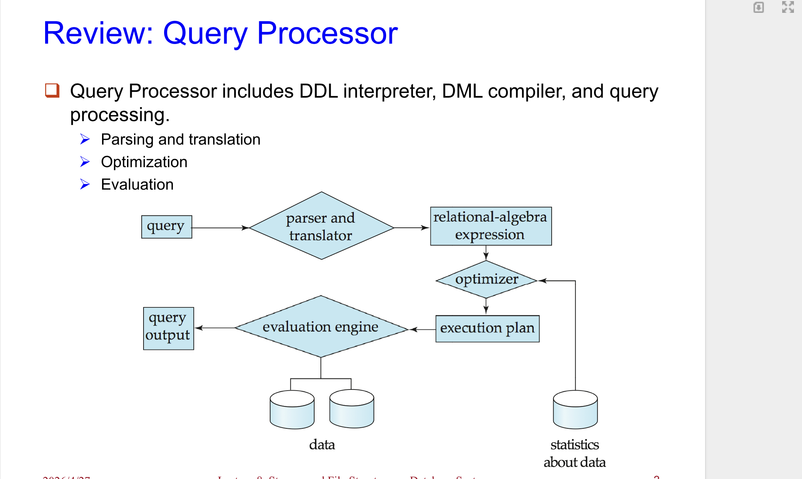
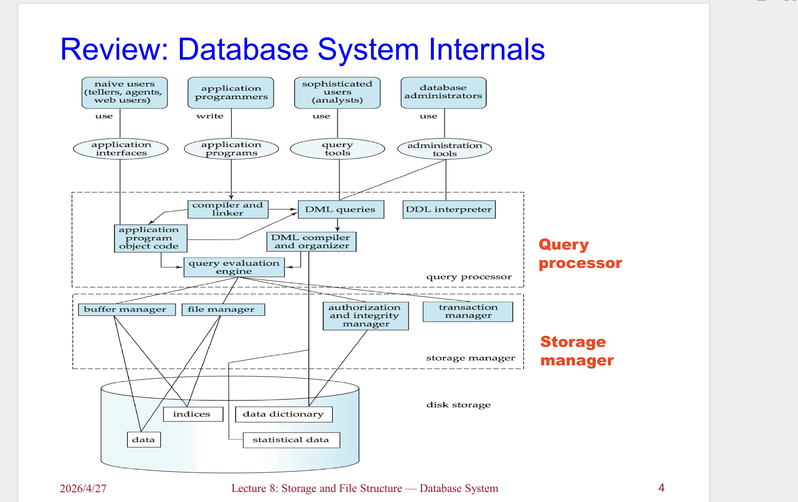
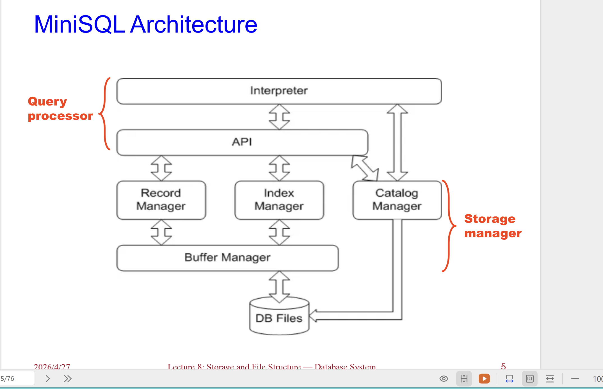
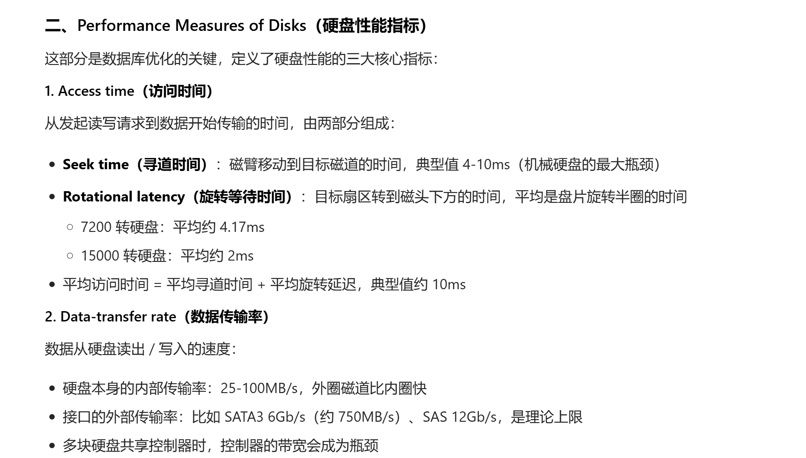
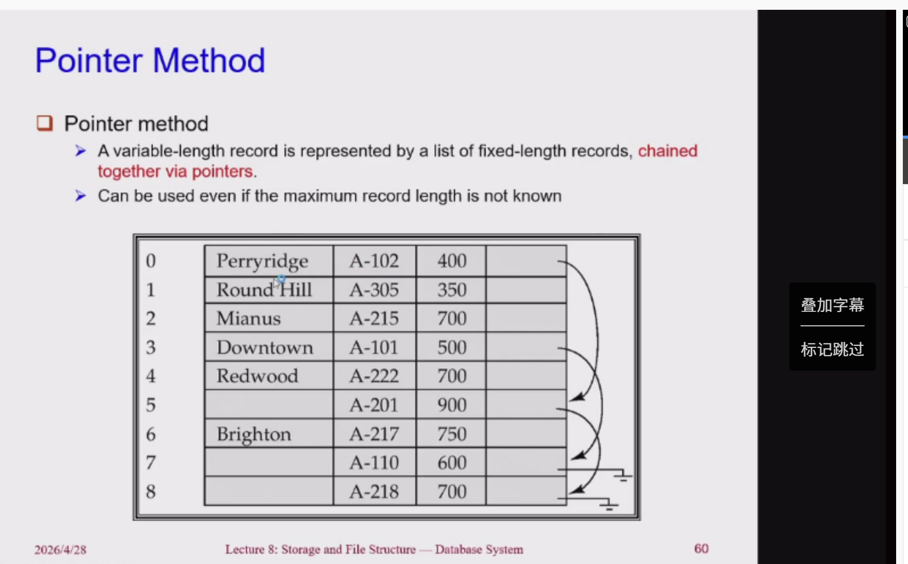
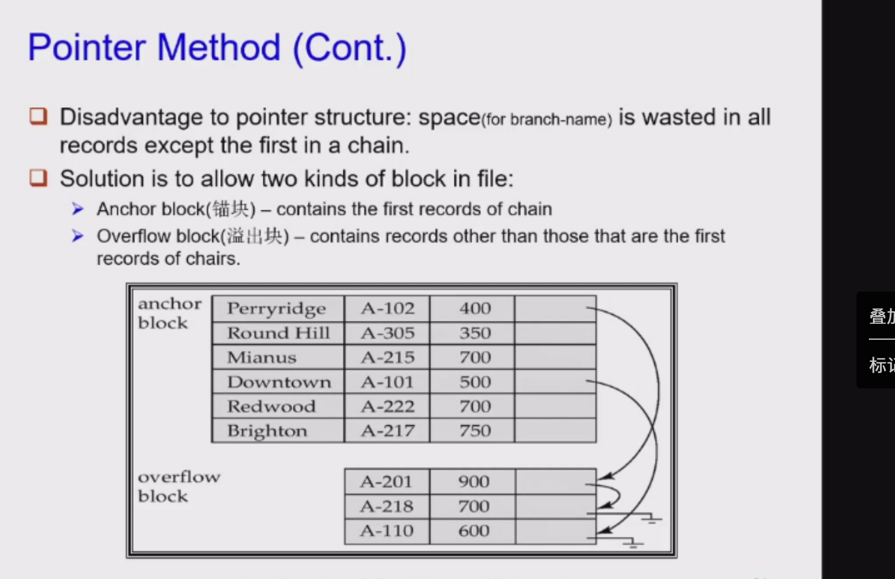
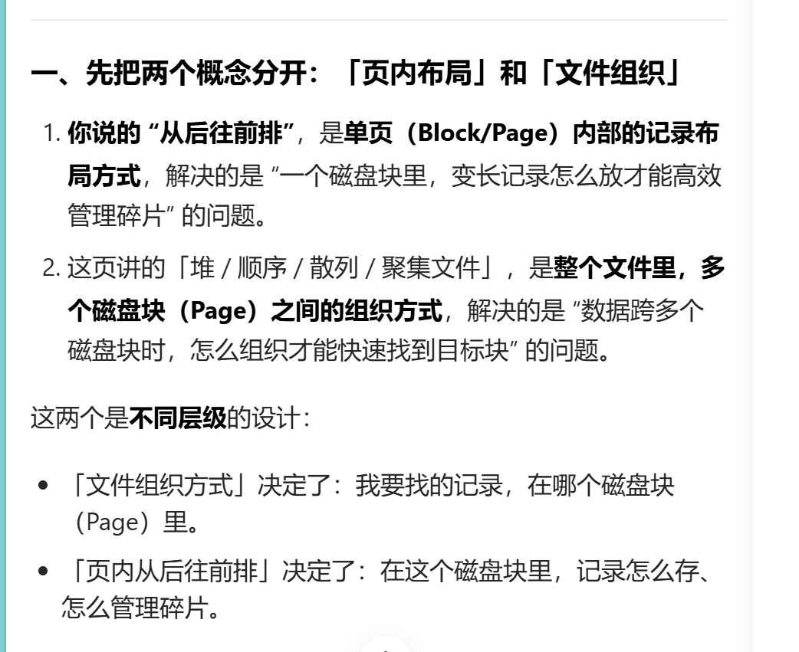

# 存储与文件结构

## 数据库系统的组成

这两张PPT是数据库系统课程的复习内容，分别介绍了数据库的两大核心组件：**存储管理器（Storage Manager）** 和 **查询处理器（Query Processor）**，我帮你拆解得明明白白👇

---

### Storage Manager（存储管理器）

这部分讲的是数据库“怎么存数据、怎么管数据”，是数据库和底层文件系统之间的核心桥梁。

#### 1. 它的核心定义

Storage Manager 是一个程序模块，作用是：

- 连接数据库底层存储的原始数据
- 和上层的应用程序、用户查询之间做交互接口
- 相当于数据库的“数据管家”，让上层不用直接操作磁盘文件

#### 2. 它的核心任务

- **和文件管理器交互**：对接操作系统的文件系统，处理底层的文件读写
- **高效地存、取、改数据**：保证数据操作的效率和正确性，是性能优化的关键环节

#### 3. 它包含的子模块

| 子模块 | 核心作用 |
| :--- | :--- |
| **Transaction manager（事务管理器）** | 保证事务的ACID特性，比如并发控制、故障恢复，防止数据不一致 |
| **Authorization and integrity manager（授权与完整性管理器）** | 做两件事：①权限控制（谁能访问哪些数据）；②完整性约束（比如主键唯一、外键关联，防止非法数据写入） |
| **File manager（文件管理器）** | 直接和文件系统打交道，处理三类文件：数据文件（存实际数据）、数据字典（存表结构、权限等元数据）、索引文件（加速查询） |
| **Buffer manager（缓冲区管理器）** | 管理内存缓存，把常用数据放到内存里，减少磁盘IO（磁盘比内存慢几百倍，这是数据库性能优化的核心之一） |

---

### Query Processor（查询处理器）

这部分讲的是“用户写的SQL查询，数据库是怎么看懂、优化、执行的”，是数据库的“翻译官+规划师”。

#### 1. 它的组成

包含三类核心组件：

- **DDL解释器**：处理建表、改表结构这类数据定义语言
- **DML编译器**：处理增删改查这类数据操作语言
- **查询处理引擎**：完成查询的解析、优化、执行全流程

#### 2. 查询处理的三步核心流程（也是图里的核心逻辑）

1.  **Parsing and translation（解析与翻译）**
    - 把用户写的SQL，先做语法、语义检查，翻译成**关系代数表达式**（数据库能看懂的标准逻辑形式）
    - 相当于把自然语言的SQL，翻译成数据库的“机器语言”

2.  **Optimization（优化）**
    - 优化器根据“数据统计信息”（比如表的大小、索引情况），生成**执行计划**
    - 会选最高效的执行方式，比如用哪个索引、怎么连接表，避免全表扫描这种慢操作
    - 统计信息是优化的关键，相当于给优化器提供“地图”，让它选最快的路

3.  **Evaluation（执行）**
    - 执行引擎拿着优化后的执行计划，调用存储管理器读写数据
    - 执行完之后，把结果整理成用户能看懂的格式，返回查询输出

---

### 一句话总结两者的关系

- **查询处理器**：负责把用户的SQL请求，翻译成最优的执行计划，告诉数据库“要做什么、怎么做最快”
- **存储管理器**：负责按照执行计划，高效地从磁盘/内存里取数据、改数据，保证数据安全和效率

两者配合，才完成了数据库从“接收SQL”到“返回结果”的完整流程。

## 物理存储介质

这两张PPT是数据库系统里**物理存储介质分类**的基础内容，我帮你拆解得清清楚楚👇

---

### 一、第一张：存储介质的核心概念与分类标准

这张先铺垫了两个关键背景，再给出了存储介质的三大核心分类维度。

#### 1. 数据库的物理层（The physical level of database）

数据库的物理存储，本质上就是操作系统里的文件，不同数据库用不同后缀：

- `.mdf` / `.ldf`：SQL Server 的主数据文件和日志文件
- `.ora`：Oracle 数据库文件
- `.dbf`：早期 dBase 或部分数据库的数据文件

#### 2. 存储介质的三大核心分类标准

PPT里标红的这三个维度，是数据库选型和存储设计的关键：

| 标准 | 核心含义 | 影响 |
| :--- | :--- | :--- |
| **Speed（访问速度）** | 数据读写的快慢 | 直接决定数据库性能，比如缓存/内存比磁盘快得多 |
| **Cost per unit of data（单位成本）** | 每GB/每TB数据的存储成本 | 决定数据分层策略：热数据放高价高速存储，冷数据放低价低速存储 |
| **Reliability（可靠性）** | 数据会不会丢、设备会不会坏 | 两个关键风险： ① 断电/系统崩溃导致数据丢失 ② 物理设备损坏（比如磁盘坏道，靠RAID技术做冗余防护） |

---

### 二、第二张：按「可靠性」和「速度」的具体分类

这张把上面的标准落地，给了具体的存储介质分类。

#### 1. 按「可靠性」分类（核心是断电后数据会不会丢）

| 类型 | 特点 | 例子 |
| :--- | :--- | :--- |
| **Volatile storage（易失性存储）** | 断电后数据全部丢失 | 计算机的内存（DDR2、SDR、DDR4/5）、CPU缓存 |
| **Non-volatile storage（非易失性存储）** | 断电后数据永久保留 | ① 磁盘/SSD（二级存储） ② 磁带/光盘（三级存储） ③ 带电池备份的内存（特殊场景用，断电靠电池维持数据） |

#### 2. 按「速度」排序（从快到慢，也是数据库存储的层级）

PPT里的顺序就是**速度从快到慢**，也是数据库存储层级的顺序：

1.  **Cache（缓存）**：最快，比如CPU缓存、数据库缓存，在内存里的一小块高速区域，成本最高、容量最小
2.  **Main-memory（主存/内存）**：比如DDR内存，速度极快，成本较高，断电丢数据
3.  **Flash memory（快闪存储器/SSD）**：比机械磁盘快很多，比如固态硬盘，非易失性，现在数据库常用
4.  **Magnetic-disk（机械硬盘）**：传统磁盘，速度中等，成本低，是数据库的主力存储介质
5.  **Optical storage（光盘存储）**：比如CD/DVD，速度慢，容量小，现在很少用
6.  **Tape storage（磁带存储）**：最慢，成本极低，主要用来存冷数据备份，比如银行/企业的历史归档数据

---

### 一句话总结

这部分内容，是在教你**数据库底层数据是怎么存在不同介质里的，以及怎么根据速度、成本、可靠性，给不同的数据选合适的存储位置**。

比如：用户正在访问的热数据，放内存/SSD；历史归档的冷数据，放磁盘/磁带；同时用RAID和非易失性存储，保证数据不会丢。

## 磁盘

这两张PPT讲的是**机械硬盘（Magnetic Hard Disk）的物理结构和存储原理**，帮你把每个部分拆解清楚👇

---

## 机械硬盘的核心结构

这张图是机械硬盘的剖面图，标注了所有关键部件：

| 部件 | 作用说明 |
| :--- | :--- |
| **Platter（盘片）** | 硬盘的“存储本体”，是涂了磁性材料的圆形金属盘，数据以磁性形式存在盘片上。一块硬盘通常有多个盘片（图里画了3个） |
| **Spindle（主轴）** | 带动所有盘片高速旋转的轴，转速通常是7200/10000/15000转/分钟，是硬盘速度的关键之一 |
| **Arm assembly（磁臂组件）** | 带动磁头前后移动的机械结构，所有磁臂是同步移动的 |
| **Arm（磁臂）** | 每个盘面对应一个磁臂，用来支撑磁头 |
| **Read-write head（读写磁头）** | 几乎贴着盘片表面飞行，靠电磁感应读写盘片上的磁性数据 |
| **Track（磁道）** | 盘片上一圈圈的同心圆，数据按磁道分布 |
| **Sector（扇区）** | 磁道被划分成的扇形区域，是硬盘读写的**最小物理单元** |
| **Cylinder（柱面）** | 所有盘片上，半径相同的磁道组成的圆柱面。数据读写时，磁头先定位到某个柱面，再等盘片旋转到对应扇区 |

---

## 机械硬盘的核心概念

这张讲了硬盘数据存储的关键逻辑：

### 1. 读写磁头（Read-write head）

- 工作时几乎贴着盘片表面飞行（间隙只有几纳米），不会直接接触盘片
- 通过电磁感应，把盘片上的磁性信号转换成电信号（读），或者把电信号转换成磁性信号（写）

#### 2. 磁道（Track）

- 盘片表面被划分成的一圈圈同心圆，典型硬盘的每个盘片上有 **5万-10万条磁道**
- 数据是按磁道分布的，磁头定位到某条磁道后，盘片旋转，就能读写这条磁道上的数据

#### 3. 扇区（Sector）

- 磁道被划分成的扇形区域，是硬盘**最小的读写单元**
- 常见扇区大小是 **512字节** 或 **4KB**
- 每个磁道上的扇区数：内圈磁道（半径小）通常500-1000个扇区，外圈磁道（半径大）可以到1000-2000个扇区（外圈周长更长，能存更多数据）

---

### 为什么这对数据库很重要？

机械硬盘的读写性能，完全取决于这几个物理部件的限制：

1.  **寻道时间**：磁臂移动到目标磁道的时间，是机械硬盘最慢的环节（几毫秒级）
2.  **旋转延迟**：盘片旋转到目标扇区的时间，和转速有关
3.  **传输时间**：数据从盘片读到磁头的时间

数据库里的“顺序读写快、随机读写慢”，根源就在这里——顺序读写时，磁头不用频繁移动，而随机读写需要反复寻道，效率极低。

这三张PPT是在系统拆解**机械硬盘（Magnetic Disks）的工作原理和核心机制**，从物理结构、读写流程到控制器功能，我帮你逐一讲透👇

---

### 硬盘的基础物理单元定义

这张讲了硬盘最核心的三个基础概念，是理解所有后续内容的前提：

1.  **Read-write head（读写磁头）**
    - 工作时几乎贴着盘片表面飞行（间隙仅几纳米，不会直接接触）
    - 通过电磁感应，把盘片上的磁性信号转换成电信号（读），或把电信号转换成磁性信号（写），是数据读写的直接执行者
2.  **Track（磁道）**
    - 盘片表面被划分成的一圈圈同心圆，典型硬盘每个盘片上有 **5万-10万条磁道**
    - 数据按磁道分布，磁头定位到某条磁道后，盘片旋转就能读写这条磁道上的数据
3.  **Sector（扇区）**
    - 磁道被划分成的扇形区域，是硬盘**最小的物理读写单元**
    - 常见扇区大小为 **512字节** 或 **4KB**
    - 外圈磁道周长更长，能划分更多扇区：内圈通常500-1000个扇区，外圈可达1000-2000个

---

### 硬盘的读写流程与柱面（Cylinder）概念

这张讲了硬盘怎么完成一次读写，以及“柱面”这个关键结构：

1.  **读写一个扇区的完整过程**
    1.  **寻道（Seek）**：磁臂摆动，把磁头定位到目标磁道上（这是机械硬盘最慢的环节，几毫秒级）
    2.  **旋转延迟（Rotational Latency）**：盘片持续旋转，直到目标扇区转到磁头下方
    3.  **传输（Transfer）**：磁头读写经过的扇区数据
2.  **Head-disk assemblies（磁头-盘片组件）**
    - 一块硬盘通常包含 **4-16个盘片**，全部固定在同一个主轴上同步旋转
    - 每个盘面对应一个磁头，所有磁头都安装在同一个磁臂上，同步摆动
3.  **Cylinder（柱面）**
    - 所有盘片上，**半径相同的磁道组成的圆柱面**，就是第`i`个柱面 = 所有盘片的第`i`条磁道
    - 意义：数据读写时，磁头先定位到某个柱面，就能读写该柱面上所有盘片的同半径磁道，减少磁臂移动次数，提升效率

---

### Disk controller（硬盘控制器）的核心功能

硬盘控制器是硬盘的“大脑”，负责衔接计算机系统和硬盘硬件，PPT里讲了它的关键职责：

1.  **接收并执行高层指令**：接收系统的读写扇区指令，控制磁臂移动、磁头读写数据
2.  **数据校验（Checksum）**：
    - 为每个扇区附加校验和（Checksum），读取时重新计算校验和，和存储的值对比，判断数据是否损坏
    - 如果校验和不匹配，说明数据 corrupted（损坏），控制器会报告错误
3.  **写入验证**：写完一个扇区后，会立刻把数据读回来，验证写入是否成功，避免写入错误
4.  **坏扇区重映射（Bad Sector Remapping）**：
    - 当某个扇区物理损坏（坏扇区），控制器会自动把它的逻辑地址，映射到硬盘预留的备用物理扇区上
    - 这个映射关系会存在硬盘的非易失性存储器中，上层系统完全感知不到坏扇区的存在

## **机械硬盘块访问的核心优化策略**

---

### 文件组织与碎片整理（File Organization & Defragmentation）

这张讲的是最基础的物理存储优化，核心是**减少磁臂移动**：

1.  **文件组织的核心思路**：
    - 把相关数据存放在**同一个或相邻的柱面**上，这样顺序读写时磁臂不用频繁移动，大幅减少寻道时间
    - 这就是数据库里表空间、分区表的底层逻辑——把关联数据物理上放得更近
2.  **文件碎片化（Fragmentation）的问题**：
    - 随着文件的增删改，数据块会被分散到磁盘的不同位置（碎片）
    - 顺序访问碎片化文件时，磁臂需要来回跳动，寻道时间暴增，性能大幅下降
3.  **碎片整理（Defragmentation）**：
    - 系统会把分散的文件块重新整理成连续的物理块，恢复顺序读写性能
    - 缺点：整理时需要占用大量磁盘IO，系统几乎无法正常使用，所以数据库一般不会频繁做碎片整理，而是通过设计避免碎片化

---

### 非易失性写缓冲区（Nonvolatile Write Buffers）

这张讲的是用硬件加速解决机械硬盘的写入瓶颈，核心是**异步写+重排序**：

1.  **核心原理**：
    - 写入请求先写到**非易失性RAM（NV-RAM）** 里（比如带电池备份的内存、Flash），立刻返回成功，不用等数据真正写到磁盘
    - 控制器在磁盘空闲时，再把缓冲区的数据批量写入磁盘
2.  **关键优势**：
    - 即使断电，NV-RAM里的数据也不会丢，下次开机后会自动刷到磁盘，保证数据安全
    - 写入请求可以**重排序**，按照电梯算法批量写入，减少磁臂移动，大幅提升写入性能
    - 数据库的事务可以提前提交，不用等磁盘刷写完成，大幅降低延迟
3.  这就是数据库里**WAL（预写日志）** 机制的硬件原型，本质上都是“先写日志再写数据”，用顺序写替代随机写。

---

### 日志盘与文件系统优化（Log Disk & Journaling File Systems）

这张讲的是不用特殊硬件，也能实现类似非易失性写缓存的效果：

1.  **Log disk（日志盘）**：
    - 专门用一块磁盘，只写顺序的更新日志（类似数据库的WAL）
    - 写入时只需要顺序追加，完全没有寻道时间，速度极快
    - 不需要特殊的NV-RAM硬件，成本更低，是数据库的经典优化手段
2.  **文件系统的写入重排序**：
    - 现代文件系统会自动重排序写入请求，减少磁臂移动，但如果没有日志机制，重排序可能导致文件系统损坏
    - **日志文件系统（Journaling File Systems，比如Ext3/4、XFS）**：
      - 先把写入操作的日志写到日志盘/日志区，再重排序写入数据
      - 即使断电，也能通过日志恢复数据，兼顾性能和安全性

---

## 一句话总结

这三张PPT讲的所有优化，本质上都是围绕机械硬盘的核心痛点——**随机读写慢、寻道时间长**，通过“物理连续存放、异步写缓冲、顺序日志写”三种方式，把随机IO转换成顺序IO，从而大幅提升性能。

## **数据库存储访问与缓冲区管理**

---

### 一、核心背景：为什么需要Buffer？

这几页PPT讲的是数据库里最基础也最关键的**存储访问与缓冲区管理**逻辑，本质是解决一个核心矛盾：

- **磁盘（硬盘）太慢了**：一次读写要≈10ms，是内存的百万倍级延迟
- **数据库的操作都要基于数据**：CPU只能直接操作内存里的数据，不能直接读写磁盘

所以数据库用**Buffer（缓冲区/缓冲池）**，把磁盘上的数据块（Block/Page）先读到内存里，再给CPU用，目的就是**尽量减少磁盘读写次数**，让数据库跑得更快。

---

### 二、基础概念：Block、Page、Frame、Buffer Pool

先把这几个高频词搞懂：

1.  **Block（块）**：磁盘上的固定大小存储单元，是磁盘分配和数据传输的基本单位。
2.  **Page（页）**：数据的逻辑单元，在数据库实现里，通常和Block一一对应，大小也相同，常混用。
3.  **Frame（帧）**：内存里Buffer Pool中的一个槽位，用来存放一个Page/Block的副本。
4.  **Buffer Pool（缓冲池）**：内存里专门用来存磁盘块副本的一片区域，也就是“内存缓冲区”。

它们的关系：
> 磁盘Block → 读到内存Buffer Pool的Frame里 → 变成Page给DBMS操作

---

### 三、Buffer Manager（缓冲区管理器）是干啥的？

它是数据库里专门管缓冲池的“大管家”，核心工作流程如下：

1.  当程序/查询需要某个磁盘块时，会向Buffer Manager请求
2.  **如果这个块已经在Buffer里**：直接返回它在内存的地址，不用读磁盘
3.  **如果这个块不在Buffer里**：
    - 先看Buffer里有没有空闲的Frame
    - 没空闲的话，就要**替换**一个旧块：
      - 如果旧块被修改过（Dirty），要先写回磁盘，再覆盖它的Frame
      - 没修改过，直接覆盖就行
    - 把新块从磁盘读到空出来的Frame里，再返回地址

---

### 四、关键机制：替换策略与特殊标记

#### 1. 替换策略（Buffer-Replacement Policies）

当Buffer满了，必须踢掉一个块腾位置，用什么规则踢？

- **LRU（Least Recently Used，最近最少使用）**
  - 规则：踢掉**最久没被访问过**的块
  - 逻辑：默认“很久不用的，接下来也大概率不用”，用过去的访问模式预测未来
  - 缺点：在循环扫描（比如大表遍历）时会失效，把即将要用到的循环数据踢掉，导致频繁换入换出

- **MRU（Most Recently Used，最近最常使用）**
  - 规则：踢掉**最近刚用过**的块
  - 适用场景：顺序扫描数据（比如遍历表），刚处理完的块短时间内不会再用，直接踢掉更高效

#### 2. 关键标记与计数

- **Dirty Bit（脏位）**：标记这个块在内存里有没有被修改过。只有脏块被替换时，才需要写回磁盘。
- **Pinned Block（钉住的块）**：正在被程序使用的块，不能被替换也不能写回磁盘，防止数据被覆盖或损坏。
- **Pin Count（引用计数）**：记录有多少个事务/请求正在使用这个块。只有`Pin Count=0`的块，才会被纳入替换候选。

---

### 五、举个例子帮你串起来

比如你要在数据库里执行`SELECT * FROM borrower JOIN customer`（PPT里的例子）：

1.  Buffer里有5个Frame，分配了1个给`borrower`表，3个给`customer`表，1个给结果输出
2.  遍历`borrower`的每一行时，都要和`customer`的所有行做匹配，导致`customer`的数据被循环访问
3.  用LRU的话，会把“最久没用到的”`customer`块踢掉，但这些块下一轮循环马上又要用到，结果就是刚踢掉又要读进来，效率极差
4.  用MRU就更合适：刚匹配完的`customer`块，短时间内不会再用，直接踢掉就行

---

### 总结

这几页内容，本质是在讲：
数据库怎么用**内存缓冲区**，解决磁盘太慢的问题；
缓冲区管理器怎么通过**替换策略、脏位、引用计数**，在有限的内存空间里，尽可能减少磁盘IO，同时保证数据安全。

** 前面说的是具体存储层，但是数据库直接对接的是数据库的文件组织 是具体存储的上一层，他不直接操作具体的磁盘块，他直接操作数据库文件**

## **数据库文件组织（File Organization）**

我给你用「从外到内」的视角，把**数据库里说的“文件”**，和**物理硬盘**的关系讲得明明白白，一次把这个概念彻底打通。

---

### 一、先给结论：这里的“文件”，是**操作系统给数据库的“硬盘抽象层”**

你可以把它理解成：
> 数据库不能直接操控硬盘硬件，只能通过操作系统提供的接口，操作一个「逻辑容器」——这个容器，就是文件。

它的关系链是：
`数据库文件` → 由`操作系统文件系统`管理 → 最终数据存在`物理硬盘`上。

---

### 二、拆解：什么是“数据库里说的文件”？

#### 1. 它是操作系统层面的文件

你在电脑上看到的，比如 MySQL 的 `data.ibd`、SQLite 的 `test.db`，这些就是数据库文件。

- 对操作系统来说，它和你电脑上的 `.txt` 文档、`.jpg` 图片没有区别，都是一个普通文件。
- 操作系统会帮你把硬盘的细节（扇区、磁道、坏块屏蔽掉），给你一个「可以按字节读写的连续空间」。

#### 2. 对数据库来说，它是自己的“数据容器”

数据库会把这个文件，当成自己的地盘：

- 数据库会把文件划分成自己的「页/块（Page/Block）」，比如 8KB、16KB 大小。
- 再在这些页里，按你之前学的「堆/顺序/散列/聚集」四种方式，存放表的记录。

**操作系统只看到一个文件，完全不知道里面存的是表、页还是记录。**

---

### 三、它和物理硬盘是什么关系？

#### 1. 物理硬盘：最底层的硬件存储

- 硬盘的最小读写单位是「扇区」（通常 512B 或 4KB），数据最终都存在这些扇区里。
- 数据库根本不直接操作硬盘扇区，这些事都由操作系统的文件系统来做。

#### 2. 文件系统：把硬盘“包装”成文件

- 操作系统会把硬盘分成一个个「文件系统块」（比如 4KB），文件就是由这些块组成的。
- 数据库对文件的读写请求，会被文件系统转换成对硬盘扇区的读写操作。

#### 3. 数据库文件：数据库眼里的“硬盘”

- 对数据库来说，它的世界就是这个文件。它读写的是文件里的字节，而不是硬盘扇区。
- 你PPT里讲的「堆/顺序/散列文件」，都是数据库在这个文件里，怎么组织记录的逻辑方式，和硬盘物理结构无关。

---

### 四、用一个生活化的例子帮你串起来

- **物理硬盘**：就像银行的金库，里面是一个个保险柜格子（扇区），普通人不能直接碰。
- **文件系统**：就像银行柜员，帮你管理金库，给你开了一个账户（文件），你可以存/取钱，不用管格子在哪。
- **数据库文件**：就像你账户里的「专属存折」，你可以按自己的规则排版（四种文件组织方式），记录你的流水。
- 数据库只关心存折里的内容，完全不知道它背后的金库和保险柜格子。

---

### 一句话总结

- 你PPT里说的「文件」，是**操作系统给数据库提供的逻辑数据容器**，是数据库眼里的“硬盘”。
- 它和物理硬盘的关系是：**文件是硬盘的抽象，数据库通过文件间接使用硬盘，文件系统负责把文件操作转换成硬盘的物理读写。**
？

## **数据库底层文件组织（File Organization）

---

### 一、整体结构：数据库文件的层级

PPT 先给了数据库文件的三层结构：

1.  **数据库（Database）**：由一堆文件（Files）组成
2.  **文件（File）**：由一串记录（Records）组成
3.  **记录（Record）**：由一串字段（Fields）组成

而记录主要分两种：

- **定长记录（Fixed-length）**：所有记录的长度都一样
- **变长记录（Variable-length）**：不同记录长度可以不一样

你这几页讲的就是**定长记录的存储和删除机制**。

---

### 二、定长记录（Fixed-Length Records）的核心逻辑

#### 1. 优点：寻址超级简单

因为每个记录长度固定（设为 `n` 字节），第 `i` 条记录的位置可以直接算出来：
`起始字节 = n × (i-1)`

比如每个记录占100字节，第3条记录就从 `100×(3-1)=200` 字节的位置开始存。
这就是它的核心优势：不用维护索引，直接用公式就能找到记录，读写效率高。

但有个小问题：记录可能会跨磁盘块（Block）存储，所以一般会额外限制：**不允许记录跨块**，避免一次读记录要读两次磁盘块。

---

### 三、定长记录的删除：三种方案

定长记录删除时，要解决“被删掉的空间怎么处理”的问题，PPT给了三种方法：

#### 方法1：后面的记录全部往前挪

删除第 `i` 条记录后，把 `i+1` 到 `n-1` 的所有记录都往前移动一位，补上空白。

- 优点：文件里没有碎片，记录始终是连续的
- 缺点：删除一条记录要移动大量数据，性能极差，实际几乎不用

#### 方法2：用最后一条记录补位

删除第 `i` 条记录后，把文件里**最后一条记录**直接复制到第 `i` 条的位置，然后把文件长度减1。

- 优点：只移动一条记录，比方法1快很多
- 缺点：记录的顺序会被打乱，依赖记录顺序的查询会出问题

#### 方法3：Free List（空闲链表，最常用）

不移动任何记录，而是把被删除的记录串成一个链表（叫 Free List），下次插入新记录时优先复用这些空闲空间。
这就是你下一页讲的内容：

---

### 四、Free List（空闲链表）的工作方式

1.  **文件头存链表头**：在文件最开头的 Header 里，存第一个被删除记录的地址
2.  **被删记录存下一个指针**：每个被删掉的记录里，原本存数据的空间会被用来存“下一个被删记录的地址”，形成链表
3.  **插入时优先复用**：新记录插入时，先从 Free List 里拿一个空闲位置，再把这个位置从链表中移除
4.  **优点**：
    - 完全不用移动现有记录，删除/插入性能极高
    - 被删记录的空间能被重复利用，不会产生外部碎片
    - 只有被删除的记录里才存指针，在用的记录里没有额外开销

---

### 举个完整的例子帮你串起来

就用 PPT 里的教师表举例：

1.  表有12条定长记录，每条占固定字节数，连续存文件里
2.  你删除了 `record 1` 和 `record 6`
3.  Free List 会把这两个位置串起来：文件头 → `record 1` → `record 6` → 链表结束
4.  新插入一个老师记录时，优先把数据写到 `record 1` 的位置，然后把链表头改成 `record 6`
5.  整个过程中，其他10条记录的位置完全不动，性能极高

---

### 一句话总结

这几页讲的是：**定长记录怎么在文件里存、怎么找、删了之后怎么处理空间，其中 Free List 是工业界最常用的高效删除方案**。

我帮你把这两页的内容拆成大白话，讲透**变长记录（Variable-Length Records）和槽式页结构（Slotted Page Structure）**，它们是现代数据库存储变长数据的核心方案。

---

## 变长记录（Variable-Length Records）

### 一、变长记录：为什么会有？怎么存？

### 1. 变长记录是怎么来的？

数据库里出现变长记录，主要有这几种情况：

- 一个文件里存了多种不同类型的记录
- 字段本身是变长的，比如 `VARCHAR` 字符串、`TEXT` 大文本
- 一些老数据模型里，允许重复字段（比如一个人多个电话）

### 2. 变长记录的存储方案（PPT里的例子）

核心思路是：**用“元数据”记录变长字段的位置，再把数据放在后面**。

- **固定部分先存**：所有定长字段、以及变长字段的偏移量（offset）和长度（length）先存好。
- **变长部分后存**：实际的变长数据（比如字符串）全部放在定长字段的后面。
- **空值用位图表示**：用一个`Null bitmap`（空值位图）来标记哪些字段是空值，空值字段就不用存数据了，节省空间。

看你PPT里的例子：

- 前20个字节存的是定长数据+变长字段的`(偏移, 长度)`信息
- 第21字节是`Null bitmap`（空值位图），标记哪些字段为空
- 后面的`10101`、`Srinivasan`、`Comp. Sci.`才是实际的变长数据

---

### 二、槽式页结构（Slotted Page）：现代数据库怎么管理变长记录？

变长记录的痛点很明显：删除、修改时很容易产生碎片，而且记录位置变了，索引指针就会失效。**槽式页结构就是专门解决这个问题的方案**，现在几乎所有主流数据库（MySQL/PostgreSQL等）都在用。

### 1. 它的结构长什么样？

你可以把一个磁盘页（Page/Block）分成三部分：

1.  **页头（Block Header）**：
    - 记录条目总数（Number of Entries）
    - 空闲空间的结束位置（End of Free Space）
    - 最重要的：每个记录的**Slot（槽）**，每个Slot包含两个信息：
      - 记录的长度（Length）
      - 记录在页内的指针（Pointer/Offset）
2.  **空闲空间（Free Space）**：页中间的空白区域，用来分配给新记录
3.  **记录数据区**：变长记录从页的末尾往前存，数据和页头的Slot一一对应

### 2. 它解决了什么核心问题？

#### ① 记录在页内可以随便移动，不会影响外部索引

- 记录在页内移动位置时，只要更新页头里对应的Slot指针就行。
- 外部的索引，指向的是“页号 + Slot号”，而不是记录的物理地址。
- 这样即使记录在页内被挪了位置，索引也完全不用改，完美解决了变长记录的碎片问题。

#### ② 可以高效地消除页内碎片

- 删除或修改记录后，会产生零散的空闲空间。
- 你可以直接移动页内的记录，把它们“挤”到一起，消除碎片，而外部索引完全不受影响。

#### ③ 插入/删除变长记录非常高效

- 新记录直接从页的末尾往前分配空间，不用像定长记录那样移动大量数据。
- 删除记录时，只要把对应的Slot标记为无效，等碎片多了再做一次页内整理就行。

---

### 三、举个通俗的例子帮你理解

想象你有一个笔记本（磁盘页）：

- **页头**就是目录，写着“第1条记录在第20页，长度5行；第2条记录在第15页，长度3行……”
- **记录数据**写在笔记本的末尾，一条挨着一条往前写
- 你要删第1条记录，只要把目录里的第1条标记为“无效”就行，后面的数据完全不用动
- 你要整理碎片，只要把后面的记录往前挪，然后更新目录里的页码，别人只看目录的话，根本不知道记录的位置变了

---

### 一句话总结

- 上一页讲的是**变长记录怎么存**：用偏移量+长度来管理变长字段，用位图处理空值。
- 这一页讲的是**变长记录怎么高效管理**：用“槽式页结构”，让记录可以在页内自由移动，既解决了碎片问题，又不会破坏外部索引。

这几页讲的是**变长记录的两种经典定长存储方案**，我帮你把它们拆解得明明白白，顺便对比优缺点。

---

## 一、背景：为什么要用「定长方式」存变长记录？

你前面学过，变长记录直接存会有碎片、寻址慢的问题。
这几页讲的，就是**用“定长记录”的形式，来模拟变长记录的两种思路**，核心目标是：
> 保留定长记录寻址简单的优点，同时支持变长数据。

---

## 方案A：Reserved Space（预留空间法）

### 核心思路

按**最长可能的记录长度**来存，给每个字段都预留出最大空间，不够的记录就用空值符号（⊥）填充。

### 用你PPT里的银行账户例子

比如一个支行（Branch）可能有多个账户（Account），最多允许3个账户：
| 字段 | 预留最大空间 |
| :--- | :--- |
| 支行名 | 固定长度 |
| 账户1（账号+余额） | 固定长度 |
| 账户2（账号+余额） | 固定长度 |
| 账户3（账号+余额） | 固定长度 |

- Perryridge支行有3个账户，所以后面的字段都填满了数据
- Round Hill支行只有1个账户，账户2、3的位置就用⊥（空值符号）填充

### 优缺点

✅ 优点：

- 结构超级简单，和普通定长记录完全一样，寻址直接用公式算
- 一次IO就能读完整个记录，不用额外跳转

❌ 缺点：

- 空间浪费极大，大部分记录都远没达到预留的最大长度
- 无法支持“最大长度未知”的场景（比如无限个账户）

---

## 方案B：Pointer Method（指针/链表法）

### 核心思路

把变长记录拆成多个定长的“节点”，用指针串成一个链表：

- 每个节点都是固定长度的，只存一部分数据
- 节点最后带一个指针，指向下一个节点的位置

### 还是银行账户的例子

- 每个节点只存「账号+余额+下一个节点指针」
- Perryridge支行的3个账户，就用3个节点串起来：
  节点0（主记录）→ 节点5（账户2）→ 节点8（账户3）→ 链表结束

### 优缺点

✅ 优点：

- 完全支持“最大长度未知”的场景，数据可以无限扩展
- 没有预留空间浪费，用多少节点就存多少节点

❌ 缺点：

- 读取一条完整记录，要多次IO跳转（比如读3个账户要跳3次）
- 链表上的节点，除了第一个，其他都浪费了“支行名”的空间（重复存没用的字段）

---

## 优化方案：Anchor + Overflow Blocks（锚块+溢出块）

为了解决指针法的浪费问题，引入了两种块：

1.  **Anchor Block（锚块）**：存链表的第一个节点，包含完整的主字段（比如支行名）
2.  **Overflow Block（溢出块）**：只存额外的数据节点，不存主字段，节省空间

比如：

- Anchor块里，每个支行只存一次名字+第一个账户
- 额外的账户，全部存在Overflow块里，用指针和锚块串起来

✅ 解决了指针法里重复存主字段的浪费问题，同时保留了链表法的可扩展性。

---

## 一句话总结

这几页讲的是变长记录的两种定长存储方案：

- **预留空间法**：简单但浪费空间，适合长度变化不大的场景
- **指针链表法**：省空间但需要跳转IO，优化成锚块+溢出块后，兼顾了空间和扩展性

## 数据字典

这两页讲的是**数据字典（Data Dictionary）**，也就是数据库里的「元数据系统」，我给你用大白话讲透它到底是什么、存了什么、有什么用。

---

### 一、核心一句话：什么是数据字典？

它是数据库的**“说明书”和“管理员手册”**，专门存「数据的数据（元数据/Metadata）」，也就是数据库里所有对象的定义和描述信息。

---

### 二、数据字典里到底存了啥？

你第一页PPT里列的就是它的核心内容，我给你拆解一下：

#### 1. 表/关系的信息（Information about relations）

- 表的名字
- 每个字段的名字、数据类型
- 视图的名字和定义
- 表上的完整性约束（主键、外键、非空等）

#### 2. 用户和权限信息

- 用户名、加密密码
- 用户所属的用户组、权限配置

#### 3. 统计信息

- 每张表有多少条记录（元组）
- 字段的分布、重复值比例等（查询优化器会用到）

#### 4. 物理文件组织信息（和你之前学的存储结构直接相关！）

- 表是用什么方式存的：顺序文件、堆文件、散列文件
- 表在操作系统里的文件名，或者数据块的磁盘地址
- 这就是数据库能找到数据的关键！

#### 5. 索引信息

- 索引的名字、类型（B+树/哈希）
- 索引建在哪些字段上

---

### 三、第二页PPT：元数据本身，也是用「关系表」存的

数据库很聪明，它用**和普通表一样的关系模型**来存元数据，就像你第二页PPT里画的那样：

- `Relation_metadata`：存所有表的元数据（表名、字段数、存储方式、位置）
- `Attribute_metadata`：存每个字段的元数据（字段名、类型、在记录里的位置/长度）
- `Index_metadata`：存索引的信息
- `User_metadata`：存用户信息

这种设计的好处是：

- 数据库自己的查询引擎，也能用普通SQL来读写元数据
- 元数据的存储方式和用户数据完全统一，不用搞两套逻辑

---

### 四、为什么数据字典这么重要？

它是数据库能正常工作的「基础」：

- 你写`SELECT * FROM student`时，数据库要先去数据字典里查：`student`表在哪、字段是什么类型、存在哪个文件里
- 查询优化器要靠数据字典里的统计信息，来决定用什么索引、怎么执行查询
- 权限校验时，要去数据字典里查你的用户有没有访问这张表的权限

---

### 一句话总结

数据字典，就是数据库的「内部说明书」，用关系表的形式，存着所有表、字段、索引、用户、存储方式的元数据，是数据库管理和查询的基础。
