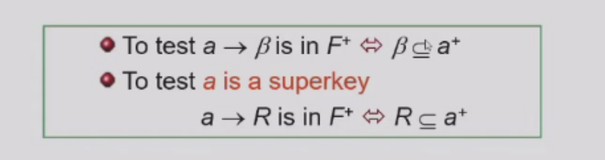
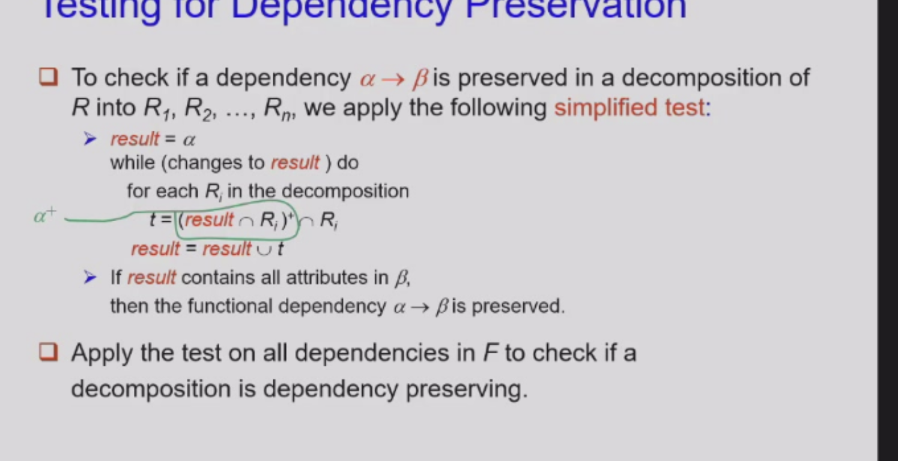
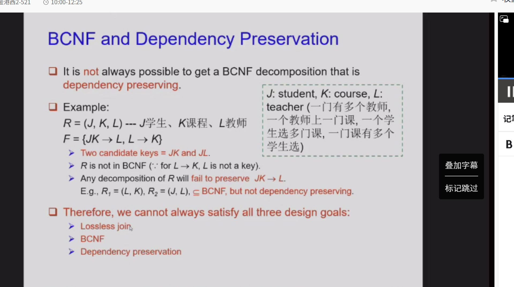

# 如何设计数据库（什么是好的）

## 第一范式

这三张PPT都在讲**关系型数据库设计中的「第一范式（1NF, First Normal Form）」**——这是数据库设计最基础、也是最核心的规则之一。我帮你逐张拆解，再总结它的本质和意义：

---

### 1NF的核心定义

这张PPT先铺垫了两个关键概念，再给出1NF的定义：

1.  **什么是「原子性（Atomic）」？**
    一个数据的「域（Domain，可理解为“某个字段能存的值的集合”）」是原子的，意思是：这个域里的每一个值，在数据库设计的视角下，都是**不可再拆分的最小单元**。
    反过来，PPT举了三种「非原子域」的典型例子：

    - 复合属性：比如“姓名”字段同时存了“姓+名”（如“张三”），或“地址”字段存了“省/市/区/街道”的完整信息；
    - 多值属性：比如一个人的多个手机号，用逗号分隔存在同一个字段里（如`138xxxx,139xxxx`）；
    - 复杂数据类型：比如直接存面向对象的对象、JSON数组这类非结构化数据。

2.  **什么是第一范式（1NF）？**
    一个数据库表（关系模式`R`）满足1NF，当且仅当：**表中所有属性（字段）的域都是原子的**。
    换句话说：表中「每一行、每一列」都只能存一个“不可拆分的值”——不能存多个值，也不能存需要再拆分的复合值。

3.  **为什么关系数据库强制要求1NF？**
    关系型数据库的底层设计（SQL的增删改查、约束、索引），完全建立在“所有数据都是原子的”这个前提上。如果不满足1NF，SQL操作会变得异常复杂，甚至无法实现。

---

### 怎么处理「非原子值」？

现实中我们经常遇到复合属性、多值属性，这张PPT讲了几种处理方式，以及它们的优缺点：

1.  **复合属性的处理：拆成多个独立字段**
    比如把“姓名”拆成“姓”和“名”两个字段，把“地址”拆成“省/市/区/街道”四个字段，每个字段的值就变成原子的了。

2.  **多值属性的三种处理方式（以“手机号”为例）：**
    - 方式1：多字段存储（如`phon1, phon2, phon3...`）
      给每个可能的手机号单独开一个字段。缺点很明显：不知道用户到底有几个手机号，开少了不够用，开多了大部分字段是空的，浪费空间，查询时还要遍历所有字段，效率极低。

    - 方式2：单独建关联表（如`phone(pname, phone)`）
      建一个单独的手机号表，用用户名（`pname`）关联，一个人多个手机号就存多条记录。这是**最推荐的方式**：完全满足1NF，灵活度高（多少个手机号都能存），查询和修改也很方便。

    - 方式3：单字段存多个值（如`phones`字段用逗号分隔）
      这种方式看起来省事，但完全不满足1NF，而且有很多致命问题。

3.  **非原子存储的缺点：**
    - 存储逻辑复杂：需要额外的代码来解析字段里的多个值；
    - 容易产生数据冗余：修改一个值时要修改整个字段，容易出错，也无法对单个值做约束；
    - 查询效率低：比如要查“手机号以138开头的用户”，就不能直接用SQL的`WHERE phone LIKE '138%'`，必须先拆分字段，写复杂的逻辑。

---

### 原子性的「相对性」——关键看你怎么用数据

这张PPT纠正了一个常见误区：很多人以为“字符串就是原子的”，但其实**原子性不是绝对的，而是看你在业务中会不会拆分这个值来使用**。

- 举个例子：学号是`CS0012`或`EE1127`这种字符串。
  - 如果你只把学号当成一个整体使用（比如查询、修改都直接用整个学号），那它就是原子的，没问题；
  - 但如果你在业务中，需要从学号里提取前两位`CS/EE`来判断院系，那这个学号的域就**不是原子的**了——因为你在业务逻辑里，把它拆成了“院系代码”和“编号”两部分来使用。

- 为什么这是坏设计？
  因为你把业务逻辑藏在了应用程序里，而不是数据库里：数据库只存了一个字符串，但业务要自己解析字符串来获取院系信息。这种设计的问题很多：

  - 可维护性差：如果院系代码改了（比如`CS`改成`CSE`），所有旧学号都要修改；
  - 无法做数据库约束：不能保证学号的前两位一定是合法的院系代码；
  - 查询效率低，也容易出错。
  正确的做法是：把“院系”单独存成一个字段，和“学号”分开，这样两个字段都是原子的，数据库也能做约束，查询也更方便。

---

### 核心总结

这三张PPT的本质，是在讲数据库设计的一个底层原则：
> **1NF的核心，是让数据的「含义」和「存储」完全对齐——每个字段存的，都应该是业务中需要直接使用的最小单元，而不是需要再拆分的复合信息。**

1NF是所有更高范式（2NF、3NF、BCNF）的基础，它解决了“数据存储混乱”的问题，让数据库的操作更简单、高效、可靠。

## 设计范式

#这两张PPT是数据库设计里的“前后呼应”，核心讲了两个关键问题：

1.  **为什么要设计范式？——糟糕的单表设计会带来什么问题？**（第一张）
2.  **分解表的时候要注意什么？——什么是“有损分解”，为什么它是错的？**（第二张）

---

### 关系数据库设计的陷阱（Pitfalls）

这张PPT的核心是**说明「不规范的单表设计」会带来的问题，以及两种主流设计思路**。

### 1. 坏设计的三大问题

关系数据库设计的目标，是找到一组“好的关系模式”（也就是合理的表结构）。如果设计得不好，会带来这些问题：

- **冗余存储（Redundant storage）**：重复存储相同的数据。
  比如例子里的`Lending-schema`，把“支行信息（branch-name, branch-city, assets）”和“贷款信息（customer-name, loan-number, amount）”存在同一张表里。
  结果就是：同一个支行的名称、城市、资产，会随着每一笔贷款记录重复存储，造成大量冗余。

- **更新/插入/删除异常（Anomalies）**：冗余带来的一致性问题，分为三种：
  - **更新异常**：某支行的资产更新了，所有和这个支行相关的贷款记录都要改，漏改一条就会出现数据不一致。
  - **插入异常**：新开了一个支行，但还没有发放任何贷款，就没法插入这个支行的信息（因为`loan-number`是主键，不能为空，没有贷款就没法存支行信息）。
  - **删除异常**：如果某支行的所有贷款都被客户还清了，对应的贷款记录被删除，这个支行的信息也会跟着消失，再也找不到了。
- **无法表示某些信息**：比如上面说的“没有贷款的支行”，就没法在这张表里表示，这就是插入异常带来的后果。

### 2. 两种数据库设计方法

PPT里提到了两种主流设计思路：

- **自顶向下（Top-down）**：先定义业务里的实体和关系（比如支行、客户、贷款是三个实体），再根据实体设计表结构。
- **自底向上（Bottom-up，PPT里的`Button-up`是笔误）**：先把所有属性放在一个“泛关系（Universal relation）”里（比如例子里的`Lending-schema`就是一个泛关系），再通过**分解（Decomposition）**，把它拆成多个合理的小表，得到好的模式。

这里的关键是：分解不是随便拆的，拆不好会带来新的问题，这就引出了第二张PPT的内容。

---

### 有损连接分解的例子（Non Lossless-Join Decomposition）

这张PPT是一个反面教材，说明**分解表的时候，如果方式不对，会导致“数据混乱”，也就是“有损分解”**。

#### 1. 先搞懂核心概念：什么是「无损连接分解」？

把一个关系模式`R`分解成`R1`和`R2`之后，对于任何可能的实例数据`r`，都必须满足：
`r = Π_R1(r) ⨝ Π_R2(r)`
也就是：把`r`投影到`R1`和`R2`上，再做自然连接，必须能**100%还原原来的`r`**，不多也不少。
满足这个条件的分解，叫「无损连接分解」；不满足的，就是「有损分解」。

#### 2. 例子拆解：坏的分解方式

原关系`R(A,B)`的实例`r`有3行数据：
| A   | B |
|-----|---|
| α   | 1 |
| α   | 2 |
| β   | 1 |
现在把`R`拆成两个表：`R1(A)`和`R2(B)`，也就是只保留A列和只保留B列。

- 投影到`R1(A)`的结果是：`{α, β}`（去重后的A值）
- 投影到`R2(B)`的结果是：`{1, 2}`（去重后的B值）
然后把这两个投影结果做自然连接（因为没有公共属性，自然连接就是笛卡尔积），得到的结果是：
| A   | B |
|-----|---|
| α   | 1 |
| α   | 2 |
| β   | 1 |
| β   | 2 |
可以看到，结果比原来多了一行`(β, 2)`，这行数据在原来的`r`里根本不存在！
也就是说，分解之后再连接，没法还原原来的数据，反而产生了错误的元组，这种分解就是**有损分解**，是完全不合法的，会导致数据混乱。

---

### 两张PPT的核心联系

这两张PPT是数据库设计里的“前后呼应”：

1.  第一张说：不分解（用泛关系）会有冗余和异常问题，所以我们需要分解表。
2.  第二张说：但分解不是随便拆的，必须保证是「无损连接分解」，不然会产生错误数据，反而比不分解更糟。

而我们常说的“范式（1NF/2NF/3NF/BCNF）”，本质上就是一套**既消除冗余和异常，又保证分解无损**的设计规则。

---

💡 补充一个实用判断方法：
对于二元分解（`R`分解成`R1`和`R2`），无损分解的条件是：
`R1 ∩ R2 → R1` 或者 `R1 ∩ R2 → R2`
也就是两个表的公共属性，必须是其中一个表的超键（能唯一标识元组的属性）。
比如如果原来的`R`是`(A,B,C)`，分解成`R1(A,B)`和`R2(B,C)`，只要`B`是其中一个表的键，那分解就是无损的，不会出现上面例子里的错误。

---

## 目标

### 一、核心目标：给数据库设计定一套“好坏标准+改造方法”

这套理论要解决两个核心问题：

#### 1. 判断：一个现有的表（关系模式R）设计得“好不好”？

这里的“好形式（good form）”，指的是**没有数据冗余、也没有更新/插入/删除异常**的设计。
我们学范式（1NF/2NF/3NF/BCNF），本质上就是在学一套判断标准：用这些规则，就能一眼看出你的表有没有冗余、会不会出问题。

#### 2. 改造：如果设计得不好，怎么“安全地”把它改好？

如果一个表设计得不好（比如之前的Lending-schema，把支行和贷款信息揉在一起），我们就要把它拆成多个小表{R₁, R₂, ..., Rₙ}，但这个“拆分”必须满足两个硬性要求：

- 每个拆出来的小表，自己都必须是“好形式”（没有冗余和异常）；
- 拆分必须是**无损连接分解（lossless-join decomposition）**——也就是拆分后，把这些小表再通过关联键（比如外键）连接起来，必须能100%还原原来的数据，不能像上一张PPT的坏例子那样，产生错误的“假数据”。

---

### 二、底层工具：这套理论靠什么实现？

我们用来“判断好坏”和“指导拆分”的核心工具，是两种依赖关系：

1.  **函数依赖（Functional Dependencies, FD）**
    最基础的依赖关系，比如“学号→姓名”：知道学号，就能唯一确定姓名。
    我们学的2NF/3NF/BCNF，全都是基于函数依赖的，用来解决大部分的冗余和异常问题。

2.  **多值依赖（Multivalued Dependencies, MVD）**
    更复杂的依赖关系，用来处理函数依赖解决不了的场景，比如“一个学生选多门课、同时有多个兴趣爱好”这种情况，需要用4NF（基于多值依赖）来解决冗余问题。

---

### 三、一句话总结

这张PPT的逻辑是：
> 我们学范式、学函数依赖，就是为了给数据库设计一套**“能判断好坏，也能指导改造”**的完整方案，最终目的是设计出既无冗余、又不会丢失/产生错误数据的表结构。

## 函数依赖

这三张PPT核心讲的是**函数依赖（Functional Dependency, FD）**——关系数据库中属性之间的“决定关系”，是规范化理论的灵魂工具，能帮你判断表设计好坏、决定该不该拆表。

我分模块把它讲透，结合你之前学的“分解”“1NF”，形成完整逻辑链：

---

### 一、第一张：函数依赖的定义与本质

#### 1. 核心定义

> 设 $R$ 是关系模式，$\alpha, \beta$ 是 $R$ 的属性子集。
> 若对**任意合法关系 $r(R)$**，只要两行数据 $t_1, t_2$ 在 $\alpha$ 上的值相同，就必然在 $\beta$ 上的值也相同，则称 **$\alpha \to \beta$** 在 $R$ 上成立。
> 数学表达：$t_1[\alpha] = t_2[\alpha] \Rightarrow t_1[\beta] = t_2[\beta]$

**人话翻译**：

- $\alpha$ 叫“决定因素”，$\beta$ 叫“依赖因素”。
- 只要 $\alpha$ 定了，$\beta$ 就**唯一确定**了（类似数学里的 $y=f(x)$）。
- 比如：`学号 → 姓名` → 只要学号相同，姓名必然相同。

#### 2. 右侧表格的直观验证

表中有4行数据（$\alpha, \beta, \gamma$ 三列）：

- 观察 $\alpha \to \beta$：
  - $\alpha=a$ 时，$\beta=f$（第1行、第3行）；
  - $\alpha=b$ 时，$\beta=h$；
  - $\alpha=c$ 时，$\beta=f$。
  - 没有出现“$\alpha$ 相同但 $\beta$ 不同”的情况，**所以在这个实例中 $\alpha \to \beta$ 成立**。
- 注意：这只是**当前实例**的依赖，要成为正式的函数依赖，必须满足“任意两行”，而非仅这4行。

---

### 二、第二张：函数依赖是“完整性约束”，以及如何判断不成立

#### 1. 函数依赖的定位

- 它是一种**完整性约束**，描述属性间的固有语义关系（比如“一个学号只能对应一个姓名”）。
- 核心用途：
  1. 判断关系模式是否规范；
  2. 指导模式分解（拆表），消除冗余和异常。

#### 2. 反例：$A \to B$ 不成立的情况

表 $r(A,B)$ 有3行数据：
| A | B |
|---|---|
| 1 | 4 |
| 1 | 5 |
| 3 | 7 |

**判断逻辑**：

- 验证 $A \to B$：
  - 第1行和第2行，$A$ 的值都是 `1`，但 $B$ 一个是 `4`、一个是 `5`。
  - 出现了“$A$ 相同但 $B$ 不同”的情况，**不满足定义**，所以 $A \to B$ **绝对不成立**。
- 验证 $B \to A$：
  - $B=4$ 对应 $A=1$，$B=5$ 对应 $A=1$，$B=7$ 对应 $A=3$。
  - 没有“$B$ 相同但 $A$ 不同”，**在这个实例中 $B \to A$ 可能成立**（注意：仅实例成立，不代表业务上永远成立，需看语义）。

**核心结论**：
函数依赖不成立的唯一条件——**只要找到一对行，满足“决定因素相同，但依赖因素不同”，这个依赖就直接作废**。

---

### 三、第三张：函数依赖 vs 键（Key），以及实际业务应用

这张图把你之前学的“键”和现在的“函数依赖”打通了，是理论的核心关联点。

#### 1. 函数依赖是键的“泛化”

- **键（Key）**：是一种特殊的函数依赖（能唯一标识整个表的行）。
- 超键（Superkey）：$K \to R$ 成立，即 $K$ 能决定所有属性（可能包含多余属性）。
- 候选键（Candidate key）：
  1. $K \to R$（能决定全表）；
  2. 最小性：$K$ 的**任意真子集 $\alpha$**，都不满足 $\alpha \to R$（不能再精简，精简了就没法决定全表）。

**人话总结**：
候选键 = 最小的决定全表的属性集（主键的候选者）。

#### 2. 函数依赖能表达“键表达不了”的约束

键只能描述“谁能唯一标识行”，但函数依赖能描述**更细的业务规则**（比如“谁决定谁”）。

#### 3. 你的PPT案例：Loan-info-schema

模式：`Loan-info-schema = (customer-name, loan-number, branch-name, amount)`
**预期成立的函数依赖集 F**：

1. `loan-number → amount`：一笔贷款只有一个金额；
2. `loan-number → branch-name`：一笔贷款对应一个支行；
3. `(customer-name, loan-number) → amount`：客户+贷款对应唯一金额；
4. `(customer-name, loan-number) → branch-name`：客户+贷款对应唯一支行。

**预期不成立的依赖**：

- `loan-number → customer-name`：一笔贷款可能对应多个客户（组合贷款），贷款号不能唯一确定客户名，所以不成立。

**实际意义**：
通过这些函数依赖，你能直接发现设计问题：

- 比如 `loan-number → branch-name` 成立，说明支行信息依赖于贷款号，若和客户信息混在一张表，会造成冗余（支行信息重复存储），这就为后续“分解表”提供了明确依据。

---

### 四、整体逻辑总结

这三页PPT完整讲了函数依赖的三层意义：

1. **定义**：$\alpha \to \beta$ = “$\alpha$ 相同则 $\beta$ 必相同”，是属性间的语义规则；
2. **判断**：找反例——只要有一行“$\alpha$ 同 $\beta$ 不同”，依赖就不成立；
3. **关联与应用**：它是键的泛化，能表达更细的业务规则，是判断表设计好坏、指导拆表（分解）的核心依据。

简单说：**函数依赖就是数据库的“语义规则手册”，照着它改表，才能设计出无冗余、数据一致的好表。**

## 函数依赖应用

这两张PPT是**函数依赖（FD）的核心应用指南**，核心讲了两件事：

1.  函数依赖的两大实际用途；
2.  一个极其关键的概念区分：**「关系实例满足F」 vs 「模式R上F成立」**，这是数据库规范化设计的底层逻辑。

---

### 一、第一张PPT：用途1 —— 检验「具体关系实例r」是否满足F

#### 1. 用途定义

> 给你一个**具体的关系实例r**（也就是一张真实的表），和一组函数依赖集F，你要检验：这个r是否符合F的约束，也就是r是不是「合法」的。
> 如果r符合所有F中的依赖，就称：**r satisfies F（r满足F）**。

#### 2. 结合例子逐行验证

表r（5行4列，属性A,B,C,D）：
| A  | B  | C  | D  |
|----|----|----|----|
| a1 | b1 | c1 | d1 |
| a1 | b2 | c1 | d2 |
| a2 | b2 | c2 | d2 |
| a2 | b3 | c2 | d3 |
| a3 | b3 | c2 | d4 |

给定F = { A→C, AB→D, ABC→D }，我们逐个验证：

1.  **A→C**：
    - 找A值相同的行：A=a1的两行（第1、2行），C都是c1；A=a2的两行（第3、4行），C都是c2；A=a3只有1行，无冲突。
    - ✅ 无反例，A→C在r中成立。
2.  **AB→D**：
    - AB是A+B的组合，所有行的AB组合都是唯一的（(a1,b1)、(a1,b2)、(a2,b2)、(a2,b3)、(a3,b3)），没有AB相同但D不同的情况。
    - ✅ 无反例，AB→D在r中成立。
3.  **ABC→D**：
    - ABC组合所有行都是唯一的，自然满足「ABC相同则D相同」。
    - ✅ 成立（补充：这个依赖是冗余的，因为AB→D已经成立，AB是ABC的子集，所以ABC→D是AB→D的逻辑推论，写不写都成立）。

#### 3. 验证不成立的依赖（PPT右侧）

PPT里写了A↛B, A↛D, B↛A等，验证逻辑：

- **A↛B**：A=a1的两行，B分别是b1、b2，A相同但B不同 → 直接违反A→B的定义，所以A→B不成立。
- **A↛D**：A=a1的两行，D分别是d1、d2，A相同D不同 → 不成立。
- **B↛A**：B=b2的两行，A分别是a1、a2，B相同A不同 → 不成立。
- 以此类推，所有带↛的，都是因为存在「决定属性相同，但依赖属性不同」的反例，所以依赖不成立。

---

### 二、第二张PPT：用途2 —— 在「关系模式R」上定义约束F

#### 1. 用途定义

> 函数依赖的第二个核心用途，是**在关系模式R（表结构）上定义业务约束F**：要求「所有可能的合法关系实例r」，都必须满足F。
> 只有当**所有可能的r都满足F**时，才称：**F holds on R（F在R上成立）**。

#### 2. 核心概念区分（PPT的Note，重中之重）

| 概念 | 描述 | 判别难度 | 依据 |
|------|------|----------|------|
| **r satisfies F（r满足F）** | 针对「某一个具体的表实例r」，检验它是否符合F | 容易：直接查r中有没有反例（决定属性相同但依赖属性不同） | 具体的表数据 |
| **F holds on R（F在R上成立）** | 针对「表结构R」，要求**所有可能的合法r**都必须满足F | 极难：无法通过单个r证明，只能由业务语义决定 | 业务规则、数据语义 |

#### 3. 关键结论（PPT核心）

> 「某个具体的r满足F」，**绝对不能推出**「F在模式R上成立」。
> 模式R上的函数依赖F，是由**定义R的业务语义**决定的，不是由某个表实例决定的。

#### 4. 结合Student例子理解

模式：`Student(sno, sname, ssex, sage)`（学号、姓名、性别、年龄）

- 语义上：**学号sno唯一决定一个学生的所有信息**，所以F = { sno → {sname, ssex, sage} } 在Student模式R上成立。
- 但：
  - `sname → sno`：语义上可能有重名（比如两个学生都叫「张三」），所以sname不能决定sno，这个依赖在R上不成立。
  - `sname → sage`：重名的人年龄可能不同，所以也不成立。
- 反例：如果Student表现在只有一个学生（sno=001, sname=张三, sage=20），这个r里`sname→sno`和`sname→sage`都是成立的（没有反例），但**绝对不能说这两个依赖在Student模式R上成立**，因为未来插入另一个叫张三的学生（sno=002, sage=21），这个r就会违反依赖，说明依赖在R上根本不成立。

---

### 三、两个用途的完整逻辑链

1.  **设计阶段（用途2）**：根据业务语义，在模式R上定义约束F（比如Student表定义sno→所有属性），这是数据库的业务规则，是表结构的一部分。
2.  **运行阶段（用途1）**：每次插入/更新数据时，检验新的关系实例r是否满足F，如果不满足（比如插入两个相同sno的学生），就拒绝操作，保证数据一致性。
3.  **核心区别**：F是「表结构的规则」，r是「表数据的实例」；规则约束所有数据，而不是某一条数据。

---

## 函数依赖的数学工具

这三张PPT是**函数依赖理论的核心工具链**，是关系数据库规范化（拆表、求候选键、消除冗余）的底层理论基础，我分模块给你彻底讲透，结合你之前学的知识串成完整逻辑：

---

## 一、第一张：平凡 vs 非平凡函数依赖（Trivial / Non-Trivial FD）

### 1. 核心定义

| 类型 | 数学定义 | 本质 | 特点 |
|------|----------|------|------|
| **平凡函数依赖（Trivial）** | $\alpha \to \beta$ 是平凡的，当且仅当 $\boldsymbol{\beta \subseteq \alpha}$（右边的属性集合是左边的子集） | 「废话式」依赖，**对任何关系都100%成立**，不需要业务语义约束 | 无实际约束意义，自动满足 |
| **非平凡函数依赖（Non-Trivial）** | $\alpha \to \beta$ 是非平凡的，当且仅当 $\boldsymbol{\beta \not\subseteq \alpha}$（右边有属性不在左边中） | 「业务规则式」依赖，只有满足特定语义的关系才成立 | 是我们真正关心的、有实际约束意义的依赖 |

### 2. 直观例子

- **平凡依赖（废话依赖）**：
  $A \to A$、$AB \to A$、`(customer-name, loan-number) → customer-name`、`customer-name → customer-name`
  这些依赖的右边本来就包含在左边里，不管数据怎么存，都不可能违反，相当于数学里的「$1=1$」，没有任何约束价值。

- **非平凡依赖（业务规则）**：
  $A \to B$、`loan-number → amount`、`sno → sname`
  右边有不在左边的属性，必须满足业务语义（比如「一个贷款号对应唯一金额」），是我们用来约束数据、做规范化的核心依据。

### 3. 实际意义

在后续的规范化、闭包计算中，我们**只需要关注非平凡函数依赖**，因为平凡依赖是自动成立的，不需要额外处理。

---

## 二、第二张：函数依赖集的闭包 $F^+$（Closure）

### 1. 核心概念

给定一个显式定义的函数依赖集 $F$（也就是我们写在表结构里的业务规则，比如 $F=\{A \to B, B \to C\}$），会有大量**逻辑上被 $F$ 隐含的函数依赖**（比如 $A \to C$、$A \to BC$、$AB \to C$ 等），这些依赖不需要显式写出来，因为从 $F$ 就能推导出来。

**闭包 $F^+$** 的定义：
> 所有能被 $F$ 逻辑蕴涵的函数依赖的**完整集合**，包含三类依赖：
> 1.  原 $F$ 中显式定义的依赖；
> 2.  所有平凡函数依赖（自动成立，全部包含）；
> 3.  所有通过推理规则从 $F$ 推导出的非平凡依赖。

### 2. 直观例子

已知 $F = \{A \to B, B \to C\}$，它的闭包 $F^+$ 包含：

- 原 $F$：$A \to B$、$B \to C$
- 传递推导：$A \to C$、$A \to BC$
- 平凡依赖：$A \to A$、$B \to B$、$C \to C$、$AB \to A$、$AB \to B$、$AC \to C$、$ABC \to A$... 所有 $\beta \subseteq \alpha$ 的依赖
- 增补推导：$AC \to BC$、$AB \to BC$、$A \to BC$ 等

### 3. 核心问题

怎么系统、完整地求出 $F^+$？这就引出了第三张的**Armstrong公理**——求闭包的标准推理工具。

---

## 三、第三张：Armstrong公理（阿姆斯特朗公理）

### 1. 核心作用

提供一套**保真（Sound）、完备（Complete）**的推理规则，用来从已知的 $F$ 推导出完整的 $F^+$：

- **保真**：用公理推出来的依赖，**一定是真的**（不会推出错误依赖）；
- **完备**：所有真的、被 $F$ 蕴涵的依赖，**都能通过公理推出来**（不会漏掉任何一个真依赖）。

### 2. 三个基本公理（核心）

| 公理 | 数学表达 | 大白话解释 | 例子 |
|------|----------|------------|------|
| **自反律（Reflexivity）** | 若 $\beta \subseteq \alpha$，则 $\alpha \to \beta$ | 右边是左边的子集，依赖自动成立（就是第一张的「平凡函数依赖」） | $AB \to A$、`(sno, sname) → sno` |
| **增补律（Augmentation，增广律）** | 若 $\alpha \to \beta$，则 $\gamma\alpha \to \gamma\beta$（$\gamma\alpha = \gamma \cup \alpha$） | 给一个成立的依赖，左右两边同时加相同的属性，依赖依然成立 | 若 $A \to B$ 成立，则 $AC \to BC$ 成立 |
| **传递律（Transitivity）** | 若 $\alpha \to \beta$ 且 $\beta \to \gamma$，则 $\alpha \to \gamma$ | A决定B，B决定C，那么A决定C（和数学传递性完全一致） | $A \to B$、$B \to C$ ⇒ $A \to C$；`sno → sdept`、`sdept → dept_manager` ⇒ `sno → dept_manager` |

### 3. 常用派生规则（三个基本公理的组合）

从三个基本公理可以推导出更实用的派生规则，简化计算：

- **合并律**：若 $\alpha \to \beta$ 且 $\alpha \to \gamma$，则 $\alpha \to \beta\gamma$（$A \to B$、$A \to C$ ⇒ $A \to BC$）
- **分解律**：若 $\alpha \to \beta\gamma$，则 $\alpha \to \beta$ 且 $\alpha \to \gamma$（$A \to BC$ ⇒ $A \to B$、$A \to C$）
- **伪传递律**：若 $\alpha \to \beta$ 且 $\gamma\beta \to \delta$，则 $\gamma\alpha \to \delta$（$A \to B$、$CB \to D$ ⇒ $CA \to D$）

---

## 四、整体逻辑串讲（从分类到工具的完整链路）

这三张PPT是递进的、环环相扣的：

1.  **第一步：分类过滤**：先区分「平凡（废话）」和「非平凡（业务规则）」依赖，帮我们过滤无意义的依赖，只关注真正有用的约束。
2.  **第二步：定义目标**：提出「闭包 $F^+$」的概念，明确我们要找的是「所有真依赖的完整集合」，为后续计算定下目标。
3.  **第三步：提供工具**：给出Armstrong公理，一套正确、完备的推理规则，用来从已知的 $F$ 推导出完整的 $F^+$，为后续的**求候选键、无损分解、规范化到3NF/BCNF**打下核心理论基础。

---

## 五、实际工程意义

这些理论不是纸上谈兵，是数据库设计的必备工具：

- **求候选键**：用Armstrong公理计算「属性闭包」，找到能唯一标识全表的最小属性集（候选键）；
- **判断依赖有效性**：验证一个业务规则是否被现有 $F$ 蕴涵（比如判断 `sname → sno` 是否在 $F^+$ 里，就能知道姓名能不能当主键）；
- **规范化设计**：基于 $F^+$ 做无损连接分解，把大表拆成符合3NF/BCNF的小表，彻底消除冗余和操作异常；
- **数据完整性约束**：用函数依赖定义业务规则，在插入/更新数据时自动校验，保证数据一致性。

## 进阶工具 and 例子

这两张PPT是**Armstrong公理体系的「进阶工具包」**，核心是：

1.  给出从三大基本公理派生出来的**快捷计算规则**，大幅简化手动求闭包$F^+$的过程；
2.  用一个完整例子演示这些规则的实际应用，把理论落地成可操作的计算步骤。

---

## 一、先讲第二张PPT：Armstrong公理的补充派生定律

### 核心定位

这三个规则**不是新的公理**，是从「自反律、增广律、传递律」三大基本公理推导出来的「快捷工具」，目的是让手动计算$F^+$不用每次都从最基础的公理一步步推，直接用派生规则一步到位。

### 三个补充规则（逐个拆解）

| 规则 | 数学定义 | 大白话解释 | 推导依据（从基本公理来） |
|------|----------|------------|--------------------------|
| **合并律（Union）** | 若 $\alpha \to \beta$ 且 $\alpha \to \gamma$，则 $\alpha \to \beta\gamma$（$\beta\gamma=\beta\cup\gamma$） | 同一个决定因素α，能决定β、也能决定γ，那α就能同时决定β和γ的组合 | 增广律+传递律：<br>1. $\alpha\to\beta$ 增广得 $\alpha\to\alpha\beta$<br>2. $\alpha\to\gamma$ 增广得 $\alpha\beta\to\beta\gamma$<br>3. 传递得 $\alpha\to\beta\gamma$ |
| **分解律（Decomposition）** | 若 $\alpha \to \beta\gamma$，则 $\alpha \to \beta$ 且 $\alpha \to \gamma$ | α能决定β和γ的组合，那α就能分别决定β、决定γ | 自反律+传递律：<br>1. 自反律：$\beta\gamma\to\beta$、$\beta\gamma\to\gamma$<br>2. 已知 $\alpha\to\beta\gamma$，传递得 $\alpha\to\beta$、$\alpha\to\gamma$（PPT里给了完整证明） |
| **伪传递律（Pseudotransitivity）** | 若 $\alpha \to \beta$ 且 $\gamma\beta \to \delta$，则 $\alpha\gamma \to \delta$ | A决定B，B和C一起决定D，那A和C一起就能决定D | 增广律+传递律：<br>1. $\alpha\to\beta$ 增广得 $\gamma\alpha\to\gamma\beta$<br>2. 已知 $\gamma\beta\to\delta$，传递得 $\gamma\alpha\to\delta$ |

---

## 二、再讲第一张PPT：用派生规则计算$F^+$的完整例子

### 已知条件（和上一轮完全一致）

- 关系模式：$R = (A, B, C, G, H, I)$
- 初始函数依赖集：$F = \{ A \to B,\ A \to C,\ CG \to H,\ CG \to I,\ B \to H \}$
- 目标：从$F$推导出闭包$F^+$中的新依赖，每个步骤都对应了上面的派生规则。

### 逐个拆解PPT里的推导

#### 1. $A \to H$（基础传递律）

- 已知：$A \to B$（F中）、$B \to H$（F中）
- 传递律直接推导：$A\to B$ 且 $B\to H$ ⇒ $A\to H$

#### 2. $AG \to I$（伪传递律的典型应用）

- 推导步骤（PPT展开了基础公理版，本质是伪传递律一步到位）：
  1.  已知 $A \to C$，用增广律加$G$：$AG \to CG$
  2.  已知 $CG \to I$（F中）
  3.  传递律：$AG \to CG$ 且 $CG \to I$ ⇒ $AG \to I$
- 对应伪传递律：$\alpha=A$，$\beta=C$，$\gamma=G$，$\delta=I$，直接得 $\alpha\gamma=AG \to \delta=I$

#### 3. $AG \to H$（同样是伪传递律）

- 逻辑和$AG\to I$完全一致：
  1.  $A \to C$ 增广得 $AG \to CG$
  2.  已知 $CG \to H$（F中）
  3.  传递得 $AG \to H$

#### 4. $CG \to HI$（合并律的典型应用）

- 推导步骤（PPT展开了基础公理版，本质是合并律一步到位）：
  1.  已知 $CG \to H$、$CG \to I$（F中）
  2.  合并律直接得：$CG \to HI$
- PPT里的展开是从增广+传递推，合并律就是把这个过程简化成一步。

#### 5. $A \to BC$（合并律的典型应用）

- 推导步骤（PPT展开了基础公理版，本质是合并律一步到位）：
  1.  已知 $A \to B$、$A \to C$（F中）
  2.  合并律直接得：$A \to BC$

### 标注对应

- 右上角椭圆：标注**伪传递律**，对应$AG\to I$、$AG\to H$的推导；
- 右下角方框：标注**合并律**，对应$CG\to HI$、$A\to BC$的推导。

---

## 三、整体逻辑与实际意义

### 逻辑串讲

这两张PPT是递进的：

1.  先给出「派生规则」这个工具，解决手动计算$F^+$太繁琐的问题；
2.  再用一个完整例子，演示工具的实际用法，把抽象的公理变成可操作的计算步骤。

### 实际工程/考试价值

这些派生规则是**关系数据库规范化的核心工具**：

- 合并/分解律：用来整理函数依赖集，把多右部依赖拆分、同左部依赖合并，方便求最小依赖集；
- 伪传递律：用来推导复杂依赖，是求候选键、判断无损分解的必备技能；
- 闭包计算：是后续做3NF/BCNF分解、消除数据冗余的前置步骤，是数据库理论考试的高频考点。

## 具体计算

这三张PPT是**函数依赖闭包计算的「两种方案」+ 最终落地的标准算法**，完整讲清了「怎么求闭包」「为什么实际不用完整$F^+$」「怎么用属性闭包解决超键/候选键问题」，是数据库规范化的核心实操指南。

---

### 一、第一张PPT：完整$F^+$的理论计算流程（仅理论，实际不用）

#### 1. 算法步骤（严格对应Armstrong三大公理）

```
1. 初始化：F⁺ = F （把初始函数依赖集F直接放进闭包）
2. 重复迭代：
   a. 遍历F⁺中每一个函数依赖f：
      i. 对f应用【自反律】和【增补律】，生成所有可能的新依赖
      ii. 把新依赖全部加入F⁺
   b. 遍历F⁺中每一对函数依赖f₁、f₂：
      i. 如果f₁和f₂可以用【传递律】组合出新依赖
      ii. 把新依赖加入F⁺
3. 终止条件：直到F⁺不再有任何新依赖加入
```

#### 2. 核心问题（PPT Note明确指出）

- 对于$n$个属性的关系模式，**理论上最多有$2^n \times 2^n$个可能的函数依赖**（左部$2^n$种组合，右部$2^n$种组合）。
- 当$n=6$（你之前的例子$R=(A,B,C,G,H,I)$），最大可能依赖数是$2^6 \times 2^6 = 4096$，手动计算完全不现实，仅存在理论意义。
- 因此PPT明确说明：**后续会介绍更高效的替代方案**（就是第二、三张的「属性闭包」）。

---

### 二、第二张PPT：属性闭包的定义与核心用途（替代完整$F^+$的方案）

#### 1. 核心问题：怎么判断$\alpha$是不是超键？

- **方法1（理论法）**：先求完整$F^+$，再看$\alpha$能否推出所有属性（即$\alpha \to R$）。但$F^+$计算量爆炸，完全不可行。
- **方法2（实际法）**：求$\alpha$的**属性闭包$\alpha^+$**，这是工程中100%使用的标准方法。

#### 2. 属性闭包的定义

> 给定属性集$\alpha$和函数依赖集$F$，$\alpha$在$F$下的闭包$\alpha^+$，是**所有能被$\alpha$直接/间接函数决定的属性的集合**。
> 数学本质：$\alpha^+ = \{ A \in R \mid \alpha \to A \text{ 能由}F\text{推出} \}$

### 3. 超键的等价判定

> $\alpha$是超键，当且仅当 $\boldsymbol{\alpha^+ = R}$（$\alpha$的闭包覆盖关系模式的所有属性）。
> （候选键就是「最小的超键」，即$\alpha^+=R$且$\alpha$的任何真子集都不能推出$R$）

---

### 三、第三张PPT：属性闭包的标准计算算法（实际落地的唯一方法）

#### 1. 算法伪代码（完全可手动执行）

```
// 输入：属性集a，函数依赖集F
// 输出：a的属性闭包a⁺
result := a;          // 初始化：闭包初始就是a本身（自反律：a→a）
while (result发生变化) do  // 迭代，直到没有新属性加入
  for each 函数依赖 β→γ in F do  // 遍历F中所有依赖
    if β ⊆ result then  // 如果左部β已经在闭包中（说明a能决定β）
      result := result ∪ γ;  // 把右部γ全部加入闭包（传递律：a→β且β→γ ⇒ a→γ）
a⁺ := result;  // 最终result就是a的闭包
```

#### 2. 极简例子演示（PPT中的示例）

已知：$F = \{ \alpha \to \beta,\ \beta \to \gamma \}$，求$\alpha^+$

1.  初始化：`result = {α}`
2.  第一次遍历F：
    - $\alpha \to \beta$：$\alpha \subseteq \{α\}$ ✅，把β加入 → `result = {α, β}`
    - $\beta \to \gamma$：$\beta \subseteq \{α, β\}$ ✅，把γ加入 → `result = {α, β, γ}`
3.  第二次遍历F：无新属性可加，循环终止
4.  最终：$\alpha^+ = \{α, β, γ\}$
5.  结论：$\alpha \to \gamma$ 成立（因为$\gamma \subseteq \alpha^+$）

#### 3. 算法的核心优势

- **时间复杂度线性于属性数和依赖数**，手动计算极快，完全替代了爆炸式的完整$F^+$计算；
- **自动覆盖所有Armstrong公理**：自反律（初始化）、传递律（迭代加属性）、增补律/派生规则（算法隐含，无需手动操作）；
- **直接解决所有实际需求**：求超键/候选键、判断函数依赖是否成立、验证无损分解、求最小依赖集。

---

### 四、三张PPT的完整逻辑链

1.  **第一张**：给出完整$F^+$的理论计算方法，但明确指出其计算量爆炸，不适合实际使用；
2.  **第二张**：提出「属性闭包」这个替代方案，定义其含义，并说明它是判断超键的高效方法；
3.  **第三张**：给出属性闭包的标准计算算法，用极简例子演示，把理论落地成可操作的步骤。

---

### 五、补充：为什么属性闭包能完全替代完整$F^+$？

- 对于任意函数依赖$\alpha \to \beta$，**$\alpha \to \beta$ 成立当且仅当 $\beta \subseteq \alpha^+$**。
- 因此，我们不需要计算完整$F^+$，只需要计算对应属性的闭包，就能验证所有依赖、求候选键、做规范化，完全覆盖实际工程需求。



## 用途

这一页PPT是**属性闭包算法的「三大核心用途总结」**，把我们之前学的所有知识点做了最终落地，相当于给你一份「属性闭包的使用手册」，我给你逐条拆解清楚：

---

### 一、先明确核心前提

属性闭包算法，就是我们之前学的：
> 输入：属性集$\alpha$、函数依赖集$F$
> 输出：$\alpha^+$（$\alpha$能直接/间接决定的所有属性的集合）
> 等价判定：$\alpha \to \beta$ 成立 $\iff \beta \subseteq \alpha^+$

这一页就是告诉你：这个算法在数据库设计里，到底能解决什么实际问题。

---

### 二、三大核心用途逐条拆解

#### 1. 用途1：测试超键（Testing for a superkey）

**对应问题**：$\alpha$ 是不是超键？（$\alpha \to R$ 成立吗？）

- **操作方法**：计算$\alpha$的属性闭包$\alpha^+$，检查$\alpha^+$是否包含$R$的所有属性（即$R \subseteq \alpha^+$，等价于$\alpha^+ = R$）。
- **本质逻辑**：超键的定义就是「能唯一标识全表所有元组」，也就是$\alpha$能决定$R$的所有属性，用属性闭包就能快速验证。
- **延伸用法**：求候选键（最小超键）
  1.  先找所有满足$\alpha^+ = R$的属性集（超键）；
  2.  再从中筛选「真子集都不满足$\alpha^+ = R$」的最小集合，就是候选键。

---

#### 2. 用途2：测试函数依赖（Testing functional dependencies）

**对应问题**：$\alpha \to \beta$ 这个函数依赖成立吗？（它在$F^+$里吗？）

- **操作方法**：计算$\alpha$的属性闭包$\alpha^+$，检查$\beta$是否是$\alpha^+$的子集（即$\beta \subseteq \alpha^+$）。
- **本质逻辑**：这是属性闭包最核心的等价判定，彻底替代了爆炸式的完整$F^+$计算，是验证业务规则的核心工具。
- **优势**：PPT明确标注「simple and cheap test, and very useful」——计算量极小、操作简单，是数据库设计、考试中最常用的工具。
- **实际例子**：
  已知$F=\{A→B,A→C,CG→H,CG→I,B→H\}$，验证$AG→I$：
  计算$AG^+ = \{A,B,C,G,H,I\}$，$I \subseteq AG^+$ → ✅ 依赖成立。

---

#### 3. 用途3：计算完整函数依赖闭包$F^+$（Computing the closure of $F$）

**对应问题**：$F$的完整闭包$F^+$是什么？

- **操作方法**：
  1.  遍历$R$的**所有可能的属性子集$\gamma$**（共$2^n$个，$n$为属性数）；
  2.  对每个$\gamma$，计算它的属性闭包$\gamma^+$；
  3.  对$\gamma^+$的**所有可能的子集$S$**，输出函数依赖$\gamma \to S$；
  4.  所有这样的$\gamma \to S$，就构成了完整的$F^+$。
- **本质逻辑**：基于等价判定$\gamma \to S \in F^+ \iff S \subseteq \gamma^+$，用属性闭包系统生成所有合法的函数依赖。
- **补充说明**：
  这个方法是**理论上生成完整$F^+$的标准方法**，但仅适用于属性数极少的场景（比如$n≤4$）。
  对于$n=6$的$R=(A,B,C,G,H,I)$，需要遍历$2^6=64$个$\gamma$，再对每个$\gamma$遍历$2^6=64$个$S$，共4096个依赖，手动计算极繁琐，因此**实际工程中几乎不用**，仅用于理论研究。

---

### 三、三大用途的优先级总结

| 用途 | 实际使用频率 | 核心价值 |
|------|--------------|----------|
| 测试函数依赖 | ⭐⭐⭐⭐⭐（最高） | 验证业务规则、检查数据一致性 |
| 测试超键/求候选键 | ⭐⭐⭐⭐⭐（最高） | 数据库表结构设计的核心步骤 |
| 计算完整$F^+$ | ⭐（最低） | 仅理论研究，实际几乎不用 |

---

### 四、一句话总结

这一页的核心就是：
**属性闭包算法是关系数据库规范化的「万能工具」，用它就能解决「求超键/候选键」「验证函数依赖」「生成完整闭包」三大核心问题，是数据库设计的理论基石和实操核心。**

## 正则覆盖

这四张PPT完整讲了**正则覆盖（Canonical Cover，也叫最小函数依赖集$F_c$）**的定义、意义和三类冗余消除方法，是关系数据库规范化的核心前置步骤，我给你彻底拆解清楚：

---

## 一、第一张：正则覆盖的定义与核心意义

### 1. 为什么需要正则覆盖？

DBMS在插入/更新数据时，需要校验所有函数依赖$F$是否被满足。如果$F$里有大量冗余依赖，校验成本会极高，因此需要把$F$简化成**等价的最小集合**。

### 2. 正则覆盖的定义

> 函数依赖集$F$的正则覆盖$F_c$，是与$F$**逻辑等价**的「最小化」函数依赖集，满足：
> 1.  **无冗余依赖**：$F_c$中没有任何依赖可以被其他依赖推导出；
> 2.  **无冗余属性**：$F_c$中每个依赖的左右部，都没有多余的属性（extraneous attribute）；
> 3.  **左部唯一**：相同左部的依赖会被合并（如$\alpha \to \beta_1, \alpha \to \beta_2$ 合并为 $\alpha \to \beta_1\beta_2$）。
>
> 核心等价性：$F_c \equiv F$（$F_c$和$F$能推导出完全相同的$F^+$，业务约束完全一致）

---

## 二、第二~四张：三类冗余的消除方法（正则覆盖的核心步骤）

PPT把冗余分成了三类，对应正则覆盖的三步化简：

---

### 第1类冗余：冗余的函数依赖本身（整张依赖可删）

#### 定义

某个函数依赖**完全可以被$F$中其他依赖推导出**，这个依赖本身就是冗余的，直接删除。

#### 例子

$F = \{ A \to C,\ A \to B,\ B \to C \}$

- 由$A \to B$和$B \to C$，通过传递律可直接推导出$A \to C$；
- 因此$A \to C$是冗余依赖，可直接删除，化简为$F' = \{A \to B, B \to C\}$，与原$F$完全等价。

---

### 第2类冗余：左部的多余属性（依赖左部可删属性）

#### 定义

某个函数依赖的**左部存在多余属性**，删除该属性后，依赖依然成立，这个属性就是冗余的。

#### 例子

$F = \{ A \to B,\ B \to C,\ AC \to D \}$

- 推导过程（PPT灰框完整展开）：
  1.  由$B \to C$，增广律得$AB \to AC$；
  2.  已知$AC \to D$，传递律得$AB \to D$；
  3.  已知$A \to B$，增广律得$A \to AB$；
  4.  传递律得$A \to D$；
  5.  由自反/增广律，$A \to D$可推导出$AC \to D$。
- 结论：$AC \to D$中的$C$是冗余属性，可直接删除，依赖简化为$A \to D$，最终$F' = \{A \to B, B \to C, A \to D\}$，与原$F$等价。

#### 通用判断方法

对于依赖$\alpha A \to \beta$，要判断$A$是否冗余：
> 计算$\alpha^+$（在当前$F$下），若$\beta \subseteq \alpha^+$，则$A$是冗余的，可删除。

---

### 第3类冗余：右部的多余属性（依赖右部可删属性）

#### 定义

某个函数依赖的**右部存在多余属性**，删除该属性后，依赖依然能被推导出，这个属性就是冗余的。

#### 例子

$F = \{ A \to B,\ B \to C,\ A \to CD \}$

- 分解右部：$A \to CD$ 等价于 $A \to C$ 和 $A \to D$；
- 其中$A \to C$可由$A \to B$和$B \to C$传递推导出，因此$C$是冗余属性；
- 最终化简为$F' = \{A \to B, B \to C, A \to D\}$，与原$F$完全等价。

#### 通用判断方法

对于依赖$\alpha \to \beta A$，要判断$A$是否冗余：
> 计算$\alpha^+$（在当前$F - \{\alpha \to \beta A\} \cup \{\alpha \to \beta\}$下），若$A \subseteq \alpha^+$，则$A$是冗余的，可删除。

---

## 三、正则覆盖的标准计算步骤（完整可落地）

结合三类冗余，正则覆盖的标准计算流程如下：

### 步骤1：统一右部为单属性

把所有依赖的右部分解为单个属性（如$\alpha \to \beta\gamma$拆为$\alpha \to \beta$、$\alpha \to \gamma$），消除右部冗余。

### 步骤2：消除左部冗余属性

对每个依赖$\alpha A \to \beta$，用属性闭包判断$A$是否冗余，删除所有左部冗余属性。

### 步骤3：消除冗余依赖本身

遍历每个依赖$f$，用属性闭包判断$f$是否能被其他依赖推导出，删除所有冗余依赖。

### 步骤4：合并相同左部

把左部相同的依赖合并（如$\alpha \to \beta$、$\alpha \to \gamma$合并为$\alpha \to \beta\gamma$），得到最终$F_c$。

---


## 四、正则覆盖的核心意义

1.  **降低校验成本**：DBMS只需校验$F_c$（远小于原$F$），大幅提升性能；
2.  **规范化设计基础**：3NF分解算法**必须基于正则覆盖$F_c$**，是生成无冗余表结构的核心前提；
3.  **消除语义冗余**：帮你梳理业务规则，去掉重复、多余的约束，让表结构更清晰。

---

## 五、补充：三类冗余的优先级

- 右部冗余 → 左部冗余 → 冗余依赖本身，按顺序消除，避免重复计算；
- 所有判断都基于**属性闭包算法**，完全可手动执行，是数据库考试的高频考点。

## 冗余属性判断

这一页PPT是**判断“无关属性（Extraneous Attribute）”的官方判定算法**。

它把“什么是多余属性”这个抽象概念，转化成了**可直接操作的属性闭包计算步骤**。这是求正则覆盖（Canonical Cover）/最小函数依赖集的**核心实操算法**，是数据库考试、设计中必须掌握的工具。

我把它拆解成**左部无关属性**和**右部无关属性**两部分讲清楚：

---

### 一、核心概念回顾

在一个函数依赖 $\alpha \to \beta$ 中：

- **无关属性（Extraneous Attribute）**：指的是从依赖中**删掉它**后，剩余的依赖集与原依赖集**逻辑等价**（即 $F' \equiv F$）。
- **核心目的**：求正则覆盖 $F_c$ 时，必须把所有无关属性删掉，只保留“必要属性”。

这里的 alpha和beta分别表示左部和右部属性集合(不一定是单个属性)

---

### 二、第一张PPT：定义与判定规则（数学版）

这一页给出了严格的数学定义，我们要做的就是把它翻译成算法：

#### 1. 情况1：属性 A 在左部 $\alpha$ 中是无关的

> **定义**：如果 $A \in \alpha$，且 $F$ 逻辑蕴涵 $F'$，其中 $F' = (F - \{\alpha \to \beta\}) \cup \{(\alpha - A) \to \beta\}$。
> **人话翻译**：
> 把左部 $\alpha$ 里的 A 删掉，变成 $(\alpha - A)$，如果新的依赖 $(\alpha - A) \to \beta$ 依然能被原集 $F$ 推导出来，那 A 就是多余的。

**PPT 例子验证**：
$F = \{ A \to C, AB \to C \}$

- 要判断 $AB \to C$ 中的 B 是否多余：
  - 去掉 B，依赖变成 $A \to C$；
  - 检查：原集 $F$ 里本来就有 $A \to C$；
  - **结论**：B 是无关属性，直接删掉，依赖简化为 $A \to C$。

---

#### 2. 情况2：属性 A 在右部 $\beta$ 中是无关的

> **定义**：如果 $A \in \beta$，且 $F'$ 逻辑蕴涵 $F$，其中 $F' = (F - \{\alpha \to \beta\}) \cup \{ \alpha \to (\beta - A) \}$。
> **人话翻译**：
> 把右部 $\beta$ 里的 A 删掉，变成 $(\beta - A)$，如果新的依赖 $F'$（去掉原依赖，加新依赖）依然能蕴涵原集 $F$，即能把原依赖推回来，那 A 就是多余的。

**PPT 例子验证**：
$F = \{ A \to C, AB \to CD \}$

- 要判断 $AB \to CD$ 中的 C 是否多余：
  - 先把 $AB \to CD$ 拆成 $AB \to C$ 和 $AB \to D$；
  - 去掉 C，尝试依赖变成 $AB \to D$；
  - 检查：在去掉 $AB \to C$ 的情况下，仅用 $A \to C$ 和 $AB \to D$，能否推导出 $AB \to C$？
    - 由 $A \to C$ 增广得 $AB \to C$；
  - **结论**：C 可以被 $A \to C$ 推导，所以 C 是无关属性，删掉后依赖为 $AB \to D$。

---

### 三、第二张PPT：实际操作算法（属性闭包版）

这一页是**工程化、考试化的实操口诀**，我们不需要每次都去构造 $F'$，直接用属性闭包算法判断：

#### 1. 判断左部的 A 是否多余

**算法步骤**：
> 对于依赖 $\alpha A \to \beta$：
> 1. 去掉 A，得到 $\alpha' = \alpha - A$；
> 2. **计算 $\alpha'$ 的属性闭包 $\boldsymbol{(\alpha')^+}$**（使用原依赖集 F）；
> 3. **检查 $\beta$ 是否包含在 $(\alpha')^+$ 中**。
> - 如果 $\boldsymbol{\beta \subseteq (\alpha')^+}$，说明删掉 A 后，$\alpha'$ 依然能决定 $\beta$，**A 是多余属性**。

**PPT 逻辑**：
如果 $\beta \subseteq (\alpha')^+$，那么 $F$ 蕴涵 $(\alpha - A) \to \beta$，满足定义，所以 A 可删。

---

#### 2. 判断右部的 A 是否多余

**算法步骤**：
> 对于依赖 $\alpha \to \beta A$：
> 1. 构造临时依赖集 $F' = (F - \{\alpha \to \beta A\}) \cup \{ \alpha \to \beta \}$；
>    *(即：先把这个依赖删掉，把右部少一个 A，放进去)*
> 2. **计算 $\alpha$ 的属性闭包 $\boldsymbol{\alpha^+}$**（使用这个新的 $F'$）；
> 3. **检查 A 是否包含在 $\alpha^+$ 中**。
> - 如果 $\boldsymbol{A \in \alpha^+}$，说明 A 可以被 $F'$ 推导出来，也就是原依赖中的 A 是多余的。

**PPT 逻辑**：
如果 $A \in \alpha^+$（在F'下），说明 $F'$ 蕴涵 $\alpha \to A$，即 $F'$ 蕴涵原依赖 $\alpha \to \beta A$，所以 C 可删。

---

### 四、总结：核心算法流程

如果你在做题求正则覆盖 $F_c$，遇到不确定的属性是否多余，直接按这个来：

1. **判断左部属性 A 多余？**
    - 算 $(\alpha - A)^+$，看 $\beta$ 是否在里面。是 $\to$ 删 A。

2. **判断右部属性 A 多余？**
    - 把依赖 $\alpha \to \beta A$ 暂时改为 $\alpha \to \beta$（移走 A），算 $\alpha^+$，看 A 是否在里面。是 $\to$ 删 A。

这就是这两张PPT的完整核心，是把“逻辑蕴涵”变成“闭包计算”的关键桥梁。

## 说了这么多 数据库设计的规则/范式到底是啥

这两张PPT是**数据库规范化（Normalization）的终极目标指南**，它明确了“为什么要把大表拆成小表”，以及**判断拆分是否成功的三大金标准**。

这是数据库设计的**终点目标**，也是你之后做3NF/BCNF分解的最终判断依据。我给你拆解清楚：

---

### 一、第一张：规范化的终极目标（Goals of Normalization）

这一页定了**两个大阶段**的目标：

#### 1. 第一阶段：判断表是否“优秀”

> **目标**：判断关系 $R$ 是否处于“好的形式”（**Good Form**）。
>
> **什么是“好形式”？**
> 满足以下两个条件：
> 1. **无冗余（No Redundant）**：没有重复存储的数据（不浪费空间）。
> 2. **无异常（No Anomalies）**：不存在插入、删除、更新异常（即改一个数据不需要改一堆，也不会删错信息）。

#### 2. 第二阶段：如果 $R$ 不好，就分解它（Decompose）

如果 $R$ 有冗余/异常，就不能直接用，必须把它拆成 **$\{R_1, R_2, ..., R_n\}$**。
**成功的分解必须满足以下 3 个硬性要求**：

##### 要求1：无损连接分解 (Lossless-join Decomposition)

> **定义**：把 $R$ 拆成小表后，必须能通过**自然连接**，把原表 $r$ **100%还原**，不能丢数据，也不能造出假数据。
> *（这是分解的**生命线**，如果有损，分解后的数据就废了）*

##### 要求2：依赖保持 (Dependency Preservation)

> **定义**：原依赖集 $F$ 中的所有业务规则，在分解后的小表中依然能被**完整表达**。
> *（即不需要跨表去检查依赖，DBMS只需检查各子表的依赖即可，否则校验成本极高）*

##### 要求3：子表是“好形式”

> 分解后的**每一个** $R_i$，都必须达到 **BCNF** 或 **3NF**（这是两种最优秀的范式）。
> *（这样每个子表内部都没有冗余和异常）*

---

### 二、第二张：分解的两大核心性质（Desirable Properties）

这一页用数学语言细化了分解的两个必须满足的性质。

#### 1. 属性覆盖 (Attribute Preservation)

> **要求**：$R = R_1 \cup R_2$。
> **人话**：原表 $R$ 的所有属性，必须全部分摊到子表 $R_1$ 和 $R_2$ 中，**不能丢**。
> *（这是最基础的要求，否则数据就丢了）*

#### 2. 无损连接分解 (Lossless-join Decomposition) —— **考试/实操的核心**

PPT给出了**分解为 $R_1$ 和 $R_2$ 的充要条件**（这是判断分解是否成功的**官方判据**）：

> 把 $R$ 拆为 $R_1$ 和 $R_2$，如果满足以下 **任意一个** 条件，那就是 **无损连接分解**：
> 1. $\boldsymbol{(R_1 \cap R_2) \to R_1}$ （公共属性能决定 $R_1$）
> 2. $\boldsymbol{(R_1 \cap R_2) \to R_2}$ （公共属性能决定 $R_2$）

**操作方法（如何判断）**：

1. 算出 $R_1$ 和 $R_2$ 的**交集**（公共属性），记为 $Attributes = R_1 \cap R_2$。
2. 用属性闭包算法，计算 $Attributes^+$。
3. **验证**：
    - 如果 $R_1$ 的所有属性都包含在 $Attributes^+$ 里 ⇒ 满足条件1，**无损**。
    - 或者 $R_2$ 的所有属性都包含在 $Attributes^+$ 里 ⇒ 满足条件2，**无损**。

**例子**：
$R = (A,B,C,D)$，分解为 $R_1=(A,B,C)$ 和 $R_2=(C,D)$。

- 公共属性是 $C$。
- 计算 $C^+$：如果 $C$ 能决定 $A,B$（即 $C^+ = \{A,B,C\}$），则满足 $(C) \to R_1$，分解是无损的。

---

### 三、两张PPT的逻辑串联

1. **第一张**告诉你：**做分解的目的**是为了消除冗余和异常，让数据好维护。
2. **第二张**告诉你：**怎么做才算合格的分解**：
    - **属性不丢**（$R = R_1 \cup R_2$）；
    - **数据不丢**（公共属性能决定任一子表，即 $R_1 \cap R_2 \to R_1$ 或 $R_2$）；
    - **规则不失**（依赖保持）；
    - **子表优秀**（每个子表都达3NF/BCNF）。

这就是数据库规范化设计的**最终标准**。

---

### 四、补充：BCNF vs 3NF 的取舍

你可能会问，为什么PPT里提了 BCNF 和 3NF 两个？

- **BCNF (Boyce-Codd Normal Form)**：**最完美**的形式，能彻底消除冗余。但有个缺点：有时为了达到BCNF，可能会**破坏依赖保持**（做不到依赖保持）。
- **3NF (Third Normal Form)**：**妥协版**。只要消除冗余（左部非主属性不能决定右部非主属性），它**一定能保证依赖保持**，且性能足够好。
- **工程实践**：通常先做 **3NF 分解**（保证无损 + 依赖保持），如果追求极致性能，再尝试 **BCNF**。

---

### 五、一句话总结

这两张PPT就是**数据库规范化设计的验收标准**：
你拆表，不能丢属性，不能丢数据（无损），要能保留所有业务规则（依赖保持），拆出来的每个表都得是优秀的（3NF/BCNF）。做到了这三点，你的数据库设计就是完美的。

一个验证方式（判断是否是正确的分解（依赖是否保持）



## BCNF

这四张PPT完整讲了**BCNF（Boyce-Codd Normal Form，巴斯范式）**的定义、判定、实例和避坑指南，是数据库规范化里「最高级范式」的核心内容，我给你彻底拆解清楚：

---

## 一、第一张PPT：BCNF的严格定义

### 核心定义

> 关系模式 $R$ 相对于函数依赖集 $F$ 属于BCNF，当且仅当：
> 对于 $F^+$ 中**所有非平凡**的函数依赖 $\alpha \to \beta$，**必须满足**：$\alpha$ 是 $R$ 的**超键**（即 $\alpha^+ = R$）。
> 等价条件（二选一）：
> 1.  $\alpha \to \beta$ 是平凡依赖（$\beta \subseteq \alpha$，废话依赖，自动满足）；
> 2.  $\alpha$ 是 $R$ 的超键（$\alpha$ 能决定全表所有属性）。

### 人话翻译

**BCNF的核心要求：所有非平凡函数依赖的左部，必须是超键！**

- 换句话说：表中**所有的“决定因素”，都必须是候选键/超键**。
- 只要有一个非平凡依赖的左部不是超键，这个表就**不满足BCNF**。

---

## 二、第二张PPT：BCNF的实例演示

### 已知条件

- 关系模式：$R = (A,B,C)$
- 函数依赖集：$F = \{A \to B,\ B \to C\}$
- 候选键：$\{A\}$（$A^+ = \{A,B,C\} = R$，且A是最小超键）

### 1. 为什么原表$R$不满足BCNF？

- 检查$F^+$中的非平凡依赖：
  - $A \to B$：左部$A$是超键 ✅ 满足；
  - $B \to C$：左部$B$不是超键（$B^+ = \{B,C\} \neq R$）❌ 违反BCNF；
  - $A \to C$：左部$A$是超键 ✅ 满足。
- 结论：因为存在$B \to C$这个非平凡依赖，左部不是超键，所以$R$**不满足BCNF**。

### 2. 分解后的表满足BCNF

将$R$分解为$R_1=(A,B)$、$R_2=(B,C)$：

- $R_1$：依赖$A \to B$，左部$A$是$R_1$的超键 ✅ 满足BCNF；
- $R_2$：依赖$B \to C$，左部$B$是$R_2$的超键 ✅ 满足BCNF；
- 同时满足：**无损连接**（公共属性$B$是$R_2$的超键）、**依赖保持**（两个子表分别保留了原依赖）。

---

## 三、第三张PPT：BCNF的判定方法（实操版）

### 1. 标准判定方法

对于非平凡依赖$\alpha \to \beta$：

1.  计算$\alpha$的属性闭包$\alpha^+$；
2.  验证$\alpha^+$是否包含$R$的所有属性（即$\alpha$是否为超键）。
    - 若是：满足BCNF；
    - 若否：违反BCNF。

### 2. 简化判定技巧（针对原表$R$）

> 不需要检查$F^+$中所有依赖，**只需检查原依赖集$F$中的依赖**即可：
> 如果$F$中没有违反BCNF的依赖，那么$F^+$中也一定没有。
> 原理：$F$是$F^+$的最小生成集，$F$满足则$F^+$必然满足。

---

## 四、第四张PPT：BCNF判定的避坑指南（分解子表的判定）

### 核心坑点

> **简化判定技巧仅适用于原表$R$，不适用于分解后的子表$R_i$！**
> 子表$R_i$的BCNF判定，**必须基于$F^+$（原表的闭包），不能仅用原$F$**。

### 实例演示

- 原表：$R=(A,B,C,D)$，$F=\{A \to B,\ B \to C\}$，候选键$\{A,D\}$
- 分解：$R_1=(A,B)$、$R_2=(A,C,D)$
- 错误判定：
  原$F$中没有仅包含$R_2$属性的依赖，误以为$R_2$满足BCNF；

- 正确判定：
  在$F^+$中存在依赖$A \to C$，对于$R_2$，$A$不是$R_2$的超键（$A^+ = \{A,B,C\} \neq R_2$），因此$R_2$**不满足BCNF**。

### 最终结论（PPT红框标注）

> 可在$F$下判别$R$是否违反BCNF，但**必须在$F^+$下判别$R$的分解式是否违反BCNF**。

---

### 五、BCNF的核心意义与工程取舍

#### 1. BCNF的优势

- 是**最高级的范式**，能彻底消除插入、删除、更新异常，消除数据冗余；
- 所有非平凡依赖的左部都是超键，数据一致性极强。

### 2. BCNF的缺点

- 不是所有表都能分解为**同时满足无损连接+依赖保持**的BCNF子表；
- 部分场景下，为了达到BCNF，必须牺牲**依赖保持**（业务规则需要跨表校验）。

### 3. 工程实践取舍

- 追求极致冗余消除：用BCNF；
- 追求依赖保持、性能优先：用3NF（3NF一定能做到无损+依赖保持）。

---

## 六、一句话总结

BCNF是数据库规范化的「终极目标」：**所有非平凡函数依赖的左部，必须是超键**。

- 原表用$F$即可判定，子表必须用$F^+$判定；
- 分解时需权衡「无损连接」「依赖保持」两个核心要求。

这一页PPT给出了**BCNF分解算法（BCNF Decomposition Algorithm）**的完整伪代码，是把一个不满足BCNF的关系模式，**无损地分解为多个满足BCNF的子表**的标准流程。

---

## 怎么分解

### 一、先明确核心目标

BCNF分解的目标：

1.  **最终所有子表$R_i$都满足BCNF**（彻底消除冗余和异常）；
2.  **分解必须是无损连接（Lossless-Join）**（数据能100%还原，不丢信息）；
3.  ⚠️ 注意：BCNF分解**不保证依赖保持**（这是BCNF和3NF的核心区别）。

---

### 二、算法伪代码逐行拆解

```pseudo
// 初始化：结果集初始只有原表R
result := {R};
done := false;
// 计算原依赖集的闭包F⁺（用于后续判断超键、分解）
compute F⁺;

// 循环：直到所有子表都满足BCNF
while (not done) do
    // 检查结果集中是否存在不满足BCNF的子表R_i
    if (there is a schema R_i in result that is not in BCNF)
    then begin
        // 找到一个违反BCNF的非平凡依赖α→β：
        // 条件1：α→β在R_i上成立
        // 条件2：α不是R_i的超键（即α→R_i不在F⁺中）
        // 条件3：α∩β=∅（α和β无交集，避免分解出冗余属性）
        let α→β be a nontrivial functional dependency that holds on R_i
            such that α→R_i is not in F⁺, and α∩β=∅;

        // 核心分解步骤：把R_i拆成两个子表
        // R_i1 = (α, β)：包含α和β的属性
        // R_i2 = (R_i - β)：包含R_i中除β外的所有属性
        result := (result - R_i) ∪ (α, β) ∪ (R_i - β);
    end
    else
        // 所有子表都满足BCNF，结束循环
        done := true;
```

---

### 三、关键标注与原理说明

#### 1. 绿色框：什么是「不满足BCNF的子表」

> 存在非平凡函数依赖$\alpha \to \beta$，且$\alpha$不是$R_i$的超键。
> 这是BCNF的核心违反条件，也是分解的触发条件。

#### 2. 紫色框：分解规则

> 将$R_i$分解为：
> - $R_{i1} = (\alpha, \beta)$
> - $R_{i2} = (R_i - \beta)$
>
> **为什么这样分解一定是无损的？**
> 两个子表的公共属性是$\alpha$，且$\alpha \to \beta$成立，因此$\alpha$是$R_{i1}$的超键，满足无损连接的充要条件：
> $(R_{i1} \cap R_{i2}) = \alpha \to R_{i1}$，因此分解必然无损。

#### 3. 最终Note（核心结论）

> 最终，每个子模式都满足BCNF，且分解是无损连接的。
> 这是BCNF分解算法的**正确性保证**：算法终止时，所有子表都满足BCNF，且数据无损。

---

### 四、用你熟悉的例子走一遍算法

#### 已知条件

- $R = (A,B,C)$
- $F = \{A \to B, B \to C\}$
- $F^+ = \{A \to B, B \to C, A \to C, A\to A, ...\}$（所有逻辑蕴涵的依赖）

#### 算法执行步骤

1.  **初始化**：`result = {R(A,B,C)}`，`done = false`
2.  **第一次循环**：
    - 检查$R$是否满足BCNF：存在非平凡依赖$B \to C$，$B$不是$R$的超键 → 不满足BCNF
    - 选择违反BCNF的依赖$B \to C$（满足$\alpha=B, \beta=C, \alpha \cap \beta = \emptyset$）
    - 分解$R$为：
      - $R_{i1} = (B,C)$
      - $R_{i2} = (A,B)$（$R - C = \{A,B\}$）
    - 更新`result = { (B,C), (A,B) }`
3.  **第二次循环**：
    - 检查两个子表：
      - $R_1=(B,C)$：唯一非平凡依赖$B \to C$，$B$是超键 → 满足BCNF
      - $R_2=(A,B)$：唯一非平凡依赖$A \to B$，$A$是超键 → 满足BCNF
    - 所有子表都满足BCNF，`done = true`，算法终止
4.  **最终结果**：分解为$\{ (A,B), (B,C) \}$，满足BCNF且无损。

---

### 五、算法的关键注意事项

#### 1. 依赖选择的影响

- 选择不同的违反BCNF的依赖，会得到不同的分解结果，但**最终都满足BCNF且无损**；
- 部分分解可能会丢失依赖（这是BCNF的固有特性，无法避免）。

#### 2. 与3NF分解的核心区别

| 特性 | BCNF分解 | 3NF分解 |
|------|----------|---------|
| 最终范式 | 所有子表满足BCNF | 所有子表满足3NF |
| 无损连接 | ✅ 保证 | ✅ 保证 |
| 依赖保持 | ❌ 不保证 | ✅ 保证 |
| 冗余消除 | 彻底消除冗余 | 消除大部分冗余 |

#### 3. 工程实践建议

- 若业务要求**彻底消除冗余**，且能接受依赖丢失（跨表校验），用BCNF分解；
- 若业务要求**依赖保持**（DBMS可直接校验规则），用3NF分解（3NF一定能做到无损+依赖保持）。

---

### 六、一句话总结

这一页就是**BCNF分解的「操作说明书」**：循环检查子表是否满足BCNF，对不满足的子表用违反BCNF的依赖进行无损拆分，直到所有子表都满足BCNF，最终得到无损的BCNF分解结果。




也就是说 BCNF会完全消除冗余和异常，但会丢失依赖关系。

注意 这里一个很重要的点 这里并不是看依赖是否都是超建 而是看关系表是否有那种不是超建的依。

## 第三范式

## 📚 这4张PPT完整讲透「3NF范式」：从定义到分解，用你熟悉的经典例子串讲

这组PPT是数据库范式中**3NF（第三范式）**的完整教学，核心是解决「BCNF无法同时保证依赖保持」的痛点，我用你之前纠结的`R(J,K,L)`经典例子贯穿，分模块给你讲透：

---

## 一、第1张PPT：3NF的严格定义（和BCNF的核心区别）

### 1. 正式定义（国际标准）

关系模式 \( R \) 属于 **3NF**，当且仅当对 \( F^+ \) 中所有**非平凡函数依赖** \( \alpha \to \beta \)，**至少满足以下3个条件之一**：

1.  \( \alpha \to \beta \) 是**平凡依赖**（\( \beta \subseteq \alpha \)）：和BCNF一致，平凡依赖永远合法，无需检查。
2.  \( \alpha \) 是 \( R \) 的**超键**：和BCNF一致，超键的依赖完全合法。
3.  \( \beta - \alpha \) 中的**每个属性 \( A \)，都属于 \( R \) 的某个候选键**（即 \( A \) 是**主属性**）：
    > 这是3NF和BCNF的**本质区别**！BCNF没有这条「主属性豁免」，3NF允许**主属性依赖于非超键**，只要被依赖的属性是主属性就行。

### 2. 关键补充

- **Note**：\( \beta - \alpha \) 中的属性可以属于不同的候选键，不要求在同一个候选键里。
- **BCNF ⊂ 3NF**：满足BCNF的关系一定满足3NF（因为BCNF必然满足前两个条件），但3NF不一定满足BCNF。
- **设计目的**：第3条是对BCNF的「最小放松」，专门为了**保证依赖保持（dependency preservation）**——解决BCNF分解会丢失依赖的问题。

### 3. 国内教材的等价定义

国内教材常说：**3NF = 不存在非主属性对码的部分依赖和传递依赖**

- 本质和国际定义完全一致：
  - 当 \( \beta \) 是**非主属性**时：\( \alpha \) 必须是超键（码），否则违反「非主属性不能部分/传递依赖于码」；
  - 当 \( \beta \) 是**主属性**时：\( \alpha \) 无限制（因为满足第3条，主属性豁免）。

---

## 二、第2张PPT：3NF的冗余问题（用你熟悉的经典例子）

### 1. 例子背景

关系 \( R = (J, K, L) \)，其中：

- \( J \)：学生，\( K \)：课程，\( L \)：教师
- 函数依赖 \( F = \{ JK \to L,\ L \to K \} \)
  - \( JK \to L \)：一个学生选一门课，只能有一个授课老师
  - \( L \to K \)：一个老师只教一门课
- 候选键：\( JK \)、\( JL \)（所有属性 \( J,K,L \) 都是**主属性**）

### 2. 为什么 \( R \) 是3NF？

检查所有非平凡依赖：

- \( JK \to L \)：\( \alpha=JK \) 是超键（候选键）→ 满足条件2 ✅
- \( L \to K \)：\( \alpha=L \) 不是超键，但 \( \beta-\alpha=K \)，\( K \) 是主属性（属于候选键 \( JK \)）→ 满足条件3 ✅
> 结论：\( R \) 完全符合3NF，但**存在严重冗余**！

### 3. 冗余&异常问题（看表格）

| \( J \)（学生） | \( L \)（教师） | \( K \)（课程） |
|----------------|----------------|----------------|
| \( j_1 \)      | \( l_1 \)      | \( k_1 \)      |
| \( j_2 \)      | \( l_1 \)      | \( k_1 \)      |
| \( j_3 \)      | \( l_1 \)      | \( k_1 \)      |
| `null`         | \( l_2 \)      | \( k_2 \)      |

- **冗余**：教师 \( l_1 \) 对应课程 \( k_1 \) 重复存储了3次，浪费空间。
- **插入异常**：要插入「还没学生选的老师 \( l_2 \)」，学生 \( J \) 只能填`null`。
- **删除异常**：如果所有选 \( l_1 \) 课的学生都毕业，删除这些元组后，\( l_1 \) 和 \( k_1 \) 的对应关系也会丢失。
- **更新异常**：如果 \( l_1 \) 改教其他课，需要修改所有 \( l_1 \) 对应的元组，容易漏改。

> 核心结论：3NF解决了「非主属性的冗余/异常」，但**无法解决主属性之间依赖带来的冗余/异常**，这是BCNF更严格的原因，但BCNF在这个例子里会丢失依赖。

---

## 三、第3张PPT：3NF的测试方法（怎么判断一个关系是不是3NF？）

### 1. 优化前提

不需要检查 \( F^+ \) 中所有依赖，**只需要检查 \( F \) 中的显式依赖**即可（和BCNF一致：如果 \( F^+ \) 有违规，\( F \) 中一定有对应违规）。

### 2. 完整测试步骤

对 \( F \) 中的每个函数依赖 \( \alpha \to \beta \)：

1.  **用属性闭包算法，检查 \( \alpha \) 是不是 \( R \) 的超键**（即 \( \alpha^+ = U \)，\( U \) 是 \( R \) 的全部属性）：
    - 如果是：满足条件2，该依赖合法，无需后续检查。
    - 如果不是：进入下一步。
2.  **检查 \( \beta - \alpha \) 中的每个属性 \( A \)，是否都属于 \( R \) 的某个候选键**（即 \( A \) 是主属性）：
    - 如果所有 \( A \) 都是主属性：满足条件3，该依赖合法。
    - 只要有一个 \( A \) 不是主属性：违反3NF，关系不属于3NF。

### 3. 复杂度说明

- 测试3NF比BCNF麻烦：因为需要**找出所有候选键**，而「找所有候选键」是**NP-hard问题**（计算复杂度极高），因此测试3NF是NP-hard的。
- 但**分解到3NF的算法是多项式时间的**：可以高效分解，这是3NF的工程优势。

---

## 四、第4张PPT：3NF分解算法（合成算法，核心是「无损+保持依赖」）

这是3NF最核心的价值：**唯一能同时保证「无损连接（lossless-join）」和「依赖保持（dependency-preserving）」的范式分解算法**，BCNF做不到这一点（比如你之前的经典例子）。

### 1. 算法伪代码（步骤拆解）

输入：关系模式 \( R \)，函数依赖集 \( F \)
输出：\( R \) 的3NF分解（无损+保持依赖）

```
1. 求F的正则覆盖（最小函数依赖集）Fc：保证Fc与F等价，无冗余依赖、无冗余属性
2. 初始化i=0，分解后的子模式集合为空
3. 对Fc中的每个函数依赖 α→β：
    a. 如果当前没有子模式Rj包含 α∪β（即αβ）：
        i. 新建子模式 Ri = α∪β
        ii. i = i + 1
4. 检查所有子模式Rj：是否有至少一个子模式包含R的一个候选键
    a. 如果没有：
        i. 新建子模式 Ri = R的任意一个候选键
        ii. i = i + 1
5. 返回所有子模式 R1, R2, ..., Ri
```

### 2. 算法的两个核心保证

| 保证项 | 实现逻辑 |
|--------|----------|
| **依赖保持** | 每个依赖 \( \alpha \to \beta \) 都被放到一个子模式 \( R_i = (\alpha\beta) \) 里，所有依赖都能在子模式中验证，不会丢失 |
| **无损连接** | 强制保证至少一个子模式包含候选键，确保分解后连接回原表时，不会产生多余数据、也不会丢失数据 |

### 3. 用你熟悉的经典例子跑一遍算法

例子：\( R=(J,K,L) \)，\( F=\{JK\to L, L\to K\} \)

1.  **求正则覆盖 \( F_c \)**：\( F \) 已经是最小无冗余的，所以 \( F_c=F \)。
2.  初始化 \( i=0 \)，子模式为空。
3.  处理 \( F_c \) 中的依赖：
    - 第一个依赖 \( JK\to L \)：\( \alpha\cupβ = \{J,K,L\} \)，当前无对应子模式，新建 \( R_1=(J,K,L) \)，\( i=1 \)。
    - 第二个依赖 \( L\to K \)：\( \alpha\cupβ = \{L,K\} \)，\( R_1 \) 已经包含该集合，不新建。
4.  **检查候选键**：\( R_1=(J,K,L) \) 包含候选键 \( JK \)、\( JL \)，无需新建子模式。
5.  **返回分解结果**：\( R_1=(J,K,L) \)（原关系本身就是3NF，无需分解，完美保持所有依赖）

> 对比BCNF：BCNF必须分解为 \( R_1=(L,K) \)、\( R_2=(J,L) \)，分解后丢失了 \( JK\to L \) 这个核心依赖，而3NF直接保留原关系，所有依赖都在，完美解决BCNF的痛点。

### 4. 补充说明（国内教材等价性）

国内教材常用「\( i \) 行 \( n \) 列 chase 表」判断无损连接，本质和该算法一致：候选键与所有属性相关，因此添加候选键子模式即可保证无损连接。

---

## 五、最终总结：3NF vs BCNF 核心对比

| 特性 | BCNF | 3NF |
|------|------|-----|
| 核心要求 | 所有非平凡依赖的左部必须是超键（无主属性豁免） | 非平凡依赖左部是超键，或右部是主属性（主属性豁免） |
| 冗余/异常 | 彻底消除所有冗余和异常 | 消除非主属性的冗余/异常，主属性依赖可能仍有冗余 |
| 依赖保持 | 无法保证（部分关系分解会丢失依赖） | 100%保证（分解算法专门设计） |
| 无损连接 | 保证 | 保证 |
| 适用场景 | 对数据一致性要求极高，接受应用层保证依赖 | 工程实践主流，平衡冗余和依赖保持 |

---

## 六、呼应你之前的疑问

你之前问「依赖明明是独立于关系的」，完全正确：

- 依赖 \( F=\{JK\to L, L\to K\} \) 是业务语义，永远不变。
- BCNF分解后，\( JK\to L \) 无法在子模式中验证（丢失依赖），而3NF直接保留原关系，所有依赖都能验证，完美解决这个问题。
- 3NF的「主属性豁免」就是为了让这种「主属性之间的依赖」合法，从而不用分解，保持依赖。

注意 3NF的依赖是保持最小依赖集合的 不是说闭包里的所有都会保持。 而 BCNF破坏的也是最小依赖集合的。

ppt有很多例题 自己去看

这两页PPT是在讲**关系数据库的规范化设计目标，以及如何在SQL中处理函数依赖（FD）的验证问题**，我帮你拆解得明明白白👇

---

## 补充

## 第一页：数据库设计的核心目标与现实限制

### 1. 理想的数据库设计目标

关系数据库规范化设计的**黄金标准**是同时达成三个条件：

- ✅ **BCNF（Boyce-Codd范式）**：消除所有非平凡函数依赖中，主属性对键的部分/传递依赖，彻底解决数据冗余和更新异常。
- ✅ **无损连接（Lossless join）**：将原关系分解为多个子关系后，通过连接子关系能完全还原原数据，不会出现数据丢失或虚假元组。
- ✅ **依赖保持（Dependency preservation）**：原关系的所有函数依赖（FD），都能在分解后的子关系中被独立验证，不需要跨关系连接检查。

---

### 2. 现实中的妥协：无法同时达成BCNF+依赖保持

在很多场景下，**无法同时实现BCNF和依赖保持**，只能二选一，接受其中一个缺陷：

- 放弃依赖保持：分解后的子关系无法单独验证某些FD，需要跨关系连接检查，效率极低。
- 放弃BCNF，改用3NF（第三范式）：允许少量数据冗余，但能保证依赖保持，是工程中更常用的折中方案。

---

### 3. SQL的原生限制：不直接支持函数依赖验证

SQL数据库本身只提供了对**超键（superkey）**的直接约束支持（比如`PRIMARY KEY`、`UNIQUE`），但无法直接声明和验证普通的函数依赖（比如`A→B`，其中A不是键）：

- 虽然可以用`ASSERTION`（断言）来定义FD，但数据库检查断言的成本极高，性能开销大，几乎没人在生产中使用。
- 即使你的分解是依赖保持的，如果FD的左部不是键，SQL也无法高效地验证它。

---

## 第二页：解决方案——用物化视图（Materialized View）跨关系验证FD

既然无法同时满足BCNF+依赖保持，且SQL不支持直接跨关系验证FD，工程上常用**物化视图**来解决这个问题：

### 1. 核心思路

对于那些在分解中没有被保持的函数依赖 `α→β`，创建一个物化视图来模拟原关系的投影：

- 物化视图定义为：将分解后的所有子关系连接起来，再投影到`α`和`β`属性上。
- 然后在这个物化视图上，声明`α`为候选键（`PRIMARY KEY`/`UNIQUE`），这样就间接实现了对`α→β`的约束验证。

---

### 2. 方案的优点

- 程序员无需额外编写验证代码，数据库会自动维护物化视图的更新，并检查键约束。
- 检查候选键的效率，比直接检查`α→β`的函数依赖要高得多。

---

### 3. 方案的缺点

- **空间开销**：物化视图需要额外的存储空间来保存数据副本。
- **时间开销**：每当原关系更新时，数据库都需要同步更新物化视图，会带来写操作的性能损耗。
- **兼容性问题**：很多数据库系统不支持在物化视图上声明主键/唯一键约束。

---

## 总结一下

这两页PPT讲的是规范化设计的“理想与现实”：

1.  理论上我们追求BCNF+无损连接+依赖保持，但现实中往往只能妥协。
2.  SQL本身的约束机制不足以高效验证普通FD，尤其是跨关系的FD。
3.  物化视图是工程上解决跨关系FD验证的一种折中方案，但存在性能和兼容性的 trade-off。

---

要不要我帮你整理一份**规范化设计目标和折中方案的对比表**，把BCNF、3NF、依赖保持、无损连接的优缺点和适用场景列清楚？

## 多值依赖和第四范式

这几页PPT讲的是**多值依赖（Multivalued Dependencies, MVD）和第四范式（4NF）**，解决的是「BCNF范式也解决不了的一种数据冗余问题」，我帮你用大白话拆解清楚👇

---

## 一、核心问题：BCNF也救不了的冗余

先看例子：
有一张表 `classes(course, teacher, book)`，含义是：

- `(c, t, b)` 表示：课程`c`可以由老师`t`教，课程`c`的指定教材是`b`。
- 业务规则：
  1.  一门课可以有多个老师教（`course →→ teacher`，一对多）
  2.  一门课可以有多个指定教材（`course →→ book`，一对多）
  3.  **老师和教材互相独立**：谁教这门课，不影响指定的教材；反过来也一样。

### 1. 为什么它在BCNF里？

这张表的**所有函数依赖都是平凡的**（比如`course, teacher, book → 自身`），没有任何非平凡的函数依赖，所以它天然满足BCNF（BCNF的定义就是：所有非平凡FD的左部都是超键）。
它的键只能是 `{course, teacher, book}` 三个属性的组合。

### 2. 但它依然有严重的冗余和异常

看表里的数据：
| course | teacher | book |
|--------|---------|------|
| database | Avi | DB Concepts |
| database | Avi | DB system (Ullman) |
| database | Hank | DB Concepts |
| database | Hank | DB system (Ullman) |
| database | Sudarshan | DB Concepts |
| database | Sudarshan | DB system (Ullman) |

- **冗余**：`database`这门课的教材信息，被重复写了3次（每个老师都要和两本教材配对）；老师信息也被重复写了2次。
- **插入异常**：如果来了新老师Sara教`database`，你不能只插一条 `(database, Sara, ...)`，必须同时插入两条记录：
  `(database, Sara, DB Concepts)` 和 `(database, Sara, DB system (Ullman))`，否则教材信息就不完整了。

- **删除异常**：如果删掉Hank这个老师，你得同时删掉两条记录，否则数据就会出错。

---

## 二、问题根源：多值依赖（MVD）

这种冗余的罪魁祸首，是一种**函数依赖（FD）管不着的依赖关系——多值依赖（MVD）**。

### 1. 什么是多值依赖？

多值依赖的符号是 `X →→ Y`，意思是：
对于关系R中的任意两个元组，只要它们在`X`上的值相同，那么交换它们在`Y`上的值，得到的两个新元组也必须在R中。

用这个例子说人话：
`course →→ teacher` 表示：
只要两条记录的`course`相同，交换它们的`teacher`，得到的新记录也必须存在于表中。
同理，`course →→ book` 也是一样的。

而这里最关键的一点是：`teacher`和`book`是互相独立的，它们都只依赖于`course`，但彼此之间没有任何依赖关系。这种「同一属性集上，两个独立的多值依赖」，就是BCNF解决不了的冗余来源。

---

## 三、解决方案：分解成第四范式（4NF）

为了消除这种由多值依赖导致的冗余，我们引入了**第四范式（4NF）**，核心思想是：
> 对于任何非平凡的多值依赖 `X →→ Y`，`X`必须是超键。

### 1. 怎么分解？

把原来的`classes(course, teacher, book)`拆成两张表：

1.  `teaches(course, teacher)`：只存「课程-老师」的对应关系
    - 键是 `{course, teacher}`
    - 消除了`course →→ teacher`的冗余
2.  `text(course, book)`：只存「课程-教材」的对应关系
    - 键是 `{course, book}`
    - 消除了`course →→ book`的冗余

分解后的数据：

- `teaches`表：
| course | teacher |
|--------|---------|
| database | Avi |
| database | Hank |
| database | Sudarshan |
| operating systems | Avi |
| operating systems | Jim |

- `text`表：
| course | book |
|--------|------|
| database | DB Concepts |
| database | DB system (Ullman) |
| operating systems | OS Concepts |
| operating systems | OS system (Shaw) |

### 2. 分解后的好处

- **冗余完全消除**：老师和教材的信息都只存了一次，不再重复配对。
- **操作异常消失**：
  - 新增老师Sara，只需要往`teaches`里插一条 `(database, Sara)` 就行，不用管教材。
  - 新增教材，只需要往`text`里插一条记录，不用管老师。
- **满足4NF**：两张表都没有非平凡的多值依赖，自然满足4NF，同时也满足BCNF。

---

## 四、另一个例子：员工-项目-家属

PPT里的第二张表 `Employee(employee-name, project, dependent)` 也是完全一样的逻辑：

- 一个员工可以参与多个项目（`employee-name →→ project`）
- 一个员工可以有多个家属（`employee-name →→ dependent`）
- 项目和家属互相独立，没有任何关系。

这张表同样在BCNF里（键是三个属性的组合），但有严重的冗余：
比如员工smith，参与p1、p2两个项目，有tom、anna两个家属，表中必须有`2×2=4`条记录，完全是重复配对。
解决方法也是分解成两张表：

- `emp_project(employee-name, project)`
- `emp_dependent(employee-name, dependent)`

---

## 一句话总结

这几页PPT讲的就是：
**BCNF解决了函数依赖带来的冗余，但解决不了「两个独立多值依赖」带来的冗余；而第四范式（4NF），就是用来消除这种多值依赖冗余的规范化标准。**

## 严格数学定义

这几页PPT是在给你**多值依赖（MVD）的严格数学定义**，我们把它拆成大白话+表格对照，你就能完全看懂了。

---

### 一、核心定义：什么是 `α →→ β`？

PPT里的定义是：
> 设关系模式为 `R`，`α` 和 `β` 是 `R` 的子集。如果对关系 `r(R)` 中任意两个元组 `t₁` 和 `t₂`，只要它们在 `α` 上的值相等，就一定存在另外两个元组 `t₃` 和 `t₄`，满足：
> 1.  四个元组在 `α` 上的值都相同：`t₁[α] = t₂[α] = t₃[α] = t₄[α]`
> 2.  `t₃` 的 `β` 部分和 `t₁` 相同，非 `α/β` 部分（记为 `Z = R - α - β`）和 `t₂` 相同
> 3.  `t₄` 的 `β` 部分和 `t₂` 相同，非 `α/β` 部分和 `t₁` 相同

#### 人话翻译：交换属性值的“排列组合”规则

用你之前的 `classes(course, teacher, book)` 例子来说，假设 `α = course`，`β = teacher`，`Z = book`：

- 取两条记录：
  `t₁ = (database, Avi, DB Concepts)`
  `t₂ = (database, Hank, DB System)`

- 根据MVD的定义，必须存在另外两条记录：
  `t₃ = (database, Avi, DB System)` （`β`和`t₁`同，`Z`和`t₂`同）
  `t₄ = (database, Hank, DB Concepts)` （`β`和`t₂`同，`Z`和`t₁`同）

这正是你之前说的「所有排列组合都必须存在」的数学表达。

---

### 二、表格形式的直观拆解

第二张PPT把这个规则画成了表格，我们直接对照看：

| 元组 | α（课程） | β（老师） | Z = R-α-β（教材） |
|------|-----------|-----------|-------------------|
| t₁   | a₁…aᵢ（database） | aᵢ₊₁…aⱼ（Avi） | aⱼ₊₁…aₙ（DB Concepts） |
| t₂   | a₁…aᵢ（database） | bᵢ₊₁…bⱼ（Hank） | bⱼ₊₁…bₙ（DB System） |
| t₃   | a₁…aᵢ（database） | aᵢ₊₁…aⱼ（Avi） | bⱼ₊₁…bₙ（DB System） |
| t₄   | a₁…aᵢ（database） | bᵢ₊₁…bⱼ（Hank） | aⱼ₊₁…aₙ（DB Concepts） |

表格下方的标注，就是在说这四个元组的相等关系：

- `t₁[α] = t₂[α] = t₃[α] = t₄[α]`：课程都相同
- `t₁[β] = t₃[β]`：`t₁`和`t₃`的老师相同
- `t₂[β] = t₄[β]`：`t₂`和`t₄`的老师相同
- `t₂[Z] = t₃[Z]`：`t₂`和`t₃`的教材相同
- `t₁[Z] = t₄[Z]`：`t₁`和`t₄`的教材相同

---

### 三、简化版定义：只需要3个元组

第三张PPT给了一个等价的简化定义：
> 对任意3个元组 `t₁, t₂, t₃`，只要它们在 `α` 上的值相同，且 `t₁[β] = t₃[β]`、`t₂[Z] = t₃[Z]`，就说明 `α →→ β` 成立。

这和原来的4元组定义是等价的，只是换了一种说法：只要能找到这样一个`t₃`，就满足了“排列组合必须存在”的约束。

---

### 四、平凡多值依赖（Trivial MVD）

PPT最后补充了一个重要概念：
> 当 `β ⊆ α` 或 `α ∪ β = R` 时，`α →→ β` 是平凡的。

- `β ⊆ α`：比如 `course →→ course`，显然成立，没有实际意义
- `α ∪ β = R`：比如 `course →→ (teacher, book)`，此时 `Z` 为空集，交换空集的值不会产生新元组，也没有实际意义

我们在数据库设计中要消除的，都是**非平凡的多值依赖**。

---

### 一句话总结

这几页PPT就是把你之前的直观理解，用严谨的数学语言定义了一遍：**多值依赖就是要求，同一`α`值下，`β`和其他独立属性`Z`的所有组合都必须出现在关系中**，这正是BCNF无法解决的冗余来源。

这几页PPT是在**用一个极简的三分区模型，把多值依赖（MVD）的核心逻辑讲透，顺便补上MVD和函数依赖（FD）的关系**，我帮你拆解得明明白白👇

---

## 例子

### 一、第一页：三分区模型下的MVD定义

这是MVD的一个**简化版定义**，把关系模式 `R` 拆成了三个互不相交的非空子集：`Y, Z, W`。

#### 1. 核心规则

`Y →→ Z`（Y多值决定Z）成立，当且仅当：
只要关系里存在两条元组：

- `(y₁, z₁, w₁)`
- `(y₁, z₂, w₂)`
那么就必须同时存在另外两条元组：

- `(y₁, z₁, w₂)`
- `(y₁, z₂, w₁)`

#### 2. 人话翻译：Z和W是“独立的”

这个规则的本质，就是说：
当Y的值固定时，Z的所有可能取值，和W的所有可能取值，必须形成**完整的笛卡尔积**。

- 只要有 `(y₁, z₁, w₁)` 和 `(y₁, z₂, w₂)`，就必须有另外两个交叉组合。
- 这直接体现了：**Z和W的取值是互相独立的，彼此之间没有任何约束**。

#### 3. 关键推论：对称性

PPT里说：`Y →→ Z 当且仅当 Y →→ W`。
因为在这个模型里，Z和W的地位是完全对称的：

- `Y →→ Z` 意味着Z和W独立，自然也就等价于 `Y →→ W`（W和Z独立）。
这也解释了为什么在`classes`表中，`course →→ teacher`和`course →→ book`会同时成立。

---

### 二、第二页：用我们的例子对上号

这页就是把上面的抽象模型，套回我们熟悉的`classes(course, teacher, book)`例子里：

- `Y = course`
- `Z = teacher`
- `W = book`

所以：

- `course →→ teacher`：课程固定时，老师的集合和教材的集合独立，必须形成笛卡尔积。
- `course →→ book`：课程固定时，教材的集合和老师的集合独立，同样必须形成笛卡尔积。

这就是为什么我们会看到表里有所有`课程×老师×教材`的组合，也就是你之前说的“全排列”。

---

### 三、第三页：MVD和FD的关系，以及闭包

这页讲了两个重要的理论点：

#### 1. 所有函数依赖（FD）都是多值依赖（MVD）

规则是：
> 如果 `α → β`（FD），那么 `α →→ β`（MVD）也成立。

为什么？

- 函数依赖 `α → β` 表示：一个`α`只能对应一个`β`。
- 对应到MVD的定义，当`α`固定时，`β`的集合只有一个值，和其他属性的集合自然会形成笛卡尔积（只有一种组合），所以MVD的条件自动满足。
- 换句话说：FD是MVD的一种“特殊情况”，是“单值”的多值依赖。

#### 2. 依赖闭包 `D⁺`

- `D⁺` 是由给定的依赖集合`D`，通过规则能推导出的**所有FD和MVD的集合**。
- 简单的MVD可以直接用定义推理，但复杂的场景需要用形式化的推理规则（比如阿姆斯特朗公理的扩展版）来计算闭包。

---

### 一句话总结

这几页PPT的核心就是：

1.  用三分区模型，把MVD的本质讲成了“两个属性集在同一个`Y`下必须独立、形成笛卡尔积”。
2.  补上了MVD和FD的关系：FD是特殊的MVD。
3.  引出了依赖闭包的概念，为后续的规范化和4NF分解打基础。

## 第四范式

这几页PPT讲的是**第四范式（4NF）的定义、分解要求，以及完整的4NF分解算法**，我们一步步拆解得明明白白👇

---

### 一、第一页：4NF的严格定义

这页直接给出了4NF的核心定义，一句话概括就是：
> 一个关系模式 `R` 满足4NF，当且仅当**所有非平凡的多值依赖 `α →→ β`，左部`α`必须是超键**。

#### 拆解一下两个条件

对于闭包`D⁺`中的任意多值依赖 `α →→ β`，必须满足以下两个条件之一：

1.  **平凡的多值依赖**：
    - `β ⊆ α`（`β`本来就是`α`的子集，没意义）
    - 或者 `α ∪ β = R`（`α`和`β`的并集就是整个关系，交换剩下的空集也不会产生新元组）
    这类依赖本身不会带来冗余，所以不用管。

2.  **左部是超键**：
    - `α` 是 `R` 的超键，意味着`α`能唯一确定`R`中的所有属性。
    - 此时，`α →→ β`本质上就是一个函数依赖，自然不会产生笛卡尔积式的冗余。

#### 关键结论：4NF ⊂ BCNF

PPT里直接点出：**如果一个关系满足4NF，那它一定满足BCNF**。

- 因为4NF的定义比BCNF更严格：它不仅要求消除非平凡FD，还要消除非平凡MVD。
- 比如我们的`classes`表，它在BCNF里，但因为存在非平凡MVD（`course →→ teacher`、`course →→ book`），所以不满足4NF。

---

### 二、第二页：分解时的「依赖限制」

这页讲的是把`R`分解成多个子关系`R₁, R₂...`时，每个子关系`Rᵢ`需要满足的依赖规则：

- 我们把原依赖集合`D`的闭包`D⁺`，投影到每个子关系`Rᵢ`上，得到`Dᵢ`。
- `Dᵢ`包含两部分：
  1.  所有仅涉及`Rᵢ`属性的函数依赖（FD）。
  2.  所有形如 `α →→ (β ∩ Rᵢ)` 的多值依赖（MVD），其中`α`是`Rᵢ`的子集，且`α →→ β`属于`D⁺`。

简单说：就是把原关系的所有依赖，“裁剪”到每个子关系上，保证分解后的每个子关系，都有明确的依赖规则可以检查是否满足4NF。

---

### 三、第三页：4NF分解算法（核心）

这页给出了把任意关系分解成4NF的完整算法，我们用伪代码+大白话拆解：

#### 伪代码逐行解释

```text
result := {R};          // 初始状态：结果集合里只有原关系R
done := false;          // 标记是否完成分解
compute D⁺;             // 先计算原依赖集合D的闭包D⁺

while (not done)        // 循环：直到所有子关系都满足4NF
  if (存在一个Rᵢ ∈ result 不满足4NF) then
    begin
      // 1. 找到一个“坏”的多值依赖：非平凡、左部不是超键、α∩β=∅
      let α →→ β be a nontrivial multivalued dependency that holds on Rᵢ
      such that α → Rᵢ is not in Dᵢ, and α ∩ β = ∅;

      // 2. 分解：把Rᵢ拆成两个子关系
      result := (result - Rᵢ) ∪ (α, β) ∪ (Rᵢ - β);
      // 也就是：用(α, β)和(Rᵢ - β)替换掉原来的Rᵢ
    end
  else
    done:= true;        // 所有子关系都满足4NF，结束循环
```

#### 用我们的`classes(course, teacher, book)`例子走一遍

1.  初始：`result = {classes(course, teacher, book)}`
2.  检查发现：`course →→ teacher` 是一个非平凡MVD，且`course`不是超键，不满足4NF。
3.  分解：
    - `α = course`，`β = teacher`
    - 拆成两个子关系：`(course, teacher)` 和 `(course, book)`
4.  检查两个新关系：
    - `(course, teacher)`的键是`{course, teacher}`，没有非平凡MVD，满足4NF。
    - `(course, book)`的键是`{course, book}`，也没有非平凡MVD，满足4NF。
5.  算法结束，分解完成。

#### 两个重要保证

PPT最后标注了这个算法的两个关键特性：

1.  **无损连接**：分解后的子关系连接起来，能完全还原原数据，不会丢失或产生虚假元组。
2.  **每个子关系都满足4NF**：彻底消除了非平凡多值依赖带来的冗余。

---

### 一句话总结

这几页PPT的核心就是：

1.  定义了4NF：消除所有非平凡多值依赖，且左部必须是超键。
2.  给出了分解4NF的标准算法：循环找到不满足4NF的MVD，按`(α, β)`和`(Rᵢ - β)`的方式拆分，直到所有子关系都满足4NF。
3.  保证了分解是无损连接的，且最终结果一定满足4NF。

## 补充结尾

---

## 一、第1页：整体数据库设计流程

这页讲的是：规范化不是凭空开始的，它的起点通常是一个给定的关系模式`R`，而这个`R`有三种常见来源：

1.  **从ER图转换而来**
    我们先画实体-关系图，再把实体、联系转换成表，得到初始的关系模式。规范化就是对这些表做进一步优化。

2.  **通用关系（Universal Relation）**
    先把所有业务相关的属性都放到一张大表里，再通过规范化分解成更小的表。这种“先合再拆”的思路，就是通用关系方法。

3.  **临时设计的关系**
    业务早期可能会先随便设计几张表，之后再通过规范化检查和优化，修正其中的冗余和异常。

规范化的核心作用，就是把这些初始的、可能有问题的`R`，分解成满足更高范式、更健壮的小关系。

---

## 二、第2页：ER模型与规范化的关系

这页讲的是：**好的ER设计，本身就能减少后续规范化的工作量**。

- 如果ER图设计得足够严谨，正确识别了所有实体和联系，那么转换成的表，天然就接近3NF/BCNF，基本不需要再做额外的规范化分解。
- 但现实中经常会有不完美的设计：
  比如把`department-address`这种依赖于`department-number`的属性，直接放到了`employee`实体里，就会产生函数依赖`department-number → department-address`，导致数据冗余。
  这种情况下，就需要把`department`单独拆成实体，或者用规范化的方法分解表。

---

## 三、第3-4页：通用关系方法（Universal Relation Approach）

这部分讲的是“先把所有属性放一张表，再分解”这种思路的细节和问题。

### 1. 悬垂元组（Dangling Tuples）

- 定义：某个子关系里的元组，在和其他子关系做连接时，会消失掉。
- 例子：一张员工表和一张部门表，如果某个员工还没有分配部门，那么员工表里的这条记录，在连接员工表和部门表时就会消失，变成“悬垂元组”。

### 2. 通用关系的核心假设

- 通用关系就是所有子关系做连接后得到的、包含所有属性的大关系。
- 它要求一个关键前提：**唯一角色假设**（Unique Role Assumption），也就是每个属性名的含义在整个数据库里是唯一的。比如不能有两个不同的表都用`name`这个字段，否则会产生歧义。

### 3. 现实中的问题

- SQL里天然支持重名属性（用表名前缀区分，比如`customer.name`和`branch.name`），所以这个假设在实际中不成立。
- 悬垂元组也让这种方法在处理不完整数据时很不方便，所以更多是理论上的模型。

---

## 四、第5页：为了性能的反规范化（Denormalization）

这是整个课程的收尾，讲的是**规范化的理论和工程实践的折中**。

规范化能消除冗余、避免更新异常，但会带来一个致命问题：**查询时需要大量的JOIN操作，性能会下降**。
所以工程中经常会做反规范化，PPT里给了两种方案：

### 方案1：直接创建反规范化的表

- 比如把`account`和`depositor`表合并成一张大表，直接包含`customer-name`、`account-number`、`balance`。
- 优点：查询时不用JOIN，速度非常快。
- 缺点：数据有冗余，更新时需要同时修改多个地方，容易不一致；还需要额外的代码来维护数据一致性。

### 方案2：用物化视图（Materialized View）

- 定义一个物化视图，内容就是`account JOIN depositor`的结果。
- 优点：和反规范化表一样，查询时直接读视图，性能好；而且数据库会自动维护视图数据，不用写额外的代码。
- 缺点：和之前讲的一样，有额外的空间开销，更新数据时视图刷新会带来写性能损耗。

---

## 一句话总结

这几页PPT串起了数据库设计的完整闭环：

1.  先通过ER建模或通用关系方法，得到初始的关系模式。
2.  再通过规范化（从1NF到4NF）消除冗余和异常。
3.  最后在工程中，为了性能，可能会通过反规范化或物化视图做折中。

---

要不要我帮你整理一份**规范化vs反规范化的优缺点对比表**，把它们的适用场景、性能影响和维护成本都列出来，帮你快速判断什么时候该用哪种方案？
