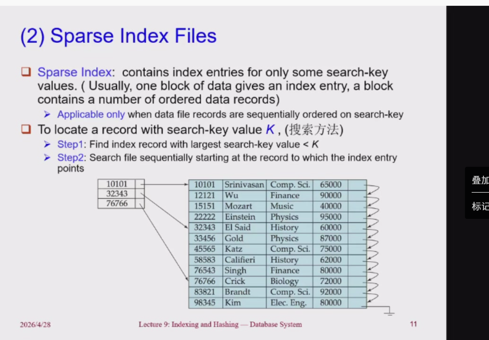
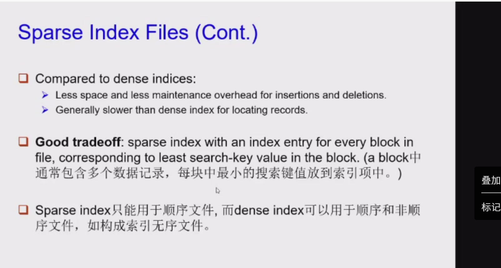
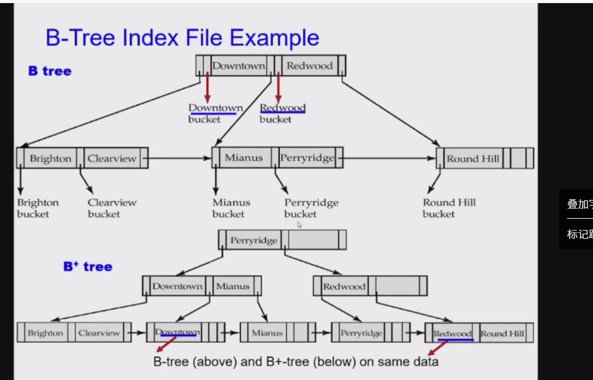
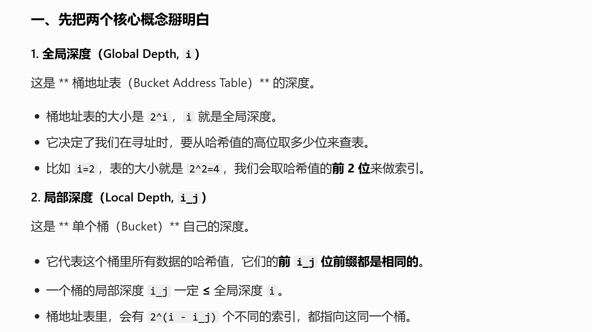
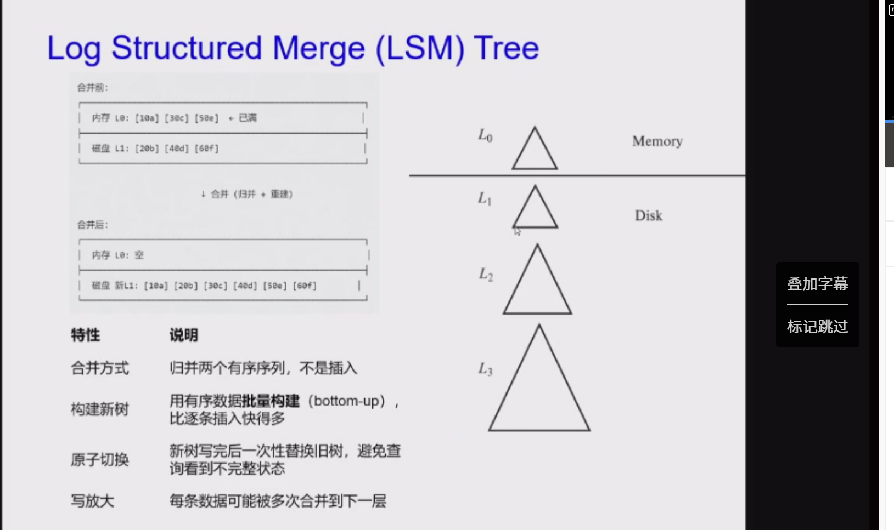

# 索引与哈希（Index and Hashing）

## 索引基础概念

这三张幻灯片是连贯的，完整讲了**数据库索引的基础概念、两大核心类型，以及如何评估索引的好坏**。我帮你按顺序拆解得明明白白👇

---

## 第一张：索引的基础概念（回顾+核心定义）

这张是给整个话题打地基，核心信息就5点：

1.  **为什么需要索引？**
    为了**加速数据访问**，避免每次都从头到尾扫一遍全表（就像查书不用翻完所有页，直接看目录）。

    - 例子：图书馆的作者目录，就是最典型的“索引”。
2.  **什么是Search Key（搜索键）？**
    你用来查找数据的字段（或字段组合），比如用“学号”找学生、用“作者名”找书，这个“学号/作者名”就是搜索键。

3.  **索引文件的本质结构**
    索引不是存完整数据，而是一条条「索引项（Index Entry）」，每条只有两部分：
    | search-key | pointer |
    |------------|---------|
    | 你要查的键值 | 指向原始数据的位置 |

4.  **索引文件的优势：体积小**
    因为只存键+指针，索引文件通常比原始数据文件小得多，这也是它能加速查询的关键之一。

---

## 第二张：索引的两大核心类型

这张讲的是：索引文件里的记录，是怎么组织的？主流分两类：

| 类型 | 核心特点 | 通俗理解 |
| :--- | :--- | :--- |
| **Ordered Index（顺序索引）** | 索引项按`search-key`的值**排序存储** | 就像按拼音排好的字典目录，是有序的 |
| **Hash Index（散列索引）** | 用「哈希函数」把键值均匀分到不同的“桶（buckets）”里 | 就像把不同姓氏的人分到不同的柜子里，用一个固定的规则决定谁进哪个柜子 |

---

## 第三张：索引的评估指标

这张讲的是：怎么判断一个索引好不好？看这几个关键维度：

1.  **支持的查询类型（Access types）**
    这是最核心的差异，幻灯片举了一个很关键的对比：

    - 等值查询（`WHERE Col = v`）：两种索引都支持得很好
    - 范围查询（`WHERE Col BETWEEN v1 AND v2`）：
      - ✅ 顺序索引：天生有序，找范围非常高效
      - ❌ 哈希索引：哈希打乱了顺序，不擅长范围查询
2.  **时间相关指标**
    - 访问时间（Access time）：查数据要花多久
    - 插入时间（Insertion time）：新增数据时，更新索引要花多久
    - 删除时间（Deletion time）：删除数据时，维护索引要花多久
3.  **空间开销（Space overhead）**
    索引本身要占多少磁盘/内存空间，不能为了快，搞一个体积比数据还大的索引。

4.  最后一句总结：**时间效率+空间效率**，是衡量索引技术的核心，也是数据库存储引擎的重点优化方向。

---

💡 一句话串起来：
索引是「键+指针」组成的小体积目录，按组织方式分有序和哈希两类；有序索引擅长范围查询，哈希索引更适合等值查询，选索引时要综合看查询支持、读写时间和空间开销。

## 顺序索引

这三张幻灯片，把**顺序索引（Ordered Indices）**的核心概念、分类和实例讲透了，我帮你按逻辑拆解一下：

---

## 第一张：顺序索引的基础概念 & 主索引（Primary Index）

这张先给你搭好顺序索引的基本框架：

1.  **Ordered index（顺序索引）的定义**
    索引项（Index entries）会按照`search-key`的值**有序存储**，比如图书馆按作者拼音排好的目录。

2.  **Sequentially ordered file（顺序排序文件）**
    原始数据文件里的记录，本身就是按某个`search-key`排好序的。

3.  **Primary index（主索引 / 聚集索引 Clustering index）**
    - 定义：和数据文件本身的排序顺序**完全相同**的索引。
    - 关键点：
      - 它的搜索键通常是主键（Primary key），但不是必须的。
      - 非顺序排序的文件，没有主索引（但表可以有主键）。
    - 延伸：带主索引的顺序文件，叫`Index-sequential file`（索引顺序文件）。

---

## 第二张：辅助索引（Secondary Index）& 顺序索引的两大类型

这张是主索引的补充，同时给顺序索引分了类：

1.  **Secondary index（辅助索引 / 非聚集索引 Non-clustering index）**
    - 定义：索引的排序顺序，和原始数据文件本身的排序顺序**不一样**。
    - 例子：数据文件按“学号”排序，你建了一个按“姓名”排序的索引，这个就是辅助索引。
2.  **顺序索引的两种实现方式**
    接下来要讲的就是：稠密索引（Dense index）和稀疏索引（Sparse index）。

---

## 第三张：稠密索引（Dense Index）的实例讲解

这张用图直接讲清了稠密索引是什么：

1.  **Dense index（稠密索引）的核心定义**
    对于数据文件里的**每一个`search-key`值**，在索引文件里都有一条对应的索引项。

2.  例子解析：
    - 右边是`instructor`表的数据，按`ID`排序存储。
    - 左边的索引文件里，每一个`ID`（比如`10101`、`12121`…）都有一条索引项，每个索引项都直接指向对应的数据记录。
    - 你可以看到，索引的条目数和数据记录数是**一一对应的**，这就是“稠密”的含义。

---

### 💡 帮你串起来理解

- 顺序索引，是按`search-key`有序存储的索引。
- 主索引（聚集索引）和数据文件排序顺序一致，辅助索引则不一致。
- 稠密索引是顺序索引的一种实现：**每个数据记录，都有对应的索引项**，查找效率高，但索引文件体积也更大。

## 稀疏索引





## 辅助索引/多级索引

这三张幻灯片，把**辅助索引（Secondary Index）和多级索引（Multilevel Index）**的核心概念、结构和问题都讲透了，我帮你按顺序拆解：

---

## 第一张：辅助索引（Secondary Indices）的引入

这张讲了为什么需要辅助索引，以及它的核心结构：

1.  **为什么需要辅助索引？**
    数据文件通常是按主索引的`search-key`（比如账号`account number`）排序的，但实际查询中，我们经常要按其他字段（比如余额`balance`）做条件查询。如果没有辅助索引，这类查询只能全表扫描，效率极低。

    - 例子：账户数据库按账号排序，现在要查“余额=700的所有账户”，或者“余额在500-800之间的账户”，就需要在`balance`字段上建辅助索引。
2.  **辅助索引的核心结构：桶（Bucket）**
    辅助索引的索引项结构是：

    - `search-key`（比如`balance`的值）
    - 指针指向一个`bucket`（桶），桶里装着所有拥有这个`search-key`值的记录的指针。
    这样就解决了“同一个`search-key`值对应多条记录”的问题，也避免了索引项重复。

---

## 第二张：辅助索引在`balance`字段上的实例

这张用图把上面的结构直观展示了出来：

- **左边**：索引文件，按`balance`的值有序排列（350、400、500、600、700…），每个值对应一条索引项。
- **中间**：`bucket`（桶），比如`balance=700`对应的桶里，装着3个指针，分别指向3条余额为700的账户记录。
- **右边**：原始数据文件，按账号`Acc-num`排序，不是按`balance`排序的。
- **关键说明**：辅助索引**不能用稀疏索引**，只能是稠密索引，因为数据文件的顺序和索引的顺序不一致，无法利用数据文件的有序性做跳跃扫描，必须为每个`search-key`值建入口，再通过桶找到所有对应记录。

---

## 第三张：多级索引（Multilevel Index）

这张解决的是**主索引太大，装不下内存**的问题：

1.  **问题**：当数据量非常大时，主索引文件也会变得很大，无法全部装入内存，每次查询都要多次读磁盘，效率很低。
2.  **解决方案：给索引建索引**
    把磁盘上的主索引文件，当成一个普通的顺序数据文件，再给它建一层**稀疏索引**：

    - `Outer index`（外层索引）：对主索引建的稀疏索引，可以装入内存。
    - `Inner index`（内层索引）：原来的主索引文件，存在磁盘上。
3.  **查询流程**：
    1.  先在内存里的外层稀疏索引里，二分找到目标键值所在的范围，拿到内层索引的磁盘位置；
    2.  读一次磁盘，加载内层索引的对应部分；
    3.  在内层索引里找到目标记录的指针，再读一次磁盘，拿到原始数据。
4.  **扩展**：如果外层索引还是太大，可以继续往上建更多层索引，形成多级索引结构。但注意：数据增删时，所有层级的索引都需要更新，维护成本会变高。

---

### 💡 一句话串起来理解

- **辅助索引**：给非排序字段建的索引，解决多条件查询的效率问题，用“桶”处理重复键值，只能是稠密索引。
- **多级索引**：给主索引再建一层稀疏索引，解决索引文件太大装不下内存的问题，减少磁盘I/O次数。

## 还有什么删除啊/插入啊

## B+树

这里看ppt

注意一个节点大小是一个block

## B-树索引文件（B-Tree Index Files）

这三张幻灯片详细讲解了 **B-树（B-Tree）** 索引的核心概念、与 B+ 树的对比以及它的优缺点。我帮你整理成结构化的笔记：

## 一、 B-树的核心特性（第一张）

1. **键值唯一性**：与 B+ 树类似，但 B-树允许**搜索键值（Search-key）仅出现一次**，消除了搜索键的冗余存储。
2. **非叶子节点带数据指针**：在 B-树中，非叶子节点里的搜索键绝对不会在树的其他地方再次出现。因此，在非叶子节点中，对于每个搜索键，都必须包含一个**额外的指针字段（$B_i$）**，直接指向对应的数据桶（Bucket）或文件记录。
3. **节点的泛化**：因为所有节点（包括内层节点）可能直接带有指向实际数据的指针，所以 B-树中的所有节点在某种意义上都可以看作是“泛化的叶子节点”。

## 二、 结构对比示例（B-树 vs B+树）（第二张）

幻灯片中的图例非常直观地展示了差异：

- **在 B-树中**：上层非叶子节点（例如存有 `Downtown` 和 `Redwood` 的节点）除了拥有向下查找的子树指针外，中间还多出了红色箭头（指针），**直接指向了对应的 `Downtown bucket` 和 `Redwood bucket` 数据桶**。
- **在 B+树中**：所有上方节点仅仅用来做导航路由，完全没有指向数据桶的指针。**所有指向实际数据桶的指针，全部都在最底层的叶子节点中**。



## 三、 B-树的优缺点分析（第三张）

### 优势 (Advantages)

1. **可能节省节点**：因为删除了重复的键值，B-树需要使用的节点总数理论上可能比对应的 B+ 树要少。
2. **可能提前命中**：在查找的时候，如果运气好，有可能在没到达底部叶子节点时，就在上层的非叶子节点中找到了目标搜索键，从而提前结束查询。

### 劣势 (Disadvantages)

1. **提前命中的概率极低**：实际中只有一小部分的搜索键值能被提前找到，这对整体性能的提升微乎其微。
2. **扇出（Fan-out）降低，树变得更深**：这是最致命的缺点！因为非叶子节点不仅要存键和子树指针，还要存放直接指向数据的额外指针，导致单节点体积变大，单个节点能容纳的分支数（扇出）大大减少。在同样的数据量下，**B-树的深度通常会比对应的 B+ 树更大**，这意味着需要更多次的磁盘 I/O 才能查到底层数据。
3. **操作更复杂**：数据的插入和删除操作由于涉及到各种节点的数据指针移动，逻辑上比 B+ 树复杂得多。
4. **工程实现困难**：代码实现难度大。

### 💡 结论总结 (Conclusion)

综合来看，**B-树的优点完全抵不过它的缺点（Advantages do not outweigh disadvantages）**。这也是为什么我们在关系型数据库的实际工程应用中（如 MySQL 的 InnoDB 引擎），看到的几乎清一色都是 B+ 树的变种，而不是原生的 B-树。

## 静态哈希与哈希索引（Static Hashing & Hash Indices）

这四张幻灯片详细介绍了**静态哈希机制**、**哈希函数的评估标准**、**桶溢出的处理**以及**哈希索引的本质**。以下是为你整理的核心笔记：

## 一、 静态哈希基础（Static Hashing）

哈希文件组织（Hash file organization）是一种通过计算直接定位数据位置的方法，核心概念如下：

1. **桶（Bucket）**：存储记录的基本单位，通常对应磁盘上的一个物理块（Disk block）。一个桶可以包含一条或多条记录。
2. **哈希计算定位**：不需要像树那样逐层查找，我们可以利用一个**哈希函数（Hash function）**，直接从记录的 `search-key` 算出它应该存在哪一个桶里。
3. **哈希函数 $h$**：是一个数学映射，它的输入是所有可能的 `search-key` 集合 $K$，输出是所有的桶地址集合 $B$。
4. **全生命周期适用**：不仅是查询（access），在插入（insertion）和删除（deletion）时，都要用同一个哈希函数来定位。
5. **哈希冲突**：由于输入集远远大于输出集，**不同的 `search-key` 很可能被映射到同一个桶里**。因此，计算出桶地址后，在桶内还得进行一次顺序查找（Sequential search），把目标记录从桶里揪出来。

## 二、 哈希函数的评估标准（Hash Functions）

怎么判断一个哈希函数好不好？主要看它能不能把数据“均匀且随机”地打散：

1. **最差的哈希函数**：把所有的键值都映射到了同一个桶里。这就退化成了暴力的全表顺序扫描，访问时间直接与文件里的记录条数成正比（极慢）。
2. **理想的哈希函数标准**：
   - **均匀性（Uniform）**：不管你的键值范围有多大，函数能给每一个桶平均分配差不多数量的可能的 `search-key`。
   - **随机性（Random）**：它不依赖数据实际的规律（分布）。不管你实际存进来的键值长什么样，哪怕长得很像，也能被随机打散，使得实际每个桶分到的记录数差不多。
3. **典型实现方式**：
   - 通常会对 `search-key` 二进制形式进行各种位运算。
   - 比如：如果是字符串类型的键，可以提取每个字符的二进制表示，把它们全加起来，然后对总桶数进行**取模（modulo）**运算，余数就是桶地址。

## 三、 桶溢出的处理（Handling of Bucket Overflows）

当一个桶塞满了，又有新记录要往里放的时候，就发生了**桶溢出（Bucket overflow）**。

1. **溢出的原因**（两大类）：
   - **桶不够用（Insufficient buckets）**：预设的桶的总数太少了，数据太多装不下。
   - **数据分布倾斜（Skew in distribution of records）**，这又可能由两点导致：
     - ① 有大量记录使用了同样的 `search-key`（比如你要按“性别”做哈希，那大概率男女各占一大半，这就严重倾斜了）。
     - ② 哈希函数没选好，算出来的数据扎堆了（分布不均匀）。
2. **如何处理？**
   - 幻灯片明确指出：虽然我们可以通过增加桶数、优化函数来**降低（reduce）**溢出概率，但它在静态哈希中是**无法彻底消除（cannot be eliminated）**的。
   - **解决办法**：使用 **溢出桶（Overflow buckets）**。如果原桶满了，就再拉一个新桶挂在它后面（有点像哈希表中的拉链法解决冲突），存不下的数据全放到溢出桶里。

## 四、 哈希索引（Hash Indices）

最后阐明了哈希作为“索引”时的严格定义：

1. **哈希不仅用于组织原文物理文件**，也完全可以用来单独建一套**索引结构**。
2. 哈希索引文件里面存的是什么？存的是：通过哈希组织的 `search-key`，加上指向它们所关联的原始数据记录的**指针（record pointers）**。
3. **为什么哈希索引本质上总是辅助索引（Secondary indices）？**
   - 严格来说，如果你的数据库主数据文件本身就是用哈希方式组织的（即数据记录自带基于该键的哈希分布），那你根本不需要再建一个一模一样的“主哈希索引”，毫无意义。
   - 那我们要专门建的“哈希索引文件”，通常是为主数据以外的**其他键**建立的额外数据结构，因此它也就是辅助索引。
   - 但在平时口语交流中，“哈希索引”这个词是可以用来统称“在辅助索引结构中使用哈希”和“本身就是哈希组织的文件”的。

## 动态haxish（Dynamic Hashing）

这几页PPT讲的是数据库里的**可扩展哈希（Extendable Hashing）**，它是**动态哈希（Dynamic Hashing）**的一种实现方式，专门解决普通静态哈希在数据量变化时的性能和空间问题。

---

## 一、核心背景：为什么需要动态哈希？

普通静态哈希（比如固定大小的哈希表）有两个痛点：

1.  数据量涨了，桶（bucket）装不下，只能用溢出链，查询性能会退化；
2.  数据量缩了，哈希表空着一大片，空间浪费严重。

**动态哈希**就是为了让哈希表能跟着数据量自动“长大”或“缩小”，而**可扩展哈希**是其中最经典的方案之一。

---

## 二、可扩展哈希的核心原理

### 1. 关键组件

- **哈希函数**：固定生成一个很长的二进制数（比如32位），不用改函数本身，而是只取它的**前缀**来寻址。
- **桶地址表（Bucket Address Table）**：一个数组，大小是`2^i`，`i`是当前的“全局深度”。每个元素指向一个数据桶。
- **数据桶（Bucket）**：真正存数据的地方，每个桶有自己的“局部深度”`i_j`，表示它的所有数据的哈希前缀前`i_j`位都相同。

### 2. 寻址过程（查找/插入）

1.  计算键的哈希值，得到一个32位二进制数；
2.  取哈希值的前`i`位（`i`是当前全局深度），作为桶地址表的索引；
3.  用索引找到表中的指针，再跳转到对应的桶里操作数据。

---

## 三、核心操作详解

### 1. 插入与桶分裂

- 如果桶还有空间，直接插入数据；
- 如果桶满了，就需要**分裂桶**：
  1.  把桶的局部深度`i_j`加1；
  2.  把桶里的所有数据，按哈希值的第`i_j`位分成两组；
  3.  原来的桶保留一组数据，新建一个桶存另一组；
  4.  如果`i_j`超过了全局深度`i`，就把桶地址表扩容（全局深度加1，表大小翻倍），并让新的表项指向对应的桶。

### 2. 删除与桶合并（Coalescing）

- 数据被删除后，如果桶空了，可以和它的“伙伴桶”（局部深度相同、且前缀只有最后一位不同的桶）合并；
- 合并后桶的局部深度减1，如果所有桶的局部深度都比全局深度小很多，还可以把桶地址表缩小（全局深度减1，表大小减半），节省空间。

---

## 四、结合例子一步步理解

以PPT里的银行支行数据为例：

1.  **初始状态**：全局深度`i=0`，桶地址表大小是`2^0=1`，只有一个表项指向一个桶，局部深度`i_j=0`。
2.  **插入Brighton和两个Downtown记录**：
    - Brighton的哈希前缀是`0`，Downtown的前缀是`1`；
    - 插入两个Downtown后，桶满了，触发分裂：
      - 全局深度变成`i=1`，桶地址表大小翻倍为`2`；
      - 两个表项分别指向两个桶，一个存Brighton（前缀`0`），一个存Downtown（前缀`1`），两个桶的局部深度都是`1`。
3.  **插入Mianus记录**：
    - Mianus的哈希前缀是`11`，但当前全局深度是`1`，只能区分`0`和`1`；
    - 插入到Downtown的桶后，桶又满了，再次触发分裂：
      - 全局深度变成`i=2`，桶地址表大小翻倍为`4`；
      - 新的表项指向Mianus的桶（前缀`11`），原来的Downtown桶对应前缀`10`；
      - Brighton的桶对应前缀`00`和`01`（因为它的局部深度还是`1`，所以两个表项都指向它）。

---

## 五、优缺点总结

| 优点 | 缺点 |
| :--- | :--- |
| 自动扩容/缩容，适应数据量变化 | 桶地址表扩容时，需要复制表项，有少量开销 |
| 数据量变化时，查询性能始终稳定 | 桶合并操作比较复杂，通常只有数据量大幅下降时才做 |
| 没有长溢出链，查询效率高 | 当全局深度很大时，桶地址表会占用较多内存 |

---

## 一句话总结

可扩展哈希的核心就是**用“哈希前缀+桶地址表”的方式，让哈希表能自动伸缩，桶里的数据按前缀分组，满了就分裂，空了就合并，全程不用改哈希函数本身**。



## LSM树

这两页PPT讲的是数据库里的 **LSM树（Log-Structured Merge Tree，日志结构合并树）**，它是一种专门为**高写入吞吐**优化的索引结构，现在像LevelDB、RocksDB、Cassandra、HBase这些存储系统都在用它。

---

## 一、核心工作原理（第一页）

LSM树的核心思想是：**先写内存，再批量合并写磁盘**，避免传统B+树的随机写开销。

1.  **内存层（L₀树）**
    - 所有新的插入/更新，先写到内存里的有序结构（比如跳表或小B+树），叫`L₀`树。
    - 写入是纯内存操作，速度极快，没有磁盘I/O。

2.  **磁盘层（L₁, L₂, L₃…树）**
    - 当`L₀`树写满了，会被一次性**批量合并**到磁盘上的`L₁`树中。这个过程用的是**顺序I/O**，效率很高。
    - 当`L₁`树的大小超过某个阈值，它会和`L₂`树合并，生成更大的`L₂`树。
    - 以此类推，每一层的大小阈值都是上一层的`k`倍（比如10倍），越往下的树越大、越稳定。

---

## 二、优缺点总结（第二页）

### ✅ 优点

1.  **写入性能极强**：
    - 大部分写入是内存操作，刷盘时用的是顺序I/O，比B+树的随机写快得多。
    - 叶子节点都是满的，几乎没有空间浪费。
2.  **写入放大可控**：在一定数据量下，每次插入的平均I/O次数比传统B+树少。

### ❌ 缺点

1.  **查询成本更高**：
    - 要找一个键，可能需要从`L₀`一直查到最底层的磁盘树，最多要查N个结构。
    - 所以实际实现中，会用**布隆过滤器（Bloom Filter）**来快速判断键是否存在于某一层，避免不必要的磁盘读取。
2.  **合并开销（Compaction）**：
    - 每次层间合并，都要把上一层和当前层的所有数据重新排序、写入，会产生写放大（Write Amplification）。

---

## 三、补充：Stepped-merge index（阶梯合并索引）

这是LSM树的一个变体：

- 每一层不再只有一棵树，而是有多棵小一点的树。
- 好处：合并时只需要合并部分数据，写放大比原版LSM树更小。
- 坏处：查询时要查更多的树，所以更依赖布隆过滤器来优化查询效率。

---

## 一句话总结

LSM树本质上是**用“批量顺序写”和“多轮合并”，换取了远超B+树的写入性能，代价是查询时需要逐层查找，以及后台合并带来的写放大**。



## 其他

这几页PPT讲的是 **SQL中的索引定义** 和 **多键查询（Multi-Key Access）的几种优化方式**，我们一页一页拆开来聊，你就能完全看懂了。

---

## 一、第1页：SQL里怎么定义索引

这页是最基础的SQL索引语法，告诉你怎么创建、删除索引。

### 1. 创建普通索引

语法：

```sql
CREATE INDEX <index-name> ON <table-name> (<attribute-list>);
```

例子：

- `CREATE INDEX b-index ON branch(branch-name);`
  给`branch`表的`branch-name`列建一个叫`b-index`的索引。

- `CREATE INDEX cust-strt-city-index ON customer (customer-city, customer-street);`
  给`customer`表的`customer-city`和`customer-street`两列建一个**联合索引**。

### 2. 创建唯一索引

语法：

```sql
CREATE UNIQUE INDEX <index-name> ON <table-name> (<attribute-list>);
```

例子：
`CREATE UNIQUE INDEX uni-acnt-index ON account(account-number);`

- 作用：强制要求`account-number`列的值唯一，不能重复，相当于间接实现了候选键（Candidate Key）的约束。
- 注意：如果你的SQL表已经定义了`UNIQUE`完整性约束，就不用再单独建唯一索引了，数据库会自动处理。

### 3. 删除索引

语法：

```sql
DROP INDEX <index-name>;
```

直接按索引名删掉就行。

---

## 二、第2页：多键查询的三种策略

这页讲的是，当`WHERE`条件里有多个字段时，数据库怎么用索引来优化查询。

以这条SQL为例：

```sql
SELECT account-number
FROM account
WHERE branch-name = 'Perryridge' AND balance = 1000;
```

假设你分别给`branch-name`和`balance`各建了一个单列索引，有三种处理方式：

1.  **先查一个索引，再过滤另一个条件**
    - 比如先查`branch-name`索引，找到所有`Perryridge`的账户，再一个个检查它们的`balance`是不是1000。
    - 缺点：如果`Perryridge`的账户很多，过滤的成本会很高。

2.  **换个顺序，先查balance索引，再过滤branch-name**
    - 逻辑和上面一样，只是顺序反过来。哪个过滤后的数据更少，就选哪个顺序，性能会更好。

3.  **两个索引结果做交集（Intersection）**
    - 先用`branch-name`索引拿到所有符合条件的记录指针集合A；
    - 再用`balance`索引拿到所有符合条件的记录指针集合B；
    - 最后求A和B的交集，就是同时满足两个条件的记录。
    - 缺点：实现复杂，而且两次索引查找本身也有开销。

---

## 三、第3页：方案1——多属性联合索引

这页讲的是，用**联合索引（Composite Index）**来优化多条件查询。

### 核心思想

把多个字段合在一起建索引，比如给`(branch-name, balance)`建索引。

- 这样的索引是按`branch-name`排序，再按`balance`排序的，所以：
  - `WHERE branch-name = 'Perryridge' AND balance = 1000`：可以直接在索引里找到所有符合条件的记录，效率极高。
  - `WHERE branch-name = 'Perryridge' AND balance < 1000`：也能高效处理，因为`branch-name`是等值条件，后面的`balance`范围条件可以在索引里直接扫。
  - `WHERE branch-name < 'Perryridge' AND balance = 1000`：**效率很低**，因为`branch-name`是范围条件，后面的`balance`等值条件无法被索引利用，只能把所有`branch-name < 'Perryridge'`的记录都找出来再过滤。

### 一句话总结

联合索引的关键是**“前缀等值，后缀范围”**，前面的字段最好用等值条件，后面的字段再用范围条件，才能发挥索引的最大作用。

---

## 四、第4页：方案2——Grid Files（网格文件）

这是另一种专门为多键查询设计的索引结构，和联合索引思路不一样。

### 核心思想

- 它用一个**多维网格（Grid Array）**来组织数据，维度和你查询的字段数一样。
- 每个字段都有一个线性刻度（Linear Scale），把字段的值映射到网格的一个维度上。
- 每个网格单元（Cell）指向一个存储桶（Bucket），可以多个单元指向同一个桶，节省空间。

### 怎么用它查询？

比如你要查`branch-name = 'Perryridge' AND balance = 1000`：

1.  用`branch-name`的刻度找到它对应的行；
2.  用`balance`的刻度找到它对应的列；
3.  找到网格中这个行和列交叉的单元，跟着指针就能直接找到对应的桶里的数据。

### 适用场景

适合处理各种复杂的多条件查询，不管是等值还是范围条件，都能高效定位，不像联合索引那样受条件顺序的限制。

---

## 最后帮你总结一下

这几页讲的是处理多键查询的三种方式：

1.  用多个单列索引，做过滤或交集；
2.  用联合索引，适合前缀等值的条件；
3.  用Grid Files，多维网格结构，处理复杂多条件查询更灵活。

这几页PPT讲的是数据库里处理**多键查询（Multi-Key Query）**的两种专门优化方案：**Grid File（网格文件）** 和 **Bitmap Index（位图索引）**，我们一个个讲清楚，你就能明白它们分别解决什么问题、怎么用。

---

## 一、第一页：Grid File（网格文件）例子

这页用`account`表举例，展示了Grid File的工作原理。

### 核心结构

它用一个**二维网格（Grid Array）**来组织数据，维度和查询的字段数一致：

- **X轴（列）**：对应`balance`（余额），按1K、2K、5K、10K…分了6个区间（1-6）。
- **Y轴（行）**：对应`branch-name`（支行名），Central、Mianus、Perryridge、Townsend分别对应1-4行。
- 网格里的每个单元格，都指向一个存储桶（Bucket）。多个单元格可以指向同一个桶，节省空间。

### 怎么查询？

比如你要查 `branch-name = "Perryridge" AND balance = 5000`：

1.  用`branch-name`的刻度找到它对应的行（3）；
2.  用`balance`的刻度找到它对应的列（3，对应5K）；
3.  定位到网格的(3,3)单元格，跟着指针直接找到对应的桶里的数据。

### 特点

- 适合处理各种多条件查询，不管是等值还是范围条件；
- 不像联合索引那样受“最左匹配”限制，查询顺序不影响效率。

---

## 二、第2-5页：Bitmap Index（位图索引）

这部分讲的是专门为**低基数字段（distinct值少）**设计的索引结构，比如性别、地区、收入等级。

### 1. 核心原理

- 给表的每一行记录一个唯一的行号（0,1,2,3,4…）；
- 对字段的每个不同值，生成一个**位图（Bitmap）**：
  - 位图是一个由0和1组成的数组，长度等于表的总行数；
  - 某一位是`1`，表示这一行的字段值等于当前值；
  - 某一位是`0`，表示不等于。

比如PPT里的例子：
| 行号 | gender | income-level |
|---|---|---|
| 0 | m | L1 |
| 1 | f | L2 |
| 2 | f | L1 |
| 3 | m | L4 |
| 4 | f | L3 |

生成的位图是：

- `gender='m'`：`1 0 0 1 0`（行0和3是1）
- `gender='f'`：`0 1 1 0 1`（行1、2、4是1）
- `income-level='L1'`：`1 0 1 0 0`（行0和2是1）

### 2. 多条件查询的魔法：位运算

多条件查询可以直接对位图做**与（AND）、或（OR）、非（NOT）**运算，结果就是符合所有条件的行号集合。

比如查询：`gender='m' AND income-level='L1'`

- `m`的位图：`10010`
- `L1`的位图：`10100`
- 两者按位与：`10010 AND 10100 = 10000`
- 结果`10000`表示：只有行0同时满足两个条件，直接取这一行数据即可。

### 3. 优缺点与注意事项

✅ **优点**：

- 处理多条件查询极快，位运算都是CPU级别的高效操作；
- 索引本身占用空间极小，比如一个有8个distinct值的字段，索引大小通常只有表的1%。

❌ **缺点与限制**：

- 只适合低基数字段（比如性别只有2个值），如果distinct值太多，位图数量会爆炸，失去优势；
- 更新/删除数据时，需要修改多个位图的对应位，开销较大；
- 处理删除时需要额外的“存在位图（Existence Bitmap）”，标记哪些行是有效的，避免误查已删除的数据。

---

## 一句话总结

- **Grid File**：用多维网格定位数据，适合各种多条件查询，不受条件顺序限制；
- **Bitmap Index**：用0/1位图和位运算处理多条件查询，极快但只适合低基数字段。
