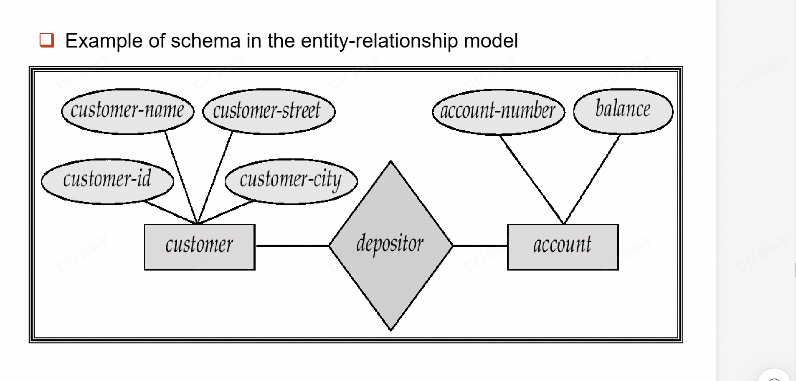
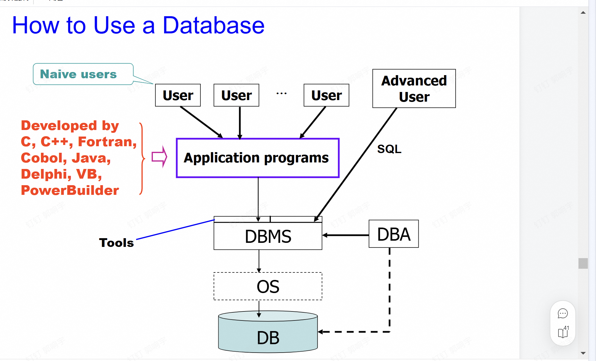

# 数据库系统导论

## 什么是数据库系统？

*   **数据库 (Database):** 物理上是一个非常庞大、集成的数据集合。
*   **建模现实世界的企业 (Enterprise):**
    *   **实体 (Entities):** 比如团队、公司。
    *   **关系 (Relationships):** 比如“爱国者队正在参加超级碗比赛”。
    *   **动态组件:** 最近也包括业务逻辑等活动组件。
*   **数据库管理系统 (DBMS):** 一种用于**存储、管理和方便访问**数据库的软件系统。

## 数据库应用

*   **重要性:** 数据处理与管理是计算机应用中最重要的领域。
*   **典型应用场景:**
    *   **银行业:** 处理所有交易。
    *   **航空公司:** 预订、航班时刻表。
    *   **大学:** 注册、成绩管理。
    *   **销售:** 客户、产品、购买记录。
    *   **制造业:** 生产、库存、订单、供应链。
    *   **人力资源:** 员工记录、薪水、税收减免。
*   **无处不在:** 数据库触及我们生活的方方面面，尽管它们通常在后台运行（不可见）。

## 为什么学习数据库？

*   **建模与设计:**
    *   通过从现实世界抽象出数据模型，并将其转化为适用于目标数据库管理系统 (DBMS) 的形式（如**表 Tables**、**视图 Views**）。
*   **编程与开发:**
    *   使用数据库进行数据的查询与更新。
    *   **SQL:** 被誉为“星际通用的数据语言” (Intergalactic data-speak)。

## 什么是数据库？

*   **数据库 (Database):**
    *   与一个企业相关的**相互关联的数据**的集合。
    *   一个大型的、**集成且持久**的数据集合 [R. Ramakrishnan, J. Gehrhe]。
    *   存在于很长一段时间（通常是很多年）的信息集合 [Ullman]。
    *   长期存储在计算机内、有组织的、可共享的数据集合 [萨师煊，王珊]。
*   **数据库管理系统 (DBMS):**
    *   **数据库** + **一套程序**，用于访问、更新和管理数据库中的数据。

## DBMS 的特征

*   数据访问的**高效性与可扩展性**。
*   缩短应用开发时间。
*   **数据独立性**（包括物理数据独立性和逻辑数据独立性）。
*   数据完整性与安全性。
*   **并发访问**与健壮性（即恢复能力）。

## 文件处理系统

文件处理系统是由传统操作系统（OS）支持的，具有以下特点：

- 如果有需要，必须编写新的应用程序，并根据需要创建新的数据文件。
- 随着时间的推移，数据文件可能会采用**不同的格式**。
- 数据文件之间是**相互独立**的。

## 文件处理系统的缺点

1. **数据冗余和不一致性**
   - 存在多种文件格式，不同文件中信息可能重复。
2. **数据访问困难**
   - 每次执行新任务时都需要编写新的程序。
3. **数据隔离**
   - 数据分散在多个文件和多种格式中，难以检索和共享。
4. **完整性问题**
   - 完整性约束（例如账户余额 > 0）成为程序代码的一部分。
   - 很难添加新的约束或更改现有约束。
5. **更新缺乏原子性**
   - 失败可能导致数据库处于不一致状态，部分更新可能被执行。例如，从一个账户转账到另一个账户时，要么完全完成，要么完全不发生。
6. **多用户并发访问困难**
   - 并发访问对性能是必要的。
   - 不受控制的并发访问可能导致不一致，例如两个人同时读取余额并更新。
7. **安全性问题**
   - 需要确保“正确的人使用正确的数据”。

**数据库系统可以解决上述所有问题！**

## 数据抽象的层次

在使用数据库时，不同的使用需求需要不同层次的抽象。主要分为以下三个层次：

1. **物理层 (Physical level):**
   - 描述记录是如何存储的。
   - 例如，数据在磁盘上的存储方式。

2. **逻辑层 (Logical level):**
   - 描述存储在数据库中的数据，以及数据之间的关系。
   - 逻辑层与物理层的对比示例：

     ```text
     type instructor = record
         ID: string;
         name: string;
         dept_name: string;
         salary: integer;
     end
     ```

3. **视图层 (View level):**
   - 应用程序隐藏数据类型的细节。
   - **注意：** 视图还可以隐藏信息（例如，员工的工资）以实现安全目的.

## 数据独立性

**数据独立性**是数据库管理系统（DBMS）的一个重要特性，指的是应用程序与数据存储方式之间的解耦。它确保了数据的存储方式或逻辑结构发生变化时，应用程序无需做出相应的修改。

数据独立性分为两种主要类型：

1. **物理数据独立性（Physical Data Independence）**
   - **定义：** 物理数据独立性指的是数据的物理存储方式发生变化时，不会影响逻辑层的数据结构或应用程序。
   - **示例：** 如果将数据从一个磁盘移动到另一个磁盘，或者改变数据的存储格式（如从顺序存储改为索引存储），逻辑层和视图层的用户无需感知这些变化。
   - **意义：** 提高了存储管理的灵活性。

2. **逻辑数据独立性（Logical Data Independence）**
   - **定义：** 逻辑数据独立性指的是数据库的逻辑结构（如表的字段或关系）发生变化时，不会影响视图层的应用程序。
   - **示例：** 如果在数据库中添加一个新字段或删除一个字段，只要这些变化不影响视图层定义，应用程序就无需修改。
   - **意义：** 提高了数据库的可扩展性和维护性。

**总结：** 数据独立性通过分离数据的物理存储、逻辑结构和用户视图，减少了数据变化对应用程序的影响，从而提高了系统的灵活性和可维护性。

## 数据模型 (Data Models)

数据模型是用于描述以下内容的抽象工具集合：

- **数据结构 (Data structure)**
- **数据关系 (Data relationships)**
- **数据语义 (Data semantics)**
- **数据约束 (Data constraints)**

### 数据库设计的步骤与模型

不同层次的数据抽象需要不同的数据模型来描述：

- **概念设计 (Conceptual design):** 使用 **实体-联系模型 (Entity-Relationship model)**。
- **逻辑设计 (Logical design):** 使用 **关系模型 (Relational model)**。
- **其他模型:**
    *   面向对象模型 (Object-oriented model)
    *   半结构化数据模型 (XML)
    *   早期模型：网状模型、层次模型等。

## 数据定义语言 (DDL)

**数据定义语言 (Data Definition Language)** 用于指定数据库模式：

- 定义一组**关系模式 (Relational schema)**。
- 指定**存储结构、访问方法**以及**一致性约束**。
- DDL 语句经过编译后，会产生一组存储在特殊文件（**数据字典 Data Dictionary**）中的表。

### 数据字典 (Data Dictionary)

包含关于数据的元数据 (Metadata)：

- **数据库模式 (Database schema)**
- **完整性约束 (Integrity constraints):**
    *   主键 (Primary Key)
    *   参照完整性 (Referential integrity)
- **授权 (Authorization)**

示例：

```sql
CREATE TABLE account (
    account_number char(10),
    balance integer
);
```

## 数据操纵语言 (DML)

**数据操纵语言 (Data Manipulation Language)** 也称为**查询语言 (Query Language)**：

- **检索**数据库中的数据。
- **插入 / 删除 / 更新**数据库中的数据。

### DML 的分类

1. **过程化 DML (Procedural DML):** 用户指定需要什么数据以及**如何获取**这些数据（如 C, Java 等）。
2. **声明式 DML (Nonprocedural DML):** 用户指定需要什么数据，而**无需说明如何获取**（如 SQL, Prolog 等）。

## SQL (Structured Query Language)

SQL 是目前使用最广泛的查询语言，它是 DDL、DML 和 DCL 的结合。

- **特点:** 基于集合的、声明式的。

### 示例

1. **查找 ID 为 '192-83-7465' 的客户姓名:**

   ```sql
   SELECT customer.customer-name
   FROM customer
   WHERE customer.customer-id = '192-83-7465';
   ```

2. **查找 ID 为 '192-83-7465' 的客户所持有的所有账户余额:**

   ```sql
   SELECT account.balance
   FROM depositor, account
   WHERE depositor.customer-id = '192-83-7465' AND
         depositor.account-number = account.account-number;
   ```

## 数据库设计与模型

### 实体-联系 (E-R) 模型

E-R 模型是现实世界的一种抽象表示，主要用于数据库的概念设计：

- **实体 (Entities / Objects):** 现实世界中的对象。
    *   例如：客户 (Customers)、账户 (Accounts)、银行分行 (Bank branch)。
    *   实体由一组**属性 (Attributes)** 来描述。
- **联系 (Relationships):** 实体之间的关联。
    *   例如：账户 `A-101` 由客户 `Johnson` 持有。
    *   **联系集 (Relationship set)** `depositor` 将客户与账户关联起来。

**特点：**

- E-R 模型由 **Peter Chen** 首先提出。
- 在数据库设计中，通常先建立 E-R 模型，然后再将其转化为**关系模型**。



### 关系模型 (Relational Model)

关系模型将数据组织成表格形式，是目前最主流的逻辑模型。

**基本组成概念：**

- **关系模式 (Schema):** 表的结构定义（如列名）。
- **属性 (Attributes):** 表中的列。
- **元组 (Tuple):** 表中的行（即一条记录）。

**示例：客户信息表 (Customer Table)**

| Customer-id | customer-name | customer-street | customer-city |
| :--- | :--- | :--- | :--- |
| 192-83-7465 | Johnson | Alma | Palo Alto |
| 019-28-3746 | Smith | North | Rye |
| 192-83-7465 | Johnson | Alma | Palo Alto |
| 321-12-3123 | Jones | Main | Harrison |
| 019-28-3746 | Smith | North | Rye |

## 使用者


