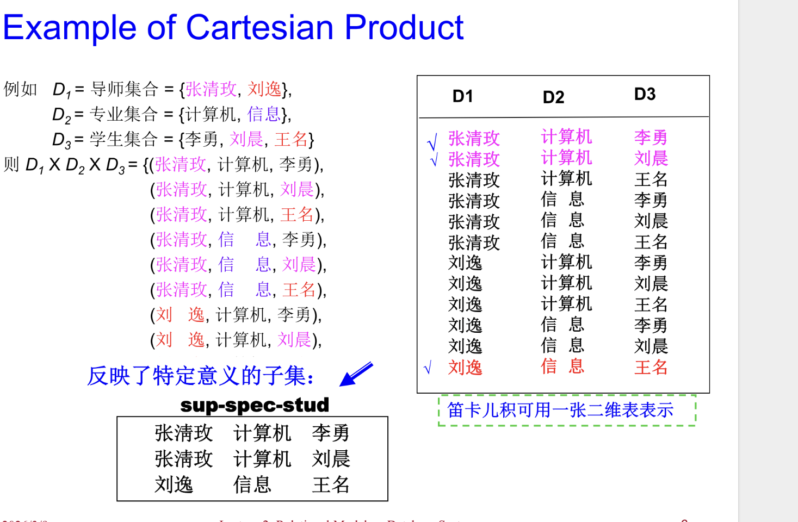
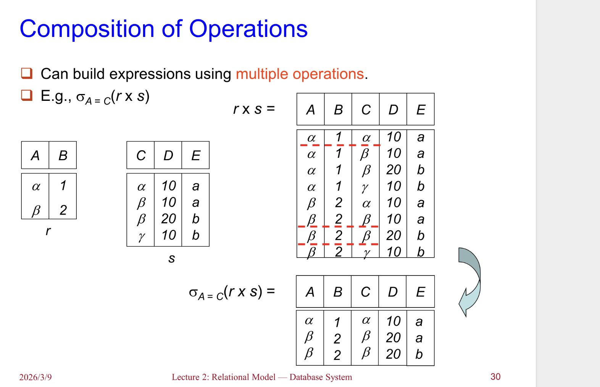
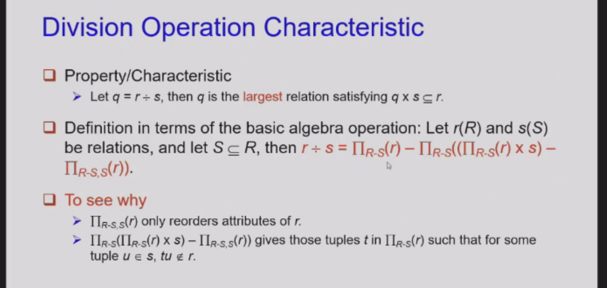
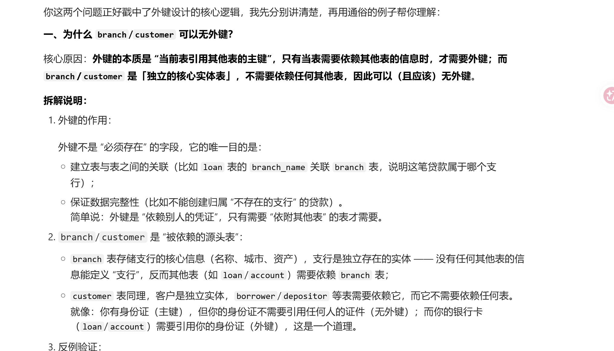
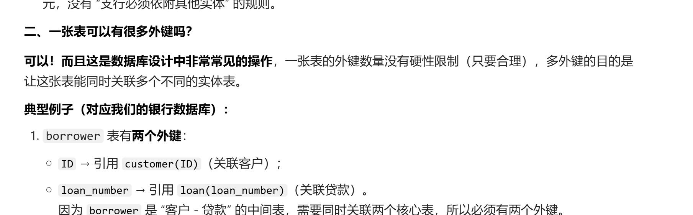

# 关系模型

## 基本结构 (Basic Structure)

- **形式化定义**：给定集合 $D_1, D_2, \dots, D_n$ ($D_i = \{a_{ij} \mid j=1 \dots k\}$)，关系 $r$ 是 $D_1 \times D_2 \times \dots \times D_n$ 的子集。
    - --- 即域 $D_i$ 的**笛卡儿积** (Cartesian product)。
- 因此，一个**关系**是一个 **$n$ 元组** $(a_{1j}, a_{2j}, \dots, a_{nj})$ 的集合，其中每个 $a_{ij} \in D_i$ ($i \in [1, n]$)。
- **示例**：
    - 关系 `sup-spec-stud`：
        - {张清玫教授, 计算机, 李勇}
        - {张清玫教授, 计算机, 刘晨}
        - {刘逸教授, 信息, 王名}

存储在数据库中的是有意义的子集

## 属性类型 (Attribute Types)

属性就是一列的那个头 比如性别 年龄这种

- 每个属性都有一个**名称** (Name)。
- 每个属性允许取值的集合称为该属性的**域** (Domain)。
- **原子性**：属性值通常要求是**原子的** (Atomic)，即不可再分的。
    - --- **第一范式 (1st NF)** 的要求。
    - 例如：多值属性 (Multivalued attribute) 和 复合属性 (Composite attribute) 是非原子的。
- **空值 (Null)**：
    - 特殊值 `null` 是每个域的成员。
    - `null` 会导致各种操作的复杂化。
    - *注：暂时忽略空值的影响，后续讨论。*

## 关系相关概念 (Concepts about Relation)

关系涉及两个核心概念：**关系模式 (Relation Schema)** 和 **关系实例 (Relation Instance)**。

### 1. 关系模式 (Relation Schema)

- **定义**：描述关系的结构。
- **形式化表示**：假设 $A_1, A_2, \dots, A_n$ 是属性，则 $R = (A_1, A_2, \dots, A_n)$ 是一个关系模式。
- **示例**：`instructor = (ID, name, dept_name, salary)`。
- $r(R)$ 表示在模式 $R$ 上的一个关系。
    - 例如：`instructor(ID, name, dept_name, salary)`。

### 2. 关系实例 (Relation Instance)

- **定义**：对应于关系在某一特定时刻的**快照** (Snapshot)。
- 关系实例通常由一张**表** (Table) 指定。
- **元组 (Tuple)**：关系 $r$ 的一个元素 $t$ 是一个元组，表现为表中的一**行** (Row)。
- **属性 (Attribute)**：表现为表中的一**列** (Column)。
- **表示**：若 $t$ 是一个元组，则 $t[name]$ 表示元组 $t$ 在 `name` 属性上的值。

### 3. 类比：数据库 vs 程序设计

| 程序设计概念 | 数据库概念 |
| :--- | :--- |
| 变量 (Variable) | 关系 (Relation) |
| 变量类型 (Type) | 关系模式 (Relation Schema) |
| 变量的值 (Value) | 关系实例 (Relation Instance) |

## 关系的特性 (The Properties of Relation)

1. **元组的顺序是无关的**：元组可以按任意顺序存储。
2. **没有重复的元组**。
3. **属性值是原子的** (Atomic)。

## 数据库 (Database)

- 一个数据库由**多个关系**组成。
- 企业（如大学）的信息应被合理拆分：
    - `Instructor`, `Student`, `Advisor` 等。
- **坏的设计 (Bad design)**：
    - 将所有属性堆在一个大表里，如 `univ (instructor-ID, name, dept_name, salary, student_Id, ...)`。
    - **后果**：信息冗余（重复存储）、需要过多空值 (Null)。
- **规范化理论 (Normalization theory)**：指导如何设计“好的”关系模式（通常在第 7 章讨论）。

## 码/键 (Key)

设 $K \subseteq R$：

- **超码 (Superkey)**：若 $K$ 的取值足以**唯一标识**关系 $r(R)$ 中的每个元组，则 $K$ 是 $R$ 的超码。
    - 例如：`{ID}` 是超码，`{ID, name}` 也是 `instructor` 的超码。
- **候选码 (Candidate key)**：**最小的超码**（即该超码的任何真子集都不是超码）。
    - 例如：`{ID}` 是候选码，因其没有可以构成超码的子集。
- **主码 (Primary key)**：由用户显式定义的候选码，通常在模式中用**下划线**标识。

## 外键 (Foreign Key)

假设存在关系 $r$ 和 $s$：$r(\underline{A}, B, C)$, $s(\underline{B}, D)$。

- 属性 $B$ 在关系 $r$ 中是**外键 (foreign key)**，它参照了关系 $s$。
- $r$ 是**参照关系 (referencing relation)**。
- $s$ 是**被参照关系 (referenced relation)**。

**核心规则**：

- **参照完整性约束**：参照关系中外键的值必须在被参照关系中**实际存在**，或者为 **null**。

**示例**：

- `学生(学号, 姓名, 性别, 专业号, 年龄)` --- $r$ (参照关系)
- `专业(专业号, 专业名称)` --- $s$ (被参照关系)
- 属性 `专业号` 就是 `学生` 表的外键。

**约束性质**：

- 主码 (Primary key) 和外键 (Foreign key) 都是**集成约束 (integrated constraints)**。就是防止数据不一致或者无效

---

## 基本关系代数操作 (Fundamental Relational-Algebra Operations)

- **六种基本操作 (Six basic operators)**：
  - 选择 (Select)
  - 投影 (Project)
  - 并 (Union)
  - 差 (集合差) (Set difference)
  - 笛卡儿积 (Cartesian product)
  - 改名 (重命名) (Rename)

- **操作说明**：
  - 这些操作以一个或两个关系作为输入，并返回一个新的关系作为结果。

---

### 选择操作 (Select Operation )

- **符号**：$\sigma_p(r)$
- **定义**：
  - $\sigma_p(r) = \{t \mid t \in r \text{ and } p(t)\}$
  - 其中 $p$ 是一个命题演算公式，由以下项组成：
    - $\land$ (与, and), $\lor$ (或, or), $\neg$ (非, not)
    - 每个项是以下之一：
      - $\langle \text{属性} \rangle \; op \; \langle \text{属性} \rangle$ 或 $\langle \text{常量} \rangle$。
      - $op$ 的取值范围：$=, \neq, >, \geq, <, \leq$。

- **示例**：
  - $\sigma_{\text{branch-name} = \text{'Perryridge'}}(\text{account})$

### 投影操作形式化 (Project Operation Formalization)

- **符号**：$\Pi_{A_1, A_2, \dots, A_k}(r)$
  - 其中 $A_1, \dots, A_k$ 是属性名，$r$ 是关系名。
- **定义**：
  - 结果是通过**删除未列出的列**，从 $k$ 列的关系中获得的关系。
  - 由于关系是集合，结果中会**移除重复的行**。

- **示例**：
  - 为了去除 `account` 的 `branch-name` 属性：
    - $\Pi_{\text{account-number}, \text{balance}}(\text{account})$

注意投影要去重

### 并操作形式化 (Union Operation Formalization)

- **符号**：$r \cup s$
  - 其中 $r$ 和 $s$ 是两个关系，且它们必须具有相同的关系模式。
- **定义**：
  - $r \cup s = \{t \mid t \in r \text{ 或 } t \in s\}$。
  - 结果是 $r$ 和 $s$ 的所有元组的集合，去除了重复的元组。

- **示例**：
  - 假设 $r$ 和 $s$ 是两个关系，分别包含银行账户的不同子集。
  - $r \cup s$ 表示所有账户的集合。

---

### 差操作形式化 (Set Difference Operation Formalization)

- **符号**：$r - s$
  - 其中 $r$ 和 $s$ 是两个关系，且它们必须具有相同的关系模式。
- **定义**：
  - $r - s = \{t \mid t \in r \text{ 且 } t \notin s\}$。
  - 结果是 $r$ 中存在但 $s$ 中不存在的元组集合。

- **示例**：
  - 假设 $r$ 和 $s$ 是两个关系，分别表示两个分行的账户。
  - $r - s$ 表示仅存在于分行 $r$ 中的账户。

---

### 笛卡儿积操作形式化 (Cartesian Product Operation Formalization)

- **符号**：$r \times s$
  - 其中 $r$ 和 $s$ 是两个关系。
- **定义**：
  - $r \times s = \{t \mid t = t_r \cup t_s, t_r \in r, t_s \in s\}$。
  - 结果是 $r$ 和 $s$ 的所有元组的组合。

- **示例**：
  - 假设 $r$ 是一个包含客户信息的关系，$s$ 是一个包含账户信息的关系。
  - $r \times s$ 表示每个客户与每个账户的所有可能组合。

注意 有重名的也不管 直接做

### 组合操作

就是几个操作组合（笛卡尔积经常用）

### 重命名操作形式化 (Rename Operation Formalization)

- **符号**：$\rho_X(E)$ 或 $\rho_{X(A_1, A_2, \dots, A_n)}(E)$
  - 其中 $X$ 是新的关系名，$A_1, A_2, \dots, A_n$ 是新的属性名，$E$ 是关系代数表达式。
- **定义**：
  - $\rho_X(E)$：将表达式 $E$ 的结果命名为 $X$。
  - $\rho_{X(A_1, A_2, \dots, A_n)}(E)$：将关系 $E$ 及其属性重命名为 $X$ 和 $A_1, A_2, \dots, A_n$。

- **作用**：
  - 允许我们为关系代数表达式的结果命名，从而可以引用它们。
  - 允许我们为一个关系指定多个名称。

- **示例**：
  - $\rho_{X}(E)$：将表达式 $E$ 的结果命名为 $X$。
  - $\rho_{X(A_1, A_2, \dots, A_n)}(E)$：对关系 $E$ 及其属性重命名。

ppt上有很多例子 可以看看 尤其有一个找最大值的

## 高级操作 (Additional Relational-Algebra Operations)

这些操作不增加关系代数的表达能力（可以用基本操作组合表示），但能简化查询的表达。

### 1. 交操作 (Intersection)

- **符号**：$r \cap s$
- **定义**：$r \cap s = \{t \mid t \in r \land t \in s\}$
- **等价表示**：$r \cap s = r - (r - s)$
- **条件**：$r$ 和 $s$ 必须具有相同的关系模式。

### 2. 自然连接 (Natural Join)

- **符号**：$r \bowtie s$
- **定义**：在 $r \times s$ 的结果中，保留在两个关系共有的属性上取值相同的元组，并合并共有列。
- **过程**：
  1. 计算 $r \times s$。
  2. 选择在共有属性上相等的元组（$\sigma_{r.A=s.A \dots}$）。
  3. 投影去除重复的属性列。
- **注意**：如果两个关系没有共有属性，自然连接退化为笛卡儿积。

### 3. Theta 连接 ($\theta$-Join)

- **符号**：$r \bowtie_\theta s$
- **定义**：$r \bowtie_\theta s = \sigma_\theta(r \times s)$
- **用途**：允许在两个关系的属性之间进行任意谓词 $\theta$ 的比较（如 $\leq, >$ 等），而不仅是相等。

### 4. 赋值操作 (Assignment)

- **符号**：$temp \leftarrow E$
- **定义**：将关系代数表达式 $E$ 的结果赋给临时关系变量 $temp$。
- **作用**：将复杂的查询分解为简单的步骤，类似于编程中的变量赋值。

注意 这里的关系变量 就是一张表

### 5. 除法操作 (Division)

- **符号**：$r \div s$
- **定义**：设 $r(R), s(S)$，其中 $S \subset R$。结果模式为 $R - S$。
  - $r \div s$ 包含所有在 $r$ 中的元组 $t$，满足：对于 $s$ 中的任意元组 $t_s$，在 $r$ 中都能找到元组 $t_r$，使得 $t_r[R-S] = t$ 且 $t_r[S] = t_s$。
- **直观理解**：用于查询“……所有的……”（例如：找出选修了**所有**计算机专业课程的学生）。

## 扩展操作

### 聚集运算 (Aggregate Operation)

- **聚集函数**：对值集合进行运算并返回单个值。
    - `avg`: 平均值
    - `min`: 最小值
    - `max`: 最大值
    - `sum`: 总和
    - `count`: 值的数量
- **符号**：$_{G_1, G_2, \dots, G_n} \mathcal{g}_{F_1(A_1), F_2(A_2), \dots, F_m(A_m)}(E)$
    - $G_1, G_2, \dots, G_n$ 是用于分组的属性列表（可选）。
    - $F_i$ 是聚集函数，$A_i$ 是属性名。
- **示例**：
    - 在 `instructor` 关系中，按部门 (`dept_name`) 计算平均工资：
    - $_{dept\_name} \mathcal{g}_{avg(salary)}(instructor)$

### 扩充投影 (Generalized Projection)

- **符号**：$\Pi_{F_1, F_2, \dots, F_n}(E)$
- **定义**：
  - 允许在投影列表中使用**算术函数**。
  - 其中 $E$ 是关系代数表达式，$F_1, \dots, F_n$ 是包含常量和 $E$ 中属性的表达式。
- **示例**：
  - 给定关系 `credit-info(customer-name, limit, credit-balance)`，计算每个人的剩余可用额度：
    - $\Pi_{customer-name, limit - credit-balance}(credit-info)$

### 外连接 (Outer Join)

- **定义**：是连接操作的扩展，用于避免信息丢失。它在执行连接的同时，将无法匹配的元组也添加到结果中，缺失的属性用 `null` 填充。
- **类型**：
    - **左外连接 (Left Outer Join)** $r \bowtie\!\circ s$
    - **右外连接 (Right Outer Join)** $r \circ\!\bowtie s$
    - **全外连接 (Full Outer Join)** $r \circ\!\bowtie\!\circ s$
- **注意**：由于标准 KaTeX 限制，也可以表示为：
    - 左外连接：$r \supset\bowtie s$
    - 右外连接：$r \bowtie\subset s$
    - 全外连接：$r \supset\bowtie\subset s$
- **示例**：
    - 假设 `employee(ID, name)` 和 `ft_employee(ID, salary)`。
    - `employee` 左外连接 `ft_employee` 即使某员工不是全职（在后者中无记录），也会出现在结果中，其 `salary` 为 `null`。

## 空值 (Null Values)

- **含义**：表示值未知 (unknown) 或不存在 (does not exist)。
- **算术运算**：涉及 `null` 的任何算术表达式结果均为 `null`。
- **聚集函数**：聚集函数简单地**忽略**空值。
- **去重与分组**：在去重 (duplicate elimination) 和分组 (grouping) 操作中，`null` 被视为与其他任何值相同，且两个 `null` 被认为是**等同的**。
- **三值逻辑 (Three-valued logic)**：涉及 `null` 的比较操作返回特殊真值 `unknown`。
    - **OR**: (`unknown` or `true`) = `true`, (`unknown` or `false`) = `unknown`, (`unknown` or `unknown`) = `unknown`
    - **AND**: (`true` and `unknown`) = `unknown`, (`false` and `unknown`) = `false`, (`unknown` and `unknown`) = `unknown`
    - **NOT**: (not `unknown`) = `unknown`
- **选择操作**：如果选择谓词的结果为 `unknown`，则将其视为 `false`（元组不会被选中）。

---

## 增删改

之前的其实都是查询的 现在看看怎么增删改

### 1. 删除 (Deletion)

- **表达式**：$r \leftarrow r - E$
    - 其中 $r$ 是关系，$E$ 是关系代数查询表达式。
- **特性**：
    - 只能删除**完整的元组**，不能只删除某些属性上的值。
- **潜在问题 (坑)**：
    - **违反完整性约束**：如果被删除的元组的主码被其他表作为**外键**引用，删除可能会失败或导致级联删除。**因此要注意删除顺序**

### 2. 插入 (Insertion)

- **表达式**：$r \leftarrow r \cup E$
    - $E$ 可以是具体的元组集合，也可以是一个查询结果。
- **特性**：
    - 插入单个元组时，$E$ 是一个包含该元组的常量关系。
- **潜在问题 (坑)**：
    - **主码冲突**：插入的元组主码已存在。
    - **违反外键约束**：插入元组的外键值在被参照关系中**不存在**。

### 3. 更新 (Update)

- **机制**：通过**扩充投影** (`Generalized Projection`) 实现。
- **表达式**：$r \leftarrow \Pi_{F_1, F_2, \dots, F_n}(r)$
    - 每个 $F_i$ 如果不更新则是原属性名，如果要更新则是涉及常量和原属性的新表达式。
- **示例**：
    - 给所有人的工资增加 5%：
    - $instructor \leftarrow \Pi_{ID, name, dept\_name, salary \times 1.05}(instructor)$

---

这里补充一点对外键的澄清

