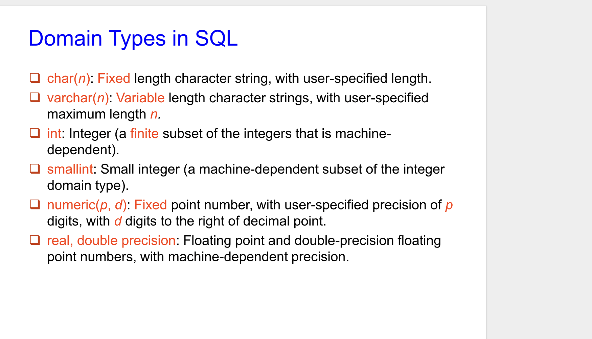
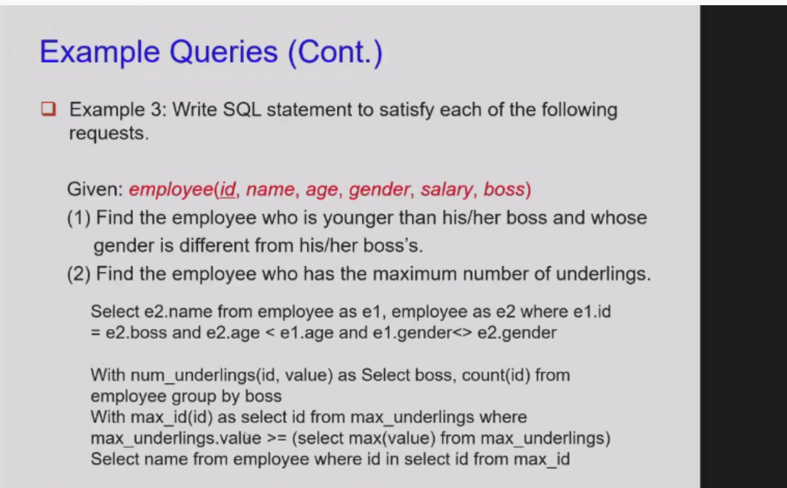
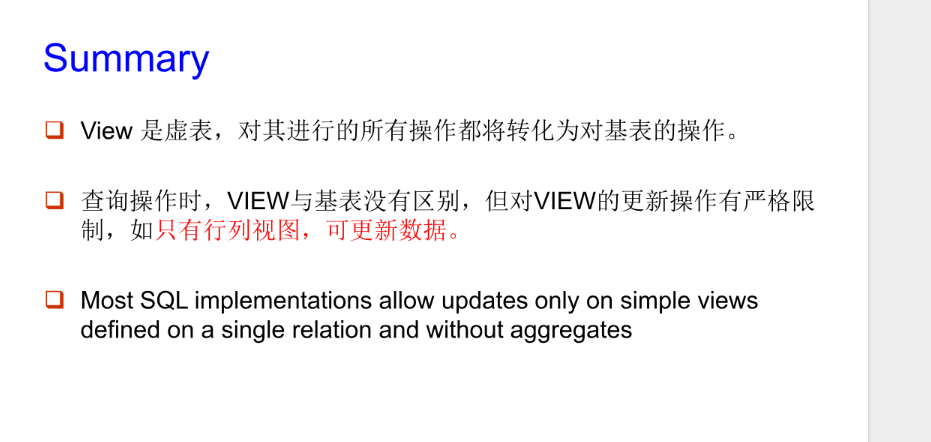

# SQL语言学习笔记

## 1. 概述与核心分类

SQL (Structured Query Language) 是用于管理关系数据库的标准语言。

- **数据定义语言 (DDL)**：定义数据库结构（表、索引、视图）。
- **数据操作语言 (DML)**：操作数据（查询、插入、删除、更新）。
- **数据控制语言 (DCL)**：管理权限和事务（GRANT, REVOKE, COMMIT, ROLLBACK）。

---

## 2. 数据库对象

- **表 (Table)**：存储数据的基本单位。
- **列 (Attribute/Column)**：字段名 + 数据类型 + 约束。
- **行 (Tuple/Row)**：一条具体记录。
- **索引 (Index)**：加速查询的数据结构。
- **视图 (View)**：虚拟表，本质是 SQL 查询的封装。

### 2.1 表 (Table) —— 数据的「容器」📦

**定义**：数据库中存储**实际业务数据**的最基本单位，由「行（记录）」和「列（字段）」组成，和 Excel 工作表的结构几乎一样。

- **行（Row）**：代表一条完整的业务数据（比如一个学生的所有信息）。
- **列（Column）**：代表数据的某个属性（比如学生的姓名、年龄、班级）。

**作用**：承载所有原始数据，是 SQL 操作的核心对象。
**例子**：

```sql
-- 创建学生表（DDL 操作）
CREATE TABLE student (
    id INT PRIMARY KEY,    -- 学生ID（主键，唯一标识）
    name VARCHAR(50),     -- 学生姓名
    age INT,              -- 学生年龄
    class VARCHAR(20)     -- 所在班级
);
```

---

### 2.2 索引 (Index) —— 数据的「目录」📇

**定义**：依附于表的一种**特殊数据结构**，作用类似书本的目录——不用翻完整本书，直接通过目录快速定位到目标页码。

- 索引本身不存储业务数据，只存储「索引列的值 + 对应数据行的物理地址」。
- 一张表可以建多个索引，但索引会占用额外存储空间，且会减慢「插入/更新/删除」数据的速度（因为需要同步维护索引）。

**作用**：大幅提升**查询（SELECT）**的速度，避免数据库遍历整张表（全表扫描）。
**例子**：

```sql
-- 给学生表的 name 列创建索引（DDL 操作）
CREATE INDEX idx_student_name ON student(name);
```

之后执行 `SELECT * FROM student WHERE name = '张三'` 时，数据库会直接通过索引找到「张三」对应的行，而不用逐行检查所有数据。

---

### 2.3 视图 (View) —— 虚拟的「查询结果表」👁️

**定义**：基于一张或多张表的**查询语句**生成的「虚拟表」，本身**不存储任何数据**，数据仍然来自原表。

- 视图看起来和普通表一样，可以用 `SELECT` 查询，但不能直接修改（大部分场景下）。
- 视图的定义存在数据库中，每次查询视图时，都会重新执行背后的 SQL 语句获取最新数据。

**作用**：

- **简化查询**：把复杂的多表查询封装成视图，后续直接查询视图即可。
- **权限控制**：只暴露部分字段给用户，隐藏敏感数据（比如不让普通用户看到学生的年龄）。
- **复用逻辑**：把常用的查询逻辑保存为视图，避免重复写相同的 SQL。

**例子**：

```sql
-- 创建只包含学生姓名和班级的视图（DDL 操作）
CREATE VIEW v_student_class AS
SELECT name, class FROM student;

-- 查询视图（和查询普通表一样，DML 操作）
SELECT * FROM v_student_class;
```

其他用户只能看到 `name` 和 `class` 列，看不到 `id` 和 `age`，实现了数据权限隔离。

---

### 2.4 三者关系总结

- **表**：是数据的「根」，所有真实数据都存在表里。
- **索引**：是表的「优化工具」，专门加速查询速度。
- **视图**：是表的「查询封装」，方便复用和安全控制。

他们的创建/删除都属于 **DDL（数据定义语言）** 操作，而查询视图、操作表数据属于 **DML（数据操作语言）**。

## 3. 数据定义语言 (DDL) 详解

### 3.1 创建表 (CREATE TABLE) 例子

这张幻灯片是在讲解 **DDL（数据定义语言）的建表语句**，以及和主键相关的三个核心概念（超键、候选键、主键）。

---

### 1. 先看这个 `CREATE TABLE` 例子

这是一段创建 `branch`（支行）表的 SQL 代码：

```sql
CREATE TABLE branch (
    branch_name  char(15) not null,  -- 支行名称：固定长度15字符，不允许为空
    branch_city  varchar(30),       -- 所在城市：可变长度字符，最多30位
    assets       numeric(8, 2),     -- 资产：数字类型，共8位，其中2位是小数（如 123456.78）
    primary key (branch_name)       -- 把 branch_name 设为【主键】
);
```

- **`char(15)`**：固定长度字符串，不足15位会补空格。
- **`varchar(30)`**：可变长度字符串，只存储实际使用的字符，更节省空间。
- **`numeric(8,2)`**：精确数字类型，适合存储金额等需要精度的数值。
- **`not null`**：约束该字段**不能为空**。
- **`primary key (branch_name)`**：将 `branch_name` 设为**主键**，保证它的值唯一且非空，用来唯一标识每一条支行记录。

---

### 2. 对比的三个键概念（Cf. = compare）

这三个概念是关系数据库里用来标识数据唯一性的核心：

- **Super-key（超键）**：
  能唯一标识一条记录的**属性集合**，可以包含多余属性。
  比如 `{branch_name}`、`{branch_name, branch_city}` 都是超键，只要能唯一确定一行即可。

- **Candidate key（候选键）**：
  是**最小的超键**——去掉其中任何一个属性，就无法唯一标识记录了，没有冗余。
  比如 `{branch_name}` 就是候选键，因为它本身就能唯一标识，且不能再精简。

- **Primary key（主键）**：
  从候选键中**选出的一个**，作为表的主要唯一标识。
  例子里就把 `branch_name` 选为了主键，一个表只能有一个主键。

---

简单来说，这页内容是：
用一个建表例子演示了 DDL 的用法，同时引出了「超键→候选键→主键」的递进关系，帮你理解**主键是怎么从更基础的概念里定义出来的**。

## DDL的语言

这张幻灯片在讲 **DDL（数据定义语言）的核心功能**，也就是用SQL来“定义数据库长什么样、怎么存、有什么规则”。我用通俗的话给你拆解一下👇

---

### 1. 定义每个关系的模式（schema）

- **关系**：可以理解为一张表（比如之前的 `branch` 表）。
- **schema**：就是这张表的**结构框架**，比如表名、有哪些列、列的名字和数据类型。
- 例子：`CREATE TABLE branch (...)` 就是在定义 `branch` 表的 schema。

### 2. 定义每个属性的值域（domain）

- **属性**：表的一列（比如 `branch_name`、`assets`）。
- **domain**：规定这一列**能存什么值**，比如：
  - `branch_name` 只能是长度不超过15的字符；
  - `assets` 只能是总长度8位、小数占2位的数字；
  - 还可以规定“不能为 null”“必须是正数”等取值范围。

### 3. 定义完整性约束（integrity constraints）

- 这是保证数据**正确、一致、不混乱**的规则，比如：
  - 主键约束：`branch_name` 必须唯一且非空；
  - 外键约束：保证表之间的关联数据有效；
  - 检查约束：比如 `assets` 不能是负数。
- 作用：防止脏数据（比如重复的支行名、空的支行名称）进入数据库。

### 4. 定义每个关系在磁盘上的物理存储结构

- 这是更底层的配置，规定数据**在硬盘上怎么存**，比如：
  - 数据文件存在哪个目录、用什么格式；
  - 表的分区方式、存储引擎（比如 MySQL 的 InnoDB/MyISAM）；
- 会直接影响数据库的读写性能和存储空间占用。

### 5. 定义要为每个关系维护的索引（indices）

- 索引就是表的“目录”，用来加速查询。
- DDL 负责定义“给哪些列建索引、建什么类型的索引”，比如 `CREATE INDEX idx_branch_name ON branch(branch_name)`。

### 6. 定义基于关系的视图（view）

- 视图是虚拟表，本质是一段封装好的查询语句。
- DDL 负责定义视图的结构，比如 `CREATE VIEW v_branch_info AS ...`，方便后续直接查询视图，不用重复写复杂 SQL。

---

### 一句话总结

DDL 就是数据库的“**架构师语言**”：

- 管**逻辑结构**：表长啥样、列能存什么、数据要遵守什么规则；
- 管**物理存储**：数据在硬盘怎么放、怎么建索引；
- 还管**便捷封装**：把常用查询做成视图。

**PPT**：有很多domian的例子

### 约束

这张幻灯片讲的是 **SQL 建表时的完整性约束（Integrity Constraints）**，也就是用来保证数据库里数据合法、一致、有效的规则，我给你拆解得更通俗一点👇

---

#### 一、三种核心约束

1.  **Not null**
    约束该字段**不能存空值（NULL）**，必须填入具体数据。比如支行名称`branch_name`就不能是空的。

2.  **Primary key (A₁, …, Aₙ)**
    主键约束：

    - 用来**唯一标识表中的每一行记录**（比如每个支行的名字都是独一无二的）
    - 一个表只能有一个主键
    - 主键的值必须**唯一**且**非空**

3.  **Check (P)**
    检查约束：`P`是一个条件表达式，用来限制字段的取值范围。
    比如例子里的`check (assets >= 0)`，就是保证资产`assets`不能是负数。

---

#### 二、一个重要的标准差异

> Primary key declaration on an attribute automatically ensures not null in SQL_92 onwards, needs to be explicitly stated in SQL_89

- **SQL-92 及以后**：声明为`primary key`的字段，会**自动隐含非空约束**，不用再写`not null`。
- **SQL-89**：必须显式写`not null`，否则主键字段可能允许为空。

---

#### 三、例子：两种实现方式

需求：把`branch_name`设为`branch`表的主键，并且保证`assets`（资产）的值≥0。

##### 方法1（兼容旧标准）

```sql
CREATE TABLE branch (
    branch_name char(20) not null,  -- 显式声明非空
    branch_city char(30),
    assets integer,
    primary key (branch_name),     -- 声明主键
    check (assets >= 0)            -- 检查资产非负
);
```

##### 方法2（SQL-92及以后更简洁）

```sql
CREATE TABLE branch2 (
    branch_name char(20) primary key,  -- 直接在字段后声明主键，自动隐含not null
    branch_city char(30),
    assets integer,
    check (assets >= 0)                -- 检查资产非负
);
```

---

#### 一句话总结

这页内容就是教你：**在建表时，如何用`not null`、`primary key`、`check`这三种约束，来防止脏数据（比如空名称、重复主键、负资产）进入数据库**，同时也说明了不同SQL标准下主键和非空约束的写法差异。

### 删除和修改表

这两张幻灯片讲的是 **DDL 里修改/删除表结构的两个核心命令：`DROP TABLE` 和 `ALTER TABLE`**，我给你用大白话拆解👇

---

### 一、`DROP TABLE`：彻底删除表

- **作用**：把一张表从数据库里**完全抹掉**，包括表的结构、里面的所有数据、索引、约束等，一切信息都会被删除。
- **语法**：`DROP TABLE 表名;`
  例子：`DROP TABLE branch2;` → 直接删除 `branch2` 这张表。

- ⚠️ **重要警告**：`Be careful to use the DROP command!!!`
  这个操作**非常危险**，一旦执行，数据和表结构都无法恢复（除非有备份），所以生产环境里一定要慎之又慎。

---

### 二、`ALTER TABLE`：修改已有表的结构

这里主要讲**给表添加新列（属性）**的用法：

- **作用**：在已经存在的表上，新增一列或多列，而不需要重建整张表。
- **语法**：
  1. 加**单个列**：

     ```sql
     ALTER TABLE 表名 ADD 列名 数据类型;
     ```

  2. 加**多个列**：

     ```sql
     ALTER TABLE 表名 ADD (列名1 数据类型1, 列名2 数据类型2, ...);
     ```

- **例子**：

  ```sql
  alter table loan add loan_date date;
  ```

  → 给 `loan` 表新增一个叫 `loan_date` 的列，类型是日期（`date`）。

- **关键细节**：
  表中已经存在的所有行，新列的值都会被自动设为 `NULL`（空值），因为这些行在加列之前就存在，没有这个新字段的数据。

---

### 一句话总结

- `DROP TABLE`：**删表跑路级操作**，删了就没了，务必小心。
- `ALTER TABLE ... ADD`：**给表加新列**，老数据的新列默认是空值。

### 索引

看看ppt吧 本质是用数据结构加速

## DML

## SQL SELECT 子句核心笔记

---

## 一、SELECT 基本结构与关系代数等价性

### 1. 语法结构

```sql
SELECT A₁, A₂, ..., Aₙ
FROM r₁, r₂, ..., rₘ
WHERE P
```

- `Aᵢ`：要查询的**属性（列）**
- `rᵢ`：要查询的**关系（表）**
- `P`：过滤数据的**谓词（条件）**

### 2. 关系代数等价表达

该 SQL 查询等价于：
$$\Pi_{A_1,A_2,...,A_n}\big(\sigma_P(r_1 \times r_2 \times ... \times r_m)\big)$$

- $\Pi$：投影（只保留指定列）
- $\sigma_P$：选择（只保留满足条件 $P$ 的行）
- $\times$：笛卡尔积（多表拼接）（注意是笛卡尔积）

### 3. 结果特性

SQL 查询的返回结果本身也是一个**关系（表）**，符合关系模型的定义。

---

## 二、基础 SELECT 查询

### 1. 无条件查询

只查询指定列，不做过滤：

```sql
SELECT branch_name FROM loan;
```

- 等价关系代数：$\Pi_{branch\_name}(loan)$
- 含义：从 `loan` 表中取出所有 `branch_name` 列的值（允许重复）

### 2. 命名规则

- **符号限制**：SQL 不允许使用 `-` 作为名称字符，实际开发用 `_` 替代（如 `branch_name`，教材中 `branch-name` 仅为排版美观）。
- **大小写不敏感**：表名、列名等标识符不区分大小写，`BRANCH_NAME` 和 `branch_name` 等价。

---

## 三、重复数据处理

### 1. 默认行为

SQL **允许重复值**，查询结果会保留原表中的重复行（等价于 `SELECT ALL`）。

### 2. 去重：`DISTINCT`

在 `SELECT` 后添加 `DISTINCT` 关键字，强制移除结果中的重复行：

```sql
SELECT DISTINCT branch_name FROM loan;
```

- 效果：相同的 `branch_name` 只出现一次。
- 注意 他说的是dintinct对应的组不能重复

### 3. 显式保留重复：`ALL`

`ALL` 是默认行为，可显式写出（一般省略）：

```sql
SELECT ALL branch_name FROM loan;
```

---

## 四、高级 SELECT 用法

### 1. 查询所有列：`*`

通配符 `*` 代表表中**所有属性（列）**：

```sql
SELECT * FROM loan;
```

- 含义：返回 `loan` 表的所有行和所有列。

### 2. 算术表达式

`SELECT` 子句中可包含 `+`、`-`、`*`、`/` 等算术运算，直接对列值或常量计算：

```sql
SELECT loan_number, branch_name, amount * 100 FROM loan;
```

- 含义：返回贷款号、支行名，以及 `amount` 放大 100 倍后的结果列。

---

## 五、示例对比（直观理解）

| 写法                          | 结果特点                     |
|-------------------------------|------------------------------|
| `SELECT branch_name FROM loan` | 包含重复值（如多个 `Perryridge`） |
| `SELECT DISTINCT branch_name FROM loan` | 无重复，每个支行名仅出现一次 |

---

## WHERE 子句 & FROM 子句

结合**关系代数**与**SQL 实际语法**，这两页核心内容可拆解为以下重点，适配数据库原理与 SQL 实操学习：

---

## 一、WHERE 子句（条件过滤核心）

### 1. 核心作用

`WHERE` 子句用于**指定查询结果必须满足的谓词条件**，筛选出符合要求的行（对应关系代数中的 **$\sigma$（选择）操作**）。

- 不写 `WHERE` 时，默认对全表数据进行后续操作。
- where是一个一个查的！

### 2. 逻辑操作符与范围查询

| 语法/操作符 | 作用 | 示例 |
| :--- | :--- | :--- |
| `AND`/`OR`/`NOT` | 组合多个条件，实现多逻辑过滤 | 同时满足“支行=Perryridge”**且**“金额>1200” |
| `BETWEEN ... AND ...` | 指定数值范围（等价于 `>= 下限 AND <= 上限`） | 金额在 `$90,000` ~ `$100,000` 之间 |

### 3. 关系代数等价性

SQL 语句 + 条件 = 关系代数 **先选择（$\sigma$）、后投影（$\Pi$）**。
**示例**：
需求：查询 Perryridge 支行、金额＞1200 的贷款号

- 关系代数：$\Pi_{loan\_number}(\sigma_{branch\_name='Perryridge' \land amount>1200}(loan))$
- SQL 实现：

```sql
SELECT loan_number
FROM loan
WHERE branch_name = 'Perryridge' AND amount > 1200;
```

### 4. 表结构定义（loan 关系）

`loan(loan-number, branch-name, amount)` 明确了查询涉及的关系属性，为条件过滤提供依据。

---

## 二、FROM 子句（数据来源核心）

### 1. 核心作用

`FROM` 子句用于**列出查询所涉及的关系（表）**，定义查询的数据来源。

- 对应关系代数：单表为直接引用，多表为 **笛卡尔积（$\times$）** 操作。

### 2. 多表查询基础（笛卡尔积）

当 `FROM` 后指定多个表时，SQL 会先计算表的笛卡尔积（行的全组合），再通过 `WHERE` 过滤有效数据。
**示例**：查询 borrower 与 loan 表的笛卡尔积

- 关系代数：$borrower \times loan$
- SQL 实现：

```sql
SELECT *
FROM borrower, loan; -- 逗号分隔 = 笛卡尔积
```

### 3. 多表关联（等值连接）

笛卡尔积会产生大量无效数据，**必须通过 `WHERE` 指定连接条件**，实现有效关联（对应关系代数的 **$\bowtie$（自然连接）**）。
**核心注意事项**：
多表中存在**同名列**时，必须加**表名前缀**（如 `borrower.loan_number`），避免列名歧义。

### 4. 综合示例（多表+条件查询）

需求：查询 Perryridge 支行有贷款的客户名、贷款号、贷款金额

- 涉及表：`borrower(customer-name, loan-number)` + `loan(loan-number, branch-name, amount)`
- 关系代数：$\Pi_{customer\_name, loan\_number, amount}(\sigma_{branch\_name='Perryridge'}(borrower \bowtie loan))$
- SQL 实现：

```sql
SELECT customer_name, borrower.loan_number, amount
FROM borrower, loan
-- 1. 等值连接条件：关联两表的贷款号
WHERE borrower.loan_number = loan.loan_number
  -- 2. 分支名过滤条件
  AND branch_name = 'Perryridge';
```

---

## 三、关键总结

1. **WHERE**：管“**行过滤**”，用逻辑操作符/BETWEEN 筛数据，对应关系代数 $\sigma$；
2. **FROM**：管“**表来源**”，多表默认笛卡尔积，需用连接条件转为有效连接，同名列必须加表前缀；
3. 完整查询 = `FROM`（定数据源）→ `WHERE`（定连接/行条件）→ `SELECT`（定投影列），三者共同完成关系代数的完整运算。

## rename

自己看ppt

## 字符串操作

结合幻灯片内容，SQL 字符串操作主要分为**模糊匹配（LIKE 通配符）**、**特殊字符转义**和**字符串常用函数/操作**三大类，以下是详细拆解：

## 一、SQL 字符串模糊匹配：LIKE 与通配符

### 1. 核心作用

实现**模糊查询**（fuzzy match），即不精确匹配字符串，而是通过通配符匹配符合规则的字符/子串，是 `WHERE` 子句中针对字符串的核心过滤手段。

### 2. 两大通配符（必须配合 `LIKE` 使用）

| 通配符 | 含义 | 类比（文件系统） | 示例 |
|:--- |:--- |:--- |:--- |
| `%` | 匹配**任意长度的子串**（包括 0 个字符） | 通配符 `*` | `'A%'` → 匹配以 `A` 开头的任意字符串 |
| `_` | 匹配**单个任意字符** | 通配符 `?` | `'A_'` → 匹配以 `A` 开头、长度为 2 的字符串 |

### 3. 语法规范

```sql
SELECT 列名
FROM 表名
WHERE 字符串列 LIKE '匹配模式';
```

- 匹配模式必须用单/双引号包裹；
- 不使用 `LIKE` 的 `WHERE` 条件无法生效模糊匹配。

### 4. 实战示例（幻灯片案例）

**需求**：查询客户表中，名字**包含子串“泽”**的客户名。

```sql
SELECT customer_name
FROM customer
WHERE customer_name LIKE '%泽%'; -- %泽% = 任意字符 + 泽 + 任意字符
```

- 结果：匹配“李泽”“张泽宇”“泽哥”等所有含“泽”的名字。

## 二、特殊字符转义处理

### 1. 问题场景

当需要匹配的字符串**本身包含通配符（`%`/`_`）**时，直接写会被数据库误判为通配符，无法正常匹配。

### 2. 解决方案：ESCAPE 转义字符

使用 `ESCAPE '转义符'` 声明一个转义字符，将目标通配符转为普通字符。

### 3. 实战示例（幻灯片案例）

**需求**：匹配名字为 `Main%` 的客户（字符串中包含 `%`）。

```sql
SELECT customer_name
FROM customer
WHERE customer_name LIKE 'Main\%' ESCAPE '\';
```

- 解析：`\` 是自定义转义符，`\%` 表示匹配真正的 `%` 字符，而非通配符；
- 扩展：也可以用其他字符做转义符，如 `LIKE 'Main#%' ESCAPE '#'`。

## 三、SQL 字符串常用操作

除了模糊匹配，SQL 还提供了丰富的字符串处理函数/操作，核心如下：

### 1. 字符串拼接（Concatenation）

- **语法**：使用 `||` 符号拼接字符串（不同数据库语法略有差异，如 MySQL 用 `CONCAT()`，但幻灯片以标准 SQL `||` 为例）；
- **示例**：拼接固定文本与客户名，标注字段含义。

  ```sql
  SELECT '客户名=' || customer_name
  FROM customer;
  ```

  结果示例：`客户名=Adams`、`客户名=Brooks`（右侧绿色框为预期结果）。

### 2. 大小写转换函数

| 函数 | 作用 | 示例 |
|:--- |:--- |:--- |
| `LOWER(字符串列)` | 转小写 | `LOWER('Adams')` → `adams` |
| `UPPER(字符串列)` | 转大写 | `UPPER('adams')` → `ADAMS` |

### 3. 其他基础字符串操作

| 操作 | 作用 |
|:--- |:--- |
| `LENGTH(字符串列)` | 获取字符串长度 |
| `SUBSTRING(字符串列, 起始位置, 长度)` | 截取子串（部分数据库用 `SUBSTR`） |
| `TRIM(字符串列)` | 去除首尾空格 |

## 四、核心总结

1. **模糊匹配**：必须依赖 `LIKE` + 通配符（`%`/`_`），`%` 配任意长度、`_` 配单个字符；
2. **转义规则**：含通配符的字符串匹配，需用 `ESCAPE` 声明转义符；
3. **字符串处理**：`||` 实现拼接，`LOWER()`/`UPPER()` 实现大小写互转，配合长度/截取函数可完成复杂字符串处理。

要不要我把这些字符串操作整理成一份**速查清单**，标注不同数据库的语法差异（如 MySQL 拼接函数、Oracle 字符串函数），方便你实际开发时直接套用？

## SQL 元组（行）排序：ORDER BY 子句核心笔记

这几页讲的是 SQL 中**对查询结果的行（元组）进行排序显示**的语法，核心是 `ORDER BY` 子句。

---

## 一、核心作用

`ORDER BY` 用于将查询结果的行，按照指定的**列（属性）**进行升序或降序排列，让结果更易读、更符合业务需求。

---

## 二、基础语法与默认规则

```sql
SELECT ...
FROM ...
WHERE ...
ORDER BY 列名1 [ASC|DESC], 列名2 [ASC|DESC], ...;
```

- **`ASC`**：升序（Ascending），默认值，可省略。
  - 字符串：按字母表顺序（A→Z）；
  - 数字：从小到大；
  - 日期：从早到晚。
- **`DESC`**：降序（Descending），需显式写出。
  - 字符串：逆字母表顺序（Z→A）；
  - 数字：从大到小；
  - 日期：从晚到早。

---

## 三、单字段排序示例

### 示例1：按客户名字母升序排列

需求：列出在 Perryridge 支行有贷款的所有客户名（去重），并按字母顺序显示。

```sql
SELECT DISTINCT customer_name
FROM borrower A, loan B
WHERE A.loan_number = B.loan_number
  AND branch_name = 'Perryridge'
ORDER BY customer_name; -- 等价于 ORDER BY customer_name ASC
```

### 示例2：Oracle 降序对比

- 无排序：结果是数据库存储的原始顺序（乱序）

  ```sql
  SELECT branch_name FROM loan;
  ```

- 降序排序：按支行名逆字母表排列

  ```sql
  SELECT bra_name FROM loan
  ORDER BY bra_name DESC;
  ```

  结果对比：
  | 无排序结果       | 降序排序结果     |
  |------------------|------------------|
  | Round Hill       | Round Hill       |
  | Downtown         | Redwood          |
  | Perryridge       | Perryridge       |
  | Perryridge       | Perryridge       |
  | Downtown         | Mianus           |
  | Redwood          | Downtown         |
  | Mianus           | Downtown         |

---

## 四、多字段排序（复合排序）

可以指定**多个列**进行排序，优先级从左到右：

1. 先按第一个列排序；
2. 第一个列值相同的行，再按第二个列排序；
3. 以此类推，每个列可单独指定 `ASC`/`DESC`。

### 示例：多维度排序

```sql
SELECT * FROM customer
ORDER BY customer_city,        -- 先按城市升序（默认ASC）
         customer_street DESC, -- 同一城市内，按街道降序
         customer_name;        -- 同一街道内，按客户名升序
```

逻辑：

- 先把所有客户按城市分组（A→Z）；
- 同一城市里，街道名从 Z→A 排；
- 街道也相同的客户，名字再从 A→Z 排。

---

## 五、关键注意事项

1. **位置要求**：`ORDER BY` 必须放在查询语句的最后（在 `WHERE`、`DISTINCT` 等子句之后）。
2. **与 DISTINCT 兼容**：可以先去重（`DISTINCT`）再排序，如第一个示例。
3. **NULL 处理**：不同数据库对 NULL 值的排序位置不同（通常放在最前或最后），需注意业务场景。
4. **排序列**：可以是查询结果中的列，也可以是计算列（如 `amount * 100`）。

---

## 一句话总结

`ORDER BY` 是 SQL 里**控制结果显示顺序**的核心子句：

- 单字段：直接指定列名，默认升序，加 `DESC` 变降序；
- 多字段：按列的顺序依次排序，每个列可独立控制升降序。

## SQL 与关系代数：重复元组（Multiset 语义）核心笔记

这几页讲的是**关系模型从「集合（Set）」到「多重集合（Multiset/Bag）」的扩展**，以及 SQL 如何处理重复元组，核心是「**实际数据库需要保留重复，而传统关系理论是无重复的集合**」。

---

## 一、背景：为什么需要重复？

- **传统关系理论**：关系是**集合**，不允许出现完全相同的元组（重复行）。
- **实际数据库（SQL）**：需要保留重复元组，比如：
  - 统计业务场景：需要知道某条数据出现的次数；
  - 多表连接后自然产生重复行；
  - 性能优化：去重会增加计算开销，默认保留重复更高效。

因此，关系代数被扩展为**支持 Multiset（多重集合）**的版本，允许同一个元组出现多次。

---

## 二、Multiset 版关系代数算子规则

对 `σ`（选择）、`Π`（投影）、`×`（笛卡尔积）三个核心算子，Multiset 版本的规则是：

| 算子 | Multiset 规则 | 通俗理解 |
|------|---------------|----------|
| **选择 σ_θ(r₁)** | 若 r₁ 中有 `c₁` 个元组 `t₁` 的副本，且 `t₁` 满足条件 `θ`，则结果中保留 `c₁` 个 `t₁` 副本 | 满足条件的重复行**全部保留**，不合并 |
| **投影 Π_A(r₁)** | 对 r₁ 中每个 `t₁` 副本，投影后生成一个 `Π_A(t₁)` 副本，**不会自动去重** | 投影后重复值也会保留，比如两个 `a` 投影后还是两个 `a` |
| **笛卡尔积 r₁×r₂** | 若 r₁ 有 `c₁` 个 `t₁` 副本，r₂ 有 `c₂` 个 `t₂` 副本，则结果中生成 `c₁×c₂` 个 `t₁.t₂` 副本 | 重复行的组合是「副本数相乘」 |

---

## 三、例子演算（直观理解）

给定两个 Multiset 关系：

- `r₁(A,B) = {(1,a), (2,a)}` → 2 个元组，B 列都是 `a`
- `r₂(C) = {(2), (3), (3)}` → `(2)` 有 1 个副本，`(3)` 有 2 个副本

### 1. 投影操作：Π_B(r₁)

对 `r₁` 投影 B 列，每个元组变成 `(a)`，所以：

```
Π_B(r₁) = {(a), (a)}  -- 保留 2 个重复的 a，不会合并成 1 个
```

### 2. 笛卡尔积：Π_B(r₁) × r₂

- `(a)` 有 2 个副本，`(2)` 有 1 个副本 → 生成 `2×1=2` 个 `(a,2)`
- `(a)` 有 2 个副本，`(3)` 有 2 个副本 → 生成 `2×2=4` 个 `(a,3)`

最终结果：

```
{(a, 2), (a, 2), (a, 3), (a, 3), (a, 3), (a, 3)}
```

（和幻灯片里的结果完全一致）

---

## 四、SQL 与 Multiset 语义的对应

### 1. SQL 默认是 Multiset 语义

SQL 的 `SELECT ... FROM ... WHERE` 语句，等价于 **Multiset 版的关系代数表达式**：

```sql
SELECT A₁,A₂,...,Aₙ
FROM r₁,r₂,...,rₘ
WHERE P
```

等价于：
$$\Pi_{A₁,A₂,...,Aₙ}\big(\sigma_P(r₁ × r₂ × ... × rₘ)\big)$$

- 特点：**默认保留所有重复元组**，不会自动去重（和传统集合版关系代数不同）。

### 2. 强制去重：DISTINCT

如果要回到「集合语义」（删掉重复行），需要在 `SELECT` 后加 `DISTINCT` 关键字：

```sql
SELECT DISTINCT A₁,A₂,...,Aₙ
FROM ...
```

这会让结果变成**无重复的集合**，和传统关系理论一致。

---

## 一句话总结

- **传统关系代数（集合版）**：投影/选择后自动去重，无重复。
- **Multiset 版关系代数 + SQL 默认**：保留所有重复元组，重复行的副本数按规则计算。
- **SQL 去重**：加 `DISTINCT`，切换回集合语义。

## set操作 Union Intersect Except

见ppt把比较好理解

## 聚合函数

## SQL 聚合函数（Aggregate Functions）核心笔记

这几页系统讲解了 SQL 中**聚合函数**的定义、常用类型、分组统计规则，以及多表聚合的实战场景。核心是：**对一组数据进行统计计算（如求和、平均、计数），并支持按分组维度拆分结果**。

---

## 一、聚合函数的核心定义

聚合函数作用于关系列的**多重集合（Multiset）**值，对一组数据进行汇总计算，最终返回**单个标量值**（或按分组返回多个值）。
结合之前的「多重集合」知识：聚合函数会自动处理列中的重复值（默认统计所有副本，也可通过 `DISTINCT` 去重统计）。

### 常用聚合函数（幻灯片定义）

| 函数 | 全称/作用 | 通俗解释 |
|:--- |:--- |:--- |
| `avg(col)` | 平均值（average） | 计算列值的算术平均值 |
| `min(col)` | 最小值（minimum） | 取列值的最小数/字符 |
| `max(col)` | 最大值（maximum） | 取列值的最大数/字符 |
| `sum(col)` | 求和（sum） | 计算列值的总和 |
| `count(col)` | 计数（count） | 统计列值的数量（行数） |

---

## 二、示例1：单值聚合（全局统计）

### 需求

查询 **Perryridge 支行**的账户平均余额。

### 关系代数（聚合版）

$$g_{avg(balance)}(\sigma_{branch\_name='Perryridge'}(account))$$

- $g_{agg}$：聚合算子，对筛选后的结果做聚合计算。

### SQL 实现（正确写法）

```sql
SELECT avg(balance) AS avg_bal  -- 聚合函数，并重命名结果列为avg_bal
FROM account
WHERE branch_name = 'Perryridge';
```

### 结果

| branch_name | avg_bal |
|:--- |:--- |
| Perryridge | 25000 |

### ❌ 错误写法（幻灯片标注）

```sql
SELECT branch_name, avg(balance) AS avg_bal
FROM account
WHERE branch_name = 'Perryridge';
```

### 错误原因（核心规则）

`SELECT` 子句中，**非聚合函数的列（如 branch_name）必须出现在 `GROUP BY` 分组列表中**。

- 此时查询既想查支行名（非聚合列），又想查平均余额（聚合列），但没有按 `branch_name` 分组，数据库无法确定“哪个支行名对应这个平均值”，因此语法报错。

---

## 三、示例2：分组聚合（GROUP BY 核心）

### 需求

**按每个支行**统计各自的账户平均余额（即“每个组一个统计值”）。

### SQL 实现（正确写法）

```sql
SELECT branch_name, avg(balance) AS avg_bal
FROM account
GROUP BY branch_name;  -- 按支行分组：相同branch_name的行归为一组
```

### 关系逻辑

1. 先按 `branch_name` 分组，将 `account` 表拆分为 4 组（Downtown、Mianus、Round Hill、Redwood）；
2. 对每组单独应用 `avg(balance)` 聚合函数；
3. 最终输出每组的支行名 + 平均余额。

### 结果（与幻灯片一致）

| branch_name | avg_bal |
|:--- |:--- |
| Downtown | 600 |
| Mianus | 725 |
| Round Hill | 350 |
| Redwood | 700 |

### 底层数据（account 表）

| account_number | branch_name | balance |
|:--- |:--- |:--- |
| A-101 | Downtown | 500 |
| A-215 | Mianus | 700 |
| A-102 | Perryridge | 400 |
| A-305 | Round Hill | 350 |
| A-201 | Brighton | 900 |
| A-222 | Redwood | 700 |
| A-217 | Brighton | 750 |

---

## 四、示例3：多表聚合 + 去重统计

### 需求

1. 统计**每个支行**的储户数量；
2. （进阶）统计**每个支行**的**不重复**储户数量（避免同一客户存多个账户时重复计数）。

### 涉及表结构

- `account(account-number, branch-name, balance)`：账户表
- `depositor(customer-name, account-number)`：储户-账户关联表

### 写法1：基础计数（含重复）

```sql
SELECT branch_name, count(customer_name) AS tot_num
FROM depositor D, account A
WHERE D.account_number = A.account_number  -- 两表等值连接
GROUP BY branch_name;
```

- 逻辑：先连接两表（一个账户对应多个储户），再按支行分组，统计每组的客户名数量（若同一客户存多个账户，会被重复计数）。

### 写法2：去重计数（DISTINCT）

```sql
SELECT branch_name, count(DISTINCT customer_name) AS tot_num
FROM depositor D, account A
WHERE D.account_number = A.account_number
GROUP BY branch_name;
```

- 核心：`count(DISTINCT 列)` 会先剔除列中的重复值，再统计数量。
- 场景：统计“每个支行有多少个不同的储户”（精准业务需求）。

---

## 五、关键总结（必背规则）

1. **聚合函数 + 分组的核心约束**：
   `SELECT` 中**非聚合列**必须出现在 `GROUP BY` 子句中，否则语法错误。

2. **聚合函数的默认行为**：
   基于 Multiset（多重集合）语义，默认统计**所有值（含重复）**；加 `DISTINCT` 可去重统计。

3. **`GROUP BY` 本质**：
   将表按指定列分组，对**每组**独立应用聚合函数，最终输出“分组维度 + 聚合结果”的组合。

4. **多表聚合**：
   先通过 `WHERE` 完成多表连接，再用 `GROUP BY` 分组，最后对分组结果做聚合统计。

## SQL SELECT 语句：完整语法与执行顺序

这两张幻灯片是对 **SELECT 查询** 的核心总结，包含**语法结构模板**和**数据库实际执行顺序**，是理解 SQL 查询的关键。

---

## 一、SELECT 完整语法结构

这是 SQL 查询的**标准模板**，所有 SELECT 语句都遵循这个顺序（方括号 `[]` 表示可选子句）：

```sql
SELECT [DISTINCT] 列1, 列2, ...
FROM 表1, 表2, ...
[WHERE 行级过滤条件]
[GROUP BY 分组列1, 分组列2, ... [HAVING 组级过滤条件]]
[ORDER BY 排序列1 [DESC] [, 排序列2 [DESC|ASC], ...]]
```

### 各子句作用：

| 子句 | 作用 |
|------|------|
| `SELECT` | 指定要显示的列/聚合结果，`DISTINCT` 可选去重 |
| `FROM` | 指定数据源（表、视图等） |
| `WHERE` | **分组前** 过滤行：只保留满足条件的原始数据行 |
| `GROUP BY` | 按指定列分组，为聚合函数做准备 |
| `HAVING` | **分组后** 过滤组：只保留满足条件的分组结果 |
| `ORDER BY` | 对最终结果排序，默认 `ASC`（升序），`DESC` 为降序 |

---

## 二、SELECT 实际执行顺序

⚠️ **SQL 书写顺序 ≠ 执行顺序**，数据库会按以下逻辑执行：

```
FROM → WHERE → GROUP BY（聚合计算） → HAVING → SELECT → DISTINCT → ORDER BY
```

### 执行步骤拆解：

1. **`FROM`**：先加载所有数据源表，准备数据
2. **`WHERE`**：按条件过滤掉不符合的行（比如只保留 `Perryridge` 支行的记录）
3. **`GROUP BY`**：将剩余行按指定列分组（比如按 `branch_name` 分组），并对每组执行聚合计算（`avg()`/`sum()` 等）
4. **`HAVING`**：按条件过滤掉不符合的组（比如只保留平均余额 > 500 的支行组）
5. **`SELECT`**：选出要显示的列/聚合结果
6. **`DISTINCT`**：如果有，对结果去重
7. **`ORDER BY`**：对最终结果排序，返回给用户

---

## 三、核心关键区别（必记）

### 1. `WHERE` vs `HAVING`

| 子句 | 执行时机 | 作用对象 | 能否用聚合函数 |
|------|----------|----------|----------------|
| `WHERE` | 分组**前** | 原始数据行 | ❌ 不能（分组前还没计算聚合值） |
| `HAVING` | 分组**后** | 分组后的结果 | ✅ 可以（分组后已算出聚合值） |

**例子**：

- 错误（`WHERE` 用聚合）：

  ```sql
  SELECT branch_name, avg(balance)
  FROM account
  WHERE avg(balance) > 500 -- 错！WHERE 执行时还没分组，avg 无法计算
  GROUP BY branch_name;
  ```

- 正确（`HAVING` 用聚合）：

  ```sql
  SELECT branch_name, avg(balance)
  FROM account
  GROUP BY branch_name
  HAVING avg(balance) > 500; -- 对！分组后算 avg，再筛选符合条件的组
  ```

### 2. 聚合函数的使用限制

- **不能直接用在 `WHERE` 子句**：因为 `WHERE` 执行时还没分组，聚合函数（`avg()`/`sum()` 等）需要基于分组后的数据计算。
- 只能用在：`SELECT`、`HAVING`、`ORDER BY` 子句中（这些子句都在分组/聚合之后执行）。

---

## 一句话总结

- **语法顺序**：`SELECT` → `FROM` → `WHERE` → `GROUP BY` → `HAVING` → `ORDER BY`
- **执行顺序**：`FROM` → `WHERE` → `GROUP BY` → `HAVING` → `SELECT` → `ORDER BY`
- **核心区别**：`WHERE` 筛行（分组前），`HAVING` 筛组（分组后），聚合函数不能用在 `WHERE`。

## null 值处理

见ppt

## 嵌套查询 (Nested Subqueries)

子查询是嵌套在另一个查询中的 `SELECT-FROM-WHERE` 表达式。

### 1. 集合成员资格 (Set Membership)

使用 `IN` 和 `NOT IN` 检查一个值是否属于子查询返回的集合。

- **示例 (IN)**：找出在 `Perryridge` 支行和 `Brighton` 支行都有账户的客户。

  ```sql
  SELECT DISTINCT customer_name
  FROM depositor
  WHERE customer_name IN (SELECT customer_name FROM depositor WHERE branch_name = 'Perryridge')
    AND customer_name IN (SELECT customer_name FROM depositor WHERE branch_name = 'Brighton');
  ```

- **示例 (NOT IN)**：找出在 `Perryridge` 支行有账户，但**不在** `Brighton` 支行开户的客户。

  ```sql
  SELECT DISTINCT customer_name
  FROM depositor
  WHERE branch_name = 'Perryridge'
    AND customer_name NOT IN (SELECT customer_name FROM depositor WHERE branch_name = 'Brighton');
  ```

### 2. 集合比较 (Set Comparison)

用于将一个值与子查询返回的集合进行比较。

- **`some` (或 `any`)**: 只要集合中**至少有一个**值满足条件，则为真。
  - `> some`: 至少比集合中最小的值大。
- **示例**：找出贷款额度比位于 `Brooklyn` 的**任意**一个贷款额度都要大的贷款号。

  ```sql
  SELECT loan_number
  FROM loan
  WHERE amount > some (SELECT amount FROM loan, branch
                      WHERE loan.branch_name = branch.branch_name
                        AND branch_city = 'Brooklyn');
  ```

- **`all`**: 只有集合中**所有**值都满足条件，才为真。
  - `> all`: 比集合中最大的值还要大。
- **示例 (求最大值)**：找出银行中资产最高的支行。

  ```sql
  SELECT branch_name
  FROM branch
  WHERE assets >= all (SELECT assets FROM branch);
  ```

### 3. 空检查 (Test for Empty Relations)

使用 `EXISTS` 检查子查询的结果集是否为空。

- **`EXISTS`**: 如果子查询有返回行，则返回 `TRUE`。
- **`NOT EXISTS`**: 如果子查询结果为空，则返回 `TRUE`。
- **经典示例 (相关子查询)**：找出在 `Brooklyn` 地区所有支行都有账户的客户（这实际上是关系代数中的“除法”）。

  ```sql
  -- 思路：没有哪一个位于 Brooklyn 的支行是该客户没存钱的
  SELECT DISTINCT S.customer_name
  FROM depositor AS S
  WHERE NOT EXISTS (
      (SELECT branch_name FROM branch WHERE branch_city = 'Brooklyn')
      EXCEPT
      (SELECT R.branch_name FROM depositor AS R WHERE R.customer_name = S.customer_name)
  );
  ```

### 4. 重复性检查 (Test for Absence of Duplicate Tuples)

- **`UNIQUE`**: 如果子查询结果中没有重复行，则返回 `TRUE`。

---

## 总结

SQL 是一门声明式语言。理解从 **FROM 数据源** 到 **ORDER BY 排序** 的完整流水线，以及 **Multiset** 语义和 **NULL/嵌套子查询** 的逻辑判断，是编写高效、正确 SQL 的基础。

这里东西是真的有点多，建议结合具体的习题练习。

## view视图

---

### 一、视图的核心定义与作用

视图是**虚拟表**，本身不存储实际数据，本质是封装了一条`SELECT`查询语句，对外提供一个可查询的“表”。
核心作用：**为特定用户隐藏敏感数据**，只暴露其需要访问的列/行，实现数据权限的精细化控制。

---

### 二、视图的创建语法

SQL提供两种标准创建格式：

#### 格式1：继承SELECT的列名

```sql
CREATE VIEW <视图名(v_name)> AS
SELECT c1, c2, ...
FROM 表名
[WHERE 条件];
```

- 视图的列名、数据类型完全继承自`SELECT`语句的结果集。

#### 格式2：显式指定视图列名

```sql
CREATE VIEW <视图名(v_name)> (c1, c2, ...) AS
SELECT e1, e2, ...
FROM 表名
[WHERE 条件];
```

- 手动定义视图的列名，可与原表列名不同，适合需要重命名列、或计算列的场景。

---

### 三、使用视图的核心优势

1.  **安全性（Security）**：可以只向用户开放视图（而非底层表），隐藏敏感字段（如薪资、身份证号），避免数据泄露。
2.  **易用性 & 逻辑独立性**：
    - 把复杂的多表关联、聚合查询封装成视图，后续查询直接用视图，大幅简化SQL编写；
    - 底层表结构变更时，只要调整视图的定义，上层基于视图的业务查询无需修改，实现解耦#。

---

### 四、视图的删除语法

```sql
DROP VIEW <视图名(V_NAME)>;
```

- 直接删除视图定义，不会影响底层的源表数据。

---

### 五、实战示例（银行业务场景）

#### 1. 需求：创建视图，整合所有支行的客户信息

**业务背景**：银行有两类客户：存款客户（`depositor`表关联`account`表）、贷款客户（`borrower`表关联`loan`表），需要创建视图统一展示「支行名」和「客户名」。

**修正后的标准SQL（修复原笔误+优化格式）**：

```sql
CREATE VIEW all_customer AS
-- 子查询1：获取有存款的客户的支行+姓名
SELECT branch_name, customer_name
FROM depositor, account
WHERE depositor.account_number = account.account_number

UNION  -- 合并两个查询结果（自动去重）

-- 子查询2：获取有贷款的客户的支行+姓名
SELECT branch_name, customer_name
FROM borrower, loan
WHERE borrower.loan_number = loan.loan_number;
```

- 执行后生成视图：`all_customer(branch_name, customer_name)`，包含所有在该支行有存款/贷款的客户。

#### 2. 基于视图的查询：查询Perryridge支行的所有客户

直接查询视图，无需再写复杂的多表关联+UNION：

```sql
SELECT customer_name
FROM all_customer
WHERE branch_name = 'Perryridge';
```

---

### #六、视图与逻辑数据独立性（Logical Data Independence）

#### 1. 核心概念

**逻辑数据独立性**：是数据库系统的核心特性之一，指**当数据库的底层逻辑结构（如表的拆分、合并、字段修改）发生变化时，上层的应用程序、用户查询无需修改，仍能正常访问数据**，实现「底层结构变更对上层透明」。

视图是实现逻辑数据独立性的核心工具：通过视图封装底层表的结构变化，让用户始终通过“旧的视图接口”访问数据，完全感知不到底层表的修改。

---

### 2. 实战示例：表拆分场景下的逻辑独立实现

#### 场景背景

原表 `S(a, b, c)`（`a` 为主键），需要将其拆分为两个子表：

- `S1(a, b)`：存储原表的 `a`、`b` 列
- `S2(a, c)`：存储原表的 `a`、`c` 列

目标：**让所有基于原表 `S` 的查询/应用完全不受影响，无需修改代码**。

#### 实现步骤（对应PPT）

```sql
-- 步骤1：创建两个新的子表S1、S2（结构与原表拆分后的列对应）
CREATE TABLE S1 (...);
CREATE TABLE S2 (...);

-- 步骤2：将原表S的数据迁移到两个子表
INSERT INTO S1 SELECT a, b FROM S;
INSERT INTO S2 SELECT a, c FROM S;

-- 步骤3：删除原表S（底层结构完成变更）
DROP TABLE S;

-- 步骤4：创建视图S，完全还原原表S的接口！
CREATE VIEW S(a, b, c) AS
SELECT S1.a, S1.b, S2.c
FROM S1, S2
WHERE S1.a = S2.a;
```

---

### 3. 原理说明

- 底层：原表 `S` 被删除，数据存储在 `S1` 和 `S2` 两个新表中，结构完全变更；
- 上层：用户/应用仍然可以像之前一样，直接查询**视图 `S`**，语法和原表完全一致，完全感知不到底层的拆分操作；
- 视图在这里充当了「中间层」：把底层的多表关联逻辑封装起来，对外暴露和原表完全相同的接口，完美实现逻辑数据独立性。

---

### 4. 逻辑数据独立性的核心价值

- **解耦业务与存储**：业务层不需要关心数据如何存储、表如何拆分，只需要通过视图访问；
- **平滑升级**：数据库结构重构（分表、分库、字段调整）时，不会影响线上业务，实现无感知升级；
- **兼容历史系统**：老系统基于旧表结构开发，通过视图可以兼容新的存储结构，无需改造老系统。

---

## 补充核心知识点

- 视图是**虚拟表**：默认情况下，数据库不会存储视图的实际数据，每次查询视图时，都会执行视图封装的`SELECT`语句，从源表实时拉取数据；
- 部分数据库支持**物化视图（Materialized View）**：会将视图结果物理存储，提升查询性能，但需要手动刷新同步源表数据；
- 视图的更新限制：并非所有视图都支持`INSERT/UPDATE/DELETE`，只有满足“视图列对应源表列、无聚合/UNION等操作”等条件的简单视图，才支持数据更新；
- 逻辑数据独立性 vs 物理数据独立性：
  - 逻辑独立：底层**逻辑结构**（表结构、分表）变更，上层不变；
  - 物理独立：底层**物理存储**（磁盘、索引、分区）变更，上层不变；
  - 视图主要保障逻辑数据独立性。

视图其实是一个语句 一个select 是不怎么占空间的。

## SQL 高级查询与派生关系笔记

## 一、派生关系（Derived Relations）

### 1. 核心定义

派生关系是**在 `FROM` 子句中通过子查询生成的临时关系**，仅在当前查询语句中生效，也被称为“派生表”。

### 2. 核心语法

```sql
SELECT 列名
FROM (子查询) AS 临时表名(列名列表)
[WHERE 过滤条件];
```

### 3. 典型案例：筛选平均余额＞$500 的支行

#### 方案1：使用派生表实现

```sql
SELECT branch_name, avg_bal
FROM (
    -- 子查询：按支行分组计算平均余额，生成派生表
    SELECT branch_name, avg(balance)
    FROM account
    GROUP BY branch_name
) AS result(branch_name, avg_bal)  -- 派生表别名+列名重定义
WHERE avg_bal > 500;
```

#### 方案2：使用 `HAVING` 子句（等价实现）

`HAVING` 专门用于**分组后**的结果过滤，是派生表方案的简化版：

```sql
SELECT branch_name, avg(balance)
FROM account
GROUP BY branch_name
HAVING avg(balance) > 500;
```

### 4. 关键区别

| 子句       | 过滤时机       | 支持聚合函数 | 适用场景               |
|------------|----------------|--------------|------------------------|
| `WHERE`    | 分组**前**过滤行 | ❌ 不支持    | 过滤原始数据行         |
| `HAVING`   | 分组**后**过滤组 | ✅ 支持       | 过滤分组后的聚合结果   |

## 二、WITH 子句（公共表表达式 CTE）

### 1. 核心作用

`WITH` 子句用于**为单个查询定义局部临时视图（CTE）**，替代嵌套的派生表，让代码逻辑更清晰、可读性更强，仅在当前查询生效。

### 2. 基础语法

```sql
WITH 临时视图名(列名列表) AS (
    子查询1
)[, 临时视图名2(列名列表) AS (子查询2)]  -- 可链式定义多个CTE
SELECT 列名
FROM 临时视图名 [JOIN 其他表]
[WHERE 过滤条件];
```

### 3. 典型案例

#### 案例1：查询余额最大的账户

```sql
-- 定义局部CTE：存储最大余额
WITH max_balance(value) AS (
    SELECT max(balance)
    FROM account
)
-- 使用CTE：关联原表筛选对应账户
SELECT account_number
FROM account, max_balance
WHERE account.balance = max_balance.value;
```

#### 案例2：查询总存款超所有支行平均的支行

```sql
WITH
    -- CTE1：各支行总存款
    branch_total(branch_name, a_bra_total) AS (
        SELECT branch_name, sum(balance)
        FROM account
        GROUP BY branch_name
    ),
    -- CTE2：所有支行总存款的平均值
    total_avg(value) AS (
        SELECT avg(a_bra_total)
        FROM branch_total
    )
-- 筛选符合条件的支行
SELECT A.branch_name, A.a_bra_total
FROM branch_total AS A, total_avg AS B
WHERE A.a_bra_total >= B.value;
```

### 4. 版本注意

SQL Server 2000 等旧版本**不支持 `WITH` 子句**，可通过“创建临时视图”替代实现相同逻辑。

## 三、分组过滤进阶查询（GROUP BY + HAVING）

### 1. 核心规则

- `GROUP BY`：按指定列分组，结合聚合函数（`count`/`sum`/`avg` 等）统计每组数据；
- 聚合函数仅能出现在 `SELECT`、`HAVING`、`ORDER BY` 子句中；
- 多表关联时，**派生表/CTE 必须指定别名**（无论是否被引用）。

### 2. 案例1：查询选课数＞10 的学生学号

```sql
-- 表结构：Enroll(sno, cno, grade)
SELECT sno
FROM enroll
GROUP BY sno
HAVING count(cno) > 10;
```

### 3. 案例2：查询选课数＞10 的学生姓名

#### 方案1：子查询实现

```sql
-- 表结构：Student(sno, sname, ssex, sage, sdept)、Enroll
SELECT sno, sname
FROM student
WHERE sno IN (
    SELECT sno
    FROM enroll
    GROUP BY sno
    HAVING count(cno) > 10
);
```

#### 方案2：派生表实现（必须给派生表起别名）

```sql
SELECT TT.sno, S.sname, TT.c_num
FROM (
    -- 派生表：统计每个学生选课数，必须定义别名TT
    SELECT sno, count(cno) AS c_num
    FROM enroll
    GROUP BY sno
) AS TT, student AS S
WHERE TT.sno = S.sno AND TT.c_num > 10;
```

## 四、核心注意事项

1. 别名规则：所有派生表、CTE 都必须显式定义别名，即使未被多表引用也需指定；**这里的派生表是from中的 不是where中的**
2. 过滤逻辑：`WHERE` 过滤原始行（不可用聚合函数），`HAVING` 过滤分组结果（可用聚合函数）；
3. 可读性优先：复杂查询优先用 `WITH` 子句替代多层嵌套，降低代码维护成本。



## SQL `DELETE` 语句核心笔记

---

## 一、`DELETE` 基础语法

### 1. 标准格式

```sql
DELETE FROM <表名 | 视图名>
[WHERE <过滤条件>];
```

- **作用**：从指定表/视图中删除满足条件的**行（元组）**
- **关键规则**：
  - 省略 `WHERE` 会删除表中**所有数据**（高危操作！）
  - 可以基于子查询动态生成删除条件
  - 仅删除数据，不删除表结构（区别于 `DROP TABLE`）

### 2. 基础示例：删除Perryridge支行的所有账户

```sql
DELETE FROM account
WHERE branch_name = 'Perryridge';
```

- 逻辑：从 `account` 表中，删除所有 `branch_name` 等于 `'Perryridge'` 的账户记录

---

## 二、多表关联删除（核心案例）

### 案例1：删除Needham市所有支行的账户及存款人信息

#### 表结构说明

| 表名       | 字段                                  | 说明                     |
|------------|---------------------------------------|--------------------------|
| `branch`   | `branch_name`, `branch_city`, `assets` | 支行信息表               |
| `account`  | `account_number`, `branch_name`, `balance` | 账户信息表           |
| `depositor`| `customer_name`, `account_number`     | 存款人与账户关联表       |

---

#### 方案1：分两次单表删除（标准SQL兼容写法）

```sql

DELETE FROM depositor
WHERE account_number IN (
    SELECT A.account_number
    FROM branch B, account A
    WHERE B.branch_city = 'Needham'
      AND B.branch_name = A.branch_name
);

DELETE FROM account
WHERE branch_name IN (
    SELECT branch_name
    FROM branch
    WHERE branch_city = 'Needham'
);
```

- 优点：所有主流数据库（MySQL、PostgreSQL、SQL Server）都支持
- 逻辑：先删账户表，再删关联的存款人表，避免外键约束报错

---

#### 方案2：多表联合删除（非标准，仅部分数据库支持）

```sql
-- ❗注意：此写法仅在MySQL等少数数据库支持，标准SQL不允许
DELETE FROM account, depositor, branch
WHERE account.account_number = depositor.account_number
  AND branch.branch_name = account.branch_name
  AND branch.branch_city = 'Needham';
```

- 问题：
  1. 标准SQL**不支持** `DELETE FROM` 后接多个表名
  2. 存在外键约束时，删除顺序错误会导致报错
  3. 不同数据库语法差异大，可移植性差
- 结论：**不推荐使用**，优先用分两次删除的方案

---

## 三、特殊场景：基于聚合结果的删除

### 案例2：删除余额低于银行平均余额的所有账户

```sql
DELETE FROM account
WHERE balance < (
    SELECT avg(balance)
    FROM account
);
```

---

### 1. 潜在逻辑疑问

> 问题：删除过程中，账户表数据减少，平均余额会动态变化，会不会导致删除逻辑出错？

### 2. SQL的实际执行规则（核心知识点）

SQL 会按以下步骤执行，**不会动态重算平均值**：

1.  **第一步：先执行子查询**：在删除操作开始前，一次性计算出初始的平均余额 `avg(balance)`
2.  **第二步：确定待删除行**：用初始平均值筛选出所有符合 `balance < 初始平均值` 的行
3.  **第三步：批量删除**：一次性删除所有筛选出的行，删除过程中**不再重新计算平均值**，也不再重新校验条件

### 3. 中文补充说明

> 在同一SQL语句内，除非外层查询的元组变量引入内层查询，否则内层子查询只执行一次。

- 解释：
  - 本案例中，内层子查询 `SELECT avg(balance) FROM account` 没有引用外层的 `account` 行，因此**只执行一次**
  - 如果是关联子查询（内层引用外层行），则会逐行执行内层查询

---

## 四、`DELETE` 关键注意事项

1.  **删除顺序**：多表删除时，必须先删从表（依赖表），再删主表（被依赖表），避免外键约束报错
2.  **事务安全**：执行删除前，建议先开启事务（`BEGIN TRANSACTION`），验证结果后再提交（`COMMIT`），误删可回滚（`ROLLBACK`）
3.  **子查询别名**：`WHERE` 中的嵌套子查询**不需要起别名**（和 `FROM` 派生表规则不同）
4.  **视图删除限制**：通过视图删除数据时，视图必须满足可更新条件（如单表视图、无聚合/分组等）
5.  **高危操作**：`DELETE FROM 表名` 不加 `WHERE` 会清空整张表，生产环境绝对禁止直接执行
6.  注意 子查询的时候 永远是先进行子查询 变成一个单独的表

## SQL INSERT 插入语句 精简笔记

---

## 一、核心语法（两种插入模式）

### 1. 单条插入（VALUES 模式）

#### 两种等价写法

- **省略列名**：按表结构顺序插入

  ```sql
  INSERT INTO account VALUES ('A_9732', 'Perryridge', 1200);
  ```

  ✅ 要求：值的顺序、类型、数量**必须和表列定义完全一致**

- **指定列名**：自定义顺序插入

  ```sql
  INSERT INTO account (branch_name, balance, account_number)
  VALUES ('Perryridge', 1200, 'A_9732');
  ```

  ✅ 要求：值的顺序、类型、数量**必须和指定列一一对应**

### 2. 批量插入（SELECT 子查询模式）

```sql
INSERT INTO <表|视图> [(列1, 列2,...)]
SELECT 列1, 列2,... FROM 源表 [WHERE 条件];
```

- 作用：将查询结果批量插入目标表，适合批量数据导入

---

## 二、关键执行规则

1.  **子查询优先完整执行**
    `INSERT ... SELECT ...` 会**先执行完所有SELECT查询**，拿到全部结果后，再统一插入目标表，不会边查边插。

2.  **同表插入合法**
    语句 `INSERT INTO table1 SELECT * FROM table1` 完全正确：

    - 先查询原表所有数据，再批量插入，不会无限循环（查询在插入前完成）

---

## 三、避坑要点

- 列与值必须严格匹配：顺序、数据类型、数量一致，否则报错
- 省略列名时，必须严格遵循表的列定义顺序
- 批量插入时，SELECT的列结构必须和目标表完全兼容
- 视图插入需满足可更新条件（单表、无聚合/分组等）

## SQL `UPDATE` 数据更新 完整笔记

这三页系统讲解了SQL中**数据修改（UPDATE）**的全流程用法，包括基础语法、条件更新、视图更新规则，还有「行列视图」的核心概念。

---

## 一、`UPDATE` 基础语法

### 1. 标准格式

```sql
UPDATE <表名 | 视图名>
SET <列1 = 表达式1> [, <列2 = 表达式2>, ...]
[WHERE <筛选条件>];
```

### 2. 核心说明

- **作用**：修改表/视图中**符合`WHERE`条件**的行的列值
- **关键规则**：
  - 省略`WHERE`：**修改表中所有行**（高危操作！生产环境绝对禁止无`WHERE`的`UPDATE`）
  - 可同时修改多个列，用逗号分隔
  - 表达式支持常量、计算、子查询等任意合法SQL表达式

---

## 二、`CASE` 语句：条件批量更新

### 1. 适用场景

需要**根据不同条件给同一列赋不同值**时，用`CASE`语句实现「单语句多条件更新」，避免写多条`UPDATE`。

### 2. 语法结构

```sql
UPDATE 表名
SET 列名 = CASE
    WHEN 条件1 THEN 对应值1
    WHEN 条件2 THEN 对应值2
    ...
    ELSE 默认值
END;
```

> 语法强制要求：`CASE`必须以`END`结尾，否则报错

### 3. 实战示例（账户加息）

**需求**：余额≤$10000的账户加息5%，余额>$10000的账户加息6%

```sql
UPDATE account
SET balance = CASE
    WHEN balance <= 10000 THEN balance * 1.05
    ELSE balance * 1.06
END;
```

- 执行逻辑：逐行判断`balance`，按条件计算新值，一次性完成所有行的更新

---

## 三、视图的更新（Update of a View）

### 1. 视图更新的核心原理

视图是**虚拟表**，对视图的增删改操作，最终会被数据库**自动翻译为对底层基表的操作**。

### 2. 示例：行列视图的插入

#### 步骤1：创建「行列视图」

```sql
CREATE VIEW branch_loan AS
SELECT branch_name, loan_number
FROM loan;
```

- 视图`branch_loan`基于**单表`loan`**，仅隐藏了`amount`列，属于**行列视图**
- 行列视图定义：建立在**单个基本表**上，且视图的列直接对应基表的列（无聚合、无计算列、无分组/`DISTINCT`）

#### 步骤2：对视图插入数据

```sql
INSERT INTO branch_loan
VALUES ('Perryridge', 'L-307');
```

- 数据库自动翻译为对基表`loan`的插入：

```sql
INSERT INTO loan
VALUES ('L-307', 'Perryridge', NULL); -- 视图未包含的`amount`列自动设为NULL
```

### 3. 视图更新的限制

- **只有行列视图（单表、无聚合、无计算列）** 才支持增删改操作
- 多表视图、带聚合/分组/计算列的视图，**不支持直接更新**（不同数据库规则略有差异）

---

## 四、必避坑核心要点

1. **`UPDATE`必须加`WHERE`**：无`WHERE`会修改全表所有数据，误操作无法挽回（建议先`SELECT`验证条件，再执行`UPDATE`）
2. **`CASE`语句必须以`END`结尾**：语法强制要求
3. **视图更新的前提**：只有行列视图可更新，复杂视图无法直接修改
4. **多列更新顺序不影响**：同一`UPDATE`中，所有列的新值都基于**更新前的原值**计算，不会用中间值互相影响

---



## SQL 索引（Indexes）与事务（Transactions）核心笔记

---

## 一、索引（Indexes）

### 1. 核心定义

索引是**加速数据查询的特殊数据结构**，针对表的指定列（索引属性）构建，能让数据库无需全表扫描，直接快速定位符合条件的记录，大幅提升查询效率。

### 2. 基础语法

```sql
-- 创建普通索引
CREATE INDEX 索引名 ON 表名(列名1 [, 列名2, ...]);
```

#### 示例（PPT对应代码）

```sql
-- 1. 先创建学生表
CREATE TABLE student (
    ID varchar(5),
    name varchar(20) NOT NULL,
    dept_name varchar(20),
    tot_cred numeric(3,0) DEFAULT 0,
    PRIMARY KEY (ID)  -- 主键默认自动创建唯一索引
);

-- 2. 为student表的ID列创建普通索引
CREATE INDEX studentID_index ON student(ID);
```

### 3. 索引的作用

- 优化带条件的查询：比如`SELECT * FROM student WHERE ID = '12345'`，通过索引可以直接定位目标记录，无需遍历全表所有数据，大幅提升查询速度。
- 补充：主键、唯一约束会**自动创建唯一索引**，无需手动重复创建。

---

## 二、事务（Transactions）

### 1. 核心定义

事务是**一系列SQL查询/更新语句组成的逻辑执行单元**，核心目标是保证数据一致性：**要么所有操作全部成功并永久生效，要么所有操作全部撤销，回到执行前的状态**。

### 2. 事务的核心操作

| 操作 | 作用 |
|------|------|
| `COMMIT WORK`（简写`COMMIT`） | 提交事务：将事务内的所有修改**永久写入数据库**，提交后不可撤销 |
| `ROLLBACK WORK`（简写`ROLLBACK`） | 回滚事务：撤销事务内的所有修改，数据完全回到事务执行前的状态 |

### 3. 事务的核心场景：转账（原子性保障）

#### 需求：从账户A-101转账100到A-201

```sql
-- ❌ 错误写法：无事务，单条自动提交
UPDATE account SET balance = balance - 100 WHERE account_number = 'A-101';
UPDATE account SET balance = balance + 100 WHERE account_number = 'A-201';
-- 风险：如果第一条成功、第二条失败，数据库数据彻底不一致（A扣了钱，B没收到）
```

#### ✅ 正确事务写法（原子性保障）

```sql
-- 关闭自动提交（MySQL环境）
SET AUTOCOMMIT=0;

-- 事务内操作：作为一个整体执行
UPDATE account SET balance = balance - 100 WHERE account_number = 'A-101';
UPDATE account SET balance = balance + 100 WHERE account_number = 'A-201';

-- 提交事务：两条操作全部永久生效
COMMIT WORK;
```

- 原子性（Atomicity）：事务内的操作是不可分割的整体，**要么全部成功，要么全部失败回滚**，彻底避免数据不一致。
- 故障保障：系统崩溃时，未完成的事务会自动回滚，保证数据一致性。

### 4. 事务的四大特性（ACID）

事务必须满足4个核心特性（后续章节详细展开）：

- **A**tomicity（原子性）：事务是最小执行单元，要么全执行，要么全不执行
- **C**onsistency（一致性）：事务执行前后，数据库的完整性约束（如账户总余额不变）不被破坏
- **I**solation（隔离性）：多个事务并发执行时，互相不干扰、互不影响
- **D**urability（持久性）：事务提交后，修改永久生效，即使系统故障也不会丢失

### 5. 自动提交（Autocommit）与多语句事务

#### 问题：默认自动提交的风险

很多数据库（如MySQL）默认开启**自动提交**：每条SQL执行成功就立即提交，无法回滚，此时事务只能是单语句的，无法实现多语句事务。

#### 解决方案

1. **手动关闭自动提交（MySQL专属）**

```sql
SET AUTOCOMMIT=0;  -- 关闭自动提交，后续操作需手动COMMIT才会永久生效
```

2. **SQL 1999标准通用写法**
用`begin atomic ... end`包裹语句，自动将其作为一个事务执行：

```sql
begin atomic
  UPDATE account SET balance = balance - 100 WHERE account_number = 'A-101';
  UPDATE account SET balance = balance + 100 WHERE account_number = 'A-201';
end;  -- 执行成功自动提交，失败自动回滚
```

### 6. 完整事务示例（PPT对应代码）

```sql
-- 关闭自动提交
SET AUTOCOMMIT=0;

-- 事务1：转账100
UPDATE account SET balance=balance-100 WHERE ano='1001';
UPDATE account SET balance=balance+100 WHERE ano='1002';
COMMIT;  -- 提交事务1，修改永久生效

-- 事务2：转账200
UPDATE account SET balance=balance-200 WHERE ano='1003';
UPDATE account SET balance=balance+200 WHERE ano='1004';
COMMIT;  -- 提交事务2

-- 事务3：全表账户加息2.5%
UPDATE account SET balance=balance+balance*2.5%;
COMMIT;  -- 提交事务3
```

---

## 三、关键避坑要点

### 索引部分

1. 索引不是越多越好：索引会加速查询，但会降低插入/更新/删除的效率（需要额外维护索引结构），仅在高频查询列上创建索引。
2. 主键/唯一约束自动创建索引，无需重复手动创建。

### 事务部分

1. 多语句事务必须关闭自动提交，否则每条语句单独提交，无法回滚。
2. 事务执行后必须`COMMIT`，否则修改不会永久生效（数据库连接断开会自动回滚）。
3. 事务内操作失败时，必须手动`ROLLBACK`，避免数据不一致。
4. 事务尽量短小，避免长事务占用锁，影响数据库并发性能。

## SQL 多表连接（Joined Relations）完整笔记

这几页是SQL**多表查询的核心知识点**，系统讲解了「连接的本质、连接类型、连接条件、不同组合的语法与执行效果」，是数据库多表操作的基础。

---

## 一、连接的核心定义

连接（Join）是SQL中**将两个表（关系）合并为一个新表**的操作，最终结果由两个核心要素决定：

1.  **连接条件（Join Condition）**：定义两个表的「哪些行能匹配」，以及结果中保留哪些列
2.  **连接类型（Join Type）**：定义「不匹配的行如何处理」（直接丢弃/保留并补`NULL`）

---

## 二、核心分类：连接类型 vs 连接条件

### 1. 4种连接类型（Join Types）

以`loan`（贷款表，左表）和`borrower`（借款人表，右表）为例：
| 连接类型 | 核心逻辑 | 结果特点 | 对应示例结果 |
|----------|----------|----------|--------------|
| **内连接（INNER JOIN）** | 只保留**左右两表都匹配**的行 | 不匹配的行直接丢弃 | 仅保留`L_170`、`L_230`（两边都有对应记录），`L_260`（loan有、borrower无）、`L_155`（borrower有、loan无）全部丢弃 |
| **左外连接（LEFT OUTER JOIN）** | 保留**左表所有行**，右表匹配的正常显示，不匹配的补`NULL` | 左表数据100%保留，右表无匹配则补空 | 保留`L_170`、`L_230`、`L_260`（loan的所有行），`L_260`的`customer_name`为`NULL` |
| **右外连接（RIGHT OUTER JOIN）** | 保留**右表所有行**，左表匹配的正常显示，不匹配的补`NULL` | 右表数据100%保留，左表无匹配则补空 | 保留`L_170`、`L_230`、`L_155`（borrower的所有行），`L_155`的`branch_name`、`amount`为`NULL` |
| **全外连接（FULL OUTER JOIN）** | 保留**左右两表所有行**，两边不匹配的都补`NULL` | 所有数据100%保留，无匹配则补空 | 保留`L_170`、`L_230`、`L_260`、`L_155`，`L_260`的`customer_name`为`NULL`，`L_155`的loan列全为`NULL` |

> 补充：`INNER`/`OUTER`是可选关键字，比如`LEFT JOIN`默认等价于`LEFT OUTER JOIN`

---

### 2. 3种连接条件（Join Conditions）

| 连接条件 | 核心逻辑 | 结果特点 |
|----------|----------|----------|
| **自然连接（NATURAL）** | 自动以**两个表所有同名属性相等**作为连接条件 | 结果中**消去重复列**（同名列只保留1个） |
| **ON <谓词>** | 自定义任意连接条件（支持不同名属性比较、非等值条件） | 结果中**保留所有列**（包括重复的同名列） |
| **USING(A₁,A₂...)** | 仅以**指定的同名属性相等**作为连接条件 | 结果中**消去指定的重复列**（只保留1个） |

---

## 三、组合规则与语法示例

### 1. 自然连接（NATURAL）组合

- 语法：`SELECT * FROM 表1 NATURAL [连接类型] JOIN 表2`
- 特点：自动匹配所有同名列，自动消去重复列，简化代码
- 示例1：自然内连接

  ```sql
  SELECT * FROM loan NATURAL INNER JOIN borrower
  ```

  → 结果：仅保留匹配的行，`loan_number`只出现1次（无重复列）

- 示例2：自然右外连接

  ```sql
  SELECT * FROM loan NATURAL RIGHT OUTER JOIN borrower
  ```

  → 结果：保留右表所有行，`loan_number`只出现1次，`L_155`的loan列补`NULL`

---

### 2. 非自然连接：ON 条件

- 语法：`SELECT * FROM 表1 [连接类型] JOIN 表2 ON <自定义连接条件>`
- 特点：完全灵活的自定义条件，**保留所有列（含重复列）**
- 示例1：内连接（自定义等值条件）

  ```sql
  SELECT * FROM loan INNER JOIN borrower ON loan.loan_number = borrower.loan_number
  ```

  → 结果：保留匹配的行，**两个`loan_number`列**（一个来自loan，一个来自borrower）

- 示例2：左外连接（自定义条件）

  ```sql
  SELECT * FROM loan LEFT OUTER JOIN borrower ON loan.loan_number = borrower.loan_number
  ```

  → 结果：保留左表所有行，`L_260`的右表列补`NULL`，同样保留两个`loan_number`列

---

### 3. 非自然连接：USING 条件

- 语法：`SELECT * FROM 表1 [连接类型] JOIN 表2 USING(列1,列2...)`
- 特点：仅以指定列作为连接条件，**消去指定的重复列**（比`NATURAL`更灵活）
- 示例：全外连接

  ```sql
  SELECT * FROM loan FULL OUTER JOIN borrower USING(loan_number)
  ```

  → 结果：保留左右两表所有行，`loan_number`只出现1次，`L_260`的`customer_name`为`NULL`，`L_155`的loan列补`NULL`

- 核心区别：`USING`只指定需要匹配的列，`NATURAL`是**所有同名列都自动匹配**

---

## 四、关键区别速记（避坑指南）

| 场景 | 推荐用法 | 原因 |
|------|----------|------|
| 两个表有多个同名列，只想用其中1个匹配 | `USING(列名)` | 避免`NATURAL`自动匹配所有列导致逻辑错误 |
| 两个表连接列名不同，或需要非等值连接 | `ON 自定义条件` | 只有`ON`支持灵活的非同名/非等值条件 |
| 两个表同名列完全一致，想快速匹配 | `NATURAL` | 简化代码，自动消去重复列 |
| 只需要匹配的行，过滤无关联数据 | `INNER JOIN` | 结果干净，仅保留有效关联数据 |
| 要保留左表所有行，不管有没有匹配 | `LEFT JOIN` | 左表数据不丢失，右表无匹配补空 |
| 要保留两个表所有行，不丢任何数据 | `FULL JOIN` | 全量数据保留，两边无匹配都补空 |

---

## 五、原始数据对应（彻底理解结果）

### 基础表数据

- **loan表（贷款信息）**：
  | loan_number | branch_name | amount |
  |-------------|-------------|--------|
  | L_170       | Downtown    | 3000   |
  | L_230       | Redwood     | 4000   |
  | L_260       | Perryridge  | 1700   |

- **borrower表（借款人信息）**：
  | customer_name | loan_number |
  |---------------|-------------|
  | Jones         | L_170       |
  | Smith         | L_230       |
  | Hayes         | L_155       |

### 不同连接的结果逻辑

- 内连接：仅保留两边都存在的`L_170`、`L_230`
- 左外连接：保留loan的3行，`L_260`无对应借款人，`customer_name`补`NULL`
- 右外连接：保留borrower的3行，`L_155`无对应贷款，loan列全补`NULL`
- 全外连接：保留所有4行，两边无匹配的列都补`NULL`

---

## 六、核心总结

- **内连接**：只留匹配的，不匹配的丢
- **外连接**：匹配的留，不匹配的补`NULL`（左/右/全对应保留哪一侧的行）
- **自然连接**：自动匹配所有同名列，消去重复列
- **ON条件**：完全自定义，保留所有列
- **USING条件**：指定匹配列，消去指定重复列

## 例子

见ppt
