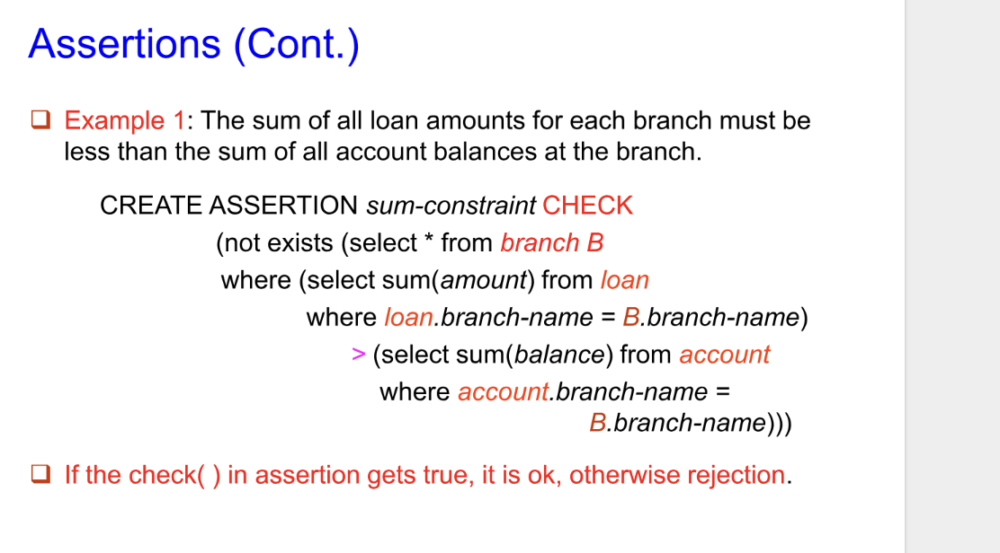
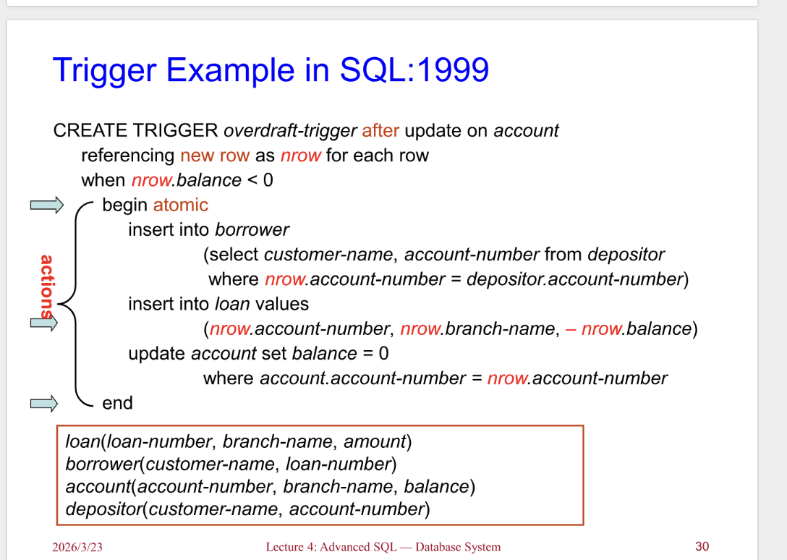

# 高级 SQL

---

## SQL内置类型 & 用户自定义类型（UDT）

### 1. 核心分类

- **Built-in data types（SQL内置数据类型）**：就是SQL自带的基础类型，比如`int`（整数）、`varchar(n)`（可变字符串）、`char(n)`（固定字符串）、`date`（日期）、`numeric(p,s)`（数值型）等，是所有数据库都支持的“原生类型”。
- **User-defined types（用户自定义类型，UDT）**：让用户基于内置类型，自己定义新的类型，分为两种：
  - **Structured data types（结构化类型）**：类似C语言的结构体，把多个字段打包成一个复合类型（比如把“姓名+年龄+地址”打包成`person`类型），属于复杂类型。
  - **Distinct types（ distinct 别名类型）**：给内置类型起一个**强类型的新名字**，相当于创建了一个独立的新类型，而不是简单的别名。

### 2. 代码例子逐行拆解

```sql
-- 1. 定义自定义类型 person_name：本质是 varchar(20)，但它是独立的强类型
Create type person_name as varchar(20);

-- 2. 创建 student 表，sname 字段使用自定义的 person_name 类型
Create table student
(sno char(10) primary key,  -- 学号：固定长度10的字符串，设为主键
 sname person_name,         -- 姓名：用自定义的person_name类型
 ssex char(1),              -- 性别：固定长度1的字符（比如'M'/'F'）
 birthday date);            -- 生日：日期类型

-- 3. 删除自定义类型 person_name（注意：表还在使用时，通常无法直接删除）
Drop type person_name;
```

**Distinct Type的核心特点**：**强类型校验**。
比如你再定义一个`product_name as varchar(20)`，它和`person_name`虽然底层都是`varchar(20)`，但属于两个完全独立的类型，**不能互相赋值**，从语法上避免了“把产品名误赋值给姓名”这类逻辑错误。

---

## 域（Domain）& 域 vs 类型的对比

### 1. 域（Domain）的概念

域是SQL中另一种自定义类型的方式，**本质是「带约束的内置类型别名」**，语法是`CREATE DOMAIN 域名 AS 内置类型 [约束条件]`。它的核心是：可以给类型附加额外的规则（比如非空、范围校验），但**不是强类型**。

### 2. 代码例子逐行拆解

```sql
-- 1. 定义域 Dollars：类型是 numeric(12,2)（总12位，小数2位），强制非空
Create domain Dollars as numeric(12, 2) not null;

-- 2. 定义域 Pounds：类型是 numeric(12,2)，允许为空
Create domain Pounds as numeric(12,2);

-- 3. 创建 employee 表，salary（工资）用 Dollars 域，comm（佣金）用 Pounds 域
Create table employee
(eno char(10) primary key,  -- 员工号：固定长度10的字符串，主键
 ename varchar(15),         -- 员工名：可变长度15的字符串
 job varchar(10),           -- 职位：可变长度10的字符串
 salary Dollars,            -- 工资：用Dollars域（非空、数值12,2）
 comm Pounds);               -- 佣金：用Pounds域（可空、数值12,2）
```

**Domain的核心特点**：

- 可以附加约束：比如`NOT NULL`、`CHECK (salary > 0)`、`DEFAULT 0`等，相当于给类型加了“统一规则”，不用在每个表中重复写约束。
- 非强类型：`Dollars`和`Pounds`底层都是`numeric(12,2)`，**完全兼容，可以互相赋值**，只是名字不同，本质还是同一个内置类型。

### 3. 域 vs Distinct Type 核心对比

PPT里标注了`Domain: Constraints, not strongly typed`，完整差异如下表：

| 特性                | Distinct Type（用户自定义类型） | Domain（域）                     |
|---------------------|----------------------------------|----------------------------------|
| 本质                | 强类型的独立新类型               | 带约束的内置类型别名             |
| 类型兼容性          | 同内置类型的不同别名不兼容       | 同内置类型的不同域完全兼容       |
| 约束支持            | 仅继承原类型约束，无法额外添加   | 可附加`NOT NULL`/`CHECK`等约束    |
| 核心作用            | 避免类型误用（语法层面防错）     | 统一约束、简化表结构定义         |
| 语法                | `CREATE TYPE ... AS ...`          | `CREATE DOMAIN ... AS ...`        |

---

## 三、整体总结

这两张PPT的核心是：

1. SQL除了基础内置类型，提供了两种自定义类型的方案：**Distinct Type（强类型别名）** 和 **Domain（带约束的别名）**。
2. 用完整代码演示了两种类型的「创建→表中使用→删除」全流程。
3. 明确了两者的定位差异：
   - Distinct Type：用强类型避免逻辑错误，适合需要严格区分语义的场景（比如姓名/产品名都是字符串，但不能混用）。
   - Domain：用统一约束简化开发，适合需要重复使用规则的场景（比如工资/金额都要求数值型、非空）。

---

### 补充：数据库支持情况

不同数据库对标准SQL的支持有差异：

- **PostgreSQL**：完整支持`CREATE TYPE`（distinct type）和`CREATE DOMAIN`。
- **MySQL**：不支持标准`CREATE DOMAIN`，但可以用`CHECK`、`ENUM`模拟域的功能；`CREATE TYPE`仅支持结构化类型，不支持distinct type。
- **SQL Server**：支持`CREATE TYPE`（别名类型），域的功能可以用`CREATE RULE`等实现。

---

这两页PPT是**SQL「数据类型与模式」主题的延续**，分别讲了「大对象存储类型」和「数据库层级架构」，我给你拆解得明明白白👇

---

## SQL 大对象类型（Large-object types）

这页解决的是**普通SQL类型存不下超大文件/文本**的问题，专门介绍了两种存储大文件的特殊数据类型。

### 1. 核心概念

普通类型（比如`varchar(255)`）只能存小数据，而**大对象（Large Object）**专门用来存：照片、视频、CAD图纸、超长文本、日志等超大文件，分为两种：
| 类型 | 全称 | 存储内容 | 核心特点 | 适用场景 |
|------|------|----------|----------|----------|
| `BLOB` | Binary Large Object（二进制大对象） | 未解析的二进制数据 | 数据库不理解数据内容，只当二进制存储，解析交给外部应用（比如图片查看器） | 照片、视频、压缩包、CAD文件、安装包等二进制文件 |
| `CLOB` | Character Large Object（字符大对象） | 大量字符数据 | 数据库能识别字符编码（如UTF-8），支持字符操作 | 超长简历、大段文章、日志、XML/JSON大文本 |

### 2. 关键性能特性

当你查询大对象字段时，**数据库不会直接返回整个大对象，而是返回一个「指针（pointer）」**：

- 原因：大对象可能几十MB甚至几GB，直接传输会严重拖慢性能，用指针只传引用，需要时再加载数据，大幅提升效率。

### 3. 代码例子逐行拆解

```sql
CREATE TABLE students (
    sid CHAR(10) PRIMARY KEY,  -- 学号：固定长度10的字符串，设为主键
    name VARCHAR(10),          -- 姓名：普通可变长度字符串（小数据）
    gender CHAR(1),            -- 性别：单字符（'M'/'F'）
    photo BLOB(20MB),          -- 学生照片：BLOB类型，最大存储20MB
    cv CLOB(10KB)              -- 学生简历：CLOB类型，最大存储10KB
);
```

- `photo BLOB(20MB)`：存学生的证件照/生活照（二进制文件，上限20MB）
- `cv CLOB(10KB)`：存学生的简历文本（大段字符，上限10KB）

---

## 目录、模式与环境（Catalogs, schemas and environments）

这页讲的是**SQL数据库的「三级层级结构」**，用来组织、隔离数据库对象（表、视图等），避免重名，方便权限管理。

### 1. 层级结构（从大到小，对应图的三层）

| 层级 | 图中对应标签 | 核心作用 | 例子 |
|------|--------------|----------|------|
| 1. Catalog（目录） | Database instances（数据库实例） | 数据库服务器的顶级容器，一个服务器可以有多个Catalog | 图中的`Catalog`、`Catalog2`，对应MySQL的`database`、PostgreSQL的`database` |
| 2. Schema（模式） | Schema (database) | Catalog下的二级容器，用来分类不同业务/项目的对象 | 图中的`bank`（银行业务）、`Library`（图书馆业务） |
| 3. 数据库对象 | Table, view, ... | Schema下的具体业务对象 | `bank`模式下的`account`（账户表）、`branch`（分行表）、`loan`（贷款表） |

### 2. 完整流程（对应图的箭头）

1.  **用户（user）** 登录（login）数据库服务器 → 进入指定的**Catalog（目录/数据库实例）**
2.  一个Catalog下可以有多个**Schema（模式）**，用来隔离不同业务（比如`bank`和`Library`完全分开）
3.  每个Schema下可以有多个**表、视图、存储过程**等业务对象（比如`bank`下的`account`、`branch`）

### 3. 核心价值

- **避免重名**：不同Schema下可以有同名表，比如`bank.account`和`Library.account`是两个完全独立的表，不会冲突
- **权限隔离**：可以给不同用户分配不同Schema的权限，比如银行员工只能访问`bank`模式，图书馆员工只能访问`Library`模式
- **标准命名规范**：SQL标准的完整对象名是 `Catalog.Schema.Table`，比如`main.bank.account`

### 4. 不同数据库的对应差异

| 数据库 | Catalog 对应 | Schema 对应 | 完整命名 |
|--------|--------------|-------------|----------|
| PostgreSQL | Database | Schema（如`public`） | `database.schema.table` |
| MySQL | Database | Database（≈Schema） | `database.table` |
| SQL Server | Database | Schema（如`dbo`） | `database.schema.table` |
| Oracle | Instance | User（用户） | `user.table` |

---

## 三、整体总结

这两页是SQL基础架构的核心知识点：

1.  第一页补充了「大对象类型」，解决了超大文件/文本的存储问题
2.  第二页讲了「数据库层级结构」，规范了数据库对象的组织方式，是企业级数据库设计的基础

---

### 补充：实际应用小贴士

- 大对象存储：现在很多项目会把大文件存到对象存储（如OSS、S3），数据库只存文件路径，而不是直接存BLOB/CLOB，性能和扩展性更好
- 模式使用：在企业级项目中，通常会按业务线划分Schema（比如`order`、`user`、`product`），方便维护和权限管理

这两页PPT是SQL **完整性约束（Integrity Constraints）** 的核心知识点，分三大块：**单表约束**、**域约束**、**参照完整性（外键约束）**，我给你逐部分拆解，从原理到例子全讲透👇

---

## 完整性约束

## 单表约束（Constraints on a single relation）

这部分讲的是**作用在单个表上的约束**，用来保证单表内数据的合法性，不需要关联其他表。

### 1. 4种核心单表约束

| 约束类型 | 核心作用 | 细节补充 |
|----------|----------|----------|
| `NOT NULL` | 强制字段**不能为NULL** | 比如“资产”这类业务必填字段，必须填值，不能空着 |
| `PRIMARY KEY` | 唯一标识表中每一行，**自动非空+唯一** | 一个表只能有1个主键，主键值绝对不能重复、不能为NULL |
| `UNIQUE` | 强制字段值**不能重复** | 可以为NULL（不同数据库有差异：MySQL允许多个NULL，Oracle只允许1个NULL），一个表可以有多个唯一约束 |
| `CHECK (P)` | 只有满足条件`P`（谓词/表达式）的数据才能插入/更新 | 比如“资产必须≥100”，不符合条件的数据会被数据库直接拒绝 |

### 2. 代码例子逐行拆解

```sql
CREATE TABLE branch2 (
    branch_name VARCHAR(30) PRIMARY KEY,  -- 1. 主键：支行名，唯一+非空，不能重复/为空
    branch_city VARCHAR(30),              -- 2. 支行城市：无额外约束，可空/重复
    assets INTEGER NOT NULL,              -- 3. 非空约束：资产必须填值，不能为NULL
    CHECK (assets >= 100)                 -- 4. 检查约束：资产必须≥100，否则插入/更新失败
);
```

- 违反约束的典型场景：
  - 插入`branch_name = '北京支行'`两次 → 主键约束报错（值重复）
  - 插入`assets = NULL` → `NOT NULL`约束报错
  - 插入`assets = 50` → `CHECK`约束报错（数值<100）

---

## 域约束（Domain Constraints）

这是**作用在自定义域（Domain）上的全局约束**，属于SQL-92标准，相当于给「自定义类型」附加统一的检查规则，不用在每个表中重复写约束。

### 1. 核心原理

域（Domain）是之前讲过的「带约束的类型别名」，域约束就是给域附加`CHECK`规则，**所有使用该域的表，都会自动应用这个约束**，实现规则复用、统一管理。

### 2. 代码例子逐行拆解

```sql
CREATE DOMAIN hourly-wage NUMERIC(5, 2)
    CONSTRAINT value-test CHECK (value >= 4.00);
```

- `CREATE DOMAIN hourly-wage`：创建名为`hourly-wage`的自定义域，底层类型是`NUMERIC(5,2)`（总长度5位，小数2位，比如`15.50`）
- `CONSTRAINT value-test`：给约束起名字（**可选，但强烈推荐**）：好处是当数据违反约束时，数据库会明确报“违反了`value-test`约束”，快速定位问题
- `CHECK (value >= 4.00)`：检查条件：所有用`hourly-wage`域的字段，值必须≥4.00，比如插入`3.50`会直接报错
- 补充：`value`是域约束的关键字，代表当前字段的值，无需写具体字段名

### 3. 域约束 vs 单表CHECK约束

| 对比项 | 域约束 | 单表CHECK约束 |
|--------|--------|---------------|
| 作用范围 | 全局（所有用该域的表） | 局部（仅当前表） |
| 复用性 | 一次定义，多处使用 | 每个表都要重复写 |
| 维护性 | 统一修改域约束，所有表自动生效 | 每个表都要单独修改 |

---

## 参照完整性（Referential Integrity，外键约束）

这是**多表之间的约束**，是关系型数据库的核心特性，用来保证关联数据的一致性，彻底避免“脏数据”。

### 1. 形式化定义（PPT原文）

- 设`r1(R1)`和`r2(R2)`是两个关系（表），分别有主键`K1`和`K2`
- `R2`的子集`α`（即`r2`表的1个/多个字段）是**外键（foreign key）**，引用`r1`表的主键`K1`
- 约束规则：对于`r2`表中的每一行`t2`，在`r1`表中必须存在一行`t1`，使得`t1[K1] = t2[α]`
- 也叫**子集依赖（subset dependency）**，数学表达式：
  $$\Pi_\alpha(r_2) \subseteq \Pi_{K1}(r_1)$$

  - $\Pi$ 是**投影（projection）**操作：从表中提取指定字段的所有值
  - 含义：`r2`表外键`α`的所有值，必须是`r1`表主键`K1`值的**子集** → 外键不能出现主键里没有的值

### 2. 通俗解释+业务例子

- 通俗理解：**外键的值必须在被引用的主键里存在，绝对不能“无中生有”**
- 业务场景：
  - 表1：`user`（用户表），主键`user_id`（用户ID）
  - 表2：`order`（订单表），外键`user_id`引用`user`表的`user_id`
  - 约束效果：
    - 不能给一个不存在的`user_id`下单（比如`user_id=999`在`user`表不存在，订单表插入`user_id=999`会直接报错）
    - 不能删除`user`表中还有订单的用户（除非设置了`ON DELETE CASCADE`级联删除）

### 3. 核心作用

- 保证多表关联的一致性，彻底消灭“孤儿数据”（比如订单有用户，但用户表已经删除了该用户）
- 是关系型数据库“关系”的核心体现，用约束强制表之间的关联逻辑

---

## 四、三类约束的完整对比表

| 约束类型 | 作用范围 | 核心目标 | 典型场景 |
|----------|----------|----------|----------|
| 单表约束 | 单个表 | 保证单表数据的合法性 | 资产≥100、主键唯一、非空 |
| 域约束 | 自定义域（全局） | 统一类型规则，简化开发 | 时薪≥4.00、手机号格式校验 |
| 参照完整性 | 多个表 | 保证多表关联的一致性 | 订单用户必须存在、部门员工必须属于有效部门 |

---

## 五、补充实操小贴士

1.  **数据库支持差异**：
    - `CHECK`约束：MySQL 8.0.16+ 才真正支持，之前版本会忽略；PostgreSQL、SQL Server完整支持
    - `CREATE DOMAIN`：PostgreSQL完整支持，MySQL不支持标准语法（可用`CHECK`模拟），SQL Server支持
    - 参照完整性：所有主流关系型数据库（MySQL/PostgreSQL/SQL Server）都完整支持
2.  **参照完整性的级联操作**：
    为了避免删除父表行时报错，可以设置级联操作：

    - `ON DELETE CASCADE`：删除父表行时，自动删除子表对应行
    - `ON UPDATE CASCADE`：更新父表主键时，自动更新子表外键
    - `ON DELETE SET NULL`：删除父表行时，把子表外键设为NULL
3.  **约束命名的重要性**：
    给约束起名字（比如`CONSTRAINT pk_branch_name`、`CONSTRAINT value-test`），报错时能快速定位问题，尤其适合复杂表结构

这三页PPT是**关系型数据库「参照完整性（Referential Integrity）」**的核心知识点，完整覆盖了**约束的数学定义、三种数据库操作的校验规则、SQL语法实现**，我给你从原理到实操拆解得明明白白👇

---

## 参照完整性

## 一、核心前提：参照完整性的数学定义（所有内容的根逻辑）

先看懂这个公式，所有操作都是围绕它展开的：
$$\Pi_\alpha(r_2) \subseteq \Pi_K(r_1)$$

### 符号&含义拆解：

| 符号 | 含义 | 通俗例子 |
|------|------|----------|
| $r_1$ | **父表（被引用表）**，比如`user`（用户表） | 存储所有合法用户的表 |
| $r_2$ | **子表（引用表）**，比如`order`（订单表） | 存储订单的表，需要关联用户 |
| $K$ | 父表$r_1$的**主键**（唯一标识行，比如`user_id`） | 用户表的`user_id`，每个用户唯一 |
| $\alpha$ | 子表$r_2$的**外键**（引用父表主键的字段，比如`user_id`） | 订单表的`user_id`，用来关联用户 |
| $\Pi_K(r_1)$ | 关系代数「投影操作」：提取父表主键的所有取值 | 用户表中所有存在的`user_id`集合 |
| $\Pi_\alpha(r_2)$ | 提取子表外键的所有取值 | 订单表中所有订单的`user_id`集合 |
| $\subseteq$ | 子集符号 | 子表外键的所有值，必须是父表主键值的一部分 |

### 公式本质：

**子表外键的所有取值，绝对不能出现父表主键里没有的值**，从根本上保证多表关联的一致性，彻底消灭“孤儿数据”（比如订单有用户，但用户表已经删了该用户）。

---

## 二、三种数据库操作的参照完整性校验（对应第3、1张PPT）

数据库在执行**插入、删除、更新**操作时，会自动校验上面的公式，保证约束不被破坏，分三种场景：

### 1. 插入操作（Insert：往子表$r_2$插新元组）

- **场景**：给子表（比如订单表）插入一条新订单$t_2$
- **校验规则**：必须保证新订单的外键值$t_2[\alpha]$（比如`user_id=999`），存在于父表主键的集合中，即：
  $$t_2[\alpha] \in \Pi_K(r_1)$$

- **通俗例子**：给订单表插`user_id=999`的订单，必须先保证`user`表中存在`user_id=999`的用户，否则数据库直接报错，拒绝插入。
- **本质**：保证新插入的子表数据，不会违反“外键是父表主键子集”的规则。

---

### 2. 删除操作（Delete：从父表$r_1$删元组）

- **场景**：从父表（比如用户表）删除用户$t_1$（比如删除用户A）
- **校验步骤**：
  1.  执行**选择操作**$\sigma_{\alpha = t_1[K]}(r_2)$：找出子表中所有引用了该用户的订单（比如订单表中`user_id=A`的所有订单）
  2.  根据结果分两种处理：
      - ✅ 无引用订单：直接删除用户
      - ❌ 有引用订单：
        1.  **默认行为**：拒绝删除，报错（用户还有订单，不能删）
        2.  **级联删除（Cascading Deletions）**：删除用户时，自动删除该用户的所有订单
- **通俗例子**：删用户A，先查订单表有没有A的订单。有订单的话，要么不让删，要么把A的订单全删掉。

---

### 3. 更新操作（Update：修改子表$r_2$的外键）

- **场景**：更新子表（比如订单表）的订单$t_2$，修改了外键$\alpha$（比如把订单的`user_id`从123改成456）
- **校验规则**：和插入操作完全一致，必须保证**更新后的新订单$t_2'$的外键值**，存在于父表主键的集合中，即：
  $$t_2'[\alpha] \in \Pi_K(r_1)$$

- **补充：父表主键更新的情况**
  如果是修改父表的主键（比如把用户A的`user_id`从123改成456），处理逻辑和删除类似：

  - 先查子表有没有引用该主键的订单
  - 要么拒绝更新，要么**级联更新**子表的外键（把订单的`user_id`从123改成456）
- **通俗例子**：把订单的`user_id`从123改成456，必须保证456这个用户ID在`user`表中存在，否则报错。

---

## 三、SQL中参照完整性的语法实现（对应第2张PPT）

这部分讲的是在`CREATE TABLE`时，如何用SQL语法定义主键、候选键、外键，落地上面的约束。

### 1. 三个核心子句

| 子句 | 作用 | 补充 |
|------|------|------|
| `PRIMARY KEY` | 定义表的**主键**（唯一标识行，自动非空+唯一） | 一个表只能有1个主键 |
| `UNIQUE KEY` | 定义表的**候选键**（唯一约束，可空，一个表可多个） | 候选键是“备选主键”，满足唯一性 |
| `FOREIGN KEY` | 定义**外键**，指定引用的父表和列 | 实现参照完整性的核心 |

---

### 2. 外键的三种定义方式

#### （1）默认规则：外键引用父表的主键（最常用）

默认情况下，`FOREIGN KEY`会自动引用**被引用表的主键**，无需显式指定列。

- 完整写法：

  ```sql
  CREATE TABLE `order` (
      order_id INT PRIMARY KEY,
      order_amount DECIMAL(10,2),
      user_id INT,
      -- 外键：user_id 引用 user 表的主键（user_id）
      FOREIGN KEY (user_id) REFERENCES user
  );
  ```

- **单列简写形式**（PPT里的Short form）：当外键是单列时，可直接在字段后加`REFERENCES 表名`，省略`FOREIGN KEY`子句：

  ```sql
  CREATE TABLE `order` (
      order_id INT PRIMARY KEY,
      order_amount DECIMAL(10,2),
      -- 简写：直接在字段后加 REFERENCES user
      user_id INT REFERENCES user
  );
  ```

#### （2）显式指定引用列（引用父表的候选键）

如果外键引用的不是父表的主键，而是父表的**候选键（UNIQUE KEY）**，必须显式指定引用的列，且被引用列必须是主键/候选键：

```sql
-- 父表：user，用 phone 作为候选键（UNIQUE）
CREATE TABLE user (
    user_id INT PRIMARY KEY,
    phone VARCHAR(11) UNIQUE -- 候选键
);

-- 子表：order，外键引用 user 表的 phone 列（候选键）
CREATE TABLE `order` (
    order_id INT PRIMARY KEY,
    user_phone VARCHAR(11),
    -- 显式指定引用 user 表的 phone 列
    FOREIGN KEY (user_phone) REFERENCES user(phone)
);
```

---

### 3. 级联操作（实际开发必用，解决删除/更新报错）

为了避免删除/更新父表时报错，可在定义外键时添加级联规则：

```sql
CREATE TABLE `order` (
    order_id INT PRIMARY KEY,
    user_id INT,
    FOREIGN KEY (user_id) REFERENCES user
        -- 级联删除：删用户时，自动删该用户的订单
        ON DELETE CASCADE
        -- 级联更新：改用户ID时，自动改订单的用户ID
        ON UPDATE CASCADE
);
```

- 常用级联选项：
  - `ON DELETE CASCADE`：删除父表行时，自动删除子表中所有引用它的行
  - `ON UPDATE CASCADE`：更新父表主键时，自动更新子表中所有引用它的外键
  - `ON DELETE SET NULL`：删除父表行时，子表外键设为NULL（需外键允许为空）
  - `ON DELETE RESTRICT`：默认行为，拒绝删除（保证数据安全）

---

## 四、核心知识点总结

1.  **参照完整性的本质**：子表外键必须是父表主键的子集，从语法层面强制多表关联的一致性
2.  **三种操作的校验逻辑**：
    - 插子表：外键必须在父表存在
    - 删父表：有子表引用时，要么拒绝，要么级联删子表
    - 改子表外键：新外键必须在父表存在
3.  **SQL语法要点**：
    - 主键用`PRIMARY KEY`，候选键用`UNIQUE`，外键用`FOREIGN KEY ... REFERENCES`
    - 单列外键可以简写，引用候选键必须显式指定列
    - 级联操作可简化维护，避免业务报错

---

## 五、补充：数据库支持差异

| 数据库 | 外键支持 | 级联操作支持 | 注意事项 |
|--------|----------|--------------|----------|
| MySQL（InnoDB） | 完整支持 | 完整支持 | MyISAM引擎不支持外键，8.0.16+ 才真正支持`CHECK`约束 |
| PostgreSQL | 完整支持 | 完整支持 | 标准SQL的最佳实现，所有约束严格生效 |
| SQL Server | 完整支持 | 完整支持 | 语法与标准SQL完全一致 |
| Oracle | 完整支持 | 完整支持 | 外键默认引用父表主键，级联操作语法一致 |

## 举例

## 一、第一页：SQL完整性约束的实战建表示例

这页用**银行系统的业务场景**，演示了如何在`CREATE TABLE`中定义主键、外键，落地参照完整性约束，包含两个核心表：`account`（账户表）和`depositor`（存款人表）。

### 1. `account` 表（账户表）

```sql
CREATE TABLE account (
    account-number char(10),   -- 账号：固定长度10的字符串
    branch-name char(15),      -- 支行名：固定长度15
    balance integer,           -- 账户余额：整数
    PRIMARY KEY (account-number),  -- 主键：账号唯一标识每个账户（自动非空+唯一）
    FOREIGN KEY (branch-name) REFERENCES branch  -- 外键：支行名引用`branch`表（父表）的主键
);
```

- **约束作用**：
  - 主键`account-number`：保证每个账号唯一，不能重复、不能为空。
  - 外键`branch-name`：**参照完整性约束**，强制「账户的支行必须是`branch`表中真实存在的支行」，不能给不存在的支行开账户。
  - 父表是`branch`（支行表），子表是`account`（账户表）。

### 2. `depositor` 表（存款人表，多对多中间表）

```sql
CREATE TABLE depositor (
    customer-name char(20),    -- 客户名：固定长度20
    account-number char(10),   -- 账号：固定长度10
    PRIMARY KEY (customer-name, account-number),  -- 复合主键：客户名+账号组合唯一
    FOREIGN KEY (account-number) REFERENCES account,  -- 外键1：账号引用`account`表的主键
    FOREIGN KEY (customer-name) REFERENCES customer   -- 外键2：客户名引用`customer`表的主键
);
```

- **约束作用**：
  - 复合主键：一个客户可以有多个账户，一个账户可以属于多个客户（联名账户），所以用「客户名+账号」组合唯一标识一条存款关系。
  - 两个外键：
    - `account-number`：保证存款记录的账号必须是`account`表中真实存在的账户。
    - `customer-name`：保证存款记录的客户必须是`customer`表中真实存在的客户。
  - 这个表是**多对多关系的中间表**，关联`customer`（客户表）和`account`（账户表）。

---

## 二、第二页：SQL中的级联操作（Cascading Actions）

这页讲的是**参照完整性的「级联规则」**，用来解决「删除/更新父表时，子表有引用导致报错」的问题，核心是`ON DELETE CASCADE`和`ON UPDATE CASCADE`。

### 1. 级联操作的语法与作用

```sql
CREATE TABLE account (
    ...
    FOREIGN KEY (branch-name) REFERENCES branch
        [ON DELETE CASCADE]   -- 级联删除
        [ON UPDATE CASCADE]   -- 级联更新
    ...
);
```

| 级联规则 | 作用 | 通俗例子 |
|----------|------|----------|
| `ON DELETE CASCADE` | 删除父表行时，**自动删除子表中所有引用它的行**，不会报错 | 删除「北京支行」时，自动删除`account`表中所有属于北京支行的账户 |
| `ON UPDATE CASCADE` | 更新父表主键时，**自动更新子表中所有引用它的外键**，不会报错 | 把「北京支行」改名为「北京朝阳支行」时，自动更新`account`表中所有对应账户的`branch-name` |

- **默认行为**：不加级联规则时，是`ON DELETE RESTRICT`/`ON UPDATE RESTRICT`：如果子表有引用，直接拒绝删除/更新，报错。

### 2. 级联的连锁效应（Chain of Dependencies）

如果多个表之间通过外键形成依赖链，且每个外键都加了级联规则，那么**一端的删除/更新会沿着链传播到所有关联表**：

- 例子：`branch` → `account` → `depositor`，三个表的外键都加了`ON DELETE CASCADE`
- 操作：删除`branch`表的「北京支行」
- 连锁效应：先删除`account`表中北京支行的所有账户 → 再删除`depositor`表中这些账户对应的所有存款记录 → 整个链的关联数据被级联删除。

### 3. 事务回滚机制

如果级联操作过程中出现了**无法处理的约束违反**（比如级联删除后，某个表的`CHECK`约束不满足、或者其他外键冲突），系统会**中止整个事务**，并撤销所有已经执行的修改（包括级联操作的修改），保证数据一致性：

- 结果：事务执行前后，数据库状态完全一致，不会出现部分修改的脏数据。

---

## 三、第三页：级联的替代方案 + 延迟约束（Deferrable Constraints）

### 1. 级联的替代方案

除了`CASCADE`，还有两种处理父表删除的方案：
| 替代方案 | 作用 | 适用场景 |
|----------|------|----------|
| `ON DELETE SET NULL` | 删除父表行时，**把子表的外键字段设为`NULL`** | 比如删除支行后，把账户的`branch-name`设为`NULL`（表示无归属支行） |
| `ON DELETE SET DEFAULT` | 删除父表行时，**把子表的外键字段设为预设的默认值** | 比如删除支行后，把账户的`branch-name`设为默认的「总行」 |

#### ⚠️ 外键`NULL`的风险

SQL标准规定：**如果外键的某个属性为`NULL`，这条元组会被认为满足外键约束**。这会导致：

- 账户的`branch-name`为`NULL`，表示账户没有归属支行，破坏业务逻辑。
- 解决方案：给外键加`NOT NULL`约束，彻底禁止外键为`NULL`，保证参照完整性的语义。

### 2. 延迟约束（Deferrable Constraints）

这是SQL中处理「循环依赖」和「批量插入」的关键特性：

- **默认行为（`NOT DEFERRABLE`）**：约束**立即检查**，每执行一条SQL就校验约束，违反就报错。
- **延迟约束（`DEFERRABLE`）**：约束在**事务结束（`COMMIT`）前**统一检查，中间步骤可以违反约束，只要事务最终满足约束即可。

#### 典型应用场景：循环依赖的表

比如两个表互相引用：

- `A`表的外键引用`B`表的主键
- `B`表的外键引用`A`表的主键
- 如果是立即检查：插入`A`时`B`还没数据 → 报错；插入`B`时`A`还没数据 → 报错，永远无法插入。
- 用延迟约束：先插`A`，再插`B`，事务提交时检查，两个表都有数据 → 约束通过，成功插入。

---

## 四、核心知识点总结

1.  **实战建表**：用主键、外键落地参照完整性，中间表实现多对多关系。
2.  **级联操作**：`ON DELETE CASCADE`/`ON UPDATE CASCADE`解决父表删除/更新的报错，连锁效应会传播到所有关联表，事务回滚保证一致性。
3.  **替代方案**：`SET NULL`/`SET DEFAULT`，但要注意外键`NULL`的业务风险，优先用`NOT NULL`。
4.  **延迟约束**：处理循环依赖和批量插入，延迟约束检查到事务结束，灵活度更高。

---

## 五、实际开发的最佳实践

- **级联操作的使用原则**：
  - 业务上允许「父表删除，子表数据同步删除」时，用`ON DELETE CASCADE`（比如删除用户，同步删除订单）。
  - 不允许级联删除时，用`ON DELETE RESTRICT`（默认），强制手动处理子表数据，避免误删。
- **外键`NOT NULL`**：绝大多数业务场景下，外键都应该加`NOT NULL`，避免无归属的脏数据。
- **延迟约束的使用场景**：仅在处理循环依赖、批量数据迁移时使用，日常业务优先用默认的立即检查，保证数据实时一致性。

---

## 断言

这两页PPT是在讲解**数据库SQL中的「断言（Assertions）」**，这是一种用于保障数据库**全局数据完整性**的约束机制，专门解决普通约束无法覆盖的「跨表复杂规则」问题。下面分模块给你讲透：

---

### 一、什么是「断言（Assertions）」？

- **核心定义**：断言是一个**谓词（条件表达式）**，用来定义「数据库必须**始终满足**」的业务/数据规则。
- **核心价值**：普通的`CHECK`约束通常只能做**单表、单行**的检查（比如“年龄>0”），而断言可以实现**跨多个表（关系）的复杂条件检查**（比如跨表聚合后比较、全局规则等），这是它的核心用途。

---

### 二、SQL中断言的语法与执行逻辑

#### 1. 语法格式

```sql
CREATE ASSERTION <断言名称>
CHECK <谓词（条件表达式）>;
```

- `CREATE ASSERTION`：创建断言的关键字
- `<断言名称>`：给这个约束起一个唯一的名字
- `CHECK <谓词>`：定义需要数据库始终满足的条件（可以是跨表的复杂逻辑）

#### 2. 触发与验证规则

- **触发时机**：数据库会在**每一次可能违反该断言的更新操作**（`INSERT`/`UPDATE`/`DELETE`）时，自动验证断言的条件。
- **验证逻辑**：
  - 如果`CHECK`后的谓词结果为`TRUE`：说明满足约束，操作正常执行；
  - 如果为`FALSE`：说明违反约束，系统会报错并**拒绝这次更新**。
- **性能注意**：这种全局、高频的检查会带来**极大的性能开销（overhead）**，因此PPT明确强调：**断言必须谨慎使用**，避免在高并发、大数据量场景滥用。

---

### 三、实际应用例子

PPT举了一个银行业务的典型场景：
> 要求「**每个支行（branch）的所有贷款（loan）总金额，必须小于该支行的所有账户（account）总余额**」

这个约束的特点：

- 需要跨`loan`（贷款表）和`account`（账户表）两个表；
- 需要对两个表分别按`branch`分组、聚合求和（贷款总额、账户总额）；
- 再对每个支行的两个总和做比较。
这类**跨表、聚合后比较**的复杂规则，单表的`CHECK`约束完全无法实现，必须用断言来定义。



---

### 四、SQL中的逻辑转换：全称量词的实现

这部分是SQL语法的一个关键细节：

- **原生限制**：SQL本身**不直接支持「全称量词（`for all X, P(X)`，即逻辑中的`∀x P(x)`）」**的语法，没法直接写“所有X都满足P(X)”。
- **等价转换**：利用逻辑学的经典等价式，把全称量词转换成「不存在反例」的形式：
  $$\forall x \, P(x) \equiv \neg \left( \exists x \, \neg P(x) \right)$$
  通俗来说：**“所有X都满足P(X)” 完全等价于 “不存在X不满足P(X)”**

- **SQL实现**：用`NOT EXISTS`间接实现全称约束，写法为：

  ```sql
  NOT EXISTS (SELECT * FROM X WHERE NOT P(X))
  ```

  也就是“不存在某个X，使得P(X)不成立”，从而等价实现了“所有X都满足P(X)”的规则。

---

### 五、补充：实际开发中的现状

虽然标准SQL定义了断言，但**绝大多数主流数据库（如MySQL、PostgreSQL早期版本）并没有完整实现断言功能**——因为它的性能开销实在太高，实际生产中通常用「触发器（Trigger）」或者「应用层校验」来替代实现跨表约束，这也是PPT强调“谨慎使用”的核心原因。

---

## 触发

这两页PPT是在讲解**数据库SQL中的「触发器（Triggers）」**，这是数据库里非常实用的「自动执行机制」，用来在数据发生修改时，自动触发预设的逻辑，实现业务规则、数据完整性、自动化处理等需求。

---

### 一、什么是触发器？（第一页核心）

#### 1. 核心定义

> A trigger is a statement that is executed automatically by the system as a side-effect of a modification to the database.

通俗来说：**触发器是绑定在数据库修改操作（`INSERT`/`UPDATE`/`DELETE`）上的“自动执行代码”**。

- 当你对数据库做增、删、改操作时，只要满足触发器设定的条件，系统就会**自动、无需手动调用**地执行触发器里的逻辑，相当于数据修改的“副作用”。

#### 2. 设计触发器的两个核心要素

要定义一个触发器，必须明确两件事：

1.  **触发条件（Conditions）**：什么时候触发？
    - 比如：对哪个表、做什么操作（增/删/改）、数据满足什么条件（比如余额变负）时触发。
2.  **触发动作（Actions）**：触发后做什么？
    - 比如：修改数据、插入新记录、记录日志、抛出错误等。

#### 3. 标准与定位

- 触发器在**SQL:1999（SQL3）**标准中才被正式纳入，但绝大多数数据库（Oracle、MySQL、SQL Server等）在标准出台前，就已经用非标准语法支持了这个功能，是数据库的经典特性。
- 它属于**存储过程（Stored Procedures）**的一种：代码存储在数据库中，由数据库引擎执行。

---

### 二、触发器的实际例子（第二页，银行账户场景）

用一个非常直观的银行业务场景，把抽象概念落地：

#### 业务需求

银行不允许账户余额为负数，当用户操作导致账户透支（余额变负）时，系统自动处理，而不是直接拒绝操作：
> 处理规则：
> 1.  把该账户的余额重置为0（消除负数）
> 2.  为该账户创建一笔贷款，贷款金额等于透支的金额（也就是原来的负数绝对值），并且贷款号和账户号保持一致，方便关联账户和贷款。

#### 触发器的两个核心部分

- **触发条件**：
  > 对`account`（账户）表执行`UPDATE`操作，**导致账户的`balance`（余额）字段变成负数**时，触发这个触发器。

- **触发动作**：
  1.  执行`UPDATE`把该账户余额设为0
  2.  执行`INSERT`生成一笔对应金额的贷款，贷款号与账户号相同

---

### 三、和上一页「断言（Assertions）」的核心区别（帮你串联知识点）

| 特性 | 断言（Assertion） | 触发器（Trigger） |
|------|-------------------|-------------------|
| 核心作用 | **数据约束校验**：只做“是否允许操作”的检查 | **自动执行逻辑**：不仅能校验，还能主动修改数据、执行任意操作 |
| 执行结果 | 满足条件：操作通过；不满足：直接报错、拒绝操作 | 可以主动修正数据（比如把负数改成0），让操作合法，也可以拒绝操作 |
| 性能开销 | 全局校验，开销大，适合静态规则 | 按需触发，逻辑灵活，适合动态业务规则 |
| 实现复杂度 | 语法简单，只写`CHECK`条件 | 需要写完整的执行逻辑，复杂度更高 |

---



这两页PPT是**SQL触发器的进阶知识点**，分为两大核心模块：「触发器的触发规则与类型」和「如何用触发器实现数据库外部的业务动作」，我结合你之前学的内容，给你拆解得明明白白：

---

## 触发详细

## SQL触发器的触发事件与类型

### 1. 触发事件（Triggering Events）

触发器的触发时机，只能是数据库的**3种写操作**：

- `INSERT`（插入数据）
- `DELETE`（删除数据）
- `UPDATE`（更新数据）

#### 🔍 UPDATE的精细化控制

`UPDATE`触发器可以**只针对特定列触发**，而非整个表任何列修改都触发，大幅提升效率：

- 比如你之前学的「透支触发器」：`after update of balance on account`
  → 只有当`account`表的`balance`（余额）列被修改时才触发；如果修改`customer-name`、`branch-name`等其他列，完全不触发。

### 2. 新旧行数据引用（old row / new row）

在`UPDATE`操作中，你可以同时拿到**修改前**和**修改后**的完整行数据：
| 引用方式 | 适用操作 | 含义 | 例子 |
|----------|----------|------|------|
| `old row` | `DELETE` / `UPDATE` | 修改/删除**前**的行数据 | `old row.balance`：更新前的账户余额 |
| `new row` | `INSERT` / `UPDATE` | 插入/修改**后**的行数据 | 你之前的`nrow`就是这个的别名 |

---

### 3. 行级触发器 vs 语句级触发器（核心对比）

你之前学的透支触发器是**行级触发器（`for each row`）**，这一页补充了另一种：**语句级触发器（`for each statement`）**

| 特性 | 行级触发器（Row-level） | 语句级触发器（Statement-level） |
|------|--------------------------|----------------------------------|
| 触发时机 | 每影响**1行数据**，就执行1次动作 | 整个SQL语句执行完，**只执行1次动作**（不管影响多少行） |
| 数据引用 | `old row` / `new row`（单条行数据） | `old table` / `new table`（临时过渡表，包含所有被影响的行） |
| 适用场景 | 逐行校验、逐行处理（比如透支处理、审计日志） | 大批量数据更新、统计类操作（比如批量更新库存后统计总变化） |
| 性能 | 影响N行就触发N次，开销大 | 只触发1次，批量处理更高效 |

---

## 二、第二页：如何用触发器实现「数据库外部动作」

### 1. 什么是「外部世界动作」？

就是**数据库本身无法直接执行的、发生在数据库之外的操作**，比如：

- 仓库库存低于警戒线，自动给供应商发采购订单
- 账户异常交易，自动给用户发短信/邮件报警
- 机房温度过高，自动触发报警灯、空调
- 这些都不是SQL能直接执行的，属于「外部系统/物理操作」

### 2. 核心限制：触发器不能直接执行外部动作

触发器是数据库内部的代码，**只能执行SQL语句**，无法直接调用外部程序、发网络请求、控制硬件。

### 3. 标准解决方案：「待办表 + 外部进程」的间接实现

用两步绕开限制，完美实现需求：

1.  **第一步：用触发器记录待办**
    当满足触发条件时，触发器只做一件事：把需要执行的外部动作，**写入一个专门的「待办表」（比如`orders`表）**。
    比如：库存低于警戒线 → 触发器往`orders`表插一条「商品A，补货100件」的记录。

2.  **第二步：外部进程执行动作**
    用一个独立的外部进程（比如定时脚本、守护进程、ETL工具），**反复扫描这个待办表**：

    - 读取到待办记录 → 执行对应的外部动作（发采购单、发短信）
    - 执行完成后 → 从待办表删除这条记录（标记已处理）

---

### 4. 仓库库存的完整例子（PPT落地场景）

PPT用仓库管理的例子，把这个流程完全跑通，4张表各司其职：
| 表名 | 作用 | 字段含义 |
|------|------|----------|
| `inventory(item, level)` | 当前库存表 | 记录每个商品`item`的当前库存`level` |
| `minlevel(item, level)` | 警戒线表 | 记录每个商品的最低库存阈值（低于这个数就要补货） |
| `reorder(item, amount)` | 补货规则表 | 记录每个商品低于警戒线时，一次补多少货`amount` |
| `orders(item, quantity)` | 待办订单表 | 触发器写入的补货订单，给外部进程读取执行 |

#### 完整执行流程：

1.  仓库出库 → `inventory`表的`level`（库存）被`UPDATE`减少
2.  触发器触发：检查该商品的`inventory.level`是否 < `minlevel.level`
3.  如果低于阈值 → 从`reorder`表取出该商品的补货量`amount`，往`orders`表插入一条补货订单
4.  外部进程（比如每天凌晨跑的脚本）扫描`orders`表：
    - 读取所有待补货订单 → 自动生成采购单发给供应商
    - 采购单发出后 → 从`orders`表删除对应记录，完成闭环

---

ppt还有不少 自己看

## 权限

## Authorization（数据库安全与授权）

这页讲的是**数据库安全的「纵深防御体系」**：数据安全不是只靠数据库本身，而是要从多个层级层层防护，防止数据被窃取、篡改。

### 1. 安全的核心目标

> Security - protection from malicious attempts to steal or modify data.
翻译：安全 = 保护数据，防止被恶意窃取、修改。

### 2. 5层安全防护体系（从技术到管理）

| 层级 | 核心防护点 | 关键说明 |
|------|------------|----------|
| **数据库系统层级**（本章核心） | 认证+授权 | - 认证（Authentication）：验证「你是谁」（账号密码、双因子等）<br>- 授权（Authorization）：给用户**最小必要权限**，只允许访问需要的数据（比如普通员工只能看自己的工资） |
| **操作系统层级** | 服务器权限管控 | 操作系统超级用户（root/admin）可以完全控制数据库，因此必须严格管控服务器登录权限，防止越权访问 |
| **网络层级** | 传输加密 | 必须用SSL/TLS等加密技术，防止两类攻击：<br>- 窃听（Eavesdropping）：抓包窃取数据、密码<br>- 伪装（Masquerading）：冒充授权用户发送恶意请求 |
| **物理层级** | 机房/硬件安全 | - 物理访问服务器会导致数据被破坏，需要机房门禁、机柜锁等物理防护<br>- 还要防范洪水、火灾等自然灾害，属于数据恢复（Recovery）范畴 |
| **人员层级** | 内部风险管控 | - 防止授权用户泄露权限（比如共享账号），需要人员背景筛查<br>- 培训用户设置强密码、保护密码安全，避免人为泄露 |

---

这页PPT讲的是**数据库安全中「视图（View）」在权限控制（授权）里的核心作用**，是实现「最小权限原则」的关键手段，也是生产环境中最常用的精细化数据安全方案。

---

## 视图授权

### 1. 视图级授权的核心特性

> Users can be given authorization on views, without being given any authorization on the relations used in the view definition.
**通俗翻译**：可以给用户**授予视图的操作权限**，但**完全不授予视图所依赖的底层表（关系）的任何权限**。

#### 直观例子：

- 底层表 `employee`（员工表）：包含`员工号、姓名、部门、工资、身份证号`等所有敏感信息。
- 创建仅开放非敏感信息的视图：

  ```sql
  CREATE VIEW employee_public_view AS
  SELECT 员工号, 姓名, 部门 FROM employee;
  ```

- 授权操作：

  ```sql
  -- 给普通员工授予视图的查询权限
  GRANT SELECT ON employee_public_view TO staff_user;
  -- 不给员工授予employee表的任何权限
  ```

✅ 最终效果：员工只能通过视图看到「员工号、姓名、部门」，**完全看不到工资、身份证号等敏感数据**，且根本无法直接访问底层`employee`表，从根源避免越权。

---

### 2. 视图的两大核心价值

> Ability of views to hide data serves both to simplify usage of the system and to enhance security by allowing users access only to data they need for their job.
视图的「数据隐藏」能力，带来两个核心好处：

#### ① 简化系统使用

用户不需要写复杂的多表关联、过滤查询，直接用预定义好的视图，就能拿到自己需要的数据，降低使用门槛、减少出错概率。
比如：财务人员只需要查询`salary_view`（工资视图），不用自己写`JOIN`关联多张表。

#### ② 提升数据安全性

严格遵循**最小权限原则（Least Privilege）**：只给用户开放「工作必需的数据」，隐藏无关/敏感数据。
比如：

- 客服只能访问`customer_contact_view`（客户联系方式视图），看不到客户财务、隐私数据；
- 部门经理只能访问`dept_employee_view`（本部门员工视图），看不到其他部门信息。

---

### 3. 表级+视图级的组合权限管控

> A combination of relational-level security and view-level security can be used to limit a user's access to precisely the data that user needs.
**通俗翻译**：把「表级（关系级）安全」和「视图级安全」结合，能把用户的访问权限，精确限制在「刚好需要的数据」上，实现极致的权限管控。

#### 两者的区别与配合：

| 权限层级 | 粒度 | 适用场景 |
|----------|------|----------|
| 表级（关系级） | 粗粒度：直接对整张表授权（如`SELECT`/`INSERT`/`DELETE`） | 管理员、DBA等需要全表访问的角色 |
| 视图级 | 细粒度：可过滤行、列，只开放部分数据 | 普通员工、第三方系统等需要受限访问的角色 |

#### 实际应用：

- 给DBA授予`employee`表的全权限（表级）；
- 给HR授予`hr_view`（人事视图，仅包含人事相关字段）的权限（视图级）；
- 给普通员工授予`self_view`（仅包含自己信息的视图）的权限（视图级）；
- 不同角色权限完全隔离，既保证业务正常运行，又最大化数据安全。

---

## 二、补充：视图级授权的核心优势

1.  **天然支持数据脱敏**：直接在视图中过滤敏感列、敏感行，无需修改底层表，也不用在应用层做脱敏。
2.  **权限隔离彻底**：用户无法通过视图反推底层表的权限，没有表权限就绝对访问不到源数据。
3.  **灵活性极高**：可针对不同角色、业务场景创建不同视图，实现千人千面的权限控制。
4.  **符合审计要求**：视图权限清晰可追溯，满足等保、合规审计的要求。

---

## 三、和之前知识点的关联

这是你之前学的「数据库系统层级安全（Authorization）」的**具体落地实现**：

- 之前讲的是安全的层级、授权的概念；
- 这页讲的是**用视图把授权落地**，是高级SQL在生产环境中的核心应用之

这组PPT其实是在讲**数据库权限管理（Authorization）**的**两个核心实战场景**：

1. **如何用视图（View）巧妙地给员工开权限**（既让他干活，又不让他碰敏感数据）。
2. **权限是如何层层流转、授权给别人的**（权限图模型）。

我给你拆解一下：

---

### 视图授权实战（银行柜台职员案例）

这是一个**权限隔离**的经典案例，用视图把敏感数据屏蔽掉。

#### 1. 业务场景

- **DBA（管理员）** 手里有两张核心表：
  - `borrower`（借款人表：包含客户名、贷款号）
  - `loan`（贷款表：包含贷款号、支行名、金额等敏感信息）
- **需求**：银行柜员（Clerk）需要知道“每个支行有哪些客户有贷款”，**但他绝对不能看到客户的具体贷款金额、详细贷款信息**。

#### 2. 解决方案：创建 `cust-loan` 视图

PPT定义了这个视图：

```sql
CREATE VIEW cust-loan AS
SELECT branchname, customer-name
FROM borrower, loan
WHERE borrower.loan-number = loan.loan-number;
```

- **效果**：这个视图只拼接了**支行名**和**客户姓名**，**完全没有显示贷款金额、具体贷款号**等敏感字段。

#### 3. 授权流程（核心）

- **DBA 做两件事**：
  1. **直接拒绝** 柜员访问 `loan` 表和 `borrower` 表的任何权限。
  2. **授予** 柜员查询 `cust-loan` 视图的权限。
- **最终效果**：
  - 柜员执行 `SELECT * FROM cust-loan` 可以正常看到客户列表和支行分布。
  - 柜员试图直接查询 `loan` 表 → **权限被拒绝**，无法偷看贷款数据。

#### 4. 技术原理（第三页关键点）

- **创建视图不需要额外权限**：因为视图只是一个查询逻辑，没真正创建表，不需要资源授权。
- **权限继承规则**：视图的权限受限于基表的权限。
  - 例子：如果 DBA 只给了你 `borrower` 表的只读权限，那你创建的 `cust-loan` 视图也**只能是只读**的，你无法通过视图获得原本没有的 `UPDATE/DELETE` 权限。

---

### 权限授予与授权图（Granting of Privileges）

这页是**权限流转**的抽象模型。

#### 1. 什么是授权图（Authorization Graph）？

当权限从 DBA 传给用户 A，A 又传给用户 B，B 传给 C 时，这个传递过程可以用一个**图**表示。

- **节点（Node）** = 每个用户（$U_1, U_2, DBA$）
- **根节点（Root）** = **DBA**（数据库管理员，拥有最高权限）
- **边（Edge）** = $U_i \to U_j$ 表示 **$U_i$ 把权限授予给了 $U_j$**

#### 2. 图示解读

看图中的箭头，代表权限传递路径：

1. **DBA $\to U_1$**：DBA 把权限给了 $U_1$
2. **$U_1 \to U_4$**：$U_1$ 把权限给了 $U_4$
3. **$U_1 \to U_5$**：$U_1$ 把权限给了 $U_5$
4. **DBA $\to U_2$**：DBA 把权限给了 $U_2$
5. **$U_2 \to U_5$**：$U_2$ 把权限给了 $U_5$
6. **DBA $\to U_3$**：DBA 把权限给了 $U_3$

#### 3. 实际意义

这张图说明了两点：

- **权限是可以转授的**：得到权限的人，可以再授权给别人。
- **权限层级森严**：$U_4$ 只能拿 $U_1$ 给的权限，$U_5$ 拿了两份权限（来自 $U_1$ 和 $U_2$），最后都回溯到 DBA。

---

### 总结

1. **视图**：是数据库的**“隐身衣”**，用来给普通用户只看必要数据，屏蔽敏感数据。
2. **授权图**：是权限的**“家谱”**，用来追踪权限是谁给的、最终流向哪里。

## 授权语法

这三页PPT是**数据库权限管理的「核心规则+SQL语法落地」**，承接上一页的「授权图」，完整讲透了「权限的合法性、怎么撤销、SQL里怎么写、有哪些权限」，是生产环境做数据安全管控的核心知识点，我分模块给你讲透：

---

## 一、第一页：授权授予图（Authorization Grant Graph）

### 1. 核心合法性铁律

> 所有权限（图中的「边」）都必须属于**从DBA（数据库管理员，根节点）出发的某条路径**。
通俗来说：**所有用户的权限，最终都必须能追溯到DBA**，绝对不允许出现「凭空出现、没有源头」的权限。

### 2. 权限撤销（REVOKE）的逻辑（结合上一页的授权图）

当DBA撤销某个用户的权限时，要遵循「路径断则权限撤，路径存则权限留」的规则：

- 例子：DBA撤销`U₁`的权限
  - `U₄`的权限仅来自`U₁`（路径：`DBA→U₁→U₄`），`U₁`被撤后路径断裂，因此`U₄`的权限**必须被同步撤销**；
  - `U₅`的权限有两条路径：`DBA→U₁→U₅` 和 `DBA→U₂→U₅`，即使`U₁`被撤，`U₂`的路径依然合法，因此`U₅`的权限**不能被撤销**。

### 3. 循环授权的处理

如果出现「互相授权」的循环（比如`DBA→U₇→U₈→U₇`）：

- 当DBA撤销`U₇`的权限后，`U₇`和`U₈`都失去了从DBA出发的合法路径；
- 因此，`U₇`给`U₈`、`U₈`给`U₇`的互相授权，**必须全部撤销**，否则就成了「无根权限」，违反安全规则。

---

## 二、第二页：SQL中的安全规范（Security Specification in SQL）

这一页讲**SQL中权限授予的标准语法和核心规则**，是实际操作的核心。

### 1. 核心授权语法

```sql
GRANT <权限列表> ON <表/视图> TO <用户列表>
```

- 这是SQL中给用户/角色授权的标准语句，比如给银行柜员授权视图，就是用这个语法。

### 2. `<用户列表>`的三种形式

| 形式 | 作用 |
|------|------|
| 具体用户ID（如`clerk`） | 给指定单个/多个用户授权 |
| `public` | 给**所有合法用户**授权，相当于全员开放（慎用！） |
| 角色（Role） | 给角色授权，再把角色分配给用户，方便批量管理（后续会讲） |

### 3. 两个不可违反的铁律

1.  **视图权限≠底层表权限**：给视图授予权限，**绝对不会**给视图依赖的底层表授予任何权限（完美实现之前的银行柜员场景：只能看视图，不能碰原始表）。
2.  **授权者必须拥有对应权限**：你只能给别人「你自己已经拥有的权限」（或者你是DBA），绝对不能给别人你自己都没有的权限（比如你只有查询权限，不能给别人插入权限）。

---

## 三、第三页：SQL中的权限类型（Privileges in SQL）

逐个拆解每个权限的作用，结合实际场景：

| 权限 | 作用 | 通俗理解 |
|------|------|----------|
| `Select` | 允许读取表/视图的数据（执行`SELECT`查询） | 「读权限」，最基础的权限，比如给柜员视图的查询权限 |
| `Insert` | 允许往表中插入新数据（执行`INSERT`） | 「新增权限」，比如给客服新增客户信息的权限 |
| `Update` | 允许修改表中的数据（执行`UPDATE`） | 「修改权限」，比如给HR修改员工信息的权限 |
| `Delete` | 允许删除表中的数据（执行`DELETE`） | 「删除权限」，高风险，仅给管理员 |
| `References` | 允许创建表时，声明外键引用其他表的主键 | 「引用权限」，比如你要在订单表中引用用户表的ID，需要用户表的这个权限 |
| `All privileges` | 所有权限的简写，一次性授予该对象的全部允许权限 | 「全权限」，仅给DBA/超级管理员，绝对不能给普通用户 |

### 实际例子

PPT中的例子：给`U₁`、`U₂`、`U₃`授予`branch`表的`select`和`insert`权限，SQL语句为：

```sql
GRANT select, insert ON branch TO U1, U2, U3;
```

---

## 补充：权限撤销的语法（对应第一页的`revoke`）

虽然PPT没写，但实际操作中，撤销权限用`REVOKE`语句，语法和`GRANT`对应：

```sql
REVOKE <权限列表> ON <表/视图> FROM <用户列表>
```

比如撤销`U₁`的`branch`表权限：

```sql
REVOKE select, insert ON branch FROM U1;
```

---

## 实际应用总结

- 结合之前的「视图+授权」：用视图屏蔽敏感数据，再给用户授予视图的最小必要权限，是数据库安全的标准实践；
- 授权图的规则：保证所有权限可追溯，避免权限失控；
- 权限最小原则：永远只给用户「刚好够用的权限」，比如柜员只给视图的`select`权限，不给`insert`/`update`/`delete`。

## 进阶功能

## ：`WITH GRANT OPTION`（授权选项）

### 1. 核心定义

`WITH GRANT OPTION` 是 `GRANT` 授权语句的**可选开关**，作用是：
> 允许「拿到这个权限的用户」，**把这个权限再转授给其他用户**。

如果不加这个开关（默认情况）：用户只能自己使用这个权限，**完全没有资格把权限给别人**，从根源避免权限失控。

### 2. 例子拆解

PPT里的例子：

```sql
grant select on branch to U₁ with grant option;
```

- 给用户 `U₁` 授予了 `branch`（支行）表的 `SELECT`（读）权限；
- 加了 `with grant option` → `U₁` 不仅自己能查 `branch` 表，还能把「`branch`表的`SELECT`权限」再授予给 `U₂`、`U₃` 等其他用户；
- 如果不加这个开关：`U₁` 只能自己查，**不能给任何人授权**。

### 3. 关键注意事项

1.  **权限边界严格**：你只能转授「你自己拿到的权限」，不能超权限转授。比如`U₁`只拿到了`SELECT`的带授权选项，只能转授`SELECT`，绝对不能转授`INSERT`/`UPDATE`。
2.  **撤销权限的连锁反应**：如果DBA撤销了`U₁`的`SELECT`权限，`U₁`之前转授给`U₂`、`U₃`的权限也会被同步撤销（符合之前的「授权图路径规则」）。
3.  **高风险慎用**：这个开关只给管理员、部门负责人等可信角色，普通用户绝对不要加，避免权限被随意扩散，导致数据泄露。

---

## `Roles`（角色）—— 批量权限管理神器

### 1. 核心定义

角色是**一组权限的集合**，用来给「同一类用户」批量分配权限，不用给每个用户单独授权，大幅简化权限管理，是企业级数据库权限管理的标准方案。

### 2. 核心特性

- 角色可以像普通用户一样，被`GRANT`/`REVOKE`权限；
- 角色可以分配给用户，也可以**嵌套分配给其他角色**（比如经理角色继承柜员角色的权限）；
- SQL:1999标准正式支持，所有主流数据库（MySQL、Oracle、PostgreSQL）都原生支持。

### 3. 银行场景例子（逐行拆解PPT代码）

PPT用银行「柜员（teller）」和「经理（manager）」的场景，完美演示了角色的用法：

```sql
-- 1. 先创建两个角色：柜员teller、经理manager
CREATE ROLE teller;
CREATE ROLE manager;

-- 2. 给「柜员角色」分配权限：
-- ① 允许查询支行(branch)表信息
GRANT SELECT ON branch TO teller;
-- ② 允许更新账户(account)表的余额(balance)字段（柜员可以给用户存钱/取钱）
GRANT UPDATE (balance) ON account TO teller;

-- 3. 给「经理角色」分配权限：账户表的所有权限（经理可以完全管理账户）
GRANT ALL PRIVILEGES ON account TO manager;

-- 4. 角色嵌套：给经理角色授予柜员的所有权限（经理拥有柜员的全部权限+自己的高级权限）
GRANT teller TO manager;

-- 5. 把角色分配给具体用户：
-- 给alice、bob分配「柜员角色」 → 他们自动拥有teller的所有权限
GRANT teller TO alice, bob;
-- 给avi分配「经理角色」 → 他自动拥有manager的所有权限（teller权限+账户全权限）
GRANT manager TO avi;
```

### 4. 用角色的核心优势（对比单个用户授权）

| 管理方式 | 优点 | 缺点 |
|----------|------|------|
| 给单个用户单独授权 | 灵活，针对单个用户定制 | 同类型用户多的时候，重复劳动、管理繁琐，容易漏授权/错授权 |
| 用角色批量授权 | 一次授权，所有分到角色的用户自动生效；权限统一维护，改角色=改所有用户权限 | 需要先设计清晰的角色体系，适合有明确用户分类的企业场景 |

### 5. 实际应用场景

企业里最常用的角色体系：

- 开发角色：仅测试库的读写权限；
- 测试角色：测试库的读写权限，生产库只读；
- 运维角色：生产库的运维权限，无业务数据读写权限；
- 财务角色：仅财务相关表的读写权限；
- 管理员角色：全库权限。

---

## 三、两个功能的结合与总结

1.  **`WITH GRANT OPTION` + 角色**：给角色授权时加`WITH GRANT OPTION`，分到该角色的用户就可以把角色的权限转授给其他用户，适合部门负责人给下属授权。
2.  **核心价值**：
    - `WITH GRANT OPTION`：解决「权限能不能转授」的问题，控制权限的流转；
    - `Roles`：解决「批量管理权限」的问题，让权限管理从「逐个用户」升级为「按角色分类」，大幅降低管理成本，避免出错。

## 撤销

这三页PPT完整讲透了**SQL中「权限撤销（REVOKE）」的语法、规则，以及SQL授权机制的天然局限性**，是权限管理从「授予」到「回收」再到「避坑」的闭环知识点，我分模块给你拆解：

---

## 一、第一页：SQL权限撤销的基础语法与核心选项

### 1. 核心语法

```sql
REVOKE <权限列表> ON <表/视图>
FROM <用户列表> [RESTRICT | CASCADE];
```

- **作用**：和`GRANT`完全相反，用来**收回用户已被授予的权限**，是权限管控的核心操作。
- 语法拆解：
  | 部分 | 说明 |
  |------|------|
  | `<权限列表>` | 要收回的权限（如`select`/`insert`，或`ALL`） |
  | `ON <表/视图>` | 权限作用的对象（表或视图） |
  | `FROM <用户列表>` | 要收回权限的用户 |
  | `[RESTRICT | CASCADE]` | 两个核心选项，控制「级联撤销」的行为 |

### 2. 两个关键选项：`CASCADE` vs `RESTRICT`

这是权限撤销的核心逻辑，直接决定了「权限流转的连锁反应」：

#### （1）`CASCADE`（级联撤销）

- **规则**：收回用户权限时，**同步收回该用户转授给其他所有用户的权限**。
- **例子**：`Revoke select on branch from U₁, U₃ cascade;`
  - 收回`U₁`、`U₃`对`branch`表的`SELECT`权限；
  - 如果`U₁`曾用`WITH GRANT OPTION`把权限转授给了`U₄`，那么`U₄`的权限也会被同步收回（符合之前「授权图路径断裂则权限失效」的规则）。
- **适用场景**：员工离职、彻底清理某个用户的所有权限流转，确保没有残留权限。

#### （2）`RESTRICT`（限制撤销）

- **规则**：**只有当该权限没有被转授给其他用户时，才执行撤销**；如果存在转授，撤销直接失败、报错。
- **例子**：`Revoke select on branch from U₁, U₃ restrict;`
  - 如果`U₁`把权限转授给了`U₄`，这条命令会直接报错，不会执行撤销，避免误操作影响其他用户的权限。
- **适用场景**：仅收回用户自身权限，不想影响其转授的权限，或做安全检查防止误操作。

---

## 二、第二页：权限撤销的补充规则

这一页补充了`REVOKE`的几个关键细节，是实际操作中必须注意的：

1.  **`ALL` 简写**：`<权限列表>`可以用`ALL`，一次性收回该用户在这个对象上的**所有权限**，不用逐个列权限。
2.  **`PUBLIC` 权限的撤销**：
    - `PUBLIC`是「所有合法用户」的集合，给`PUBLIC`授权等于全员开放；
    - 撤销`PUBLIC`的权限时，**仅收回通过`PUBLIC`获得的权限**，显式单独给某个用户的权限不受影响。
    - 例：`grant select on branch to public;` → 全员有查询权限；`revoke select on branch from public;` → 全员失去该权限，但如果单独给`U₁`授权过，`U₁`的权限保留。
3.  **多次授权的保留规则**：
    - 如果同一个权限被不同授权者多次授予同一个用户（比如DBA给`U₁`授权，`U₂`也给`U₁`授权），仅收回其中一个授权时，`U₁`仍会保留权限（因为还有另一个合法授权来源）。
4.  **依赖权限的同步撤销**：
    - 所有依赖于被撤销权限的权限，会被同步收回。
    - 例：视图的`SELECT`权限依赖于基表的`SELECT`权限，收回基表权限时，视图的权限会自动失效；角色的权限被收回时，分到该角色的用户权限也会被收回。

---

## 三、第三页：SQL授权机制的天然局限性

这一页讲了标准SQL授权的「先天不足」，是生产环境中必须面对的问题：

### 1. 不支持元组（行）级授权

- **问题**：标准SQL的授权是**表级/视图级**，无法直接给用户「仅访问自己的行数据」的权限。
  - 例：学生只能查看自己的成绩，标准SQL的`GRANT`无法直接实现，只能通过「创建仅显示当前用户成绩的视图，再给视图授权」的方式间接实现。
- **补充**：现代主流数据库（MySQL 8.0+、PostgreSQL、Oracle）都通过扩展实现了**行级安全（Row-Level Security, RLS）**，但这不是标准SQL的功能。

### 2. Web应用场景的权限失效

- **问题**：现在数据库访问大多来自应用服务器，而非终端用户直接访问：
  - 终端用户没有自己的数据库账号，所有用户都映射到**同一个数据库账号**（比如`webapp`）；
  - 此时SQL的用户级授权完全失效，因为所有用户用同一个账号，权限完全一致，无法区分不同终端用户的权限。
- **解决方案**：权限控制从「数据库层」转移到「应用层」，用Spring Security等框架在应用内做权限校验，数据库仅控制应用服务器的权限。

### 3. 应用层映射的本质问题

- 所有Web应用的终端用户都映射到单个数据库用户，数据库无法感知终端用户的身份，因此数据库级授权只能管控应用服务器，无法管控终端用户，权限逻辑必须在应用层实现。

---

## 四、实际应用总结

### 权限管理的完整闭环

1.  **授予权限**：用`GRANT`给用户/角色授权，用`WITH GRANT OPTION`控制是否允许转授；
2.  **批量管理**：用`Roles`给同类用户批量分配权限，简化管理；
3.  **回收权限**：用`REVOKE`收回权限，用`CASCADE`/`RESTRICT`控制级联行为；
4.  **弥补局限**：用视图/行级安全实现细粒度权限，用应用层权限解决Web场景的问题。

### 操作避坑指南

- 员工离职：用`CASCADE`彻底收回所有权限，包括转授的；
- 日常权限调整：用`RESTRICT`做安全检查，避免误操作；
- Web应用：不要依赖数据库授权，在应用层做权限控制；
- 敏感数据：用视图屏蔽敏感字段，仅给视图授权，不暴露基表。

---

## 审计

这三页PPT讲的是**数据库安全的「最后一道防线」：审计追踪（Audit Trails）**，完整覆盖了审计的核心定义、作用、实现方式，以及Oracle数据库中两种主流审计方案的语法、用法和实战示例，是数据库合规、防欺诈、问题溯源的核心功能。

---

## 一、第一页：审计追踪（Audit Trails）核心概念

### 1. 什么是审计追踪？

> 审计追踪是数据库的**操作黑匣子**，完整记录数据库的所有变更（增/删/改，也可扩展到查询、授权、登录等），同时绑定3个关键信息：
> - 谁（which user）：执行操作的数据库账号
> - 什么时候（when）：操作发生的精确时间
> - 做了什么（what change）：具体执行的SQL语句、修改前后的数据（部分数据库支持）

### 2. 核心作用

- **问题溯源**：数据异常（如工资被篡改、数据误删）时，精准定位操作人、时间和行为，追溯责任。
- **防欺诈/违规**：监控内部员工对敏感数据（客户信息、财务数据）的非授权操作，比如私自查询客户隐私、修改自己的薪资。
- **合规要求**：金融、政务、医疗等行业的监管标准（如等保、GDPR）强制要求保留完整审计日志，用于合规审计。

### 3. 实现方式

- **传统方案：触发器实现**：用之前学的`BEFORE/AFTER`触发器，给敏感表绑定逻辑，每次操作自动写入审计日志表。
- **现代方案：数据库原生支持**：Oracle、MySQL 8.0+、PostgreSQL等主流数据库都内置了审计功能，无需手写触发器，性能更强、功能更全、管理更便捷。

---

## 二、第二页：Oracle「语句审计（Statement Auditing）」

语句审计是**按SQL语句类型审计**：只要执行了指定类型的语句，无论操作哪个对象，都会被记录。

### 1. 实战示例

```sql
audit table by scott by access whenever successful;
```

- 含义：审计用户`scott`**每次成功执行**的、和`table`相关的所有语句（包括`CREATE TABLE`/`DROP TABLE`/`ALTER TABLE`等）。
- 关键细节：`by access`表示**每次执行都单独记录一条日志**（最详细）；`by session`则是每个会话内同类型语句只记一次（节省日志空间）。

### 2. 完整语法拆解

```sql
AUDIT <st-opt> [BY <users>]
[BY SESSION | BY ACCESS]
[WHENEVER SUCCESSFUL | WHENEVER NOT SUCCESSFUL]
```

| 参数 | 作用 | 说明 |
|------|------|------|
| `<st-opt>` | 要审计的语句类型 | 如`table`/`view`/`select`/`insert`/`grant`等 |
| `[BY <users>]` | 指定审计对象 | 缺省则对**所有用户**生效；如`BY scott, alice`仅审计指定用户 |
| `[BY SESSION/ACCESS]` | 日志粒度 | - `BY SESSION`：每个会话同类型语句仅记1次（开销小）<br>- `BY ACCESS`：每次执行都记1次（最详细，敏感操作推荐） |
| `[WHENEVER SUCCESSFUL/...]` | 审计成功/失败 | - `SUCCESSFUL`：仅审计成功操作<br>- `NOT SUCCESSFUL`：仅审计失败操作（如越权尝试、密码错误）<br>- 缺省：无论成功失败都审计 |

### 3. 取消审计

用`NOAUDIT`语句，格式与`AUDIT`完全对应：

```sql
NOAUDIT table BY scott; -- 取消对scott的table操作审计
```

---

## 三、第三页：Oracle「对象审计（Object Auditing，实体审计）」

对象审计是**针对具体表/视图等对象审计**：仅审计对指定对象的操作，与语句类型无关。

### 1. 实战示例

```sql
audit delete, update on student;
```

- 含义：审计**所有用户**对`student`表的`DELETE`和`UPDATE`操作，任何人修改学生表都会被完整记录。

### 2. 完整语法拆解

```sql
AUDIT <obj-opt> ON <obj> | DEFAULT
[BY SESSION | BY ACCESS]
[WHENEVER SUCCESSFUL | WHENEVER NOT SUCCESSFUL]
```

| 参数 | 作用 | 说明 |
|------|------|------|
| `<obj-opt>` | 要审计的操作类型 | 如`insert`/`delete`/`update`/`select`/`alter`等 |
| `ON <obj>` | 指定审计对象 | 如`ON student`（审计学生表）、`ON account_view`（审计视图） |
| `ON DEFAULT` | 对后续对象生效 | 开启后，**所有新建的表/视图**自动开启审计，无需逐个配置 |
| 其他参数 | 与语句审计一致 | `BY SESSION/ACCESS`、`WHENEVER SUCCESSFUL`等含义完全相同 |

### 3. 核心特点

- **全局生效**：默认对所有用户生效，无需单独指定；
- **精准管控**：仅审计指定敏感对象，不影响其他表，适合工资表、账户表等核心数据的精细化审计。

### 4. 取消审计

同样用`NOAUDIT`：

```sql
NOAUDIT delete, update ON student; -- 取消对student表的删除/更新审计
```

---

## 四、关键补充：审计与权限、触发器的关系&实战场景

### 1. 三者的定位区别

| 技术 | 定位 | 作用 |
|------|------|------|
| 权限（GRANT/REVOKE） | 事前防御 | 限制用户只能访问/操作自己权限内的数据，从源头阻止违规 |
| 审计（Audit） | 事后溯源 | 记录所有操作，就算权限漏配、有人违规，也能查到痕迹 |
| 触发器 | 自定义实现 | 可手动实现审计逻辑，但原生审计性能更强、功能更完善 |

## 嵌入式SQL

这两页PPT是数据库课程中**嵌入式SQL（Embedded SQL）**的核心知识点讲解，核心是解决「SQL本身是声明式查询语言，通用编程能力弱，需要嵌入到C/Java等宿主语言中，结合宿主语言的流程控制、计算能力，实现复杂数据库应用」的问题。

---

## 一、先搞懂核心概念：什么是嵌入式SQL？

### 1. 为什么需要它？

SQL是专门做数据库查询的「声明式语言」，但它**不具备通用编程语言的能力**（比如复杂计算、循环分支、IO交互、资源管理等）。
实际开发中，会把SQL语句嵌入到C、C++、Java、Fortran等**宿主语言（Host Language）**中：

- 宿主语言：负责程序的业务逻辑、流程控制；
- SQL：负责数据库的增删改查操作；
两者结合就是**嵌入式SQL**。

### 2. 语法标识规则

为了让预处理器区分「宿主语言代码」和「SQL代码」，嵌入式SQL用固定格式包裹SQL语句：

```sql
EXEC SQL <嵌入式SQL语句> END_EXEC
```

> 不同宿主语言有细节差异，比如Java用`# SQL { .... }`的格式。

---

## 二、嵌入式SQL的两种查询场景

嵌入式SQL分**单行查询**和**多行查询**，处理逻辑完全不同：

### 1. 单行查询（第一页PPT下半部分）

当SQL查询的结果**只有1行数据**时，用`INTO`子句直接把结果赋值给「宿主变量」。

#### 核心步骤：

1.  **声明宿主变量**
    必须用`BEGIN DECLARE SECTION`和`END DECLARE SECTION`包裹，声明宿主语言的变量（比如C语言的`char`/`float`），这些变量是宿主语言和SQL的「数据桥梁」：

    ```c
    EXEC SQL BEGIN DECLARE SECTION;
    char V_an[20], bn[20]; // 账号、支行名
    float bal;              // 账户余额
    EXEC SQL END DECLARE SECTION;
    ```

    > 宿主变量在**SQL语句中需要加冒号`:`前缀**（区分SQL字段名），在宿主语言中不用冒号。

2.  **执行查询：传参+接收结果**
    用宿主语言读入参数，再通过嵌入式SQL执行查询，把结果存入宿主变量：

    ```c
    scanf("%s", V_an); // 宿主语言：读入用户输入的账号
    // 嵌入式SQL：查询对应账号的支行名、余额，存入:bn、:bal
    EXEC SQL SELECT branch_name, balance INTO :bn, :bal
             FROM account
             WHERE account_number = :V_an;
    END_EXEC
    ```

3.  **宿主语言处理结果**
    用`printf`等宿主语言语句输出/处理查询结果：

    ```c
    printf("%s, %s, %s", V_an, bn, bal);
    ```

---

### 2. 多行查询（第二页PPT：游标Cursor）

当SQL查询的结果**有多行数据**时，`INTO`无法一次性接收，必须用**游标（Cursor）**来逐行遍历结果集。

#### 需求例子：

找出「账户余额 > 某个变量`v_amount`」的所有客户的姓名和城市。

#### 核心步骤：

1.  **步骤1：声明游标（绑定查询）**
    用`DECLARE 游标名 CURSOR FOR`把游标和SQL查询绑定：

    ```sql
    EXEC SQL
    DECLARE c CURSOR FOR
    SELECT customer_name, customer_city
    FROM depositor D, customer B, account A
    WHERE D.customer_name = B.customer_name
      AND D.account_number = A.account_number
      AND A.balance > :v_amount
    END_EXEC
    ```

    > `c`是游标名，`:v_amount`是宿主变量（用来传参）。

2.  **步骤2：打开游标（执行查询）**
    `OPEN`游标会执行对应的SQL查询，生成临时结果集：

    ```sql
    EXEC SQL OPEN c END_EXEC
    ```

3.  **步骤3：FETCH游标（逐行取数据）**
    用`FETCH`把结果集中的**一行数据**取到宿主变量中，重复执行直到遍历完所有行：

    ```sql
    EXEC SQL FETCH c INTO :cn, :ccity END_EXEC
    ```

    > 当没有更多数据时，SQL通信区（SQLCA）中的`SQLSTATE`会被设为`'02000'`，用来判断循环结束。

4.  **步骤4：关闭游标（释放资源）**
    `CLOSE`游标会删除临时结果集，释放数据库资源：

    ```sql
    EXEC SQL CLOSE c END_EXEC
    ```

> 补充：不同宿主语言细节不同，比如Java中用`ResultSet`迭代器实现类似游标遍历的功能。

---

## 三、核心知识点速记

| 概念 | 作用 |
|------|------|
| 宿主语言（Host Language） | 嵌入SQL的通用编程语言（C/Java等），负责程序逻辑 |
| 宿主变量 | 宿主语言和SQL的交互变量，SQL中用`:`前缀，宿主语言中不用 |
| 游标（Cursor） | 处理多行查询结果，逐行遍历结果集的工具 |
| `EXEC SQL`/`END_EXEC` | 标识嵌入式SQL语句，供预处理器识别 |
| `SQLCA`/`SQLSTATE` | 判断SQL执行状态（如是否还有数据、是否出错） |

---

## 四、补充：嵌入式SQL的完整工作流程

1.  程序员编写包含`EXEC SQL`的宿主语言代码（比如`.c`文件）；
2.  预处理器把`EXEC SQL`代码转换成宿主语言的数据库调用代码（比如C的函数调用）；
3.  宿主语言编译器编译生成可执行程序；
4.  程序运行时，通过数据库驱动连接数据库，执行SQL操作。

我用**生活化类比+逐步骤拆解+完整代码流程**，给你彻底讲明白这个嵌入式SQL（多行查询+游标）到底在干嘛，保证你能看懂👇

---

## 详细解释

## 一、先搞懂「为什么需要它」：两个工具人的配合

SQL是**只会查数据库的工具人**：它能高效从数据库里取数据，但不会写循环、不会做输入输出、不会做复杂计算；
C/Java等是**会写程序的工具人**：它能写完整的业务逻辑，但不会直接操作数据库。

**嵌入式SQL就是让这两个工具人配合干活**：

- 宿主语言（C/Java）：管程序流程（输入、循环、输出、计算）
- SQL：管数据库查询（从库里拿数据）
- 游标（Cursor）：就是两个工具人之间的「数据搬运工+指针」，专门处理**多行查询结果**（因为单行可以直接拿，多行必须一行一行搬）

---

## 二、先明确这个例子的需求

我们要做的事：
> 在C语言程序里，让用户输入一个金额（比如10000元），然后从数据库里找出**所有账户余额 > 这个金额**的客户，打印出他们的姓名和所在城市。

这个需求的结果是**多行数据**（可能有100个、1000个客户），所以必须用游标来处理。

---

## 三、用「仓库取货」类比，秒懂4个步骤

把数据库想象成一个**大仓库**，游标就是仓库里的「取货小车+指针」：
| 步骤 | 仓库类比 | 对应代码 | 干了什么 |
|------|----------|----------|----------|
| 1. 声明游标 | 给小车发「取货清单」 | `DECLARE c CURSOR FOR ...` | 告诉小车“你要找什么货”，此时还没去仓库 |
| 2. 打开游标 | 小车去仓库找货，堆在临时货架 | `OPEN c` | 执行SQL查询，把符合条件的所有数据拉到临时结果集，指针在货架最前面 |
| 3. FETCH游标 | 小车给你递货，一件一件拿 | `FETCH c INTO :cn, :ccity` | 指针后移1行，把当前行数据放到C语言变量里，循环执行直到拿完 |
| 4. 关闭游标 | 小车清货架，下班 | `CLOSE c` | 删除临时结果集，释放内存和数据库资源 |

---

## 四、逐行拆解PPT里的代码，每一句都讲透

### 步骤1：声明游标（给小车发取货清单）

```sql
EXEC SQL
DECLARE c CURSOR FOR
SELECT customer_name, customer_city
FROM depositor D, customer B, account A
WHERE D.customer_name = B.customer_name
  AND D.account_number = A.account_number
  AND A.balance > :v_amount
END_EXEC
```

- `EXEC SQL ... END_EXEC`：给预处理器的标记，告诉它“这是SQL代码，不是C代码，帮我处理”
- `DECLARE c CURSOR FOR`：声明一个叫`c`的游标（取货小车），给它绑定一个SQL查询
- `SELECT ...`：取货清单：
  - 从3张表（`depositor`储户表、`customer`客户表、`account`账户表）里关联数据
  - 筛选条件：储户=客户、储户账号=账户账号、**账户余额 > 用户输入的金额**
  - 只取「客户姓名、客户城市」两列
- `:v_amount`：**宿主变量**（C语言里定义的变量），比如用户在C里输入`10000`，这个值就会传给SQL作为查询条件
- ✅ 关键：这一步**只是绑定查询，还没执行SQL**，相当于给小车发任务，小车还没去仓库

---

### 步骤2：打开游标（小车去仓库找货，堆货架）

```sql
EXEC SQL OPEN c END_EXEC
```

- 干了什么：执行步骤1里的SQL查询，把符合条件的**所有多行数据**从数据库拉到「临时结果集」（临时货架），游标`c`的指针指向结果集的**第一行之前**
- ✅ 关键：这一步才真正执行了SQL，把数据从数据库搬到了程序能访问的临时区域

---

### 步骤3：FETCH游标（小车递货，一行一行拿）

```sql
EXEC SQL FETCH c INTO :cn, :ccity END_EXEC
```

- 干了什么：
  1.  游标指针**向后移动1行**，指向当前行
  2.  把当前行的`customer_name`、`customer_city`赋值给宿主变量`:cn`、`:ccity`（C语言的变量）
  3.  你在C里就可以用`cn`、`:ccity`做任何事（打印、计算、存文件）
- ✅ 关键：这一步是**循环执行**的！
  因为结果集有N行，所以要在C里写`while`循环，不断`FETCH`，直到拿完所有行。
  怎么判断“拿完了”？PPT里的`SQLSTATE`：当没有更多数据时，`SQLSTATE`会被设为`'02000'`，程序检测到这个值就退出循环。

---

### 步骤4：关闭游标（小车清货架，下班）

```sql
EXEC SQL CLOSE c END_EXEC
```

- 干了什么：删除步骤2创建的临时结果集，释放数据库和程序的内存资源，游标`c`不再指向任何数据
- ✅ 关键：必须关！不然会内存泄漏、数据库连接卡死

---

## 五、完整的C语言伪代码流程，看懂完整逻辑

```c
// 1. 声明宿主变量（必须用BEGIN/END DECLARE SECTION包裹）
EXEC SQL BEGIN DECLARE SECTION;
char v_amount[20];  // 用户输入的金额（C变量，SQL里用:v_amount）
char cn[50];        // 存客户姓名（SQL里用:cn）
char ccity[50];     // 存客户城市（SQL里用:ccity）
EXEC SQL END DECLARE SECTION;

// 2. 连接数据库（嵌入式SQL必须先连库，省略细节）
// ...

// 3. 宿主语言：让用户输入金额（比如输入10000）
printf("请输入最低余额：");
scanf("%s", v_amount);  // 给C变量v_amount赋值

// 4. 步骤1：声明游标（给小车发取货清单）
EXEC SQL
DECLARE c CURSOR FOR
SELECT customer_name, customer_city
FROM depositor D, customer B, account A
WHERE D.customer_name = B.customer_name
  AND D.account_number = A.account_number
  AND A.balance > :v_amount
END_EXEC;

// 5. 步骤2：打开游标（小车去仓库找货，堆货架）
EXEC SQL OPEN c END_EXEC;

// 6. 步骤3：循环FETCH，一行一行拿数据（小车递货）
printf("符合条件的客户：\n");
while (1) {
    // 拿一行数据到C变量cn、ccity
    EXEC SQL FETCH c INTO :cn, :ccity END_EXEC;

    // 检查SQLSTATE：'02000'表示没数据了，退出循环
    if (strcmp(SQLSTATE, "02000") == 0) {
        break;
    }

    // 宿主语言：处理数据（比如打印）
    printf("客户：%s，城市：%s\n", cn, ccity);
}

// 7. 步骤4：关闭游标（清货架，释放资源）
EXEC SQL CLOSE c END_EXEC;

// 8. 断开数据库连接（省略）
// ...
```

---

## 六、彻底搞懂「单行查询」vs「多行查询（游标）」

| 场景 | 结果行数 | 处理方式 | 核心区别 |
|------|----------|----------|----------|
| 单行查询 | 1行 | `SELECT ... INTO :宿主变量` | 一次性拿1行，直接赋值，不需要循环 |
| 多行查询 | N行（≥1） | 游标（DECLARE→OPEN→FETCH循环→CLOSE） | 结果集多行，必须逐行遍历，用游标当指针 |

---

## 嵌入sql的update/delete

这三页PPT讲的是**嵌入式SQL中「数据修改（UPDATE/DELETE）」的两种实现方式**，核心还是「宿主语言（C/Java等）+ SQL」的配合，解决「用程序批量/精准修改数据库数据」的需求，分「单行修改」和「多行修改（基于游标CURSOR）」两大类，和你之前学的「单行/多行查询」是完全对应的逻辑~

---

## 一、第一页：单行的修改（精准修改单条数据）

### 场景

修改**1条数据库记录**，比如「给指定账号的账户存钱（增加余额）」，只改这一个账户的数据。

### 代码逐行拆解

```c
// 1. 声明宿主变量（C和SQL的交互桥梁，必须用BEGIN/END包裹）
Exec SQL BEGIN DECLARE SECTION;
    char an[20];  // C变量：存储要修改的账号（SQL中用:an）
    float bal;    // C变量：存储要增加的存款额（SQL中用:bal）
Exec SQL END DECLARE SECTION;

// 2. 宿主语言（C）：读取用户输入
scanf("%s, %d", an, &bal);
// 作用：让用户输入「账号an」和「要加的金额bal」，给C变量赋值

// 3. 嵌入式SQL：执行UPDATE修改
EXEC SQL update account set balance = balance + :bal
where account_number = :an;
```

### 核心逻辑

- 用**宿主变量**`an`/`bal`做数据桥梁：C语言负责「输入参数」，SQL负责「执行修改」
- 因为只修改**1行数据**，直接用`UPDATE + WHERE条件（宿主变量:an）`即可，**不需要游标**，和「单行查询」逻辑完全对应
- 注意：SQL语句中宿主变量必须加冒号`:`（区分SQL字段名），C语言中使用时不加冒号

---

## 二、第二页：多行的修改（批量修改的准备：游标+FOR UPDATE）

### 场景

修改**多条数据库记录**，比如「给Perryridge支行的所有账户都加100元利息」，需要批量处理多行数据，必须用**游标（CURSOR）**，而且要加`FOR UPDATE`子句。

### 代码逐行拆解

```c
// 1. 声明宿主变量（存储FETCH到的每行数据）
Exec SQL BEGIN DECLARE SECTION;
    char an[20];
    float bal;
Exec SQL END DECLARE SECTION;

// 2. 声明游标（关键：加FOR UPDATE OF）
EXEC SQL DECLARE csr CURSOR FOR
    SELECT *
    FROM account
    WHERE branch_name = 'Perryridge'  // 筛选Perryridge支行的所有账户
    FOR UPDATE OF balance;  // 核心：声明游标用于修改balance列，加行锁
```

### 核心知识点

1.  **游标csr**：和之前多行查询的游标一样，绑定了「要修改的数据集」（Perryridge支行的所有账户）
2.  **`FOR UPDATE OF balance` 子句（重中之重）**
    - 作用：**告诉数据库，这个游标是用来修改`balance`列的，给这些行加「行级锁」**
    - 目的：防止在游标遍历、修改的过程中，其他事务修改这些行，保证数据一致性（避免并发冲突）
    - 补充：如果是`DELETE`操作，可以省略`OF 列名`，直接写`FOR UPDATE`即可

---

## 三、第三页：多行修改的完整执行流程（游标遍历+CURRENT OF修改）

这一页是**多行修改/删除的完整执行步骤**，对应游标操作，和「多行查询」的步骤对应，但多了`CURRENT OF`的核心操作。

### 代码逐行拆解

```c
// 1. 打开游标：执行查询，加载数据集到临时结果集
EXEC SQL OPEN csr;

// 2. 循环遍历：逐行FETCH数据
While (1) {
    // 把游标当前行的数据，读到宿主变量:an/:bn/:bal中
    EXEC SQL FETCH csr INTO :an, :bn, :bal;

    // 检查SQL执行状态：sqlca.sqlcode是SQL通信区的状态码
    // 不等于SUCCESS（比如没数据了），就退出循环
    if (sqlca.sqlcode <> SUCCESS) BREAK;

    // 宿主语言可以在这里处理数据：比如打印、计算、判断等
    ......

    // 3. 核心：修改游标「当前指向的这一行」
    EXEC SQL update account
    set balance = balance + 100
    where CURRENT OF csr;  // 关键：CURRENT OF csr = 游标当前行
}

// 4. 关闭游标：释放资源，删除临时结果集
EXEC SQL CLOSE csr;

// 补充：删除当前行的写法（逻辑完全一致）
// EXEC SQL delete from account where current of csr;
```

### 核心知识点

1.  **`CURRENT OF csr`（核心中的核心）**
    - 作用：**精准定位游标`csr`当前指向的那一行数据**，直接修改/删除这一行，不需要写`WHERE account_number = :an`这类条件
    - 优势：避免重复匹配数据，效率高、不会误改其他行，配合`FOR UPDATE`的行锁，绝对安全
2.  **`sqlca.sqlcode`**
    - `sqlca`（SQL Communication Area，SQL通信区）是嵌入式SQL的全局结构体，存储SQL执行的状态
    - `sqlcode`是状态码：`SUCCESS`表示执行成功，其他值（比如没数据、报错）表示结束/错误，用来控制循环
3.  **完整流程对应**
    | 步骤 | 操作 | 作用 |
    |------|------|------|
    | 1 | `OPEN csr` | 执行查询，加载数据集，加行锁 |
    | 2 | `FETCH`循环 | 逐行读取数据到宿主变量 |
    | 3 | `UPDATE CURRENT OF` | 修改当前行（或`DELETE CURRENT OF`删除当前行） |
    | 4 | `CLOSE csr` | 释放资源，解锁行 |

---

## 四、单行修改 vs 多行修改（游标修改）对比表

| 维度 | 单行修改 | 多行修改（游标+CURRENT OF） |
|------|----------|------------------------------|
| 适用场景 | 只修改1条数据（如单个账户存钱） | 批量修改多条数据（如支行所有账户加利息） |
| 是否需要游标 | 不需要 | 必须用游标 |
| 核心语法 | `UPDATE ... WHERE :宿主变量` | `DECLARE ... FOR UPDATE` + `FETCH` + `UPDATE CURRENT OF` |
| 并发控制 | 自动行锁（单条修改） | 需`FOR UPDATE`手动加行锁 |
| 对应查询场景 | 单行查询（`SELECT ... INTO`） | 多行查询（游标遍历） |

---

## 五、补充：为什么要学这个？

- 这是**所有数据库编程的底层原理**：现在的JDBC、MyBatis、Hibernate等框架，本质都是封装了嵌入式SQL的逻辑
  - JDBC的`PreparedStatement`对应「单行修改」
  - JDBC的`ResultSet`+`updateRow()`对应「游标+CURRENT OF修改」
- 核心思想永远是：**宿主语言负责流程控制，SQL负责数据操作，用宿主变量/游标做数据桥梁**

---

## 一句话总结

这三页讲的是：嵌入式SQL里，用宿主语言（C）修改数据库数据，单条数据直接用`UPDATE+宿主变量`，多条数据用「游标+FOR UPDATE+CURRENT OF」逐行修改/删除，本质是程序和数据库的交互逻辑~

## 动态sql

这页PPT讲的是**动态SQL（Dynamic SQL）**，是嵌入式SQL的「进阶灵活版」，核心解决了「静态SQL语句写死、无法动态调整」的问题，是现在所有数据库编程框架（JDBC、MyBatis等）的底层核心逻辑之一。

---

## 一、先搞懂核心：什么是动态SQL？

### 1. 核心定义

> Allows programs to construct and submit SQL queries at run time.
翻译：**允许程序在运行时，动态构造、提交SQL语句**。

和你之前学的「静态嵌入式SQL」的本质区别：

- 静态SQL：SQL语句的**结构、语法是写死在代码里的**，编译时就确定了，只能修改参数（比如`:an`、`:bal`这类宿主变量）。
- 动态SQL：SQL语句的**结构、内容都可以在程序运行时动态生成**，比如根据用户输入拼不同的`WHERE`条件、不同的表、甚至不同的操作（`SELECT`/`UPDATE`/`DELETE`）。

---

## 二、逐行拆解PPT里的C语言例子

例子的需求：给指定账号（`A_101`）的账户余额乘以1.05（涨5%利息），用动态SQL实现。

### 步骤1：动态构造SQL字符串（C语言层面）

```c
char *sqlprog = "update account
                 set balance = balance * 1.05
                 where account_number = ?";
```

- `sqlprog`是一个**C语言的字符串变量**，里面存储了要执行的SQL语句。
- 重点：`where account_number = ?` 里的`?`是**占位符（Placeholder）**，表示这个位置的值，不是写死的，会在执行的时候动态传入。

### 步骤2：PREPARE 预处理（SQL层面）

```c
EXEC SQL PREPARE dynprog FROM :sqlprog;
```

- `PREPARE`是动态SQL的核心步骤：
  1.  把刚才构造的SQL字符串（`:sqlprog`，宿主变量，对应C里的`sqlprog`）交给数据库；
  2.  数据库对这个SQL进行**语法解析、编译、生成执行计划**；
  3.  给这个执行计划起一个名字叫`dynprog`，后续直接用这个名字执行，不用重复编译。
- 作用：既提高执行效率（一次编译，多次执行），又通过参数化占位符防止SQL注入。

### 步骤3：定义宿主变量，赋值

```c
char v_account[10] = "A_101";
```

- 定义C语言的宿主变量`v_account`，存储要修改的账号`"A_101"`，SQL中使用时需要加冒号`:v_account`（区分SQL字段名）。

### 步骤4：EXECUTE 执行（SQL层面）

```c
EXEC SQL EXECUTE dynprog USING :v_account;
```

- `EXECUTE`：执行刚才`PREPARE`好的`dynprog`执行计划；
- `USING :v_account`：把宿主变量`v_account`的值，替换掉SQL里的`?`占位符，最终执行完整的`UPDATE`语句。

---

## 三、关键知识点：占位符`?`的作用

PPT里明确说明：
> The dynamic SQL program contains a ?, which is a place holder for a value that is provided by ‘using’ variable when the SQL program is executed.

- `?`是**参数占位符**，用来预留SQL中的变量位置，执行时通过`USING`传入宿主变量的值。
- 为什么不用直接把`v_account`拼到SQL字符串里？
  1.  **安全**：直接拼字符串有严重的SQL注入风险（比如用户输入恶意SQL语句，直接执行删表操作）；用占位符+`USING`传参是**参数化查询**，数据库会把参数当成「值」，而不是SQL语法，彻底避免注入。
  2.  **高效**：`PREPARE`只编译一次，后续可以多次`EXECUTE`，传不同的参数，复用执行计划，大幅提升性能。
  3.  **灵活**：SQL结构固定，参数动态传入，不用修改SQL语句就能适配不同的参数。

---

## 四、动态SQL vs 静态嵌入式SQL 对比表

| 特性 | 静态嵌入式SQL（之前学的） | 动态SQL（本页讲的） |
|------|----------------------------|----------------------|
| SQL语句 | 编译前写死，结构完全固定 | 运行时动态构造，结构可灵活调整 |
| 编译时机 | 程序编译时预编译 | 运行时`PREPARE`编译 |
| 灵活性 | 低，仅能修改参数值 | 高，可动态调整表、条件、操作类型 |
| 安全性 | 高（天然参数化） | 用占位符时高，直接拼字符串有注入风险 |
| 适用场景 | 固定逻辑的增删改查（如固定的账户存钱） | 灵活业务（如自定义报表、通用数据工具） |
| 核心语法 | `EXEC SQL <静态SQL> END_EXEC` | `PREPARE` + `EXECUTE` + `?`占位符 |

---

## 五、动态SQL的完整工作流程（通用版）

1.  **动态构造SQL**：在宿主语言（C/Java等）中，根据业务逻辑（如用户输入、业务分支）拼出SQL语句，用`?`做占位符。
2.  **PREPARE预处理**：将SQL字符串交给数据库，编译生成执行计划，命名。
3.  **绑定参数**：定义宿主变量，给变量赋值。
4.  **EXECUTE执行**：执行预处理好的计划，用`USING`将参数传入占位符，执行SQL。
5.  **释放资源（可选）**：执行完成后，用`DEALLOCATE PREPARE`释放执行计划（避免资源泄漏）。

---

## 六、通俗类比，秒懂区别

- 静态嵌入式SQL：相当于你提前印好**固定格式的取款单**，只能填「金额」「账号」，其他内容完全写死，不能改。
- 动态SQL：相当于你可以**现场手写取款单**，想填什么条件、什么操作都可以，还可以用空白（`?`）先留着，取钱的时候再填（`USING`传参），而且银行会先帮你检查单子（`PREPARE`），没问题再执行（`EXECUTE`），安全又灵活。

---

## 七、补充：现在的技术对应

你现在用的JDBC的`PreparedStatement`、MyBatis的动态SQL标签，本质都是对这个「动态SQL + 预处理 + 参数化」逻辑的封装：

- `PreparedStatement` = `PREPARE` + `?`占位符 + `setXXX()`传参（对应`USING`） + `execute()`（对应`EXECUTE`）。
- MyBatis的`<if>`、`<where>`等标签，就是帮你在运行时动态拼SQL字符串，再交给数据库预处理执行。
