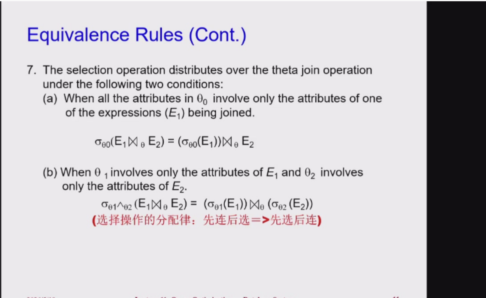
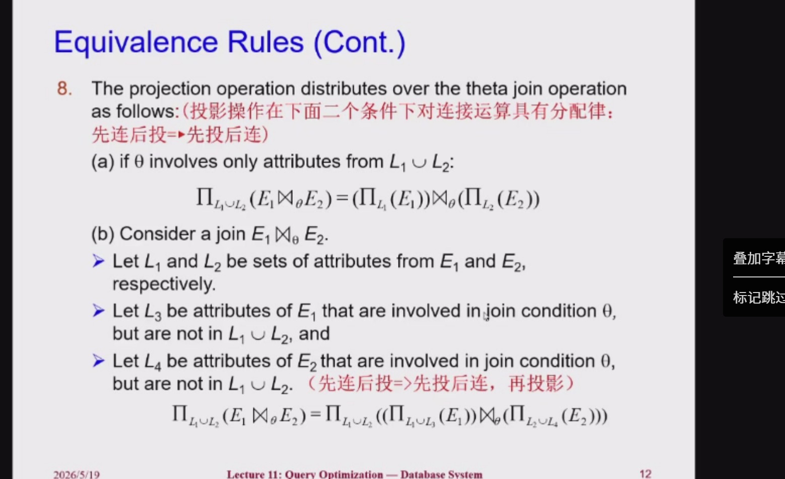

# 第十一章：查询优化 (Query Optimization)

这几页PPT是你数据库课程“查询优化”这一章的开篇介绍。如果说上一章“查询处理”教了数据库**“怎么执行某个具体操作”**（比如怎么做Join，怎么做Sort），那么这一章就是要解决**“如何从无数种可以得到正确结果的执行组合中，挑出速度最快、磁盘开销最小的那种方案”**。

这几页PPT的核心内容我帮你拆解为以下四大板块：

## 一、查询优化的本质与原因 (Introduction)
对于用户的同一个查询请求（比如一条特定SQL），数据库可以有截然不同的执行路线：
1. **不同的关系代数表达式（Equivalent expressions）**：比如同样是关联表+条件过滤，可以“先全部连接完再过滤”，更可以“先提前过滤掉不相关数据，再把变小的表拿去连接”（如第二页PPT里的两棵对比树，它们逻辑完全等价，但右边提前下推 `Select` 显然会快得多）。
2. **不同的物理操作算法（Different algorithms）**：哪怕长成同一棵关系代数树，每一个节点用什么算法也可以不同（比如 Join 可以选 Hash-Join 也可以选 Merge-Join）。

**为什么要费这么大劲优化？**：因为不同执行计划的成本差距可能是灾难性的——PPT上明确指出，有的差方案要跑**几天（days）**，而好方案只要**几秒（seconds）**！

## 二、什么是“执行计划”？(Evaluation Plan)
第三页PPT给出了一张经典的图。光有一棵关系逻辑树还不够，**执行计划（Evaluation Plan）**需要在这棵逻辑树上**“精准批注”出所有的物理执行细节和算子统筹方式**：
- 它会标注具体算法：比如左分支指定用索引1扫描 `(use index 1)`，右分支用线性全表扫描 `(use linear scan)`；上端的连接指定用归并连接 `(merge join)` 等。
- 它还会标注中间怎么协同：比如下层到中层是通过**流水线（pipeline）**传输数据，而不是写零时文件。
- *一句话：关系代数表达式 = 逻辑目标；执行计划 = 带了具体兵种和补给线说明的物理作战图。*

## 三、基于成本优化的 3 大核心步骤 (Cost-based Query Optimization)
数据库到底是怎么找出这条最快路线的？主要分为三步（第四页PPT的重点流程，也是本章的主线）：
1. **运用等价规则生成表达式（Generate equivalent expressions）**：利用数据库里的各种“公式定理”，把初始的代数树变换成各种长相不同但结果一致的等价代数树。
2. **对表达式进行算子批注得出备选计划（Annotate expressions）**：给这些树上的操作各个节点填上不同的物理执行算法（比如批注到底是选哈希还是走索引），生成海量的“备选执行计划”。
3. **根据预估成本挑选最廉价的计划（Choose the cheapest plan）**：数据库系统字典里会存有所有的**统计信息（Statistical information）**：如一张表有多少条数据、某个字段到底有几种不同的值。通过这些统计量和上章学过的各种算法的成本公式，估算出每条路线的花费（Cost），**直接无脑挑估算总成本最低的那一条去真正执行！**

## 四、关系表达式的转换与等价规则 (Transformation of Relational Expressions)
要实现优化第一步的“树形变身”，前提是必须保证变化绝对准确、不影响查询的真理。
- **等价的定义（Equivalent）**：在任何合法的数据库数据实例上，两个关系代数表达式只要能生成出**完全相同的一批元组集合**，那它们就是等价的（这批元组的输出顺序没关系）。
- **SQL的特殊考量（多重集 Multiset）**：传统的数学关系代数是集合（元素不重复）。但在真实的SQL世界里，一张表或输出的结果是**允许多个完全相同的重复行存在的（这就叫 Multiset 多重集）**。因此在SQL层面说它们俩等价，不仅内容要相同，**连同一个值的重复出现的次数也必须一模一样**。
- **等价规则（Equivalence rule）**：就像你们学过的数学乘法交换律、加法结合律一样。数据库拥有自己的一套等价规则（例如 `Join` 满足交换律），你可以安全地把表达式中适用规则的一部分扒下来，替换成另一种模样，以此发掘效率最高的那一种组合。

---

## 五、查询优化的核心武器：前6条等价规则详解 (Equivalence Rules)

这两页PPT列出了数据库内部最核心的**前6条关系代数等价规则**（就像数学里的公理），它们是查询优化器用来“变形”SQL语句的基础公式。

### 规则 1：选择条件的拆分（级联选择）
**公式**：$\sigma_{\theta_1 \land \theta_2}(E) = \sigma_{\theta_1}(\sigma_{\theta_2}(E))$
- **大白话**：如果有两个由 `AND`（合取）连起来的筛选条件，可以把它拆分成两个连续（先后执行）的独立筛选步骤。
- **优化意义**：拆分后，我们可以挪动其中某一个容易算/过滤性高的条件，让它提前执行。

### 规则 2：选择操作的交换律
**公式**：$\sigma_{\theta_1}(\sigma_{\theta_2}(E)) = \sigma_{\theta_2}(\sigma_{\theta_1}(E))$
- **大白话**：连续两层的筛选操作，先筛哪一个、后筛哪一个，最终结果完全一样。
- **优化意义**：优化器可以理直气壮地**把过滤数据量最多的条件放到最前面（最底层）执行**，这样送到下一层的数据就变少了。

### 规则 3：投影操作的幂等律（只留最后一步）
**公式**：$\Pi_{L_1}(\Pi_{L_2}(...(\Pi_{L_n}(E))...)) = \Pi_{L_1}(E)$
- **大白话**：如果有一连串的投影（取某些列）操作，那么只需要看最终（外面最后一层）想要什么列就行了，中间套的那些投影全都可以省略掉。
- **注意前提**：这要求每一层投影所要求的列都被包含在上一层输出的列中。
- **优化意义**：帮你把繁复冗余的“留字段”操作直接合并砍掉，减少 CPU 处理。

### 规则 4：选择与笛卡尔积/连接的结合（化积为连）
**公式 a**：$\sigma_{\theta}(E_1 \times E_2) = E_1 \bowtie_{\theta} E_2$
- **大白话**：先让两张表做无脑的“笛卡尔积”（所有行两两配对），再做一次条件筛选 $\theta$ —— 这其实就等价于直接让两张表拿着 $\theta$ 条件去做 **$\theta$-连接**。
- **优化意义**：这是最重要的优化法则之一！笛卡尔积开销是灾难级的（$N \times M$）。优化器看到笛卡尔积+筛选，必定会秒换成 Join。

**公式 b**：$\sigma_{\theta_1}(E_1 \bowtie_{\theta_2} E_2) = E_1 \bowtie_{\theta_1 \land \theta_2} E_2$
- **大白话**：如果你在已经连好的表（用了 $\theta_2$ 条件）外面再做一次筛选（用了 $\theta_1$），你可以直接把这个外面的条件合并到里面的 Join 条件里去。

### 规则 5：连接操作的交换律
**公式**：$E_1 \bowtie_{\theta} E_2 = E_2 \bowtie_{\theta} E_1$
*(注意：自然连接也满足该交换律)*
- **大白话**：A表去连B表，等价于B表去连A表。
- **优化意义**：这也是上节课说的核心结论——两表做 Join，优化器可以合法地换位子，**永远挑小表（行数少、块数少的表）当外表**（Outer loop），大幅降低 I/O 开销！

### 规则 6：连接操作的结合律（改变连表顺序）
**公式 a（自然连接）**：$(E_1 \bowtie E_2) \bowtie E_3 = E_1 \bowtie (E_2 \bowtie E_3)$
- **大白话**：三张表自然连接，先连 A 和 B，还是先连 B 和 C，结果一样。

**公式 b（$\theta$-连接）**：$(E_1 \bowtie_{\theta_1} E_2) \bowtie_{\theta_2 \land \theta_3} E_3 = E_1 \bowtie_{\theta_1 \land \theta_3} (E_2 \bowtie_{\theta_2} E_3)$
- **大白话**：复杂的带条件的连表，只要条件里的字段匹配对得上（PPT特别说明 $\theta_2$ 只能包含 $E_2$ 和 $E_3$ 的属性），一样是可以合法改换抱团先后的顺序的。
- **优化意义**：让优化器敢于大胆估算中间临时表的尺寸，并**挑选出一条中间结果图最瘦小的连表顺序**！

### 规则 9：集合运算（并集与交集）的交换律
**公式**：
- $E_1 \cup E_2 = E_2 \cup E_1$
- $E_1 \cap E_2 = E_2 \cap E_1$
*(注意：差集 Set difference ($-$) **不**满足交换律！$E_1 - E_2 \neq E_2 - E_1$)*

### 规则 10：集合运算（并集与交集）的结合律
**公式**：
- $(E_1 \cup E_2) \cup E_3 = E_1 \cup (E_2 \cup E_3)$
- $(E_1 \cap E_2) \cap E_3 = E_1 \cap (E_2 \cap E_3)$
- **大白话**：三个集合做求并或者求交的时候，先合并哪两个结果都一样。

### 规则 11：选择操作对集合运算的分配律
**公式 a（分配到两侧）**：
$\sigma_{\theta}(E_1 - E_2) = \sigma_{\theta}(E_1) - \sigma_{\theta}(E_2)$
*(对于 $\cup$ 和 $\cap$ 同样适用)*
- **大白话**：先做集合运算再统一过滤，等价于先在两个集合上分别独立过滤，然后再做集合运算。
- **优化意义**：这也是经典的“选择下推”思想。提前过滤掉两个子集里的无用数据，再去做昂贵的集合比对操作，能极大加快计算速度。

**公式 b（只分配到单边）**：
$\sigma_{\theta}(E_1 - E_2) = \sigma_{\theta}(E_1) - E_2$
*(对于 $\cap$ 同样适用，但对于 $\cup$ **不行！**)*
- **大白话**：做差集（或交集）的时候，如果你需要在事后应用某个筛选条件 $\theta$，你完全可以**只在这个条件能够生效的主体（$E_1$）上做提前筛选**，筛选完直接去扣除 $E_2$，结果完全一致！
- **看图理解（文氏图直观证明）**：最后一页PPT给出了非常清晰的图形证明。
  - 左图（对应等号左边）：两个圆 $E_1$ 和 $E_2$，先刨去 $E_2$（留下左侧粉色月牙），再横向取一条红色过滤拦腰截断（$\theta$ 条件）。最终结果是这条红线在月牙里留下的部分。
  - 右图（对应等号右边）：先不管 $E_2$，给完整的 $E_1$ 圆直接应用拦腰截断 $\sigma_{\theta}(E_1)$，然后再把这块红条条去和整个大 $E_2$ 绿圆做差（扣掉重合那部分的红绿面积）。
  - **结论**：两种方式留下来的都是左边突出来的那一截纯红大深色方块。证明完全等价！
- **优化意义**：极其精妙！它直接省去了要对 $E_2$ 执行过滤操作 $\sigma_{\theta}(E_2)$ 所带来的性能开销。




## 例子

这几页PPT，是用**具体的关系代数表达式**，演示查询优化中最核心的两种改写技术——**选择下推（Pushing Selections）**和**投影下推（Pushing Projections）**。它们都是基于等价规则改写表达式，目标只有一个：**提前过滤/裁剪数据，减少中间结果的大小，让后续连接操作更快。**

---

## 一、例子1：单个条件的「选择下推」（用规则7a）
### 原始问题与表达式
需求：找音乐系老师的名字，以及他们教过的课程名。
原始关系代数表达式（「先连后选」）：
$$\Pi_{\text{name, title}} \left( \sigma_{\text{dept\_name = "Music"}} \big( \text{instructor} \bowtie (\text{teaches} \bowtie \text{course}) \big) \right)$$
- 问题：先把三个表**全连接**，生成所有老师-课程的组合，再过滤音乐系的老师。中间结果元组数巨大，连接成本极高。

### 优化：选择下推（用规则7a）
规则7a的核心：如果选择条件只涉及单个表（这里`dept_name`只属于`instructor`表），可以把选择操作下推到该表上，变成「先选后连」：
$$\Pi_{\text{name, title}} \left( \big( \sigma_{\text{dept\_name = "Music"}} (\text{instructor}) \big) \bowtie (\text{teaches} \bowtie \text{course}) \right)$$

### 优化效果
- 先过滤出音乐系的老师，再和后面的表连接，连接时的元组数大幅减少。
- PPT里的这句话点破了本质：`Performing the selection as early as possible reduces the size of the relation to be joined.`（提前做选择，减少连接操作的元组数）。

---

## 二、例子2：多条件的「选择下推」（结合规则6a + 规则7b）
### 原始问题与表达式
需求：找2009年教过课的音乐系老师的名字，以及课程名。
原始表达式（「先连后选」）：
$$\Pi_{\text{name, title}} \left( \sigma_{\text{dept\_name = "Music"} \land \text{year} = 2009} \big( \text{instructor} \bowtie (\text{teaches} \bowtie \text{course}) \big) \right)$$
- 问题：合取条件里，`dept_name`属于`instructor`，`year`属于`teaches`，但原始表达式先连所有表，再过滤，中间结果元组数爆炸。

### 优化步骤1：调整连接顺序（用规则6a）
利用自然连接的结合律，把连接顺序调整为：
$$\Pi_{\text{name, title}} \left( \sigma_{\text{dept\_name = "Music"} \land \text{year} = 2009} \big( (\text{instructor} \bowtie \text{teaches}) \bowtie \text{course} \big) \right)$$
- 目的：让两个条件分别对应`instructor`和`teaches`，为后续下推做准备。

### 优化步骤2：双条件下推（用规则7b）
规则7b的核心：合取条件如果分别属于两个表，可以拆分成两个选择，分别下推到各自的表上：
$$\Pi_{\text{name, title}} \left( \big( \sigma_{\text{dept\_name = "Music"}} (\text{instructor}) \big) \bowtie \big( \sigma_{\text{year} = 2009} (\text{teaches}) \big) \bowtie \text{course} \right)$$

### 效果：从表达式树直观对比
- 左边（初始树）：先连所有表，再过滤 → 中间结果元组数多
- 右边（优化树）：先过滤两个表，再连接 → 中间结果元组数大幅减少

---

## 三、例子3：「投影下推」（用规则8a/8b）
### 原始问题
还是类似的查询：找音乐系老师的名字和课程名。
如果直接先连接，会保留所有列（比如`instructor`的`ID`、`salary`，`teaches`的`sec_id`、`semester`，`course`的所有列），再投影只保留`name`和`title`。
- 问题：中间结果列数太多，数据宽度大，I/O和缓存效率低。

### 优化：投影下推（用规则8a/8b）
把投影操作下推到连接之前，**只保留两类列**：
1.  最终结果需要的列（`name`、`title`）
2.  连接操作需要的列（比如`instructor`和`teaches`连接用的`ID`，`teaches`和`course`连接用的`course_id`）

优化后的表达式：
$$\Pi_{\text{name, title}} \left( \Pi_{\text{name, course\_id}} \big( \sigma_{\text{dept\_name = "Music"}} (\text{instructor}) \bowtie \text{teaches} \big) \bowtie \Pi_{\text{course\_id, title}} (\text{course}) \right)$$

### 优化效果
- 连接操作只处理“裁剪后”的窄表，数据更紧凑，I/O次数减少，缓存命中率更高。
- 和选择下推类似，投影下推的核心也是：`Performing the projection as early as possible reduces the size of the relation to be joined.`（提前做投影，减少连接操作的列数）。

---

## 核心总结：两种下推的区别与目标
| 技术 | 作用 | 优化目标 | 依赖的等价规则 |
| :--- | :--- | :--- | :--- |
| **选择下推** | 过滤掉不需要的**行**（元组） | 减少连接时的**行数**，降低元组比较成本 | 规则7（选择对连接的分配律） |
| **投影下推** | 裁剪掉不需要的**列**（属性） | 减少连接时的**数据宽度**，提升I/O和缓存效率 | 规则8（投影对连接的分配律） |

两者的前提都是：操作（选择/投影）只涉及单个表的属性，不能跨表，否则无法下推。

# 例子补充

这几页讲的是**多表连接的顺序优化（Join Ordering）**和**查询优化器的实现方法**，是前面“等价规则”的实战应用，我帮你按顺序拆解得明明白白：

---

## 一、Join Ordering Example：连接顺序为什么重要？
### 核心前提：连接的结合律
PPT开头给了公式：
$$(r_1 \bowtie r_2) \bowtie r_3 = r_1 \bowtie (r_2 \bowtie r_3)$$
自然连接满足结合律，所以**三个表的连接顺序可以调整，结果完全等价**。

### 关键结论：顺序决定性能
PPT里这句话点破了本质：
> The ordering of join is important for reducing the size of temporary results.

- 两种顺序结果一样，但中间临时结果的大小天差地别：
  - 先连 `r1 ⋈ r2`：如果结果很小，再连`r3`的成本就很低。
  - 先连 `r2 ⋈ r3`：如果结果很大，再连`r1`的成本会暴涨。

### 实战例子：音乐系老师的查询
还是你熟悉的那个查询：
$$\Pi_{\text{name, title}} \left( \sigma_{\text{dept\_name = "Music"}} (\text{instructor}) \bowtie \text{teaches} \bowtie \text{course} \right)$$
（这里我们考虑如何安排后面这三个主体的连接顺序）

- **方案 A（错误顺序）**：先去计算 `teaches ⋈ course`
  - 这会产生一个包含全校**所有开班授课记录的大表**的临时结果。
  - 然后再拿这个巨大无比的临时结果，去和刚刚那个只有寥寥几个“音乐系老师”的小表 $\sigma_{\text{dept\_name = "Music"}}(\text{instructor})$ 求连接。这样一来在第一步产生了海量的冗余临时数据。

- **方案 B（正确顺序）**：先去计算 $\sigma_{\text{dept\_name = "Music"}}(\text{instructor}) \bowtie \text{teaches}$
  - 因为 $\sigma_{\text{dept\_name = "Music"}}(\text{instructor})$ 这个过滤条件极其严苛，选出的音乐系老师是一个极小的集合（"a very small fraction of instructors"）。
  - 让这个极小的集合立刻先去和 `teaches` 发生 Join，那么发生碰撞匹配的结果集会变得**更小**。
  - 获取到这批只属于音乐系排课小表以后，再去跟庞大的 `course` 做表连接，这最后一步的开销自然也降到了极低。

**核心原则**：**顺序可以完全改变临时结果图块体积！**应当优先把过滤性极强、能把结果集疯狂裁切变小的两张表提前进行配对连接（比如先让“很小的一部分音乐指导老师”与记录表结合），来防止出现动辄几万条巨大临时中间表。

## 补充：选择执行计划（Choice of Evaluation Plans）

光生成代数表达式然后各自局部采用最好算法是不够的！最后这页PPT说明了查询优化器的最高眼界——**顾全大局（interaction of evaluation techniques）**。

### 1. 不能单纯地对每个独立操作“贪小便宜”
选择局部成本最低的算法（比如每个独立 JOIN 节点独立选最便宜的算法）**并不一定能组合出全局最快**的最佳方案。这很违背直觉，是因为操作和操作之间有**互相依赖和增益（interaction）**：
- **经典案例（提供自带排序结果的增益）**：假设你有一个 Join 操作，你计算出用 Hash-Join 的开销是 100，而用 Merge-Join 的开销是 120。
- 如果只看这里，肯定无脑选 Hash-Join。但是！**Merge-Join 最猛的特点是它的输出天然就是排好序的（Sorted output）**！
- 如果这个 Join 紧跟着的外层还要执行 `Merge-join`、或者是 `Group by` 聚合操作，这些后续操作非常需要一个有序输入。如果你在底下用了 Hash-Join，那么还要额外花 50 的代价把结果排序；而如果你局部用稍微贵点的 Merge-Join，上面的成本直接归 0。
- 全局考量：(Hash 100 + 排序 50 = 150) $ > $ (融合 120 + 排序 0 = 120)。
- 还有诸如**流水线（Pipelining）**机制，能做到两层算子同时在内存里穿透数据，所以优化需要总览全局。

### 2. 实际的查询优化引擎（Query Optimizers）都是怎么干活的？
它们通常结合以下两类核心手段（Approaches）：
1. **基于成本全面搜索（Cost-based）**：真的把所有可行的查询计划都遍历、或者通过动态规划算一遍全局造价，然后选最省钱的（常用于各种 Join 顺序和连表选择组合的大头）。
2. **使用启发式准则（Heuristics）**：依靠老手经验（例如：“只要见到选择操作，无脑先把它往下推准没错！”），它不在乎算不算成本直接上手就按准则干，从而帮优化引擎剪去绝大部分一看就拉垮的搜索分支，节省优化引擎思考的时间。
---

## 二、Enumeration of Equivalent Expressions：怎么生成所有等价表达式？
这一页讲的是优化器生成备选计划的底层逻辑，也是查询优化的基础步骤。

### 1. 生成等价表达式的通用方法
优化器用等价规则，系统地生成所有和原表达式等价的形式：
1.  重复以下步骤：
    - 对当前所有等价表达式的每个子表达式，应用所有适用的等价规则（比如选择下推、投影下推、连接交换/结合律）。
    - 把新生成的表达式加入等价集合。
2.  直到没有新的表达式生成为止。

### 2. 这个方法的致命问题：时间和空间爆炸
- 多表连接时，可能的等价表达式数量是**指数级增长**的（比如`n`个表的连接顺序有`(n-1)!`种）。
- 遍历所有表达式，成本极高，无法直接使用。

### 3. 两种优化方案
为了解决爆炸问题，PPT提到了两种思路：
- 启发式规则（Heuristics）：前面提到过，用硬性规则（如选择下推的早做早好）砍掉不可能赢的劣质分支。
- 估计与统计信息（Statistical Estimation）：不去穷举全部路线，而是通过各种统计公式去“预估”每个中间阶段带来的表尺寸。这也就是下面将要深度介绍的内容。

---

# 六、统计信息与结果大小估算 (Size Estimation)

前面我们一直提到：优化器挑出最“省钱”的执行计划，核心依据是**预估该节点的执行代价**。
而评估代价最直观的方式，就是预估**“这个操作会吐出多少条元组（记录尺寸）”**。吐出的数据越少，代价通常就越小。

数据库统会在数据字典里维护两项关键的基础属性：
- $n_r$：关系表 $r$ 中的总元组数（总数据行数）。
- $V(A, r)$：属性 $A$ 在关系 $r$ 中，**不重复的不同取值（Distinct values）的个数**。（比如：性别一般只有2个取值，身份证号则是每条都不同）。

这四页PPT主要教授了如何针对“**单独的选择操作**”、“**复杂的逻辑选择操作**”、以及“**多表连接（Join）操作**”用公式预估它们产出的结果条数！

## 1. 单表选择操作的大小估算 (Selection Size Estimation)

### 场景 A：等值查询（Equality condition: $\sigma_{A=v}(r)$）
我们需要预估在表 $r$ 中，找出所有 $A=v$ 的记录会有多少条？
- **如果 $A$ 不是主键**：意味着 $A$ 取同一个值会有很多条记录。假设数据在各个取值上是均匀分布的（Uniform distribution），那么其估算结果大小为：
  $$ \text{Size} = \frac{n_r}{V(A, r)} $$
  *（大白话：把一共有 $n_r$ 条数据，平分给属性 $A$ 的 $V$ 种不同取值。那每一个取值摊到的记录数就是平均结果。）*
- **如果 $A$ 是主键（Key/Unique）**：因为每个主键都是独一无二的，所以只要去查 `主键=v`，如果存在，最多只能是 1 条。
  - **Size Estimate = 1**。

### 场景 B：范围/不等式查询（Inequality condition: $\sigma_{A \le v}(r)$ 或 $A \ge v$）
这时候我们要找小于（或大于）某个阈值的所有记录。假设我们将符合条件的结果数量记为 $c$。
- 如果系统目录下能够获取这列数据的**最小值 $\min(A,r)$** 和 **最大值 $\max(A,r)$**，则可以利用“所占区间长度与整体跨度的比例”来预先测算：
  - 如果 $v < \min(A, r)$，代表没可能找到，估算数量为 $0$。
  - 正常区间内，估算符合的行数为：
    $$ c = n_r \cdot \frac{v - \min(A,r)}{\max(A,r) - \min(A,r)} $$
    *（大白话：把这个差值长度除以总跨度得到一个百分比，用总行数乘以这个百分比。）*
- **进阶与退化情况**：
  - 如果有**直方图 (Histograms)**，这种精细化记录的工具能把上面的估算准度极大地提升。
  - 如果数据库很穷，**彻底缺少这种统计信息**，它就只能摆烂盲懵，武断地假设结果占了一半：**$c = n_r / 2$**。

---

## 2. 复杂选择操作的大小估算 (Size Estimation of Complex Selections)

如果一条 WHERE 里面带有很长很麻烦的 `AND`, `OR`, `NOT`，我们定义一个基础概念叫做**选择率（Selectivity）**：
- 查询条件 $\theta_i$ 的选择率 = **满足该条件的概率** = $s_i / n_r$ （其中 $s_i$ 是满足这一个单条件的记录估算数量）。

现在通过不同的逻辑操作，结合概率论独立事件的思想来推导复杂条件的最终产出数量：

### 逻辑一：合取（AND / Conjunction）运算
$\sigma_{\theta_1 \land \theta_2 \dots \land \theta_n}(r)$
- 假设各个过滤条件之间是**完全相互独立**的（Independence）。那么同时满足所有条件的概率，就是各自单项概率的**乘积**。
- **最终出来的元组估算量**：
  $$ n_r \cdot \frac{s_1 \cdot s_2 \dots s_n}{(n_r)^n} $$
  *(将每个单带项的选择率相乘，最后乘以总数据条数 $n_r$)*

### 逻辑二：析取（OR / Disjunction）运算
$\sigma_{\theta_1 \lor \theta_2 \dots \lor \theta_n}(r)$
- 在概率计算中，“满足A或者满足B”很难算，但是它的反面**“全都不满足”**非常好算。
- 我们只需要拿 1 减去“每一个条件都被不满足（即 $1 - \frac{s_i}{n_r}$）的连乘概率”，就能得到至少满足一个的概率。
- **最终出来的元组估算量**：
  $$ n_r \cdot \left[1 - \left(1 - \frac{s_1}{n_r}\right) \cdot \left(1 - \frac{s_2}{n_r}\right) \dots \left(1 - \frac{s_n}{n_r}\right)\right] $$

### 逻辑三：非（NOT / Negation）运算
$\sigma_{\neg \theta}(r)$
- 这个最简单。
- **最终出来的元组估算量**等于“总行数”减去“满满足没被取反条件的记录数”：
  $$ n_r - \text{size}(\sigma_\theta(r)) $$

---

## 3. 多表连接操作的大小估算 (Estimation of the Size of Joins)

重点来了！对于两张表 $R$ 和 $S$ 的关系连接运算，它到底能吐出多少条中间结果？这要分多种情况讨论（基于公共属性集合 $R \cap S$ 的性质）。

*(已知笛卡尔积 $r \times s$ 会制造绝对灾难级的结果，数量恒定为 $n_r \cdot n_s$ 条。)*

### 场景 A：二者没有公共属性（$R \cap S = \emptyset$）
如果毫无关联字段去硬做连接：
- $r \bowtie s$ 完全等同于 $r \times s$ 笛卡尔积。
- **结果元组估算量 = $n_r \cdot n_s$。**

### 场景 B：公共属性在表 $R$ 中是主键（Key for R）
- 既然公共属性是 $R$ 的主表特有字段也就是主键，那么对于另一张表 $S$ 里的每一条记录来说，它顺着这根线去 $R$ 里找结合对象，**最多只能找到 1 条对应数据**。
- **结果元组估算量 $\le n_s$**（不会超过在 $S$ 里的原本条数）。

### 场景 C：公共属性在表 $S$ 内是对表 $R$ 建立的外键（Foreign key）
不仅满足场景B的单个上限条件，由于有外键完整性约束的存在，意味着 $S$ 表里发出的每一次引线，$R$ 表里都**绝对实打实存在有对应的那行**！
- 所以 $S$ 中所有的记录都会 100% 精准配对 1 条数据。
- **结果元组估算量 $\equiv n_s$（永远精准等于关联方表 $S$ 的条数）**。
- （举例：PPT中的 `student` $\bowtie$ `takes`。`takes`表在字段`ID`上有个指向针对`student`表的外键，所以Join结束结果肯定是精精确确的 $n_{takes}$ 行，共10000条。）

### 场景 D：公共属性既不是R的主键，也不是S的主键（最麻烦的一般情况）
两张表针对这个属性各含有不知多少量的重复值，此时是最常见的。
优化器给出了两个方向相反的视角来预测：
1. **假设表 $R$ 中的每条数据都能在 $S$ 里产生匹配**：那每一条 $R$ 数据会在 $S$ 中找着多少“伴侣”呢？就是通过**单表取平均数公式**——也就是 $n_s / V(A, s)$ 个伴侣。由于一共有 $n_r$ 条 $R$ 这边出去挑，总估价为：
   $$ \frac{n_r \cdot n_s}{V(A,s)} $$
2. **反弹琵琶：假设表 $S$ 中的每条数据都能在 $R$ 里产生匹配**，算出来就是：
   $$ \frac{n_r \cdot n_s}{V(A,r)} $$

**终局抉择：**
究竟听左边还是右边？PPT 给了一个最保险经验法则规则（Rule of Thumb）：**这两个算出来的结果，谁更低，就很可能谁会更加精准！** （通常是因为有大量某一张表的特殊取值另一张表压根没有而不参与连乘。）

如果想比这种粗糙公式更进一步提高精准度，最有效的优化杀器依然是——**数据库引入建立直方图（histograms）统计机制**！将这些算式切分到每一个精细的“区间槽 cell”中分别算。
1.  **基于变换规则的优化计划生成**：不遍历所有表达式，而是只应用“有用的”规则（比如优先下推选择/投影），避免无意义的变换。
2.  **特殊场景处理**：针对只有选择、投影、连接的查询，用专门的优化算法（比如动态规划）。

---

## 三、Implementing Transformation Based Optimization：优化器怎么实现？
这一页讲的是优化器的具体实现技巧，解决“生成等价表达式时的空间和时间问题”。

### 1. 空间优化：共享公共子表达式
- 应用等价规则时，新生成的表达式通常只有顶层节点不同，下面的子树完全相同（比如连接交换律，只交换两个表的顺序，下面的子树不变）。
- 优化器用**指针共享**这些相同的子树，不用重复存储，大幅减少内存占用。
- 同时会检测重复的子表达式，只存一份副本。

### 2. 时间优化：动态规划（Dynamic Programming）
- 核心思想：不生成所有表达式，而是用动态规划只计算“最优解”。
- 对连接顺序优化来说，就是经典的“多表连接顺序动态规划”：
  1.  先算两个表的所有连接成本，存起来。
  2.  再算三个表的连接成本，用之前算好的两个表的结果。
  3.  直到算完所有表的连接，直接得到最优顺序。
- PPT里明确说了：`We will study only the special case of dynamic programming for join order optimization`，即下面要详细分析的连接树 DP 算法与复杂度。

---

## 四、核心延伸：多表连接的动态规划与时间复杂度分析

在多表连接（$n$ 个表：$R_1 \bowtie R_2 \bowtie \dots \bowtie R_n$）的查询优化中，连接的树形结构有着重大影响。主流结构分为**左深树（Left-Deep Tree）**和**丰满树（Bushy Tree，也译作浓密树/矮胖树）**，对它们的 DP 分析是数据库优化的重中之重。

### 1. 动态规划的通用状态定义
- **状态表达：** 设 $S$ 是需要进行连接的表的集合（$S \subseteq \{R_1, R_2, \dots, R_n\}$）。
- **DP 数组：** 定义 $opt\_cost(S)$ 代表**将集合 $S$ 中所有的表连接起来所需的最小成本**。
- **目标：** 求出 $opt\_cost(\{R_1, R_2, \dots, R_n\})$。

### 2. 左深树（Left-Deep Tree）的 DP 分析
**特点：** 树的每一个右子节点都必须是一个**单表（Base relation）**，不能是中间结果。也就是说，每一次都是拿一个“之前连接好的临时表”去和一个“新的原始表”做连接。
- **状态转移方程：** 
  为了算出 $S$ 集合的最小连接成本，我们遍历它里面的每一个单表 $R_i \in S$ 作为最右侧的叶子，其余的表 $S-\{R_i\}$ 作为左子树：
  $$opt\_cost(S) = \min_{R_i \in S} \Big( opt\_cost(S - \{R_i\}) + \text{cost}((S - \{R_i\}) \bowtie R_i) \Big)$$
- **时间复杂度分析：**
  - 我们需要对每个大小为 $k$ 的子集 $S$ 进行计算，总共有 $\binom{n}{k}$ 个这样的子集。
  - 对于特定子集 $S$，我们需要挑出其中 1 个单表 $R_i$，一共有 $k$ 种挑法。
  - 总计算次数 = $\sum_{k=1}^{n} \binom{n}{k} \cdot k = n \cdot 2^{n-1}$。
  - **总时间复杂度：$O(n 2^n)$**。计算非常快，是大部分主流数据库（如老版本 PostgreSQL/MySQL等）的默认搜索空间。
- **空间复杂度：$O(2^n)$**（共有 $2^n$ 个非空子集需要记录结果）。

### 3. 丰满树（Bushy Tree）的 DP 分析
**特点：** 连接结构没有任何限制！左右子树都可以是经过初步连接的“中间结果”。它能够探索所有的结合律与交换律组合，是最彻底的全空间搜索结构。
- **状态转移方程：**
  为了算出 $S$ 集合的最小连接成本，我们将 $S$ 分割成**任意两个非空的、互不相交的子集 $S_1$ 和 $S_2$**（即 $S_1 \cup S_2 = S, S_1 \cap S_2 = \emptyset$），让它们分别作为左右子树：
  $$opt\_cost(S) = \min_{S_1 \subset S, S_1 \neq \emptyset} \Big( opt\_cost(S_1) + opt\_cost(S - S_1) + \text{cost}(S_1 \bowtie (S - S_1)) \Big)$$
- **时间复杂度分析（重点）：**
  - 要计算所有的子集 $S$，对于任意大小为 $k$ 的子集，在集合 $S$ 中挑选非空且真子集 $S_1$，一共有 $2^k$ 种拆分方式。
  - 所以全过程需要计算的所有情况数量为：
    $$ \sum_{k=1}^{n} \left( \text{大小为 }k\text{ 的子集个数} \right) \cdot \left( \text{其拆分方式总数} \right) $$
    $$ \sum_{k=1}^{n} \binom{n}{k} 2^k $$
  - 根据经典的**二项式定理** $(1 + x)^n = \sum_{k=0}^{n} \binom{n}{k} x^k$，把 $x=2$ 代入（并忽略空集扣除带来的常数影响）：
    $$ \sum_{k=0}^{n} \binom{n}{k} 2^k = (1 + 2)^n = 3^n $$
  - **总时间复杂度：$O(3^n)$**。虽然 $3^n$ 比单纯的暴搜 $n!$ 阶乘要好得多，但是在表特别多（比如 > 15张大表）时依然会产生性能灾难（这叫“优化器超时”，此时数据库会回退到启发式规则、遗传算法，或者强制降级为只搜左深树）。
- **空间复杂度：依旧是 $O(2^n)$**（存储所有子集的最优值）。

---

## 五、一句话总结
这几页的核心是：
1.  连接顺序可以调整，但会直接影响中间结果大小和性能，要优先选能生成小中间表的顺序。
2.  生成所有等价表达式成本太高，优化器用“共享子树+动态规划”的方式，高效找到最优执行计划。

---

## 七、成本估算的统计信息补充 (Statistical Information for Cost Estimation)

除了前面提到的基础行数外，数据库还需要这几类关键统计量，它们是用来衡量表数据分布及数据块存储密度的：
- $n_r$: 关系 $r$ 中的元组（记录）数量。
- $b_r$: 包含关系 $r$ 元组的磁盘块（Block）总数。
- $l_r$: 关系 $r$ 中每个元组的字节大小。
- $f_r$: 关系 $r$ 的阻塞因子（blocking factor）——即一个数据块能装下多少个 $r$ 的条目。
- 如果 $r$ 的元组在文件中是物理上簇集（聚簇）存储在一起的，那么它们占据的数据块估算为：
  $$ b_r = \left\lceil \frac{n_r}{f_r} \right\rceil $$
- $V(A, r)$: 属性 $A$ 在关系 $r$ 中出现的**不同值的个数（Distinct values）**；这与 $\Pi_A(r)$ 的最终大小完全一致。
- $SC(A, r)$: 关系 $r$ 中属性 $A$ 的选择基数（selection cardinality）；即满足指定 $A$ 上等值过滤条件的平均记录数量。

---

## 八、不同值个数的预估推算 (Estimation of Number of Distinct Values)

在进行各种关系操作后，我们如何继续推算“这一步产出的结果中，某属性还剩下多少种不同的取值 $V$”？PPT 给出了一套实用的估算方法。

### 1. 选择操作 (Selections: $\sigma_\theta(r)$)
对于通过条件 $\theta$ 过滤过后的结果集：
- 如果 $\theta$ 是一把**死锁单值的锁**（例如 $A = 3$）：
  显然，此时的 $A$ 只能是 3，所以 $V(A, \sigma_\theta(r)) = 1$。
- 如果 $\theta$ 是**允许选定特定集合**的锁（例如 $A = 1 \lor A = 3 \lor A = 4$）：
  那么 $A$ 只能在这几个有限指定值中挑，所以 $V(A, \sigma_\theta(r)) =$ 设定集合的数量。
- 如果选择条件 $\theta$ 的形式是常规的判断（例如 $A > 10$之类）：
  可以使用估算公式：$V(A, \sigma_\theta(r)) = V(A, r) \times s$（这里的 $s$ 就是该条件的“选择率”）。
- **如果是其他的所有情况（默认兜底）**：
  直接使用近似的边界值估算法——因为剩下的不同值个数，理论上**既不可能超过本来包含的不同类目总数，也不可能超过过滤后幸存的总行数**，所以取二者的最小值：
  $$ V(A, \sigma_\theta(r)) = \min(V(A, r), n_{\sigma_{\theta}(r)}) $$
  > *PPT附注：当然可以通过精密的概率论算得更加细致，但平时在数据库系统里用这个公式“凑合一下”其实也足够适用了（works fine generally）。*

### 2. 连接操作 (Joins: $r \bowtie s$)
当 $r$ 和 $s$ 连接以后：
- **如果考察的合并属性组 $A$ 的所有列，全部都仅仅只来自于 $r$ 一边**：
  同上的近似思想，取原来 $r$ 表中本有的离散数量，和 Join 后形成的新表总行数里的极小者：
  $$ V(A, r \bowtie s) = \min(V(A, r), n_{r \bowtie s}) $$
- **如果考察的属性组 $A$ 里既混了 $r$ 里的列 $A1$，又混了 $s$ 的列 $A2$** ：
  那么预估结果是以下 **三个假想值** 的最小值（取严苛的下界）：
  $$ V(A, r \bowtie s) = \min \big( V(A1, r) \times V(A2 - A1, s), \ V(A1 - A2, r) \times V(A2, s), \ n_{r \bowtie s} \big) $$
  - **第一项的底层逻辑：** 假设 $r$ 里每个 $A1$ 都能和 $s$ 里的各种剩余部分发生完美积木拼插（过度乐观）。
  - **第二项的底层逻辑：** 和第一条互补，以 $s$ 内含有的 $A2$ 向 $r$ 剩余特征倒推插接（同样通常偏大）。
  - **第三项的底层逻辑：** 连接后的总行数是以上数学组合数的绝对上界。

### 3. 投影与聚集操作 (Projections & Aggregations)
这两种操作相对直观：
- **进行投影时（Projections）：** 投影属性的不同值直接等同于它在原表中的情况（与 $\Pi_A(r)$ 的定义一致）。
- **对于 SQL 分组聚合的“分组维度属性（Grouping attributes）”：** 同样和它在原表中的取值种类数一致。
- **对于算出来的“聚合结果值”本身估值（Aggregated values）：**
  - 如果是极值聚合（$\max(A), \min(A)$）：估算结果取 $\min(V(A, r), V(G, r))$ （即：产生的新种类既不会超越原来数据池本有的深度差异，也绝不跨越分组数量 $G$ 的硬性天花板）。
  - 如果是其他数学杂揉运算（如 `sum`, `count`, `avg`）：假设每个组得出的数据都是参差不同的孤品直接拉满，此时 $V$ 估值直接等于分组的数量也就是 $V(G, r)$。

# 执行计划

这几页讲的是数据库**查询优化中，如何选择执行计划（Evaluation Plan）**，我帮你按页拆解得明明白白👇

---

## 第1页：一个完整的查询执行计划例子
这张图是一个**树状的执行计划（Query Evaluation Plan）**，对应一个典型SQL查询，我们从下往上拆解：

### 1. 底层：两个选择操作（Selection）
- 左边：`σ_branch_city = Brooklyn (branch)`
  - 对 `branch` 表筛选，条件是 `branch_city='Brooklyn'`
  - 执行方式：`use index 1`，用索引扫描，并且结果可以直接进入**流水线（pipeline）**，不用落地
- 右边：`σ_balance < 1000 (account)`
  - 对 `account` 表筛选，条件是 `balance < 1000`
  - 执行方式：`use linear scan`，全表扫描，结果也进入流水线

### 2. 中层：两次连接操作（Join）
- 第一次：`merge join`
  - 把上面两个筛选后的结果，用**归并连接**（merge join）合并
  - 两个输入都是流水线，数据一边产生一边连接，不用等全部结果落地
- 第二次：`hash join`
  - 把第一次连接的结果，和 `depositor` 表用**哈希连接**（hash join）合并

### 3. 顶层：投影去重（Projection + Deduplication）
- `Π_customer_name (sort to remove duplicates)`
  - 对最终结果做投影，只保留 `customer_name`
  - 为了去重，用了排序的方式（sort-based deduplication）

这个计划的核心是：**流水线（pipeline）+ 不同连接算法的组合**，根据后续操作的需求选择合适的算法，而不是只看单次操作的成本。

---

## 第2页：选择执行计划的核心原则
这页讲了查询优化的一个关键误区，和两种主流优化思路：

### 1. 误区：不能只优化单个操作，要考虑整体
> Choosing the cheapest algorithm for each operation independently may not yield best overall algorithm

举了两个例子：
- **归并连接（merge join）**：单次连接的成本可能比哈希连接高，但它会输出有序结果。如果后续操作（比如聚合、排序）需要有序数据，这个有序输出能大幅降低后续成本，整体反而更划算。
- **嵌套循环连接（nested-loop join）**：单次成本不一定最低，但它天生支持流水线（一边读一边连接），能减少中间结果落地的开销，提升整体性能。

### 2. 实际优化器的两种主流思路
1.  **基于代价的优化（Cost-Based）**：
    穷举/搜索所有可能的执行计划，估算每个计划的代价，选代价最低的那个。
2.  **基于启发式的优化（Heuristic）**：
    用经验规则（比如“先筛选后连接”“先做投影减少数据量”）直接裁剪计划，不做全量搜索，速度快但不一定是最优解。

实际数据库的优化器，基本都是这两种思路的结合体。

---

## 第3页：基于代价的优化：连接顺序的复杂度与解决方法
这页专门讲**多表连接的顺序优化**，是基于代价优化的核心难点：

### 1. 问题：多表连接的顺序组合爆炸
- 对 `r1 ⨯ r2 ⨯ ... ⨯ rn` 这样的 `n` 表连接，不同的连接顺序数量是：
  $$\frac{(2(n-1))!}{(n-1)!}$$
- 举例：
  - `n=7` 时，有 665,280 种不同的连接顺序
  - `n=10` 时，超过 1760 亿种！
  直接穷举所有顺序，计算成本完全不可接受。

### 2. 解决方法：动态规划（Dynamic Programming）
不用穷举所有顺序，而是用动态规划来剪枝：
- 对任意 `{r1, r2, ..., rn}` 的子集，只计算一次它的最低成本连接顺序，存起来复用。
- 比如先算两表连接的最优顺序，再用这些结果算三表连接的最优顺序，以此类推，大幅减少计算量。

这也是现在主流数据库（PostgreSQL、MySQL 等）优化多表连接的核心算法。

---

### 一句话总结
这几页讲的是**查询优化的核心：如何从无数种可能的执行计划里，选出整体代价最低的那一个**。
它的关键是：
- 不能只看单次操作的成本，要考虑算法之间的配合（比如归并连接的有序输出对后续的帮助）；
- 多表连接的顺序会严重影响性能，用动态规划来解决组合爆炸问题；
- 实际优化器会结合“基于代价”和“基于启发式”两种思路。

---

# 多表链接

这三页是数据库**查询优化中「多表连接顺序优化」的核心：用动态规划（Dynamic Programming, DP）解决“找最优连接顺序”的问题**，我帮你按页拆解得明明白白👇

---

## 第1页：动态规划优化的核心思想
这页讲了DP用来找n个关系的**最优连接树（best join tree）**的基本思路，解决的是“多表连接顺序太多，暴力枚举完全不可行”的痛点。

### 核心逻辑：分而治之 + 结果复用
1.  **问题分解**：把要优化的关系集合 `S`，拆成两个非空子集 `S₁` 和 `S - S₁`，连接顺序按 `S₁ ⨯ (S - S₁)` 来考虑。
2.  **递归计算子问题**：先递归算出 `S₁` 和 `S - S₁` 各自的最优连接计划和成本，再计算两者连接的总成本。
3.  **记忆化存储（DP的关键）**：每个子集的最优计划和成本，只计算一次，存起来复用，避免重复计算。
4.  **基例（Base Case）**：单个关系的访问计划，比如对单表做筛选、选最优索引扫描方式，算出它的基础成本。

> 举个例子：优化 `r1⨯r2⨯r3` 时，先算 `r1⨯r2` 的最优成本，存起来；后面再用到 `{r1,r2}` 这个子集时，直接拿结果，不用再重新算一遍。

---

## 第2页：动态规划的伪代码实现
这页是DP算法的可执行逻辑，对应上一页的思想，我们逐行拆解：

```
procedure findbestplan(S)
    if (bestplan[S].cost ≠ ∞)
        return bestplan[S]  // 记忆化：子集S的最优计划已经算过，直接返回

    // 基例：集合S只有1个关系，直接算单表的最优访问计划
    if (S contains only 1 relation)
        set bestplan[S].plan and bestplan[S].cost based on the best way
        of accessing S  // 比如用索引、全表扫描，选成本最低的方式

    // 递归部分：遍历S的所有非空真子集S₁，找最优拆分方式
    else for each non-empty subset S₁ of S such that S₁ ≠ S
        P1 = findbestplan(S₁)          // 递归算S₁的最优计划
        P2 = findbestplan(S - S₁)      // 递归算S-S₁的最优计划
        A = best algorithm for joining results of P1 and P2  // 选连接算法（merge/hash等）
        cost = P1.cost + P2.cost + cost of A  // 计算总成本
        if cost < bestplan[S].cost:    // 找到更优的计划，更新
            bestplan[S].cost = cost
            bestplan[S].plan = "execute P1.plan; execute P2.plan; join results of P1 and P2 using A"

    return bestplan[S]
```

这个伪代码的核心就是：
- 用`bestplan[S]`数组存所有子集的最优计划，避免重复计算；
- 每次把集合拆成两部分，算两边的最优成本，再合并，最终得到全集的最优计划。

---

## 第3页：优化算法的复杂度 & 连接树类型
这页讲了DP优化的时间/空间复杂度，以及两种常见的连接树结构（丰满树 vs 左深树）的差异。

### 1. 丰满树（Bushy Tree）的复杂度
- 定义：连接树的两个孩子都可以是非叶子节点，比如 `(r1⨯r2)⨯(r3⨯r4)`，结构更灵活，支持并行连接。
- 时间复杂度：`O(3ⁿ)`
  - 比如`n=10`（10表连接）时，复杂度是59000，对比暴力枚举的1760亿，直接降低了好几个数量级！
- 空间复杂度：`O(2ⁿ)`，因为要存所有`2ⁿ`个子集的最优计划和成本。

### 2. 左深树（Left-Deep Join Tree）的优化
- 定义：连接树的**所有右孩子都是单个表**，比如 `((r1⨯r2)⨯r3)⨯r4`，结构是线性的，天生适合流水线（pipelining）。
- 简化DP转移：
  原来的`for each non-empty subset S₁`，改成`for each relation r in S，let S₁ = S - r`，也就是每次只把一个关系拿出来当右孩子，不用遍历所有子集。
- 时间复杂度：`O(n·2ⁿ)`，比丰满树的`O(3ⁿ)`更低，`n=10`时仅需约1万次计算。
- 空间复杂度：仍为`O(2ⁿ)`。

### 3. 实际应用意义
基于代价的优化虽然有复杂度，但绝大多数业务查询的连接表数`n<10`，这个开销完全可接受；而且找到最优连接顺序带来的性能收益，远大于优化本身的开销。

---

### 一句话总结
这三页讲的是：**数据库用动态规划解决多表连接顺序的组合爆炸问题，通过“分而治之+记忆化复用”，把暴力枚举的天文数字级复杂度，降到了可接受的范围，同时支持丰满树/左深树两种连接结构的优化**。

---

#  查询优化器

这几页是数据库**查询优化器的核心内容**，刚好是你之前学的「动态规划连接顺序优化」的延伸和落地。我帮你按页拆解，把脉络串起来👇

---

## 一、先整体说清楚这几页的主题
这几页讲的是：**查询优化的两种主流思路（基于代价的优化、基于启发式的优化），以及它们在实际数据库里的结合方式和实现细节**，解决的核心问题是：「如何在“优化成本”和“执行计划质量”之间做平衡」。

---

## 第1页：Interesting Sort Orders（有趣的排序顺序）
这页是对你之前学的「动态规划连接顺序优化」的关键扩展：
### 核心问题
你之前学的动态规划，只存了每个表子集的“最优连接计划”，但这里发现：**中间结果的「排序顺序」，会直接影响后续操作的成本**，所以必须把“排序顺序”也纳入考虑。

### 举个例子
考虑查询 `(r1 ⨯ r2) ⨯ r3`，公共连接属性是 `A`：
- 如果 `r1` 和 `r2` 用 **merge join** 连接：
  - 虽然merge join本身比hash join贵，但它的结果会按 `A` 有序；
  - 后续和 `r3` 做merge join时，就不用再排序了，整体成本反而更低。

### 什么是「Interesting Sort Order」？
就是中间结果的某种排序方式，**对后续操作（下一个连接、`ORDER BY`、`GROUP BY`）有用**的排序顺序。

### 结论
动态规划不能只存每个子集的“最优计划”，还要存每个子集在不同「有趣排序顺序」下的最优计划。不过通常有趣的排序顺序数量很少，不会大幅增加复杂度。

---

## 第2页：Cost Based Optimization with Equivalence Rules（基于等价规则的基于代价优化）
这页讲的是**Volcano/Cascades模型**——SQL Server等数据库优化器的核心框架，把基于代价的优化落地实现的方法：
1.  **物理等价规则**：把逻辑查询计划（比如“连接两个表”）转换成不同的物理计划（比如用hash join、merge join、嵌套循环连接），这些物理计划是“等价”的，但成本不同。
2.  **高效实现的关键**：
    - 用紧凑的方式表示查询表达式，避免重复复制子表达式（节省内存）；
    - 检测重复推导，避免重复计算同一个子表达式的计划；
    - 基于记忆化的动态规划：存子表达式的最优计划，和你之前学的DP逻辑完全一致；
    - 基于代价的剪枝：提前砍掉明显更贵的计划分支，不用生成所有可能的计划。

---

## 第3页：Heuristic Optimization（启发式优化）
这页讲的是为了降低优化开销，引入的「经验规则式优化」：
### 背景
基于代价的优化（哪怕用动态规划）还是有开销，比如10表连接时复杂度是`O(3¹⁰)=59049`次操作，对小查询来说，**优化本身的成本比执行查询还高**，所以需要更高效的方式。

### 什么是启发式优化？
用**数据库领域的经验规则**来转换查询树，通常能提升性能，不用穷举所有可能的计划。常见规则：
- 尽早做选择（filter）：减少元组数，后面的连接成本会大幅降低；
- 尽早做投影：减少属性数，让数据量更小；
- 先做限制最强的选择/连接：先把结果压到最小，再做其他操作。

### 实际应用
有些数据库（比如早期MySQL）只用启发式优化，有些数据库（比如PostgreSQL）会把启发式和基于代价的优化结合起来。

---

## 第4页：Structure of Query Optimizers（优化器的结构）
这页讲的是实际数据库优化器为了平衡“复杂度”和“计划质量”，做的妥协和设计：
1.  **优先考虑左深树连接顺序**：
    - 你之前学过，左深树的复杂度是`O(n·2ⁿ)`，比丰满树的`O(3ⁿ)`低很多；
    - 而且左深树天生支持流水线执行，能进一步降低成本；
    - 再配合启发式规则把选择、投影下推，就能在复杂度和性能之间找到平衡。
2.  **启发式连接顺序选择**：
    - 比如Oracle的一些版本，会反复选“能让结果最小的表”作为下一个连接对象，从每个表作为起点，选n个里最好的那个，不用穷举所有顺序。
3.  **SQL的复杂性**：嵌套子查询、复杂聚合等，会让优化变得更复杂，需要额外处理。

---

## 第5页：Steps in Typical Heuristic Optimization（典型启发式优化的步骤）
这页是启发式优化的“标准流程”，对应数据库里的等价规则：
1.  **拆分合取选择**：把`σ(A=1 AND B=2)`拆成`σ(A=1)`再`σ(B=2)`，方便下推；
2.  **下推选择**：把filter尽量放到查询树的叶子节点（直接在表上过滤），尽早减少数据量；
3.  **优先执行“最小化”操作**：先做会产生最小结果的选择和连接，避免中间结果太大；
4.  **笛卡尔积转连接**：把`r×s`后面跟`σ(A=B)`的，直接转换成`r⨯s`，减少不必要的笛卡尔积；
5.  **下推投影**：把投影尽量放到叶子节点，只保留需要的属性，减少数据量；
6.  **流水线执行**：把能流水线的操作串起来，不用物化中间结果，降低IO开销。

---

## 第6页：Structure of Query Optimizers (Cont.)（优化器结构续）
这页讲的是更实际的优化器设计和工程技巧：
1.  **启发式 + 基于代价的结合模式**：
    - 常见方式：先启发式重写查询（比如处理嵌套子查询、聚合），然后对每个块做基于代价的连接顺序优化；
    - 比如SQL Server会对整个查询做整体转换，不依赖块结构。
2.  **优化成本控制技巧**：
    - 优化成本预算：如果当前计划的成本已经很低（比优化本身的成本还低），就提前停止优化，不找最优了；
    - 计划缓存：把之前算好的计划存起来，重复查询（哪怕常量不同）时复用，不用重新优化。
3.  **总结**：启发式+基于代价的优化还是有开销，但对大查询来说，找到好计划的收益远大于优化成本；对小查询，就用简单启发式快速搞定。

---

### 一句话串起所有内容
你之前学的是「怎么用动态规划找最优连接顺序」，这几页是在讲：
1.  动态规划要扩展，考虑中间结果的排序顺序；
2.  实际的基于代价优化器（比如SQL Server）是怎么实现的；
3.  为了降低优化开销，引入启发式优化；
4.  实际优化器怎么结合两种方法，还有缓存、提前停止这些工程技巧。

---

# 嵌套子查询优化

这几页讲的是**SQL中「关联嵌套子查询」的性能痛点，以及数据库优化器如何通过「去关联化（Decorrelation）」，把低效的“逐行执行子查询”转换成高效的“连接操作”来优化**。我帮你拆解得明明白白👇

---

## 一、先搞懂：什么是「关联嵌套子查询」？（第1页）
先看例子里的SQL：
```sql
select name
from instructor
where exists (
    select *
    from teaches
    where instructor.ID = teaches.ID and teaches.year = 2007
)
```
这是一个典型的**关联嵌套子查询**：
- 子查询里用到了外层查询的变量 `instructor.ID`，这个变量叫**关联变量**；
- 概念上的执行方式叫**关联求值（Correlated Evaluation）**：外层的 `instructor` 表每取出一行（一个老师），就把这个老师的ID传给子查询，执行一次子查询，判断“这个老师2007年有没有教课”。

比如 `instructor` 表有1000个老师，那子查询就要**重复执行1000次**！这就是性能问题的根源。

---

## 二、为什么关联子查询这么慢？（第2页开头）
关联求值的低效点主要有两个：
1.  **重复执行开销**：子查询要执行N次（N是外层表的行数），每次都要访问内层表（比如 `teaches`），哪怕用索引查找，1000次随机IO也比1次顺序IO慢得多。
2.  **无法利用高效算法**：逐行执行的方式，没法用你之前学的 `hash join`、`merge join` 这些批量优化的连接算法，只能低效地逐行匹配。

---

## 三、核心优化思路：把嵌套子查询「转成连接」（第2页）
优化器的核心想法是：**既然每次都要查内层表，不如直接把两个表连接起来，不用逐行执行**。

比如上面的查询，可以先尝试转成普通连接：
```sql
select name
from instructor, teaches
where instructor.ID = teaches.ID and teaches.year = 2007
```
但这里有个关键问题：**结果不一样！**
- 原来的 `exists` 查询：只要老师2007年教过课，不管教几门，都只返回一次老师的名字（天然去重）。
- 直接连接的查询：如果老师教了3门课，`teaches` 里有3条记录，连接后会返回3次老师的名字（产生重复数据）。

所以不能直接无脑转连接，需要处理“去重”的问题，这就引出了通用的优化方法——**去关联化**。

---

## 四、通用优化方法：去关联化（Decorrelation）（第3、4页）
去关联化的核心逻辑是：**先生成临时表，再做连接**，把依赖外层变量的“关联子查询”，转换成不依赖外层的“临时表+连接”，摆脱逐行执行的低效方式。

### 步骤拆解（结合你的例子）：
1.  **先过滤内层表，生成临时表**
    先执行子查询中「和关联变量无关的条件」，把内层表过滤成临时表，同时用 `distinct` 去重，避免后续连接产生重复数据：
    ```sql
    create table t1 as
    select distinct ID  -- distinct去重，和exists的语义对齐
    from teaches
    where year = 2007;  -- 先过滤和外层无关的条件
    ```
    这一步只需要执行1次，就能得到“2007年教过课的所有老师ID”。

2.  **把临时表和外层表做连接**
    把临时表 `t1` 和外层的 `instructor` 表做普通连接，此时就可以用 `hash join`/`merge join` 这些高效算法了：
    ```sql
    select name
    from instructor, t1
    where instructor.ID = t1.ID;
    ```

### 效果对比：
- 原来的关联子查询：1000次 `teaches` 表的索引查找 + 1000次条件判断。
- 优化后的去关联化：1次 `teaches` 表的过滤 + 1次 `instructor` 和 `t1` 的连接。
开销直接从O(N)降到了O(1)（N是外层表的行数），性能提升巨大。

---

## 五、去关联化的难点（第4页结尾）
不是所有关联子查询都能这么轻松优化，以下情况会让去关联化变得非常复杂：
- 子查询里有聚合操作（比如 `count(*)`、`sum()`）
- 用的是 `NOT EXISTS` 而不是 `EXISTS`
- 关联条件是不等号（`>`/`<`）或范围条件，而不是等值连接

这些场景的去关联化需要更复杂的重写逻辑，也是数据库优化器的核心难点之一。

---

### 一句话总结
这几页讲的是：**关联嵌套子查询的“逐行执行”方式天生低效，数据库优化器会通过「去关联化」，把它转换成“临时表+连接”的形式，用批量优化的连接算法替代逐行执行，大幅提升性能**。

---

# 物化视图

这几页讲的是**物化视图（Materialized Views）**，它是数据库里一种「预计算+存储」的优化技术，专门解决“高频查询重复计算”的问题，核心是「以空间和维护成本换查询性能」。我帮你按页拆解👇

---

## 一、第1页：什么是物化视图？它解决什么问题？
### 1. 先对比：普通视图 vs 物化视图
- **普通视图（View）**：是「虚拟的」，只是一条SQL语句的别名。每次查询视图时，数据库都会重新执行定义的SQL，生成结果。
  比如例子里的 `department_total_salary`，每次查询都要对 `instructor` 表做 `sum(salary) group by dept_name`，哪怕表没变化，也要重复计算。
- **物化视图（Materialized View）**：是「物理的」，会把SQL的计算结果**提前算好，存到磁盘/内存里**。下次查询时，直接读存好的结果，不用再执行SQL。

### 2. 例子里的场景
如果业务里经常要查“每个部门的总工资”，每次都全表聚合太费时间，用物化视图的话：
- 提前算好每个部门的 `sum(salary)`，存成一张“结果表”；
- 每次查询直接读这张结果表，不用再扫描 `instructor` 表，性能直接拉满。

---

## 二、第2页：物化视图的维护（Maintenance）——怎么保证数据不脏？
物化视图存的是“预计算结果”，但底层的表（比如 `instructor`）的数据会变（比如新增老师、涨工资、删除记录），这时候物化视图里的结果就过期了，需要**维护更新**。

### 1. 两种维护思路
#### （1）全量重算（Recomputation）
底层表一更新，就把物化视图的SQL重新跑一遍，把结果全量刷新。
- 优点：逻辑简单，不会出错；
- 缺点：表很大的时候，每次重算都很慢，性能极差，不适合高频更新的场景。

#### （2）增量维护（Incremental Maintenance）
只更新“变化的部分”，不用全量重算。比如 `instructor` 表新增了1个老师，只需要把这个老师的工资加到对应部门的总工资里，不用重新sum整个表。
- 优点：更新成本极低，和变化的行数成正比；
- 缺点：实现复杂，需要知道底层表的变化怎么映射到物化视图的结果上。

### 2. 实际的维护方式
- 手动触发器：在底层表的 `INSERT/DELETE/UPDATE` 上写触发器，手动更新物化视图；
- 定期刷新：比如每天晚上、每小时重算一次，适合数据变化不频繁的报表场景；
- 数据库自带维护：比如Oracle、PostgreSQL都支持自动增量维护，不用手动写代码。

---

## 三、第3页：核心原理——连接操作的增量维护
这页讲的是，当物化视图是连接（Join）结果时，怎么实现增量维护。

### 场景：物化视图 `v = r ⨯ s`（r和s的连接结果）
现在 `r` 表有更新（插入/删除），怎么不用全量重算 `r ⨯ s`，就能更新 `v`？

#### 1. 插入操作（Insert）
假设 `r` 表插入了新行集合 `i_r`，那么：
- 新的 `r` 表是 `r_new = r_old ∪ i_r`
- 新的连接结果：`r_new ⨯ s = (r_old ∪ i_r) ⨯ s`
- 根据连接的分配律，展开后：`(r_old ⨯ s) ∪ (i_r ⨯ s)`
- 而 `r_old ⨯ s` 就是原来的物化视图 `v_old`，所以：
  \[
  v_{new} = v_{old} \cup (i_r \bowtie s)
  \]
- 也就是说，**不用重新连接整个r和s，只需要把新插入的行`i_r`和`s`做连接，然后把结果加到原来的`v`里就行**。

#### 2. 删除操作（Delete）
假设 `r` 表删除了行集合 `d_r`，同理：
- 新的 `r` 表是 `r_new = r_old - d_r`
- 新的连接结果：`r_new ⨯ s = (r_old - d_r) ⨯ s = (r_old ⨯ s) - (d_r ⨯ s)`
- 所以：
  \[
  v_{new} = v_{old} - (d_r \bowtie s)
  \]
- 也就是把删除的行 `d_r` 和 `s` 连接的结果，从原来的 `v` 里删掉就行。

### 效果对比
- 全量重算：`r ⨯ s` 成本是 `O(n log n)`（比如用merge join）；
- 增量维护：只需要算 `i_r ⨯ s`，成本是 `O(Δn log n)`（Δn是新增的行数），差了好几个数量级。

---

## 一句话总结
这几页讲的是：**物化视图是一种“预计算+存储”的优化技术，把高频查询的结果提前算好存起来，换查询性能；同时为了应对底层数据变化，会用增量维护的方式，只更新变化的部分，避免全量重算的开销**。

---
