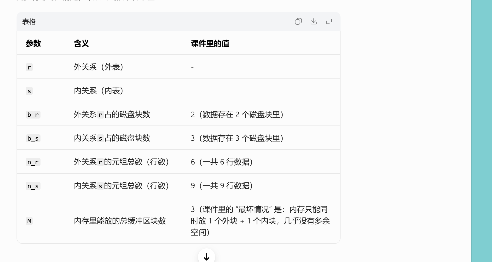

# 查询处理

## 宏观

---

## 一、整体流程：查询处理的3大核心步骤

第一张图把整个过程串起来了，用户写的一条SQL语句，数据库要经过这三步才能给你结果：

| 步骤 | 核心作用 | 对应图中的流程 |
| :--- | :--- | :--- |
| 1. **Parsing and Translation（语法分析与翻译）** | 检查SQL语法、把SQL翻译成数据库能理解的内部形式 | query → parser/translator → relational-algebra expression |
| 2. **Optimization（查询优化）** | 找出执行SQL的最高效方案，生成执行计划 | relational-algebra expression + 数据统计信息 → optimizer → execution plan |
| 3. **Evaluation（执行）** | 按执行计划读取数据，算出结果 | execution plan + 实际数据 → evaluation engine → query output |

---

## 二、逐页细节拆解

### 1. 第二张PPT：语法分析与翻译 + 执行

- **Parsing and translation（语法分析与翻译）**
  就像编译器处理代码一样，解析器（parser）做两件事：

  1.  检查SQL语法对不对，比如关键字拼写、表/列名是否存在。
  2.  把SQL翻译成数据库的“内部语言”——**扩展关系代数（ERA）**，生成Parser树，方便后续处理。

- **Evaluation（执行阶段）**
  执行引擎拿到**查询执行计划（query-evaluation plan）**，按计划执行每一步操作，最终返回查询结果。
  而“执行计划”的本质，就是明确指定：每个操作（比如筛选、连接）用什么算法执行，以及操作之间怎么协调执行顺序。

### 2. 第三张PPT：为什么要做查询优化？

这页解释了优化的必要性，也是整个流程里最关键的一步：

1.  **同一条SQL，有很多等价的关系代数表达式**
    比如例子里的SQL：`Select balance from account where balance > 2500;`

    - (a) 先投影（取balance列），再筛选（balance>2500）：`σ_{balance>2500}(Π_{balance}(account))`
    - (b) 先筛选（balance>2500），再投影（取balance列）：`Π_{balance}(σ_{balance>2500}(account))`
    两种写法结果完全一样，但执行效率天差地别——(b)的效率通常更高，因为先筛选可以减少后续要处理的数据量。

2.  **同一个关系代数操作，也有多种实现算法**
    比如上面例子里的筛选（σ）操作：

    - 可以用线性扫描（全表逐行检查）
    - 也可以用索引（直接定位符合条件的行）
    不同算法的执行速度、资源消耗差异巨大。

因此，一条SQL的执行方式有无数种组合，查询优化器的目标就是：根据数据的统计信息（比如表的大小、索引分布、数据分布），找出**代价最低、效率最高的执行方案**，也就是我们常说的“执行计划”。

---

## 三、一句话总结

这几页PPT讲的是：**数据库如何把用户写的SQL，从“人类可读的语句”，一步步变成“高效的执行步骤”，最终返回结果的全过程**。
核心就是：先翻译SQL，再优化出最优方案，最后按方案执行。

## 接着

这几页是在继续讲**数据库查询优化（Query Optimization）**的核心内容，我帮你把关键信息拆解得明明白白👇

---

## 一、查询优化的核心流程回顾

结合之前的PPT，优化阶段主要分3步，这几页把第1-3步讲透了：

1.  找出所有等价的关系代数表达式（也就是“能得到相同结果的不同写法”）
2.  为每个表达式生成**查询执行计划（query-execution plan）**
3.  基于成本估算，选出代价最低的执行计划

---

## 二、逐页拆解细节

### 1. 第一页：什么是「查询执行计划」？

- 定义：**查询执行计划**是一个包含了所有底层操作细节的执行步骤序列，它不仅包含关系代数操作，还明确了每个操作要用什么算法、如何执行。
- 例子（E.g1）：
  对于之前的SQL `Select balance from account where balance > 2500;`，它的执行计划是：

  1.  用`balance`列的索引，筛选出满足`balance>2500`的行（而不是全表扫描）
  2.  对筛选后的结果，投影（只保留`balance`列）
  这个标注了“使用索引1”的关系代数树，就是一个完整的查询执行计划。

### 2. 第二页：等价表达式的优化例子

这里用了一个多表连接的SQL来演示**关系代数表达式的等价变换**：

- 原始SQL对应的初始表达式树（a）：先把`branch`、`account`、`depositor`三张表全连接，再筛选`branch-city='Brooklyn'`，最后投影客户姓名。
- 优化后的表达式树（b）：先对`branch`表单独做筛选（提前过滤掉不符合城市条件的分支），再和其他表连接。
- 核心逻辑：**把筛选操作尽可能下推到离数据源更近的位置**，减少后续连接操作需要处理的数据量，这是数据库优化里最经典的“选择下推”优化。

### 3. 第三页：如何选“最优”计划？

- 查询优化的目标：在所有等价的执行计划中，选出**成本最低**的那一个。
- 成本估算的两个核心依据：
  1.  **执行算法本身的代价**：比如筛选用索引扫描 vs 全表扫描，连接用哈希连接 vs 嵌套循环连接，不同算法的时间复杂度差异巨大。
  2.  **数据库统计信息**：比如每个表的元组数、元组大小、数据分布、索引基数等，这些数据来自数据库的系统目录（catalog），用来估算不同计划的实际开销。
- 后续章节的安排：
  - 本章：讲如何衡量查询成本、单操作（选择、连接）的算法、如何组合这些算法执行完整查询。
  - 第16章：讲如何找到成本最低的执行计划，也就是完整的查询优化策略。

---

## 三、一句话总结

这几页PPT把查询优化的核心讲透了：
**数据库会先把SQL翻译成不同的等价执行方案，再用成本估算选出效率最高的那个方案（执行计划），最后按这个计划去执行。**

---

## 成本咋算

这几页PPT是在讲**数据库查询成本估算的底层逻辑**，核心就是：为什么磁盘I/O是性能瓶颈，以及怎么量化一条SQL的执行成本。我帮你把关键信息拆解得明明白白👇

---

## 一、先搞懂3个关键背景（第一页）

这三点是理解查询成本的前提，也是数据库优化的底层逻辑：

1.  **CPU不能直接操作磁盘数据**：所有数据必须先从磁盘读到内存，CPU才能处理。这就决定了磁盘I/O（读写）是所有操作的必经之路。
2.  **磁盘容量的增长，远快于读写速度的增长**：过去20年，磁盘容量涨了1000倍，但读写速度只涨了40倍。意味着数据越来越多，但读写瓶颈越来越突出。
3.  **磁盘的“寻道时间”，比数据传输时间慢得多**：机械硬盘里，磁头移动到数据位置的时间（寻道），比真正读数据的时间要慢几十倍。所以减少“寻道次数”，比减少传输的数据量更能提升性能。

---

## 二、什么是「查询成本」？（第二页）

- 定义：查询成本 = 执行这条SQL的**总耗时**。
- 耗时的三大组成部分：磁盘访问 + CPU计算 + 网络通信。
- 核心结论：**磁盘访问是占比最高的成本，也是优化的重中之重**。
  磁盘成本主要看3个指标：

  1.  寻道次数（磁头移动的次数）
  2.  读取的块数 × 单块读取耗时
  3.  写入的块数 × 单块写入耗时
  补充：写入的成本通常比读取更高，因为写完后数据库还要读回来校验，确保写入成功。

---

## 三、简化的成本计算公式（第三页）

为了方便估算，数据库会用一个简化公式来计算成本：

- 先定义两个关键参数：
  - \( t_T \)：传输一个数据块的时间（≈0.1ms）
  - \( t_S \)：一次磁盘寻道的时间（≈4ms）
- 成本公式：
  \[
  \text{Cost} = b \times t_T + S \times t_S
  \]
  其中 \( b \) 是传输的块数，\( S \) 是寻道次数。

- 为了简化模型，通常会忽略CPU成本和最终结果写回磁盘的成本，只重点估算磁盘I/O的开销。

---

## 四、影响成本的其他因素（第四页）

成本估算不是一成不变的，它还受这些因素影响：

- **内存缓冲区大小**：内存越大，能缓存的数据越多，需要读磁盘的次数就越少。但实际可用内存受其他进程影响，很难提前精准预测。
- **数据是否已在缓存中**：如果数据已经在内存里，就可以直接读取，不用再访问磁盘。但缓存命中率无法提前确定，所以估算时通常会假设最坏情况（数据都不在缓存里）。
- 因此，数据库通常会同时估算“最坏情况成本”和“最好情况成本”，来选择一个相对稳妥的执行计划。

---

## 一句话总结

这几页讲透了查询优化的核心逻辑：
**磁盘I/O（尤其是寻道）是数据库性能的最大瓶颈，所以查询优化的本质，就是通过减少磁盘访问次数、降低寻道开销，来降低SQL的执行成本。**

---

如果你需要，我可以用一个具体的SQL语句，带你一步步算它的磁盘I/O成本，帮你彻底搞懂这个公式怎么用。需要吗？

## 选择优化

这几页PPT讲的是**数据库中「选择操作（Selection Operation，也就是SQL里的`WHERE`条件筛选）」的底层实现算法，以及对应的成本估算**。核心就是：数据库是怎么用不同的方式找到符合条件的数据，以及每种方式的性能开销怎么算。

我帮你按“不用索引 → 有序文件查找 → 用索引查找”的顺序，把所有算法和逻辑拆解清楚👇

---

## 一、不用索引的基础算法：文件扫描（File Scan）

### 1. A1：线性搜索（Linear Search，全表扫描）

这是最通用的筛选方式，**不需要任何索引，也不管数据怎么存**，就是把整个表从头到尾扫一遍，检查每一行是否符合条件。

- 成本估算：
  - 一般情况（非主键筛选）：需要读完整张表的所有块
    \[
    \text{Cost} = b_r \times t_T + 1 \times t_S
    \]
    （$b_r$ 是表r的总块数，读数据块需要1次寻道，之后连续读取）

  - 主键等值筛选：找到目标行就可以停止，平均读一半的块
    \[
    \text{Cost} = \frac{b_r}{2} \times t_T + 1 \times t_S
    \]

- 特点：
  - 优点：万能，任何条件都能用，不依赖数据排序或索引。
  - 缺点：数据量大的时候极慢，是性能最差的选择。

### 补充：为什么不推荐普通的二分查找？

PPT里提到“二分查找一般不适用”，原因是：

- 二分查找需要数据**连续有序存储**，但数据库的物理存储往往是碎片化的，很难满足这个条件。
- 即使数据有序，二分查找的多次寻道开销，也通常比用索引查找要高，性价比很低。

---

## 二、有序文件的二分查找（A2：Binary Search）

只有当数据文件**按筛选字段连续有序存储**时，才能用二分查找来做等值筛选。

- 适用场景：筛选条件是`=`，且数据按该字段有序存储。
- 成本估算：
  1.  找到第一个符合条件的块：需要$\lceil \log_2(b_r) \rceil$次块传输和寻道，时间成本是
      \[
      \text{定位成本} = \lceil \log_2(b_r) \rceil \times (t_T + t_S)
      \]

  2.  如果不是主键（有多个符合条件的行），还要读取所有包含符合条件记录的块，总传输块数：
      \[
      \text{总块数} = \lceil \log_2(b_r) \rceil + \left\lceil \frac{\text{sc}(A,r)}{f_r} \right\rceil - 1
      \]
      其中 $\text{sc}(A,r)$ 是符合条件的记录数，$f_r$ 是每个块能存的记录数。

举个例子：PPT里的`account`表按`branch_name`有序存储，查询`branch_name='Downtown'`，用二分查找就能快速定位到`Downtown`的第一个块，再连续读取所有相关块，比全表扫描快得多。

---

## 三、用索引的筛选算法（Index Scan）

索引是优化筛选的关键，这部分讲了用**主索引（Primary Index）**做等值筛选的两种情况：

### 1. A3：主键等值筛选（Primary Index, Equality on Key）

比如`WHERE account_number = 'A-101'`，主键是唯一的，只会返回一条记录。

- 执行逻辑：
  1.  沿着B+树索引从根节点找到叶子节点（索引树高为$h_i$，需要读$h_i$个索引块）
  2.  根据叶子节点的指针，读取数据文件中对应的那个数据块
- 成本估算：
  \[
  \text{Cost} = (h_i + 1) \times (t_T + t_S)
  \]
  （$h_i$ 次索引I/O + 1次数据块I/O，每次I/O都包含寻道+传输）

### 2. A4：非主键等值筛选（Primary Index, Equality on Non-key）

比如`WHERE branch_name = 'Downtown'`，非主键字段，会返回多条记录。

- 执行逻辑：
  1.  同样先通过B+树索引找到第一个符合条件的数据块（读$h_i$个索引块）
  2.  由于数据按索引字段有序存储，所有符合条件的记录在连续的块里，直接顺序读取即可
- 成本估算：
  \[
  \text{Cost} = h_i \times (t_T + t_S) + t_S + b \times t_T
  \]
  其中 $b = \left\lceil \frac{\text{sc}(A,r)}{f_r} \right\rceil$ 是包含符合条件记录的数据块数。
  （$h_i$次索引I/O + 1次寻道 + 读取所有相关数据块的传输时间）

---

## 四、直观理解：B+树索引的执行过程

最后一张图就是A4算法的例子：

- 筛选条件是`branch_name='Perryridge'`，通过B+树索引：
  1.  从根节点开始，找到`Perryridge`对应的叶子节点
  2.  根据叶子节点的指针，直接定位到数据文件中所有`Perryridge`的记录块
  3.  连续读取这些块，就能拿到所有符合条件的数据
- 对比全表扫描：索引避免了读取整张表，也避免了多次随机寻道，性能提升非常明显。

---

## 一句话总结

这几页讲的是SQL筛选操作的“性能进化史”：
从最慢的**全表扫描**，到依赖有序存储的**二分查找**，再到性能最优的**B+树索引扫描**，数据库通过不同的算法来降低磁盘I/O开销，这就是查询优化中“选对筛选方式”的核心逻辑。

这几页PPT是在继续讲**数据库「选择操作（Selection）」的进阶实现算法**，包括二级索引筛选、范围筛选，以及复杂条件（AND/OR/NOT）的处理方式。我帮你按模块拆解清楚👇

---

## 一、二级索引的等值筛选（A5算法）

### 1. 什么是二级索引？

和主索引不同，二级索引的叶子节点不直接指向连续的数据块，而是存储一条条记录的指针，数据本身在磁盘上是分散存储的（就像第二张图里的`balance`索引，相同值的记录可能分布在不同的块里）。

### 2. 两种情况的成本估算

- **候选键筛选（唯一值）**：比如用二级索引筛选唯一的`email`字段，只会返回一条记录。成本和主索引主键筛选一样：
  \[
  \text{Cost} = (h_i + 1) \times (t_T + t_S)
  \]
  （$h_i$ 是索引树高，读$h_i$个索引块 + 1个数据块）

- **非候选键筛选（多值）**：比如用二级索引筛选`balance=700`，会返回多条记录，且这些记录在不同的磁盘块里。成本公式是：
  \[
  \text{Cost} = (h_i + n) \times (t_T + t_S)
  \]
  （$n$ 是符合条件的记录数，每一条记录都需要一次独立的磁盘I/O，包括寻道+传输）

- **关键结论**：如果返回的记录很多，二级索引的随机I/O开销会非常高，甚至比全表扫描还要慢，这也是为什么“索引失效”的典型场景之一。

---

## 二、范围筛选（比较运算符 > / < / >= / <=）

这类筛选的范围更大，实现方式分三种：

1.  全表扫描（A1）：通用但最慢。
2.  有序文件二分查找（A2）：数据有序时适用。
3.  索引筛选（A6/A7）：
    - **A6：主索引的范围筛选**（比如`WHERE balance >= 700`）：
      用索引找到第一个符合条件的记录，然后顺序读取后续所有连续的数据块，避免了随机I/O。

    - **A7：二级索引的范围筛选**：
      用索引找到所有符合条件的记录指针，但因为数据分散，每一条记录都要一次随机I/O，开销极高。如果符合条件的记录很多，可能还不如全表扫描。

---

## 三、复杂条件的筛选（AND/OR/NOT）

### 1. 合取条件（AND，Conjunction）

比如`WHERE branch_name='Downtown' AND balance>500`，有三种实现方式：

- **A8：单索引优先**：选择其中代价最低的条件（比如有索引的`branch_name`）先执行，把结果读到内存里，再在内存里检查其他条件。
- **A9：复合索引**：如果有针对`(branch_name, balance)`的复合索引，可以直接用索引一次性筛选所有条件，效率最高。
- **A10：取交集**：每个条件用各自的索引筛选，得到记录指针集合，再对这些集合取交集，最后读取符合条件的记录。

### 2. 析取条件（OR，Disjunction）

比如`WHERE branch_name='Downtown' OR balance>500`：

- 只有当**所有条件都有索引**时，才能用A10算法：每个条件用索引筛选，得到指针集合，再取并集，最后读取记录。
- 如果有任何一个条件没有索引，就只能用全表扫描，因为OR的两个分支都要处理，索引优化的收益被抵消了。

### 3. 否定条件（NOT，Negation）

比如`WHERE NOT balance>500`：

- 通常直接用全表扫描，因为索引只能快速找到`balance>500`的记录，再取反反而更麻烦。
- 只有当符合`balance>500`的记录非常少的时候，才会用索引先找到这些记录，再在结果中取反。

---

## 一句话总结

这几页讲透了SQL筛选的“进阶玩法”：
从二级索引的随机I/O陷阱，到范围筛选的索引优化，再到AND/OR/NOT复杂条件的处理策略，核心都是围绕**减少磁盘I/O（尤其是随机寻道）**来设计的，也是数据库优化器选择执行计划的关键依据。

## 再次强调

先给你**数据库教科书标准定义**（适配你现在这门课，不是InnoDB那套，是经典**文件组织+索引**理论），一句话讲透，不绕弯。

## 1. Primary Index 主索引

前提：
数据表是**有序顺序文件**，按某个字段从小到大物理排好存在磁盘块里。

**定义**
以这个**排序字段**作为索引键，建立的索引，就叫 **Primary Index**。

特点：

1. 表物理数据**本身就按这个键有序**
2. 索引每个条目，**对应一个磁盘数据块**
3. 是**稀疏索引**，不是每条记录一条索引，**每块一条索引**
4. 一张表**只能有一个**主索引

大白话：
**表已经按某一列排好序了，顺着这个排序列建的索引 = 主索引**

## 2. Secondary Index 二级索引 / 辅助索引

前提：
已经有了主索引，现在**再给别的字段建索引**。

**定义**
在**非排序字段**上建立的索引，叫 **Secondary Index**。

特点：

1. 建在**不是物理排序**的字段上
2. 通常是**稠密索引**：每个搜索码值都有索引项
3. 索引里存：**索引键 + 指向记录的指针**
4. 一张表**可以建很多个**二级索引

大白话：
**表没按这列排序，额外给别的字段加的索引 = 二级索引**

---

## 3 最核心区别（考试必背）

1. **建在谁身上**
- Primary Index：建在**文件物理排序字段**
- Secondary Index：建在**非排序字段**

2. **索引粒度**
- 主索引：按**磁盘块**做稀疏索引
- 二级索引：按**每条记录/每个键值**做稠密索引

3. **数量**
- 主索引：整张表**唯一一个**
- 二级索引：可以**任意多个**

---

## 4 和聚簇/非聚簇索引的关系（帮你对标）

- **Primary Index ≈ 聚簇索引**（数据跟索引顺序一致）
- **Secondary Index ≈ 非聚簇索引**（索引是索引，数据顺序跟它没关系）

---

## 极简一句话总结

**主索引：表物理排好序的那一列建的索引。
二级索引：除了排序列，其他字段额外建的索引。**

## 排序

这页PPT讲的是**数据库里「排序（Sorting）」的核心逻辑**，包括「为什么要排序」「用索引排序的坑」「两种排序方法」，我结合你之前问的索引、磁盘I/O知识，给你拆解得明明白白👇

---

## 一、Why：数据库为什么要做排序？

排序不是没事找事，主要为了两个关键场景：

1.  **满足用户的排序需求（Output request）**
    比如SQL里的`ORDER BY`语句，用户要求结果按某个字段排序，数据库需要返回有序的结果。

2.  **加速连接操作（Join operations）**
    很多高效的连接算法（比如归并连接 Merge Join），要求两张表按连接字段有序。排序后的表做连接，不用暴力嵌套循环，直接线性扫描匹配，效率能提升好几个数量级，这是数据库优化的重要手段。

---

## 二、坑：用索引排序，为什么不靠谱？

PPT里说：“建索引然后按索引顺序读数据，只能做到逻辑有序，不是物理有序，可能导致每条记录都要一次磁盘块访问”。
这正好呼应了你之前问的**二级索引的随机I/O问题**：

- 比如你建了一个二级索引，索引本身是按字段排好序的，但**数据本身物理上是分散存储的**。
- 当你按索引顺序读数据时，每一条记录都要跳去不同的磁盘块，也就是**随机I/O**，寻道开销极高。
- 举个例子：你按`balance`建了二级索引，读`balance`从小到大的记录时，数据可能分布在100个不同的磁盘块里，要做100次随机寻道，比直接全表扫描+排序还慢。

这也是为什么：**索引不是万能的，有序索引不一定能高效读有序数据**，尤其是二级索引。

---

## 三、How：数据库怎么排序？

根据数据量能不能放进内存，分两种完全不同的方案：

### 1. 数据能放进内存：用内存排序算法

比如`quicksort`（快速排序），所有数据都在内存里，不用管磁盘I/O，直接用快排、归并排序这类内存算法处理，效率极高。
适用场景：小表、能完全加载进内存的表。

### 2. 数据太大放不进内存：用「外部归并排序（External Sort-Merge）」

这是数据库处理超大数据排序的**标准方法**，核心思路是“分治+归并”：

1.  **分块排序**：把磁盘上的大文件分成多个小块，每次读一个小块进内存，用内存算法排好序，再写回磁盘，得到多个有序的小文件。
2.  **多路归并**：把这些有序的小文件，像合并有序链表一样，归并成一个完整的有序大文件。
- 优点：完美解决“内存放不下”的问题，把随机I/O降到最低，主要用顺序读写磁盘块，效率比索引排序高得多。

---

## 一句话总结

这页讲透了数据库排序的核心：
排序是为了满足查询和优化连接，但用二级索引排序会陷入随机I/O的陷阱，所以数据库会根据数据量，选择内存排序或外部归并排序，用最低的磁盘I/O开销完成排序。

## 排序花费计算

这几页PPT讲的是**数据库「外部归并排序」的成本分析**，核心是量化排序过程中两种关键开销：**块传输次数（Block Transfers）**和**寻道次数（Seeks）**，这也是数据库评估大数据排序性能的核心依据。

我结合你之前学的磁盘I/O、排序流程，把公式和例子拆解得明明白白👇

---

## 一、先明确核心变量（避免公式看不懂）

| 变量 | 含义 |
|------|------|
| $b_r$ | 整个数据的总块数（比如1000块数据） |
| $M$ | 内存中可用的缓冲区数（Pass 0时，每个有序run的大小是$M$块） |
| $M-1$ | 归并阶段的“路数”（1个缓冲区给输出，剩下的给输入run） |
| $P$ | 归并趟数（Pass 1、Pass 2…的数量），公式：$P = \lceil \log_{M-1}(b_r/M) \rceil$ |
| $b_b$ | 每次顺序读写的块数（批量读写的大小，一次读写$b_b$个连续块只需1次寻道） |
| $t_T$ | 单块传输时间 |
| $t_S$ | 单次寻道时间（机械硬盘的瓶颈，比$t_T$慢几十倍） |

---

## 二、第一页：块传输次数（Block Transfers）成本分析

### 1. 每一步的块传输开销

外部归并排序分两个阶段，每个阶段的块传输次数如下：

- **Pass 0（初始run生成）**：
  把所有数据读进内存排序，再写回磁盘，需要**读$b_r$块 + 写$b_r$块**，共$2b_r$次块传输。

- **每一趟归并（Merge Pass）**：
  把上一趟的有序run读进内存，归并后写回新的run，每一趟同样需要**读$b_r$块 + 写$b_r$块**，共$2b_r$次块传输。

- **特殊优化：最后一趟归并不计写成本**
  如果排序是查询计划的中间步骤（比如为归并连接做预处理），排序后的结果不需要写回磁盘，直接传给下一个操作，因此最后一趟的写成本可以忽略（减去$b_r$次写操作）。

### 2. 总块传输次数公式

\[
\text{Total Block Transfers} = b_r \times (2\lceil \log_{M-1}(b_r/M) \rceil + 1)
\]
推导过程：
\[
\text{总次数} = \underbrace{2b_r}_{\text{Pass 0}} + \underbrace{2b_r \times P}_{\text{归并趟数}} - \underbrace{b_r}_{\text{最后一趟写成本}} = b_r(2P + 1)
\]

---

## 三、第二页：直观例子理解（$M=3$，$b_r=12$）

例子中内存缓冲区数$M=3$，数据总块数$b_r=12$（12条记录，每条占1块）：

1.  **Pass 0**：生成$\lceil 12/3 \rceil=4$个有序run，块传输次数$2×12=24$次。
2.  **归并趟数**：$P=\lceil \log_{2}(12/3) \rceil = \lceil \log_2 4 \rceil=2$趟。
3.  **总块传输次数**：$12×(2×2+1)=60$次，和实际流程（Pass0:24 + Pass1:24 + Pass2:12）完全吻合。

这个例子也直观展示了“$M$越大，趟数越少，开销越低”的规律——如果$M=11$，同样1000块数据的趟数会从9趟降到2趟，开销直接减少近4倍。

---

## 四、第三页：寻道次数（Seeks）成本分析

寻道是机械硬盘的核心瓶颈，因此单独计算，分为两部分：

### 1. Pass 0（run生成阶段）的寻道次数

每个有序run需要：

- 1次寻道读入（读连续块，一次寻道后顺序读）
- 1次寻道写出（写连续块，一次寻道后顺序写）
总共有$\lceil b_r/M \rceil$个run，因此Pass 0的寻道次数为：
\[
2 \times \lceil b_r/M \rceil
\]

### 2. 归并阶段的寻道次数

假设每次批量读写$b_b$个连续块，每一趟归并的寻道次数为：

- 读：$\lceil b_r/b_b \rceil$次（每读$b_b$块一次寻道）
- 写：$\lceil b_r/b_b \rceil$次（每写$b_b$块一次寻道）
但最后一趟不用写，因此归并阶段总寻道次数为：
\[
\lceil b_r/b_b \rceil \times (2P - 1)
\]

### 3. 总寻道次数公式

\[
\text{Total Seeks} = 2\lceil b_r/M \rceil + \lceil b_r/b_b \rceil \times (2\lceil \log_{M-1}(b_r/M) \rceil - 1)
\]

---

## 五、关键结论：为什么外部归并排序高效？

结合你之前问的二级索引随机I/O问题，这里可以直接对比：

- **外部归并排序**：几乎全是**顺序读写**，寻道次数极少，主要开销是块传输，整体开销可控。
- **二级索引排序**：需要多次随机I/O，每读一条记录都要一次寻道，开销随数据量线性增长，远不如外部排序高效。

这也是数据库处理大数据排序时，优先选择外部归并排序的核心原因。

## join操作

我帮你把这组课件**从头到尾拆解得明明白白**，核心是讲数据库里两种基础的**表连接（Join）算法**：普通嵌套循环连接（Nested-Loop Join）和它的优化版——块嵌套循环连接（Block Nested-Loop Join），还附带了完整的成本计算和优化思路。

---

## 一、先搞懂背景：这组课件在讲啥？

这是数据库《查询处理》章节的内容，目标是解决**两张表做Join连接**时，怎么用最少的磁盘I/O（块传输+寻道次数）完成操作。

- 例子：两张表`depositor`（存款表）和`customer`（客户表）做Join（比如按客户ID关联）
- 两张表的基础参数（所有计算都基于这组数据）：

| 表名       | 记录数（元组数`n`） | 磁盘块数（数据占的块数`b`） |
|------------|---------------------|------------------------------|
| `customer` | 10000               | 400                          |
| `depositor`| 5000                | 100                          |

课件里介绍了5种Join算法，这里重点讲前两种：

1.  普通嵌套循环连接（Nested-Loop Join）
2.  块嵌套循环连接（Block Nested-Loop Join，前者的优化版）

---

## 二、基础版：普通嵌套循环连接（Nested-Loop Join）

### 1. 原理：两层循环暴力匹配

伪代码逻辑非常直白，就是两层`for`循环：

```
// r是外表（Outer relation），s是内表（Inner relation）
for each tuple t_r in r:
    for each tuple t_s in s:
        if t_r和t_s满足连接条件θ:
            把t_r和t_s拼接，加入结果集
```

- **优点**：不需要索引，支持任何连接条件（包括不等值连接）
- **缺点**：要检查所有元组对，时间复杂度是`O(n_r * n_s)`，开销极大

### 2. 成本计算：磁盘I/O是瓶颈

数据库性能的瓶颈是磁盘读写，所以成本主要算两个指标：

- **块传输次数**：从磁盘读数据块到内存的次数（核心成本）
- **寻道次数**：磁头移动到数据位置的次数（寻道比传输慢得多，也要算）

#### （1）最坏情况（内存极小，只能装1个外表块+1个内表块）

公式：

- 块传输：`n_r * b_s + b_r`
  解释：外表`r`读1次（成本`b_r`）；内表`s`要读`n_r`次（每个外表元组都要扫一遍内表），每次读`b_s`个块，所以是`n_r * b_s`

- 寻道次数：`n_r + b_r`
  解释：外表读1次，需要`b_r`次寻道；内表读`n_r`次，每次读只需要1次寻道（连续读块，一次定位就行），所以是`n_r`次

#### （2）用例子算两种情况

- 情况1：`depositor`当外表（`n_r=5000, b_r=100`；`b_s=400`）
  块传输：`5000*400 + 100 = 2,000,100` 次
  寻道：`5000 + 100 = 5100` 次

- 情况2：`customer`当外表（`n_r=10000, b_r=400`；`b_s=100`）
  块传输：`10000*100 + 400 = 1,000,400` 次
  寻道：`10000 + 400 = 10400` 次

#### （3）最好情况（小表能完全放进内存）

如果内表`depositor`（`b_s=100`）能一次性装到内存里，内表只需要读1次：

- 成本：块传输`= b_r + b_s = 400 + 100 = 500` 次，寻道2次（只有内存足够大时才成立）

---

## 三、优化版：块嵌套循环连接（Block Nested-Loop Join）

普通Nested-Loop的致命缺点是**按元组遍历**，内表要读`n_r`次（元组数），成本极高。Block版把外层循环改成了**按块遍历**，直接把内表的读取次数从`n_r`降到了`b_r`（块数），成本大幅下降。

### 1. 原理：块级循环，减少内表读取次数

伪代码改成了“先按块遍历，再按元组遍历”：

```
// r是外表，s是内表
for each block B_r in r:          // 第一步：遍历外表的每个块
    for each block B_s in s:      // 第二步：遍历内表的每个块
        for each tuple t_r in B_r:  // 第三步：遍历外表块里的元组
            for each tuple t_s in B_s:  // 第四步：遍历内表块里的元组
                if t_r和t_s满足连接条件:
                    拼接加入结果
```

核心优化：外表的块数`b_r`比元组数`n_r`少得多（比如`depositor`的`b_r=100`，`n_r=5000`，差了50倍），所以内表的读取次数直接从`n_r`次降到了`b_r`次。

### 2. 基础成本计算（内存只有3个块）

假设内存只能装1个外表块+1个内表块+1个输出块：

#### （1）最坏情况公式

- 块传输：`b_r * b_s + b_r`
  解释：外表读1次（`b_r`）；内表读`b_r`次（每个外表块读一次内表），每次读`b_s`个块，所以是`b_r * b_s`

- 寻道次数：`2 * b_r`
  解释：每个外表块，需要1次寻道读外表块 + 1次寻道读整个内表，所以每个外块对应2次寻道，共`2*b_r`次

#### （2）用例子计算

- 情况1：`depositor`当外表（`b_r=100, b_s=400`）
  块传输：`100*400 + 100 = 40100` 次
  寻道：`2*100 = 200` 次

- 情况2：`customer`当外表（`b_r=400, b_s=100`）
  块传输：`400*100 + 400 = 40400` 次
  寻道：`2*400 = 800` 次

这里有个关键结论：**一定要用块数少的表当外表（Outer relation）**，这样`b_r`更小，块传输和寻道次数都更低。

### 3. 进阶优化：利用更多内存（M>3个块）

当内存块数`M`更大时，不用只装1个外表块，可以装`M-2`个外表块（剩下2个块：1个内表块，1个输出块），这样每次读内表的时候，可以和`M-2`个外表块配对，内表的读取次数进一步减少。

#### 公式

- 块传输：`ceil(b_r / (M-2)) * b_s + b_r`
  解释：外表有`b_r`个块，每次能装`M-2`个，所以需要读`ceil(b_r/(M-2))`次内表（`ceil`是向上取整）

- 寻道次数：`2 * ceil(b_r / (M-2))`
  解释：每次读一批外表块+读一次内表，需要2次寻道，共`ceil(b_r/(M-2))`批

#### 例子：M=10（内存能装10个块）

`r=customer`（`b_r=400`），`s=depositor`（`b_s=100`）：
`ceil(400/(10-2))=ceil(400/8)=50`

- 块传输：`50*100 + 400 = 5400` 次
- 寻道：`2*50 = 100` 次

可以看到，内存越大（`M`越大），成本越低，因为`M-2`越大，`ceil(b_r/(M-2))`越小，内表读的次数越少。

### 4. 其他优化技巧

- **等值连接优化**：如果内表的连接属性是主键（唯一的），找到第一个匹配的元组就可以停止内循环，不用继续找，减少元组比较次数。
- **缓存利用**：交替向前/向后扫描内表，利用LRU缓存里还没被替换的块，减少缓存失效，提高效率。
- **索引优化**：如果内表有索引，可以用`Indexed Nested-Loop Join`，不用扫整个内表块，直接查索引找匹配元组，进一步降低成本。

---

## 四、直观对比：不同算法的成本差异

| 算法                     | 情况                     | 块传输次数 | 寻道次数 |
|--------------------------|--------------------------|------------|----------|
| 普通Nested-Loop          | `depositor`当外表（最坏）| 2,000,100  | 5100     |
| Block Nested-Loop        | `depositor`当外表（M=3） | 40100      | 200      |
| Block Nested-Loop（M=10）| `customer`当外表         | 5400       | 100      |
| 最好情况（小表进内存）   | 任意算法                  | 500        | 2        |

可以看到，从普通Nested-Loop到Block Nested-Loop，再到利用更多内存优化，成本下降非常明显，这就是为什么数据库里基本不用普通Nested-Loop，而是用Block Nested-Loop的原因。

---

## 五、高阶优化：索引嵌套循环连接（Indexed Nested-Loop Join）

如果内表的连接属性上有索引，我们可以用**索引查找（Index lookups）**代替暴力的文件扫描。

### 1. 适用条件与原理
- **条件**：必须是等值连接（equi-join）或自然连接（natural join），且内表（`s`）的连接字段上建有索引。甚至有时候为了加速连接，会临时建一个索引。
- **原理**：对于外表（`r`）中的每一条元组 $t_r$，直接用它的连接字段值去内表（`s`）的索引里查，快速精准定位满足条件的内表元组。

### 2. 成本计算（最坏情况）
假设内存缓冲池极小，只能放下外表 $r$ 的仅仅一个磁盘块。那么外表 $r$ 的每一条元组，都需要在 $s$ 上执行一次索引查找。

- **连接总成本**：$b_r(t_T + t_S) + n_r \times c$
  > **解析**：
  > - $b_r(t_T + t_S)$：把外表 $r$ 的所有块（$b_r$个）全读进内存的成本。
  > - $n_r \times c$：外表共有 $n_r$ 条元组，每条元组都要查一次内表索引。
  > - $c$ 则是指单次查索引并取出所有匹配 $s$ 元组的 I/O 代价（可以约等于在 $s$ 表上做单次选择查询的代价）。

- **选择外表的必考原则**：如果两张表都有索引，**一定要选元组条数（$n_r$）更少的那张表作为外表**，因为公式中 $n_r \times c$ 的倍增效应最为明显。

---

## 六、具体案例计算：不同Join算法的成本大比拼

PPT这页给出了更直观的数据算例，继续以 $depositor \bowtie customer$ 为例，并规定 **$depositor$ 作为外表**。
- $depositor$ 的参数：$n_r=5000$（元组数），$b_r=100$（块数）
- $customer$ 的参数：$n_s=10000$（元组数），$b_s=400$（块数）

**新增条件**：假设 $customer$ 在关联属性 $ID$ 上有一个**主B+树索引**。树节点每个分支20条，对应10000条记录树高为 4，为了拿到数据还需要多访问 1 次数据。也就是：单次索引检索 $c$ = 5 次块传输/寻道。

### 两种算法开销对抗：

1. **块嵌套循环连接（Block Nested-Loops Join）**：
   - 块传输：$100 \times 400 + 100 = 40,100$ 次
   - 寻道次数：$2 \times 100 = 200$ 次
   - *(注：这是最坏情况的内存。如果可用内存大，花费会明显降低。)*

2. **索引嵌套循环连接（Indexed Nested-Loops Join）**：
   - 套用上面学到的公式（将传输和寻道合在一起算）：$100 + 5000 \times 5 = 25,100$ 次。
   - **结论**：I/O开销直线降低到 25,100。它凭借索引的精准性避开了内表的重复遍历。不仅如此，因为比较次数的大幅降低，它的 CPU 计算成本也很有可能比Block Nested-Loop性能要好！



---

## 七、排序归并连接（Merge-Join / Sort-Merge Join）

前面讲的 Nested-Loop 类算法依靠的是“循环”和“索引”，而 **Merge-Join（排序归并连接）** 依靠的是**“有序”**。这种算法专门用于**等值连接（equi-joins）**和**自然连接（natural joins）**。

### 1. 算法执行的两大步骤

1. **排序（Sort）**：如果参与连接的两张表在连接属性上还没有排序，那就先对它们进行排序（利用前面学过的外部归并排序）。
2. **归并（Merge）**：既然两张表都已经按连接属性排好序，直接用两个指针（游标）分别从头扫描两张表，将匹配的元组拼接输出即可。
   - 归并过程和外部排序的归并阶段非常像。
   - **唯一区别（处理重复值）**：如果在连接属性上有重复值，那么内表和外表中具有相同关联值的**每一对**元组都要成功匹配。（如果某一相同值的元组太多导致内存装不下所有的，还需要用到特殊的块读取策略）。可以参考 PPT 第一张图的左边和右边两个指针 `pr` 和 `ps` 的扫描过程。

### 2. 成本怎么算？

由于两张表都是有序的，合并的时候**每个磁盘块只需要被读取1次**（前提是具有相同连接值的元组可以放进内存）。这样一来，不需要像嵌套循环那样重复扫描内表了！

- **块传输次数**：$b_r + b_s$ 
- **寻道次数**：$\lceil b_r / b_b \rceil + \lceil b_s / b_b \rceil$ （$b_b$为每次顺序读写的块数）
- **总体合并成本**：$b_r + b_s$ 次传输 + $\lceil b_r / b_b \rceil + \lceil b_s / b_b \rceil$ 次寻道

*(注意：如果表不是预先排好序的，记得还要把对两张表做“外部归并排序”的成本加进去！即便如此，因为排序的开销是可控的顺序读写，通常也比最坏情况下的嵌套循环要快。)*

### 3. 混合归并连接 (Hybrid merge-join)

这是针对特定情况的巧妙优化：
- **场景**：一张表已经按连接属性**排好序**了，而另一张表没有排序，但在连接属性上有一个**二级B+树索引**。
- **痛点**：如果去查二级索引，会产生极其可怕的**随机I/O**（还记得前面讲的因为物理上未排序导致的跳跃寻道吗？）。
- **解决方案算法**：
  1. 首先，把已经有序的表，去和另一个表的 **B+树叶子节点**（存放的是该表的记录地址/指针）进行**归并**。
  2. 然后，对刚才得到的结果（这堆结果里包含了符合连接条件的那些地址），按照**物理存放地址（physical address order）**进行**一次排序**。
  3. 最后，按排序好的物理地址顺序，去没排序的那张表里把相应的实际元组按顺序扫描拿出来，替换掉刚才的地址指针。
  - **核心好处**：把原本因为二级索引导致的可怕“随机查找/多次独立寻道”，强行变成了最高效的**“顺序物理扫描（Sequential scan）”**！

---

## 八、哈希连接（Hash-Join）

**哈希连接**是另一种针对**等值连接（equi-joins）**和**自然连接**的高效算法，既不需要通过循环多次扫描磁盘，也不需要对全局进行昂贵的排序，它的核心思想是：“**通过哈希函数，把大问题先拆分成互不干扰的小问题，再逐个击破。**”

在哈希连接中：
- 较小的那张关系表通常被选为 $s$，称为**构建输入（build input）**。
- 较大的那张关系表通常被选为 $r$，称为**探测输入（probe input）**。

### 1. 算法执行的两大核心阶段

**第一阶段：划分阶段（Partitioning Phase）**
利用一个**哈希函数 $h$** 去处理两张表，让有着**相同关联属性值**的元组，一定落进对应的相同“桶/分区”里。
1. **划分 $s$ 表**：遍历表 $s$，将连接属性值传入哈希函数 $h$，映射到 $n$ 个分区 $s_0, s_1, ..., s_{n-1}$ 中。在内存里，我们需要为每个分区保留 $1$ 个输出缓冲区块（Output buffer）。
2. **划分 $r$ 表**：用**一模一样**的哈希函数 $h$ 遍历表 $r$，同样将之划分到对应的 $r_0, r_1, ..., r_{n-1}$ 个分区中。

**第二阶段：探测与匹配阶段（Probing Phase）**
到了这一步，因为用的是同一个哈希函数，所以能匹配上的 $s$ 和 $r$ 元组，**一定都在编号相同（比如 $s_i$ 和 $r_i$）的对应分区里**，分区之间绝不交叉。
1. **对于每一个分区 $i$ ($0 \le i < n$)**：
   - **(a) 加载并构建（Load & Build）**：把 $s_i$ （较小的那一块）全部读进内存中！并在内存中，用**另一个不同的**哈希函数对它建立“内存哈希索引”。
   - **(b) 探测（Probe）**：把对应的 $r_i$ 从磁盘里逐条读出来。针对每一条 $t_r$，用刚才建好的内存哈希索引去 $s_i$ 里快速寻找匹配的 $t_s$。一旦找到，拼接并输出。

### 2. 参数设定与内存要求

能够成功完成一次标准的 Hash-Join，最根本的前提就是：**构建输入的一个分区 $s_i$ 必须能够完整装进内存中**。
- 分区数量 $n$ 的大小这样定：一般会确保让 $s$ 切分出的每个块恰好适应内存。公式通常为 $n = \lceil b_s / M \rceil \times f$（$f$ 叫做 fudge factor 放宽因子，用来容错哈希不均，一般取 1.2 左右）。
- **必须知道的重点**：探测表的分区 $r_i$ **不需要全部放进内存**！因为它是逐条读取进而匹配就直接扔掉或输出了，只有 $s_i$ 被完整加载用作对照字典。

### 3. 特殊情况：递归划分（Recursive partitioning）

万一遇到极其头疼的情况 —— **内存实在太小了，甚至都分不出足够的输出缓冲区块（当划分区数量 $n$ 大于可用内存页数 $M$ 时）**？
这时候如果强行一次位划分，内存会“爆栈”。解决方法就是：**多层划小**。

**递归原理示例解析（见PPT图详解）：**
假设我们需要把S划分为30个区，那就需要 31页 内存（30个输出页 + 1个输入页）。但假设我的内存非常可怜，只有 $M=4$（也就是只有3个输出缓冲 + 1个输入）：
- **第一层划分（用 hash1）**：既然我现在只有3个输出缓冲能力，那就把100页的 S 表划分成 3 个非常大的分区（如 S1, S2, S3，每个约占33页）。
- **第二层划分（用 hash2）**：把第一层产生的、还是塞不进内存的 S1（33页），单独拿出来，再利用3个输出缓冲区向下划分，得到 S1a, S1b, S1c（各约11页的超小分区）。依次类推。
- 用同样的哈希函数层次去对 $r$ 执行一模一样的递归操作即可。

*(注：实际工程中**很少**发生递归划分。因为就算表高达几十GB，其实也只需要几十MB内存就能一次切好)*

### 4. 哈希溢出（Handling of Overflows）

如果在构建阶段（Build Phase），某一个分区 $Hs_i$ 实在太大，**还是装不进内存**怎么办？这种现象叫“哈希表溢出（Hash-table overflow）”。

- **溢出的原因**：
  1. 表 $s$ 中有大量具有**相同连接属性值**的元组（导致数据倾斜 Skewed，全分到了同一个桶里）。
  2. 使用的哈希函数不够好，导致散列非常不均匀。
- **解决溢出的方案**：
  - **溢出分解（Overflow resolution）**：在构建阶段如果发现溢出，直接针对溢出的这个 $Hs_i$ 分区，随便找一个**全新的哈希函数**对它再做一次内部分区。当然，对应的探测表分区 $Hr_i$ 也必须用相同的全新函数做切分。
  - **溢出避免（Overflow avoidance）**：未雨绸缪，在初始划分时故意切分出极多（多于 $M$）的小分区，最后再把那些很小的分区安全地组合拼凑起来。
  - **终极退路（Fallback option）**：如果在某个值上真的有极其海量的重复数据（上面两招都失效），只能捏着鼻子对溢出的部分改用 **块嵌套循环连接（Block Nested-Loop Join）** 来硬算。

### 5. 哈希连接的成本计算（Cost of Hash-Join）

哈希连接的开销主要分为“无递归”和“有递归”两种来讨论，这里主要以**块传输（Block transfers）**和**寻道（Seeks）**作为度量。假设划分出的分区数量为 $n_h$。

#### 情境 A：不需要递归划分（最常见）
绝大多数情况下可以一次切分好，开销由**分区阶段**加**连接（探测）阶段**组成：
- **总块传输次数**：$3(b_r + b_s) + 4 \times n_h$
  > **公式详细拆解**：
  > 1. **分区代价 $2(b_r+b_s)$**：读出 $s$ 和 $r$ 全表（$b_r+b_s$），算完哈希再全部写回磁盘的分区文件里（$b_r+b_s$）。这里的动作是“读+写”。
  > 2. **连接代价 $b_r+b_s$**：在连接探测阶段，仅仅只把分区文件**读**进内存即可（建哈希表+排查），连接结果直接输出，不计入写代价。
  > 3. **为何还有 $4 \times n_h$？**：因为划分出来的每一个小分区在写回磁盘时，**最后一块文件往往是填不满的（存在碎片空间）**。由于我们各自切出了 $n_h$ 个分区，$r$ 和 $s$ 表加起来最多会产生 $2 n_h$ 个未满块。这一来一回的读写，就会造成最多多出 $4n_h$ 次额外的块传输。
- **总寻道次数**：$2(\lceil b_r / b_b \rceil + \lceil b_s / b_b \rceil) + 2n_h$
  > **公式详细拆解**：
  > 1. 分区阶段时，由于是按块缓冲（$b_b$）成批读写，$r$ 和 $s$ 的全表读写各需要两遍寻道。即 $2 \times \lceil b_r / b_b \rceil$ 和 $2 \times \lceil b_s / b_b \rceil$。
  > 2. 连接阶段，各自读取那 $n_h$ 个分区区块去执行，产生 $2n_h$ 次寻道。

#### 情境 B：需要递归划分（内存极端不足，$b_s > (M - 1)^2$ 时）
要进行多次重复切分操作，划分趟数计算为 $\lceil \log_{M-1}(b_s) - 1 \rceil$（这也就是为什么必须选**小表**作为构建输入的原因——小表的趟数更少！）。
- **总块传输次数**：$2(b_r + b_s)\lceil \log_{M-1}(b_s) - 1 \rceil + b_r + b_s$ 
- **总寻道次数**：$2(\lceil b_r / b_b \rceil + \lceil b_s / b_b \rceil)\lceil \log_{M-1}(b_s) - 1 \rceil + 2n_h$

#### 最完美情境（Best Case）：完全装入内存！
如果小表（构建表 $s$）足够小，能被**一整块全部塞进内存主存**里，那我们彻底不需要写文件做磁盘划分了！根本没有分区阶段！
- 成本直接暴降至：$b_r + b_s$ 块传输。直接读进来就能连接输出，这是整个 Hash-Join 最美妙的情况。

---

## 九、复杂连接（Complex Joins）

在实际查询中，我们经常遇到带有很多过滤条件的复杂 Join 语句，比如带 `AND` 或 `OR` 逻辑。

### 1. 带有合取条件的连接（Conjunctive condition - AND）
例如：$r \bowtie_{\theta_1 \land \theta_2 \dots \wedge \theta_n} s$
- **做法A**：可以使用基本的嵌套循环连接（Nested loops）或者块嵌套循环连接（Block nested loops），在循环内部依次判断所有的 $\theta$ 条件。
- **做法B（推荐优化）**：先挑选出所有条件里能让连接计算**开销最小的某一个条件（比如 $\theta_i$）**，利用高效的 Join 算法（比如 Hash-Join 或 Indexed Nested-Loop Join）先计算出中间结果，然后再对待在这个中间结果里的元组一一进行剩下条件的判定和过滤。

### 2. 带有析取条件的连接（Disjunctive condition - OR）
例如：$r \bowtie_{\theta_1 \lor \theta_2 \dots \lor \theta_n} s$
- **做法A**：一样退回到使用嵌套循环连接或块嵌套循环连接，循环时满足任意条件即匹配输出。
- **做法B**：将其转化为多次独立连接的**并集（Union）**。即 $(r \bowtie_{\theta_1} s) \cup (r \bowtie_{\theta_2} s) \dots \cup (r \bowtie_{\theta_n} s)$。每一次都可以使用对应的最高效算法单独运算，但在最后需要额外增加一步**去重（Duplicate elimination）**以防重复输出。

---

## 十、其他关系操作的处理（Other Operations）

除了 Join，数据库还需要处理去重、投影、聚合、集合运算和外连接等操作。其核心优化手段往往离不开之前学过的**排序（Sorting）**和**哈希（Hashing）**这“两大法宝”。

### 1. 去重（Duplicate elimination）
- **基于排序（Sorting）**：因为只要对数据一排序，相同/重复的元组必定会**紧挨在一起相邻出现**，此时只需要扫描一次去除非首个的集合即可。
  - **终极优化**：外部归并排序的时候，可以在**创建初始 run** 以及**中间合并步骤（Merge steps）**的时候顺手就把去重做了（提早削减了要写的临时文件大小）！
- **基于哈希（Hashing）**：一模一样的值必然会哈希掉入同一个桶（Bucket）里。只需在每个桶内部检查和去重即可。

### 2. 投影（Projection）
- 对每条元组依次抛弃不需要的列（这就是纯内存 CPU 运算）。
- 因为可能会在切除列后产生重复（原来有唯一区分列，现在被切了），所以执行完列保留后，**必须要紧跟一步“去重操作”**。

### 3. 聚合操作（Aggregation）
比如 `GROUP BY` 操作后的求和、求平均值。处理逻辑与去重非常相似。
- 无论使用哪种方法（Sorting 还是 Hashing），其根本目的都是**“把属于同一组的那些元组物理聚拢在一起”**，然后各自在组内施加聚合函数。
- **神级优化（Partial aggregate / 局部聚合）**：和去重一样，在运行外部排序（或哈希建立）的过程中就**提前、部分地进行聚合计算**。
  - 对于 COUNT、MIN、MAX、SUM：只需边合并边把累加或极值记录下来即可，不必保留完整的元组。
  - 对于 AVG：可以始终维护着两个变量 —— “当前总和 Sum” 和 “当前计数 Count”，直到最后一步除一下即可。这极其节省磁盘空间和 I/O 成本！

### 4. 集合操作（Set Operations: $\cup, \cap, -$）
并集、交集和差集，本质上还是求两张表的比对，所以可以使用 Merge-Join 和 Hash-Join 的**变体（Variant）**来做。

**以基于哈希做集合操作为例：**
1. 用相同的哈希函数，把表 $r$ 和表 $s$ 都分区。
2. 对于每一对编号相同的分区段 $i$：
   - 将 $r_i$ 加载进内存建哈希索引（In-memory hash index）。
   - **对于并集 ($r \cup s$)**：遇到 $s_i$ 在索引中没有的马上加入索引；最后把索引里的一切一起输出。
   - **对于交集 ($r \cap s$)**：只要 $s_i$ 中的元组在索引里也存在，那就是共有的，直接输出！
   - **对于差集 ($r - s$)**：对于每一个 $s_i$ 里的元组，如果它在哈希索引里有，就从索引里把它删掉（扣除）。最后剩下的就是结果。

### 5. 外连接（Outer Join）
- 可以先傻瓜式地做普通的 Inner Join，然后再把那些没匹配上的落单元组找出来，打上 Null 后强行塞进结果集里。
- **更好的做法：修改核心算法**
  - **魔改 Merge-Join**：在双指针合并的过程中，如果是左外连接，对于左表 $r$ 中被游标一扫而过却始终未能与内表 $s$ 发生匹配的单身元组 $t_r$，在扫过时立刻就给它填充 Null 输出（不再抛弃丢失了）。计算右连接和全外连接也是相似逻辑。
  - **魔改 Hash-Join**：以左外连接计算 $r {=\!\!\!\!}\bowtie s$ 为例：
    - 如果 $r$ 是大表（探测表 Probe relation），那么在它逐条从外存里取出、去哈希字典里寻找匹配时，遇到没找到匹配的马上填 Null 输出。
    - 如果 $r$ 是小表（构建表 Build relation），需要在探测阶段里利用某些标志位来“记录” $r$ 里哪些元组被成功捞过了。探测结束之后，巡视一遍 $r$ 的哈希表，把没被标记接触过的倒霉蛋打平为 Null 输出。

---

## 十一、完整表达式的执行评估（Evaluation of Expressions）

在前面的内容中，我们讨论的都是**单个操作**（单次选择、单次排序、两表连接等）的算法。现在如果遇到一个由多个操作组合成的完整多步查询（比如：$\Pi_{customer-name}((\sigma_{balance<2500}(account)) \bowtie depositor)$），数据库该怎么组织执行这整棵“表达式逻辑树”呢？
优化器给出了**两种核心的运转模式**：

### 1. 实体化 / 物化计算（Materialization）
最简单、傻瓜式但也最稳妥的处理方式：**一步一脚印，做完就存盘**。
- **执行逻辑**：从树的最底层叶子节点开始，**一次仅仅只评估运行一个操作**。将这个底层操作算出的所有中间结果全部**“实体化”（Materialized，也就是直接写进磁盘里变成实际存放的临时文件）**，交由上层的父节点去读取，从而评估下一层的操作。
- **按照示例流程图的具体过程**：
  1. 首先执行 $\sigma_{balance<2500}(account)$，从硬盘扫表筛选出所有符合条件的账户集合。
  2. 这个结果不驻留内存，而是向磁盘输出一张临时表：`temp`。
  3. 接着，重新把 `temp` 临时表从磁盘读取上来，去和旁边的叶子表 `depositor` 进行 Join 连接运算。
  4. 产生的新结果集可能会产生二次存盘，最终交由顶层的投影操作 $\Pi_{customer-name}$ 筛选出结果输出。
- **致命缺点**：可想而知，这会产生无可估量的额外**磁盘读写（I/O）成本**。把所有的中间状态反复做磁盘IO，性能极差。

### 2. 流水线计算（Pipelining）
基于物化机制的终极进化：**绝不落地，数据对流**。
- **执行逻辑**：**同时去执行**图中的多级操作，不再存盘！某一级操作只要一旦算出了哪怕一条/一批中间结果（tuples），**都不去向磁盘写结果，而是直接顺着“流水线”强行丢过去传给上面的父级操作**。
- **按照示例流程图的具体过程**：
  1. 最底层的 $\sigma$ 在读取 `account` 扫表时，一旦发现一条 `<balance=1000>` 的金主账户...
  2. 它根本不去生成什么 `temp` 临时表，而是直接把这条刚查出的元组“塞”给上面的 Join 器。
  3. Join 引擎接住这条数据后，立刻去找 `depositor` 比对。如果匹配成功了...
  4. 同样不去存储 Join 的中间结果，立刻将拼接后的元组投喂给顶上的投影 $\Pi$ 抛除非关键字段，直至飞速抵达用户眼前。
- **优势**：全程在内存态完成奔跑，**消除了创建临时关系并从磁盘来回读取临时数据的开销**，极大提升了数据库的吞吐和响应速度。

---

## 十二、多表关联查询的连接策略（Complex Joins involving three relations）

在上述章节提到的“复杂连接”是指附带很多逻辑连词运算条件；还有另一种复杂叫做“连环Join表极多”，比如要处理三表联查：$loan \bowtie depositor \bowtie customer$。

针对多个表的联查合并，常见的处理策略（Alternatives）有以下3种抉择方式，优化引擎会择优执行：

- **策略 1（Strategy 1 - 右侧先连）**：
  先计算后面两张表的联合：$depositor \bowtie customer$。获取到临时/中间连表结果后，再用左边的表去和它融合：$loan \bowtie (depositor \bowtie customer)$。

- **策略 2（Strategy 2 - 左侧先连）**：
  先计算前面两张表的联合：$loan \bowtie depositor$。算出阶段性结果后，再拿它和远端的 $customer$ 执行最后一层连接操作。
  > *注：这其实就是大名鼎鼎查询优化范畴的“连接顺序调优”。优化器会严格比对不同局部表的行数、表本身大小和乘数因子，来确定“哪种配对方式能使得中途生成的连表体积最小”。*

- **策略 3（Strategy 3 - 多表同时穿透合并）**：
  这是一种极其狂暴的高效手段 —— **一次性同时消灭这两路所有的Join！**
  - **前提做法**：预先在表 $loan$ 的 `loan-number` 列上建立强索引，并在表 $customer$ 的 `customer-name` 列上也建好强索引。
  - **运行逻辑**：开始全表扫描位于中心的牵线表 $depositor$。对于拿出的每一条元组 $t$：
    - 直接向右使用刚刚的索引精准去 $customer$ 里 look up （查找）相应的元组。
    - 并且直接向左去 $loan$ 的索引里找相应的元组！
  - **究极收益**：这样一来，核心的大基表 $depositor$ 内的每一条数据，$do$ 且 $only$ $do$ **被扫描/考查了绝对的一次（examined exactly once）**，这极大避开了策略1、2中带来的那些繁复的中间表传递比较操作负担。
