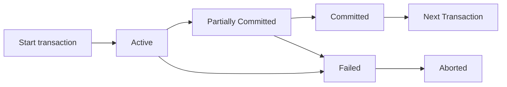

# 事务的概念 (Transaction)
 
对于一个数据库管理系统 (DBMS)，必须解决两个主要问题：
1. **并发执行 (Concurrent executions)**：多用户或多程序的并发执行。
2. **各种故障 (Failures of various kinds)**：例如系统崩溃、硬件故障等。

## 并发操作引发的问题（例如：丢失修改数据）
在没有控制的多用户并发操作下，会产生数据错误。例如两个人同时售票的情景：
* **t1**: 事务1（售票员甲）读取 A = 16
* **t2**: 事务2（售票员乙）同样读取 A = 16
* **t3**: 事务1执行更新（卖出3张票），计算 `A <- A - 3`，将 A = 13 写入数据库。
* **t4**: 事务2执行更新（卖出1张票），基于其之前读到的A=16进行计算 `A <- A - 1`，将 A = 15 写入数据库。
**结果**：最终数据库中 A 的值变为了 15，事务1的修改被覆盖丢失了。这就是典型的**并发操作丢失修改数据**问题。

## 事务的引入 (Transaction)
为了在程序并发执行时，保持数据的 **正确性 (correctness)**、**一致性 (consistency)** 和 **完整性 (integrity)**，Jim Gray（吉姆·格雷）提出了**事务**的概念。

* **定义**：事务是程序执行的一个单元，它访问并可能更新各种数据项。
* **组成**：通常一个事务由**多个 SQL 语句**组成，并且以 **commit（提交）** 或 **rollback（回滚）** 语句作为结束。
* **一致性原则**：
  * 一个事务**必须是在一个一致的数据库状态上执行**的（必须看到一致的数据库）。
  * 在事务**执行期间**，数据库可能会暂时处于**不一致**的状态；但是当事务**提交 (committed) **后，数据库**必须恢复到一致的**状态。 
  
# 事务的特性

这几页是数据库系统里关于**事务（Transaction）核心特性ACID**的讲解，用「银行转账」这个经典场景，把抽象的数据库概念具象化了，我们拆开来一步步说清楚：

---
### 一、先搞懂：什么是「事务」？
事务是数据库里的**不可分割的工作单元**，比如“从账户A转50美元到账户B”就是一个事务，它包含了“扣A的钱、加B的钱”等一系列操作。数据库必须保证这个单元的执行是可靠的，因此提出了ACID四大要求。

---
### 二、ACID四大特性，结合转账例子讲明白
#### 1. 原子性（Atomicity）：要么全成，要么全败
- **定义**：事务里的所有操作，**要么全部成功提交到数据库，要么全部撤销，不存在“做了一半”的情况**。
- **转账例子**：如果转账时，扣了A的钱之后系统突然崩溃，B的钱还没加上。原子性会保证：扣A的钱这个操作也会被撤销，数据库回到转账前的状态，不会出现“钱凭空消失”的情况。
- **解决的问题**：避免系统故障导致的“部分事务执行”，防止数据被破坏。

#### 2. 一致性（Consistency）：事务前后，业务规则不能被破坏
- **定义**：事务执行前后，数据库必须满足所有「完整性约束」（也就是业务规则），从一个一致状态变成另一个一致状态。
- **转账例子**：转账前A+B的总余额是200，转账后必须还是200，不能变。哪怕中间过程里（扣了A没加B）总和暂时不对，事务完成后也必须恢复正确。
- **补充**：一致性约束分两种：
  - 显式约束：数据库自带的规则，比如主键不能重复、外键必须存在。
  - 隐式约束：业务自己的规则，比如银行所有账户的总余额必须等于库存现金。
- **解决的问题**：避免事务执行导致数据库违反业务规则，出现逻辑错误（比如钱凭空多了/少了）。

#### 3. 隔离性（Isolation）：并发事务，互相看不到对方的中间状态
- **定义**：多个事务同时运行时，每个事务都感觉不到其他事务在执行，中间修改对其他事务是隐藏的。对任意两个事务T1和T2来说，就好像T1要么在T2开始前就结束了，要么在T2结束后才开始，不会互相干扰。
- **转账例子**：如果T1在扣了A的钱、还没加B的钱时，T2来读取A和B的余额，隔离性会保证T2看不到这个中间状态，只能看到转账前或转账后的完整数据，不会读到“总和少了50”的错误结果。
- **补充**：最粗暴的隔离方法是让事务串行执行（一个接一个跑），但这样性能太差，数据库会用锁、MVCC等方式在保证隔离性的同时支持并发。
- **解决的问题**：避免并发事务互相干扰，导致读到错误数据（比如脏读、不可重复读）。

#### 4. 持久性（Durability）：事务提交后，修改永远不会丢
- **定义**：事务成功提交（比如用户收到“转账成功”通知）后，它对数据库的修改就永久生效了，就算之后系统崩溃、断电，数据也不会丢失。
- **转账例子**：转账成功后，就算银行服务器立刻宕机，重启后A的余额减少、B的余额增加的记录也必须还在，不能变回转账前的状态。
- **解决的问题**：保证事务提交的结果不会因为系统故障丢失，让用户对数据可靠性有信心。

---
### 三、这几页的核心逻辑
用「转账」这个贴近生活的例子，把ACID四个抽象概念具象化了：
- 原子性解决「故障导致的部分执行」问题
- 一致性解决「业务规则被破坏」问题
- 隔离性解决「并发事务互相干扰」问题
- 持久性解决「提交后数据丢失」问题

这四个特性合在一起，就是数据库能保证数据安全、可靠的基础，也是银行、电商等关键业务必须依赖数据库的原因。

# 一种基础实现方案——影子数据库（Shadow Database）

这几页是数据库事务部分的进阶内容，核心讲两件事：**事务的完整生命周期状态流转**，以及**原子性和持久性的一种基础实现方案——影子数据库（Shadow Database）**，我帮你拆解得明明白白👇

---

## 一、事务的生命周期：状态流转
这部分讲的是一个事务从“开始”到“结束”，会经历的所有状态，以及状态之间的转换逻辑，直接对应ACID里的**原子性和持久性**。

### 1. 五个核心状态
| 状态 | 含义 | 关键细节 |
| :--- | :--- | :--- |
| **Active（活跃）** | 事务正在执行，初始状态 | 比如转账事务正在执行`read(A)`、`A:=A-50`这些步骤，都处于这个状态 |
| **Partially Committed（部分提交）** | 事务的所有语句都执行完了，但修改还只在内存Buffer里，没刷到磁盘 | 比如转账的6步都执行完了，但A扣钱、B加钱的数据还在内存，没写到硬盘，这时候系统崩溃的话数据还是会丢 |
| **Failed（失败）** | 发现无法继续正常执行（比如报错、死锁、系统故障） | 从Active或Partially Committed都能进入这个状态 |
| **Aborted（中止）** | 事务被回滚，数据库恢复到事务开始前的状态 | 中止后有两个选择：<br>• 重启事务（如果是临时故障，比如死锁）<br>• 直接终止事务（如果是逻辑错误，比如账户不存在） |
| **Committed（提交）** | 事务成功完成，修改已经持久化到磁盘 | 一旦进入这个状态，修改就永久生效，对应持久性 |

### 2. 状态流转逻辑（结合流程图）

- 正常流程：`Active → Partially Committed → Committed`，事务成功结束。
- 异常流程：中途出问题就进入`Failed`，然后回滚到`Aborted`，保证数据库回到事务前的状态，实现原子性。

---

## 二、原子性与持久性的实现：影子数据库方案
这部分讲的是一种**最简单但不实用**的实现方案，核心思想是“修改不碰原数据，用副本保证安全”，帮你理解原子性和持久性的底层逻辑。

### 1. 核心原理
用一个叫`db_pointer`的指针，**永远指向当前数据库的“一致副本”（影子拷贝，也就是没被修改的旧版本）**。
- 所有事务的修改，都在**新创建的数据库副本**上做，完全不碰旧的影子拷贝。
- 事务的成败，只影响这个新副本，不会破坏原数据。

### 2. 完整流程（结合三张图）
1.  **Before update（更新前）**
    `db_pointer`指向旧的数据库副本（old copy），这是当前的一致状态，数据安全可靠。

2.  **Updating（更新中）**
    事务执行时，创建一个新的数据库副本（new copy），所有修改都写在这个新副本上，旧的影子拷贝完全不动，`db_pointer`也还是指向旧副本。
    - 这时候如果事务失败：直接删掉新副本就行，旧的没被碰过，数据库还是一致的，实现**原子性**。

3.  **After update（更新后）**
    事务成功提交时，做两步操作：
    ① 把新副本的所有修改刷到磁盘（确保数据持久化）；
    ② **原子地修改`db_pointer`**，让它指向新副本，然后删除旧副本。
    - 因为`db_pointer`的修改是磁盘保证的原子操作（一次写入成功，不会写一半），所以一旦指针改了，新副本就是当前数据库了，就算之后系统崩溃，重启后指针也会指向新副本，数据不会丢，实现**持久性**。

### 3. 优缺点与局限
- ✅ 优点：实现极其简单，完美保证原子性和持久性，和文本编辑器“另存为”的逻辑一模一样（修改临时文件，保存后替换原文件）。
- ❌ 缺点：效率极低！每次事务都要复制整个数据库，大数据库根本没法用，所以实际数据库不会用这个方案。
- 后续优化：实际数据库会用更高效的方法，比如日志（WAL）、回滚段（比如Oracle的Rollback Segment），后面章节会讲。

---

## 三、这几页的核心逻辑总结
1.  事务状态流转，定义了事务从开始到结束的所有可能状态，以及异常情况下如何回滚，从流程上保证原子性。
2.  影子数据库方案，用“副本+指针”的思路，演示了如何通过不修改原数据，来实现原子性（失败就删副本）和持久性（提交后切换指针），虽然不实用，但帮你理解了核心思想：**原数据必须是安全的，修改只能在“临时空间”做**。

# 并发与调度

这几页讲的是**数据库事务的并发执行与调度（Schedule）**，核心是解决「如何在保证隔离性（数据一致性）的前提下，让多个事务高效并发运行」的问题，我帮你拆解得明明白白👇

---

## 一、为什么要让事务并发执行？（Concurrent Executions）
数据库允许多个事务同时运行，不是为了搞复杂，而是为了**效率**，有两个关键好处：
1.  **提升硬件利用率和吞吐量**
    比如一个事务在等待磁盘读写时，CPU是空闲的，这时候可以让另一个事务用CPU计算，避免硬件“摸鱼”，单位时间内能处理更多事务。
2.  **降低平均响应时间**
    如果事务是串行执行，短事务要等前面的长事务跑完才能执行，响应会很慢；并发执行的话，短事务可以插空执行，更快完成。

但并发也带来了致命问题：**哪怕每个事务本身逻辑是正确的，并发交错执行也可能破坏数据一致性**（比如转账例子里A+B的总和被改乱、电商超卖问题）。
所以DBMS必须有**并发控制机制**，来规范并发事务的交互，保证隔离性和一致性，这就是后面要讲的重点（可串行化、可恢复性等）。

---

## 二、什么是「调度（Schedule）」？
CPU同一时间只能执行一条指令，所以多个并发事务的指令，必须按某种顺序交错执行，这个**指令执行的时间顺序**，就叫**调度（Schedule）**。

调度必须遵守两个铁则：
1.  必须包含所有事务的所有指令，不能丢步骤；
2.  必须保持每个事务内部的指令顺序，比如T1里`read(A)`必须在`write(A)`前面，不能颠倒（不然事务本身就错了）。

举了两个转账事务的例子：
- T1：从A转50到B（A减50，B加50）
- T2：从A转10%到B（A减10%，B加10%）
初始状态：`A=1000，B=2000`，一致性约束：转账前后`A+B=3000`不变。

---

## 三、串行调度：安全但低效
最简单的调度方式是**串行调度**：事务一个接一个跑，完全不交错，比如先跑完T1再跑T2，或者先跑完T2再跑T1。

例子里的两个串行调度：
- **Schedule 1（先T1后T2）**：
  T1先把A减50到950，B加50到2050；然后T2读A=950，减10%（95）到855，B加95到2145，总和还是3000，保持了一致性。
- **Schedule 2（先T2后T1）**：
  T2先把A减100（10%）到900，B加100到2100；然后T1读A=900减50到850，B加50到2150，总和还是3000，也保持了一致性。

串行调度的特点：
- ✅ 优点：**100%保证一致性**，因为事务之间完全不干扰；
- ❌ 缺点：效率极低，完全浪费了并发的优势，而且N个事务有`N!`种串行方式，没法大规模应用。

---

## 四、并发调度：高效但可能出错
并发调度就是事务的指令交错执行，既可以利用并发效率，也可能因为交错方式不对破坏一致性，例子里有两种典型情况：

### 1. 好的并发调度（Schedule 3）：保持了一致性
指令交错顺序：
1.  T1执行`read(A)`、`A:=A-50`、`write(A)` → A变成950
2.  T2执行`read(A)`、`temp:=A*0.1`、`A:=A-temp`、`write(A)` → A变成855
3.  T1执行`read(B)`、`B:=B+50`、`write(B)` → B变成2050
4.  T2执行`read(B)`、`B:=B+temp`、`write(B)` → B变成2145

最终`A=855，B=2145`，`A+B=3000`，和串行调度的结果完全一样，保持了一致性。

### 2. 坏的并发调度（Schedule 4）：破坏了一致性
指令交错顺序：
1.  T1执行`read(A)`、`A:=A-50`、`write(A)` → A变成950
2.  T2执行`read(A)`、`temp:=A*0.1`、`A:=A-temp`、`write(A)` → 这里T2读到了**初始的A=1000**，算出来temp=100，A变成900，直接覆盖了T1的修改！
3.  T1执行`read(B)`、`B:=B+50`、`write(B)` → B变成2050
4.  T2执行`read(B)`、`B:=B+temp`、`write(B)` → 这里T2读的B还是初始的2000，加100到2100

最终`A=950，B=2100`，`A+B=3050`，总和被改乱，一致性被彻底破坏了！

---

## 五、这几页的核心问题
你会发现：不是所有并发调度都是好的，只有一部分并发调度能像串行调度一样保证一致性，同时又比串行调度高效。

所以接下来的重点就是：
- 怎么判断一个并发调度是“正确的”（和某个串行调度等价，也就是**可串行化调度**）？
- 怎么设计并发控制机制，自动生成正确的调度，避免出现Schedule 4这种错误？

这就是后面要讲的可串行化、冲突可串行化，以及锁、时间戳这些并发控制方案的内容了。

# 可串行化

这几页讲的是**并发调度的“正确性”判断标准——可串行化（Serializability）**，尤其是数据库里最常用的「冲突可串行化（Conflict Serializability）」，帮你彻底搞懂怎么判断一个并发调度是安全的👇

---

## 一、核心目标：怎么判断并发调度是“安全的”？
我们知道，**串行调度（事务一个接一个跑）一定是安全的**，因为每个事务跑完数据都是一致的，不会互相干扰。
但并发调度为了效率，会让事务的指令交错执行，那怎么判断它有没有破坏数据一致性？

答案就是：**如果一个并发调度，能和某个串行调度“等价”，那它就是安全的**。这就是「可串行化」的核心思想。

---

## 二、基础简化：先把问题变简单
为了方便分析，我们先给事务做个简化模型：
- 只关注事务里的`read(Q)`（读数据项Q）和`write(Q)`（写数据项Q）操作；
- 中间的计算（比如`A:=A-50`）不用管，因为这些操作只在事务自己的本地内存里做，不会影响其他事务；
- 最终分析的调度，只包含所有事务的`read`和`write`指令，且保持每个事务内部的指令顺序不变。

这个简化模型是后面所有分析的基础。

---

## 三、关键概念：什么是「冲突操作」？
两个来自不同事务的操作`I_i`（来自`T_i`）和`I_j`（来自`T_j`），如果满足以下条件，就叫**冲突操作**：
1. 它们访问同一个数据项`Q`；
2. 至少有一个操作是`write(Q)`。

我们分四种情况看：
| 操作组合 | 是否冲突 | 原因 |
| :--- | :--- | :--- |
| `read(Q)` 和 `read(Q)` | ❌ 不冲突 | 两个都是读，谁先谁后，读到的结果都一样 |
| `read(Q)` 和 `write(Q)` | ✅ 冲突 | 先读后写，读到的是旧值；先写后读，读到的是新值，顺序不同结果不同 |
| `write(Q)` 和 `read(Q)` | ✅ 冲突 | 和上面一样，顺序不同结果不同 |
| `write(Q)` 和 `write(Q)` | ✅ 冲突 | 最后写的那个会覆盖前面的，顺序不同，最终Q的值不一样 |

**核心结论**：
- 冲突操作的执行顺序**不能交换**，换了结果就变；
- 不冲突操作的执行顺序**可以交换**，换了也不影响最终结果。

---

## 四、核心方法：冲突可串行化
### 1. 什么是「冲突等价」？
如果一个调度`S`，通过**一系列交换不冲突操作的顺序**，能变成另一个调度`S'`，那`S`和`S'`就是**冲突等价**的。

### 2. 什么是「冲突可串行化」？
如果一个调度`S`，通过交换不冲突操作的顺序，能变成一个**串行调度**，那`S`就是**冲突可串行化的**。

冲突可串行化的调度，和某个串行调度结果完全一样，所以一定是安全的（能保证数据一致性）。

---

## 五、正反例子：一看就懂
### 例子1：Schedule 3（冲突可串行化，安全）
之前的转账例子里，Schedule 3是并发调度：
```
T1: read(A) → write(A) → read(B) → write(B)
T2:           read(A) → write(A) → read(B) → write(B)
```
我们可以交换`T1`的`read(B)/write(B)`和`T2`的`read(A)/write(A)`（这两组操作不冲突，因为`B`和`A`是不同数据项），最终把Schedule 3变成先`T1`后`T2`的串行调度：
```
T1: read(A) → write(A) → read(B) → write(B)
T2:                                 read(A) → write(A) → read(B) → write(B)
```
所以Schedule 3是**冲突可串行化的**，和串行调度结果一致，是安全的。

### 例子2：不可串行化的调度（不安全）
看下面这个调度：
```
T3: read(Q) →           write(Q)
T4:           write(Q)
```
这里：
- `T3`的`read(Q)`和`T4`的`write(Q)`冲突，顺序不能换；
- `T4`的`write(Q)`和`T3`的`write(Q)`也冲突，顺序不能换。

不管怎么交换，都没法把它变成`<T3,T4>`或`<T4,T3>`的串行调度，所以它**不是冲突可串行化的**，会破坏数据一致性。

---

## 六、补充：冲突可串行化的意义
- 它是**可串行化的充分条件**：所有冲突可串行化的调度，都是可串行化的（安全的）；
- 它不是必要条件：有些可串行化的调度，不是冲突可串行化的（后面会讲「视图可串行化」，但实际用得少）；
- 实际数据库里的锁机制（比如两阶段锁），就是通过控制冲突操作的顺序，来保证调度是冲突可串行化的，从而在并发的同时保证数据安全。

# SQL事务

这几页内容分为两个核心部分：**SQL 中的事务定义**，以及**冲突可串行化的测试方法（优先图/拓扑排序）**，我们一步步拆解👇

---

## 一、SQL 中的事务定义（第一页）
这部分讲的是 SQL 标准里，事务的启动、结束和提交规则，是数据库事务的基础语法约定：

### 1. 事务的隐式启动
SQL 里的事务是**隐式启动**的：不需要写专门的 `BEGIN TRANSACTION` 语句，当你执行第一条 SQL 语句（比如 `INSERT`/`UPDATE`/`DELETE`）时，数据库就会自动开启一个新事务。

### 2. 事务的两种结束方式
事务的结束只能通过以下两种操作：
- `COMMIT WORK`：提交当前事务，把所有修改持久化到数据库，同时开启一个新事务。
- `ROLLBACK WORK`：回滚当前事务，撤销所有未提交的修改，事务中止，数据库恢复到事务开始前的状态。

### 3. 自动提交（Auto-Commit）模式
几乎所有数据库（MySQL、PostgreSQL、JDBC 等）默认都是**自动提交模式**：
- 每条 SQL 语句执行成功后，会自动执行 `COMMIT`，相当于“每条语句都是一个独立的事务”。
- 可以关闭自动提交（比如 JDBC 里的 `connection.setAutoCommit(false)`），这样多条语句会被包含在同一个事务里，需要手动执行 `COMMIT`/`ROLLBACK` 来结束事务。

---

## 二、冲突可串行化的测试方法（后面几页）
这部分讲的是**怎么判断一个并发调度是不是冲突可串行化的**，核心工具是「优先图（Precedence Graph，也叫前趋图/冲突图）」和「拓扑排序」。

### 1. 优先图的定义
优先图是一个**有向图**，用来表示事务之间的冲突依赖关系：
- **顶点**：每个顶点代表一个事务（比如 `T1`、`T2`、`T3`…）。
- **边**：如果事务 `Ti` 和 `Tj` 存在**冲突操作**（`read-write`/`write-read`/`write-write`），并且 `Ti` 先访问了冲突的数据项，就画一条从 `Ti` 指向 `Tj` 的有向边。
  （边可以标注冲突的数据项，方便追溯来源）

举个例子：
- 如果 `T1` 先执行 `read(Y)`，`T2` 后执行 `write(Y)`，两者冲突，所以画一条 `T1 → T2` 的边。
- 如果 `T2` 先执行 `write(Y)`，`T1` 后执行 `read(Y)`，两者冲突，所以画一条 `T2 → T1` 的边。

### 2. 核心结论：优先图与冲突可串行化的关系
一个调度是**冲突可串行化的，当且仅当它的优先图是无环的（acyclic）**：
- **有环 → 不是冲突可串行化**：比如 `T1→T2` 和 `T2→T1` 形成了环，说明事务之间的冲突顺序互相矛盾，没法排成一个合法的串行顺序，所以不是冲突可串行化的。
- **无环 → 是冲突可串行化**：可以通过拓扑排序得到一个线性的串行顺序，这个顺序就是和原调度等价的串行调度，因此是冲突可串行化的。

### 3. 具体测试步骤
1.  **构建优先图**：遍历调度中所有事务的操作，找出所有冲突操作，按“先操作的事务指向后操作的事务”画边。
2.  **检测环**：用环检测算法（比如 DFS）检查优先图是否有环，时间复杂度为 `O(n+e)`（`n` 是事务数，`e` 是边数）。
3.  **拓扑排序（可选）**：如果优先图无环，拓扑排序得到的线性顺序就是等价的串行调度，而且可能存在多个合法的拓扑顺序（比如多个事务之间没有冲突，顺序可以互换）。

### 4. 例子解析（最后一页）
PPT 里的调度例子：
| 事务 | 操作 |
| :--- | :--- |
| `T1` | `read(Y)`, `read(Z)`, `read(U)`, `write(U)` |
| `T2` | `read(X)`, `read(Y)`, `write(Y)` |
| `T3` | `write(Z)` |
| `T4` | `read(Y)`, `write(Y)`, `read(Z)`, `write(Z)` |
| `T5` | `read(V)`, `read(W)`, `read(W)` |

- 冲突分析：
  - `T1` 先 `read(Y)`，`T2` 后 `write(Y)` → 冲突，画 `T1→T2`
  - `T1` 先 `read(Z)`，`T3` 后 `write(Z)` → 冲突，画 `T1→T3`
  - `T2` 先 `write(Y)`，`T4` 后 `read(Y)/write(Y)` → 冲突，画 `T2→T4`
  - `T3` 先 `write(Z)`，`T4` 后 `read(Z)/write(Z)` → 冲突，画 `T3→T4`
- 优先图是无环的，因此是冲突可串行化的，拓扑排序可以得到 `T1→T2→T4`、`T1→T3→T4` 等合法串行顺序。

---

## 补充：为什么优先图很重要？
- 它是判断**冲突可串行化的充分必要条件**，而且算法高效（线性时间复杂度）。
- 视图可串行化的测试是 NP 难的，无法高效实现，所以实际数据库里的并发控制，都是以冲突可串行化为目标，优先图是理论上的核心测试方法。

---

# 实际操作

这三页是事务并发控制的「落地篇」，把之前讲的**理论上的可串行化**，过渡到了**实际数据库里的实现与取舍**，核心讲三件事：

---

## 一、第一页：并发控制协议，是怎么保证可串行化的？
你之前学的「优先图+环检测」，是用来**事后判断一个调度是不是冲突可串行化**的方法，但实际数据库根本不会这么做！

### 1. 为什么不用优先图？
优先图检测有两个致命问题：
- **事后检测**：调度都跑完了才知道有没有问题，没法提前预防；
- **开销巨大**：事务并发执行时，维护优先图、检测环的成本极高，会严重拖慢性能。

### 2. 实际数据库怎么做？
数据库用**并发控制协议**，从根源上避免非可串行化的调度，比如后面要学的：
- 两阶段锁（2PL）
- 时间戳排序协议
- 多版本并发控制（MVCC）

这些协议的核心是：**给事务的操作加上一套“纪律”，让它们只能按可串行化的方式执行**，不用事后检测。

### 3. 协议的权衡
不同的协议，在「并发度」和「实现开销」之间做了不同的取舍：
- 比如严格两阶段锁，实现简单、开销低，但并发度差；
- 比如MVCC，并发度高，但实现复杂、维护多版本有开销。

而我们学的可串行化测试，主要作用是**验证这些协议的正确性**（比如证明两阶段锁能保证冲突可串行化），而不是在运行时使用。

---

## 二、第二页：弱一致性——不是所有业务都需要“完美可串行化”
之前我们说“无法串行化的调度一定有问题”，但这句话有个前提：**业务需要强一致性**。
如果业务能接受“近似准确”，就可以牺牲一点一致性，换更高的性能，这就是「弱一致性级别」。

### 典型场景
1.  **只读统计事务**：比如统计银行所有账户的总余额，只要大概的数就行，不需要精确到每一分，哪怕读到中间状态也没关系；
2.  **查询优化统计信息**：数据库为了优化SQL执行计划，收集的表行数、索引基数等统计数据，不需要绝对准确，近似值就够用了。

### 核心逻辑：**用一致性换性能**
允许调度不是可串行化的，减少事务之间的阻塞和等待，大幅提升并发度和吞吐量，适合对数据一致性要求不高的场景。

---

## 三、第三页：SQL-92标准的四个隔离级别
为了统一“一致性强度”的定义，SQL-92标准定义了四个隔离级别，从强到弱，对应不同的一致性要求和性能表现：

| 隔离级别 | 一致性强度 | 允许的异常 | 核心特点 | 常见数据库默认 |
| :--- | :--- | :--- | :--- | :--- |
| **Serializable（可串行化）** | 最强 | 无 | 保证调度是可串行化的，不会出现任何一致性问题 | 几乎没有数据库默认用（开销太高） |
| **Repeatable Read（可重复读）** | 次强 | 幻读 | 只能读已提交数据，同一个记录多次读取结果一致，但不保证可串行化 | MySQL InnoDB 默认 |
| **Read Committed（读已提交）** | 中等 | 不可重复读、幻读 | 只能读已提交数据，但同一个记录多次读取可能得到不同结果 | Oracle、PostgreSQL、SQL Server 默认 |
| **Read Uncommitted（读未提交）** | 最弱 | 脏读、不可重复读、幻读 | 甚至可以读未提交的修改，一致性最差，性能最高 | 几乎不用 |

### 补充：实际数据库的扩展
很多数据库默认的隔离级别，不是SQL标准里的，比如：
- Oracle、PostgreSQL（9之前）默认是**快照隔离（Snapshot Isolation）**，这是MVCC实现的级别，比Repeatable Read一致性更强，但不是完全可串行化的，会出现一些特殊异常；
- 现在的PostgreSQL 9.1+的Serializable级别，是真正的可串行化实现，基于快照隔离做了增强。

---

## 整体逻辑串讲
1.  理论上，可串行化是数据安全的终极保障，但优先图检测不适合实际运行；
2.  实际数据库用并发控制协议（锁、MVCC）来保证可串行化，同时也支持弱一致性级别，给业务选择的空间；
3.  SQL-92的四个隔离级别，就是不同一致性强度的标准化定义，业务可以根据需求选择：核心业务（转账、订单）用强隔离，统计分析用弱隔离。

---
