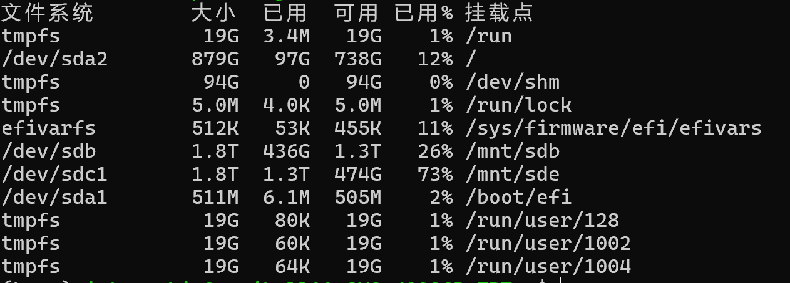

# 服务器的使用

!!! tip
    本文持续更新服务器使用方法与问题解决方案。服务器为 Linux 系统，内容也包含部分 Linux 教程。

---

## 一、连接服务器

1. 获取账号、密码、端口和 IP。
2. 使用 SSH 连接服务器：  
   `ssh -p 6666 internship@10.12.86.188`  
   - `-p 6666`：端口号  
   - `internship`：用户名  
   - `10.12.86.188`：服务器 IP
3. 输入密码。
4. **注意**：不要随意更改网络、断网或换网络，否则连接会断开。

---

## 二、服务器初步使用与勘察

### 1. 查看磁盘使用情况

- `df -h` 查看磁盘空间  
    
  找空间大的盘进行操作，注意**挂载点**才是实际操作目录。

- `du -sh *` 查看当前目录下所有文件夹大小。

- `ls -ld` 查看文件夹权限。没有写权限时联系管理员，或尝试前面加 `sudo`。

---

### 2. conda 的安装与使用

#### 安装 Miniconda

1. 下载：  
   `wget https://repo.anaconda.com/miniconda/Miniconda3-latest-Linux-x86_64.sh`
2. 安装：  
   `bash Miniconda3-latest-Linux-x86_64.sh`
3. 激活：  
   `source ~/miniconda3/bin/activate`

#### conda 常用命令

- 创建环境：  
  `conda create -n myenv python=3.7`  
  推荐：`conda create -p 路径 python=3.7`（环境和包都在指定路径下）
- 激活环境：  
  `conda activate 环境名` 或 `conda activate 路径`
- 安装包：  
  正常使用 `pip`，可配置镜像源加速。
- 查看所有环境：  
  `conda info --envs`

---

### 3. 查看显卡信息

- `nvidia-smi` 查看显卡使用情况。
- `watch -n 1 nvidia-smi` 实时刷新显卡状态（建议另开窗口操作）。

---

## 三、项目和模型下载（重要）

### 1. 项目下载

- 推荐用 `git clone https://github.com/username/project.git`  
  网络不佳时可：
  - 换镜像网站
  - 先下载到本地再用 `scp` 传到服务器

- `scp` 用法：  
  - 上传：`scp 本地路径 用户名@远程IP:服务器路径`
  - 下载：`scp 用户名@远程IP:服务器路径 本地路径`
  - 例：`scp -r ~/D:/edge download/ICEdit-main internship@10.12.86.88:/mnt/sdb/gxy`

### 2. 模型下载

- 通常用 huggingface 下载：  
  `pip install huggingface-hub`
- 若连接不上 huggingface，可：
  - 换国内镜像源（参考 [知乎教程](https://zhuanlan.zhihu.com/p/689290456)）
  - 用 `modelscope` 下载：  
    `modelscope download --model black-forest-labs/FLUX.1-Kontext-dev --local_dir /mnt/sdb/gxy/flux`
  - 支持断点续传

---

## 四、权限修改

- 修改文件夹所有者：  
  `sudo chown internship:internship /mnt/sdb/gxy`
- 修改权限：  
  `sudo chmod 775 /mnt/sdb/gxy`  
  赋予读写执行权限

---

## 五、vim 使用

- 编辑文件：`vim 路径/文件名`
- 常用命令：
  1. `i` 进入编辑模式
  2. `esc` 退出编辑模式
  3. `:w` 保存
  4. `:q` 退出（`:wq` 保存并退出）

---

## 六、常用命令

### 创建

- `mkdir` 创建文件夹
- `touch` 创建文件

### 删除

- `rm` 删除文件
- `rmdir` 删除文件夹

---

## 七、杂项

- `source ~/.bashrc` 让 `.bashrc` 配置立即生效
- `export PATH=$PATH:/usr/local/bin` 添加环境变量

---

## 八、常见问题

1. `scp ssh: Could not resolve hostname d: Temporary failure in name resolution`  
   - 解决：不要在服务器上用 scp 传输，直接在本机操作。

2. `Cannot copy out of meta tensor; no data! Please use torch.nn.Module.to_empty() instead of torch.nn.Module.to() when moving module from meta to a different device`  
   - 原因：显卡内存不足。
   - 解决：如需多卡并行，需在代码中设置 `CUDA_VISIBLE_DEVICES`，并调整。

---

### 使用多张显卡

1. 确认服务器有多张显卡。
2. 代码设置：  
   - 配置 `CUDA_VISIBLE_DEVICES`
   - 修改模型参数（如 `balance`），具体实现参考 AI。

---