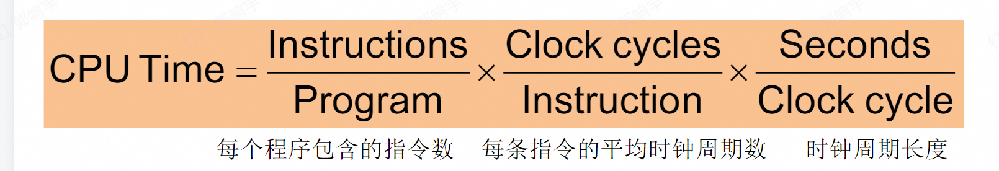
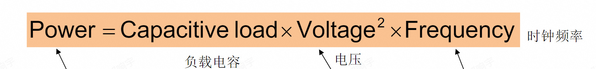
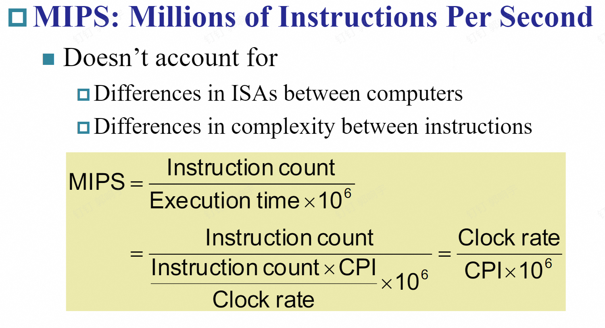

# 第一节课笔记

老师一开始讲的内容我没记下来，主要记了后面关于**CPU时间**的计算方法。

---

## 什么是 CPU Time？

CPU Time 指的是 CPU 执行所有指令所花费的总时间。

---

## 计算 CPU Time 需要哪些信息？

1. **Cycle 数量**
   需要多少个时钟周期（循环）

2. **Cycle Time**
   每个时钟周期需要多少时间

3. **每条指令需要多少 Cycle**
   不同指令可能需要不同的周期数

4. **指令总数**
   程序中一共执行了多少条指令

---

## 公式总结

\[
\text{CPU Time} = \text{Cycle 数量} \times \text{Cycle Time}
\]

或者进一步展开为：

\[
\text{CPU Time} = \text{指令总数} \times \text{每条指令平均需要的 Cycle} \times \text{Cycle Time}
\]

---

> **小结**：
> 只要知道时钟周期数、每周期时间、每条指令需要的周期数和指令总数，就能算出 CPU 执行程序的总时间。

## 功耗公式

## mips

