# 计算机算术（Arithmetic for Computers）

> 本节内容主要回顾了数值逻辑基础，并介绍了计算机算术相关的基本知识。

---

## 一、Introduction

1. **Computer Words**
   计算机中的“字”通常指 32 位（bit），也就是 4 个字节（byte）。

2. **Generic Implementation**
   - 使用程序计数器（PC）提供指令地址
   - 从内存中获取指令
   - 读取寄存器
   - 根据指令内容决定具体操作

---

## 二、Arithmetic

### 加减法

加减法补码哪些东西看数逻笔记

这里说一下溢出规则

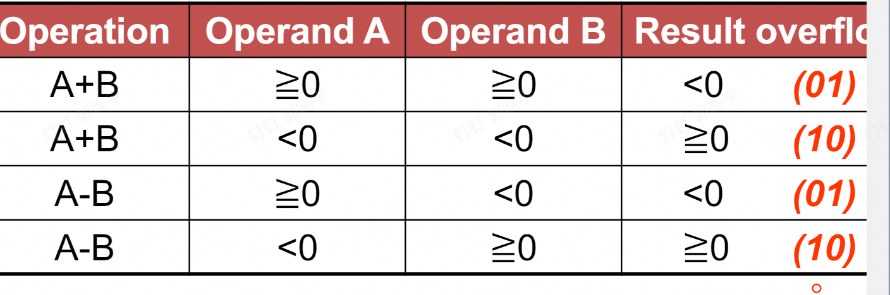

看这个表

还有另一种方式:看次高位和最高位的进位，如果异或是1就是溢出，反之就是没有。

如果overflow了，就会先终止->把指令存在EPC->跳转到异常处理程序->异常处理程序处理异常(可能会给个对的，或者输出错误码)

### ALU

alu之前也讲过了，就是一个大的运算器，可以实现与/或/加减

我们这里注意减用了一个全部取反+1的方法

之后通过多路选择器选择答案

之后这里再将一个comparison和overflow还有0detector

1. **Comparison**  ：比较两个数，判断大小关系。
   指令：set on less than (SLT rs rt rd) 就是：如果rs < rt，rd = 1，否则 rd = 0
   方法：用rs-rt相减 以减法之后的符号位作为rd
   信号: less(rd=less)

2. **overflow**  ：判断两个数相加是否溢出。
   我们这里只需要再加一个overflow的模块，他要的是加减判断位 AB最高位 最后的进位 以及结果的最高位(SET)

   注意：如果我们发现overflow，set就失去意义了，那之前的比较就不能用减法那个判断方法。也就不能把set赋值给less

3. **0 detector**  ：判断两个数是否相等。(就是把结果全或起来，qual=0)

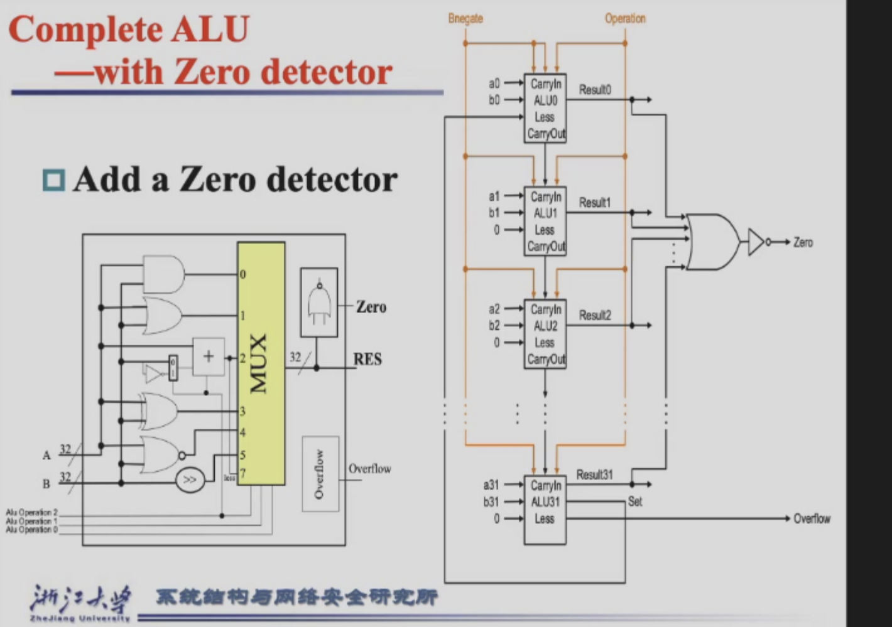

现在我们东西长这样

但是 这种级联的延迟太高了 是串行的

#### 优化

超前进位加法器(CLA)

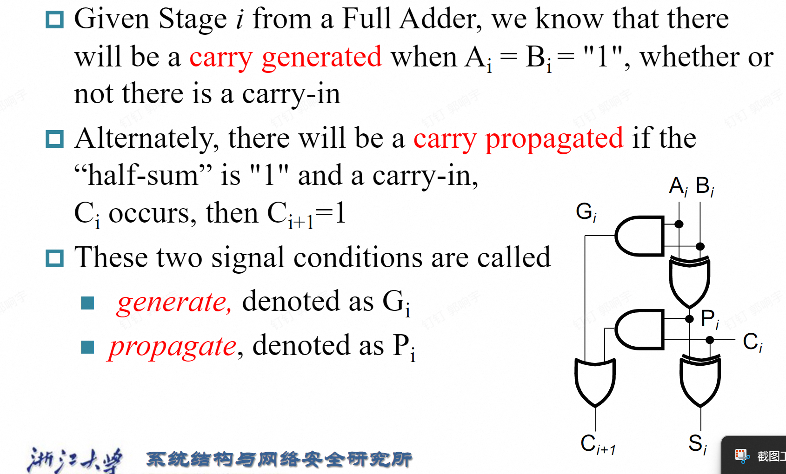

先看这个 我们知道如果这一位产生进位 两种可能 AB两个1(这种叫Gi) 或者A B 1 0 进位为1

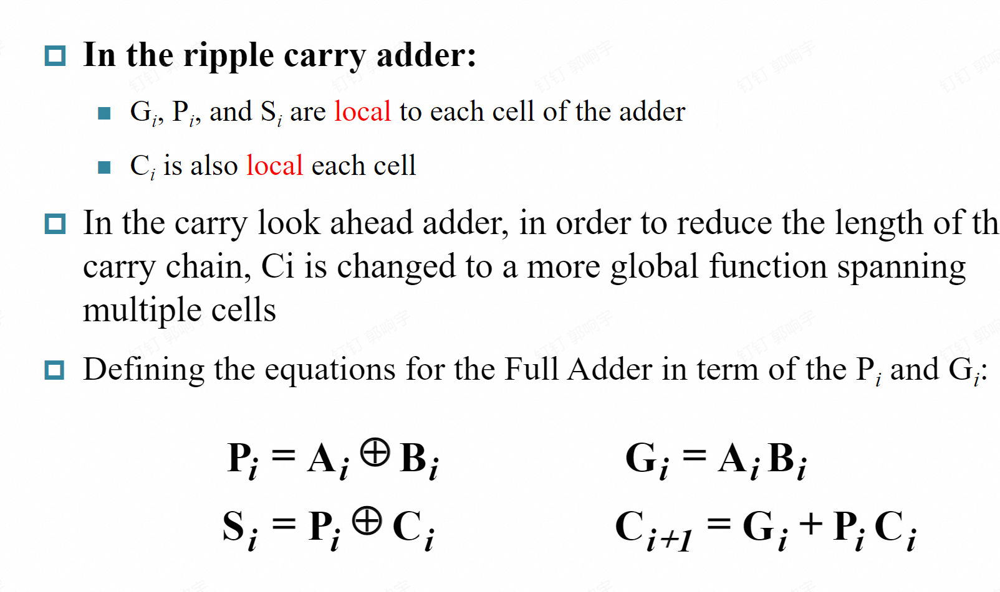

之后我们可以写出一个进位或者结果的新式子 其实没什么不同 现在问题就是**Ci**怎么来，我们不希望还是上一位过来

我们发现Ci不也是之前的计算出来的吗，那我们可以通过C0 和 Ai Bi（之前的A B）来计算Ci，只不过公式会长一点

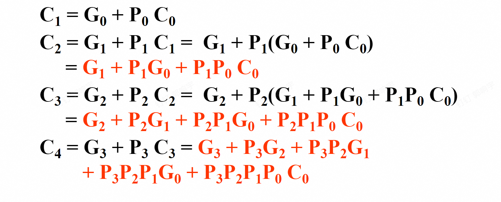

但是这样又有点多了（用的门，不敢想象如果是16位会有多少个）

所以我们可以把两个方法综合起来

分组 组内用CLA的方法提升效率，组间还是串联

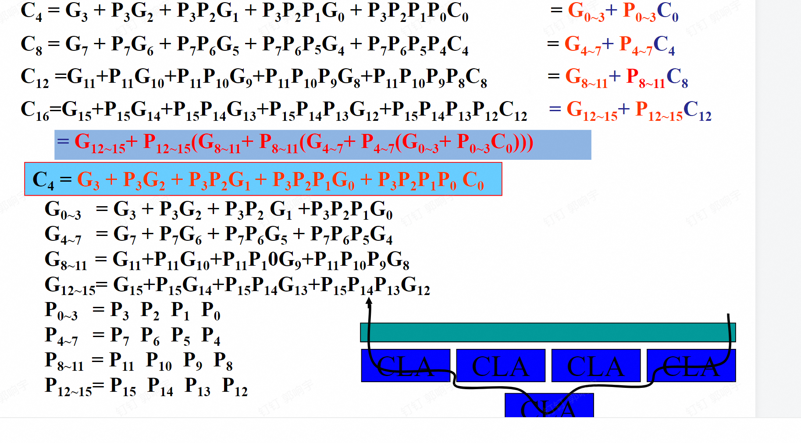

#### CSA

CSA(carry select adder)

我们还有一种解决办法，就是不就是不知道进位吗，我直接把进位是0/1都模拟出来不就好了，到时候看是哪个就用哪个。但是这样还是要分组，不然也实在开销有点高。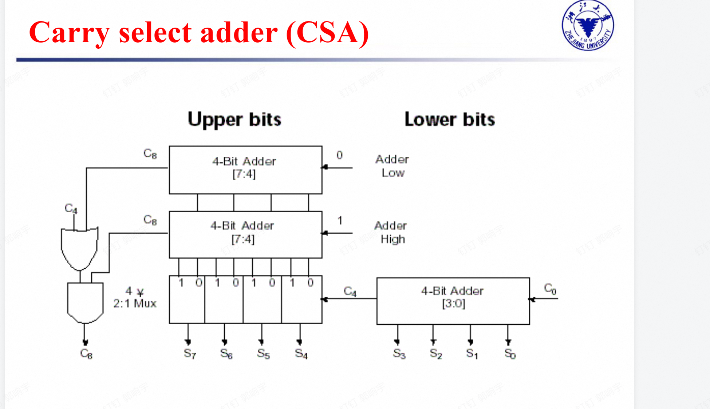

### 乘法

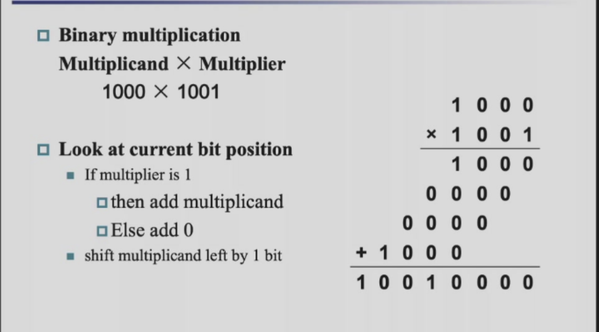

自己看这个 就是有1的地方 要移位 之后再都加起来

具体操作
1.把乘数不断右移，被乘数左移
2.把乘数最低位和被乘数进行异或（就是相乘），之后和原来的数值进行ALU相加
3.我们知道，你不断右移，就会有128位,因此就会需要ALU128位

问题：但这样有点烦，因为我们多花了64位，但其实每次需要改变的数位只有64位，而不是128位

#### 改进

我们现在不左移被乘数了，我们去右移乘积（**注意，此时乘积一开始是在高64位计算的**，这样就实现了每次只改变右移后的高64位，但注意，最后的乘积还是128位。

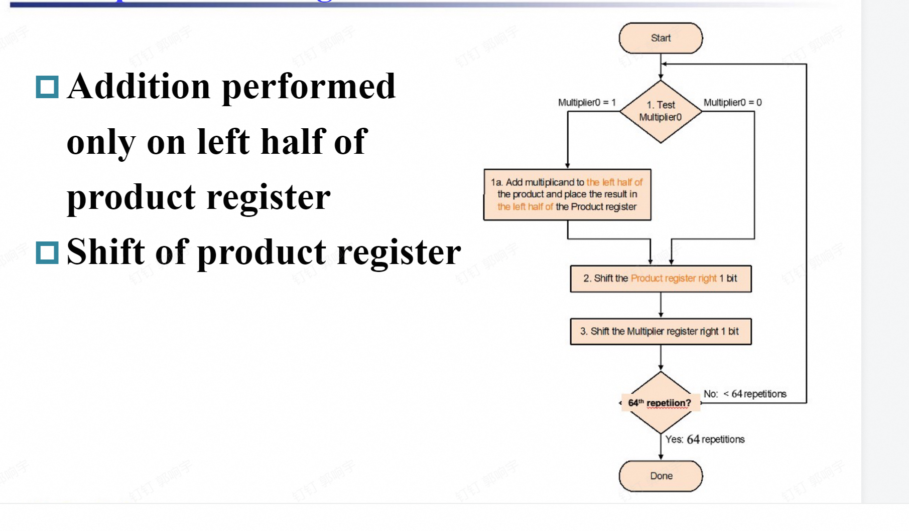

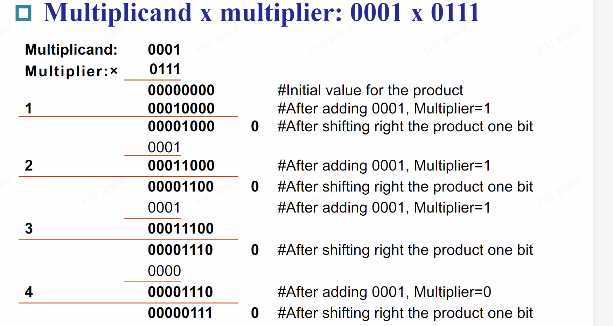

#### 再改进

现在还是不是特别好：我们乘积有64位一开始没用上耶，如果我们用这个去存乘数，是不是很不错的，这样不断右移还能把乘数逐渐取出，并且删掉。

### 有符号的乘法

其实基本方法就是存一下符号位，其他的正常操作，如果两个同号就补0 反之补1 注意要变成原码操作哦

有个booth算法，大概是让一堆11可以变成一个高位1减低位1，这样子可以用移位代替加减法。这个思维比较巧妙，具体看ppt吧

最后看一下指令集

- **`mul`**：执行乘法运算，返回乘积的**低64位**。
- **`mulh`**：假设操作数为**有符号数**，返回乘积的**高64位**。
- **`mulhu`**：假设操作数为**无符号数**，返回乘积的**高64位**。
- **`mulhsu`**：假设一个操作数为有符号、另一个为无符号，返回乘积的**高64位**。
- 此外，可利用`mulh`的结果，检查乘法是否发生**64位溢出**。

## 除法

### 概述

**除法（Division）的核心步骤与方法**，分为以下几个部分：

#### 1. 检查除数是否为0（Check for 0 divisor）

除法的前提是**除数不能为0**（因为“除以0”在数学中无定义），所以除法操作的第一步，通常需要先检查除数是否为0，若为0则需特殊处理（如触发异常）。

#### 2. 长除法思路（Long division approach）

这是借鉴“手算除法”的流程，逐位确定商的值，核心逻辑分两种情况：

- 若「除数 ≤ 被除数当前处理的位」：商的当前位记为 `1`，然后用被除数**减去除数**（继续后续步骤）；

- 若「除数 ＞ 被除数当前处理的位」：商的当前位记为 `0`，然后把被除数的**下一位“落下来”**（扩展被除数，继续比较）。

#### 3. 恢复除法（Restoring division）

这是硬件实现除法时的一种经典方法，解决“减法后余数为负”的问题：

- 先执行**减法操作**；
- 若减法后余数 `< 0`（即减法结果为负），则**把除数加回余数**（“恢复”余数到合法状态），同时商的对应位调整为 `0`。

#### 4. 有符号数除法（Signed division）

处理带符号的除法时，遵循“符号与数值分离处理”的思路：

- 先对**被除数和除数取绝对值**，按“无符号数”执行除法；
- 最后**根据原数的符号**，调整商和余数的符号（例如：被除数与除数异号 → 商为负；余数的符号通常与被除数一致）。

说白了，就是按照竖式除法的思路来

### 第一版

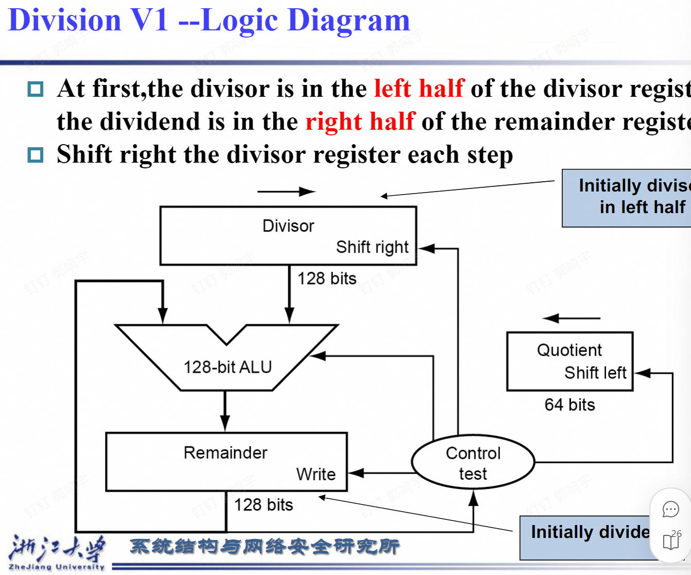

首先，我们把64位divisor和dividend都放在两个128位寄存器 **divisor**放在左半边 **dividend**放在右半边

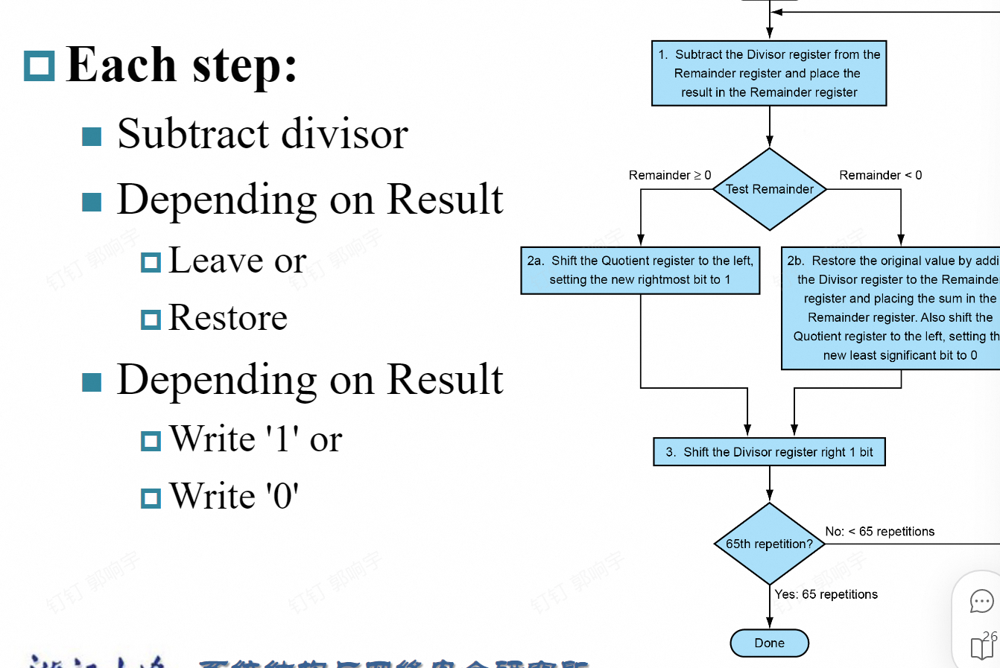

之后除法流程是这样的
1.除数减被除数
2.减完之后，如果结果小于0，那么商为0，被除数加上除数（加回去），如果大于0，那么商就是1
3.之后除数右移一位，商左移一位
4.重复1-3（65次）（最后被除数剩的就是余数）

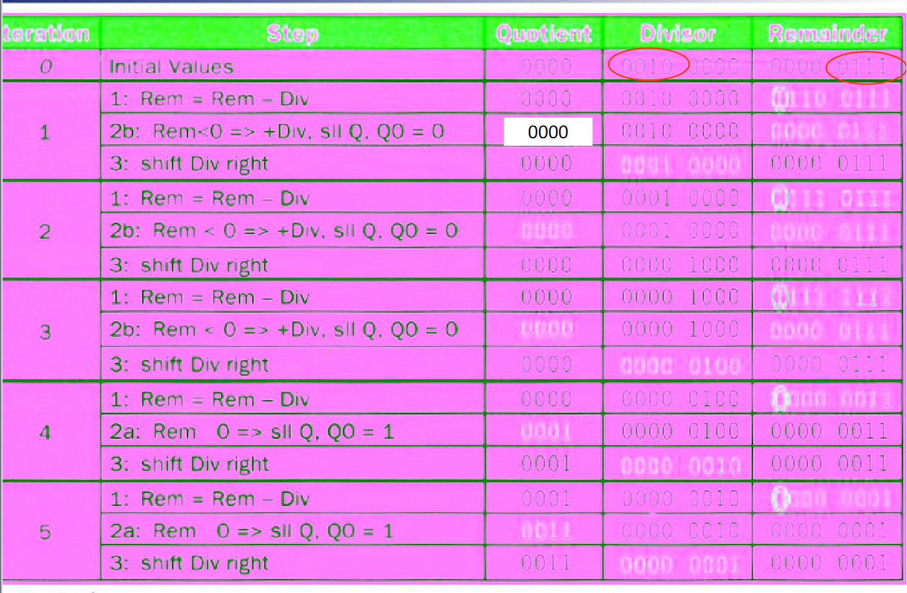

### 改进版本

我们如果觉得这样占用有点多，还有一个改进版本 我们不右移除数，而是左移被除数（注意除数仍对应左半边）

这样我们可以减少一个循环，同时不用单独存储商，每个循环还少一个流程。

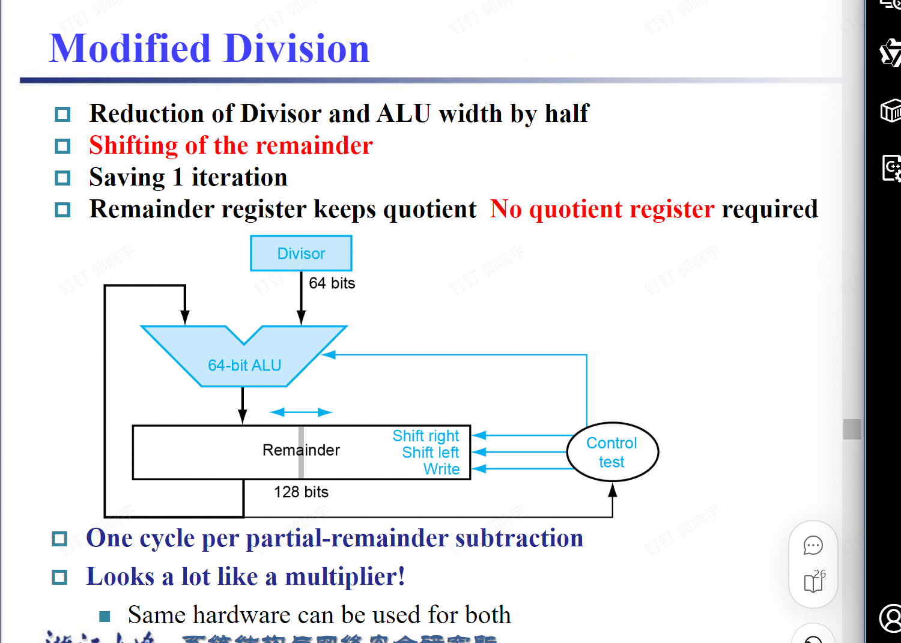

过程是这样的
1.相减
2.如果结果小于0，那么商为0，被除数加上除数（加回去），如果大于0，那么商就是1.
3.被除数（128位的左移一位，商写在被除数最低位
4.重复1-3（64次）（最后被除数左半部分**右移一位**剩的就是余数）

### 有符号

先不管符号，最后再加上

除法无法并行计算（因为要看上一个够不够减）

### 除法的命令

1.div, rem: signed divide, remainder
2.divu, remu: unsigned divide, remainder

## 小数

### 小数怎么表示

小数的表示就让我们想到科学计数法，我们可以把小数拆成1.xxxx 乘一个2的多少次方（注意因为是二进制，所以一定是1.xxxx）

### IEEE754

IEEE754 是一个标准，用于表示小数。

1. **符号位**：用于表示正数还是负数。
2. **指数位**：用于表示小数点位置。就是2的多少次方
3. **小数位**就是表示xxxx的数值
之后分为single precision 和 double precision

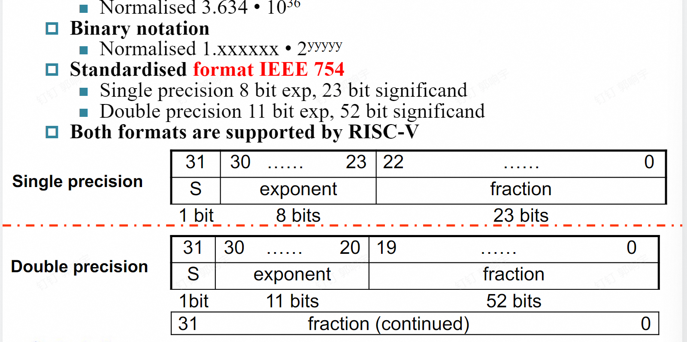

**注意** 这里的指数是有bias的 具体因为指数是0000..0-1111..1因此就是有Bias 127 for single precision
Bias 1023 for double precision

所以最后小数的表示就是！

**举例** 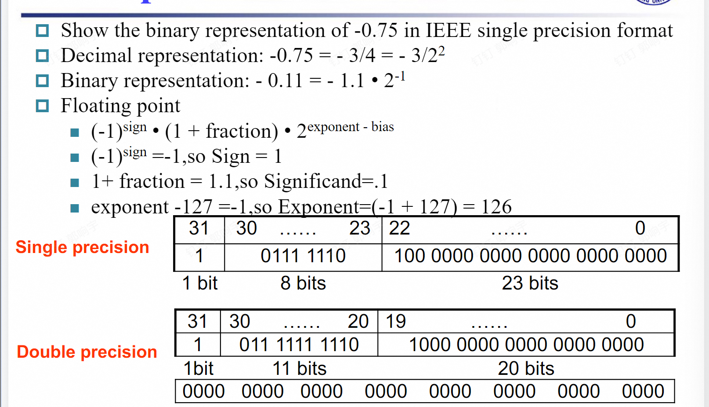

### 范围和误差

我们一般不用00000和1111作为指数，因此可以得到单精度和双精度的范围（见ppt）

相对误差也是很好计算的，自己看PPT吧

### Infinity和NaN

为什么之前说不用全0和全1
因为用来表示Infinity和NaN

1. Infinity 指数为1111...1，尾数是0
2. NaN 指数为1111...1，尾数不为0

### 小数运算

#### 加法

只需要把指数更小的不断右移动，直到指数相同，之后再相加就行了，最后再移动回来（注意判断越界）

#### 乘法运算

这个就用指数相乘就好了(s1 • 2e1 ) • (s2 • 2e2 ) = (s1 • s2) • 2e1+ e2。

但是注意一个事情，因为bias，所以你指数相加之后，还要减回一个127才是正确的指数。

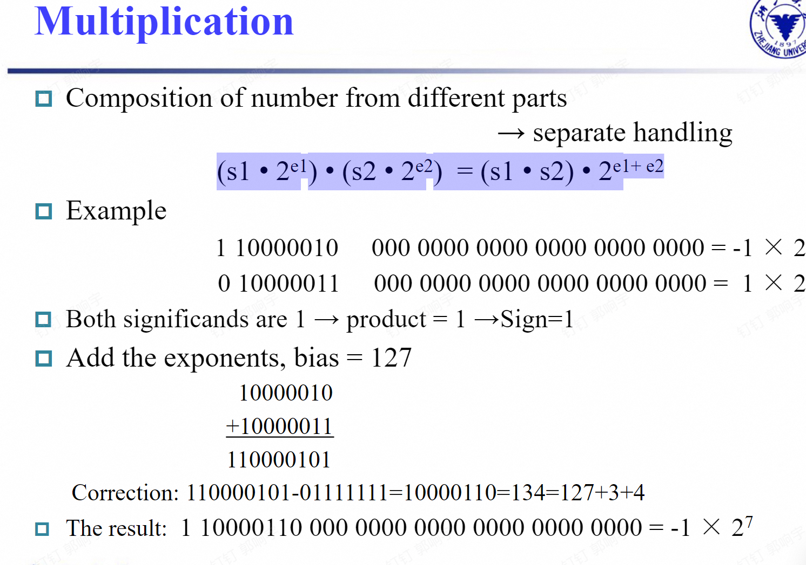

#### 除法运算

除法其实很像 指数相减 就可以了。significant相除

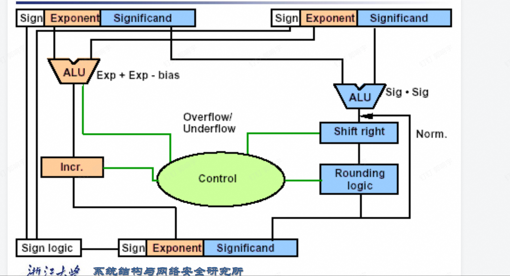

### 小数的精确计算

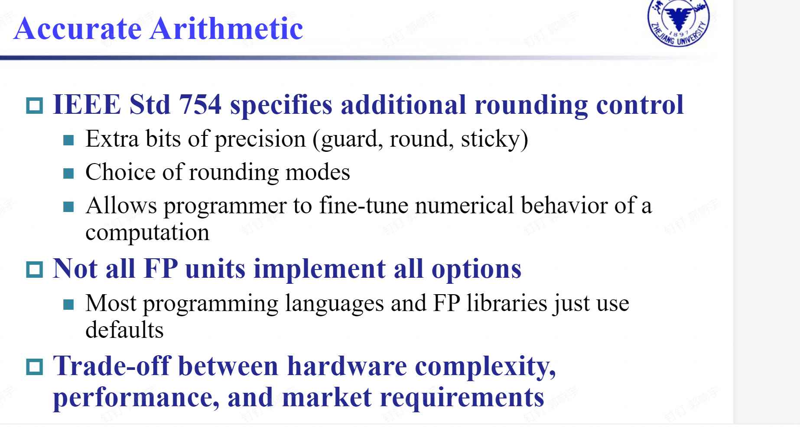

大概意思就是说小数运算的精度 比如只需要精度2位 那么我们看前两位 加guard位 round位就可以了(额外精度位)。这里其实解决的超出数位的溢出问题

还有舍入模式的计算

#### 1. Guard（保护位）示例  (用来保证运算正确性的)

当两个浮点数进行运算时，若指数不同需先"对阶"（使指数一致），此时阶数较小的数需要右移，超出有效位的部分会产生额外位，**Guard位是第一个额外位**，用于临时保存精度。

例如：
计算二进制浮点数 `1.010₂ × 2³`（即十进制 10）与 `1.101₂ × 2¹`（即十进制 6.5）的和：

- 对阶：将后者指数调整为3，需右移2位，得到 `0.01101₂ × 2³`
- 右移后超出原有效位的部分为 `01`，其中第一位额外位（`0`）就是**Guard位**，后续位用于计算Round和Sticky位。
- 相加后：`1.010₂ + 0.01101₂ = 1.10101₂`，Guard位帮助保留了中间精度，避免过早舍入导致误差。

#### 2. Round（舍入）示例  （用来帮助运算round结果怎么操作的）

当运算结果的有效位长度超过浮点格式允许的位数时，需通过**舍入**使结果符合格式。幻灯片中十进制例子可扩展为：

- 精确计算：`2.3400 + 0.0256 = 2.3656`（4位小数）
- 若限制为2位小数（如某些简化浮点格式），需舍入：
  - 按"四舍五入"规则，`2.3656` 舍入后为 `2.37`（第3位小数5及后续位导致进位）
  - 这就是Round的作用：通过规则调整结果，使其适配目标格式。

#### 3. Sticky（粘性位）示例

**Sticky位**用于记录右移过程中被丢弃的所有位中是否有1：若有，则Sticky位为1；否则为0，辅助舍入决策。

例如：
二进制数 `1.101101₂` 右移3位，移出的位是 `101`（包含1），则Sticky位为1；
若移出的位是 `000`，则Sticky位为0。
当舍入时，Sticky位为1会影响结果（如倾向进位），为0则可能直接截断。

### 4. ULP（最后一位单位）示例

ULP是"实际值"与"可表示值"在有效位最低位的误差度量。

例如：

- 十进制中，若浮点格式只能表示到2位小数，则 `2.34` 是可表示值，其最后一位是 `0.01`（即1个ULP = 0.01）。
- 若实际值是 `2.342`，则它与 `2.34` 的误差是 `0.002`，即 `0.2 × ULP`；
- 若实际值是 `2.35`，则与 `2.34` 的误差是 `1 × ULP`。

### 5. 舍入模式示例（IEEE 754的核心特性）

IEEE 754定义4种舍入模式，程序员可选择以调整数值行为：

- **向最近偶数舍入（默认）**：就是当判断；
- **向零舍入**：`2.5` → `2`，`-2.5` → `-2`；
- **向上舍入（正无穷）**：`2.1` → `3`，`-2.9` → `-2`；
- **向下舍入（负无穷）**：`2.9` → `2`，`-2.1` → `-3`。

这些机制共同作用，平衡了浮点运算的精度、硬件实现复杂度和性能，是IEEE 754标准保证"精确算术"的核心手段。
