# 指令：Language of the Machine

## 介绍

指令有指令集 我们这里讲的是RISC-V指令集 全称是Reduced Instruction Set Computer

设计目标是提高表现 降低消费 减少设计时间

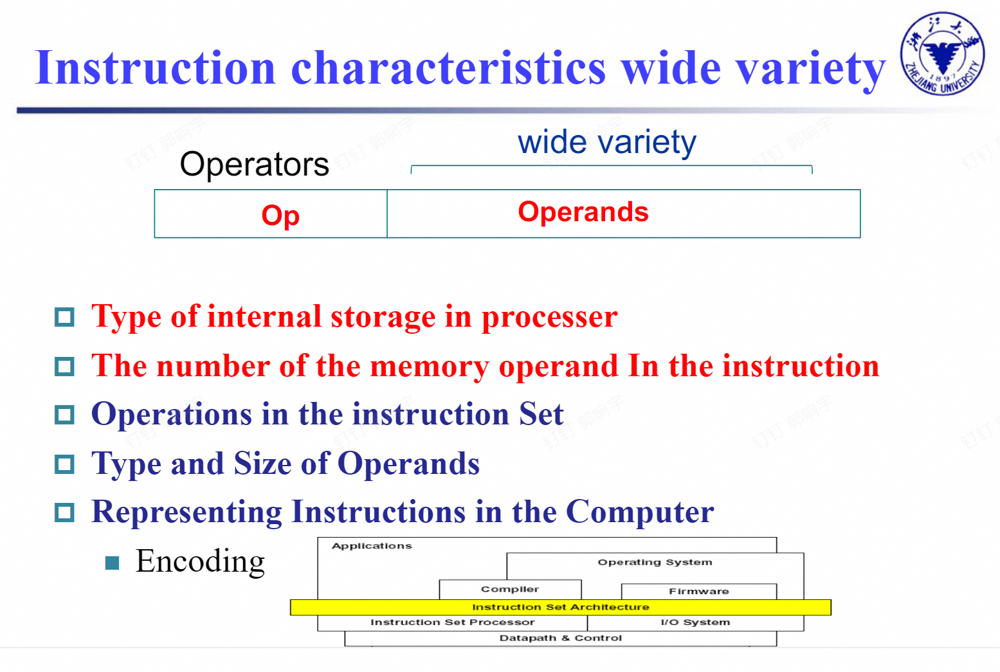

指令都是由操作符（add）还有操作数（a b c）组成

影响指令特性的关键因素有以上五条

## 计算机硬件的操作

### stored program concept

所有的东西存下来都是以数字形式的（01）

### 原则

1.一个指令只能有一个操作（只能加 或者 只能减）
2.只能有三个变量（操作数）

**design principle1** simplicity favors regularity

## 计算机硬件的操作数

### 运算命令符都用寄存器

运算指令是用寄存器作为（存储）操作数

RISV-C用32个*64位的寄存器(64位叫做doubleword)

寄存器是用来存频繁访问的数据

注意了 register是寄存器 memory是内存 二者概念不同 内存是用地址对应数据 一个地址对应8位。

命令也会有地址（命令是32位，所以一个命令占四个地址） 寄存器也可以存地址

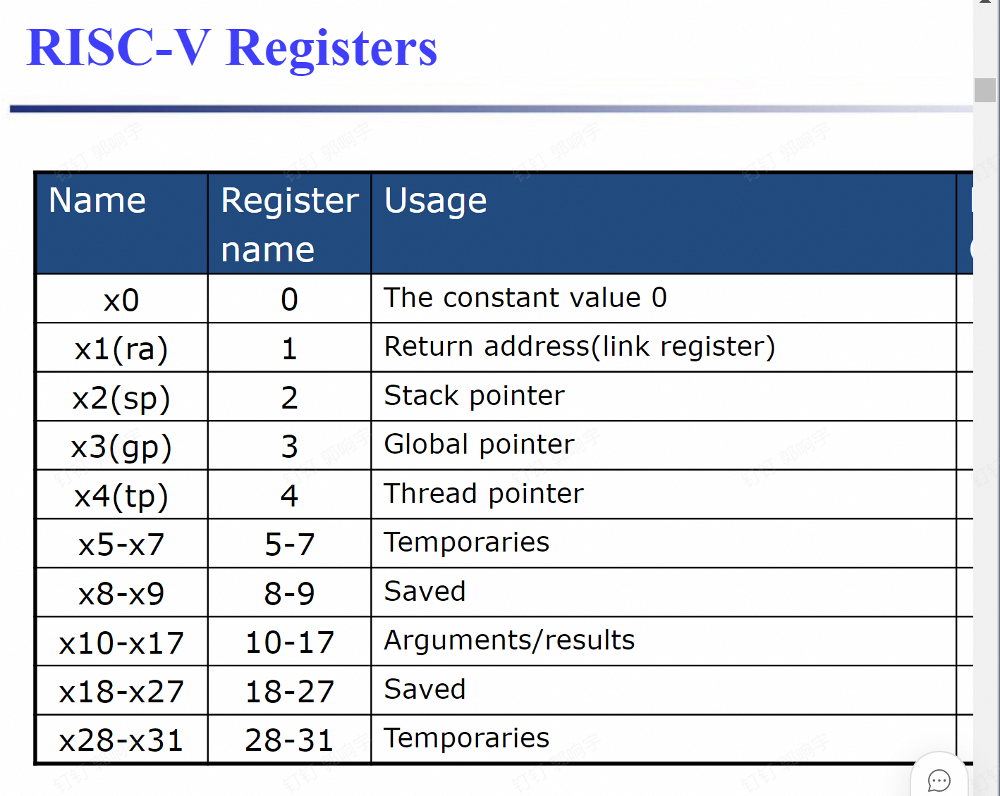

这是32个寄存器

有个基本的例子见ppt

大概就是 add x1 x2 x3的意思是把 x2 x3 加起来写到 x1中

### 内存命令符

#### 1. 内存用于存储复合数据

主内存（Main Memory）适合存放**“复合数据”**，比如：

- 数组（Arrays）：多个相同类型元素的集合（如`int arr[100]`）；
- 结构体（Structures）：多种类型元素的组合（如包含`int`、`float`的自定义结构）；
- 动态数据（Dynamic data）：堆上分配的、运行时才确定大小的数据（如C++的`new`、Python的列表）。
→ 原因：寄存器容量小（仅几十个），而内存容量大，能承载体积更大、更复杂的数据结构。

#### 2. 算术运算与内存的交互

CPU的**算术运算（如加减乘除）** 主要在**寄存器**中进行（寄存器速度远快于内存）。因此，数据需要在“内存”和“寄存器”间搬运：

- 先通过 **Load指令**：把内存中的数据加载到寄存器；
- 运算完成后，通过 **Store指令**：把寄存器中的结果写回内存。

#### 3. 内存的寻址方式：按字节寻址（Byte Addressed）

内存的**每个地址**唯一对应一个 **8位的字节（Byte）**。也就是说，内存的“寻址粒度”是1字节——地址空间里的每个“单元”都是1字节，这是内存访问的基本规则。

#### 4. 字节序：小端序（Little Endian）

RISC-V采用**小端序**存储多字节数据（如“字（Word，通常4/8字节）”）。“小端序”的规则是：

- 一个多字节数据中，**最低有效字节（LSB，Least-Significant Byte）** 存放在该数据的**最低地址**处。
- 对比“大端序（Big Endian）”：大端序中，**最高有效字节（MSB，Most-Significant Byte）** 存放在最低地址处。

→ 举例：存储数值 `0x12345678`（4字节）：

- 小端序：地址从低到高，依次存 `78`、`56`、`34`、`12`；
- 大端序：地址从低到高，依次存 `12`、`34`、`56`、`78`。

#### 5. 内存对齐要求：无强制对齐

RISC-V**不要求“字（Word）”在内存中必须“对齐”存储**（“对齐”指：数据的起始地址是其长度的整数倍。比如4字节的字，对齐的地址是`0x...0`、`0x...4`等4的倍数）。
→ 对比：有些其他指令集架构（如早期ARM、MIPS）会强制内存对齐，否则触发错误或性能损失。RISC-V的设计更灵活，但非对齐访问可能需要额外硬件逻辑处理。

#### 例子

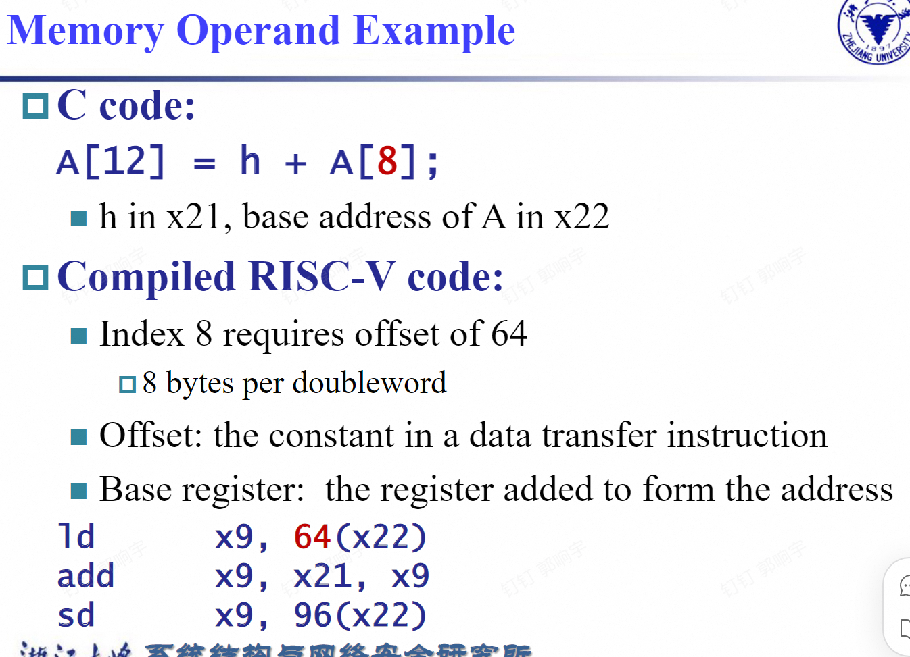

ld是load指令 是把一个地址的东西读到寄存器中

64（x22）是说从x22存的地址+64开始读，因为每个doublewordrd占8个字节（8个地址） 88=64

sd 就是把寄存器的东西写回地址（memory）中

### constant and immediate oprands 常量或立即数操作数

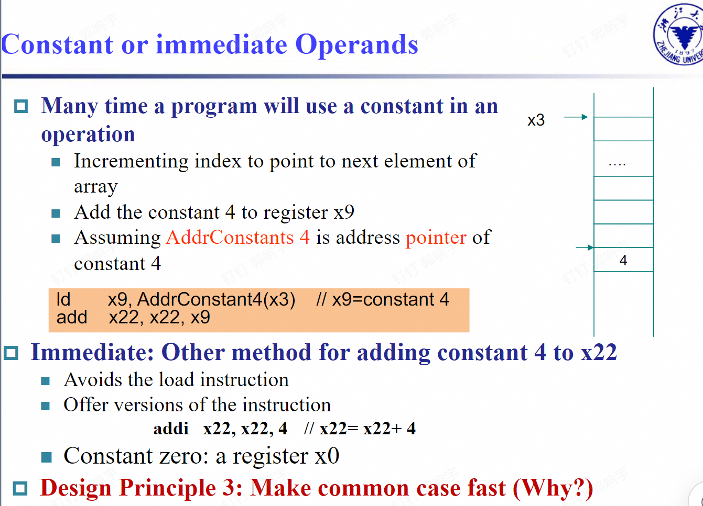

就是加常数也有自己的命令addi

### 总结

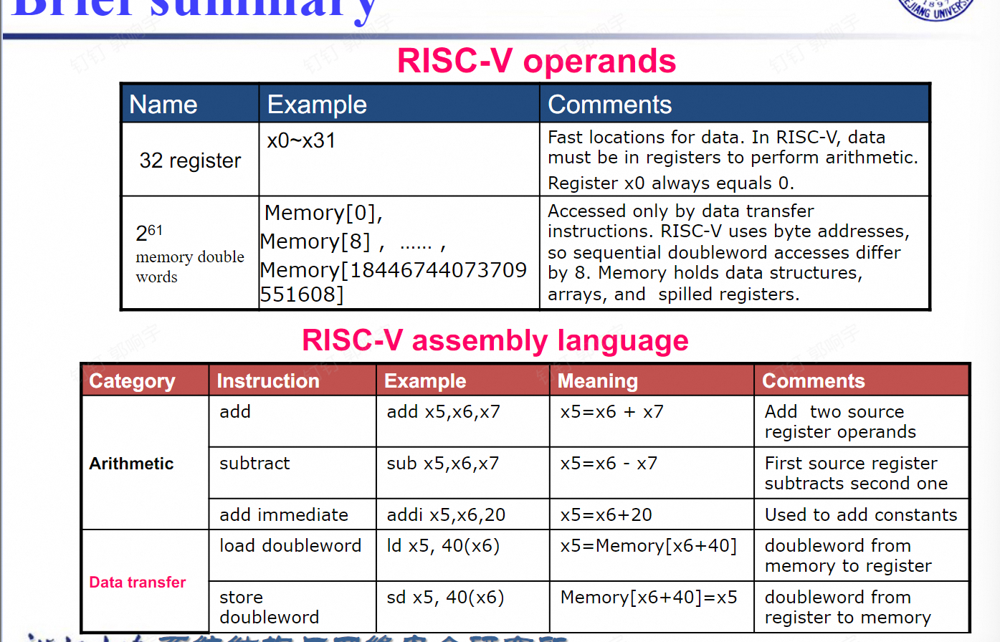

## 有符号和无符号数

### 无符号数

看ppt

### 有符号数的补码（都存补码）

### 补码下有符号数取反

1.所有位按位取反
2.加1
3.得到的还是补码！

## 计算机中指令的表示

### 简介

1. **信息的二进制本质**：计算机中所有信息（包括指令、数据）都由**二进制位（bits）**组成。
2. **指令的二进制编码**：指令会被编码为二进制形式，称为**机器码（machine code）**，是CPU能直接识别执行的格式。
3. **寄存器的数字映射**：RISC-V的32个通用寄存器（`x0`~`x31`）被**映射为数字0~31**，便于指令编码时表示寄存器编号。
4. **RISC-V指令的编码特性**：
   - 每条指令被编码为**32位的指令字**（固定长度，简化硬件解码）。
   - 采用**少量统一的格式**，编码“操作码（opcode，指定指令类型）”“寄存器编号”等关键信息。
   - 设计具有**规整性（Regularity）**，让硬件解码更高效，也便于编译器生成/优化代码。

### 例子见ppt

### 指令格式

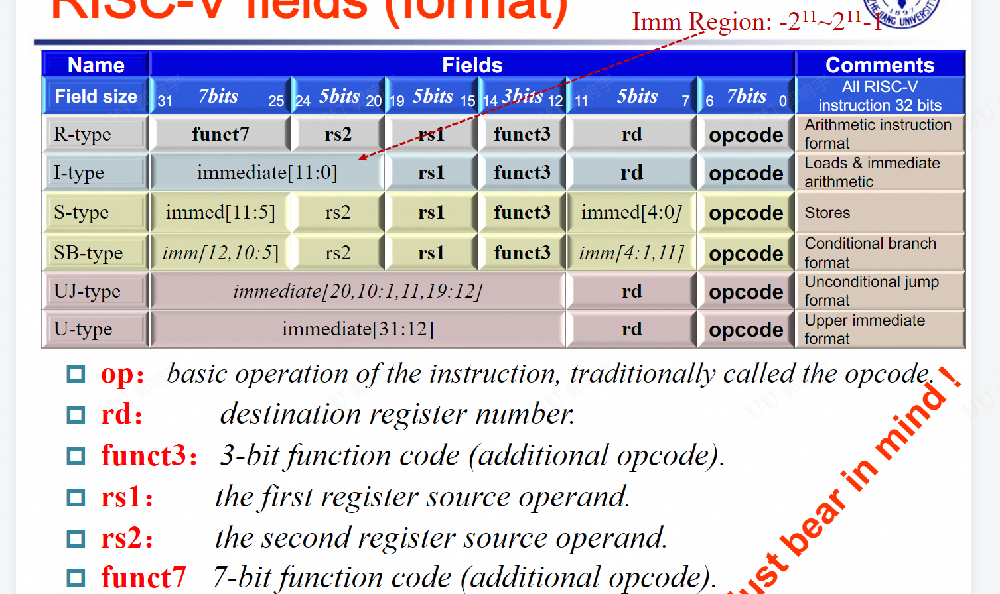

大概就是这个格式

先看几个重点

op 操作符 7位

rd 目标寄存器 5位

rs1 操作数1（寄存器编号） 5位（提供数值的）

rs2 操作数2（寄存器编号） 5位（提供数值的）

还有一些在不同指令下不同

### R类指令

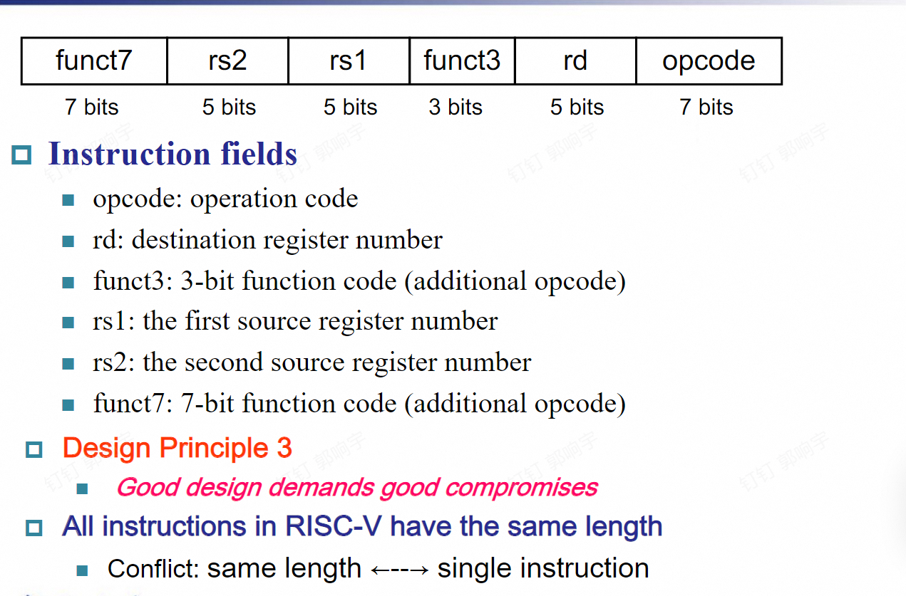

### I类指令

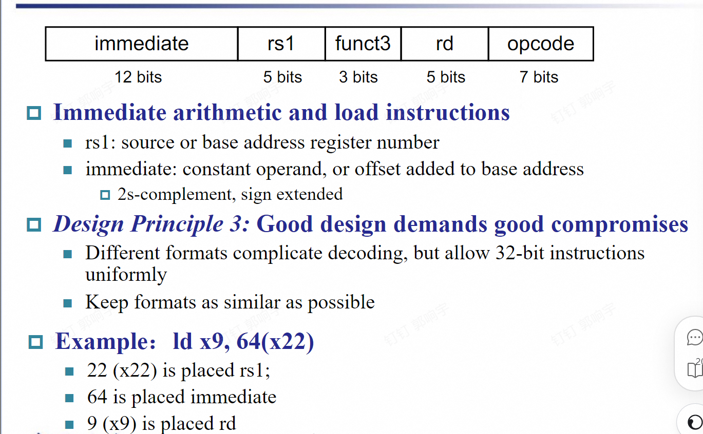

1231
这里的immediate是立即数 就是可以理解成一个常数或者要加在地址上的数

### S类指令

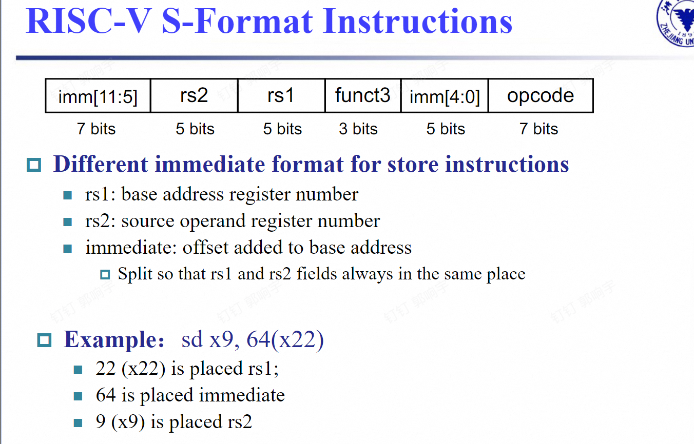

只有rd ld是能让寄存器和内存交互的

注意是写二进制还是16进制！

## 存储

1.命令 data（包括程序原代码）都是用二进制数据存储的

2.Instrcutions 和 data都是存在内存中

## logical operation

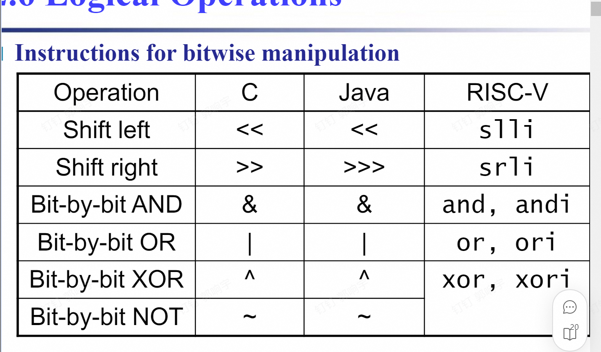

就是什么按位与 左移 右移

### shift operation

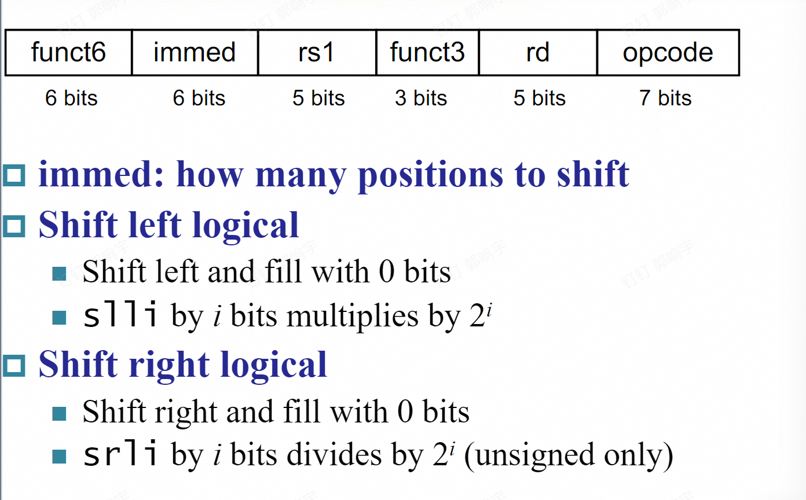

注意这里immed是表示移动多少位（只有6位）

### and operation

and x9 x10 x11

or

xor 都差不多

### 总结1

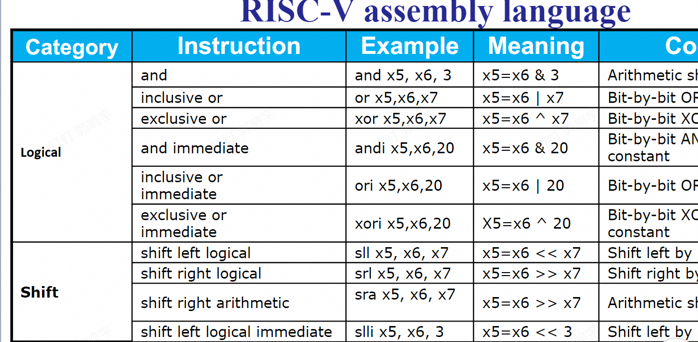

注意这里算数右移 是最高位补符号位的

## make decision 的指令

beq r1 r2 L1 如果r1==r2跳转到L1
bne r1 r2 L1 如果r1!=r2跳转到L1

但是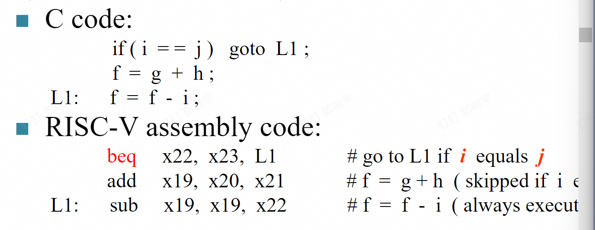

如果写成这样 会是无论如何都会执行L1 因为是顺序执行的

### 改进

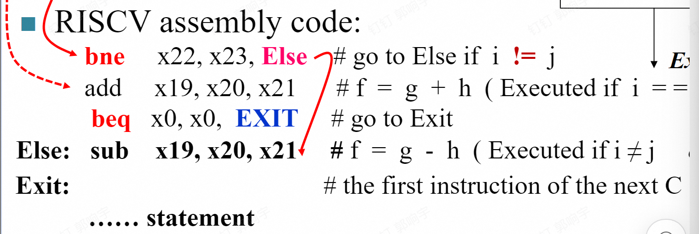

我们加一个bnq x0 x0 Exit 就可以成功跳出了(用不相等做跳出 可以效率提高)

### 它可以支持循环loops（for）

只需要把第一语句叫做 loop

最后一个放bne x1 x2 loop就好了

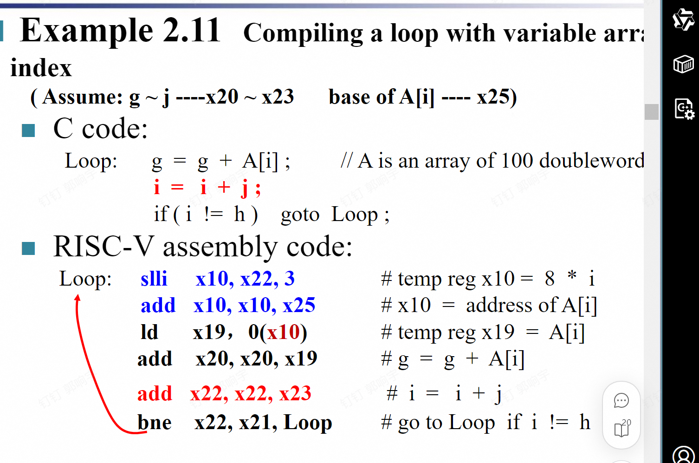

首先 slli x10 x22 x3 相当于x10=8*i
之后x10 变成A[i]的地址
之后写到19
加到20
x22=x22+x23
判断是否相等 否则回到loop

### 它也可以支持循环while（区别就是先判断再执行（while）还是先执行再判断（for））

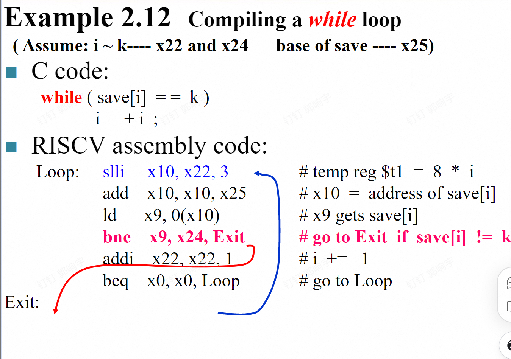

## 更多指令 set on less than

slt x5 x1 x2 就是 x5=x1<x2

blt x1 x2 L1 如果x1<x2跳转到L1

bge x1 x2 L1 如果x1>=x2跳转到L1

## unsigned and signed

unsigned 就是指令后面加个U

## case 的语法

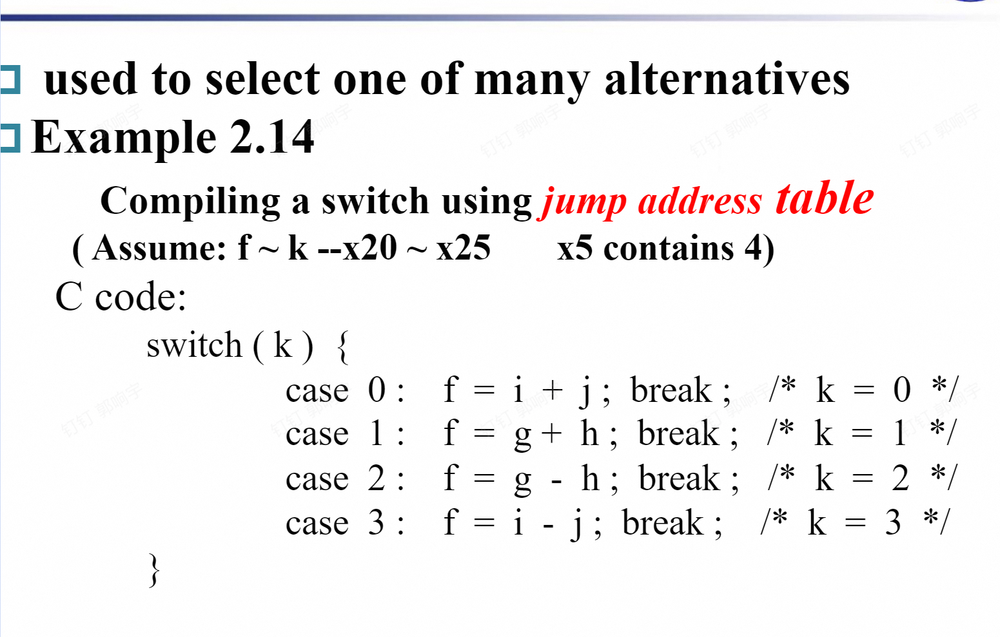

这个怎么写 听我慢慢说

### 1.基本知识

两个语句

1.jal x1 100 就是说x1=pc+4(PC是这一个语句的地址，+4就是下一个) 再跳转到以100（相对的！）为地址的地方（注意，这里存的是一个语句（32位））

2.jalr x1 （100）x2 就是说x1=pc+4 再跳转到以x2+100为地址的地方（存的也是语句）相当于执行语句了

### jump address table

这四个case语句都会有一个地址

还有一个表 这个表就是存这几个地址的

就相当于一个数组 数组每一位有个地址 每一位存了一个地址（语句的地址）

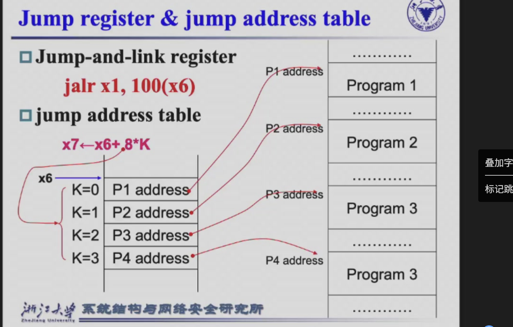

### case构建

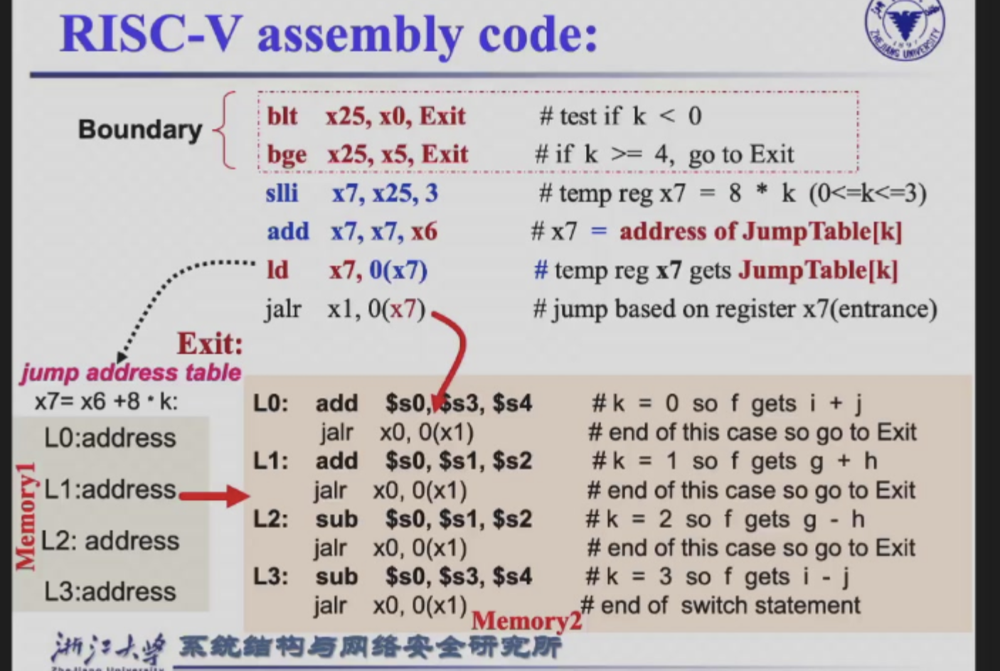

重点几句 slli x7 x25 3 就是x7=8*k 这里的x7是用来存表的偏移地址的（因为一个地址可能是64位的）

add x7 x7 x6 就是把x7变成真正要查的数组元素的地址

ld x7 0(x7) 就是把x7这个地址的元素读到x7中 此时x7是语句地址

jalr x1 0(x7) 就是跳到x7这个地址的语句

后面再跳回x1 就是接着往下执行

## 基本块

1. 基本块的定义与特征

基本块是一段指令序列，具有两个关键特征：
「无嵌入式分支（末尾除外）」：在基本块内部不会出现分支指令（如跳转、条件分支等），仅在块的末尾可能存在分支操作。
「无分支目标 / 分支标签（开头除外）」：只有基本块的开头可以作为分支指令的目标位置（即被跳转指令指向），块内部不能有分支标签或成为分支目标。

1. 基本块的作用
对于编译器：识别基本块是编译优化的基础。编译器可以基于基本块进行各类优化操作（如常量传播、死代码消除、指令重排等），提升代码执行效率。
对于处理器：先进的处理器可通过指令级并行等技术，加速基本块的执行，从而提升程序运行速度。

## Supporting Procedures（函数）

就是说函数调用的问题，也就是说一个程序调用另一个

首先我们明白 程序是由一行行命令组成的

### 函数的定义和步骤

函数是什么：就是一段程序，基于传入参数执行任务

步骤

1.参数传递：将参数放置在过程（函数）可访问的位置，例如 MIPS 架构通过函数参数寄存器a0-a7 传递参数。
2.控制转移：通过 “跳转” 操作，将程序控制权转移到过程的入口。
3.获取存储资源：为过程分配所需的存储资源（如栈空间，用于保存局部变量、寄存器值等）。
4.执行任务：运行过程内部逻辑，完成特定功能。
5.结果返回：将结果放置在调用者程序可访问的位置，例如 MIPS 架构通过返回值寄存器a0-a1 传递结果。
6.控制返回：将程序控制权返回给调用点，通过返回地址寄存器ra 定位调用时的原位置。

### 看第一个 如何控制转移 跳转

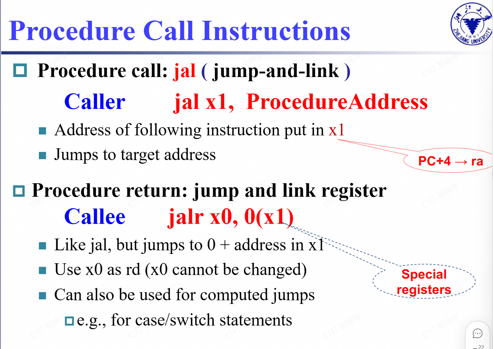

这里就是上面说的jal jalr

其实就是先jal 跳到函数 x1存的是主程序的下一条命令。

之后再通过jalr跳到x1 就是回到主程序

### using more registers（寄存器不够用了--反复用）

1.a0-a7 函数参数寄存器(对应x10-x17) 这个是负责传参 需要保存 返回主程序的的寄存器

2；ra/x1 是返回地址寄存器（用来存应该返回到的命令的地址）

### 栈(解决寄存器不够用的情况)（这是memory的一块空间）

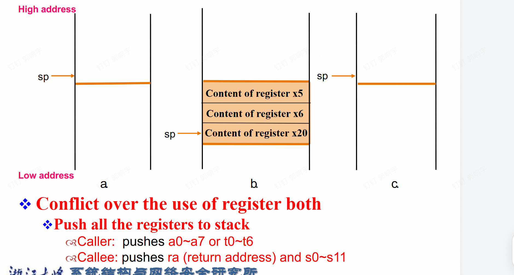

说白了就是把寄存器的值先放到memory，之后再还回去，保证了不该变的不变。哦对！还有最重要的 其实是传参

这里的栈长得和之前学的那个一样 也是先进后出

有一个栈指针寄存器 sp 指的是栈顶位置

栈是从高地址向低地址存储

所以 入栈是sp=sp-8

出栈是sp=sp+8

### 例子例子

ppt有一个返回f=g+h-i-j的例子。
函数的参数是g h i j

注意入栈和弹栈的方式

注意的就是这样的操作保证了中间用到的寄存器x5 x6 x20的值不会被改变 因为别人后面也要用

但是这样很没有效率 因为把x5 x6 只是为了做中间变量，对callar（调用者没有意义）

所以 我们划分了两种寄存器

t0-t6 是临时寄存器 根本不用保存 随便改

s0-s11是保存寄存器 需要保存值（也就是要传到栈里）

### 超级例子

ppt递归

也可以发现 栈的作用是保存一下需要记住 但迫不得已改变的量（比如计算需要，因此saved register也是可以改变的 只不过最后要回复）

而且这里的保留和不保留是针对于被调用者来说的，即被调用者返回时要不要把这个寄存器改回原来的值。

其实就算是a0-a7可能也需要保存，但这个是调用者的责任。

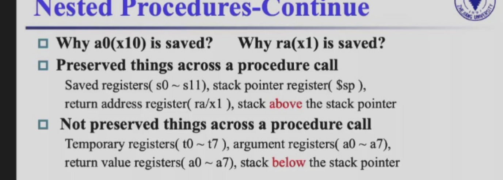

### 帧指针

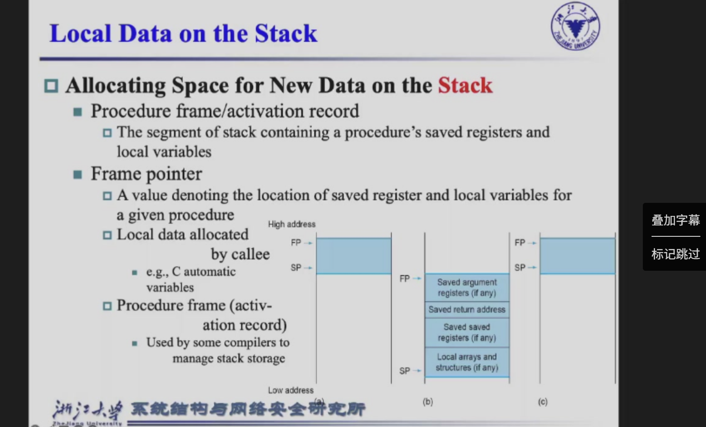

先看一下不同东西存的结构

这里的帧指针的作用是什么？ 因为栈指针一直指的是栈顶 会变动 不方便加偏移量使用

而帧指针是不变的 一直指的是那些saved的东西的第一个（这样方便偏移查询）

### 1. 核心主题

讲解**函数调用时，如何在栈里为函数分配空间**（存局部变量、保存的寄存器等数据）。

### 2. 关键概念

- **过程帧/活动记录（Procedure frame/activation record）**
  栈里的一段“专属区域”，用来存某个函数的：

  - 被保存的寄存器（比如之前说的s寄存器）；
  - 函数的局部变量（这不是寄存器）。
  简单说：每个函数调用时，栈都会单独划一块空间存它的临时数据，这就是“过程帧”。

- **帧指针（Frame pointer，简称FP）**
  一个“标记”（存在寄存器里，比如RISC-V的`s0/fp`），用来定位当前函数的过程帧位置——通过FP能快速找到这个函数的局部变量、保存的寄存器存在栈的哪里。

- **被调用方分配的局部数据**
  比如C语言里的“自动变量”（就是函数内的局部变量，比如`int x;`），这些数据是由“被调用的函数”（callee）在栈上分配空间的。

### 3. 栈帧的结构（右边的图）

栈是“高地址在上、低地址在下”（栈向下增长），图里的`SP`是栈指针（指向栈顶），`FP`是帧指针（指向当前函数栈帧的起始位置）。
栈帧里通常会存这些内容：

- 保存的参数寄存器；
- 保存的返回地址；
- 保存的s寄存器；
- 局部数组、结构体等数据（因为寄存器放不下）。

## 内存的布局

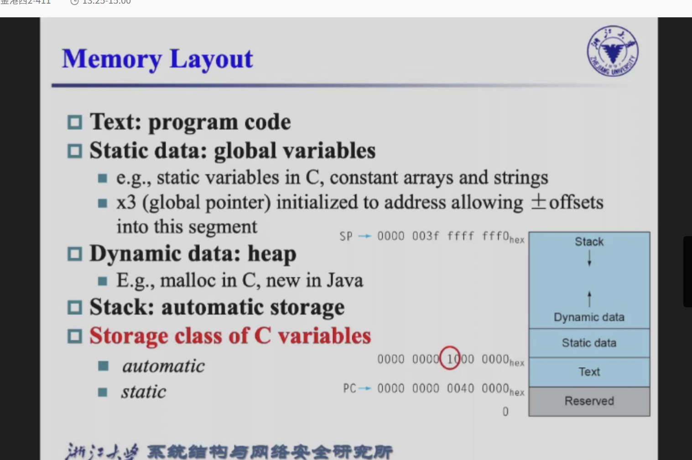

这里写的很明白了。

这页PPT讲的是**程序运行时的“内存布局”**——也就是程序在内存里被分成了哪几个功能区域，每个区域存什么数据，拆解如下：

### 1. 内存的4个核心区域

程序运行时，内存会被划分为4个独立的“段”，每个段有明确的用途：

- **Text段**：存**程序的代码（指令）**，比如你写的函数逻辑对应的机器指令，PC（程序计数器）会指向这个段的地址来执行代码。
- **Static data段**：存**全局变量、静态变量**（比如C里的`static int a;`、常量数组、字符串常量）。
  这里还提到RISC-V的`x3（全局指针gp）`——它会被初始化为这个段的地址，方便快速访问全局变量。

- **Dynamic data段（堆）**：存**动态分配的数据**（比如C里`malloc`申请的内存、Java里`new`创建的对象），需要手动申请/释放。
- **Stack段（栈）**：存**自动变量**（也就是函数的局部变量），随函数调用自动分配/销毁（之前讲的栈帧就在这里）。

### 2. 内存地址的分布（右边的图）

内存地址是“从低到高”排列的：

- 最底部是`Reserved`（保留区域）；
- 往上是`Text`（程序代码，PC指针指向这里）；
- 再往上是`Static data`（全局/静态变量）；
- 然后是`Dynamic data（堆）`（堆是**向上增长**的）；
- 最顶部是`Stack（栈）`（栈是**向下增长**的）。
（堆和栈中间的区域，是它们动态扩展的空间）

### 3. C变量的“存储类”对应关系

C里的变量类型，会对应到不同的内存段：

- `automatic`（自动变量）：对应**Stack段**（函数局部变量）；
- `static`（静态变量）：对应**Static data段**（全局/静态变量）。

## 两页很重要的ppt

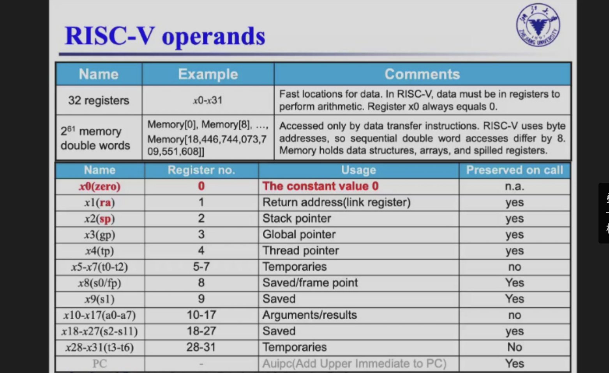

寄存器

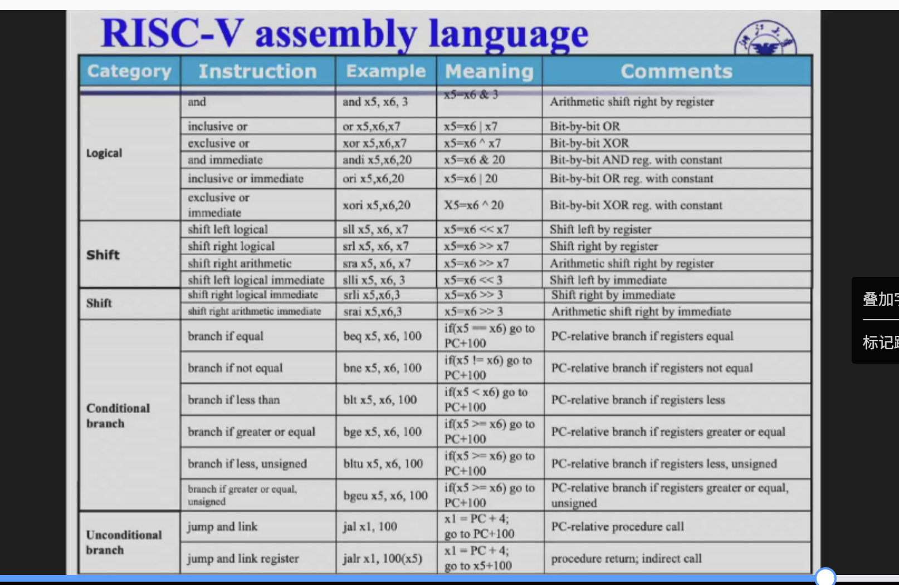

指令

## Character Data

就是字符编码

1.acsll编码 128个字符 95个图形 33个控制

2.Latin-1编码 256个字符

3.Unicode 32位字符集合 涵盖绝大多数字母表和符号

你看这里有8位 16位 32位 和之前的doubleword 64位不同

因此指令也不会太一样

1. 带符号扩展的加载指令
指令：lb（加载字节8）、lh（加载半字16）、lw（加载字32）
功能：从内存中读取 8 位、16 位、32 位数据后，符号扩展到 64 位，存入目标寄存器rd。

2. 无符号扩展的加载指令
指令：lbu（加载无符号字节）、lhu（加载无符号半字）、lwu（加载无符号字）
功能：从内存中读取 8 位、16 位、32 位数据后，零扩展到 64 位，存入目标寄存器rd。

3. 存储指令
指令：sb（存储字节）、sh（存储半字）、sw（存储字）
功能：将源寄存器rs2中最右侧的 8 位、16 位、32 位数据，存储到由offset（偏移量）和rs1（基地址）计算出的内存地址中。

不过和ld rd语法也都差不多喽

ppt有个例子

这就是一个叶子程序（里面没有分支或者循环）

所以其实这里用s3（saved 寄存器）不太合适 因为还要先压栈记住再弹栈回来 没什么必要

## 加很大的立即数

我们之前指令加的立即数的位数是12位

但如果想加很大的呢？

### 大立即数指令

我们这里用20位立即数

U型指令

lui rd,imm 就是把imm这个数放到rd这个寄存器里

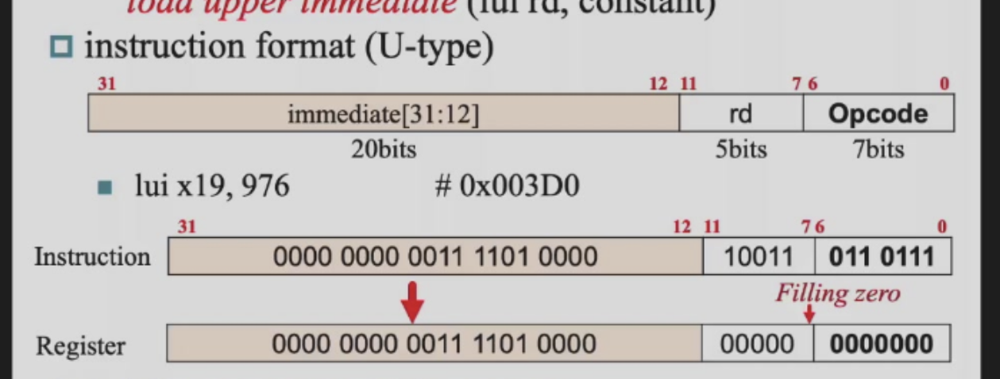

格式 左边20位是立即数 右边七位是opcode 中间是寄存器

注意 **实际传到寄存器的值是imm左移12位**（这起到了解决大立即数的作用）

但是这样你会说不是这后面12位怎么办？

注意 这里说的lui 976不是加976 而是976*2的12次方

欸 很简单 再来一个addi的指令不就好了

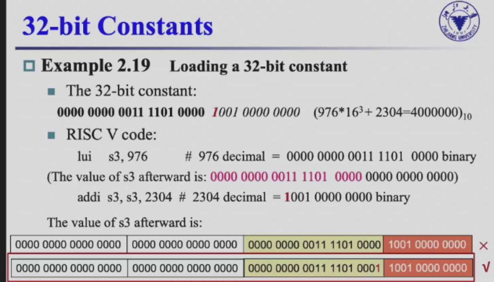

看这个例子 注意是放在64位的右边32位

但这里有个问题！

addi的立即数最高位是符号位！ 这里表达有问题

那怎么办呢？

### 解决

很简单 我们在976那里+1就好了 具体ppt也有（ppt的图是错的！应该是变成lui s3 977以及addi s3 s3 2304）

原理大概就是2304-(111100000000)=2的13次方 这里的意思就是本来该加2304 结果加了一个负数 11110000000就是这个负数补码的源码

当然如果加的数小于2048就没这种麻烦了

### 地址跳转

#### 分支跳转（注意这里是PC偏移量）

跳转指令(比如分支跳转) SB-type

例子：bne x10 x11 2000(2000=0111 1101 0000)

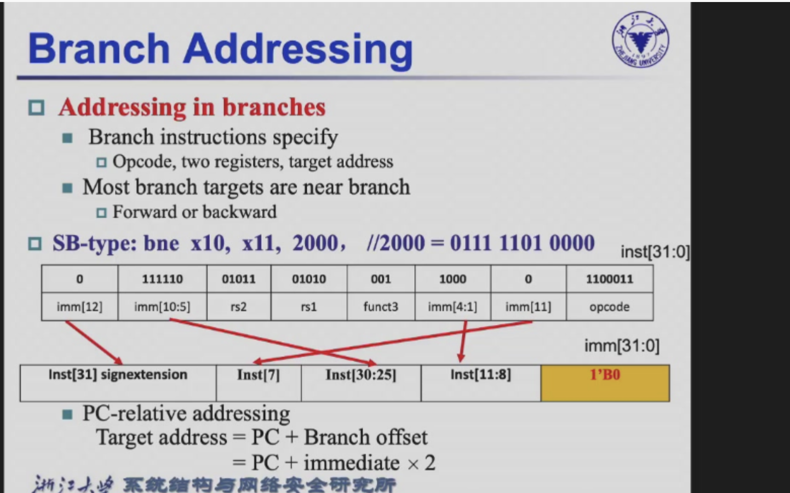

不过你也看到 这里拆的很散 而且再组合成2000也很怪异

还有一个注意的点 指令里面其实存的是1000 因为后面组成的时候会默认最后补0 也就是乘二（但bne那里就是2000 就是要跳到2000！）

也就是偏移字段是1000  实际偏移量是2000

### 无条件跳转（也注意是PC偏移量）

UJ-type

就是我们之前看到的jal 它支持20位的地址输入

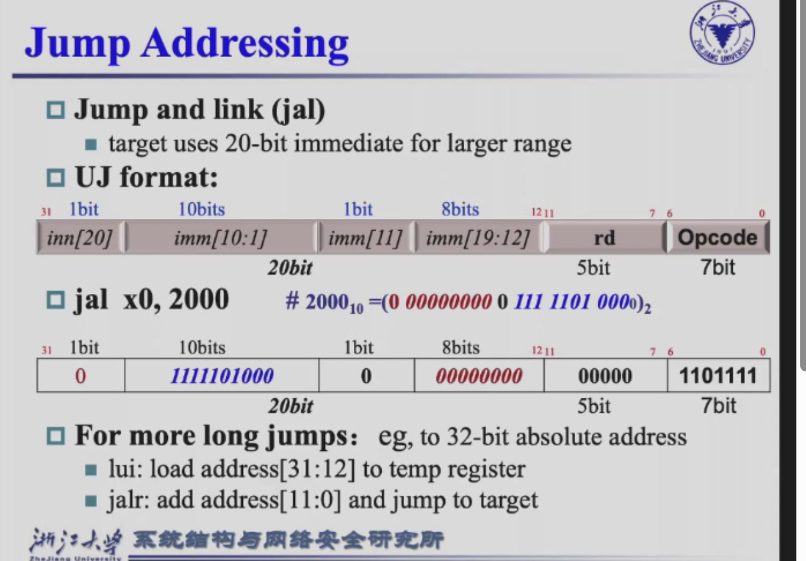

所以大跳转 我们可以先用lui 再用jalr

注意 这个也有上面乘2的问题！

注意 jalr是**i型**指令！**而且是绝对地址**

### 当分支跳转太远了

我们知道无条件比分支的跳转范围大

所以可以先让分支跳到无条件 再从无条件跳到目标

还可以通过lui与jalr（不用乘2的）的组合

## 反推

给你一个32位指令 推什么命令

先从右边7位判断什么类型 再对应这个类型编码规则 翻译。

## synchronization in RISC-V

讲的是**RISC-V架构中的同步机制**

### 1. 多处理器共享内存的竞争问题

当两个处理器（P1、P2）共享一块内存区域时：

- 若执行“P1写内存 → P2读内存”的操作，**若不同步会引发数据竞争（Data race）**；
- 数据竞争的结果会依赖于访问顺序，导致程序行为不可预测。

### 2. 同步所需的硬件支持

为解决数据竞争，需要**硬件级的原子读写操作**：

- 原子操作要求“读-写”过程中，该内存位置不允许其他处理器访问；
- 确保操作的“原子性”（不可分割性），避免中间状态被干扰。

### 3. 原子操作的指令实现

原子同步可通过**单条指令或原子指令对**实现：

- 示例：寄存器与内存的“原子交换”指令（atomic swap）；
- 或通过一对原子指令组合，保证操作的原子性。

### 相关命令

这一页讲解的是**RISC-V架构中用于同步的两条关键指令：保留加载（Load Reserved）和条件存储（Store Conditional）**，它们配合实现原子操作，解决多处理器共享内存的同步问题，具体如下：

#### 1. 保留加载指令（Load Reserved: `lr.d rd, (rs1)`）

- 功能：从寄存器`rs1`指定的内存地址加载数据到寄存器`rd`；
- 关键特性：对该内存地址**设置“保留标记”**，用于后续检测该地址是否被其他处理器修改。

#### 2. 条件存储指令（Store Conditional: `sc.d rd, (rs1), rs2`）

- 功能：将寄存器`rs2`中的数据存储到`rs1`指定的内存地址；
- 执行结果判断：
  - **成功**：若从`lr.d`执行后到`sc.d`执行前，该内存地址**未被修改**，存储成功，`rd`返回`0`；
  - **失败**：若该内存地址的值**已被修改**，存储失败，`rd`返回**非零值**。

这两条指令配合使用，可实现**原子性的“读-改-写”操作**，是RISC-V处理多处理器内存同步、避免数据竞争的核心硬件支持手段（例如用于实现互斥锁、原子变量更新等场景）。

## translating and starting a program

这里看ppt 问ai 了解即可

## 数组和指针

数组要先看每个元素大小 再加到基础地址 才能得到每个位置的地址

指针就是直接指过去

## MIPs

Mips和RISC-V一样 都是32个通用 还有32个浮点计算器 都是只有ld rd能和内存沟通

但是mips采用先比较再标记 再分支的结构 就是用slt sltu比较 再用 beq bne实现跳转

## 还有x86 IA32

见ppt吧 都是其他的指令集

## other RISC-V instructions

就比如一些addw 代表32位加减 （寄存器64位的时候）

RISC-V有基本指令集 还有扩展

指令集扩展：

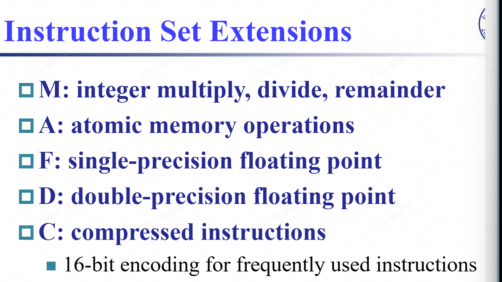

## 一些易错

在ppt最后

## 这里说一下递归函数应该怎么写

有几个原则：

1. 每次调用要准备2个位置 也就是sp=sp-16 一个用来放回去的位置x1 一个放回去的值
2. 在最后的时候写jalr x0 0(x1) 也就是回去
3. 你在同一层执行的东西 不用管下面几层这个变量怎么变 就看这一层就好了。你要记住 写的对的话肯定会还原的。
4. 一般递归的命令就是 jal x1 函数（比如fib fact）

## 附录

在RISC-V指令集中，不同类型指令的**opcode（操作码，低7位）** 如下：

| 指令类型 |  opcode（二进制） | opcode（十进制） | 说明 |
|----------|------------------|------------------|------|
| R型（寄存器-寄存器操作） | `0110011` | 51 | 用于算术逻辑运算（如ADD、SUB、AND等），需结合funct3、funct7进一步区分指令 |
| I型（立即数/加载操作） | - `0000011`（加载指令，如LB、LW） - `0010011`（立即数运算，如ADDI、XORI） - `1100111`（跳转并链接寄存器，如JALR） | - 3 - 19 - 103 | 涵盖短立即数运算、内存加载、寄存器跳转操作 |
| S型（存储操作） | `0100011` | 35 | 用于内存存储（如SB、SW） |
| B型（条件跳转） | `1100011` | 99 | 用于条件分支（如BEQ、BGE） |
| U型（长立即数） | - `0010111`（AUIPC） - `0110111`（LUI） | - 23 - 55 | 用于长立即数加载（如LUI将立即数左移12位） |
| J型（无条件跳转） | `1101111` | 127 | 用于无条件跳转（如JAL） |

这些opcode是指令解码的关键标识，通过低7位即可快速区分指令的大类别，再结合`funct3`、`funct7`等字段可进一步确定具体指令功能。

### 补充补码

补充补码一个小知识：其实负数的补码就是他的正数全部取反+1；
