# 单周期处理器 CPU

## 先来看看计算机的具体组成

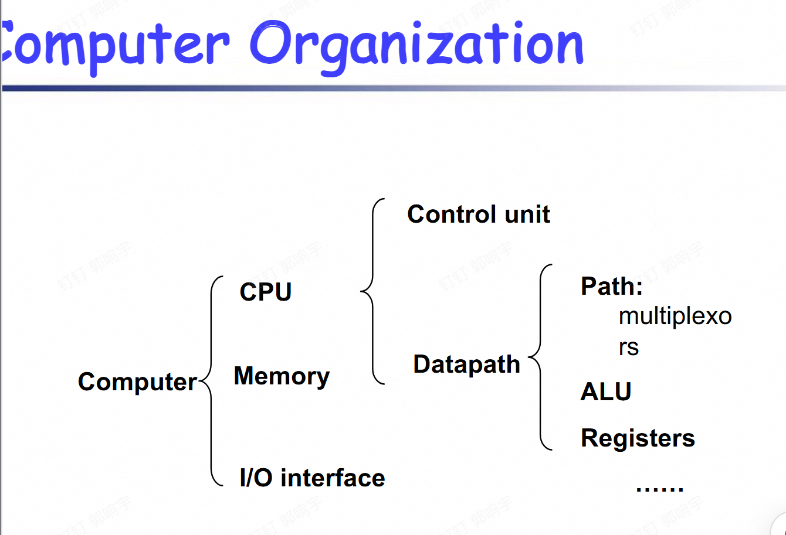

这张PPT在讲解**计算机组成Computer Organization**的层次结构，可分三层理解：

### 第一层：计算机的核心组成

计算机由三个核心部分构成：

- **CPU（中央处理器）**：负责指令执行、数据运算与控制。
- **Memory（内存）**：存储程序和数据。
- **I/O interface（输入输出接口）**：连接外部设备（如键盘、显示器、硬盘等）与计算机核心部件。

### 第二层：CPU的内部构成

CPU由两个关键模块组成：

- **Control unit（控制单元）**：负责生成控制信号，协调CPU内部及计算机各部件的操作（如指令的读取、解码、执行时序）。
- **Datapath（数据通路）**：是数据在CPU内部传输、运算的物理路径，包含以下组件：
  - **Multiplexers（多路选择器）**：选择数据的传输路径。
  - **ALU（算术逻辑单元）**：执行算术运算（如加减）和逻辑运算（如与或非）。
  - **Registers（寄存器）**：临时存储数据和指令，是CPU内部的高速存储单元。

## introduction

### 回忆一下 CPU performance factor

和指令数 每条指令的周期 每个周期的时间有关  前者由指令集（ISA）决定 后者由CPU 硬件决定

### RISC-V的实现

我们这堂课只会涉及简单版本（简化的），还有少量流水线式的

## 指令执行的overview

### 1. 所有指令的前两步完全相同

- **取指（Fetch the instruction from the memory）**：从内存中读取要执行的指令。
- **解码并读寄存器（Decode and read the registers）**：解析指令含义，并从寄存器中读取所需的操作数。

### 2. 后续步骤由指令类型决定

指令分为三类，后续流程因类型而异：

- 内存引用型（Memory-reference，如`ld`加载、`sd`存储）
- 算术逻辑型（Arithmetic-logical，如`add`、`and`等运算指令）
- 分支型（branches，如`beq`条件跳转）

### 3. 按指令类型的具体执行动作

根据指令类别，会执行以下操作：

- **使用ALU计算**：
  - 算术结果（如加减运算的结果）；
  - 加载/存储的内存地址；
  - 分支指令的比较逻辑（如`beq`的相等判断）。
- **加载/存储指令访问数据内存**：完成数据的读写操作。
- **更新程序计数器（PC）**：跳转到目标地址（分支指令）或执行下一条指令（PC + 4）。

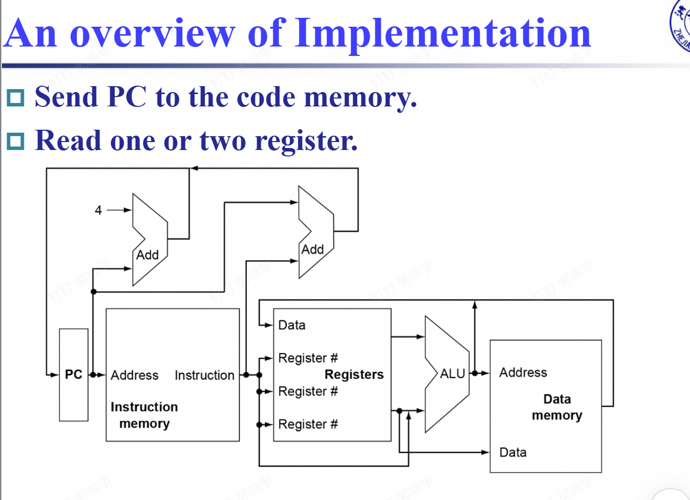

这里我们肯定会用到多选器

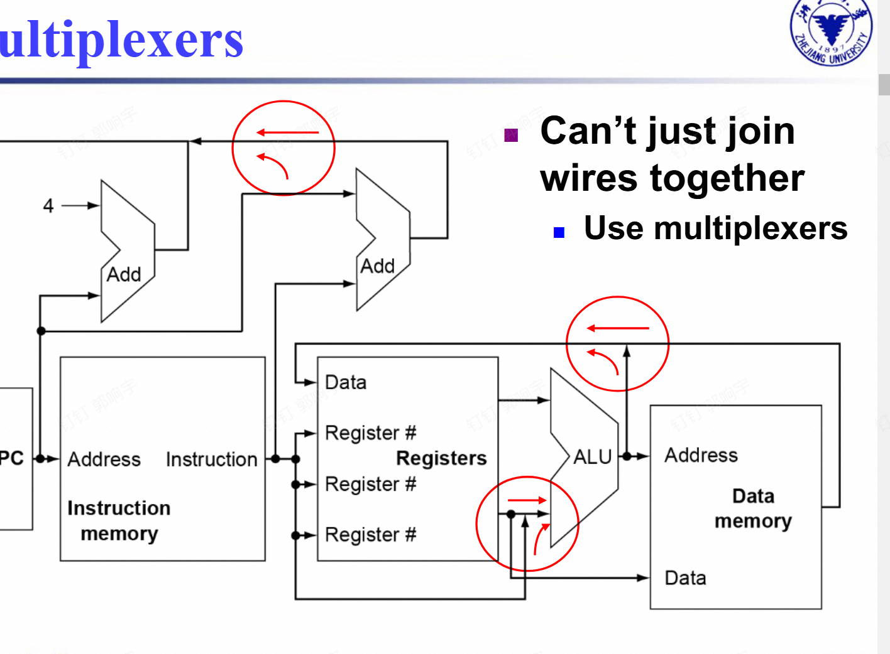

那你都有多选器 可一定有多选器的控制器吧

控制器的输入很多（比如命令是什么） 输出就比如要控制内存读哪里 写哪里 什么时候读 什么时候写 ALU应该是什么操作

## 组合原件

不讲 学过了

## 时序 元件

也就是那些锁存器 触发器什么的 可能再加一个write信号 只有write信号为1时 触发器才会改变

## 同步数字电路的时钟方法学

就是说组合逻辑的运算发生在时钟沿之间 输入来自状态原件 输出也去到状态原件 而且最长延迟决定时钟周期长度

这张PPT在讲解**“构建数据通路（Datapath）”**的主题，核心内容分为两部分：

## 数据通路（Datapath）的定义

数据通路是CPU中**处理数据和地址的硬件元件集合**，包含：

- 寄存器（Registers）、算术逻辑单元（ALUs）、多路选择器（mux’s）、内存（memories）等核心组件。

## 指令执行过程

其实上面已经有了

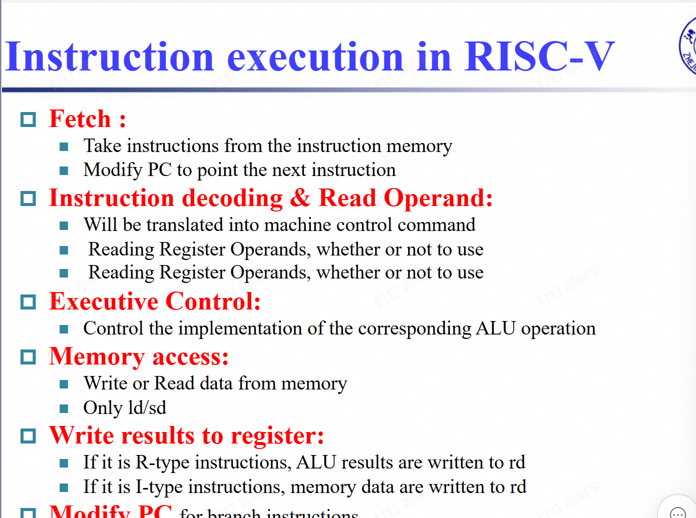

注意这里并不是每一步每个指令都会需要

### FETCH

这是所有指令都需要的 取出指令！

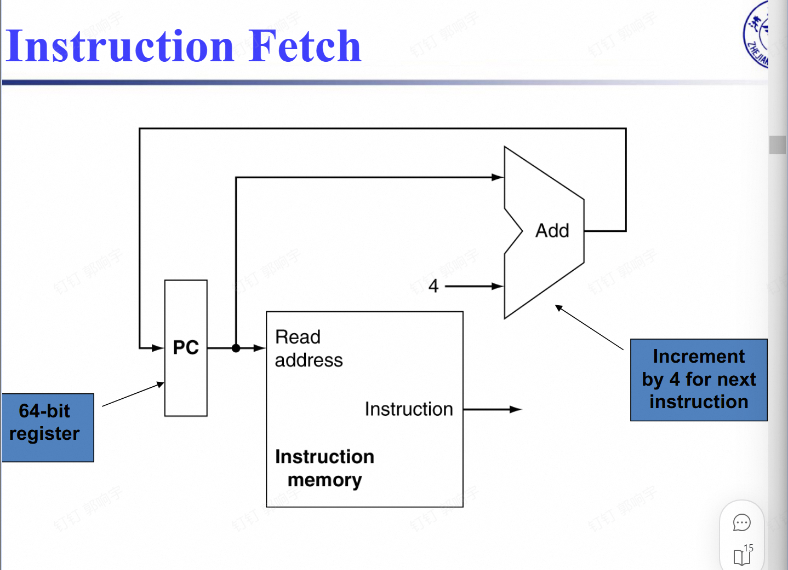

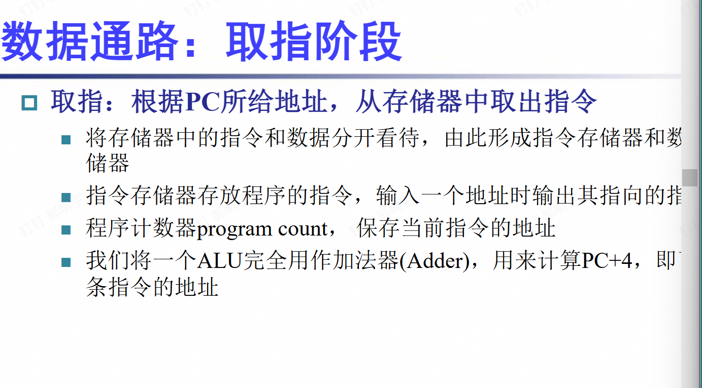

### 补充一个知识点符号扩展

就是不改变数值 但可以扩展数位的方法

就是把前面用符号位补齐 原来是负的就补1 正的就补0

### 对于每种指令 我们梳理一下

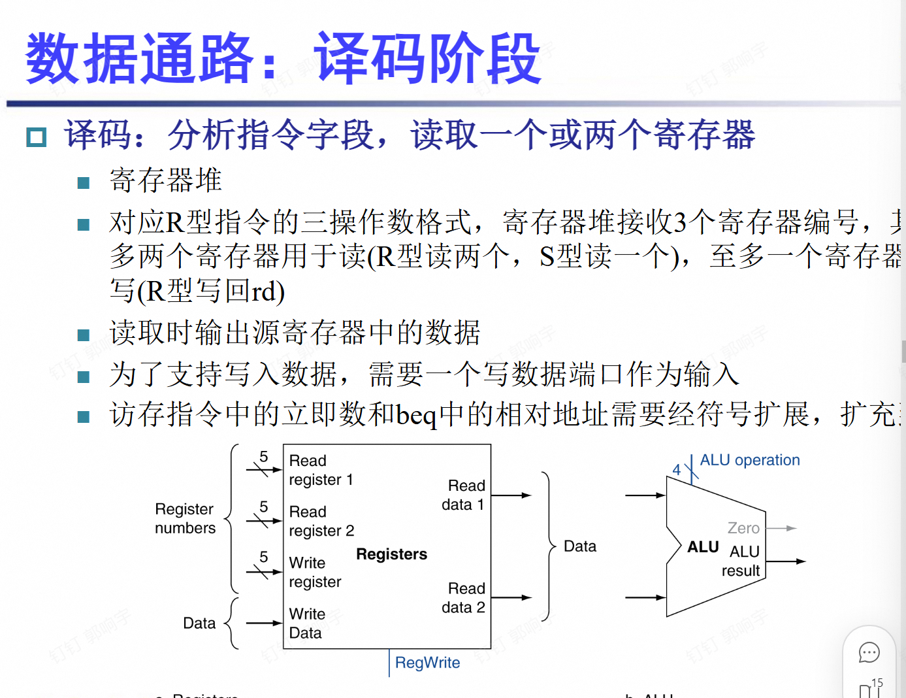

#### R型指令

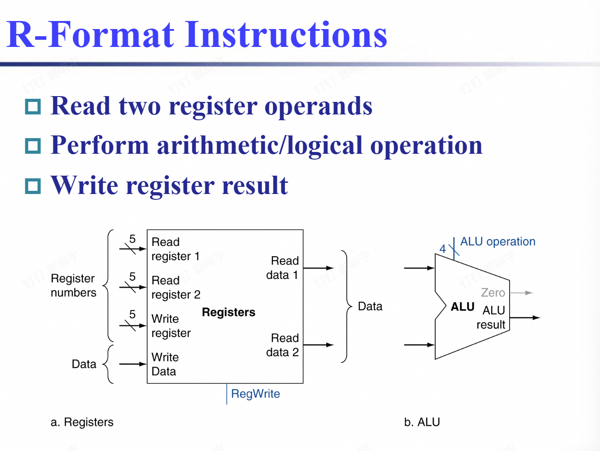

其实就是读两个寄存器的操作数

之后放到ALU 再写到寄存器结果了

#### Load和Store

就是读寄存器的操作数 加上**符号扩展**的立即数

然后读内存 更新寄存器

或者写进内存

#### beq(SB)

就是取pc和偏移量

比较

之后地址写回PC

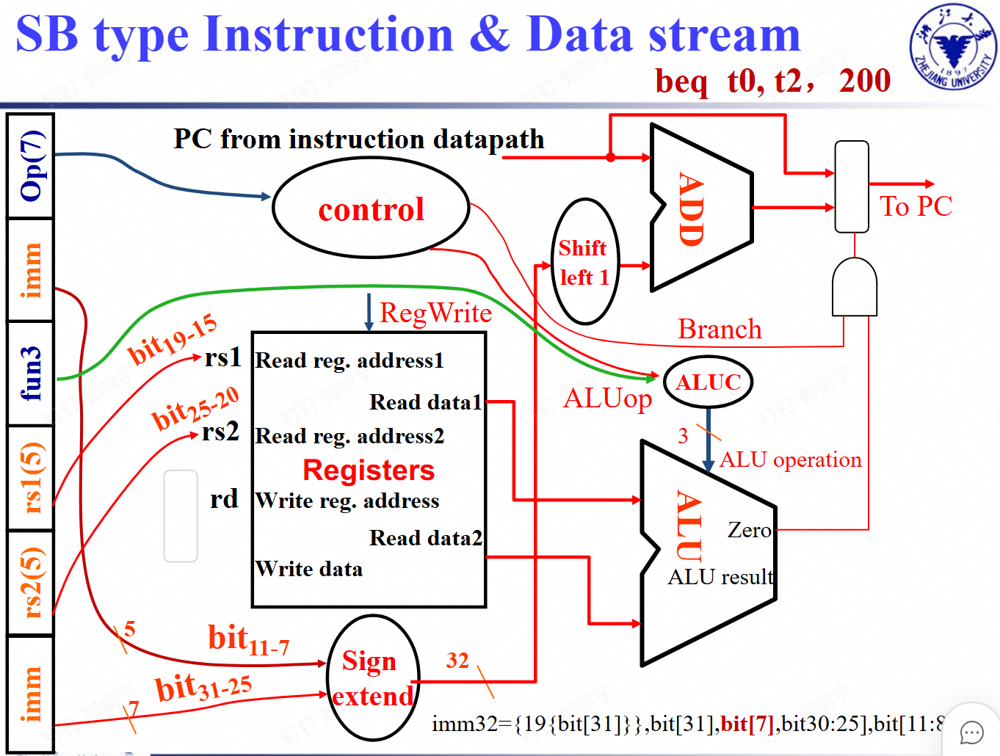

#### jaL(J型指令)

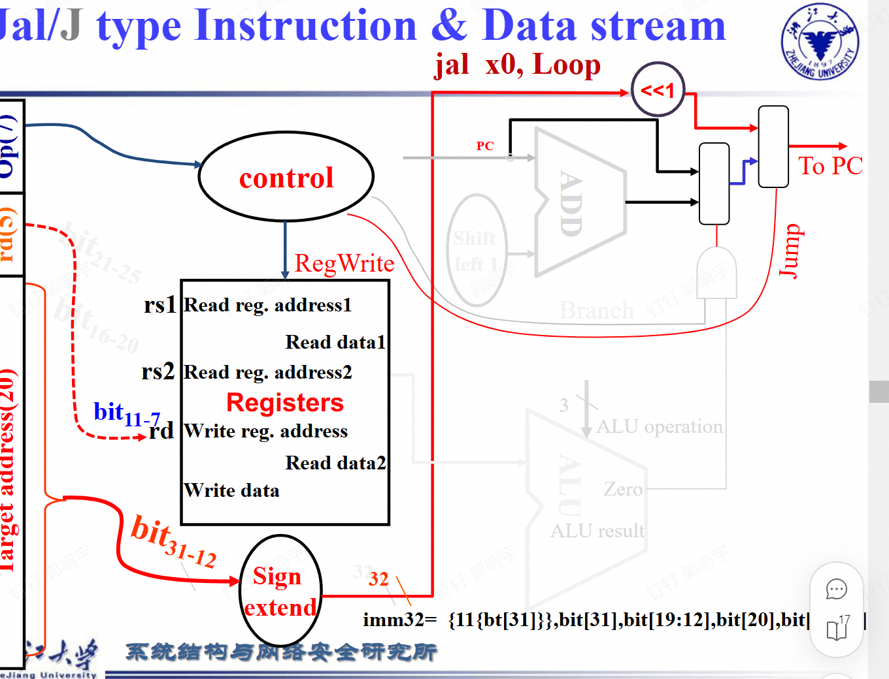

### 指令不同阶段

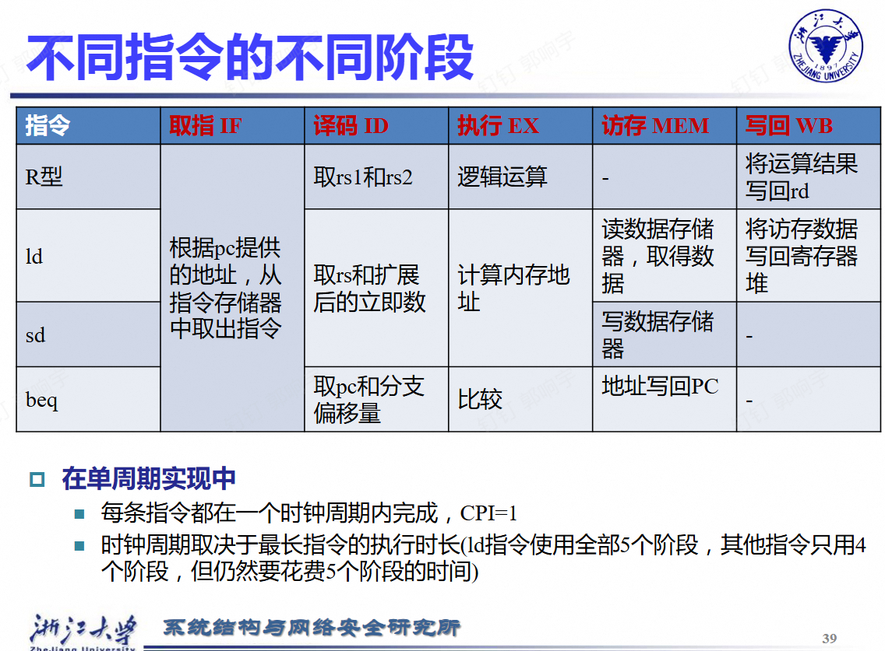

### 多路选择器的作用

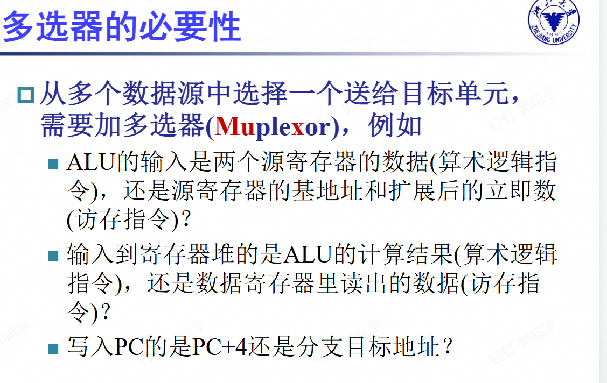

这也是为了操作更加的general

### 不同指令的数据通路

我们可以从之前图看到几个细节

1.registers 还有 memory 都有一个regwrite and memwrite memread信号 用来告诉应该写/读了。

2.有多选器用来说选择哪一个数据 这个由control模块控制

#### 全数据通路图

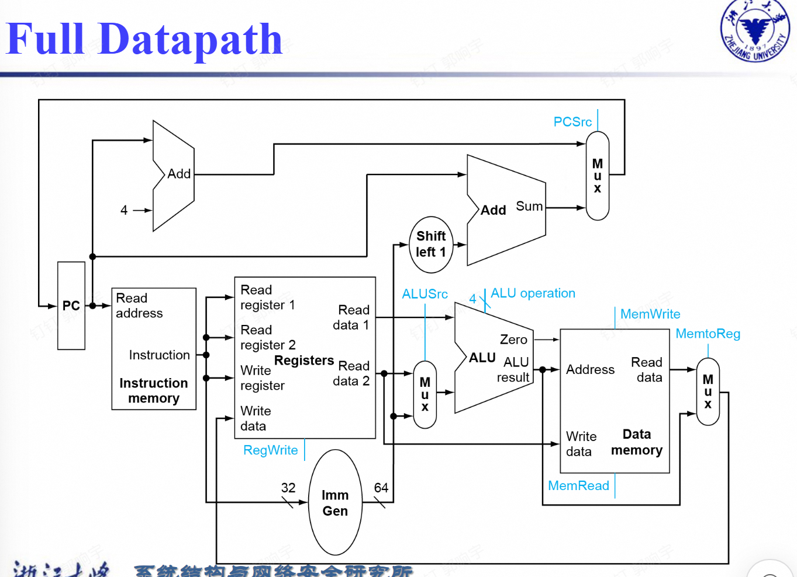

我还要说的是 pc和x1不是同一个东西 一般来说 PC自己变化只会无脑加4 因为他指的是下一条指令的地址。而jal这种就会通过PC+立即数来改变PC。

## A simple implement scheme

### 一些说明

我们的控制器（比如控制alu read/write）控制数据流动 都是基于指令

比如ALUread/write的信号都是由指令类型和function code来控制

### 控制器怎么构建

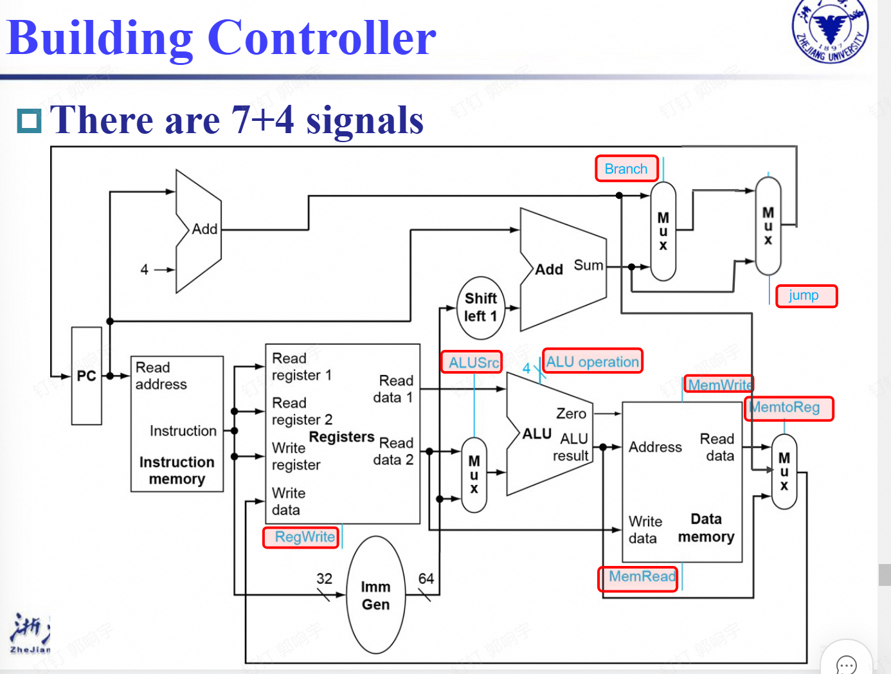

首先从这个图 可以知道应该有11个控制信号

**考试的时候可能考** 给你一个指令 让你说明这些信号是0还是1

#### ALU control

这里实验课讲过 再看一下

| ALU Control Lines | Function           |
|-------------------|--------------------|
| 000               | And                |
| 001               | Or                 |
| 010               | Add                |
| 110               | Sub                |
| 111               | Set on less than   |
| 100               | nor                |
| 101               | srl                |
| 011               | xor                |

#### 7个控制信号是什么

| 信号名称          | 无效时（=0）的效果                                       | 有效时（=1）的效果                                                                 |
|-------------------|----------------------------------------------------------|----------------------------------------------------------------------------------|
| 寄存器写（RegWrite） | 无                                                       | 寄存器目的输入被写入“写数据输入”上的值                                             |
| ALU源（ALUScr）    | 第二个ALU操作数来自第二个寄存器文件输出（读数据2）| 第二个ALU操作数是指令低16位符号扩展后的值                                         |
| 分支（PCSrc）| PC被计算“PC+4”的加法器输出替换| PC被计算分支目标的加法器输出替换                                                   |
| 跳转（Jump）| PC被PC+4或分支目标替换| PC由加法器计算的跳转地址更新                                                       |
| 存储器读（MemRead） | 无                                                       | 由地址输入指定的数据存储器内容被放到“读数据输出”上                                 |
| 存储器写（MemWrite） | 无                                                       | 由地址输入指定的数据存储器内容被“写数据输入”上的值替换                             |
| 存储器到寄存器（2位）（MemtoReg） | 00：送入寄存器“写数据输入”的值来自ALU| 01：送入寄存器“写数据输入”的值来自数据存储器   10：送入寄存器“写数据输入”的值来自PC+4 |

**这些控制信号都是输入多路选择器 或者寄存器 或者内存的

#### ALU用途及控制

- **加载/存储（Load/Store）**：功能为加法（F = add）
- **分支（Branch）**：功能为减法（F = subtract）
- **R型指令**：功能取决于操作码（F depends on opcode）

| ALU 控制 | 功能       |
|----------|------------|
| 0000     | AND        |
| 0001     | OR         |
| 0010     | add        |
| 0110     | subtract   |

### controller的草图

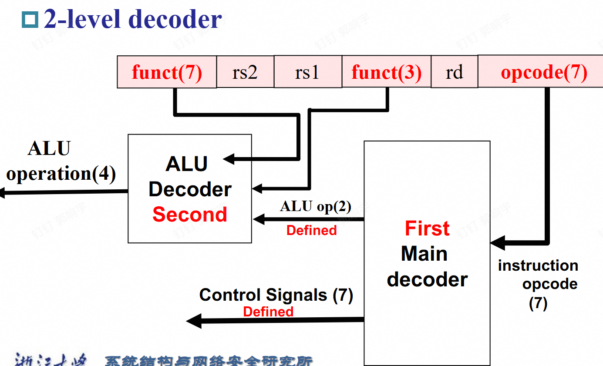

是一个两级译码器

#### 第一级

输入只有opcode7位 输出是ALU op2位 MUX 4位 R/W 三位

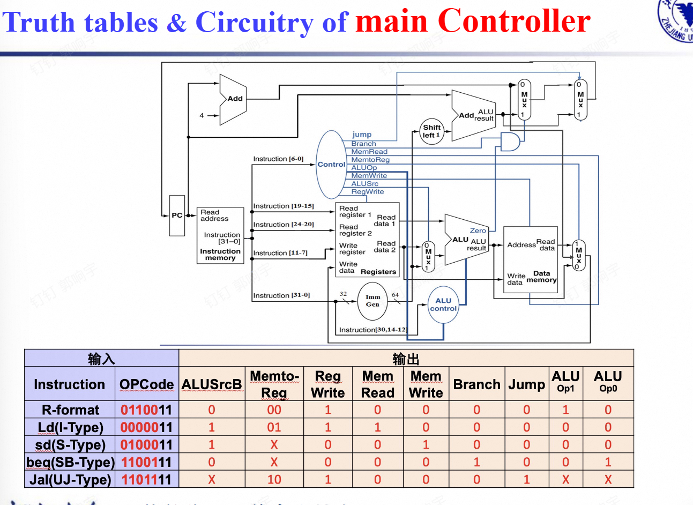

看一看真值表吧

可以看到 通过opcode 我们可以判断ALU 控制的前两位 但后两位（3 4）还是要通过function code

#### 第二级

第二级主要是在R-type的function code上进行译码 决定是加还是减法

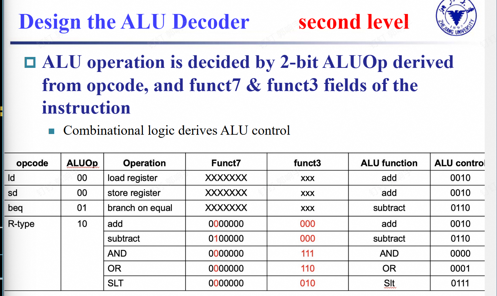

## PPT 最后几页有完整数据通路

## 需要的时间

一般是有这样几个模块 需要时间的（组合逻辑）

获取指令 读寄存器 alu 读内存（写内存） 写寄存器

我们知道这就是之前5个阶段

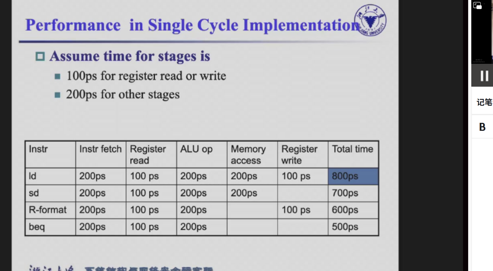

但是有没有人觉得这样 有点太耗时了 你的一个周期要比5个stage加起来的长！。

那就有请我们的流水线处理器！

下一课。

## 有一类算时间的题

我要说明几个点

1.PC寄存器和寄存器堆都是下一个时钟沿才更新
2.算时间的时候，注意只算真正的数据的通路的时间就行了
3.有时候给的寄存器的访问时间 是读或者写都是这个时间
4.数据存储器的时钟一般是和cpu反过来的，这样在流水线的时候可以实现上半个周期写 下半个周期读
