# 流水线处理器

流水线处理器就是说 我们一个时钟周期 只对应一个阶段 但是!  我们每个模块都可以处理一个指令的某一个阶段。

所以 指令就像流水线一样进来。

**RISC-V处理器的五级流水线结构**，以下是每一级的具体含义：

- **IF（Instruction Fetch，取指阶段）**：从内存中获取待执行的指令。
- **ID（Instruction Decode & Register Read，译码/读寄存器阶段）**：解析指令的含义，同时读取指令中涉及的寄存器的值。
- **EX（Execute operation or calculate address，执行/地址计算阶段）**：执行算术逻辑运算（如加减、比较等），或为内存访问计算地址。
- **MEM（Access memory operand，访存阶段）**：读写内存中的数据（如加载、存储操作）。
- **WB（Write result back to register，写回阶段）**：将运算结果或从内存中读取的数据写回寄存器。

这种**五级流水线**的设计让处理器可以并行处理多条指令的不同阶段，从而大幅提升执行效率。

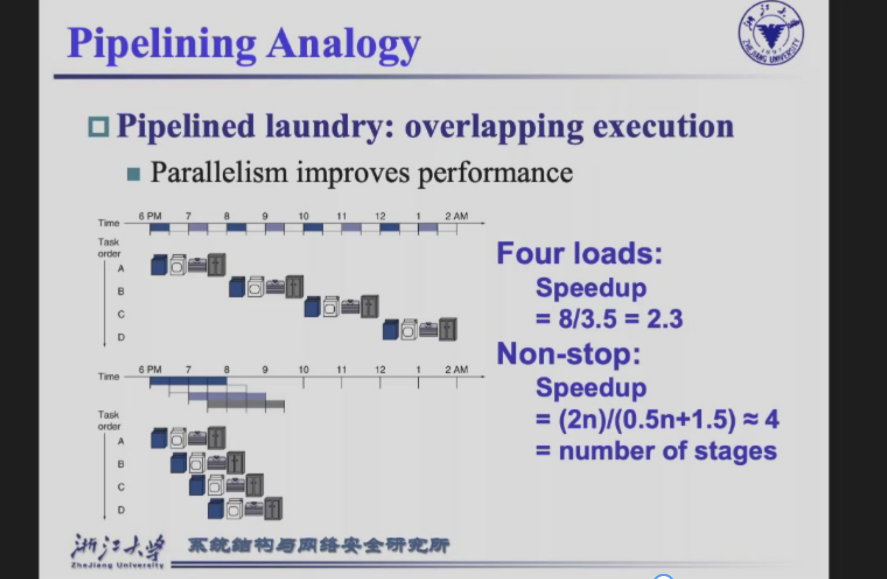

这里有一张图 可以看出流水线的好处

同时这里的效率提升倍数==指令阶段数量是个结论！

## 概述

这页PPT在讲解**RISC-V指令集的流水线工作机制**，核心是通过“多指令分阶段并行执行”来提升性能，具体内容如下：

### 1. 流水线的并行逻辑

由于RISC-V指令执行分为**IF（取指）、ID（译码）、EX（执行）、MEM（访存）、WB（写回）五个独立阶段**，因此可以构建一条流水线，**让不同指令的不同阶段在同一时间并行执行**（每个阶段同时处理一条不同的指令）。

### 2. CPI（每条指令的时钟周期数）的优化

在理想流水线中，**每个时钟周期会有一条指令被发出（或完成）**，因此CPI（每条指令的时钟周期数）可以降低到**1**（原本串行执行时，一条指令可能需要5个周期，流水线让这个数值大幅降低）。

### 3. 流水线的时间-指令阶段分布（表格说明）

表格展示了不同指令（`Instruction i`、`i+1`、`i+2`等）在不同时钟周期（`Clock Number 1-9`）中所处的执行阶段：

- 例如，`Instruction i`在**时钟1**处于`IF`阶段，**时钟2**进入`ID`阶段，依此类推；
- `Instruction i+1`在**时钟2**开始`IF`阶段，**时钟3**进入`ID`阶段……
- 最终实现**“每个时钟周期，每个阶段都有一条不同的指令在执行”**，完全重叠各指令的执行阶段。

### 4. 性能提升的理想效果

在理想情况下，由于五个阶段并行执行，性能可以**提升5倍**（原本串行执行5条指令需要5×5=25个周期，流水线执行仅需5+4=9个周期，效率大幅提升）。

简言之，这页PPT通过原理、数据和表格，清晰展示了RISC-V五级流水线如何通过“指令阶段并行”实现CPI优化和性能跃升。

### 时钟周期

这里的时钟周期取最大的那个阶段的时间就好了

### 说明

其实单独一条指令的时间是没变的 流水线改变的是单位时间内完成的任务量->总的指令执行时间。

### 加速量

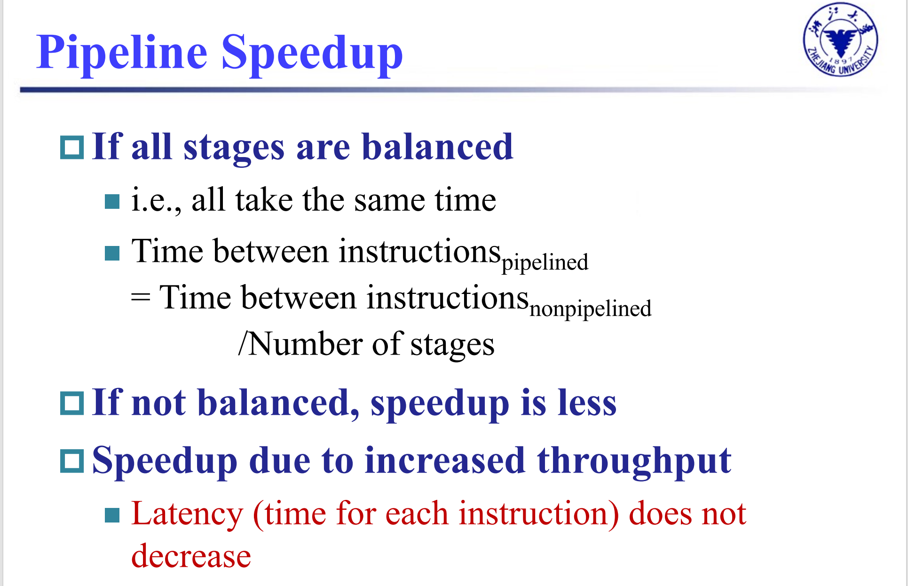

这里就是说流水线能提升多少倍速度

## 预备知识

### 5级hui流水线回顾

我们再来回顾一下：

1. IF: Instruction fetch from memory
2. ID: Instruction decode & register read
3. EX: Execute operation or calculate address
4. MEM: Access memory operand
5. WB: Write result back to register

### RISC-V为什么适合用流水线？

这张幻灯片的主题是**“流水线（Pipelining）与指令集架构（ISA）设计”**，重点讲解**RISC-V指令集架构是为流水线技术而设计的**，具体从以下几个方面说明：

- **所有指令均为32位**：
  - 优势是“更容易在一个周期内完成取指和译码”；
  - 对比x86架构（指令长度为1~17字节不等），RISC-V固定的指令长度让流水线的“取指”“译码”阶段更简单、高效。

- **指令格式少且规整**：
  - 可以“在一个步骤中完成译码和寄存器读取”，简化了流水线的译码逻辑，提升执行效率。

- **加载/存储寻址（Load/store addressing）**：
  - 流水线执行时，可在**第3阶段计算地址**，**第4阶段访问内存**，让加载/存储指令在流水线中的阶段划分更清晰，支持流水线的有序推进。

简言之，这张内容是在阐述RISC-V指令集架构如何通过自身设计（固定指令长度、规整格式、明确的访存阶段划分），适配并优化流水线技术，从而提升处理器的执行效率。

## 第一个重点：hazard

我们面对流水线处理器的时候，我们遇到一个问题，就是**hazard**，简单来说，就是当你用流水线执行的时候，不同指令有没有可能会相互干扰，该怎么解决呢。比如说你下个指令要取出上个指令更新的寄存器，但是如果是流水线，可能你下个指令取出的时候，上一个还没更新!

### 不同的hazard

这张幻灯片在讲解**流水线技术中，阻止“下一条指令在下一个周期启动”的三类情况（即流水线冒险）**，具体如下：

- **整体主题**：`Situations that prevent starting the next instruction in the next cycle`（阻止在下一个周期启动下一条指令的情况）。
- **结构冒险（Structure hazards）**：因**所需硬件资源正被占用**（`A required resource is busy`）导致，比如存储器、功能单元等被多条指令同时争抢。
- **数据冒险（Data hazard）**：因**需要等待前一条指令完成数据的读/写操作**（`Need to wait for previous instruction to complete its data read/write`）导致，比如后一条指令依赖前一条的运算结果，但前一条还未完成计算。
- **控制冒险（Control hazard）**：因**控制操作的决策依赖于前一条指令**（`Deciding on control action depends on previous instruction`）导致，比如分支指令（需等分支结果确定后，才能知道下一条该取哪条指令）。

### 结构冒险

就是硬件资源占用的冲突

例子：

- **场景示例（RISC-V流水线+单块内存）**：
  - 加载/存储（Load/store）指令需要访问**数据内存**；
  - 同时取指令（Instruction fetch）会因内存被占用而**停滞（stall）**，进而产生流水线“气泡（bubble）”（即流水线空转，效率下降）。
- **解决方法**：`pipelined datapaths require separate instruction/data memories`（流水线数据通路需要分离的**指令内存和数据内存**），或分离的指令缓存与数据缓存，以此避免资源冲突。

### 数据冒险

我们看个例子吧

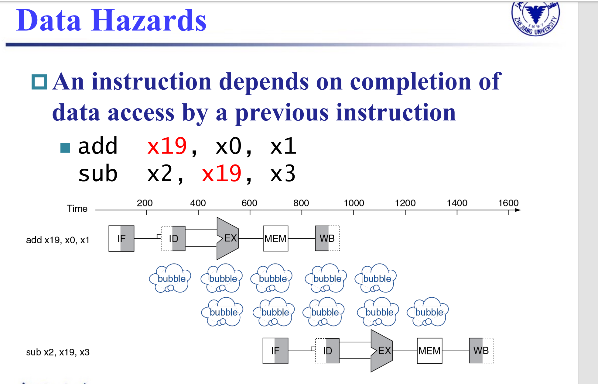

这里两条指令 后面那个要用前面的结果 我们看下面的流水线 可以知道 因为前一个的结果在wb才完成 所以后一个要空出两条指令的位置。

**同时这里有个魔鬼细节** 我们发现id是在周期后半个 wb在前半个 因为这样子可以让下一个的id能在同一周期取到wb更改过的结果

哪有什么办法解决呢

### forwarding

简单来说 就是单独搞一个数据通路出来，就是你ALU计算出的结果直接就给我下一条指令吧

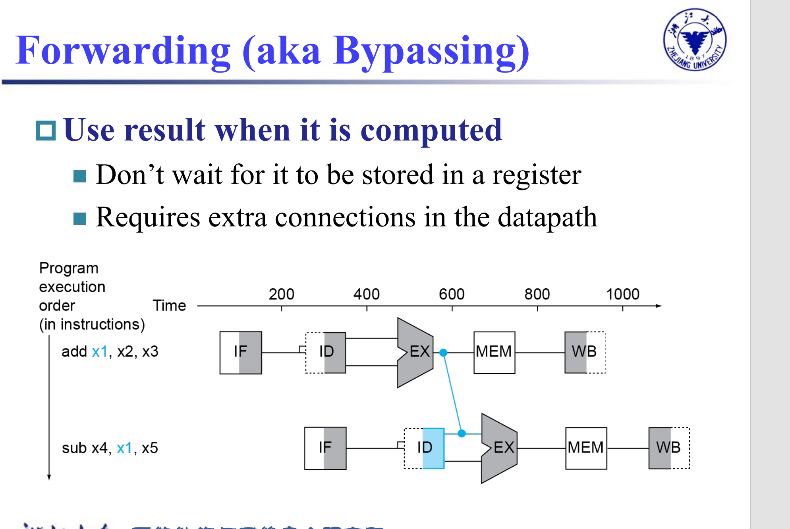

但是这样也不一定就能把所有stall消除了。比如这个例子还是要等一个。

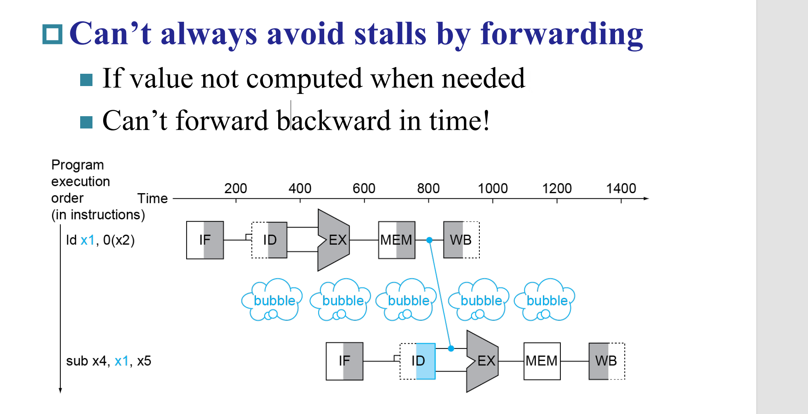

**注意时间可不能倒流着传值哦**

### code schedule

就是改一下指令的顺序 这样子消除stall

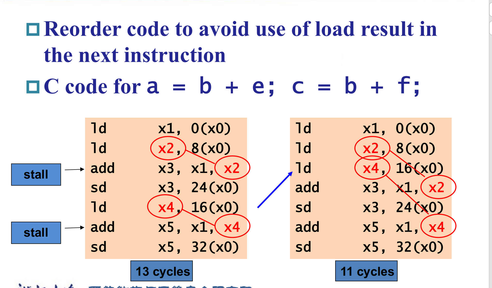

原本的写法是7+4+2=13个stall 但是改了之后就变成了 7+4=11个

就是先ld 再add sub这些 相当于原来空的位置用其他的ld填上了

### control hazard

核心内容如下：

- **分支指令决定控制流（Branch determines flow of control）**
  - 取“下一条指令”的操作依赖于**分支指令的执行结果**；
  - 流水线因此“无法总是取到正确的下一条指令”——因为此时分支指令还在**译码（ID）阶段**处理，控制流的走向尚未确定。

- **在RISC-V流水线中的应对**
  - 需要**在流水线早期（提前）完成寄存器比较和目标地址计算**；
  - 具体做法是在**译码（ID）阶段增加硬件**，来支持上述提前处理的操作。

简言之，它阐述了“分支指令导致控制流不确定，进而引发流水线取指错误”的控制冒险问题，以及RISC-V通过在译码阶段提前处理分支相关逻辑来应对该问题的思路。

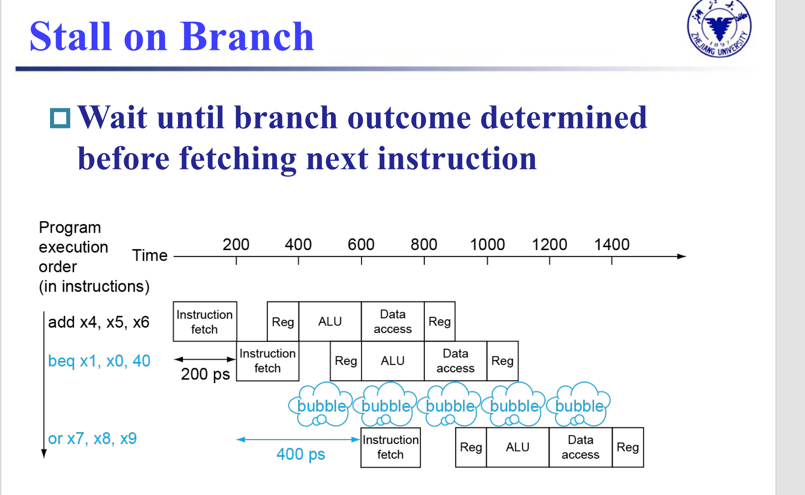

### 解决分支预测

就是预测 先假设不跳转

这张幻灯片讲解的是**“分支预测（Branch Prediction）”**，核心内容如下：

- **分支预测的必要性**
  更长的流水线**难以提前确定分支指令的执行结果**（即分支是否跳转），若等待结果再取后续指令，会导致“停滞代价（Stall penalty）”过高，无法接受。

- **分支预测的策略**
  通过**预测分支的执行结果**，仅在**预测错误时**才让流水线停滞，以此减少不必要的空转，提升流水线效率。

- **RISC-V流水线中的分支预测**
  采用“**预测分支不跳转**”的策略，从而可以**无延迟地获取分支指令之后的下一条指令**，尽可能避免流水线停滞。

### 进阶版

1. 静态分支预测

就是基于分支的种类来决定预测结果

比如在loop和if的预测中 我们预测往前的指令会执行 往后的不会

2. 动态分支预测

动态分支预测（Dynamic branch prediction）

- 由硬件测量分支的实际行为（例如记录每个分支的近期历史）；

- 假设 “未来行为会延续历史趋势”，若预测错误，会在重新取指令时停滞，并更新历史记录.

## pipeline datapath

我们先来看看 一个之前的datapath图

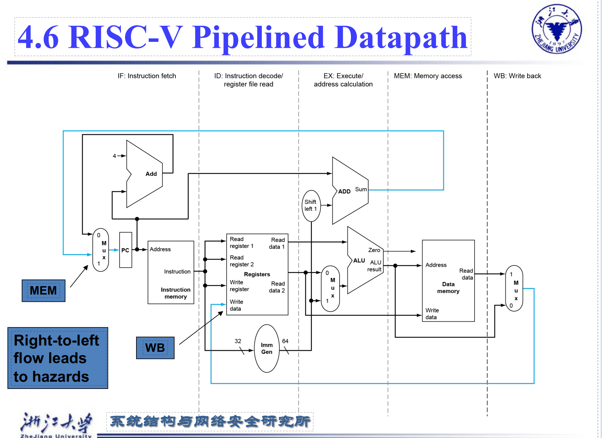

我们可以发现 其实冲突就是发生在从右往左回传的时候！其实也很好理解，因为你这个东西可能会改变之前模块的值，才会导致后面的指令调用的问题

### pipeline register

因此，在流水线中，我们在每个模块需要寄存器，把这个模块的结果存下来。其作用是保存上一个周期产生的信息，确保指令在不同阶段间的信息传递准确且不受干扰。

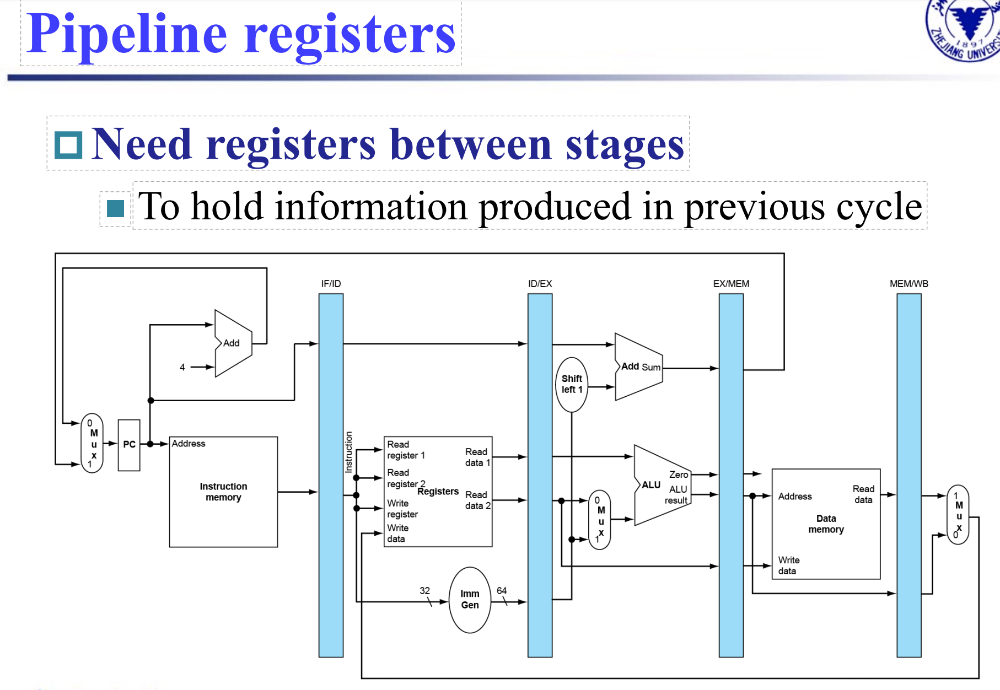

### 这里有一个小例子 可以看看寄存器存了什么

流水线寄存器的核心作用是**在流水线的不同阶段之间暂存信息、实现阶段隔离**，确保指令在“并行执行的各阶段”之间能准确传递数据，同时避免不同阶段的操作互相干扰。

我们以**加载指令（如 `lw x1, 4(x2)`，即将 `x2 + 4` 地址处的内存数据加载到 `x1` 寄存器）**的执行过程为例，看看流水线寄存器的具体作用：

#### 1. IF/ID 寄存器（取指→译码阶段的桥梁）

- **取指阶段（IF）**：从指令内存中取出 `lw x1, 4(x2)` 这条指令，同时计算下一条指令的地址。
- **作用**：将“取出的指令”“当前PC值”等信息存入 **IF/ID寄存器**，传递给**译码阶段**，同时隔离取指和译码阶段的操作（比如取指阶段下一个周期要处理新指令，不会干扰当前指令的译码）。

#### 2. ID/EX 寄存器（译码→执行阶段的桥梁）

- **译码阶段（ID）**：从IF/ID寄存器中取出指令，解析出需要读取的寄存器 `x2`，读取其值，同时计算地址偏移（`4`）。
- **作用**：将“`x2` 的值”“偏移量 `4`”“目标寄存器 `x1` 的标识”等信息存入 **ID/EX寄存器**，传递给**执行阶段**，确保执行阶段能拿到译码后的所有必要数据。

#### 3. EX/MEM 寄存器（执行→访存阶段的桥梁）

- **执行阶段（EX）**：从ID/EX寄存器中取出 `x2` 的值和偏移量 `4`，执行加法运算得到内存地址（`x2 + 4`）。
- **作用**：将“计算出的内存地址”“目标寄存器 `x1` 的标识”等信息存入 **EX/MEM寄存器**，传递给**访存阶段**，让访存阶段能精准访问内存地址。

#### 4. MEM/WB 寄存器（访存→写回阶段的桥梁）

- **访存阶段（MEM）**：从EX/MEM寄存器中取出地址，访问数据内存，读取对应地址的数据。
- **作用**：将“读取到的内存数据”“目标寄存器 `x1` 的标识”存入 **MEM/WB寄存器**，传递给**写回阶段**，最终完成数据向寄存器的写入。

总结来说，流水线寄存器就像“阶段之间的快递员”——每个阶段完成一部分工作后，把结果交给寄存器暂存，再由寄存器传递给下一个阶段，同时保证不同阶段的操作不会互相干扰，让流水线能高效、有序地并行执行多条指令。

### 流水线的操作

一般流水线操作我们会用两种图来表示

核心内容是关于**指令在流水线数据通路中逐周期流动的可视化分析方式**，具体如下：

- **指令在流水线中的逐周期流动**
  介绍了两种流水线图的类型：

  - **“单时钟周期”流水线图**（“Single-clock-cycle” pipeline diagram）：展示**单个时钟周期内**流水线的资源使用情况，突出各阶段用到的硬件资源。
  - **“多时钟周期”图**（“multi-clock-cycle” diagram，用于对比）：以时间为维度，呈现流水线操作的动态变化过程。

### 单时钟周期流水线图

PPT有很详细的图

我们要注意的就是那个修改 就是LD写回寄存器的寄存器编号要一直传递，因为执行到写回的时候，前面的译码结果的寄存器早就不是你这个了。这就看出来了寄存器的作用吧。

### 多时钟周期流水线图

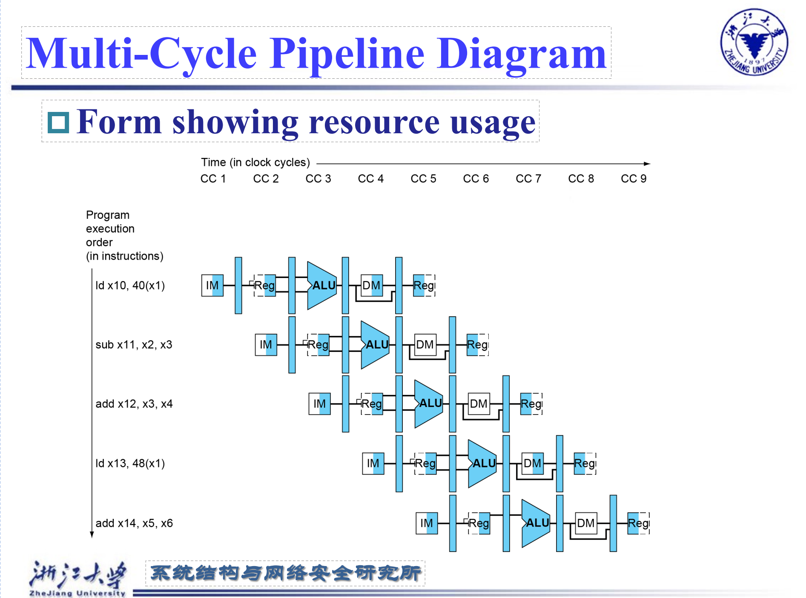

这就描述一个全局的情况咯。

### 控制信号

好，我们现在有一个重大问题需要解决，就是控制信号怎么办，因为你下一个指令来的时候，控制信号全变了。

解决办法也有，就是之前的寄存器，我们只要把控制信号放在寄存器里面，一个一个传下去不就好了，这也可以再次看出寄存器的作用！

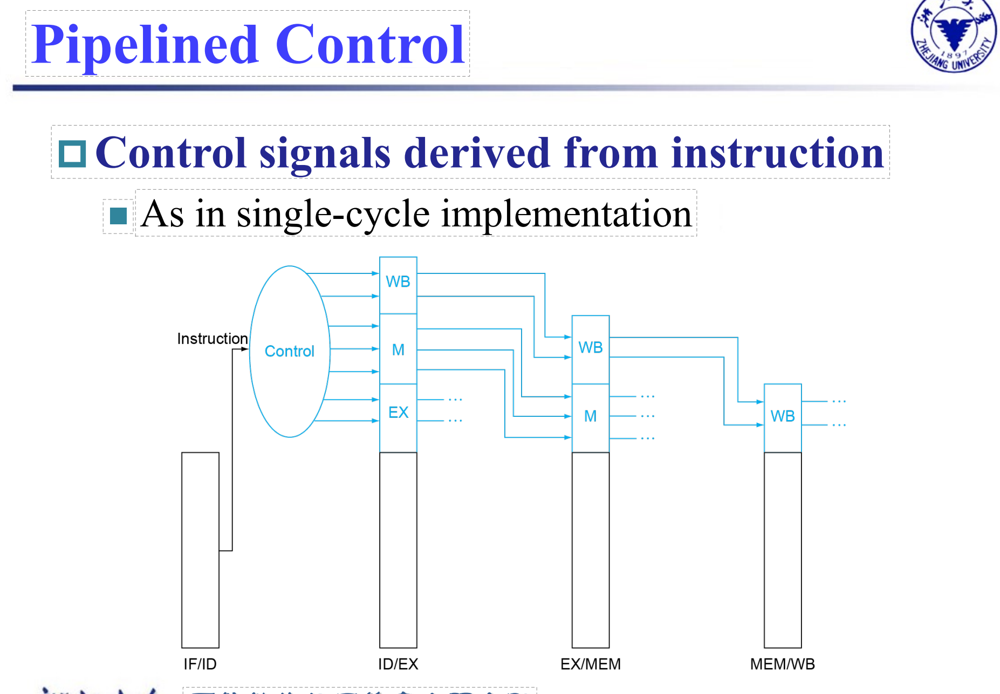

但是呢，再这一级用完的控制信号，我们就不会往下传了

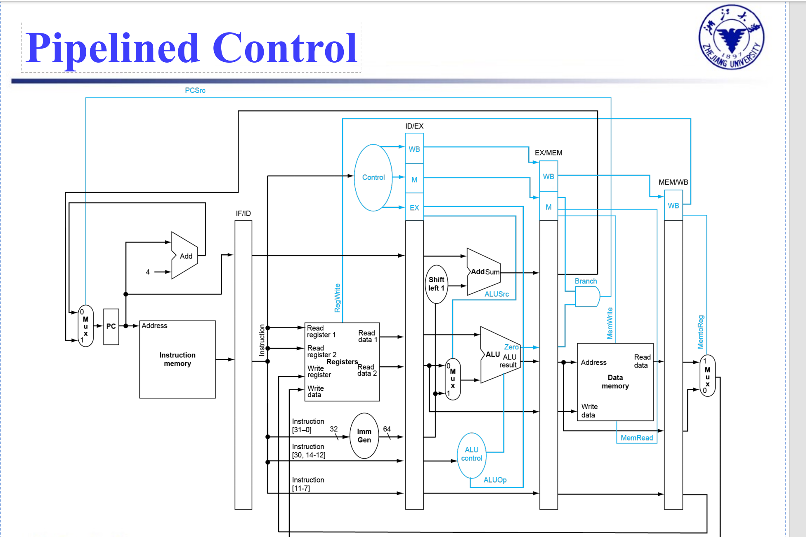

看看成品吧，真是复杂

## 数据竞争

怎么又回来讲呢，我们这里是讲讲之前的数据转发的解决方式到底是怎么实现的，肯定有决策是否进行数据转发的控制模块吧。

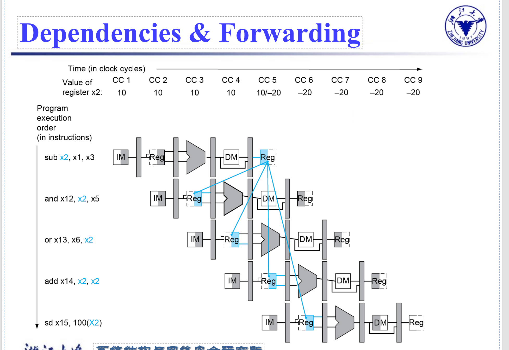

看个例子，这个就是说前三条指令存在数据冒险

这页幻灯片讲解的是**“检测数据转发的需求（即如何判断需要用‘转发/旁路’技术解决数据冒险）”**，核心逻辑是通过对比流水线各阶段寄存器的编号，识别数据依赖并触发转发操作，具体如下：

### 检测方法

#### 1. 寄存器编号的流水线传递

需要**将寄存器编号沿着流水线各阶段传递**，例如 `ID/EX.RegisterRs1` 表示存放在 `ID/EX` 流水线寄存器中、指令的第一个源寄存器（Rs1）的编号。这样后续阶段能明确“需要哪些寄存器的数据”。

#### 2. 执行阶段（EX）的ALU操作数来源

执行阶段（EX）的ALU操作数对应的寄存器编号，由 `ID/EX` 阶段的 `RegisterRs1` 和 `RegisterRs2` 提供（即当前指令的两个源寄存器编号）。

#### 3. 数据冒险的检测条件（即需要转发的场景）

当满足以下条件时，会出现数据冒险，需要通过**转发（从中间流水线寄存器直接传递数据）**来解决：

- **从 `EX/MEM` 流水线寄存器转发**：
  - 1a. `EX/MEM.RegisterRd`（前一条指令的目标寄存器编号）等于 `ID/EX.RegisterRs1`（当前指令的第一个源寄存器编号）；
  - 1b. `EX/MEM.RegisterRd` 等于 `ID/EX.RegisterRs2`（当前指令的第二个源寄存器编号）；
- **从 `MEM/WB` 流水线寄存器转发**：
  - 2a. `MEM/WB.RegisterRd`（更前一条指令的目标寄存器编号）等于 `ID/EX.RegisterRs1`；
  - 2b. `MEM/WB.RegisterRd` 等于 `ID/EX.RegisterRs2`；

简言之，这页内容是通过“对比不同流水线阶段的寄存器编号”，来识别**数据依赖关系**，进而确定是否需要“转发（旁路）”技术来避免流水线停滞，提升执行效率。

其实我再解释一下 就是你后面的模块的目标寄存器如果是前面的源寄存器，那么就炸了，因为你本来要更新的还没更新，但人家已经要读了。

#### 提醒

- **条件1：转发的指令必须要写寄存器**
  只有当产生转发数据的指令存在“写寄存器”的操作时，才需要考虑转发。需通过检查 `EX/MEM.RegWrite` 和 `MEM/WB.RegWrite` 这两个控制信号，确认该指令是否会向寄存器写入数据。

- **条件2：目标寄存器不是x0**
  因为RISC-V的`x0`是零寄存器（值恒为0，不会被修改），所以只有当指令的目标寄存器 `Rd ≠ x0` 时，才需要转发。需检查 `EX/MEM.RegisterRd ≠ 0` 和 `MEM/WB.RegisterRd ≠ 0`。

### PPT有转发的数据通路和条件判断代码

### 特殊情况

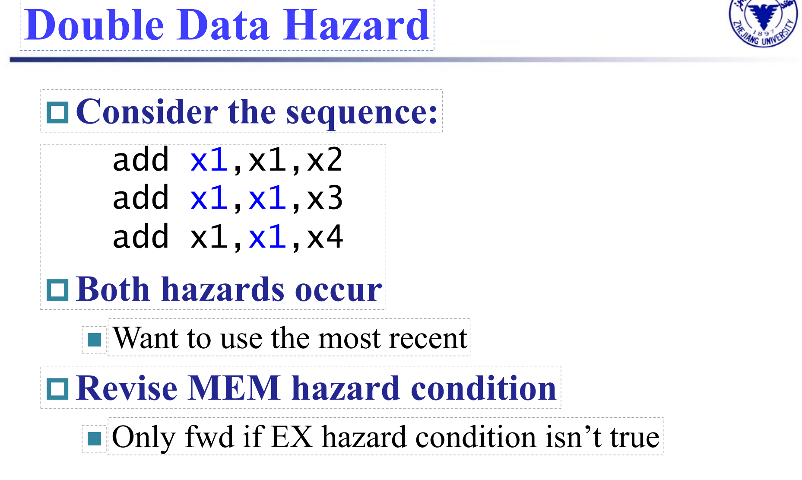

这样子就会同时出现mem和ex的冒险

我们这个时候应该取最近的哦 因此就是规定只有当执行阶段的冒险条件不成立时，才从访存阶段（MEM）进行转发。这样保证了 “最新数据优先” 的原则，避免数据依赖导致的错误

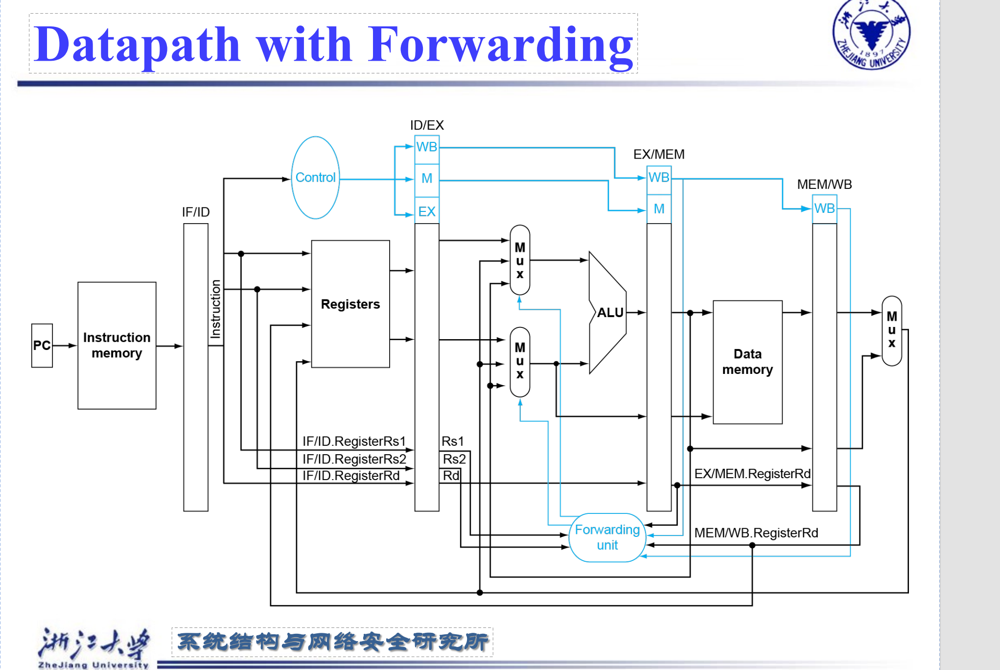

最后超级版

### load中造成的数据问题

这页幻灯片讲解的是**“加载-使用冒险检测（Load-Use Hazard Detection）”**，属于流水线中数据冒险的一种特殊场景，核心是识别“加载指令的结果被下一条指令立即使用”的情况并处理，具体如下：

#### 1. 检测时机

当**“使用数据的指令”处于译码阶段（ID stage）**时，进行加载-使用冒险的检测。

#### 2. 源寄存器编号来源

在译码阶段，ALU操作数对应的寄存器编号由 `IF/ID` 流水线寄存器中的 `RegisterRs1` 和 `RegisterRs2` 提供（即当前译码指令的两个源寄存器编号）。

#### 3. 加载-使用冒险的检测条件

当满足以下两个条件时，存在加载-使用冒险：

- 上一条指令是加载指令（即 `ID/EX.MemRead` 为真，表明该指令正在访存阶段读取内存）；
- 该加载指令的目标寄存器 `ID/EX.RegisterRd` 等于当前译码指令的**第一个源寄存器 `IF/ID.RegisterRs1`**，**或者**等于**第二个源寄存器 `IF/ID.RegisterRs2`**（即当前指令要使用加载指令的结果）。

#### 4. 冒险的处理方式

若检测到加载-使用冒险，流水线会**停滞（stall）**并**插入气泡（bubble）**（即空操作），避免数据错误。

这里其实是对应之前那张图，等一轮之后，就可以用回传了哦

具体操作如下

#### 1. 插入空操作（NOP）

- “Force control values in ID/EX register to 0”：强制将 `ID/EX` 流水线寄存器中的**控制信号值置为0**。
- 效果：使 `EX`（执行）、`MEM`（访存）、`WB`（写回）阶段执行 `nop`（无操作），相当于在流水线中插入“气泡”，避免错误操作。

#### 2. 阻止指令流更新

- “Prevent update of PC and IF/ID register”：阻止**程序计数器（PC）**和 `IF/ID` 流水线寄存器的更新。
  - “Using instruction is decoded again”：当前需要使用的指令会被**重新译码**；
  - “Following instruction is fetched again”：后续的指令会被**重新取指**；
  - “1-cycle stall allows MEM to read data for ld”：一个周期的暂停，让 `MEM` 阶段有时间为**加载指令（ld）**读取内存数据，之后可以将数据**前推（forward）**到 `EX` 阶段，解决数据依赖。

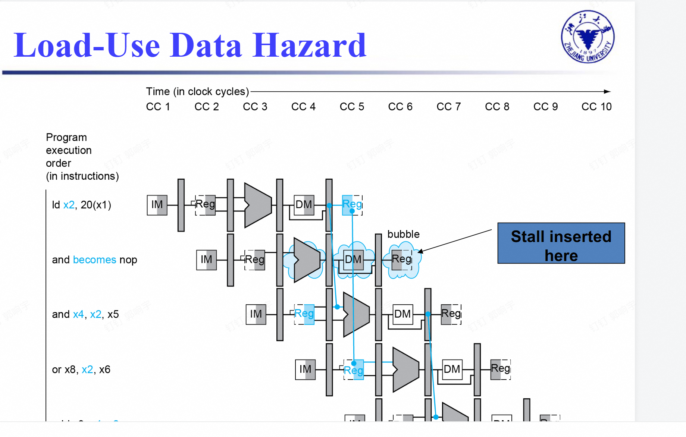

## branch冒险（控制冒险）

就是说 branch指令会改变PC，那么就会产生冒险，因为你判断是否跳转的时候，后面的指令可能都执行了几步了。这样不就白干了吗？

### 解决方案1：前调

我们直接把比较相关的硬件移动到ID stage，直接在ID阶段把事情都干了。

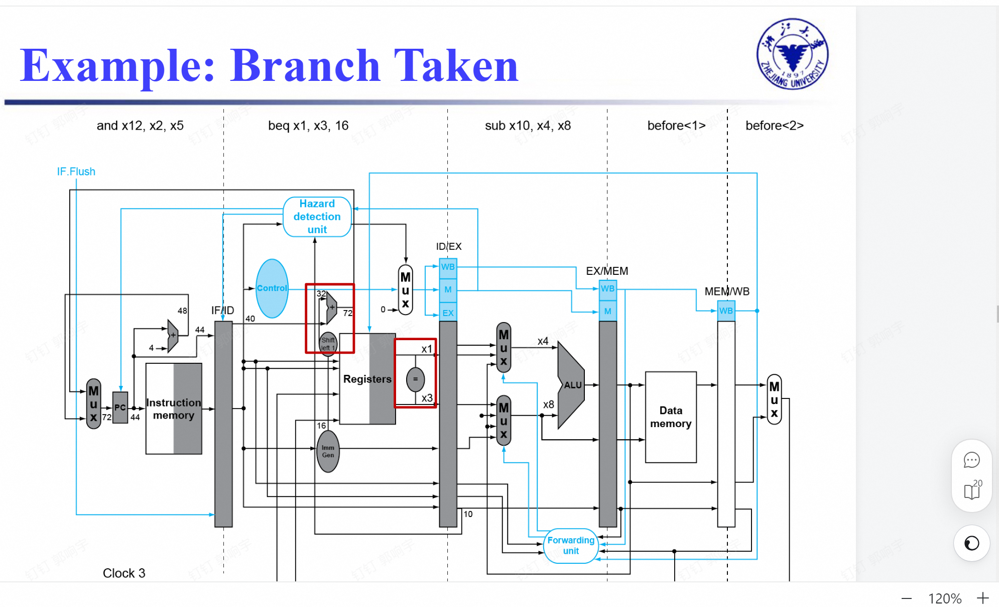

就是这里。

但这里还是浪费了一个周期，但是，同时，增加了ID stage的复杂度。（这样子就要把流水线停下来，控制信号置零，重新取地址）

### 解决方案2:预测

#### 1. 分支惩罚的显著性

“In deeper and superscalar pipelines, branch penalty is more significant”
在**更深的流水线**（如多阶段流水线，阶段数多）和**超标量流水线**（可同时执行多条指令）中，分支指令带来的**性能损失（分支惩罚）**会更突出：

- 深流水线中，分支判断的延迟会导致更多周期的停顿；
- 超标量流水线中，分支预测错误会引发大量错误指令的执行与丢弃，代价更大。

#### 2. 动态预测的实现方法

“Use dynamic prediction” 采用**动态预测**策略，基于分支指令的**历史执行结果**预测其行为，具体包括：

- **分支预测缓冲区（Branch Prediction Buffer，又称分支历史表Branch History Table）**：硬件存储结构，记录分支指令的执行历史。
- **索引方式**：“Indexed by recent branch instruction addresses” —— 以**最近分支指令的地址**为索引，查找其历史结果。
- **存储内容**：“Stores outcome (taken/not taken)” —— 存储分支的执行结果（`taken` 表示“跳转”，`not taken` 表示“不跳转”）。

#### 3. 分支指令的执行流程（基于动态预测）

“To execute a branch” 执行分支指令时，流程如下：

- 检查预测表：“Check table, expect the same outcome” —— 查找预测表，期望当前分支结果与历史一致；
- 提前取指：“Start fetching from fall-through or target” —— 根据预测结果，从“不跳转的后续地址（fall-through）”或“跳转目标地址（target）”提前取指；
- 错误处理：“If wrong, flush pipeline and flip prediction” —— 若预测错误，**刷新流水线**（丢弃错误取指的指令），并**翻转预测结果**（更新预测表，提升后续预测准确率）。

但是像上面这样子，错了就换预测结果。不是特别好，比如你一个内部循环要错就会错两次。

可以该改成连续两次预测才会修改。

### 补充，计算分支目标地址

就是即使是预测分支 我们也要计算分支的目标地址，假如分支跳转，仍然会要等待到EX 阶段。

我们可以直接把目标地址给存下来，就是相当于存分支指令和目标地址的一个pair，这样如果是预测是跳转，我们就可以立即取指令。

这个用处一般是循环时候，同一条分支指令反复执行。

## Exception（ and interrupts（中断）

这里的东西不是很常考，只记录部分。

### 1. 核心定义：需要改变控制流的“意外事件”

“‘Unexpected’ events requiring change in flow of control”
指程序执行过程中**意外发生的事件**，迫使CPU改变原本的指令执行顺序（控制流）。

- 补充：“Different ISAs use the terms differently” —— 不同的**指令集架构（ISA，如x86、ARM）**对“异常”和“中断”的术语定义、划分略有差异。

### 2. 异常（Exception）

“Exception”是**CPU内部产生**的意外事件，例如：

- 未定义的操作码（`undefined opcode`）：CPU遇到不认识的指令编码；
- 系统调用（`syscall`）：程序主动请求操作系统服务（如读写文件、申请内存）；
- 其他示例：除零错误、内存访问越界等。

### 3. 中断（Interrupt）

“Interrupt”是**来自外部I/O控制器**的意外事件，例如：

- 硬盘完成数据读取后，向CPU发中断通知；
- 网卡收到网络数据包后，发中断请求CPU处理；
- 本质是外设主动“打断”CPU的正常执行，请求处理异步事件。

### 4. 处理的难点

“Dealing with them without sacrificing performance is hard”
在不牺牲CPU性能的前提下处理异常和中断是很困难的：

- 它们会迫使流水线停顿、刷新指令，若处理不当，会显著降低程序执行效率；
- 需在“及时响应”和“性能损耗”之间做权衡。

### 异常处理

这张PPT讲解的是**“处理异常（Handling Exceptions）”**的核心流程，以RISC-V架构为例，分为三个关键步骤：

### 1. 保存异常指令的程序计数器（PC）

“Save PC of offending (or interrupted) instruction”
需要保存**引发异常（或被中断）的指令的地址**，以便异常处理完成后能回到原执行点。

- 在RISC-V中，通过 **Supervisor Exception Program Counter（SEPC）寄存器** 来存储这个地址。

### 2. 保存异常类型的标识

“Save indication of the problem”
需要记录**异常的具体类型**，让处理程序知道“出了什么问题”。

- 在RISC-V中，通过 **Supervisor Exception Cause Register（SCAUSE）** 实现：
  - 该寄存器是64位，但多数位未使用；
  - 其中的**异常码字段（Exception code field）** 用于区分异常类型，例如：
    - 编码`2`表示“未定义操作码（undefined opcode）”；
    - 编码`12`表示“硬件故障（hardware malfunction）”等。

### 3. 跳转到异常处理程序

“Jump to handler”
将程序控制流跳转到**异常处理程序（handler）**，由它来处理具体的异常逻辑。

- 示例中假设处理程序的地址是 `0000 0000 1C09 0000`（十六进制）。

简言之，处理异常的流程是：**先记录“哪里出了问题（SEPC存地址）”和“出了什么问题（SCAUSE存类型）”，再跳转到专门的处理程序解决问题**。这是CPU处理内部意外事件的标准化流程。

### 向量中断

处理程序的入口地址由异常 / 中断的 “原因（cause）” 决定—— 不同类型的异常 / 中断，会对应不同的处理程序（handler），从而实现精准、高效的分流处理。

多异常先处理最先出现的。

## 并行ITP指令处理

流水线还不满意 我直接上并行。

### 1. 流水线与ILP的关系

“Pipelining: executing multiple instructions in parallel”
**流水线（Pipelining）** 是ILP的基础：它通过“指令分段执行”（如取指、译码、执行等阶段），实现**多条指令在不同阶段并行推进**（例如指令A在执行时，指令B在译码，指令C在取指）。

### 2. 提升ILP的两种方法

“To increase ILP” 为了提升指令级并行度，主要有以下两种策略：

#### （1）更深的流水线（Deeper pipeline）

- 逻辑：“Less work per stage ⇒ shorter clock cycle” —— 把流水线的每个阶段拆得更细，每个阶段的工作量减少，从而让**时钟周期更短**，单位时间能执行更多指令。

#### （2）多发射（Multiple issue）

通过“复制流水线硬件”，实现**多个流水线并行工作**，每个时钟周期可以启动多条指令：

- “Replicate pipeline stages ⇒ multiple pipelines” —— 复制取指、译码等流水线阶段，形成多条并行的子流水线；
- “Start multiple instructions per clock cycle” —— 每个时钟周期同时启动多条指令；
- 性能衡量：此时“每指令时钟周期数（CPI）”会小于1，因此改用**“每周期指令数（IPC）”** 衡量；
- 示例：“4GHz 4-way multiple-issue” —— 4GHz的4路多发射处理器，**峰值IPC=4**（每周期最多执行4条指令），峰值CPI=0.25，理论峰值性能为 `4GHz × 4 = 16 BIPS`（每秒160亿条指令）；
- 实际限制：“But dependencies reduce this in practice” —— 指令间的依赖关系（如数据依赖）会让实际性能低于峰值。

就是说，并行就是把流水线再复制一份，这样不就可以执行两条同时了。就是把什么ALU 取指令都复制一份。但是寄存器 内存公用

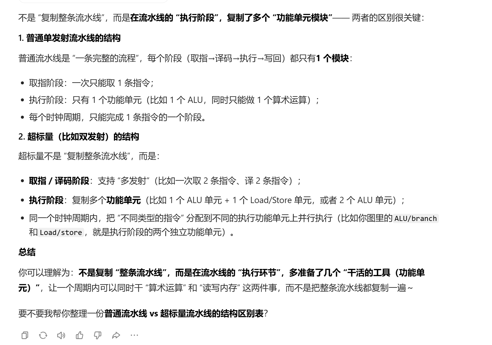

### 多发射（分组）

分为静态和动态，具体的看ppt吧。

其实就是一个由编译器提前分好，一个由cpu实时决定

### 预测

我们知道，我们分组也要防止有依赖关系，预测就是先猜没有依赖。

比如ld预测 beq预测。

编译器通过重排实现，硬件通过保存预测结果实现。

### 编译器调度静态多发指令

编译器必须消除（部分或全部）冒险（数据冒险、控制冒险等）：
重排指令组成 “发射包”，包内不能有依赖关系（否则无法并行）；包之间可能存在依赖（不同指令集架构规则不同，编译器需明确）。
必要时插入空操作（nop） 填充，保证发射包的结构有效。

不是所有指令都可以一起发射的！ ppt有例子

### 循环展开

这张PPT讲解的是**“循环展开（Loop Unrolling）”**技术，核心是通过“复制循环体+寄存器重命名”来提升并行性，逐点解析如下：

#### 1. 循环展开的核心逻辑

“Replicate loop body to expose more parallelism”
通过**复制循环体**，让原本在循环中串行执行的多轮操作，暴露出更多可并行执行的指令。

- 优势：“Reduces loop-control overhead” —— 减少循环控制的开销（如循环计数器增减、条件判断的次数）。

#### 2. 寄存器重命名的作用

“Use different registers per replication”
每次复制循环体时，**使用不同的寄存器**（即“寄存器重命名”），目的是：

- 避免“循环携带的反依赖（loop-carried anti-dependencies）”：例如“先存储（store）同一寄存器，再加载（load）该寄存器”的场景（也叫“名称依赖（name dependence）”，因寄存器名称重复使用导致的依赖）；
- 让多轮循环的指令可以真正并行执行，不被寄存器依赖限制。

简言之，循环展开是通过“复制循环体减少控制开销+寄存器重命名消除依赖”，从而**暴露更多并行性**，提升循环代码的执行效率。

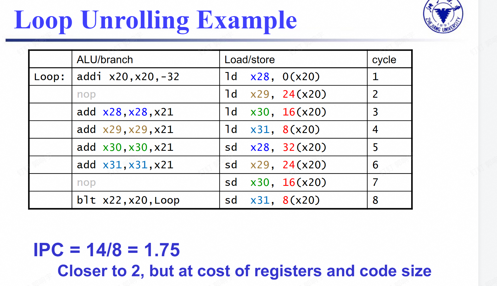

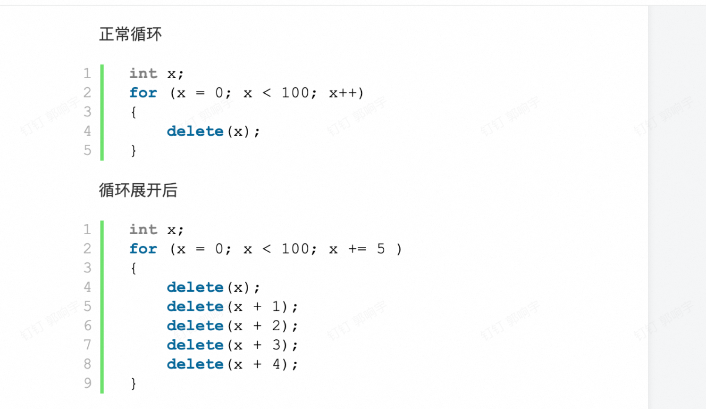

### 动态多发

见ppt
