# 内存层次结构与性能（Large and Fast: Exploiting Memory Hierarchy for Performance）

## large and fast

size:large enough to store program data

time:fast enough to catch up with the speed of the processor(IF MEM)

## 存储技术

### SRAM

核心是**回顾SRAM（静态随机存取存储器）的基础原理与特性**，搭配硬件结构图示辅助理解：

#### 1. 核心内容：SRAM的关键信息

- **标题与主题**：“Memories: Review”（存储技术回顾），聚焦SRAM；

- **SRAM的存储原理**：“value is stored on a pair of inverting gates”——数据存储在**一对CMOS反相门构成的触发器（锁存器）**中，这是SRAM“静态存储（无需刷新）”的硬件基础；
- **SRAM的特性**：“very fast but takes up more space than DRAM”——速度极快，但**占用的硬件空间比DRAM大**（对应之前说的“SRAM集成度低、容量难做大”）。

说白了 就是晶体管做的

### DRAM

这张PPT是“存储技术回顾”章节中关于**DRAM（动态随机存取存储器）**的核心讲解，聚焦DRAM的**存储原理、核心特性、读写操作流程**，同时搭配电路示意图辅助理解：

#### 1. DRAM的核心基础（存储原理+特性）

- **存储原理**：

  “value is stored as a charge on capacitor (must be refreshed)”
  DRAM的数据是**以“电容上的电荷”形式存储**（比如电容带电代表“1”，电荷流失代表“0”）；但电容会自然漏电，所以必须**定期刷新（Refresh）**才能保留数据——这也是“动态（Dynamic）”的由来（和SRAM“静态无需刷新”形成对比）。

- **核心特性**：
  “very small but slower than SRAM (factor of 5 to 10)”
  DRAM的存储单元体积极小（仅需1个晶体管+1个电容，即“1T1C”结构），因此集成度高、容易做大容量；但速度比SRAM慢5~10倍（因为电容充放电、刷新过程会增加延迟）。

### 2. DRAM的写操作（Write）

步骤：“Charge bitline HIGH or LOW and set wordline HIGH”

1. 先将**位线（Bit Line）**充电到“高电平（对应写1）”或“低电平（对应写0）”；
2. 再将**字线（Word Line）**置为高电平，控制晶体管导通；
3. 位线上的电荷会通过导通的晶体管，转移到电容中——完成数据写入。

### 3. DRAM的读操作（Read）

读操作流程更复杂（因为电容电荷很弱，需要放大检测），步骤如下：

1. 先把位线**预充电**到“高电平与低电平之间的中间电压”；
2. 将字线置为高电平，晶体管导通；
3. 电容中的电荷会与位线的预充电荷相互作用，使位线电压**轻微升高/降低**（比如电容带电→位线电压被拉高，电容无电→位线电压被拉低）；
4. 最后由**灵敏放大器（Sense Amp）**检测位线的微小电压变化，识别出存储的数据是“1”还是“0”。

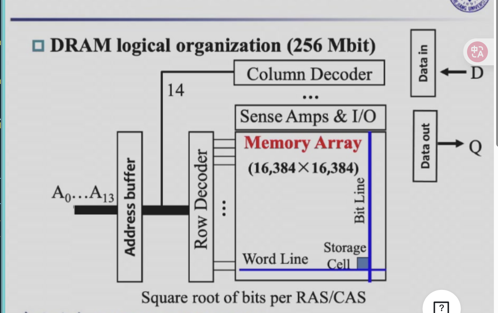

进化的还有DDR QDR

### flash 闪存

这张PPT是讲解**闪存（Flash Storage）**的核心属性与定位，属于“非易失性半导体存储”的范畴，核心是讲闪存的特点和在存储体系中的位置：

#### 1. 核心定义：非易失性半导体存储

“Nonvolatile semiconductor storage”是闪存的本质——**断电后数据不会丢失**（和机械硬盘、磁带等外存一样是“非易失性”，但区别于SRAM/DRAM这类“易失性”主存），同时基于半导体芯片实现（不是机械结构）。

#### 2. 闪存的核心特点

- **速度远快于磁盘**：“100×－1000× faster than disk”
  这里的“disk”指机械硬盘（HDD），闪存是半导体存储，没有磁头、盘片等机械部件，读写延迟和速度是机械硬盘的100~1000倍（比如固态硬盘SSD的速度通常是机械硬盘的100倍以上）。

- **物理特性更优**：“Smaller, lower power, more robust”
  - 体积更小（半导体芯片结构，没有机械部件）；
  - 功耗更低（适合手机、笔记本等移动设备）；
  - 更耐用（无机械磨损，抗震抗摔，比机械硬盘更坚固）。

- **成本定位**：“But more $/GB (between disk and DRAM)”
  闪存的**单位容量成本**介于“机械硬盘”和“DRAM（内存）”之间：比机械硬盘贵，但远低于DRAM（比如1TB机械硬盘几十元，1TB SSD几百元，1TB DRAM则要几千元）。

#### 总结

这张PPT的核心是：**闪存是“非易失性+半导体”的存储介质，特点是“比机械硬盘快/小/省电/耐用，但成本更高”，定位在机械硬盘（低成本大容量）和DRAM（高速易失）之间**，常见于手机存储、固态硬盘、存储卡等场景。

### disk 磁盘存储

这张PPT讲解的是**机械硬盘（Disk）的扇区结构与访问流程**，核心是拆解硬盘最基本的存储单元（扇区）的组成，以及访问一个扇区需要经历的步骤：

#### 一、硬盘扇区（Sector）的组成

扇区是机械硬盘的**最小存储单元**，每个扇区包含三类信息：

1. **Sector ID（扇区ID）**：扇区的唯一标识，用于硬盘定位到具体扇区；
2. **Data（数据）**：存储的实际内容，传统是512字节，现在主流提议用4096字节（即“4K扇区”，提升存储效率）；
3. **Error correcting code（ECC，纠错码）**：用于检测并修复数据存储/读取过程中出现的错误，同时可以掩盖硬盘物理缺陷导致的记录错误。

#### 二、访问一个扇区的完整流程

机械硬盘访问某个扇区需要经历多个步骤（这也是机械硬盘速度慢的根源）：

1. **Queuing delay（排队延迟）**：如果有其他访问请求在等待，当前请求需要排队；
2. **Seek（寻道）**：移动硬盘的磁头到目标扇区所在的磁道位置（机械移动，耗时最长）；
3. **Rotational latency（旋转延迟）**：等待硬盘盘片旋转，让目标扇区转到磁头下方；
4. **Data transfer（数据传输）**：将扇区的数据在硬盘与主机之间传输；
5. **Controller overhead（控制器开销）**：硬盘控制器处理请求、校验ECC等的额外耗时。

#### 总结3

这张PPT的核心是：**机械硬盘以“扇区”为最小存储单元，每个扇区包含ID、数据、纠错码；而访问扇区需要经历磁头移动、盘片旋转等机械步骤，这是其速度远慢于半导体存储（如闪存）的关键原因**。

ppt有一个计算题，需要记住

### 比较

SRAM和DRAM还有机械硬盘比较

| 存储技术               | 典型访问时间               | 每GB成本（2012年）|
|------------------------|----------------------------|-----------------------|
| 静态随机存取存储器（SRAM） | 0.5-2.5纳秒（ns）| 2000-5000美元         |
| 动态随机存取存储器（DRAM） | 50-70纳秒（ns）| 20-75美元             |
| 机械硬盘（Magnetic disk） | 5,000,000-20,000,000纳秒（ns） | 0.2-2美元             |

## 分层存储

### 程序局部性原理（内存层次结构设计的前提）

**内存层次结构的核心基础讲解——程序的“局部性原理”**（分为时间局部性、空间局部性），这是内存层次结构能提升性能的根本前提（正因为程序访问数据有规律，才可以用高速存储缓存常用数据）。

#### 第一张PPT：程序访问的局部性 + 时间局部性

1. **核心前提**：
程序在任意时刻，只会访问自己地址空间的**一小部分**（不是随机、分散地访问所有数据）。

2. **时间局部性（Temporal locality）**：

- 定义：**最近访问过的内容，大概率很快会被再次访问**。
- 例子：循环里的指令（比如嵌套循环的循环体，会被重复执行数千次）、循环变量（如i、j，每次循环都要读写）。
- 结合程序段：
  嵌套循环中，`i`和`j`会被反复修改/判断，`sum += a[i][j]`会被执行1000×200次——这些数据/指令属于“近期频繁访问”，是时间局部性的典型体现。

#### 第二张PPT：空间局部性

1. **空间局部性（Spatial locality）**：

- 定义：**最近访问过的内容“附近的内容”，大概率很快会被访问**。
- 例子：顺序执行的指令（指令在内存中是连续存放的，执行完一条会接着执行下一条）、数组数据（数组在内存中是连续存储的，访问一个元素后会接着访问相邻元素）。
- 结合程序段：
  二维数组`a`在内存中是“按行连续存储”的，访问`a[i][j]`后，会依次访问同一行的`a[i][j+1]`、`a[i][j+2]`…这些元素在内存里是相邻的，属于“附近内容会被连续访问”，是空间局部性的典型体现。

### 总结4

这两个局部性原理是“内存层次结构（寄存器→Cache→DRAM→硬盘）”的设计基础：
因为程序有局部性，所以可以把“最近用的（时间局部性）、附近的（空间局部性）”数据，放到速度快的存储（比如Cache）里，让CPU少访问慢速存储（比如硬盘），从而大幅提升整体性能。

### 局部性利用

刚刚说的其实也比较好猜了，我们利用局部性原理，可以把本质是把 “大容量但慢速” 的存储里的高频数据，逐级复制到 “小容量但高速” 的存储中（利用时间局部性 + 空间局部性），具体步骤：

基础存储层：所有数据先存在 **磁盘（容量最大、速度最慢）** 里；

第一层缓存（DRAM 主存）：把最近访问的、附近的内容从磁盘复制到更小的 DRAM 内存（即主存 / 运存）—— 因为局部性，这些数据大概率会被再次访问，而 DRAM 比磁盘快得多；

第二层缓存（SRAM 缓存）：再把更近期访问的、附近的内容从 DRAM 复制到更小的 SRAM 内存 —— 这部分就是 CPU 附带的 Cache（缓存），速度比 DRAM 更快，离 CPU 更近。

### 金字塔结构

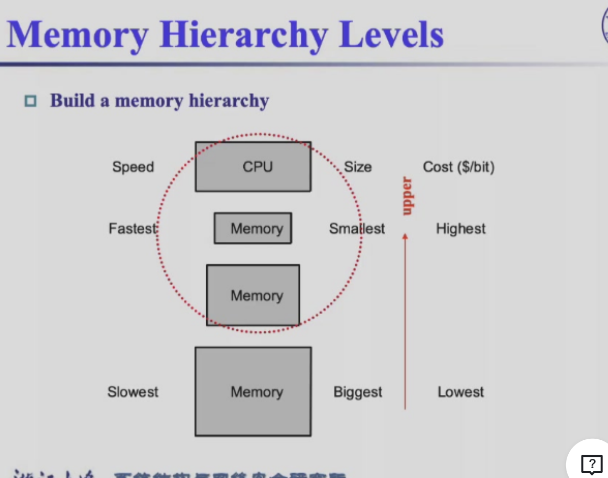

### some important item

**内存层次结构的核心术语**（Block、Hit/Miss、Hit Time、Miss Penalty），这些是衡量内存层次性能的关键概念，结合内存层次的“逐级缓存”逻辑来理解更清晰：

### 第一张PPT：核心术语（Block、Hit、Miss）

1. **Block（块，也叫line）**
   - 定义：内存层次中**数据复制的最小单元**（不是单个字节/字，而是包含多个字的“块”）——这是为了利用“空间局部性”（附近数据会被连续访问），复制整个块比单个数据更高效。

2. **Hit（命中）**
   - 场景：CPU要访问的数据**已经存在于高层存储**（比如Cache里有需要的数据）（就不用再从低的调过来了）；
   - 命中率（Hit ratio）：命中次数 ÷ 总访问次数（命中率越高，内存层次性能越好）。

3. **Miss（缺失）**
   - 场景：CPU要访问的数据**不在高层存储**；
   - 流程：需要把对应的数据块从低层存储（比如DRAM主存）复制到高层存储（比如Cache），再供给CPU；
   - 缺失损失（Miss penalty）：处理缺失的总时间（从低层复制块+传给CPU的时间）；
   - 缺失率（Miss ratio）：缺失次数 ÷ 总访问次数 = 1 - 命中率。

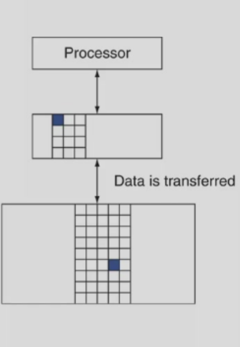

#### 第二张PPT：术语的更精确定义

1. **Hit/Miss的本质**
   - Hit：CPU访问**高层存储成功**（数据存在）；
   - Miss：CPU访问**高层存储失败**（数据不存在）。

2. **Hit time（命中时间）**
   - 访问高层存储的总时间（包括“判断是否命中”+“读取数据”的时间）——比如Cache的命中时间就是CPU访问Cache的延迟。

3. **Miss penalty（缺失损失）**
   - 处理缺失的完整时间：包含“把低层存储的对应块复制到高层存储”+“将该块数据传给CPU”的总耗时——这是内存层次性能的主要瓶颈（比如Cache缺失后，要等主存的块复制过来，耗时远长于Hit time）。

#### 结合内存层次的例子（比如Cache→DRAM→磁盘）

比如CPU访问Cache：

- 若数据在Cache里（Hit）：直接用Hit time（比如1ns）拿到数据；
- 若数据不在Cache里（Miss）：需要从DRAM复制对应块到Cache（花Miss penalty，比如50ns），之后再从Cache拿数据。

## Cache(缓存)--sram

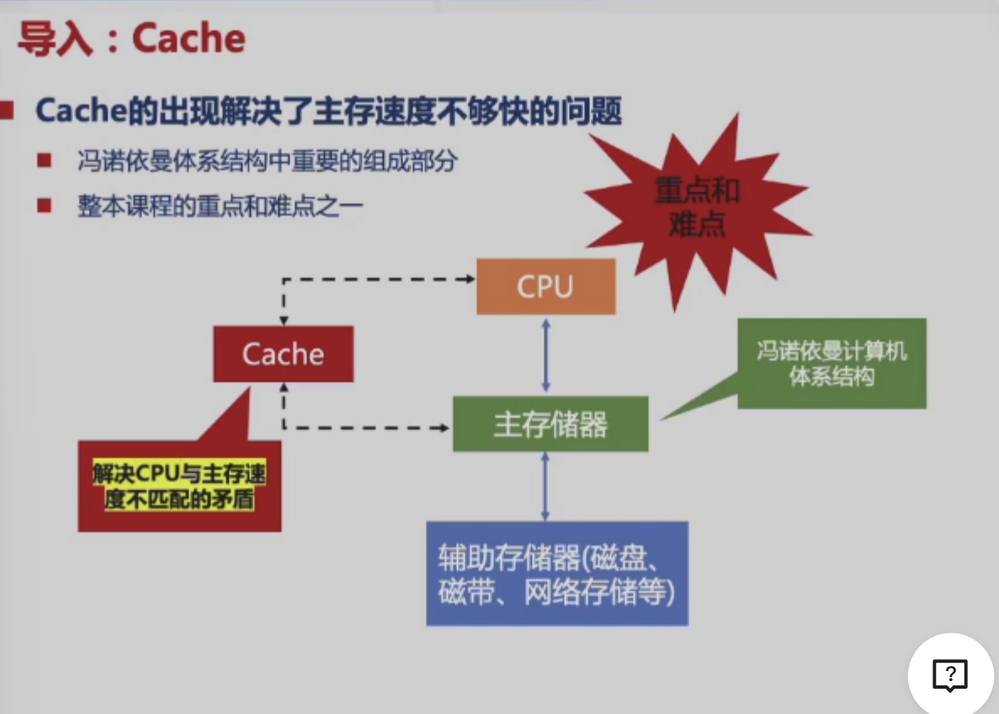

### Cache的基本概念

这张PPT是**Cache（缓存）的基础实现讲解**，核心介绍“直接映射缓存（Direct Mapped Cache）”的核心特点，以及缓存设计的两个核心问题：

#### 1. Cache的“简单实现”（直接映射的核心特点）、

这里讲的是**直接映射缓存**的规则：

- 对于**低层存储（比如DRAM主存）**中的每个数据项，在Cache里**恰好只有一个固定位置**可以存放它；
- 副作用：低层的很多数据项会“共享”Cache里的同一个位置（**要不然sram和dram一样大了**）——比如主存中多个不同的数据块，只能对应Cache里的同一个位置，新数据到来时会替换掉该位置原有的旧数据（右侧图a→图b展示了这个过程：访问Xn后，Xn替换了Cache中对应位置的原有数据）。

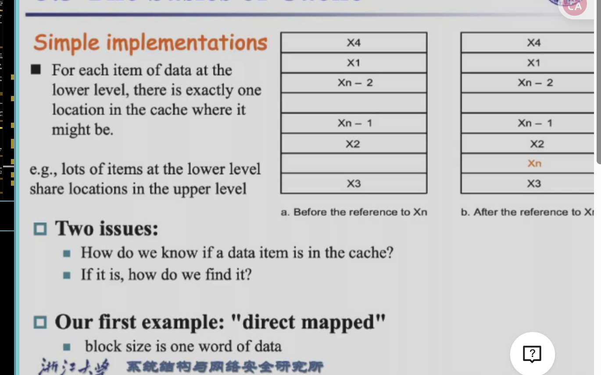

#### 2. Cache设计的两个核心问题

不管哪种Cache实现方式，都需要解决这两个问题：

- 问题1：如何判断“某个数据项是否在Cache里”？
- 问题2：如果数据在Cache里，如何快速定位到它的位置？

### 工作原理

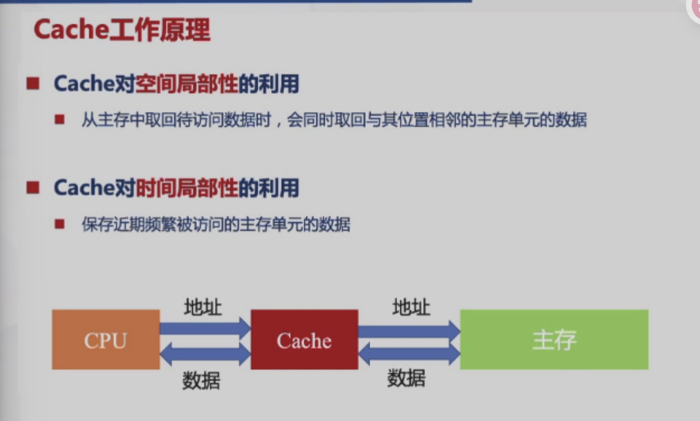

### cache访问过程

首先注意 我们指令给的是主存的地址 比如ld。

如果已经在这里hit 那么直接读取

如果没有hit 那么先从DRAM中读出数据**块** 再把块传输到cache中 再从cache中读取数据。

因此 如何根据主存的地址来找到cache里的数据呢？换句话说，先看个更简单的问题：如何找到主存地址所在的数据块在cache中的位置呢？（因为是一块一块传）

这就是地址映射机制！

### 直接映射机制

这个ppt有中文的讲的比较清楚

我这里梳理几个东西

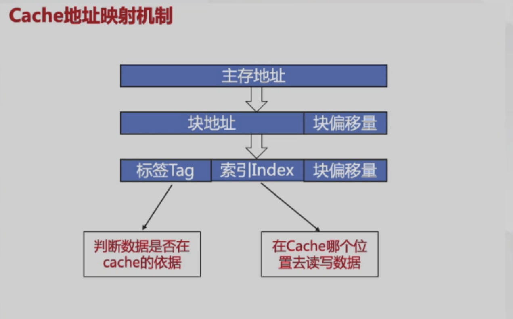

这个块偏移量就是log2(block size) index是log2(number of blocks in cache) tag就是剩下的

其实这个设计很必然 因为我们很多个主存块用一个cache块 这是成周期排列的，因此你一个块就是连续的blocksize个地址 因此末尾从2的0次方-2的log2(blocksize)次方都是同一个块。而前面index从0-2的log2(number of blocks in cache)次方都是同一个周期，而前面的tag就是不同周期的标志。

因此我们通过主存地址查询cache的时候，是以下几个步骤

1.划分tag index  block offset

2.根据index找到cache块（是否一个位置的）

3.比较tag是否相等（是否是一个周期的）

4.根据block offset找到具体数据

还记得cache里面有个valid 判断是否可用

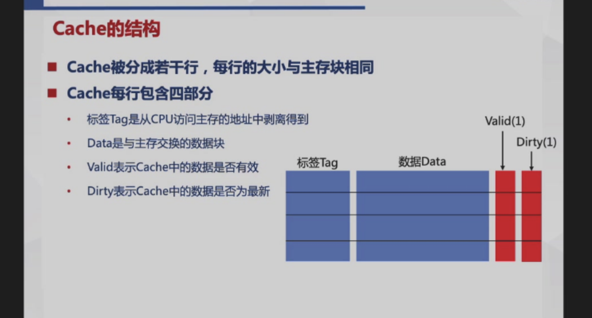

而tag+index也被称作主存块地址

注意block size的计算是说有多少个地址 一个地址对应一个字节。一个word是32位 4个字节 比如16byte的block就是16个地址一个block。但请注意！block实际上存的是数据！事实上地址并不会被memory存储 这只是一个索引。而cache存储的也只是tag。 其实 16byte说的是数据量。

4 word block说的是数据量

之后cache的每一个块存的是1位valid +1位dirty+ tag + block的data

有一个很好的计算题

注意block size说的是数据量

访问的过程告一段落 我们来看看写过程

### Cache写操作的基本逻辑

#### Cache写操作的两种核心策略（示意图）

这页是**写穿（Write through）和写回（Write Back）策略的直观展示**：

- **写穿策略**：CPU写数据时，**同时把数据写入Cache和主存**，Cache写完后给CPU“写响应”；
- **写回策略**：CPU写数据时，**只把数据写入Cache**，暂时不写主存（后续Cache块被替换时，再把修改后的数据写回主存）。

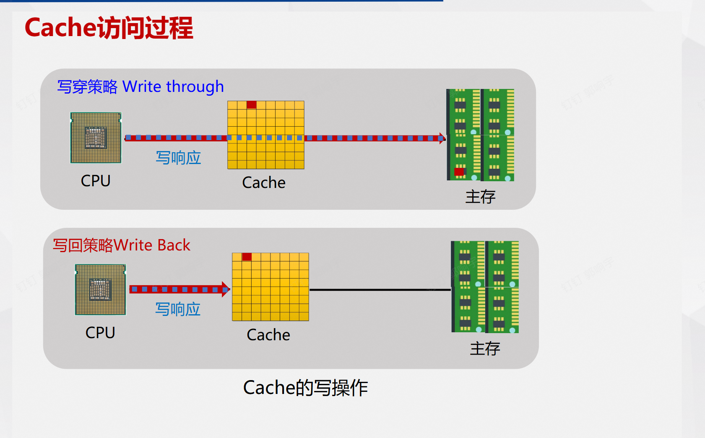

### 写命中（Write hits）的处理策略 + 写缺失的基本逻辑

当CPU要写的数据**已经在Cache中（写命中）**，有两种处理方式：

1. **写回策略（write-back）**：
   - 操作：只把数据写入Cache，不立即同步主存；
   - 特点：会导致Cache和主存数据不一致，但**速度快**（不用等主存写完成）；后续Cache块被替换时，再把修改后的数据“回写”到主存。cache的是新的 此时dirty为1 表示有修改

2. **写穿策略（write-through）**：
   - 操作：同时把数据写入Cache和主存；
   - 特点：保证Cache和主存数据一致，但**速度慢**（需要等主存写完成）；通常用“写缓冲（write buffer）”优化（先把数据存到缓冲，让CPU先响应，缓冲再慢慢写主存）。

此外，这页还提了**写缺失（Write misses）的基本逻辑**：先把该数据所属的整个块从主存读到Cache，再把数据写入Cache对应的位置。

### 第三页：写缺失（Write misses）的详细处理方式

这页专门讲“写缺失”时的不同处理选项，分写穿、写回策略分别说明：
写缺失就是cache里面没这个块

- **写穿策略下的选项**：

  - **Allocate on miss（缺失分配）**：写缺失时，先把主存的对应块加载到Cache，再写Cache(和主存)；
  - **Write around（绕写）**：写缺失时，不加载主存块到Cache，直接把数据写到主存（因为程序常“先写整块再读取”，提前加载块没用，能节省Cache空间）。

- **写回策略下**：通常选择“加载主存块到Cache”（因为写回策略依赖Cache存修改后的数据，必须先把块加载进来）。

### 总结5

这三页的核心是讲**Cache写操作的完整逻辑**：

- 写操作分“写命中”“写缺失”两种场景；
- 写命中用“写回（快但可能不一致）”或“写穿（一致但慢）”策略；
- 写缺失则根据写策略的不同，选择“加载块到Cache”或“直接写主存”——最终目的是在“速度”“一致性”“Cache空间利用”之间做权衡。

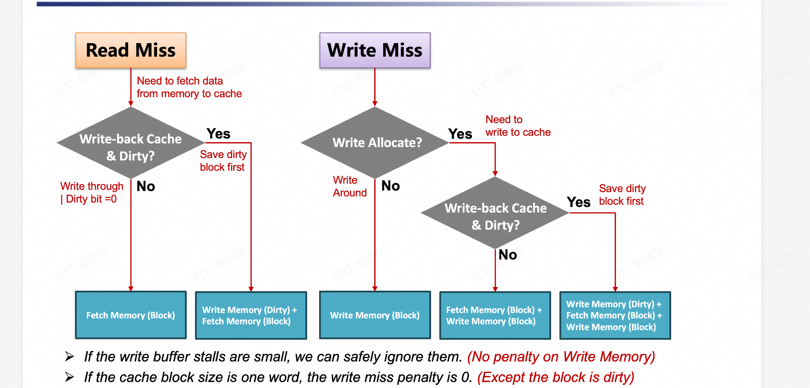

### 例子

ppt上有一个intrinsity Fastmath的例子

### 直接映射的缺点

1.cache的空间利用率不高
2.块冲突率也比较高

适合在大容量cache使用

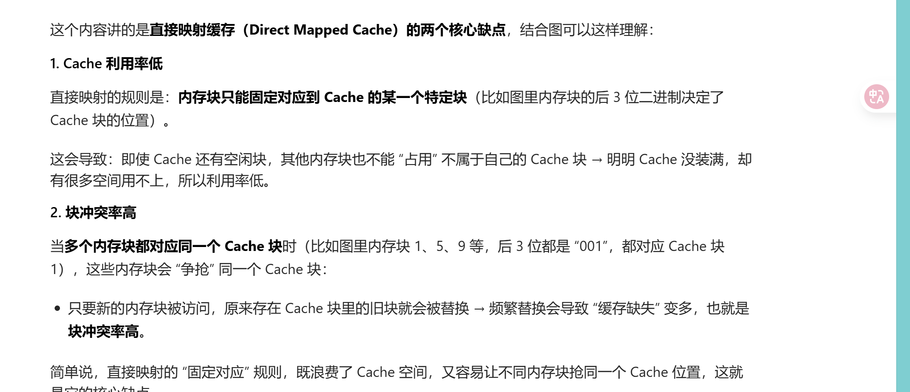

### 块大小的权衡

容量更大的块可以充分利用空间局部性，降低失效率。

但块容量打到一定程度 cache的块减少 且较大的块，局部性也降低，导致失效率也会变大。

## 缓存的核心问题

这个内容讲的是**缓存（Cache）设计中的核心概念**，具体是“存储层次结构设计者需要解决的四个关键问题”——这是缓存设计的基础框架，适用于处理器、操作系统等场景。

这四个问题及对应的设计方向是：

1. **Q1：数据块能放在上层缓存的什么位置？（块放置策略）**
   可选方案：全相联、组相联、直接映射

2. **Q2：如何确认数据块是否在下层缓存中？（块识别方式）**
   实现方式：通过“标签（Tag）+数据块”的方式标识

3. **Q3：缓存缺失时该替换哪个数据块？（块替换策略）**
   可选方案：随机替换、LRU（最近最少使用）、FIFO（先进先出）

4. **Q4：写操作发生时如何处理？（写策略）**
   可选方案：写回（Write Back）、写穿（Write Through，通常配合写缓冲）

### Q1

这个内容是在解释缓存设计中**“块放置策略（Block Placement）”的三种核心方式**，也就是内存块可以存到缓存的什么位置，属于之前提到的“缓存四大问题”里的Q1。

三种方式的具体规则：

1. **直接映射（Direct mapped）**
   - 内存块只能固定存到缓存的**一个特定位置**
   - 通常用“内存块地址 ÷ 缓存块数量”的余数来确定位置（地址 MOD 缓存块数）

2. **全相联（Fully associative）**
   - 内存块可以存在缓存的**任意位置**，没有固定限制

3. **组相联（Set associative）**
   - 内存块先分到缓存的**某一组（Set）**，然后可以存在这一组内的任意块里
   - 分组规则：“内存块地址 ÷ 缓存组数”的余数（地址 MOD 缓存组数）
   - 若一组有n个块，就叫“n路组相联”

最后还补充了一个关联：直接映射其实是“1路组相联”，全相联则是“m路组相联（m等于缓存总块数）”。

简单说，这三种方式是缓存里内存块的“存放规则”，从限制最严（直接映射）到最灵活（全相联）依次过渡。

### Q2

这个内容是缓存设计“四大问题”里的**Q2：块识别（Block Identification）**，也就是如何判断“想要的数据是否在缓存里”，核心靠两个东西：

### 1. 标签（Tag）

- 缓存里的每个数据块，都会存一个“地址标签”，记录这个块对应的**主存地址**。
- 当处理器要访问某个内存地址时，会把“目标地址”和缓存块的“Tag”做对比：如果一致，说明数据在缓存里（缓存命中）。

### 2. 有效位（Valid bit）

- 每个缓存块还会带一个“有效位”，用来标记这个缓存块里的内容是否是**有效的、可用的**（比如刚开机时缓存内容无效，有效位就会置0）。

简单说，“Tag负责确认地址匹配，有效位负责确认内容可用”，两者结合就能判断缓存里有没有目标数据。

我们也很容易注意到，不同的映射方式，tag的设置（长度与结构也会有不同）

### 不同的映射方式的index tag

这个内容是在讲**物理地址的格式拆分**——缓存系统会把内存地址分成3个部分，分别对应不同的功能，核心是为了快速定位缓存中的数据。

拆分后的三个字段及作用

1. **Index（索引）字段**
   - 作用：
     - 组相联缓存中：确定数据块属于哪一组
     - 直接映射缓存中：确定数据块属于哪一个缓存块
   - 位数：组相联时是`log₂(缓存组数)`，直接映射时是`log₂(缓存块数)`
**全相连**没有Index字段，因为数据块可以存放在任何位置。

2. **Byte Offset（字节偏移）字段**
   - 作用：确定数据在一个缓存块内的具体字节位置
   - 位数：`log₂(单个缓存块的字节大小)`

3. **Tag（标签）字段**
   - 作用：在对应组/块中，匹配具体的内存地址（确认缓存块是否是目标数据）
   - 位数：`地址总位数 - Index位数 - Byte Offset位数`

简单说，地址拆分是缓存“快速定位+匹配”的基础：先通过Index找到候选区域，再通过Offset定位块内位置，最后通过Tag确认是否命中。

PPT上有很详细的操作例子。

## Q3

这两张PPT是在讲**缓存中的“块替换”策略**，属于计算机组成原理里的缓存（Cache）知识：

### （Q3: Block Replacement）

核心讲**不同缓存结构下，块替换的可选范围**：

- 直接映射缓存（direct-mapped cache）：每个内存块只能对应缓存里的**1个固定块**，所以替换时只有1个块可选。
- 组相联/全相联缓存（set-associative/fully-associative）：内存块会对应缓存里的**N个块**（N是相联度），替换时可以从这N个块里选。

图里用“全相联缓存”“2路组相联缓存”的结构，展示了内存块与缓存块的对应关系~

### Strategy of block Replacement）

注意这里说的是全相联 组相联的情况，直接映射是唯一的。

核心讲**块替换的具体策略**，也就是从可选块里选哪个替换：

1. **随机替换（Random replacement）**：
   - 硬件实现简单（只要随机数生成器），能均匀分配缓存空间；
   - 缺点：可能把“马上要被访问”的块换掉。

2. **最近最少使用（LRU）**：
   - 选“最近最少被访问”的块替换；
   - 逻辑是“最近访问过的块更可能被再次访问”；
   - 缺点：需要额外的位（bit）记录访问情况，硬件成本高。

3. **先进先出（FIFO）**：
   - 选“最早进入缓存”的块替换。

## Q4

这两张PPT讲的是**缓存的“写策略”**（CPU向缓存写数据时，如何同步主存的规则），以及写策略带来的问题和优化方案：

### 第一张PPT（Q4: Write Strategy）

核心是区分**两种缓存写策略**：
问题出发点：当CPU把数据写入缓存时，要不要同时把数据也写入主存？

#### 1. 写穿（Write-through）缓存

- 规则：写缓存的同时，**立刻把数据同步写入主存**。
- 特点：
  - 缓存数据可随时丢弃（因为最新数据在主存里）；
  - 缓存只需要一个“有效位（valid bit）”标记数据是否有效；
  - 主存/其他处理器能始终拿到最新数据（一致性好）。
- 优势：读缓存不命中时不会触发写操作，内存层级一致性高，硬件实现简单。

#### 2. 写回（Write-back）缓存

- 规则：写缓存时，**不立刻同步主存**；只有当这个缓存块被替换时，才把数据写回主存。
- 特点：
  - 缓存数据不能随便丢（必须等写回主存后再替换）；
  - 缓存需要“有效位+脏位（dirty bit）”：脏位标记“缓存块是否被修改过（没同步到主存）”；
  - 带宽消耗低（同一缓存块多次修改，只需要写回主存一次）。
- 优势：写操作速度和缓存一致，同一缓存块多次写时，主存带宽占用更小。

### 第二张PPT（Write stall）

讲**写穿策略的缺点+优化方案**：

#### 1. 写停顿（Write stall）

- 定义：在写穿策略中，CPU必须等待“写缓存+写主存”的操作完成，才能继续执行后续指令，这个等待过程就是“写停顿”。
- 问题：主存速度远慢于缓存，写停顿会拖慢CPU效率。

#### 2. 写缓冲（Write buffers）

- 优化方案：在缓存和主存之间加一个**小缓存（写缓冲）**，用来临时存放“等待写入主存的数据”。
- 作用：
  - CPU写完缓存后，直接把数据丢进写缓冲，不用等主存写完成，避免写停顿；
  - 对“集中式写操作”（短时间内多次写）效果好；
- 局限性：写缓冲容量有限，如果短时间写操作太多、填满了缓冲，还是会触发写停顿。

这张PPT讲的是**缓存“写不命中”（Write misses）时的两种处理方式**，也就是CPU要写数据但缓存里没有对应块的情况：

### 写不命中

当写操作发生“不命中”（缓存里没有目标块）时，有两种处理策略：

1. **写分配（Write allocate）**
   - 逻辑：先把主存里的目标块**加载到缓存**，之后再执行写操作（写缓存）。
   - 相当于“先把块放进缓存，再写缓存”。

2. **绕写（Write around，也叫非写分配）**
   - 逻辑：不把主存块加载到缓存，直接把数据**只写入主存**，数据不会存到缓存里。

我们发现都需要加载主存块到缓存里（或者直接写到缓存），才能执行写操作。因此，这个肯定会造成严重的时间损失。

### 常见搭配规则

PPT最后总结了一个常用组合：

- **写回（Write-back）缓存**：通常用**写分配**（先加载块到缓存，再写缓存，后续替换时写回主存）。
- **写穿（Write-through）缓存**：通常用**绕写**（直接写主存，不加载到缓存，避免缓存存“只写一次”的数据（因为写穿本来也是为了直接写主存）。

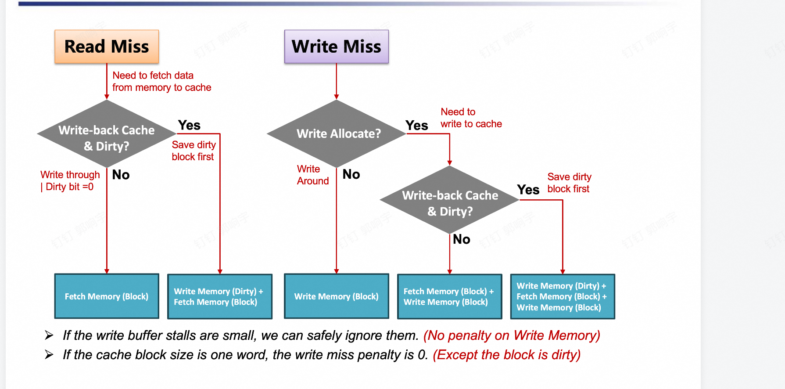

最后一个小总结 自己慢慢推吧。

## 缓存性能的衡量和优化

“开篇介绍”，明确了两个核心问题和三大内容：

- **核心问题**：
  1. 如何衡量缓存性能？
  2. 如何提升缓存性能？
- **主要内容**：
  1. 缓存性能的衡量方法
  2. 通过“更灵活的块放置方式”减少缓存不命中
  3. 通过“多级缓存”降低不命中的惩罚（即不命中时的性能损失）
- 还给出了**平均内存访问时间的公式**：
  平均内存访问时间 = 命中时间 + 不命中时间
  = 命中时间 + 不命中率 × 主存访问时间

### （Measuring cache performance）

详细讲**缓存性能的衡量指标（用CPU时间来衡量）**，核心是拆解CPU时间的构成：

- **CPU时间的公式**：

  CPU时间 = （CPU执行时钟周期数 + 内存停顿时钟周期数） × 时钟周期时间

- **内存停顿时钟周期数**：是缓存不命中导致的CPU等待时间，分为“读停顿”和“写停顿”：
  内存停顿周期 = 指令数 × 不命中率 × 不命中惩罚
  = 读停顿周期 + 写停顿周期

- **读停顿周期**：
  读停顿周期 = （程序的读操作数） × 读不命中率 × 读不命中惩罚

- **写停顿周期（以“写穿+写缓冲”策略为例）**：
  写停顿周期 = （程序的写操作数） × 写不命中率 × 写不命中惩罚 + 写缓冲停顿
  （注：写缓冲停顿如果很小可以忽略；若缓存块大小是1字，写不命中惩罚为0）

  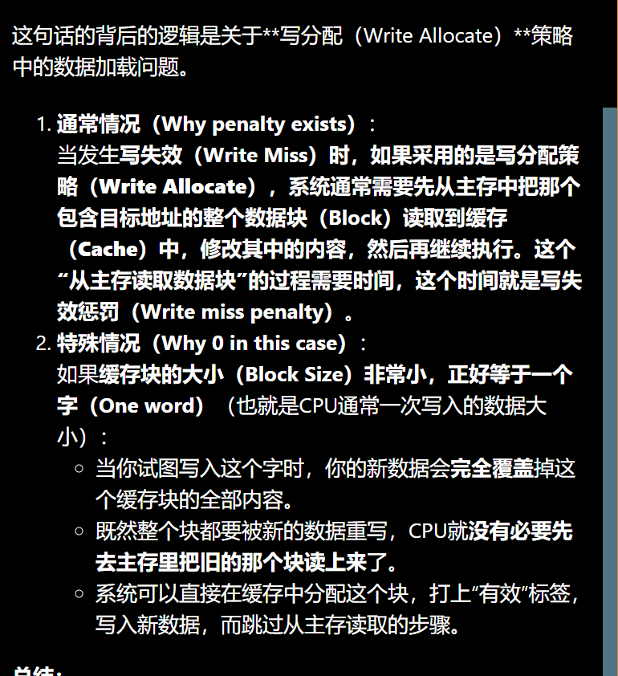

这张PPT讲的是**写穿缓存中“读/写不命中惩罚”的合并计算逻辑**，核心是简化内存停顿时钟周期的公式：

### 写穿缓存（核心要点）的读/写不命中惩罚

1. **写穿缓存的读/写不命中惩罚一致**
   在大多数写回缓存的结构中，“读不命中”和“写不命中”的惩罚（即从主存加载块的时间）是一样的——因为两者都需要从主存把块取到缓存。

2. **简化内存停顿时钟周期的公式**
   如果忽略写缓冲的停顿（通常很小可忽略），可以把读、写的停顿合并计算：

   - 公式1：
     内存停顿时钟周期 = （程序的内存访问次数 / 程序） × 不命中率 × 不命中惩罚

   - 公式2（等价变形）：
     内存停顿时钟周期 = （程序的指令数 / 程序） × （不命中数 / 指令数） × 不命中惩罚（这里的指令数我愿意理解为总指令数）

这个简化是因为写回缓存的读、写不命中惩罚相同，所以可以把读、写的内存访问合并计算停顿时间。

记住以上的公式

ppt有对提高时钟频率后，缓存性能对整体性能的影响案例的讨论。

核心是说明：只提高 CPU 时钟频率、不优化内存系统，性能提升会远低于预期。（时钟频率和cpi没有关系）

## 那到底如何提升呢

我们也想到了 应该减少内存的冲突

### 组相联/全相连

这里其实之前说过了 不加赘述、

不用想都可以知道，你组相联或者全相联的越多， 那么冲突就会越少。

PPT有一些计算 可以理解。

比如：
1.已经知道Block size = 16 bytes, Cache size = 4K个block, 2-way set associative cache。

问你有多少个tag。

block-size=16 bytes, 说明16个地址，offset = 4 bits

而cache size = 4K个block，那么一共是2的12次方个block， 2-way set associative cache说明每组有2个block，那么组数是2的11次方组，因此index = 11 bits.

那么tag = 32-11-4 = 17 bit

我们也可以发现 index就是组数，组里面的block是随便放的。

### 块替换策略

在组相联/全相联的情况下，我们可以选择不同的块替换策略（直接映射就是只能换那一个）。

这页PPT讲的是**组相联缓存的“块替换策略”**——解决“缓存组存满时，该替换哪个块”的问题，分点解释：

#### 1. 替换的场景

在相联缓存（比如组相联缓存）中，当发生缓存缺失、且目标组已经存满块时，必须决定要替换掉组内的哪一个块。

#### 2. 最常用的替换策略：LRU（最近最少使用）

- 规则：替换组内**最久没有被访问过**的块（这也是之前例子里用的策略）。

#### 3. 双向组相联缓存的LRU实现

如果是“双向”（每个组只有2个块）的组相联缓存，LRU实现很简单：
给每个组加1个标记位——访问组内其中一个块时，把这个位“置位”；访问另一个块时，把这个位“复位”。通过这个位就能判断哪个块是“最近最少用”的。

#### 4. 相联度越高，LRU实现越难

组内的块数越多（即“相联度”越高），记录每个块的访问时间、判断“最久未用”的逻辑就越复杂，LRU的硬件实现成本会显著增加。

### 不同的block大小

这页PPT讲的是**缓存块大小的选择考量**——块大小不是越大越好，是“收益”和“代价”的平衡，分点解释：

#### 1. 大块的好处：降低缺失率

更大的缓存块能利用**空间局部性**（程序访问某个数据后，大概率会访问附近数据），一次加载更多相邻数据，后续访问这些数据时能命中缓存，从而降低缺失率。

#### 2. 缓存大小固定时，大块的弊端

缓存总容量是固定的，块越大→缓存能容纳的块数量越少：

- **竞争加剧**：可存的块变少，不同内存块更容易“抢”缓存位置，反而提升缺失率；
- **缓存污染**：大块会加载很多暂时用不上的数据，挤占了有用块的空间，导致不必要的缺失。

### 3. 大块的额外代价：更高的缺失惩罚

缺失惩罚是“缓存缺失后加载数据的时间”——块越大，加载整个块的时间越长，哪怕缺失率降低了，“单次等待更久”的代价可能抵消甚至超过缺失率降低的好处。
不过可以用**提前重启**（拿到关键数据就先返回CPU，不用等整块加载完）、**关键字优先**（先读CPU当前需要的字）来缓解这个问题。

简单说：缓存块大小是个“跷跷板”——既要利用空间局部性降缺失率，又要避免块太大导致的“块数量不足、缺失惩罚过高”的问题。

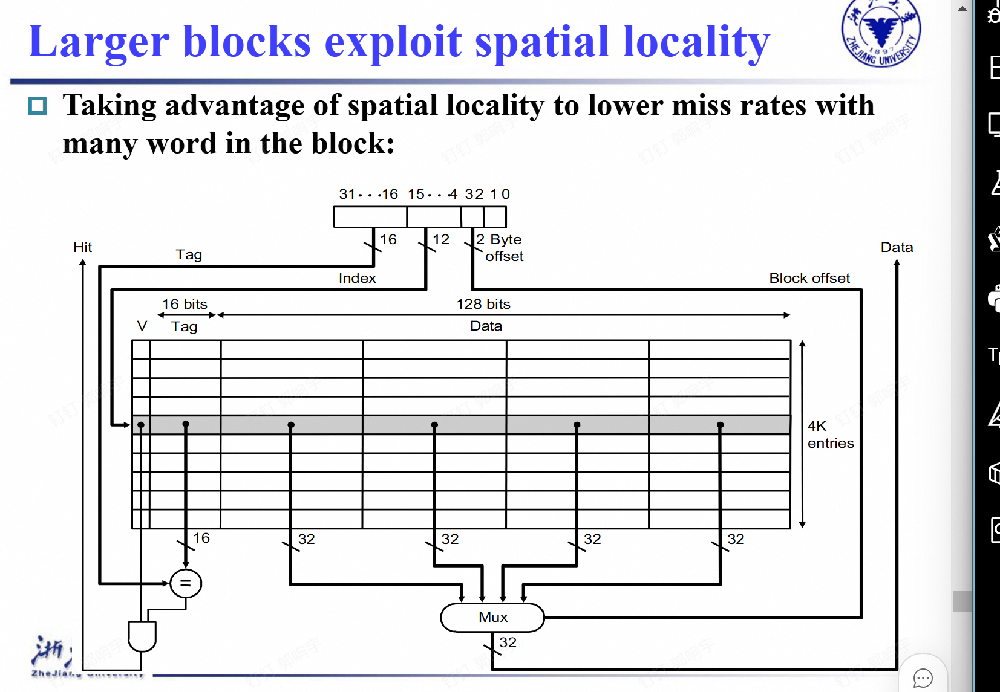

这张图有点意思 它说明实际上是取四个地址的值，也说明了怎么操作的

### 减小panelty 让传的更快

这页PPT讲的是**“为了适配缓存（尤其是大块缓存），如何设计内存系统来高效读取多个字”**，通过三种内存组织方式对比，说明如何提升数据传输效率：

#### 1. 图a：单字宽内存组织（基础但低效）

内存每次只能传输**1个字**，而缓存块通常包含多个字（比如之前的大块）。
→ 加载一个缓存块需要多次访问内存，速度慢，无法匹配缓存的大块需求。

#### 2. 图b：宽内存组织

把内存的位宽设计得更宽，能**一次传输多个字**（刚好匹配缓存块的大小），再通过多路选择器（Multiplexor）把宽数据拆分成CPU/缓存需要的单个字。
→ 加载一个缓存块只需1次内存访问，高效适配大块缓存的读取需求。

#### 3. 图c：交叉内存组织

把内存拆分成多个独立的**内存bank（存储体）**，每个bank可以并行工作。
→ 要读取的多个字若分布在不同bank中，就能同时从多个bank读取数据，实现多字并行传输，同样能高效支持缓存块的多字加载。

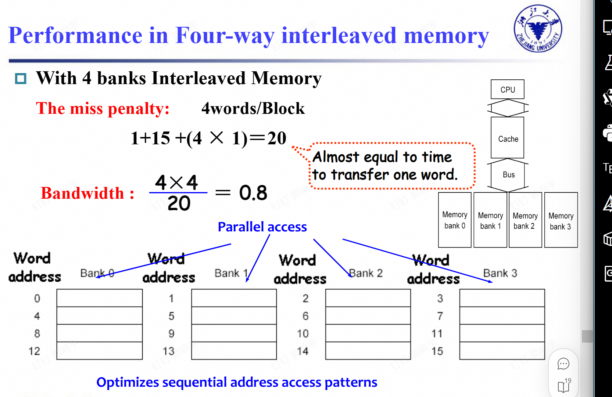

### 二级缓存

就是加一块没那么快，但也相对于主存快的缓存，比一级缓存更大。

#### 1. 二级缓存的设计逻辑

- 一级缓存（Primary cache）通常和CPU集成在同一芯片上；
- 二级缓存用SRAM实现，加在一级缓存和主存（DRAM）之间；
- 若一级缓存缺失后，数据能在二级缓存中命中，等待时间（缺失惩罚）会比直接访问主存短很多。

#### 2. 具体示例（用数据看性能提升）

先明确基础参数：

- 机器：5GHz（时钟周期 \( \frac{1}{5GHz} = 0.2ns \)），基础CPI（每条指令的时钟周期）1.0；
- 一级缓存：缺失率2%，主存（DRAM）访问时间100ns；
- 新增二级缓存：访问时间5ns，一级缓存的缺失率（最终落到主存的部分）降到0.5%。

二级缓存更大，丢失率肯定更低

#### 3. 缺失惩罚的计算

- **访问主存的缺失惩罚**：把主存访问时间转成时钟周期 → \( \frac{100ns}{0.2ns/周期} = 500 \) 时钟周期；
- **访问二级缓存的缺失惩罚**：二级访问时间转成时钟周期 → \( \frac{5ns}{0.2ns/周期} = 25 \) 时钟周期。

#### 4. CPI的变化（性能提升的体现）

- **只有一级缓存时的总CPI**：基础CPI + 内存停顿周期（缺失率×主存缺失惩罚）
  \( 1.0 + 2\% × 500 = 11.0 \)；

- **加二级缓存后**：一级缺失后先查二级，只有二级也缺失才访问主存，停顿周期会大幅减少（比如：\( 2\%×25 + 0.5\%×500 \)，远小于原来的10），总CPI会明显降低。

### 软件提升

看ppt吧

## 虚拟内存

## 概述

这页PPT讲的是**虚拟内存（Virtual Memory）的核心逻辑与优势**，可以拆成这几个关键点：

### 1. 虚拟内存的本质

主存（内存）可以当作**辅助存储（磁盘）的“缓存”**：

- 把磁盘当作“超大容量的慢速存储”，主存则是磁盘的“高速缓存区”——常用的程序/数据块存在主存，不常用的存在磁盘；需要时再把磁盘里的块调入主存，和缓存“快慢设备缓冲”的逻辑一致。

### 2. 地址映射逻辑（图的含义）

程序使用的是**虚拟地址**，通过“地址转换（Address translation）”对应到**物理地址（主存实际地址）**；如果虚拟地址对应的块不在主存里，就从磁盘中调入主存。

### 3. 虚拟内存的优势

- **“内存变大”的错觉**：程序能使用比实际物理内存更大的地址空间（因为部分数据存在磁盘上）；
- **程序重定位**：程序不用关心自己实际存在物理内存的哪个位置，地址转换会自动处理，方便程序的加载、移动；
- **内存保护**：不同程序的虚拟地址空间是隔离的，避免一个程序破坏其他程序的内存数据。

简单说，虚拟内存是“用主存当磁盘的缓存”，既让程序能用更大的“内存空间”，又能保证程序的安全和灵活加载。

## 还有点概述

这页PPT是对“虚拟内存”的**核心动机与关键术语**的补充说明，同时延续了“虚拟内存=主存作为磁盘的缓存”的逻辑：

### 1. 核心定位（和之前一致）

主存（内存）是辅助存储（磁盘）的“缓存”——把磁盘里的常用数据块放到主存，提升访问速度。

### 2. 虚拟内存的设计动机

- **多程序的内存共享**：实现多个程序之间“高效且安全”的内存共享（虚拟地址空间隔离，避免程序互相干扰）；
- **减轻编程负担**：不用再受限于“物理内存太小”的问题，程序可以使用远大于实际物理内存的虚拟地址空间，不用手动管理内存分配。

不同程序可以虚拟地址相同，但物理地址不同

### 3. 地址转换的关键术语（和缓存对应）

虚拟内存是缓存逻辑的扩展，所以术语和缓存有对应关系：

- 缓存里的“块（block）”，在虚拟内存中叫**页（page）**（虚拟内存的基本数据单元）；
- 缓存里的“缺失（miss）”，在虚拟内存中叫**缺页（page fault）**（虚拟地址对应的页不在主存里，需要从磁盘调入）。

## 页是什么

这页PPT讲的是**虚拟内存的基本单元“页（Page）”的核心特性、缺页处理逻辑，以及地址转换的结构**，是对虚拟内存机制的细化说明：

事实上，页就是“虚拟内存的缓存block”，但因为虚拟内存涉及磁盘，页的设计和处理逻辑有特殊之处：

虚拟内存的出现其实就是把“主存”当成“磁盘”的缓存

### 1. 页的数量关系

虚拟页的数量远多于物理页的数量——因为虚拟地址空间是“逻辑上的大空间”，而物理内存是实际的硬件空间（内存）（容量小），所以大部分虚拟页会暂存在磁盘里。

### 2. 缺页（Page fault）的关键逻辑

缺页是“虚拟页不在物理内存，需要从磁盘调入”的情况（对应缓存的“缺失”），但因为磁盘速度极慢，所以缺页的处理有特殊设计：

- **页要足够大（比如4KB）**：缺页惩罚（从磁盘调数据的时间）极高，所以把页设计得大一些，一次调入更多数据，减少缺页次数；
- **用LRU+全相联放置**：减少缺页比节省硬件成本更重要，所以用LRU替换最久未用的页，同时页在内存中是“全相联放置”（可灵活存到任意物理页，避免冲突缺页）；
- **软件处理缺页**：缺页由操作系统（软件）负责处理，不用硬件实现；
- **用写回策略**：写穿策略（每次写都同步到磁盘）速度太慢，所以用写回策略——只有当页被替换出内存时，才把修改过的内容写回磁盘。

### 3. 地址转换的结构

虚拟地址和物理地址都被拆成两部分：

- 虚拟地址：`虚拟页号 + 页内偏移`
- 物理地址：`物理页号 + 页内偏移`

地址转换只需要把“虚拟页号”翻译成“物理页号”，**页内偏移保持不变**（因为页的大小固定，偏移是页内部的位置，和页存在哪里无关）。

简单说，这页是把“虚拟内存（页）”当成“磁盘的缓存”，但因为磁盘速度太慢，所以页的设计、缺页处理都比普通缓存更“偏向减少缺失（缺页）”，同时用软件+特定策略平衡性能。

## page table

这就是用来翻译虚拟页号到物理页号的表

每个程序都有自己的页表

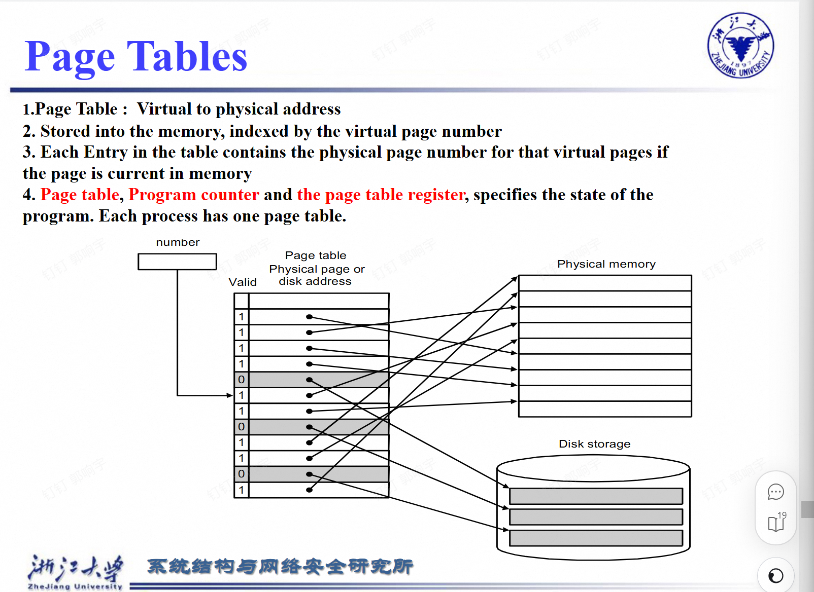

存在内存里面，以虚拟页号为索引，可以查询到物理页号（或者磁盘地址）。

其实虚拟页号就好像给了一个磁盘的地址块号，物理页号是内存的地址块号。

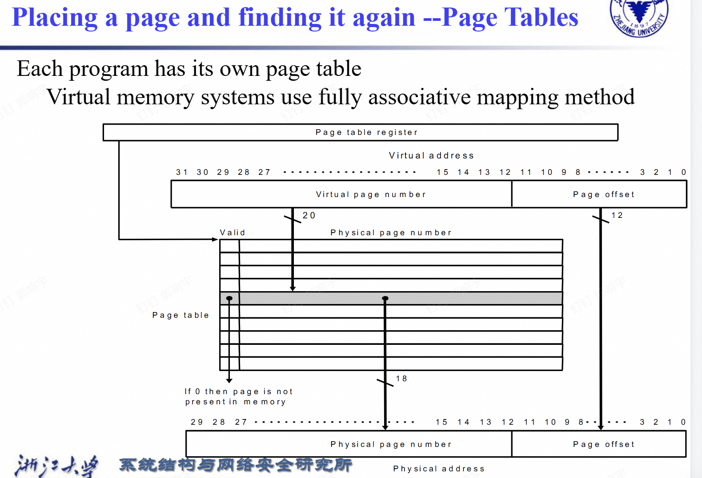

可以看看示意图

也就是说无论是硬盘还是内存，一个page都是page offset个数据。

## 缺页处理

这张PPT讲的是**操作系统中“缺页中断（Page faults）”的处理流程**，属于虚拟内存管理的核心机制之一。下面用通俗的逻辑拆解内容（结合图和文字）：

### 1. 前提：进程的页面“存哪里”？

当操作系统创建一个进程时，不会把进程的所有数据/代码都直接放到主存（内存）里，而是先在**磁盘（外存）**上为进程的所有“页面”（虚拟内存的基本存储单位）预留好空间——这是虚拟内存“按需加载”的基础。

### 2. 什么是“缺页中断”？

进程运行时，CPU要访问的某个“虚拟页面”**不在主存里**（只存在磁盘上），此时会触发一个“缺页中断”（相当于告诉操作系统：“我要的页面不在内存，得去磁盘拿”）。

### 3. 缺页中断的处理步骤（PPT核心）

结合右侧的页表（Page table）图，步骤是：

- **步骤1：OS接管控制权**
  缺页发生后，CPU会通过“异常机制”把控制权交给操作系统。

- **步骤2：找到磁盘里的页面**
  操作系统查“页表”：页表里每个虚拟页号对应一个条目，其中“有效位（Valid）”是关键——

  - 有效位=1：页面在主存里，直接对应物理页地址；
  - 有效位=0：页面不在主存，条目里记录的是**磁盘地址**（PPT里“Disk address”），OS靠这个地址找到磁盘里的目标页面。
- **步骤3：把页面加载到主存**
  OS把磁盘里的目标页面读取到主存；如果主存已经满了（所有页面都在使用），就用**LRU策略（最近最少使用）**挑一个主存里的页面“替换掉”（把它写回磁盘，腾出空间放新页面）。

### 右侧图的含义

- 页表（Page table）：连接“虚拟页号”和“实际存储位置”的映射表；
- 物理内存（Physical memory）：主存，存放当前正在用的页面；
- 磁盘存储（Disk storage）：外存，存放暂时不用的页面；
- 灰色条目（有效位=0）：对应磁盘里的页面，访问这类页面会触发缺页中断。

简单说：这是操作系统“让进程以为自己有很大内存（虚拟内存），实际按需从磁盘加载页面到主存”的核心流程，缺页中断就是这个机制里“页面不在主存时的补救操作”。

## 计算

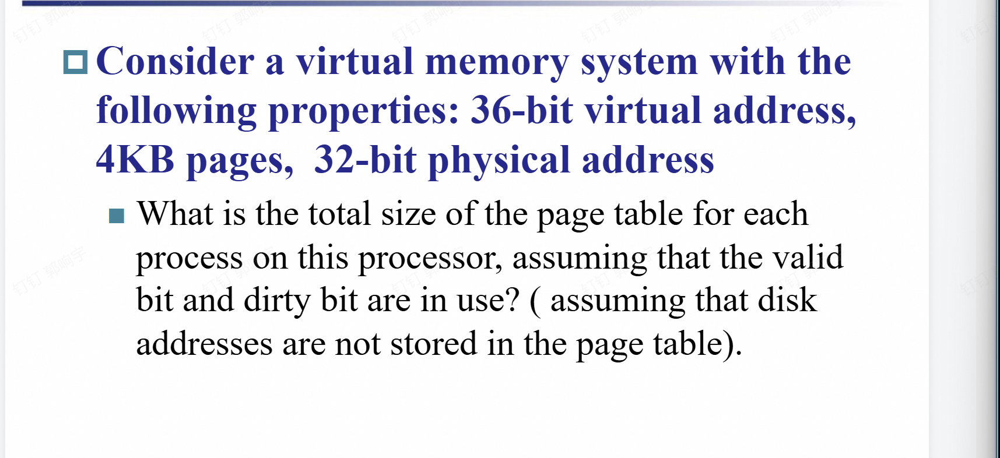

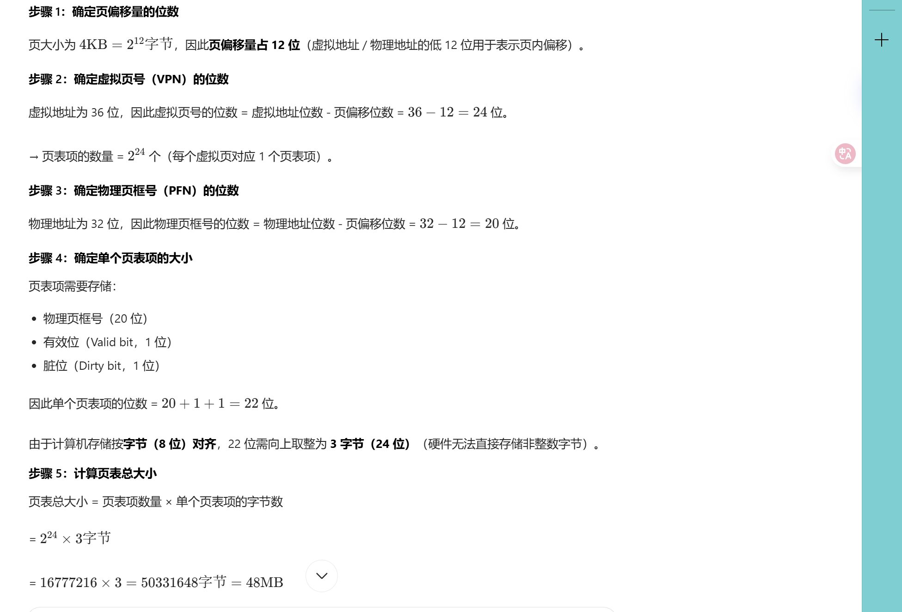

必须注意 虚拟地址=虚拟页号+页内偏移
物理地址=物理页号+页内偏移

而page table存的是物理页号+valid位+dirty位

entry其实就是多少个page

## 写策略

这页PPT讲的是**虚拟内存中“写操作”的处理策略**，核心内容可以拆成3点：

1. **为什么不用写透策略？**
   因为磁盘访问速度太慢，虚拟内存系统没法用“写透（write-through）”策略（写透是“写内存时同时写磁盘”，磁盘慢会拖垮性能）。

2. **改用什么策略？**
   必须用“写回（write-back）”策略，为此需要在页表项里增加一个“脏位（dirty bit）”。

3. **脏位的作用是什么？**
   当页面第一次被写入时，脏位会被标记为“置位”；如果某个页面的脏位是置位状态，那么在替换这个页面（把它从内存换出到磁盘）之前，必须先把这个页面的内容写回磁盘（因为内容被修改过，得保存更新）。

## TLB

还记得吗 我们页表是存在内存里面的，现在我们觉得直接查这么大的页表也有点慢啊，所以就出现了TLB（Translation Lookaside Buffer，翻译缓存），就是页表的缓存。

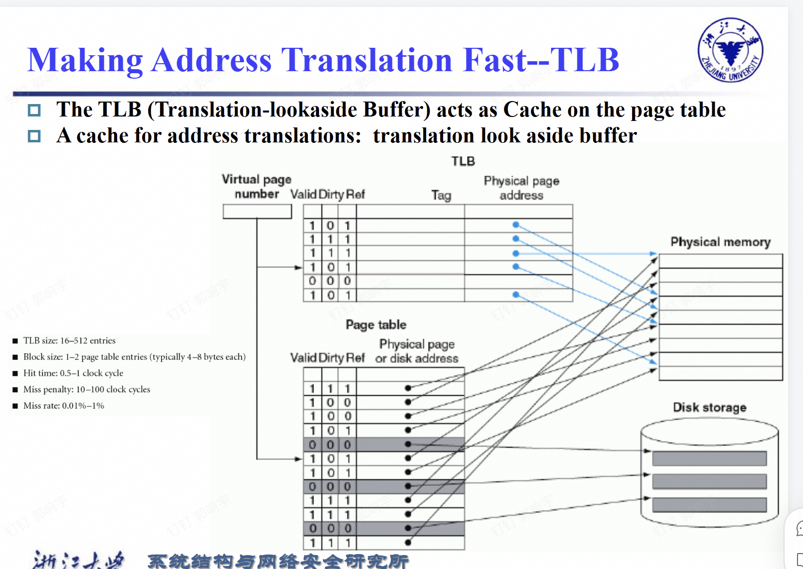

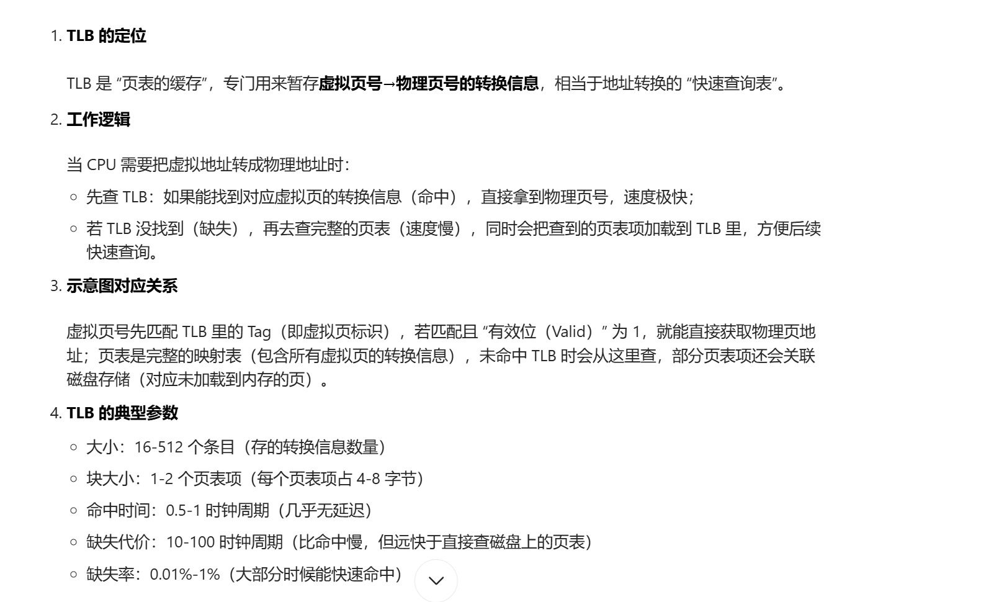

可以把TLB理解为一个block就是一个entry的缓存。

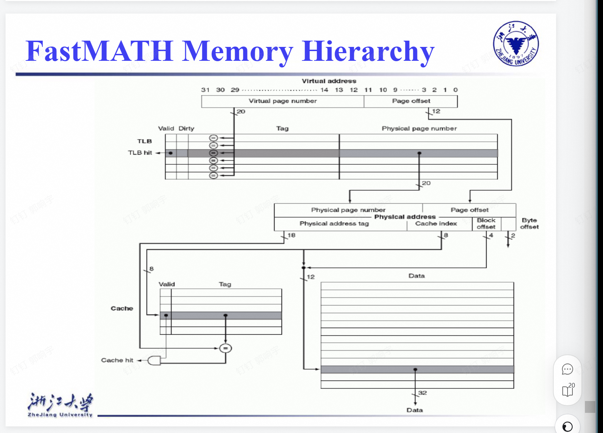

来一个完整的超级图

可以看到这里的TLB其实是全相联的 根本没有idex纯靠tag。

其实可以理解成虚拟页号就是tag和index 而页表存的就是一块的数据

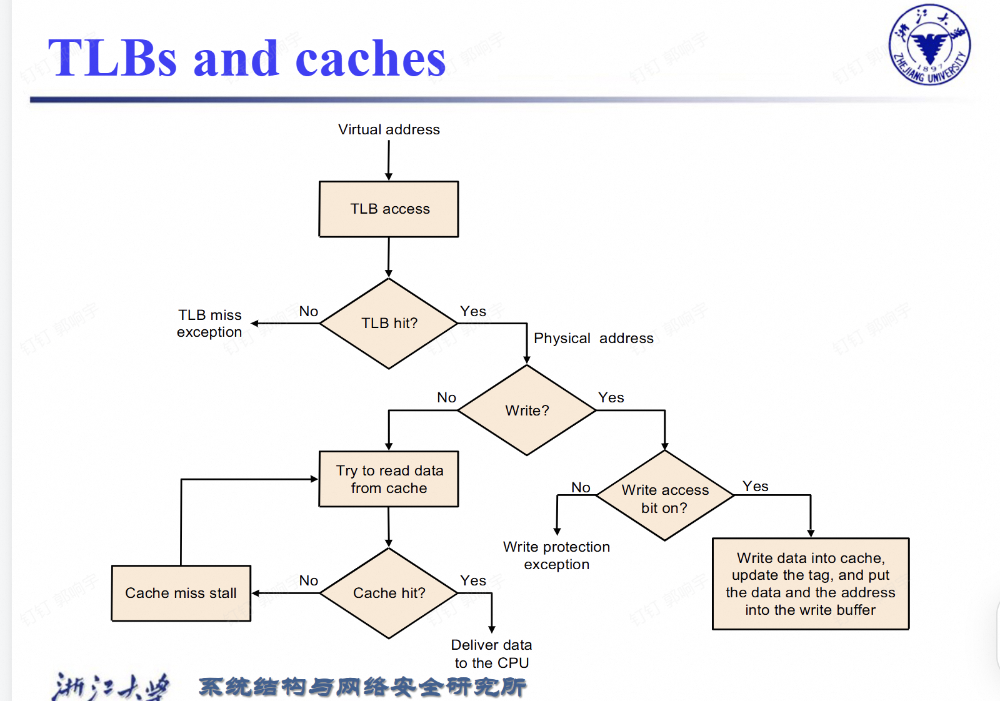

完整的工作图

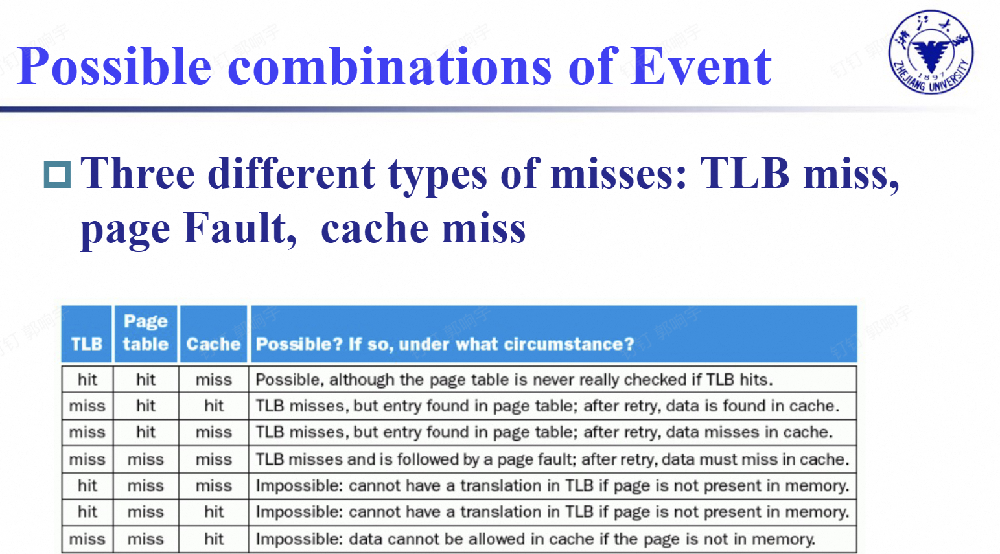

## 存在的问题以及可以提升的

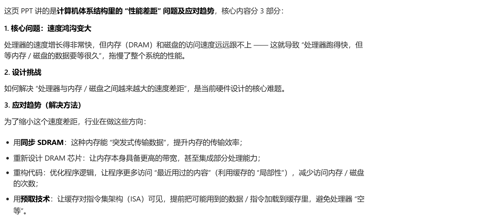

## 补充

写穿指的是写到下一层（不一定就是内存）
