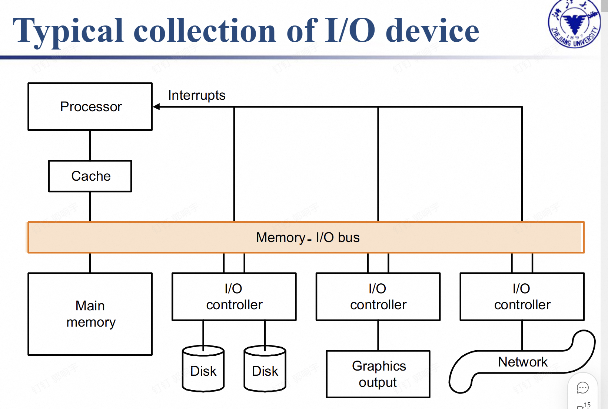
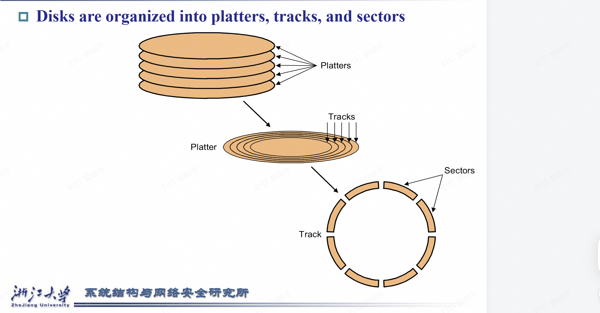
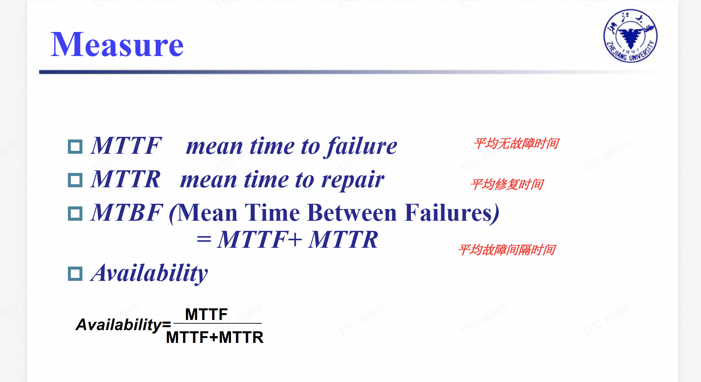
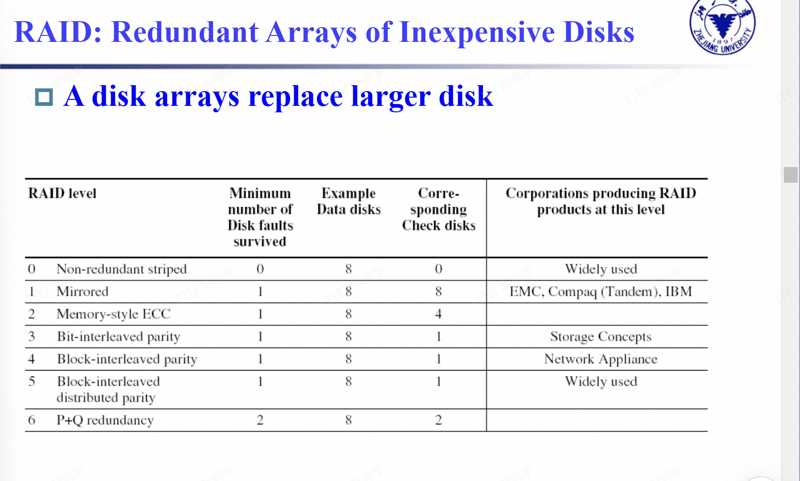
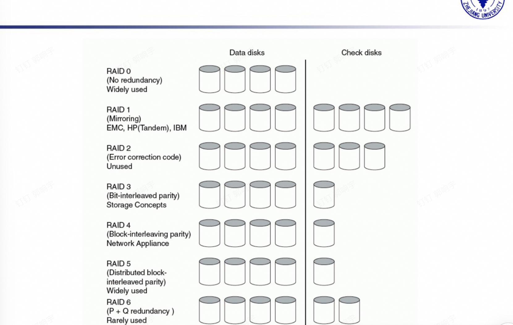
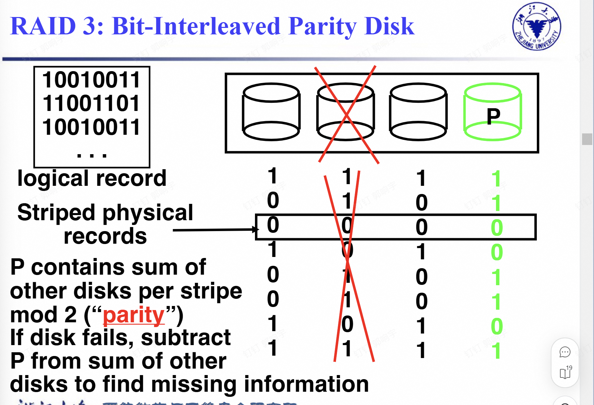
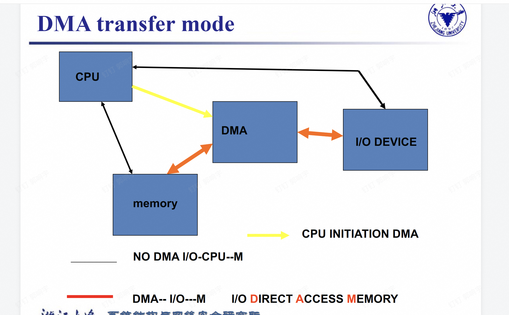
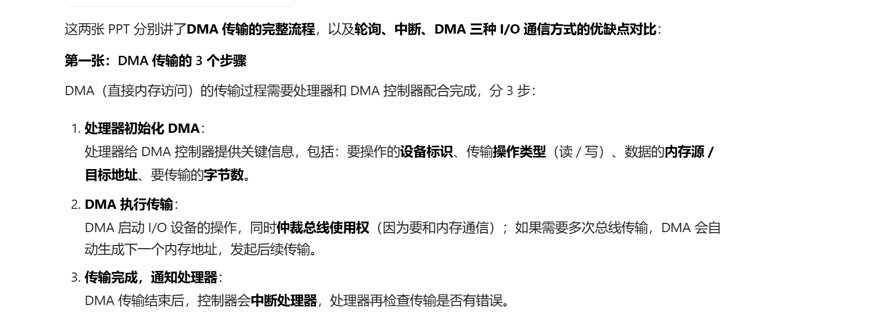

# 存储、网络与其他外设

## 引入：I/O设备(输入输出)

- I/O设计人员得考虑多方面因素：比如系统的可扩展性、弹性（故障恢复能力），还有性能。
- 评估I/O系统的性能挺难的：不同场景下，得用不同的衡量指标才行。
- I/O系统的性能由这些因素决定：设备和系统的连接方式、存储层次结构、操作系统。

I/O设备的分类：有输入设备、输出设备、存储设备（输入输出设备--硬盘）三大类。

### （I/O的三个特征）

主要讲I/O设备的3个关键属性：

1. **行为（Behavior）**：
   - 输入：只能读一次；
   - 输出：只能写、不能读；
   - 存储：可以反复读写。
2. **交互对象（Partner）**：
   I/O设备的另一端要么是人、要么是机器，负责提供输入数据或读取输出数据。

3. **数据速率（Data rate）**：
   I/O设备和主存/处理器之间，数据传输的峰值速度。

### I/O性能取决于应用场景

核心是“不同应用对I/O性能的要求不一样”，重点讲2个指标：

- **吞吐量（Throughput）**：是I/O带宽的核心，分两种衡量方式：
  1. 单位时间内传输的数据量（比如超级计算机处理长数据流，看重这个）；
  2. 单位时间内完成的I/O操作数（比如税务局处理大量小文件，看重这个）。
- **响应时间（Response time）**：比如工作站、个人电脑，更在意操作后的反馈速度。
- 部分场景两者都要：比如ATM机，既需要高吞吐量（处理多人请求），也需要快响应时间（用户不用等太久）。

## 海姆达尔定律

### 阿姆达尔定律的核心

哪怕用很多处理器做并行计算，只要存在“不能并行”的串行环节，系统的加速比（速度提升倍数）就会被这个串行部分卡住上限。

### PPT里的例子（100个处理器，想达到90倍加速比）

1. 公式逻辑：
   - 新时间（T_new）= 可并行部分的时间÷处理器数 + 串行部分的时间
   - 加速比（Speedup）= 1 ÷ [（1-可并行比例F） + F÷处理器数]

2. 计算过程：
   当用100个处理器、想要90倍加速比时，代入公式算出“可并行比例F=0.999”——也就是说，**可并行的部分要占原始时间的99.9%**。

3. 结论：
   要达到90倍加速比，系统里“无法并行的串行部分”只能占原始时间的0.1%（非常非常小）。

因此 你只是提升cpu 不提升I/O效果是不会理想的！

## 存储设备：磁盘

### 分类

- 标题对应“A.2 磁盘存储与可靠性”，主要讲磁性磁盘的分类：
  1. 软盘（floppy disks）：核心特点是容量小；
  2. 硬盘（hard disks）：特点包括容量更大、存储密度更高、数据传输速率更快、包含多个盘片。

### 硬盘存储

1. **盘片（platters）**：硬盘由多个盘片组成，每个盘片都有两个可以记录数据的表面；
2. **磁道（tracks）**：每个盘片表面会被划分成一圈圈的同心圆，这些同心圆就是磁道；
3. **扇区（sectors）**：每个磁道又会进一步分成多个扇区，而扇区是硬盘能进行读写操作的最小单位。

### 磁盘查找的方式和计算

### 第一部分：硬盘访问数据的4个核心步骤

1. **寻道（Seek）**：把读写头移动到目标磁道的位置
   - 包含最小、最大寻道时间，实际常用**平均寻道时间**（一般3~14毫秒）。
2. **旋转延迟（Rotational latency）**：等待目标扇区转到读写头下方
   - 平均延迟由硬盘转速决定：比如5400转硬盘约5.6毫秒，15000转硬盘约2.0毫秒。
3. **传输（Transfer）**：传输一个扇区数据的时间
   - 速度和转速相关，现在硬盘的传输速率通常是30~80MB/秒。
4. **磁盘控制器（Disk controller）**：负责控制硬盘与内存之间的数据传输。

### 第二部分：磁盘读取时间的计算

硬盘的总访问时间是各步骤耗时之和：
`访问时间 = 寻道时间 + 旋转延迟 + 传输时间 + 控制器时间`

- 示例计算（以512B扇区、50MB/s传输率为例）：
  常规情况：6ms（寻道）+3.0ms（旋转延迟）+0.01ms（传输）+0.2ms（控制器）=9.2ms
  若寻道时间是平均的25%：25%×6ms +3.0ms+0.01ms+0.2ms=4.7ms

这里详细的看PPT

PPT还有关于闪存的

PPT还有一些什么可靠性的，也自己看吧

### 测量方式

#### 如何提升MTTF

1. **故障避免（Fault avoidance）**：
   通过系统的设计/构造来直接防止故障发生，从源头规避故障出现的可能。

2. **故障容错（Fault tolerance）**：
   借助“冗余机制”（比如冗余硬件、数据备份），即使故障已经发生，系统仍能按指定要求提供服务，这个方法主要针对硬件故障（比如RAID磁盘阵列、服务器冗余电源都属于这类）。

3. **故障预测（Fault forecasting）**：
   提前预测故障的存在或即将发生，既适用于硬件故障，也适用于软件故障（比如通过系统监控工具预警潜在问题）。

### 磁盘阵列

我们觉得CPU速度发展太快了 硬盘跟不上。
有什么提升硬盘速度的方法呢？

这三张PPT讲的是**RAID（磁盘阵列）的核心概念与设计背景**，咱们拆开看：

#### 为什么要用小磁盘阵列？

1987年Katz和Patterson提出疑问：能不能用小磁盘组成阵列，来缩小“磁盘速度”和“CPU速度”之间的性能差距？

- 传统设计：用不同尺寸（3.5/5.25/10/14英寸）的磁盘，对应“低端到高端”的设备；
- 磁盘阵列设计：只用3.5英寸的小磁盘，通过组合阵列，就能覆盖从低端到高端的需求。

### 阵列的可靠性问题

如果阵列没有“冗余（备份）”，可靠性会暴跌：

- 公式：N个磁盘的可靠性 = 单个磁盘可靠性 ÷ N；
- 举例：单个磁盘平均无故障时间（MTTF）5万小时（约6年），70个磁盘组成的阵列MTTF就只剩700小时（约1个月），完全没法用。
- 解决办法：加“热备盘”，故障时能一边访问数据、一边并行重建，提升可用性。

### RAID（廉价磁盘冗余阵列）的核心逻辑

这就是解决上述问题的方案：

- 数据“条带化”：文件拆分后分散存在多个磁盘上，提升读写速度；
- 冗余保障可用性：即使部分磁盘故障，用户仍能正常用服务；
- 故障后重建：磁盘坏了，能从阵列里的冗余数据恢复内容；
- 代价：要占用额外容量存备份、占用带宽更新备份。

### RAID（磁盘阵列）的分类（Levels）

#### RAID0（RAID Zero）

这张PPT讲的是**RAID 0的核心特点（核心是“无冗余”）**，拆解成3个关键信息

1. 存储逻辑：数据会被“条带化”拆分后分散存到多个磁盘里，但**没有任何备份/冗余机制**——只要其中一块磁盘故障，整个阵列的所有数据都会丢失。
2. 性能优势：面对大文件读写、高访问量场景时，多个磁盘能同时并行工作，所以**读写速度会显著提升**。
3. 名称的“小矛盾”：RAID的全称里包含“冗余（Redundant）”，但RAID 0完全没有冗余，所以它其实是“名不副实”的RAID（相当于“挂了RAID的名，却没RAID的核心冗余能力”）。

#### RAID1（RAID One）

这张PPT讲的是**RAID 1（磁盘镜像/影子盘）的核心逻辑与特点**，要点如下：

1. 存储方式：每块磁盘的数据都会被完整复制到对应的“镜像盘”中（相当于给每块盘配了一个完全相同的备份），因此能实现很高的可用性（哪怕一块盘故障，镜像盘可直接接替工作）。
2. 性能表现：
   - 写入有带宽损耗：一次逻辑写操作，需要同时写原盘和镜像盘，相当于做两次物理写；
   - 读取可优化：能同时从原盘和镜像盘读取数据，从而提升读速度。
3. 成本特性：这是最昂贵的RAID方案——因为要存一份完整的镜像，容量开销达100%（比如2块1TB的盘，实际可用容量仅1TB）。
最后还补充：RAID 2实用价值低，所以跳过不讲。

#### RAID3（RAID 3）

这张PPT讲的是**RAID 3（位交叉奇偶校验磁盘）的工作逻辑**，核心是“按位拆分数据+单校验盘”的冗余方案，拆解要点如下：

1. 数据存储方式：
   逻辑记录（比如左侧的二进制数据`10010011...`）会被**按“位”拆分**，以“位交叉”的方式条带化存到多块数据盘里（示意图中是3块数据盘）。

2. 校验盘的作用：
   单独用1块“校验盘P”，存储**每一位对应的所有数据盘位的“模2和”（即奇偶校验值）**——比如某一位上，所有数据盘的位相加后除以2取余，结果就是P对应位的内容。

3. 故障恢复逻辑：
   若其中一块数据盘故障（示意图中打叉的盘），可以用**其他数据盘的对应位 + 校验盘P的对应位**，反向计算出故障盘的缺失数据（用其他盘对应位的和，与P做“模2减法”，得到故障盘的位）。

简单说，RAID 3是“按位拆分数据+单校验盘”的RAID，靠位级的奇偶校验实现单盘故障恢复，适合对带宽要求高的场景。

#### RAID4（RAID 4）

### RAID 4的设计灵感

RAID 3是靠“校验盘”来检测读数据的错误，但实际上**每个磁盘扇区本身就自带错误检测字段（比如CRC）**，所以RAID 4换了思路：

- 读错误不用校验盘，靠扇区自己的检测字段就能发现；
- 这样就能让多块磁盘同时“独立读”（比如同时读不同盘的块），提升I/O效率——这就是RAID 4的设计出发点。

### RAID 4的结构（块交叉奇偶）

RAID 4是**按“数据块”拆分存储**（区别于RAID 3的“按位拆分”）：

- 数据被分成若干“块”，分散存到多块数据盘（图里是4块数据盘，存D0、D1…D23这些块）；
- 每一组数据块（比如D0-D3）对应一个“校验块P”，统一存在**单独的校验盘**里；
- 优势：小读（比如同时读D0和D5）可以从不同数据盘并行读取；大写（比如写D12-D15）可以同时写多块数据盘，再更新校验盘。

### 第三张：RAID 4的“小写入瓶颈”

当只修改**单个数据块**（小写入）时，流程会很繁琐：

1. 先读“旧的数据块（比如旧D0）”和“旧的校验块P”；
2. 用“旧D0 XOR 新D0'”得到数据差异，再用这个差异和“旧P”做XOR，算出“新校验块P'”；
3. 最后写“新D0'”和“新P'”。

相当于**1次逻辑小写入 = 2次读 + 2次写**，而且所有写入都要更新同一个校验盘，导致校验盘成为“性能瓶颈”。

注意RAID4的校准块的值是把之前的都异或起来。（其实异或结果==1的数量是奇数（1）或者偶数（0））

### RAID5（RAID 5）

这两张PPT讲的是**RAID 5的设计背景（解决RAID 4的瓶颈），以及RAID 5的核心改进（分布式校验）**：

#### 第一张：RAID 5的设计灵感（解决RAID 4的小写入瓶颈）

RAID 4的小读性能不错，但**小写入（只改一个数据块）会被“单校验盘”卡脖子**：

- 不管是读其他盘算新校验，还是用“旧数据差异更新校验”，所有小写入都要更新**同一个校验盘(注意这里说的是校验盘)**；
- 比如写D0、写D5时，都得往同一个P盘写数据，导致P盘变成“性能瓶颈”——这就是RAID 5要解决的问题。

就是你别一直用P盘啊 大家都用一下

#### 第二张：RAID 5的核心改进（分布式交叉奇偶）

RAID 5把RAID 4的“单校验盘”改成了**校验块分布式存储**：

- 不再把所有校验块P存在同一块盘里，而是把不同组的P**分散到所有磁盘上**（比如第一组P在第5盘，第二组P在第4盘，第三组P在第3盘…）；
- 优势：小写入时，不同写操作对应的校验块在**不同磁盘**上（比如写D0的P在第5盘，写D5的P在第4盘），不会都挤到同一个盘，实现“独立并行写”，彻底解决了RAID 4的校验盘瓶颈。

### RAID6和总结

这三张PPT包含**RAID 6的设计、RAID核心技术总结，以及一道RAID级别的判断题**，拆解如下：

#### RAID 6（P+Q双冗余）

RAID 6是为了解决“单故障恢复不够用”的问题：
之前的RAID（如3/4/5）只能容忍**1块磁盘故障**，而RAID 6额外增加了**第二次校验计算（Q校验）**，并对应1块独立的Q校验盘——通过“P+Q双校验”，可以同时容忍**2块磁盘故障**，安全性更高。

#### RAID技术总结

分别梳理了常用RAID级别的核心特点：

- **RAID 1（镜像）**：每块数据盘都有完全复制的“镜像盘”，写操作需要同时写原盘和镜像盘（1次逻辑写=2次物理写），容量开销100%（比如2块1TB盘，可用仅1TB）；
- **RAID 3（位交叉奇偶）**：按“位”拆分数据，水平计算校验值存在单独校验盘，适合高带宽（大文件连续读写）场景；
- **RAID 5（分布式奇偶）**：校验块分散在所有磁盘上，支持多磁盘“独立读写”，小写入的流程是“2次读+2次写”，是实际中最常用的RAID级别之一。

#### RAID级别判断题（分析4个说法的对错）

题目针对RAID 1、3、4、5、6，判断以下说法是否正确：

1. **“RAID系统靠冗余实现高可用性”**：
   题目涉及的RAID 1/3/4/5/6均包含冗余（镜像、奇偶校验等），确实靠冗余保障故障后仍能提供服务，**说法正确**。

2. **“RAID 1（镜像）的校验盘开销最高”**：
   RAID 1的“镜像盘”数量与数据盘完全一致（容量开销100%），而RAID 3/4/5仅需1块校验盘、RAID 6需2块，因此RAID 1的开销确实最高，**说法正确**。

3. **“小写入时，RAID 3（位交叉奇偶）吞吐量最差”**：
   RAID 3是“按位拆分”，小写入需要读写**所有数据盘的对应位**+更新校验盘，流程繁琐且资源占用高；而RAID 4/5是按块拆分，小写入仅涉及单块数据盘+对应校验，因此RAID 3小写入吞吐量最差，**说法正确**。

4. **“大写入时，RAID 3、4、5吞吐量相同”**：
   大写入时，三者都会将数据拆分到多块磁盘并行读写，校验盘的开销被“多盘并行”抵消，因此吞吐量接近，**说法正确**。

## 总线部分（之后补充）

### 基本概念

#### 第一张：总线的定义与设计难点

1. **总线的定义**：总线是“共享的通信链路”（可以理解为连接处理器、内存、硬盘等硬件的“共用线路”），由一条或多条物理线路组成。
2. **总线设计的难点**：
   - 容易成为性能瓶颈（多个设备抢着用同一条总线，容易“堵车”）；
   - 要考虑总线长度（线路太长会降低传输速度）；
   - 要兼容连接的设备数量（设备越多，总线压力越大）；
   - 要权衡“访问速度”和“带宽（传输量）”（快和多往往不能兼顾）；
   - 要支持不同类型的设备（比如内存、硬盘、显卡差异大）；
   - 要控制成本。

#### 第二张：总线的基础结构与通信流程

1. **总线的两种核心线路**：
   - **控制线路**：负责传递“请求/确认”信号，同时告诉其他设备“数据线路上现在传的是什么内容”（比如是地址还是数据）；
   - **数据线路**：实际传输信息的线路，比如数据、设备地址、复杂命令都走这里。
2. **总线事务（一次通信）**：
   一次总线通信分两步：先发送“目标设备的地址”，再接收/发送数据；

3. **总线的两种操作**：
   - **输入**：设备把数据传到内存（比如硬盘把文件数据传给内存）；
   - **输出**：内存把数据传到设备（比如内存把图像数据传给显卡）。

### 例子：读和写（内存和硬盘的）

#### Output operation（内存→设备的数据输出，比如内存把数据传给磁盘）

流程分3步：

1. **发起读请求（图a）**：处理器通过**控制线路**发“内存读请求”的信号，同时**数据线路**传输“要读取的内存地址”；
2. **内存准备数据（图b）**：内存根据地址，读取对应的数据并准备好；
3. **传输并存储（图c）**：内存把数据传到**数据线路**，同时用**控制线路**发“数据已就绪”的信号；目标设备（比如右侧磁盘）接收总线上的数据并存储。

#### Input operation（设备→内存的数据输入，比如磁盘把数据传给内存）

流程分2步：

1. **发起写请求（图a）**：通过**控制线路**发“内存写请求”的信号，同时**数据线路**传输“要写入的内存地址”；
2. **设备传数据、内存存储（图b）**：内存准备好后，发信号给设备；设备把数据传到**数据线路**，内存一边接收数据一边存储（设备不用等内存存完，传输和存储可并行）。

### 总线类型

这两张PPT讲的是**总线的分类，以及计算机总线架构的演变（从“单总线”到“分离式总线”）**：

#### 第一张：总线的3种类型 + 早期单总线架构

1. **总线的分类**：
   - **处理器-内存总线**：短距离、高速度、定制化设计（专门连处理器和内存，追求最快通信）；
   - **背板总线**：高速、标准化（比如PCI），是主板上连接多设备的总线；
   - **I/O总线**：长距离、兼容不同设备、标准化（比如SCSI），专门连I/O设备（硬盘、外设等）。
2. **早期PC的单总线架构（图a）**：
   处理器-内存的通信、I/O设备-内存的通信，**共用同一条总线**——设计简单，但所有设备抢一条总线，容易成为性能瓶颈。

#### 总线架构的改进（分离式总线）

为了解决单总线的瓶颈，后来用了“分离式总线”设计：

1. **图b：处理器-内存总线与I/O总线分离**：
   - 处理器和内存单独用一条“处理器-内存总线”（保障高速）；
   - I/O设备用独立的“I/O总线”，通过“总线适配器”连接到处理器-内存总线上——这样I/O设备的通信不会干扰处理器和内存的高速交互。
2. **图c：多层总线架构**：
   处理器-内存总线单独用，再通过总线适配器连“背板总线”，背板总线再连多个I/O总线——可以接更多I/O设备，同时保持核心通信的高速。

### 同步和异步总线

1. **同步总线（Synchronous bus）**
   靠**统一时钟信号+固定协议**来协调传输，优点是速度快、设计简单；但缺点很明显：

   - 所有连接的设备必须和总线时钟“同速率”（比如总线是50MHz，设备也得按50MHz工作）；
   - 长总线会出现“时钟偏移”（时钟信号传播有延迟，导致设备不同步），所以同步总线必须做的很短。

2. **异步总线（Asynchronous bus）**
   不用统一时钟，而是靠**握手（handshaking）**来协调传输——设备之间互相发信号确认（比如“我准备好发数据了”“我收到了”），不用强行同步时钟。

3. **握手协议（Handshaking protocol）**
   是异步总线的“协调规则”，指传输时的一系列步骤（比如“请求→响应→确认”），用来保证发送方和接收方节奏一致，避免数据错误。
   PPT有

### 数据仲裁

### 总线仲裁的具体流程

以“设备想从内存读数据”为例：

1. **设备发请求（对应图b）**：设备通过“总线请求线”向处理器发“想用总线”的信号；处理器收到后，生成对应的控制信号（比如要读内存，就给内存发“读请求”）。
2. **处理器通知设备（对应图c）**：处理器告诉设备“你的请求在处理了”，设备收到通知后，就可以使用总线，把“要读取的内存地址”放到总线上。

#### 总线仲裁的核心概念与方案

1. **总线仲裁的作用**：决定下一个“总线主设备（能控制总线的设备）”是谁，流程是“设备发请求 → 被授予总线使用权”。
2. **四种仲裁方案**：
   - 菊花链仲裁：设备按物理顺序排队，前面的设备优先，缺点是“不公平”（后面的设备可能一直抢不到）；
   - 集中式并行仲裁：需要专门的“仲裁器”协调（比如PCI总线用这种），效率更高；
   - 自选择仲裁：设备自己协商使用权（比如早期Mac的NuBus）；
   - 冲突检测仲裁：先抢着用总线，冲突了再重试（比如以太网的机制）。
3. **调度的两个核心因素**：
   - 总线优先级（比如显卡、硬盘这类高优先级设备先抢）；
   - 公平性（避免某设备一直被插队）。

总结：总线仲裁是“解决多个设备抢总线的规则”，既讲了具体请求流程，也讲了常用的调度方案和考量因素。

PPT有计算题 看看行了（理解一下怎么算的）

## I/O设备与系统（内存、处理器、操作系统）的接口逻辑

### I/O系统的核心特点与通信需求

1. **I/O系统的3个特点**：
   - 是多程序共享的资源（多个程序会共用同一个I/O设备，比如多程序用同一个硬盘）；
   - 常用**中断**来传递信息（比如I/O操作完成/出错时，设备发中断通知处理器）；
   - 底层控制很复杂（操作I/O设备的硬件细节很多）。
2. **I/O需要的3种通信**：
   - 操作系统要能给I/O设备发命令（比如让硬盘读某个文件）；
   - I/O设备要能通知操作系统（比如读完了/读出错了）；
   - 数据要在内存和I/O设备之间传输（比如硬盘把数据传到内存，或内存把数据写到硬盘）。

### 给I/O设备发命令的方式

核心是“如何定位+操作I/O设备”，包括两种设备编址方法：

1. **内存映射I/O**：
   把内存地址空间的一部分分给I/O设备，用访问内存的指令（比如`lw`/`sw`）就能操作I/O端口（相当于把I/O设备当“特殊内存”用）。

2. **特殊I/O指令**：
   用专门的I/O指令（比如`in al,port`/`out port,al`）来访问I/O设备。

3. **I/O设备的寄存器**：
   设备会提供三类寄存器：

   - 状态寄存器（存“操作完成”“出错”等标记）；
   - 数据寄存器（存要传输的数据）；
   - 命令寄存器（存操作系统发的命令）。

这两张PPT讲的是**I/O设备与处理器的3种通信方式，以及DMA的传输模式**：

### I/O与处理器的3种通信方式

1. **轮询（Polling）**：
   处理器会**定期检查**I/O设备的“状态位”，判断是否该执行下一个I/O操作（相当于处理器每隔一会儿就问设备“你准备好了吗”）。
   优点是简单，缺点是处理器会被频繁占用，浪费资源。

2. **中断（Interrupt）**：
   当I/O设备完成操作、或需要处理器关注时，会**主动触发处理器的中断**（相当于设备主动喊“处理器，我这边弄完了/有问题了”）。
   优点是处理器不用一直等，能做其他事，效率更高。

3. **DMA（直接内存访问）**：
   I/O设备的控制器可以**不经过处理器，直接和内存传输数据**（相当于设备自己和内存“打交道”，不用处理器帮忙搬数据）。
   优点是大幅减轻处理器负担，适合大体积数据传输（比如硬盘读大文件）。

### 第二张：DMA的传输模式（对比无DMA的情况）

- 无DMA时：I/O设备→处理器→内存（数据要经过处理器中转，处理器得全程参与）；
- 有DMA时：处理器先初始化DMA，之后DMA控制器直接让I/O设备和内存传数据（处理器可以去做其他任务，不用管数据搬运）。

后面有一个重要的计算题。

## 设计IO系统--自己看ppt吧

有个计算题
